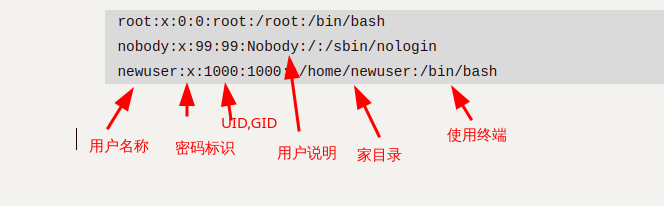

# StudyLinuxNote
## Shell
### ``
特殊符號``中的命令會被優先執行,比如:
```
ls -l `which sudo`
```
先找到sudo命令的位置,然後對該位置運行ls
### |
`|` 管道符号：前1个命令输出给后面命令使用，一般過濾

## 基础

### 连接

#### 软连接(symblic link)

软连接实际上是一个单独的文件,与被连接文件有不同的inode和block,只是软连接文件的block中存储着被连接文件的位置信息,删除被连接文件,软连接文件仍然存在,只是指向的是无效连接.

使用场景:管理不同版本的文件,给使用的版本文件创建软连接来确定文件名.

#### 硬连接(hard link)

文件系统中的文件实际上是指向inode的链接,硬链接只会创建另一个文件,其中包含指向同一个inode的链接.删除一个文件时,文件系统会移除一个指向底层inode的链接,只有删除指定inode的所有链接之后,才会删除inode.

使用场景:备份重要文件,防止"误删"

#### 区别


- 软连接可以跨文件系统使用,硬连接只在同一个文件系统有效.
- 如果创建连接后移动原文件,软连接会失效,硬连接依然有效
- 删除原文件,硬连接依旧有效,软连接仍然存在但指向的是无效连接

### 命令别名

使用`alias`命令可以设置命令别名.常见用法:

```bash
# 查看所有别名
alias

# 查看ll别名对应的命令
alias ll

# 设置命令别名
alias ll=`ls -l`
```

可以在`~/.bashrc`,`/etc/profile`等设置环境变量的文件中写入alias命令来达到配置永久生效

可以使用`unalias`命令来取消别名

## Command

### vim
查看行号: `:set nu` or `:set number`
批量选择: `ctrl + v`

### 查看日志
如果日志文件很大的话,使用vi,vim会导致内存占用过大,可能卡死,使用cat命令显示不全
#### head/tail
head 显示前几行,tail显示后几行
tail -f 监控一个文件
#### less/more
按页查看文件内容
#### wc
统计文件内容,比如行数

### 查询命令位置
#### which/whereis
which显示命令的位置:
```
$ which sudo
/usr/bin/sudo
```
whereis查询命令及相关文件的位置
```
$ whereis sudo
sudo: /usr/bin/sudo /usr/lib/sudo /usr/share/man/man8/sudo.8.gz
```
### 文件命令

#### 文件操作命令

##### 文件排序（sort）
```markdown
- `sort -n`: 将内容识别为数字进行排序
- `-k 2`: 指定按第二列排序（支持多列顺序排序）
- `-r`: 降序排列（从大到小）
- `-t ':'`: 设置冒号为列分隔符
```

```
$ sort -n 333.txt | uniq -c 
    5 1
    8 2
    5 3
    1 4
    1 5
    1 10
```

##### 文件去重（uniq）

```markdown
- 需先排序后使用（仅处理相邻重复行）：
sort 333.txt | uniq -c  # -c统计重复次数
```
二次排序示例：

```bash
sort 333.txt | uniq -c | sort -rnk2  # 按第二列数值降序
```

#### 文件属性

##### 查看文件属性（ls）

```markdown
`ls -li` 输出解析：
```
total 4374484
611553	drwxr-xr-x	1		user	user		0		Apr 19 17:26		test
inode	权限		硬链数量 	所有者 所属组	文件大小	修改时间		文件名

```

权限字段详解：
- 首字符类型：`-`普通文件, `d`目录, `l`软链接, `c`字符设备, `b`块设备, `s`套接字, `p`管道
- 后续9字符：三组rwx权限（所有者|所属组|其他人）
```

##### 文件类型(file)

linux下的文件拓展名仅仅用于展示,并不用来区分文件类型,linux文件类型(`ls -l`):

1. `-`file类型,范围较广
2. `d`目录(directory)
3. `l`软连接
4. `c`字符设备char特殊文件,不断输出,吸入
5. `b`块设备block文件
6. `s`套接字socket文件
7. `p`管道文件

使用`file`命令可以显示详细类型信息

#### 文件存储机制

##### inode与block结构
| 组件  | 作用                                 | 查看命令 |
| ----- | ------------------------------------ | -------- |
| inode | 存储元数据+block指针（不包含文件名） | `df -i`  |
| block | 存储文件内容（最小单位4KB）          | `df -h`  |

##### 文件访问流程
1. 通过文件名在目录block中查找inode号
2. 读取inode元数据校验权限
3. 通过block指针访问文件内容

#### 空间占用分析

##### 查看文件空间占用(stat)

```bash
$ stat test
  File: test
  Size: 0               Blocks: 0 
```

创建空文件时通常只创建一个inode,创建非空文件时,就会创建最少一个inode和一个block,磁盘的inode和block数量是在磁盘格式化的时候确定的.
一个block默认占用4k空间,如果文件数据不到4k,则占用一个block(其他文件无法使用),否则占用多个block

##### 查看目录空间占用(du)

```markdown
`du -sh /*` 参数说明：
- `-s`：显示总用量（不展开子目录）
- `-h`：人性化单位显示（自动转换KB/MB/GB）
```

### 日期与时间

#### date
date [选项]... [+格式]
常用格式如下:

- %F 完整日期格式，等价于 %Y-%m-%d
- %Y 年份
- %m 月份
- %d 日期
- %H 0-23小时
- %M 分钟
- %S 秒
- %s 自UTC 时间 1970-01-01 00:00:00 以来所经过的秒数
date -d 按照给定的描述显示时间,比如 `date -d '-1 day'`,`date -d '1 day'`.  
date -s 修改时间,比如:`date -s '20221111'`.  
#### ntpdate
ntpdate是通过网络进行时间同步的工具,例如:
```
ntpdate ntp1.aliyun.com
```
使用阿里云的时间服务器进行同步
#### timedatectl
修改時區:
`timedatectl I set-timezone Asia/Shanghai`

### 查询与过滤

#### find

在指定目录中查找文件

- `-type`指定查找文件类型,`bcdpflsD`
- `-name`文件名
- `-size`根据大小查找文件,`find -size +10k`,`find -size -100M`
- `-mtime`根据修改时间查找文件,找出7天之前的文件:`find -mtime +7`
- `-maxdepth`指定find查找的最大深度,默认为全部

综合案例:
找出/etc/目录下以`.conf`结尾的大于10kb修改时间是7天之前的文件:

```bash
find /etc/ -type f -name "*.conf" -size +10k -mtime +7
```

##### 与其他命令共用

1. 使用``包裹find命令:
   ```bash
   cp `find /etc/ -type f -size +10k -mtime +7` /tmp/
   ```

   ```bash
   tar zcf /tmp/find.tar.gz `find /root/find/ -type f -name '*.txt'`
   ```

   

2. 使用`xargs`:
   xargs可以和管道配合,将管道传递的字符串转换为命令可以识别的参数:

   ````bash
   find -name "*.cfg" | xargs cp -t /etc/
   ````

   ```bash
   # 使用-I选项可以自定义替换字符串
   echo 'find.tar.gz' | xargs -I {} tar zcf {} ./* 
   ```

   

3. 使用find的`-exec`参数:
   `-exec`表示find找出文件后要执行的命令,其中`{}`表示前面find命令找出的文件.`\;`表示命令结束,固定格式.

   ```bash
   find /etc/ -type f -name '*.txt' -exec ls -lh {} \;
   ```

   #### grep

   `grep 'root' /etc/passwd`

   - `-n`显示行号
   - `-v`取反,常用于取排除项`grep -v 'root' /etc/passwd`
   - `-i`过滤忽略大小写

   grep命令常用在管道中:

   ```bash
   # 过滤名字为crond的进程
   ps -ef | grep 'crond'
   ```

   

## 用户/用户组管理

linux是一个多用户系统,每个用户有一个标记即`UID`,`GID`.

### `UID`规律

- root:uid=0
- 普通用户:uid>=1000,需要手动创建,无法对系统进行修改,只拥有当前家目录的权限
- 虚拟用户:uid<1000,也叫做傀儡用户,用于服务,进程运行使用的用户,无法直接使用

### 用户相关文件

Linux系统创建用户相关的文件:

1. `/etc/passwd`存放用户信息
2. `/etc/shadow`存放用户密码
3. `/etc/group`用户组信息
4. `/etc/gshadow`用户组密码信息,几乎不会给用户组设置密码

/etc/passwd文件详情:

```bash
root:x:0:0:root:/root:/bin/bash
nobody:x:99:99:Nobody:/:/sbin/nologin
newuser:x:1000:1000::/home/newuser:/bin/bash
```



/etc/shadow:

用户名:用户密码:过期时间(默认不过期)

/etc/group:

```bash
root:x:0:newuser,testuser
bin:x:1:
ademon:x:2:
```

用户组名字:密码:gid:组里面额外的用户.

#### `/etc/skel`目录

`/etc/skel`目录下存储着新用户的家目录的模板,创建新用户时系统会复制该目录下的所有内容到新用户的家目录.

如果命令行变成了类似`-bash-4.2$`的样子,则表示用户的家目录没有或家目录下的配置文件消失(比如`~/.bashrc`,`~/.bash_profile`),可以通过复制`/etc/skel/.bash*`来解决(需要手动重新登录)

### 用户管理

#### useradd

| useradd选项 | 说明           |
| :---------- | -------------- |
| -U          | 指定用户uid    |
| -s          | 指定命令解释器 |
| -M          | 不创建家目录   |
| -g          | 指定用户组     |

#### passwd

`passwd --stdin`非交互式设置密码

#### userdel

`userdel -r`删除用户及家目录

#### usermod

修改用户信息,比如用户权限

#### 查看用户信息

1. `id` 查询用户的uid,gid,用户组信息,检查用户是否存在
2. `whoami`查询当前用户名字
3. `w`当前登录的用户的信息
4. `last`用户的登录情况
5. `lastlog`所有用户最近1次的登录情况

#### groupadd

创建用户组
`groupadd -g 1111`指定用户组gid

### 权限管理

linux主要权限是`r,w,x`:

1. `r`:read 是否可读
2. `w`:write 是否可写
3. `x`:execute 是否可执行(一般是命令,脚本)

`ls -l`指令显示的权限为9位权限,3位分为一组,每组分别表示:

1. 所有者的权限
2. 用户组的权限
3. 其他人的权限

#### 权限的计算

`r`对应4,`w`对应2,`x`对应1,`-`对应0(无权限),通过权限的数字的和可以表示一组权限,例如:

`777`表示三组权限都是`rwx`
`741`表示用户权限为`rwx`,所在组为`r--`,其他人为`--x`

#### 修改权限

##### chmod(change mode)

使用数字或字母的形式修改文件/目录的权限

```bash
chmod 777 test.txt
```

通过字母的形式:

- `a`代表所有(u,g,o)
- `u`代表用户权限组
- `g`代表用户组权限组
- `o`代表其他用户权限组

```bash
chmod a+rwx test.txt

chmod u+rwx,g+rx,o+x test.txt
```

##### chown(change owner)

修改文件所有者,用户组,该命令几乎仅root用户使用

#### 文件权限详情

1. `r`权限表示可以读取文件内容
2. `w`权限表示可以修改文件内容,若无`r`权限配合,则只能追加,而不能修改
3. `x`权限表示可以执行文件(命令,脚本),还需要`r`权限配合


#### 目录文件详情

1. `r`权限表示可以查看目录内容,需要与`x`权限配合(rx)
2. `w` 权限表示可以在目录中创建,删除,重命名文件,需要`rx`权限配合(rwx)
3. `x`权限表示可以进入目录,可以访问目录下的文件属性(rx,rwx)

| 日常操作           | 需要的权限    |
| ------------------ | ------------- |
| 查看文件内容       | 文件的r权限   |
| 编辑或修改文件内容 | 文件的rw权限  |
| 执行脚本/命令      | 文件的rx权限  |
| 查看目录内容       | 目录的rx权限  |
| 创建/删除文件      | 目录的rwx权限 |
| 重命名             | 目录的rwx权限 |

#### 特殊权限

特殊权限是代替`x`权限位,若文件无执行权限,特殊权限显示为大写(如`S`或`T`)

##### setuid(4)

setuid是对可执行的二进制程序文件进行设置,设置后命令的执行者(必须要有执行权限x)会以命令所有者的身份来执行命令,仅作用于用户权限位

添加:

```bash
chmod u+s /usr/bin/passwd
# 或:
chmod 4755 /usr/bin/passwd
```

应用:
```bash
-rwsr-xr-x. 1 root root 27856 4月   1 2020 /usr/bin/passwd
```

`/usr/bin/passswd`文件设置了setuid,使普通用户也能临时变成root来间接的修改`/etc/passwd`文件,来修改自己的密码,仅作用于用户组权限位

##### setgid(2)

setgid同样是对可执行的二进制程序文件设置,设置后命令的执行者的组身份(必须要有执行权限x)会升级成命令所有者的组身份

##### sticky BIT(1)

stickyBIT是对目录进行设置的,设置后的目录每个用户都可以在下面创建文件,但是只有文件的创建者和root可以管理自己的文件,仅作用于其他用户权限位

添加:

```bash
# 只能在o上面加
chmod o+t /tmp
```

应用:

```bash
drwxrwxrwt  17 root root  440 Apr 23 02:09 tmp
```

`tmp`文件夹中使用了`sticky BIT`权限来使所有用户都可以在此目录下创建和管理自己的文件

#### 特殊属性

使用`chattr`命令可以给文件添加一些特殊属性:

- `chattr +a test.txt`,a属性,appen,表示只能追加
- `chattr +i test.txt`,i属性 immutable,不朽的,防止误删

使用`lsattr`命令可以查看这种特殊属性