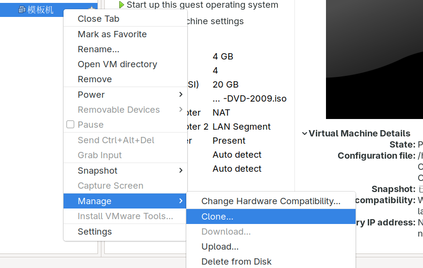
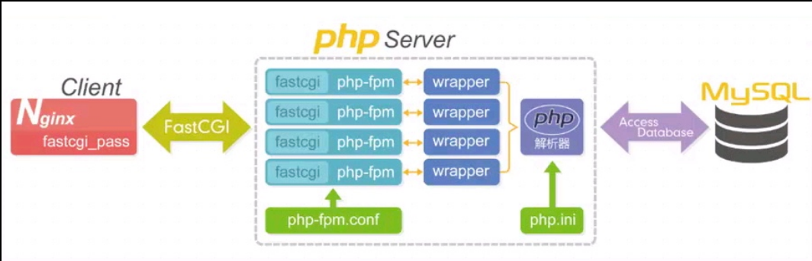
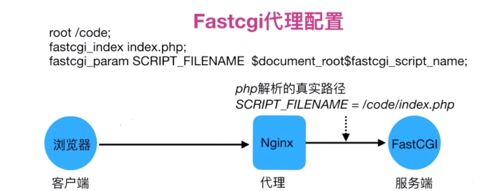
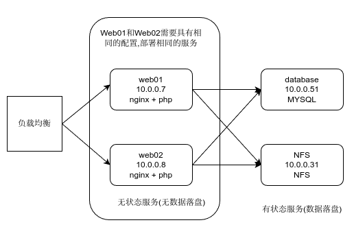
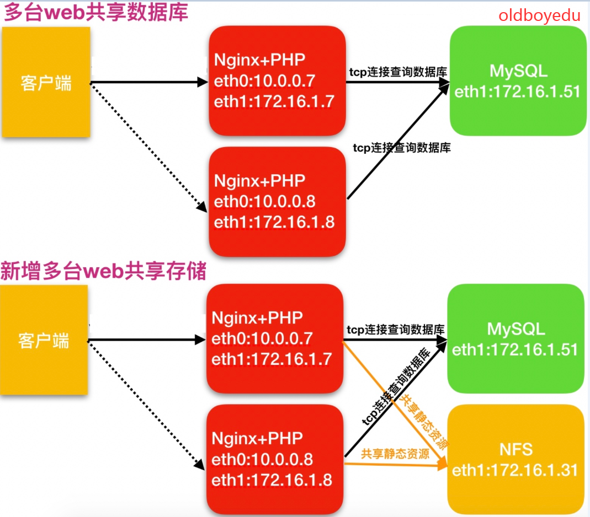

# 架构部署

## 配置

### 修改默认yum源

1. 备份

```stylus
mv /etc/yum.repos.d/CentOS-Base.repo /etc/yum.repos.d/CentOS-Base.repo.backup
```

2. 下载新的 CentOS-Base.repo 到 /etc/yum.repos.d/

```awk
curl -o /etc/yum.repos.d/CentOS-Base.repo https://mirrors.aliyun.com/repo/Centos-7.repo
```

3. 运行``yum makecache`生成缓存

4. 安装epel扩展仓库源:
   ```
   wget -O /etc/yum.repos.d/epel.repo https://mirrors.aliyun.com/repo/epel-7.repo
   ```

5. 检查
   ```bash
   $ yum repolist
   Loaded plugins: fastestmirror
   Loading mirror speeds from cached hostfile
    * base: mirrors.aliyun.com
    * extras: mirrors.aliyun.com
    * updates: mirrors.aliyun.com
   epel                                                 | 4.3 kB     00:00     
   (1/3): epel/x86_64/updateinfo                          | 1.0 MB   00:00     
   (2/3): epel/x86_64/group                               | 399 kB   00:00     
   (3/3): epel/x86_64/primary_db                          | 8.7 MB   00:00     
   repo id             repo name                                         status
   base/7/x86_64       CentOS-7 - Base - mirrors.aliyun.com              10,072
   epel/x86_64         Extra Packages for Enterprise Linux 7 - x86_64    13,791
   extras/7/x86_64     CentOS-7 - Extras - mirrors.aliyun.com               526
   updates/7/x86_64    CentOS-7 - Updates - mirrors.aliyun.com            6,173
   repolist: 30,562
   ```

### 安装基础软件包

```bash
yum -y install vim wget net-tools lrzsz tree bash-completion.noarch bash-completion-extras.noarch ntpdate lsof
```

### 关闭NetworkManager和firewalld

`````
systemctl disable --now NetworkManager firewalld
`````

### 关闭selinux防火墙

临时退出:

```
[root@centos1 yum.repos.d]# getenforce 0
Enforcing
[root@centos1 yum.repos.d]# setenforce 0
[root@centos1 yum.repos.d]# getenforce 0
Permissive
```

永久退出

```bash
[root@centos1 yum.repos.d]# cat /etc/selinux/config 

# This file controls the state of SELinux on the system.
# SELINUX= can take one of these three values:
#     enforcing - SELinux security policy is enforced.
#     permissive - SELinux prints warnings instead of enforcing.
#     disabled - No SELinux policy is loaded.
SELINUX=enforcing
# SELINUXTYPE= can take one of three values:
#     targeted - Targeted processes are protected,
#     minimum - Modification of targeted policy. Only selected processes are protected. 
#     mls - Multi Level Security protection.
SELINUXTYPE=targeted 


[root@centos1 yum.repos.d]# sed -i '7c SELINUX=disabled' /etc/selinux/config 
```

### 调整单个进程打开的最大文件数量

`````
echo '* - nofile 65535' >> /etc/security/limits.conf
`````

### 优化ssh

```
#1.创建普通用户
#2.禁止root登录
#3.禁用密码登录
#4.优化:
vim /etc/ssh/sshd_config 
UseDNS no	#加快登录速度
```

 ### bash颜色优化

```
vim /etc/profile
export PS1="[\[\e[34;1m\]\u@\[\e[0m\]\[\e[32;1m\]\h\[\e[0m\]\[\e[31;1m\] \W\[\e[0m\]]\\$"
```

### 重启+做快照

## 拓展服务器

目前拓展两台服务器:

1. 10.0.0.41 172.16.1.41
2. 10.0.0.7 172.16.1.7

### 克隆



### 配置

1. 修改主机名
   `hostnamectl set-hostname backup`

2. 修改IP地址

   `vim /etc/sysconfig/network-scripts/ifcfg-eth1`
   `vim /etc/sysconfig/network-scripts/ifcfg-eth0`
   修改两个网卡的IP地址

3. 做快照

4. 创建ssh连接

## 项目服务架构架构

Nginx服务不能处理动态请求.所以需要php,python等语言编写的动态服务处理请求

### 分类

常见的架构分类:

1. LNMP linux nginx mysql php
2. LNMT linux nginx mysql tomcat
3. LAMP linux apache mysql php
4. LNMT linux nginx mysql python

### LNMP架构

linux nginx mysql php

当用户发起http请求,请求会被nginx处理,如果是静态资源请求,nginx会直接返回资源,但如果是动态请求,Nginx则通过fstcgi协议转交给后端的PHP程序处理.


#### 工作流程



1.用户通过`http`协议发起请求，请求会先抵达`LNMP`架构中的`Nginx`

2.`Nginx`会根据用户的请求进行判断，这个判断是由哪个`Location`进行完成

3.判断用户请求的是静态页面，`Nginx`直接进行处理

4.判断用户请求的是动态页面，`Nginx`会将该请求交给`fastcgi`协议下发

5.`fastgi`会将请求交给`php-fpm`管理进程, `php-fpm`管理进程接收到后会调用具体的工作进程`warrap`

6.`warrap`进程会调用`php`程序进行解析,如果只是解析代码`php`直接返回

7.如果有查询数据库操作，则由`php`连接数据库(用户 密码 IP)发起查询的操作

8.最终数据由*`mysql->php->php-fpm->fastcgi->nginx->http->user`

#### 安装

首先根据上面的教程安装nginx

使用第三方扩展源安装php:

```
[root@nginx ~]# vim /etc/yum.repos.d/php.repo
[php-webtatic]
name = PHP Repository
baseurl = http://us-east.repo.webtatic.com/yum/el7/x86_64/
gpgcheck = 0

[root@nginx ~]# yum -y install php71w php71w-cli php71w-common php71w-devel php71w-embedded php71w-gd php71w-mcrypt php71w-mbstring php71w-pdo php71w-xml php71w-fpm php71w-mysqlnd php71w-opcache php71w-pecl-memcached php71w-pecl-redis php71w-pecl-mongodb --nogpgcheck
```

> 也可以手动上传rpm缓存,然后使用`yum localinstall ./*.rpm`

编辑`/etc/php-fpm.d/www.conf `文件

```
; RPM: apache Choosed to be able to access some dir as httpd
;user = apache
user = www
; RPM: Keep a group allowed to write in log dir.
;group = apache
group = www
```

安装mariadb-server

```
[root@nfs ~]#yum install -y mariadb-server
[root@nfs ~]#systemctl enable --now mariadb

# 设置管理员密码
[root@nfs ~]#mysqladmin password 'lzy123.com'
[root@nfs ~]#mysql -uroot -p'lzy123.com'
```

#### 配置

##### fastcgi

fastcgi模块允许nginx将请求传递给FastCGI服务器.

Fastcgi代理配置语法:

设置fastcgi服务器的地址,将http代理到哪个fastcgi服务端接口,可以指定为域名或IP地址以及端口(TCP)或作为UNIX Domain Socket路径:

```
Syntax: fastcgi_pass address;
Default: —
Context: location, if in location

#语法示例
fastcgi_pass localhost:9000;
fastcgi_pass unix:/tmp/fastcgi.socket;
```

示例:

```
server{
	listen 80;
	server_name www.test.com;
	
	location / {
		root /code/;
		index index.html;
	}
	
	location ~* \.php$ {
		fastcgi_pass 127.0.0.1:9000;
	}
}
```

> 此设置需要与php-fpm的conf文件匹配,否则会报502错误.

设置fastcgi默认的首页文件,需要和fastcgi_param一起设置

```
Syntax: fastcgi_index name;
Default: —
Context: http, server, location
```

通过fastcgi_param设置php内置变量，并将设置的变量传递到后端的fastcgi服务器

```
Syntax: fastcgi_param parameter value [if_not_empty];
Default: —
Context: http, server, location

#语法示例
fastcgi_index index.php;
fastcgi_param SCRIPT_FILENAME /code$fastcgi_script_name;
```



> 以下示例展示了PHP所需的最低配置：
>
> ```
> # SCRIPT_FILENAME参数在PHP中用于确定脚本名称，而QUERY_STRING参数则用于传递请求参数。
> fastcgi_param SCRIPT_FILENAME /home/www/scripts/php$fastcgi_script_name;
> fastcgi_param QUERY_STRING    $query_string;
> ```
>
> 对于处理POST请求的脚本，还需以下三个参数：
>
> ```
> fastcgi_param REQUEST_METHOD  $request_method;
> fastcgi_param CONTENT_TYPE    $content_type;
> fastcgi_param CONTENT_LENGTH  $content_length;
> ```
>
> 

配置文件示例:

```
[root@nfs conf.d]#vim php.conf
server {
        listen 83;
        server_name _;

        location / {
                root /code;
                index index.php index.html;
        }

        location ~ \.php$ {
                root /code;
                fastcgi_pass 127.0.0.1:9000;
                fastcgi_param SCRIPT_FILENAME $document_root$fastcgi_script_name
                include fastcgi_params;
        }
}

[root@nfs conf.d]# vim /code/index.php
<?php
        phpinfo();
?>
```

可以访问通,然后测试mysql连接:

```
<?php
    $servername = "localhost";
    $username = "root";
    $password = "lzy123.com";

    // 创建连接
    $conn = mysqli_connect($servername, $username, $password);

    // 检测连接
    if (!$conn) {
        die("Connection failed: " . mysqli_connect_error());
    }
    echo "php可以连接MySQL...";
?>
```

#### 部署

##### wordpress

首先新建一个wordpress.conf

```
[root@nfs conf.d]#cat wordpress.conf 
server {
    listen 84;
    server_name _;
    root /code/wordpress;
    index index.php index.html;

    location ~ \.php$ {
        root /code/wordpress;
        fastcgi_pass   127.0.0.1:9000;
        fastcgi_index  index.php;
        fastcgi_param  SCRIPT_FILENAME $document_root$fastcgi_script_name;
        include fastcgi_params;
    }
}
```

然后获取wordpress最新版文件,解压并部署wordpress:

```
[root@nfs code]#wget https://cn.wordpress.org/wordpress-5.0.3-zh_CN.tar.gz
[root@nfs code]#tar xf wordpress-5.0.3-zh_CN.tar.gz 
[root@nfs code]#chown -R www:www /code/wordpress
```

wordpress需要依赖数据库,新建一个数据库:

```
[root@nfs code]#mysql -uroot -plzy123.com
MariaDB [(none)]> create database wordpress;
```

> 如果上传文件时报错413,是nginx上传文件的大小限制,修改配置文件即可

#### 拆分架构

下面把单体架构拆分成下面的多服务器架构:



##### 拆分数据库

由于单台服务器运行`LNMP`架构会导致网站访问缓慢，当内存被占满时，很容易导致系统出现`oom`从而kill掉MySQL数据库，所以要将web和数据库进行独立部署。

数据库拆分后解决了什么问题

1.缓解web网站的压力
2.增强数据库读写性能
3.提高用户访问速度

首先新建一个IP为10.0.0.51的虚拟机(db1),然后备份web01上的数据库:

```
[root@web01 ~]#mysqldump -uroot -p'lzy123.com' -A > mysql-all.sql
```

拷贝数据库文件到db1服务器:

```
[root@web01 ~]#scp ./mysql-all.sql root@10.0.0.51:/tmp
```

在db1服务器上部署mariadb并恢复数据:

```
[root@db01 ~]#yum install -y mariadb mariadb-server
[root@db01 ~]#systemctl enable --now mariadb
[root@db01 ~]#mysqladmin password 'lzy123.com'
[root@db01 ~]#mysql -uroot -p'lzy123.com' < /tmp/mysql-all.sql
```

授权用户用于远程连接

```
[root@db01 ~]#mysql -uroot -plzy123.com
mysql> grant all on  *.* to lzy@'%' identified by 'lzy123.com';
# grant all 授予所有权限
# *.* 对于所有数据库库的所有表
# lzy@'%' 用户名lzy,%代表允许所有网段连接,可以配置为localhost,那么只有本地能够连接
# identified by 密码

# 刷新权限
mysql> flush privileges;
```

修改wordpress设置(web01):

```
vim /code/wordpress/wp-config.php

define('DB_NAME', 'wordpress');

/** MySQL数据库用户名 */
define('DB_USER', 'lzy');

/** MySQL数据库密码 */
define('DB_PASSWORD', 'lzy123.com');

/** MySQL主机 */
define('DB_HOST', '172.16.1.51');
```

在web01机器上测试一下:

```
# 因为root没有配置@'%',所以只允许本地连接
[root@web01 ~]#mysql -h 172.16.1.51 -uroot -plzy123.com
ERROR 1045 (28000): Access denied for user 'root'@'172.16.1.7' (using password: YES)

[root@web01 ~]#mysql -h 172.16.1.51 -ulzy -plzy123.com
```

> 

##### 扩展web节点

为什么要扩展多台web节点

单台web服务器能抗住的访问量是有限的，配置多台web服务器能提升更高的访问速度。

扩展多台web解决了什么问题

*1.单台web节点如果故障，会导致业务down机*

*2.多台web节点能保证业务的持续稳定，扩展性高*

*3.多台web节点能有效的提升用户访问网站的速度*

*3.多台web节点技术架构组成，如下图所示*


克隆一台web服务器(web02),IP为10.0.0.8

```
[root@web02 ~]# groupadd -g666 www
[root@web02 ~]# useradd -u666 -g666 www

# 安装Nginx和PHP
[root@web02 ~]# scp -rp root@172.16.1.7:/etc/yum.repos.d/* /etc/yum.repos.d/
[root@web02 ~]# scp -rp root@172.16.1.7:/etc/pki/rpm-gpg/* /etc/pki/rpm-gpg/

[root@web02 ~]# yum install nginx -y
[root@web02 ~]# yum -y install php71w php71w-cli php71w-common php71w-devel php71w-embedded php71w-gd php71w-mcrypt php71w-mbstring php71w-pdo php71w-xml php71w-fpm php71w-mysqlnd php71w-opcache php71w-pecl-memcached php71w-pecl-redis php71w-pecl-mongodb

# 导入nginx配置文件
[root@web02 ~]# scp -rp root@172.16.1.7:/etc/nginx /etc/

# 导入php配置文件
[root@web02 ~]# scp -rp root@172.16.1.7:/etc/php-fpm.d /etc/

# 将web01的产品代码打包传输到web02服务器上
[root@web01 ~]# tar czf code.tar.gz /code
[root@web01 ~]# scp code.tar.gz root@172.16.1.8:/tmp

#在web02服务器上进行解压,拷贝过来的文件已经包含了权限信息
[root@web02 ~]# tar xf /tmp/code.tar.gz -C /

[root@web02 ~]#systemctl enable --now nginx php-fpm
```

##### 静态数据挂载到NFS

当web节点出现多台时,会导致用户上传的静态资源仅上传至一台web服务器,另一台web服务器就无法访问当该静态资源,因此需要将静态资源服务器部署到单独的独立服务器中

新增一台nfs存储解决了什么问题

1. 保证了多台web节点静态资源一致。

2. 有效节省多台web节点的存储空间。

3. 统一管理静态资源，便于后期推送至CDN进行静态资源加速



nfs配置文件:

```
[root@nfs ~]#vim /etc/exports
/data/zh 172.16.1.0/24(rw,sync,all_squash)
/data/blog 172.16.1.0/24(rw,sync,all_squash)
```

在web01上测试:

```
[root@web01 ~]#showmount -e 172.16.1.31
Export list for 172.16.1.31:
/data/blog 172.16.1.0/24
/data/zh   172.16.1.0/24
```

将web01上的静态资源推送到nfs:

```
[root@web01 wp-content]#scp -r /code/wordpress/wp-content/uploads/2025 root@172.16.1.31:/data/blog/  
```

然后挂载:

```
[root@web01 wp-content]#mount -t nfs 172.16.1.31:/data/blog /code/wordpress/wp-content/uploads
[root@web02 ~]#mount -t nfs 172.16.1.31:/data/blog /code/wordpress/wp-content/uploads

# 修改目录权限
[root@nfs blog]#chown -R nfsnobody:nfsnobody 2025/
```


