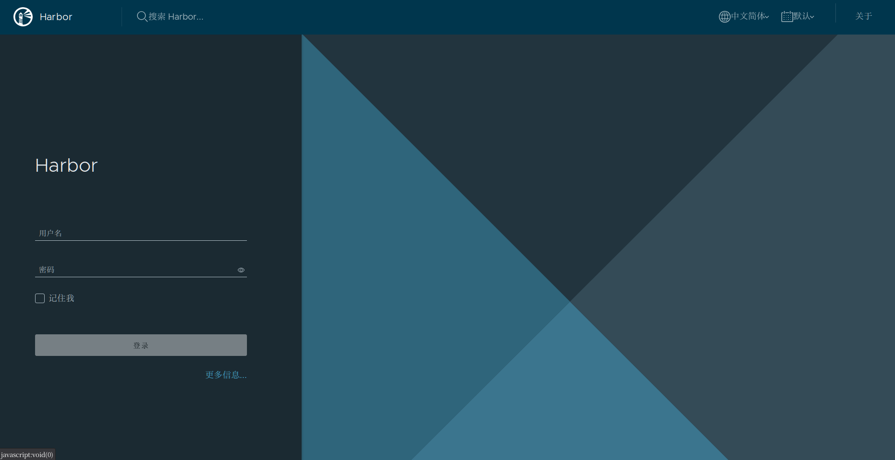
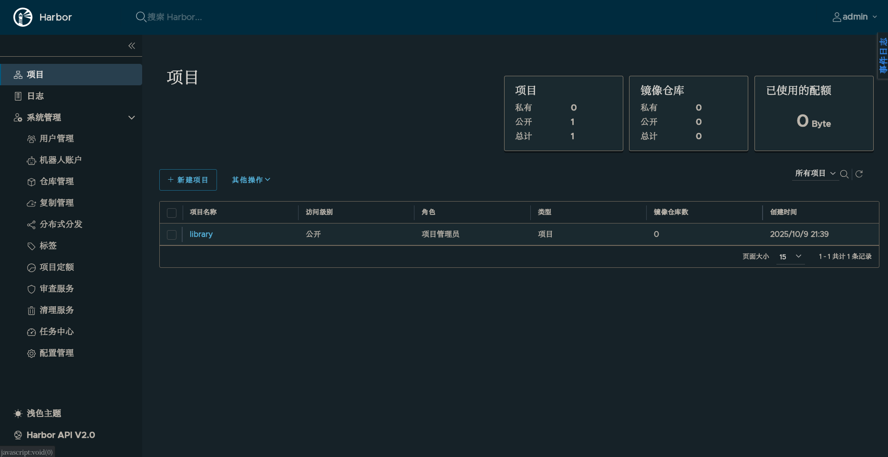
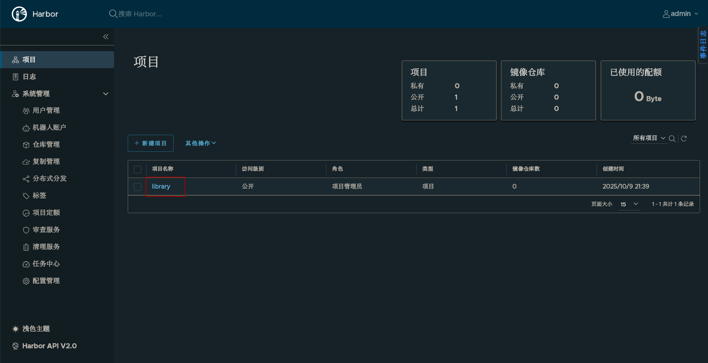
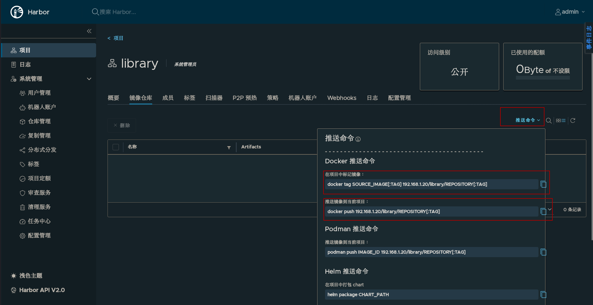
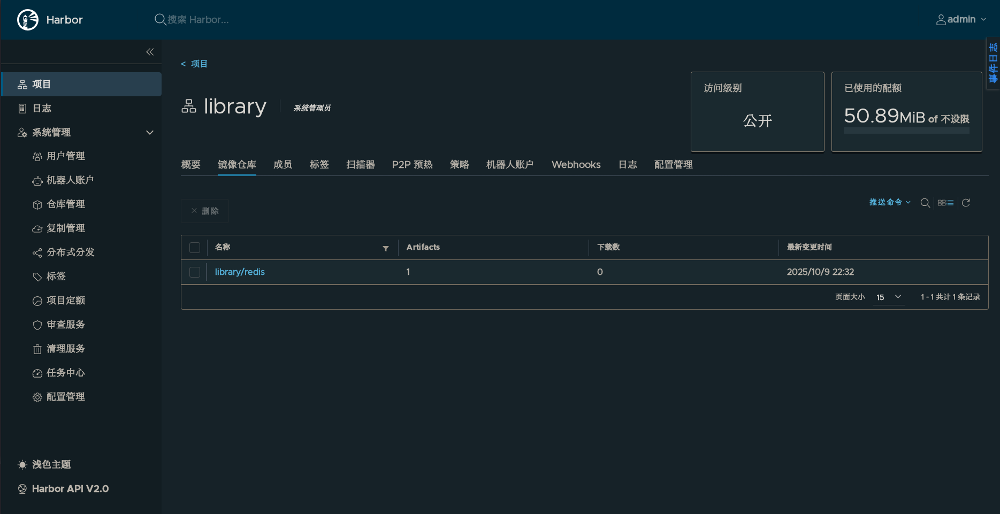

# Harbor

Harbor是一个开源的可独立部署的镜像仓库

内部网络需要有一个仓库存放常用的镜像，下载镜像方便，不用消耗公网带宽。同时内部服务生成的镜像也可以上传到私有仓库中。

## 准备

安装docker和docker compose

## 安装

到github仓库上`https://github.com/goharbor/harbor/releases`下载安装包

解压

```
tar xvf harbor-offline-installer-v2.12.2.tgz
```

复制配置文件模板

```
cd /opt/harbor
cp harbor.yml.tmpl harbor.yml
```

修改配置文件`harbor.yml`

```
vim harbor.yml
# hostname配置为ip或者域名,这里我们配置宿主机ip地址192.168.1.20
hostname: 192.168.1.20
http:
  port: 80
# 应为没有证书,所以我们删除或者注释掉https:相关配置

# 默认密码
harbor_admin_password: Harbor12345
# 数据库相关配置
datebase:
  # 数据库默认密码,正式环境中需要修改为复杂密码
  password: root123
  ...
# 数据存放位置
data_volume: /data
# 其他配置使用默认即可,配置文件主要是更改hostname和停用443,以及配置密码
```

启动docker之后运行安装脚本:

```
./install.sh
```

### 配置镜像仓库为可信仓库

配置镜像仓库为可信仓库后就可以不验证ssl证书,否则只能使用http协议

编辑`/etc/docker/daemon.json`

```
{
  "insecure-registries" : ["192.168.1.20"]
}       
```

随后重启docker

## 使用

可以通过`docker compose ps`查看容器状态

```
[root@localhost harbor]# docker compose ps
NAME                IMAGE                                 COMMAND                  SERVICE       CREATED         STATUS                   PORTS
harbor-core         goharbor/harbor-core:v2.14.0          "/harbor/entrypoint.…"   core          8 minutes ago   Up 8 minutes (healthy)   
harbor-db           goharbor/harbor-db:v2.14.0            "/docker-entrypoint.…"   postgresql    8 minutes ago   Up 8 minutes (healthy)   
harbor-jobservice   goharbor/harbor-jobservice:v2.14.0    "/harbor/entrypoint.…"   jobservice    8 minutes ago   Up 7 minutes (healthy)   
harbor-log          goharbor/harbor-log:v2.14.0           "/bin/sh -c /usr/loc…"   log           8 minutes ago   Up 8 minutes (healthy)   127.0.0.1:1514->10514/tcp
harbor-portal       goharbor/harbor-portal:v2.14.0        "nginx -g 'daemon of…"   portal        8 minutes ago   Up 8 minutes (healthy)   
nginx               goharbor/nginx-photon:v2.14.0         "nginx -g 'daemon of…"   proxy         8 minutes ago   Up 8 minutes (healthy)   0.0.0.0:80->8080/tcp, [::]:80->8080/tcp
redis               goharbor/redis-photon:v2.14.0         "redis-server /etc/r…"   redis         8 minutes ago   Up 8 minutes (healthy)   
registry            goharbor/registry-photon:v2.14.0      "/home/harbor/entryp…"   registry      8 minutes ago   Up 8 minutes (healthy)   
registryctl         goharbor/harbor-registryctl:v2.14.0   "/home/harbor/start.…"   registryctl   8 minutes ago   Up 8 minutes (healthy)   
```

通过ip访问web页面"http://192.168.1.20"



默认账号是admin，默认密码为Harbor12345



日常维护

```
cd /opt/harbor
# 删除容器
docker-compose down
# 启动
docker-compose up -d
# 也可以使用stop 和start来停止和启动
docker-compose stop
docker-compose start
```

## 重启

使用有问题或者更改配置后需要进行重新启动

首先删除容器

```
docker-compose down -v
```

然后修改配置文件,或者删除数据库目录

```
# 数据目录在yml文件中配置
rm -r /data/database
rm -r /data/registry
rm -r /data/redis
```

然后运行`./prepare`脚本重新部署

## 推送镜像

首先需要配置镜像仓库为可信仓库

然后登录到Harbor镜像仓库

```
[root@localhost harbor]# docker login 192.168.1.20
Username: admin
Password: 

WARNING! Your credentials are stored unencrypted in '/root/.docker/config.json'.
Configure a credential helper to remove this warning. See
https://docs.docker.com/go/credential-store/

Login Succeeded
```

进入Harbor Web页面,查看项目以及推送地址





首先标记镜像然后推送镜像

```
# 修改标记
docker tag redis:latest 192.168.
1.20/library/redis:latest

# 推送镜像
docker push 192.168.1.20/library/redis:latest
```

可以看到已经推送的镜像



## 拉取镜像

在可以访问到harbor服务器的机器上可以无需登录直接拉取library仓库下的镜像

同样需要添加为可信仓库`"insecure-registries" : ["192.168.1.20"]`

```
[root@k8s-master01 ~]# docker pull 192.168.1.20/library/redis:latest
latest: Pulling from library/redis
82ccbaf04429: Pull complete 
fa85867e458c: Pull complete 
20770aaf8f7b: Pull complete 
3ac4f782b24c: Pull complete 
628b0785ec0d: Pull complete 
4f4fb700ef54: Pull complete 
7e44f5a6338c: Pull complete 
Digest: sha256:f05f71352c5fde19436a9905edc9f0ee6a3344a35b4aa5a183fe76020a62434a
Status: Downloaded newer image for 192.168.1.20/library/redis:latest
192.168.1.20/library/redis:latest
[root@k8s-master01 ~]# docker image ls | grep redis
192.168.1.20/library/redis                                               latest      3bd8c109f88b   6 days ago      137MB
```

