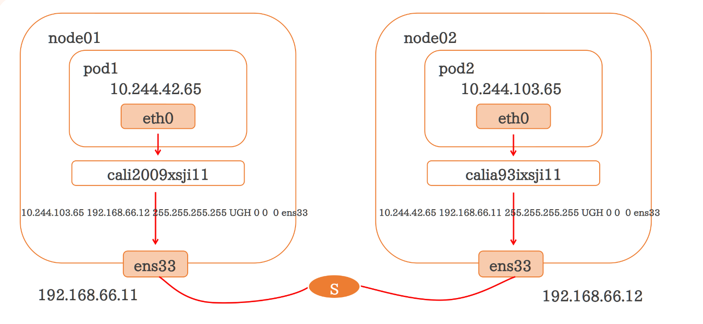
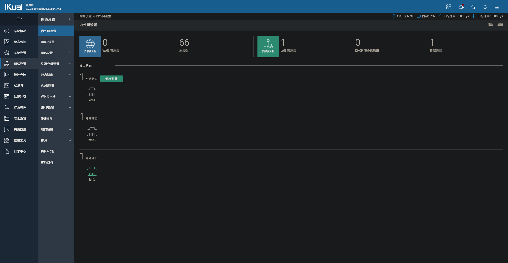

# Kubernetes

Kubernetes 是一个开源的容器编排系统，用于自动化应用容器的部署、扩展和管理。它将应用从单机解耦，统一调度到集群中运行。

Kubernetes的优势:

- 自带服务发现和负载均衡
- 存储编排(添加任何本地或云服务器)
- 自动部署和回滚
- 自动分配CPU/内存资源 - 弹性伸缩(达到阈值自动扩展节点)
- 自我修复(容器宕机时启动新容器)
- 安全(Secret)信息和配置管理

## 架构

Kubernetes集群由一个控制平面(Control Plane)和工作节点组成,每个集群至少需要一个工作节点来运行Pod

一个 Kubernetes 集群包含两种类型的资源：

- **控制面（Control Plane）** 调度整个集群
- **节点（Nodes）** 负责运行应用

节点是一个虚拟机或物理机,它在Kubernetes集群中充当工作机器的角色.

> 生产级流量的Kubernetes集群至少应具有三个节点,因为如果只有一个节点，出现故障时其对应的 [etcd](https://kubernetes.io/zh-cn/docs/concepts/architecture/#etcd) 成员和控制面实例都会丢失， 并且冗余会受到影响。你可以通过添加更多控制面节点来降低这种风险。

下面部分概述了构建一个完整且可运行的Kubernetes集群所需的各种组件.


但为了实现高可用,Master的数量需要>=3,这是由于Etcd使用RAFT选举算法,k8s官方推荐的数量为2n+1(3,5,7...)

> Master/node是旧版本的常用说法,指代一台控制平面机器
> 新版本的k8s社区逐渐使用Control Plane来代替Master,控制平面不局限在单机,可以分布在多台机器上实现高可用


k8s的微观架构:


Control Plane组件:

| 组件                 | 说明                                                                                          |
| ------------------ | ------------------------------------------------------------------------------------------- |
| api server         | k8s集群的中枢和统一入口，负责接收所有请求，进行认证、鉴权和准入控制，并将结果持久化到 etcd。同时，它也是各个控制组件之间通信的桥梁，确保集群状态与期望状态一致。        |
| etcd               | 一致且高可用的键值对数据库，用作存储Kubernetes 集群所有状态数据。  <br />*最少3个etcd可以组成etcd class集群,任意一个节点损坏,不会导致信息的丢失* |
| scheduler          | 调度器,绑定需要运行的容器和节点之间的关系,负责监视新创建的、未指定运行node的Pods,并选择节点来让 Pod 在上面运行                             |
| controller manager | 控制器,负责运行控制器进程,确保集群状态符合预期,例如进行损坏容器的重新创建                                                      |

Node组件:

| 组件         | 说明                                                  |
| ---------- | --------------------------------------------------- |
| kubelet    | 监听api server发送的配置,并通过接口调用容器运行时管理容器,报告 Node 和 Pod 状态 |
| kube proxy | 提供服务发现和负载均衡,管理集群内部网络通信                              |

扩展组件:

组件组成k8s的核心功能,除此之外还有核心扩展和可选扩展

| 核心扩展                      | 说明                            |
| ------------------------- | ----------------------------- |
| 容器运行时 (Container runtime) | 负责管理 Kubernetes 环境中容器的执行和生命周期 |
| CoreDNS                   | 提供私有的域名解析服务,网络内部除了IP还可以使用域名访问 |
| Ingress Controller        | 提供七层(应用层)的负载均衡                |

| 可选扩展       | 说明            |
| ---------- | ------------- |
| prometheus | 监控资源          |
| Dashboard  | 通过web界面进行集群管理 |
| Fedetation | 提供多k8s集群的管理能力 |

## 概念

### Pod

Pod是对一个或多个容器的**逻辑分组**,是k8s中部署的最小单位,要在集群中运行的任务,都需要部署在pod内部运行

每个pod都会有一个Pause容器:

- Pod内部第一个启动的容器
- 初始化网络栈
- 挂载需要的存储卷
- 回收僵尸进程

同一个Pod中,其他容器和pause容器共享名字空间(Network, PID, IPC)

> 使用单独的Pause容器的好处:
> 
> - Pause几乎没有访问,使用它给其他容器共享网络,PID,IPC会达到更稳定的状态
> - Pause可以杀死其他容器的僵尸进程

### kubectl

kubectl命令

`kubectl get`获取当前资源

```
kubectl get pod
    -A,--all-namespaces 查看当前所有名称空间的资源
    -n 指定命名空间,默认值是default(kube-system空间存放当前组件的资源)
    --show-labels 查看当前标签
    -l 筛选资源,key=vaule
    -o wide 展示详细信息,包括IP,分配的节点
    -w 监视,打印结果的变化状态
```

`kubectl exec`进入容器

```
kubectl exec -it pod-demo -c myapp-1 -- /bin/bash
    -c 指定容器名称CName, 可以省略,默认查看唯一的容器
```

`kubect explain`查看资源的描述

```
kubectl explain pod
kubectl explain pod.spec
```

`kubectl logs`查看日志

```
kubectl logs pod-demo -c CName
```

`kubectl describe`查看详细信息

```
kubectl describe pod pod-demo
```

`kubectl delete`删除资源

```
kubectl delete pod podname

# 删除所有pod
kubectl delete pod --all
```

## 网络

Kubernetes的网络模型假定了所有Pod都在一个可以**直接连通的扁平的**网络空间中,在私有云搭建k8s集群,需要自己实现这个网络假设,打通不同节点上的Docker容器之间的互相访问,然后运行k8s

直接连通的扁平网络空间,意味着:

- **Pod IP 唯一性**：每个 Pod 都拥有一个集群内全局唯一的 IP 地址（`Pod IP`），所有 Pod 都处于一个逻辑上的二层或三层网络中，地位平等。
- **Pod-to-Pod 通信**：
  - 无论 Pod 是调度在同一节点还是不同节点上，它们之间都可以**直接通信**，无需经过 NAT（网络地址转换）或显式的端口映射。
  - 节点（宿主机）与 Pod 之间也可以直接相互访问，无需 NAT。
- **Pod-to-Service 通信**：
  - Pod 可以通过 **Service 的虚拟 IP（ClusterIP）** 访问后端的一组 Pod。
  - 虽然 ClusterIP 本身是一个虚拟 IP，其实现（如 `iptables` 或 `ipvs` 规则）在节点上做了一次转发，但对 Pod 中的应用程序而言，**这个过程是透明的**，感知不到任何地址转换。
- **网络透明度**：应用程序无需关心网络底层细节，可以像在同一台主机上一样进行通信，网络模型对它们是透明的。

k8s网络模型的规则:

- 在不使用网络地址转换 (NAT) 的情况下，集群中的 Pod 能够与任意其他 Pod 进行通信
- 在不使用网络地址转换 (NAT) 的情况下，在集群节点上运行的程序能与同一节点上的任何 Pod 进行通信
- 每个 Pod 都有自己的 IP 地址（IP-per-Pod），并且任意其他 Pod 都可以通过相同的这个地址访问它

### CNI

借助 CNI 标准，Kubernetes 可以实现容器网络问题的解决。通过插件化的方式来集成各种网络插件，实现集群内部网络相互通信，只要实现CNI标准中定义的核心接口操作（ADD，将容器添加到网络；DEL，从网络中删除一个容器；CHECK，检查容器的网络是否符合预期等）。**CNI插件通常聚焦在容器到容器的网络通信**。


CNI的接口不是HTTP,gRPC这种接口,而是一种规范,指对可执行程序的调用程序

### 网络插件

通过CNI,容器使用不需要解决网络通信问题. 

CNI 通过 JSON 格式的配置文件来描述网络配置，当需要设置容器网络时，由容器运行时(CRI)负责执行 CNI 插件，并通过 CNI 插件的标准输入（stdin）来传递配置文件信息，通过标准输出（stdout）接收插件的执行结果。从网络插件功能可以分为五类：

- Main 插件，创建具体网络设备（bridge：网桥设备，连接 container 和 host；ipvlan：为容器增加 ipvlan 网卡；loopback：IO设备；macvlan：为容器创建一个 MAC 地址；ptp：创建一对Veth Pair；vlan：分配一个vlan设备；host-device：将已存在的设备移入容器内）
- IPAM 插件：负责分配IP地址（dhcp：容器向 DHCP 服务器发起请求，给 Pod 发放或回收IP地址；host-local：使用预先配置的 IP 地址段来进行分配；static：为容器分配一个静态 IPv4/IPv6 地址，主要用于 debug）
- META 插件：其他功能的插件（tuning：通过 sysctl 调整网络设备参数；portmap：通过 iptables 配置端口映射；bandwidth：使用 Token Bucket Filter 来限流；sbr：为网卡设置 source based routing；firewall：通过 iptables给容器网络的进出流量进行限制）
- Windows 插件：专门用于 Windows 平台的 CNI 插件（win-bridge 与 win-overlay 网络插件）
- 第三方网络插件：第三方开源的网络插件众多，每个组件都有各自的优点及适应的场景，难以形成统一的标准组件，常用有 Flannel、Calico、Cilium、OVN 网络插件

第三方的网络插件可以解决直接连通的扁平网络空间的需求

#### Pod的分配流程中组件的调度:


1. 调度器通过api server的监听获取哪些pod没有被绑定到节点上并完成调度,节点上的kubelet监听api server发现节点上需要完成pod的创建动作
2. 节点上的kubelet通过CRI(容器运行时)创建POD
3. CRI插件创建POD Sandbox和POD网络命名空间
4. CRI插件通过POD Sandbox和POD网络命名空间调用CNI插件
5. CNI插件配置POD网络
   1. Flannel CNI插件
   2. 调用Bridge CNI插件创建网桥
   3. 调用IPAM CNI插件分配IP
   4. 返回POD IP地址
6. 创建Pause容器,并将其添加到POD的网络命名空间
7. Kubelet调用CRI插件拉取应用容器镜像
8. CRI拉取应用容器镜像
9. kubelet调用CRI插件启动应用容器
10. CRI插件调用CRI来启动和配置在Pod sandbox和namespace中的应用容器

#### 第三方网络插件

第三方网络插件常见的有: flannel,Calico,Cilium


- 网络模型：封装或未封装。
- 路由分发：一种外部网关协议，用于在互联网上交换路由和可达性信息。BGP 可以帮助进行跨集群 pod 之间的网络。此功能对于未封装的 CNI 网络插件是必须的，并且通常由 BGP 完成。如果你想构建跨网段拆分的集群，路由分发是一个很好的功能。
- 网络策略：Kubernetes 提供了强制执行规则的功能，这些规则决定了哪些 service 可以使用网络策略进行相互通信。这是从 Kubernetes 1.7 起稳定的功能，可以与某些网络插件一起使用。
- 网格：允许在不同的 Kubernetes 集群间进行 service 之间的网络通信。
- 外部数据存储：具有此功能的 CNI 网络插件需要一个外部数据存储来存储数据。
  一般使用k8s apiserver的自定义资源间接保存到etcd,允许直接使用etcd会更加灵活
- 加密：允许加密和安全的网络控制和数据平面。
- Ingress/Egress 策略：允许你管理 Kubernetes 和非 Kubernetes 通信的路由控制。

##### 封装网络与非封装网络

| 特性       | 封装网络（Encapsulation）                                  | 非封装网络（Non-Encapsulation）       |
| -------- | ---------------------------------------------------- | ------------------------------ |
| **实现方式** | 在 Pod 流量外再加一层隧道封装（如 VXLAN、Geneve）                    | 直接使用底层路由，Pod 子网直接暴露            |
| **典型插件** | Flannel（VXLAN）、Calico（VXLAN 模式）、Cilium（VXLAN/Geneve） | Calico（BGP 模式）、Cilium（直接路由模式）  |
| **优点**   | - 简单，不依赖底层网络支持- 容易跨子网/跨节点打通                          | - 性能更高（无额外封装开销）- 网络路径更直观       |
| **缺点**   | - 有额外开销（额外 IP 头，CPU 处理消耗）- 排错较麻烦                     | - 依赖底层网络支持路由（如 BGP）- 部署复杂度高    |
| **适用场景** | - 环境异构、底层网络不支持直连- 先快速打通集群                            | - 底层网络可控（私有云/自建机房）- 对性能敏感的生产环境 |

封装网络:


非封装网络:


#### calico

calico是一个纯三层的虚拟网络,他没有复用docker的docker0网桥,而是自己实现的,calico网络不对数据包进行额外封装,不需要NAT和端口映射


Felix

- 管理网络接口
- 编写路由
- 编写ACL(访问控制列表)
- 报告状态

bird(BGP Client)

- BGP Client将BGP协议广播告诉剩余calico节点,从而实现网络互通

图中bird互相连接表示BGP协议的互相收发同步,非覆盖网络通过BGP协议信息将Pod IP规划为路由进一步实现路由跨域

confd

- 通过监听 etcd 以了解 BGP 配置和全局默认值的更改。Confd 根据 ETCD 中数据的更新，动态生成 BIRD 配置文件。当配置文件更改时，confd 触发 BIRD 重新加载新文件

图中的虚线有两个含义:

- 默认情况下,confd通过api server的服务间接访问etcd存储数据
- calico还支持直接向etcd中存储数据

##### 网络模式

calico有三个网络模式:

- VXLAN隧道
- IPIP隧道
- BGP直连

| 特性维度      | **BGP (Border Gateway Protocol)**                                       | **IPIP (IP-in-IP)**                                      | **VXLAN (Virtual Extensible LAN)**                        |
| --------- | ----------------------------------------------------------------------- | -------------------------------------------------------- | --------------------------------------------------------- |
| **封装机制**  | **无封装**。依靠标准BGP路由协议在底层网络分发Pod的路由信息。                                     | **IP-in-IP 封装**。将原始IP包（Pod IP）整个放入另一个IP包（Node IP）中。      | **VXLAN 封装**。将原始以太网帧（L2）放入UDP包（L4）中传输。                    |
| **性能**    | **最高**。无任何隧道封装开销（无Tunnel Header），纯三层路由转发。                               | **中等**。有IPIP封装头（约20字节）的开销，会增加MTU问题可能性。                   | **较低**。有更大的封装头（约50字节），包括外层UDP、VXLAN头等，开销最大。               |
| **网络要求**  | **要求高**。需要底层网络基础设施（路由器/交换机）支持BGP协议，或者工作在**同子网内**。                       | **要求较低**。通常能跨不同子网工作，但需要节点间IPIP隧道可达。                      | **要求最低**。通用性最强，仅需节点间IP/UDP协议可达（通常UDP端口8472），能轻松穿越任何三层网络。  |
| **安全性**   | **依赖底层**。Pod之间的通信是明文的，安全性依赖于底层网络的安全策略。                                  | **依赖底层**。通信在IPIP隧道中也是明文的，安全性同样依赖底层网络。                    | **可选加密**。Calico支持**IPsec加密**对VXLAN流量进行端到端加密，提供额外的安全层。     |
| **复杂性**   | **配置复杂**。需要与网络团队协作，在路由器上配置BGP对等体（peering）。                              | **配置简单**。无需变动底层网络，所有配置由Calico在节点上自动完成。                   | **配置简单**。同IPIP，无需变动底层网络，全由Calico自动管理。                     |
| **适用场景**  | **数据中心、私有云**。网络设备可控且支持BGP，追求极致性能和低延迟的环境。                                | **跨子网/云混合环境**。当节点不在同一网络子网，且底层网络不支持BGP时的一种折中方案。           | **严格受限的网络环境、公有云**。需要穿越严格防火墙策略或云厂商网络，或有加密需求的场景。            |
| **工作原理图** | `[Pod A] -> [Node A] -> (路由表) -> [路由器] -> (路由表) -> [Node B] -> [Pod B]` | `[Pod A] -> [Node A] -> [IPIP隧道] -> [Node B] -> [Pod B]` | `[Pod A] -> [Node A] -> [VXLAN隧道] -> [Node B] -> [Pod B]` |

###### VXLAN

VXLAN(Virtual Extensible LAN 虚拟可扩展局域网),是linux本身支持的一种网络虚拟化技术.VXLAN可以完全在**内核态**实现封装和解封装工作,从而通过"隧道"机制构建出覆盖网络

calico的VXLAN模式是基于三层的"二层"通信,vxlan包封装在udp数据包中,要求udp在k8s节点间三层可达;二层即vxlan封包的源mac地址和目标mac地址是自己的vxlan设备mac和对段vxlan设备mac实现通讯

> 三层可达的要求比二层可达的要求要低,因为可以跨广播域


VXLAN头部中包括自己的mac地址和对方的mac地址

- 数据包封包：封包，在 vxlan 设备上将 pod 发来的数据包源、目的 mac 替换为本机 vxlan 网卡和对端节点 vxlan 网卡的 mac。外层 udp 目的 ip 地址根据路由和对端 vxlan 的 mac 查 fdb 表(mac地址与ip的对应关系表)获取

- 优势：只要 k8s 节点间三层互通， 可以跨网段， 对主机网关路由没有特殊要求。各个 node 节点通过 vxlan 设备实现基于三层的 ”二层” 互通, 三层即 vxlan 包封装在 udp 数据包中， 要求 udp 在 k8s 节点间三层可达；二层即 vxlan 封包的源 mac 地址和目的 mac 地址是自己的 vxlan 设备 mac 和对端 vxlan 设备 mac

- 缺点：需要进行 vxlan 的数据包封包和解包会存在一定的性能损耗

###### IPIP

IPIP指linux内核原生支持的一种隧道模式

IPIP 隧道的工作原理是将源主机的IP数据包封装在一个新的 IP 数据包中，新的 IP 数据包的目的地址是隧道的另一端。在隧道的另一端，接收方将解封装原始 IP 数据包，并将其传递到目标主机。IPIP 隧道可以在不同的网络之间建立连接，例如在 IPv4 网络和 IPv6 网络之间建立连接。


- 数据包封包：封包，在 tunl0 设备上将 pod 发来的数据包的 mac 层去掉，留下 ip 层封包。 外层数据包目的 ip 地址根据路由得到。
- 优点：只要 k8s 节点间三层互通， 可以跨网段， 对主机网关路由没有特殊要求。
- 缺点：需要进行 IPIP 的数据包封包和解包会存在一定的性能损耗

###### BGP

边界网关协议（Border Gateway Protocol, BGP）是互联网上一个核心的去中心化自治路由协议。它通过维护IP路由表或‘前缀’表来实现自治系统（AS）之间的可达性，属于**矢量路由协议**。BGP不使用传统的内部网关协议（IGP）的指标，而使用基于路径、网络策略或规则集来决定路由。因此，它更适合被称为矢量性协议，而不是路由协议。

BGP通俗的讲就是讲接入到机房的多条线路（如电信、联通、移动等）融合为一体，实现多线单IP

BGP 机房的优点：服务器只需要设置一个IP地址，最佳访问路由是由网络上的骨干路由器根据路由跳数与其它技术指标来确定的，不会占用服务器的任何系统。

BGP模式是非封装模式,避免了封装和解封的资源浪费,但是需要路由器开启BGP



- 数据包封包：不需要进行数据包封包
- 优点：不用封包解包，通过 BGP 协议可实现 pod 网络在主机间的三层可达
- 缺点：跨网段时，配置较为复杂网络要求较高，主机网关路由也需要充当 BGP Speaker。

## 安装

k8s的安装通常有两种方式:

- 使用`kubeadm`安装,它会将组件通过容器化方式运行
  - 优势: 简单,可以自愈
  - 缺点: 掩盖一些启动细节
- 使用二进制文件安装,组件以系统进程的方式运行
  - 优势: 能够更灵活的安装集群,可以具有更大规模(将apiserver scheduler等组件单独安装在一台机器中)
  - 缺点: 配置比较复杂

### 使用Kubeadm搭建一个一主两从的集群

基础网络结构


性能要求:

- 主节点: 
  - CPU>=2
  - MEM>=4GB
  - NIC(网卡)>=1
  - DISK=100GB(需要大量镜像)
- 从节点:
  - CPU>=1
  - MEM>=1GB
  - NIC(网卡)>=1
  - DISK=100GB

#### 前提条件

关闭交换分区

```
sed -i "s:/dev/mapper/rl_vbox-swap:#/dev/mapper/rl_vbox-swap:g" /etc/fstab
```

修改主机名

```
hostnamectl set-hostname k8s-master01
```

| IP           | 主机名          |
| ------------ | ------------ |
| 192.168.1.10 | k8s-master01 |
| 192.168.1.11 | k8s-node01   |
| 192.168.1.12 | k8s-node02   |

修改hosts文件

```
vim /etc/hosts

127.0.0.1   localhost localhost.localdomain localhost4 localhost4.localdomain4
::1         localhost localhost.localdomain localhost6 localhost6.localdomain6

# IP地址 完整主机名 简短别名
192.168.1.10 k8s-master01 m1
192.168.1.11 k8s-node01 n1
192.168.1.12 k8s-node02 n2
192.168.1.13 harbor
```

> harbor是将来可能用到的镜像服务器

修改后将文件发送给其他两个服务器:

```
scp /etc/hosts root@n1:/etc/hosts
scp /etc/hosts root@n2:/etc/hosts
```

安装docker环境

```
# 加载 bridge
yum install -y epel-release
yum install -y bridge-utils
modprobe br_netfilter
echo 'br_netfilter' >> /etc/modules-load.d/bridge.conf
echo 'net.bridge.bridge-nf-call-iptables=1' >> /etc/sysctl.conf
echo 'net.bridge.bridge-nf-call-ip6tables=1' >> /etc/sysctl.conf
echo 'net.ipv4.ip_forward=1' >> /etc/sysctl.conf
sysctl -p

# 添加 docker-ce yum 源
# 中科大(ustc)
sudo dnf config-manager --add-repo https://mirrors.ustc.edu.cn/docker-
ce/linux/centos/docker-ce.repo
cd /etc/yum.repos.d
# 切换中科大源
sed -e 's|download.docker.com|mirrors.ustc.edu.cn/docker-ce|g' docker-ce.repo
# 安装 docker-ce
yum -y install docker-ce
# 配置 daemon.
cat > /etc/docker/daemon.json <<EOF
{
  "default-ipc-mode": "shareable",
  "data-root": "/data/docker",
  "exec-opts": ["native.cgroupdriver=systemd"],
  "log-driver": "json-file",
  "log-opts": {
    "max-size": "100m",
    "max-file": "100"
  }
  "registry-mirrors": [
  "https://reg-mirror.qiniu.com/",
  "https://docker.mirrors.ustc.edu.cn/",
  "https://hub-mirror.c.163.com/",
  "https://docker.1ms.run",
  "https://hub.mirrorify.net",
  "https://young-sky.nooa.tech/"
  ]
}

EOF
mkdir -p /etc/systemd/system/docker.service.d
# 重启docker服务
systemctl daemon-reload && systemctl restart docker && systemctl enable docker
```

安装`cri-docker`

docker使用`OCRI`接口,而其他容器运行时使用`CRI`接口,早期的k8s使用一个垫片将`CRI`转换为`OCRI`,现在k8s已不在维护,而是由`cri-docker`项目维护

```
wget https://github.com/Mirantis/cri-dockerd/releases/download/v0.3.17/cri-dockerd-0.3.17.amd64.tgz

tar -zxf cri-dockerd-0.3.17.amd64.tgz

mv cri-dockerd/cri-dockerd /usr/bin/

chmod a+x /usr/bin/cri-dockerd
```

编写systemd文件

```
cat <<"EOF" > /usr/lib/systemd/system/cri-docker.service
[Unit]
Description=CRI Interface for Docker Application Container Engine
Documentation=https://docs.mirantis.com
After=network-online.target firewalld.service docker.service
Wants=network-online.target
Requires=cri-docker.socket
[Service]
Type=notify
ExecStart=/usr/bin/cri-dockerd --network-plugin=cni --pod-infra-container-image=registry.aliyuncs.com/google_containers/pause:3.8
ExecReload=/bin/kill -s HUP $MAINPID
TimeoutSec=0
RestartSec=2
Restart=always
StartLimitBurst=3
StartLimitInterval=60s
LimitNOFILE=infinity
LimitNPROC=infinity
LimitCORE=infinity
TasksMax=infinity
Delegate=yes
KillMode=process
[Install]
WantedBy=multi-user.target
EOF

# 添加cri-docker套接字
cat <<"EOF" > /usr/lib/systemd/system/cri-docker.socket
[Unit]
Description=CRI Docker Socket for the API
PartOf=cri-docker.service
[Socket]
ListenStream=%t/cri-dockerd.sock
SocketMode=0660
SocketUser=root
SocketGroup=docker
[Install]
WantedBy=sockets.target
EOF

systemctl daemon-reload && systemctl enable --now cri-docker
```

随后重启一下虚拟机

#### 安装ikuai

[ikuai](https://www.ikuai8.com/component/download) 下载iso后新建一个虚拟机并安装


设置lan地址:


配置后按q锁定,然后访问`192.168.1.200`

登录(admin/admin)后在网络设置-内外网设置中点击wan1修改外网地址


选择NAT网卡绑定即可

#### 配置k8s机器使用软路由

此时的虚拟机中有两张网卡:

```
[root@vbox ~]# ip addr show
1: lo: <LOOPBACK,UP,LOWER_UP> mtu 65536 qdisc noqueue state UNKNOWN group default qlen 1000
    link/loopback 00:00:00:00:00:00 brd 00:00:00:00:00:00
    inet 127.0.0.1/8 scope host lo
       valid_lft forever preferred_lft forever
    inet6 ::1/128 scope host 
       valid_lft forever preferred_lft forever
2: enp0s3: <BROADCAST,MULTICAST,UP,LOWER_UP> mtu 1500 qdisc fq_codel state UP group default qlen 1000
    link/ether 08:00:27:fa:a9:7a brd ff:ff:ff:ff:ff:ff
    inet 192.168.1.10/24 brd 192.168.1.255 scope global noprefixroute enp0s3
       valid_lft forever preferred_lft forever
    inet6 fe80::a00:27ff:fefa:a97a/64 scope link noprefixroute 
       valid_lft forever preferred_lft forever
3: enp0s8: <BROADCAST,MULTICAST,UP,LOWER_UP> mtu 1500 qdisc fq_codel state UP group default qlen 1000
    link/ether 08:00:27:5d:55:cc brd ff:ff:ff:ff:ff:ff
    inet 10.0.3.15/24 brd 10.0.3.255 scope global dynamic noprefixroute enp0s8
       valid_lft 86241sec preferred_lft 86241sec
    inet6 fd17:625c:f037:3:a00:27ff:fe5d:55cc/64 scope global dynamic noprefixroute 
       valid_lft 86245sec preferred_lft 14245sec
    inet6 fe80::a00:27ff:fe5d:55cc/64 scope link noprefixroute 
       valid_lft forever preferred_lft forever
```

我们先将enp0s8(NAT 网络)网卡禁用掉,防止出现节点中从一个机器的一个网卡到另一个的不在同一网段的网卡请求的乌龙事件

```
vim /etc/NetworkManager/system-connections/enp0s8.nmconnection

[connection]
id=enp0s8
uuid=a852fe6e-1b80-3d2a-856c-523098ed69a0
type=ethernet
# 添加禁用网卡自启
autoconnect=false
autoconnect-priority=-999
interface-name=enp0s8
timestamp=1755897461
```

然后将enp0s3(host-only网络)网卡的默认网关设置为ikuai虚拟机,并设置dns服务器:

```
vim /etc/NetworkManager/system-connections/enp0s3.nmconnection

[ipv4]
method=manual
# 逗号后跟网关
address1=192.168.1.12/24,192.168.1.200
# dns服务器以分号间隔
dns=114.114.114.114;8.8.8.8
```

随后在ikuai的web页面中的 状态监控-终端监控-IPv4中可以看到


#### 安装kubenetes

以下命令对于所有机器：

配置源

```
cat <<EOF | sudo tee /etc/yum.repos.d/kubernetes.repo
[kubernetes]
name=Kubernetes
baseurl=https://pkgs.k8s.io/core:/stable:/v1.29/rpm/
enabled=1
gpgcheck=1
gpgkey=https://pkgs.k8s.io/core:/stable:/v1.29/rpm/repodata/repomd.xml.key
EOF
```

由于没有网络，此处使用本地的软件包进行安装，安装列表：

```
ls
conntrack-tools-1.4.7-2.el9.x86_64.rpm
cri-tools-1.29.0-150500.1.1.x86_64.rpm
kubeadm-1.29.2-150500.1.1.x86_64.rpm
kubectl-1.29.2-150500.1.1.x86_64.rpm
kubelet-1.29.2-150500.1.1.x86_64.rpm
kubernetes-cni-1.3.0-150500.1.1.x86_64.rpm
libnetfilter_cthelper-1.0.0-22.el9.x86_64.rpm
libnetfilter_cttimeout-1.0.0-19.el9.x86_64.rpm
libnetfilter_queue-1.0.5-1.el9.x86_64.rpm
socat-1.7.4.1-5.el9.x86_64.rpm
```

安装：

```
# 关闭仓库安装本地文件
dnf install -y ./* --disablerepo="*"
```

配置kubelet开机自启

```
systemctl enable kubelet
```

> kubelet 是维护 Pod 生命周期和节点状态的关键组件，因此它是以守护进程的方式安装并开机自启的
> 
> linux > docker > cri-docker > kubelet > Api Server > Controller manager / Scheduler / etcd

进行主节点的初始化

```
# 配置了apiserver地址,service 网络范围, pod网络范围,跳过前置的错误检测,指定cri的接口地址
kubeadm init \
  --apiserver-advertise-address=192.168.1.10 \
  --kubernetes-version 1.29.2 \
  --service-cidr=10.10.0.0/12 \
  --pod-network-cidr=10.244.0.0/16 \
  --cri-socket unix:///var/run/cri-dockerd.sock
```

```
# 复制配置
mkdir -p $HOME/.kube
sudo cp -i /etc/kubernetes/admin.conf $HOME/.kube/config
sudo chown $(id -u):$(id -g) $HOME/.kube/config
```

可以在子节点中使用下面的命令来加入集群:

```
# token和ca-cert-hash是在运行上面的初始化命令后提示的
kubeadm join 192.168.1.10:6443 --token iwszwi.471dirm0fr4aj5qi \
        --discovery-token-ca-cert-hash sha256:0a34459764a301b9f7809a6dc84443cbc3d0923f6ea502af1b38ff8bda320c47 --cri-socket unix:///var/run/cri-dockerd.sock
```

在主节点可以看到所有node:

```
kubectl get nodes
NAME           STATUS     ROLES           AGE     VERSION
k8s-master01   NotReady   control-plane   5m23s   v1.29.2
k8s-node01     NotReady   <none>          17s     v1.29.2
k8s-node02     NotReady   <none>          11s     v1.29.2
```

#### 安装calico

由于现在k8s的所有容器没有工作在一个扁平的网络空间中,因此还需要部署网络插件,程可以参考这篇[文章](https://docs.tigera.io/calico/latest/getting-started/kubernetes/self-managed-onprem/onpremises#install-calico-with-kubernetes-api-datastore-more-than-50-nodes)

calico有两种安装方法,Operator和Manifest

Manifest直接使用官方提供的一份或多份 **YAML 清单文件 (Kubernetes manifest)**，里面包含了 Calico 所需的所有资源（Deployment、DaemonSet、ConfigMap、CRD 等）。可以直接使用`kubectl apply -f calico.yaml`安装,但修改参数需要手动编辑YAML文件

Operator使用一个控制器(Calico Operator)来管理Calico的安装和生命周期

> 对于Manifest安装方法,如果使用 *Kubernetes API datastore* 且 **超过 50 个节点**，则需要通过 Typha daemon 来实现扩展。

```
curl https://raw.githubusercontent.com/projectcalico/calico/v3.26.3/manifests/calico-typha.yaml -o calico.yaml

# 修改配置文件
vim calico.yaml 
# 修改为 BGP 模式
# Enable IPIP
- name: CALICO_IPV4POOL_IPIP
  value: "Always"  #改成Off
# 修改为与初始化时的pod-network-cidr参数一致
- name: CALICO_IPV4POOL_CIDR
  value: "10.244.0.0/16"
# 指定网卡
- name: IP_AUTODETECTION_METHOD
  value: "interface=enp0s3"

# 使用该配置文件
kubectl apply -f calico.yaml
```

等待几分钟后查看pod状态：

```
kubectl get pod -A
NAMESPACE     NAME                                       READY   STATUS    RESTARTS      AGE
kube-system   calico-kube-controllers-558d465845-2rm2r   1/1     Running   0             2m3s
kube-system   calico-node-4f6xb                          1/1     Running   0             2m3s
kube-system   calico-node-65vpx                          1/1     Running   0             2m3s
kube-system   calico-node-sld8x                          1/1     Running   0             2m3s
kube-system   calico-typha-5b56944f9b-tvsx8              1/1     Running   0             2m3s
kube-system   coredns-76f75df574-dmp2g                   1/1     Running   3 (28m ago)   176m
kube-system   coredns-76f75df574-llcrd                   1/1     Running   3 (28m ago)   176m
kube-system   etcd-k8s-master01                          1/1     Running   3 (28m ago)   177m
kube-system   kube-apiserver-k8s-master01                1/1     Running   3 (28m ago)   177m
kube-system   kube-controller-manager-k8s-master01       1/1     Running   3 (28m ago)   177m
kube-system   kube-proxy-8c7s4                           1/1     Running   0             171m
kube-system   kube-proxy-kv2cv                           1/1     Running   0             171m
kube-system   kube-proxy-pcgr8                           1/1     Running   3 (28m ago)   176m
kube-system   kube-scheduler-k8s-master01                1/1     Running   3 (28m ago)   177m
```

> 此处由于pause:3.8镜像源遇到问题导致卡了很久，最后使用docker的镜像站手动安装才成功：
> docker pull **.xuanyuan.run/pause:3.8

## 资源清单

k8s中所有内容都抽象为资源,资源实例化之后就叫作对象

### 类别

资源清单有三种类别

名称空间级别

- 工作负载型资源： Pod、ReplicaSet、Deployment ...
- 服务发现及负载均衡型资源:  Service、Ingress...
- 配置与存储型资源：Volume、CSI ...
- 特殊类型的存储卷：ConfigMap、Secre ...

集群级资源

Namespace、Node、ClusterRole、ClusterRoleBinding

元数据型资源

HPA、PodTemplate、LimitRange

### 编写

资源清单的结构包括

- apiVersion
- kind
- metadata
- spec
- status

`apiVersion`的值是`group/apiversion`

```
# 查看所有apiVersion
kubectl api-versions

admissionregistration.k8s.io/v1
apiextensions.k8s.io/v1
apiregistration.k8s.io/v1
apps/v1
authentication.k8s.io/v1
authorization.k8s.io/v1
autoscaling/v1
autoscaling/v2
batch/v1
certificates.k8s.io/v1
coordination.k8s.io/v1
crd.projectcalico.org/v1
discovery.k8s.io/v1
events.k8s.io/v1
flowcontrol.apiserver.k8s.io/v1
flowcontrol.apiserver.k8s.io/v1beta3
networking.k8s.io/v1
node.k8s.io/v1
policy/v1
rbac.authorization.k8s.io/v1
scheduling.k8s.io/v1
storage.k8s.io/v1
v1    # 实际上是core/v1
```

kind指资源的类别

metadata指资源的元数据,例如`name`,`namespace`,`labels`

spec是资源的**期望**,指最终想要资源达到的状态

status是资源的状态,通常由k8s管理

资源对象的属性可以使用`kubectl explain 资源名称`

```
kubectl explain deployment
GROUP:      apps
KIND:       Deployment
VERSION:    v1

DESCRIPTION:
    Deployment enables declarative updates for Pods and ReplicaSets.

FIELDS:
  apiVersion    <string>
    APIVersion defines the versioned schema of this representation of an object.
    Servers should convert recognized schemas to the latest internal value, and
    may reject unrecognized values. More info:
    https://git.k8s.io/community/contributors/devel/sig-architecture/api-conventions.md#resources

  kind  <string>
    Kind is a string value representing the REST resource this object
    represents. Servers may infer this from the endpoint the client submits
    requests to. Cannot be updated. In CamelCase. More info:
    https://git.k8s.io/community/contributors/devel/sig-architecture/api-conventions.md#types-kinds

  metadata      <ObjectMeta>
    Standard object's metadata. More info:
    https://git.k8s.io/community/contributors/devel/sig-architecture/api-conventions.md#metadata

  spec  <DeploymentSpec>
    Specification of the desired behavior of the Deployment.

  status        <DeploymentStatus>
    Most recently observed status of the Deployment.

# 查询spec的子字段
kubectl explain deployment.spec
GROUP:      apps
KIND:       Deployment
VERSION:    v1

FIELD: spec <DeploymentSpec>

DESCRIPTION:
    Specification of the desired behavior of the Deployment.
    DeploymentSpec is the specification of the desired behavior of the
    Deployment.

FIELDS:
  minReadySeconds       <integer>
    Minimum number of seconds for which a newly created pod should be ready
    without any of its container crashing, for it to be considered available.
    Defaults to 0 (pod will be considered available as soon as it is ready)

  paused        <boolean>
    Indicates that the deployment is paused.

  progressDeadlineSeconds       <integer>
    The maximum time in seconds for a deployment to make progress before it is
    considered to be failed. The deployment controller will continue to process
    failed deployments and a condition with a ProgressDeadlineExceeded reason
    will be surfaced in the deployment status. Note that progress will not be
    estimated during the time a deployment is paused. Defaults to 600s.

  replicas      <integer>
    Number of desired pods. This is a pointer to distinguish between explicit
    zero and not specified. Defaults to 1.

  revisionHistoryLimit  <integer>
    The number of old ReplicaSets to retain to allow rollback. This is a pointer
    to distinguish between explicit zero and not specified. Defaults to 10.

  selector      <LabelSelector> -required-
    Label selector for pods. Existing ReplicaSets whose pods are selected by
    this will be the ones affected by this deployment. It must match the pod
    template's labels.

  strategy      <DeploymentStrategy>
    The deployment strategy to use to replace existing pods with new ones.

  template      <PodTemplateSpec> -required-
    Template describes the pods that will be created. The only allowed
    template.spec.restartPolicy value is "Always".
```

### 示例

一个pod的资源清单示例:

```
# pod1.yaml
apiVersion: v1
kind: Pod
metadata:
  name: pod-demo
  namespace: default
  labels:
    app: myapp
spec:
  containers:
  - name: myapp-1
    image: swr.cn-north-4.myhuaweicloud.com/ddn-k8s/docker.io/wangyanglinux/myapp:v1.0
  - name: busybox-1
    image: swr.cn-north-4.myhuaweicloud.com/ddn-k8s/docker.io/wangyanglinux/tools:errweb1.0
    command:
    - "/bin/sh"
    - "-c"
    - "sleep 3600"
```

运行`kubectl create -f yamlfile`来实例化资源

```
kubectl create -f pod1.yaml

kubectl get pod -n default -o wide
NAME       READY   STATUS    RESTARTS   AGE     IP              NODE         NOMINATED NODE   READINESS GATES
pod-demo   2/2     Running   0          2m19s   10.244.58.195   k8s-node02   <none>           <none>
```

在k8s-node02中查看:

```
docker ps

CONTAINER ID   IMAGE                                                                    COMMAND                  CREATED         STATUS         PORTS     NAMES
# pod-demo
ebd1898f0acd   swr.cn-north-4.myhuaweicloud.com/ddn-k8s/docker.io/wangyanglinux/tools   "/bin/sh -c 'sleep 3…"   8 minutes ago   Up 8 minutes             k8s_busybox-1_pod-demo_default_c511da29-5c93-452f-b249-9f80cf18627a_0
1fd744a657ee   79fbe47c0ab9                                                             "/bin/sh -c 'hostnam…"   8 minutes ago   Up 8 minutes             k8s_myapp-1_pod-demo_default_c511da29-5c93-452f-b249-9f80cf18627a_0
971d4de7f2d0   registry.aliyuncs.com/google_containers/pause:3.8                        "/pause"                 8 minutes ago   Up 8 minutes             k8s_POD_pod-demo_default_c511da29-5c93-452f-b249-9f80cf18627a_0

# calico-node
16aa5f9dc2d2   17e960f4e39c                                                             "start_runit"            2 hours ago     Up 2 hours               k8s_calico-node_calico-node-sld8x_kube-system_3e01a1ff-1281-4e96-b055-22cecd813249_1
f34a49b5c777   registry.aliyuncs.com/google_containers/pause:3.8                        "/pause"                 2 hours ago     Up 2 hours               k8s_POD_calico-node-sld8x_kube-system_3e01a1ff-1281-4e96-b055-22cecd813249_1

4745d252400a   registry.aliyuncs.com/google_containers/pause:3.8                        "/pause"                 2 hours ago     Up 2 hours               k8s_POD_kube-proxy-8c7s4_kube-system_5cb1da22-8f5f-4600-ba0a-1126ae1056b7_1
ee2f2e8c5151   9344fce2372f                                                             "/usr/local/bin/kube…"   2 hours ago     Up 2 hours               k8s_kube-proxy_kube-proxy-8c7s4_kube-system_5cb1da22-8f5f-4600-ba0a-1126ae1056b7_1

# calico-typha
11d49bc3617e   registry.aliyuncs.com/google_containers/pause:3.8                        "/pause"                 2 hours ago     Up 2 hours               k8s_POD_calico-typha-5b56944f9b-tvsx8_kube-system_9be5c2e4-459a-4748-9931-ba4cd92f0404_1
539976764de5   5993c7d25ac5                                                             "/sbin/tini -- calic…"   2 hours ago     Up 2 hours               k8s_calico-typha_calico-typha-5b56944f9b-tvsx8_kube-system_9be5c2e4-459a-4748-9931-ba4cd92f0404_1
```

> 可以看到node2中存在多个pod,由多个容器组成,每个pod都有一个pause容器

如果创建pod失败,可以通过`kubectl describe`查看k8s级别的日志然后通过`kubectl logs`查看容器b

#### 修改容器内容

访问pod的IP地址:

```
curl 10.244.58.196
www.xinxianghf.com | hello MyAPP | version v1.0
```

在node2进入镜像修改信息:

```
docker exec -it k8s_myapp-1_pod-demo_default_c511da29-5c93-452f-b249-9f80cf18627a_1 /bin/bash

echo 123 >> /usr/local/nginx/html/index.html
```

重新访问发现返回信息已经修改

```
curl 10.244.58.196
www.xinxianghf.com | hello MyAPP | version v1.0
123
```

事实上可以直接使用`kubectl exec`直接进入node中的容器

```
[root@k8s-master01 ~]# kubectl exec -it pod-demo -c myapp-1 -- /bin/bash
pod-demo:/# echo "qwe" >> /usr/local/nginx/html/index.html 
```

重新访问发现已经进行修改:

```
[root@k8s-master01 ~]# curl 10.244.58.196
www.xinxianghf.com | hello MyAPP | version v1.0
123
qwe
```

## Pod的生命周期

Pod 的生命周期包含多个阶段，从容器的初始化到主容器的运行和终止。Pod 中的容器分为**Init 容器（InitC）**和**主容器（MainC）**，它们各自承担不同的职责。


Init容器总是运行到成功完成为止,只有当上一个initC被创建并且成功完成(容器死亡,返回`0`)之后,第二个initC才会被创建

如果一个initC运行失败(返回码不为0),kubelet会重头运行整个initC流程

- 由于initC运行时间短,initC可以执行一些危险操作
- initC天然具有阻塞的特性,可以进行一些判断,例如控制容器启动流程

> 如果Pod的init容器失败,K8s会不断重复重启该Pod,直到init容器成功为止,如果Pod对应的restartPolicy为Nerver则不会重启

mainC可以并发运行,可以同时存在

mainC中存在**钩子**和**探针**:

- 钩子: 当容器达到某种状态时进行动作,由pod所在节点的kubelet执行
- 探针: kubelet对容器执行的定制诊断

钩子和探测都是可选的,不需要强制设置,都有pod所在节点的kubelet执行

就绪探测和存活探测需要确保容器已经正确启动再开始探测,新版本的k8s提供了启动探测来保障就绪探测和存活探测在启动后开始探测直到容器关闭

### init容器(InitC)

Init 容器总是在主容器之前运行，且必须成功完成（退出码为 0）才会继续执行下一个 Init 容器或启动主容器。

特性

1. **线性运行**：Init 容器按顺序执行，前一个成功完成后才会启动下一个。
2. **阻塞特性**：可用于控制容器启动流程或执行环境检查。
3. **失败处理**：若 Init 容器失败（退出码非 0），Kubernetes 会根据 RestartPolicy 重启整个 Pod（Never 策略除外）。

示例: 域名解析检查

```
apiVersion: v1
kind: Pod
metadata:
  name: initc-demo
spec:
  containers:
  - name: main-app
    image: myapp:latest
  initContainers:
  - name: check-service
    image: busybox
    command: ['sh', '-c', 'until nslookup myservice; do echo waiting; sleep 2; done;']
  - name: check-db
    image: busybox
    command: ['sh', '-c', 'until nslookup mydb; do echo waiting; sleep 2; done;']
```

### 主容器(MainC)

主容器是 Pod 中运行应用程序的主要容器，可以包含多个并行运行的容器。

主容器本身也可以并行运行.

### 探针(Probes)

探针由 kubelet 执行，用于监控容器状态,kubelet调用容器的Handle(处理程序)执行诊断

探针由 kubelet 执行，用于监控容器状态：

| 探针类型             | 作用时期   | 失败行为    |
| ---------------- | ------ | ------- |
| `startupProbe`   | 容器启动阶段 | 静默      |
| `livenessProbe`  | 整个运行周期 | 重启容器    |
| `readinessProbe` | 整个运行周期 | 从服务端点移除 |

探针处理程序类型

1. **ExecAction**：在容器内执行命令
2. **TCPSocketAction**：检查端口连通性
3. **HTTPGetAction**：发送 HTTP 请求检查

探针配置参数

- `initialDelaySeconds`：延迟开始时间（秒）
- `periodSeconds`：检查间隔（秒）
- `timeoutSeconds`：探针执行检测请求后，等待响应的超时时间
- `successThreshold`：探针检测失败后认为成功的最小连接成功次数
- `failureThreshold`：探测失败的重试次数

每次探测都将获得以下三种结果之一:

- 成功: 容器通过检查
- 失败: 容器未通过检查
- 未知: 诊断失败,不会采取任何行动

#### 启动探测

启动探针(startupProbe)保障存活探针在执行时不会因为时间设定问题导致无限死亡或延迟很长的情况

结果:

- 成功: 开始允许存活探测,就绪探测开始执行
- 失败: 静默
- 未知: 静默

示例:

```
apiVersion: v1
kind: Pod
metadata:
  name: startupprobe-1
  namespace: default
spec:
  containers:
  - name: myapp-container
        image: wangyanglinux/myapp:v1.0
    imagePullPolicy: IfNotPresent
    readinessProbe:
      httpGet:
        port: 80
        path: /index2.html
      initialDelaySeconds: 1
      periodSeconds: 3
    startupProbe:
      httpGet:
        path: /index1.html
        port: 80
      failureThreshold: 30
      periodSeconds: 10
```

> 应用程序将会有最多 5 分钟 failureThreshold * periodSeconds（30 * 10 = 300s）的时间来完成其启动过程。

#### 就绪探测

添加就绪探针(readinessProbe),解决尤其是扩容时保证提供给用户的服务都是可用的.

如果pod内部的容器不添加就绪探测,则默认就绪,如果添加了就绪探测,只有就绪通过之后才修改为就绪状态,当前pod内所有容器就绪,才标记当前pod就绪


Service只有当同时满足**标签匹配**(子集匹配)和pod处于就绪状态时才会加入pod到负载均衡集群中

- 探测成功 将容器状态修改为就绪
- 探测失败 静默(未就绪状态)
- 探测未知 静默

> 就绪探测是在从开始探测到容器结束整个过程中的,因此可能会出现就绪一段时候后变为未就绪状态

示例:

```
# 基于 HTTP Get 方式
apiVersion: v1
kind: Pod
metadata:
  name: readiness-httpget-pod
  namespace: default
  labels:
    app: myapp
    env: test
spec:
  containers:
  - name: readiness-httpget-container
        image: wangyanglinux/myapp:v1.0
    # 镜像下载策略
    imagePullPolicy: IfNotPresent
    readinessProbe:
      httpGet:
        port: 80
        path: /index1.html
      initialDelaySeconds: 1
      periodSeconds: 3

# 基于 EXEC 方式
apiVersion: v1
kind: Pod
metadata:
  name: readiness-exec-pod
  namespace: default
spec:
  containers:
  - name: readiness-exec-container
        image: wangyanglinux/tools:busybox
        imagePullPolicy: IfNotPresent
        command: ["/bin/sh","-c","touch /tmp/live ; sleep 60; rm -rf /tmp/live;sleep
    readinessProbe:
      exec:
      command: ["test","-e","/tmp/live"]
    initialDelaySeconds: 1
    periodSeconds: 3

# 基于 TCP Check 方式
apiVersion: v1
kind: Pod
metadata:
  name: readiness-tcp-pod
spec:
  containers:
  - name: readiness-exec-container
    image: wangyanglinux/myapp:v1.0
    readinessProbe:
      initialDelaySeconds: 5
      timeoutSeconds: 1
      tcpSocket:
      port: 80
```

#### 存活探测

如果pod内部不指定存活探测(livenessProbe),可能会发送容器运行但是无法提供服务的情况,存活探测从启动探测后持续到容器关闭

- 成功: 静默
- 失败: 根据重启的策略进行重启的动作
- 未知: 静默

示例

```yaml
# 基于 Exec 方式
apiVersion: v1
kind: Pod
metadata:
name: liveness-exec-pod
    namespace: default
spec:
    containers:
    - name: liveness-exec-container
        image: wangyanglinux/tools:busybox
        imagePullPolicy: IfNotPresent
        command: ["/bin/sh","-c","touch /tmp/live ; sleep 60; rm -rf /tmp/live;sleep 3600"]
        livenessProbe:
            exec:
                command: ["test","-e","/tmp/live"]
            initialDelaySeconds: 1
            periodSeconds: 3
# 基于 HTTP Get 方式
apiVersion: v1
kind: Pod
metadata:
    name: liveness-httpget-pod
    namespace: default
spec:
    containers:
        - name: liveness-httpget-container
      image: wangyanglinux/myapp:v1.0
      imagePullPolicy: IfNotPresent
      ports:
      - name: http
        containerPort: 80
      livenessProbe:
        httpGet:
          port: 80
          path: /index.html
        initialDelaySeconds:periodSeconds: 3
      timeoutSeconds: 3

# 基于 TCP Check 方式
apiVersion: v1
kind: Pod
  metadata:
      name: liveness-tcp-pod
spec:
  containers:
  - name: liveness-tcp-container
    image: wangyanglinux/myapp:v1.0
    livenessProbe:
      initialDelaySeconds: 5
      timeoutSeconds: 1
      tcpSocket:
          port: 80
```

### 钩子(Hooks)

钩子在容器生命周期的特定时刻执行：

1. **postStart**：容器启动后立即执行（与主进程并行）
2. **preStop**：容器终止前执行（优雅关闭）

hook的类型包括:

- exec: 执行一段命令
- HTTP: 发送HTTP请求

示例:

```
apiVersion: v1
kind: Pod
metadata:
    name: lifecycle-exec-pod
spec:
    containers:
    - name: lifecycle-exec-container
      image: wangyanglinux/myapp:v1
      lifecycle:
        postStart:
          exec:
            command: ["/bin/sh", "-c", "echo postStart > /usr/share/message"]
        preStop:
          exec:
            command: ["/bin/sh", "-c", "echo preStop > /usr/share/message"]


# 查看日志
kubectl exec -it lifecycle-exec-pod -- /bin/sh
/ # cat /usr/share/message 
postStart

# 编写一个脚本
/ # while true;
> do
> cat /usr/share/message 
> done

# 在另一个shell中结束pod
kubectl delete pod lifecycle-exec-pod
pod "lifecycle-exec-pod" deleted

# 输出:
postStart
postStart
postStart
preStop
preStop
preStop
preStop
```

还可以通过HTTP探测:

```
# 基于http
apiVersion: v1
kind: Pod
metadata:
    name: lifecycle-httpget-pod
    labels:
      name: lifecycle-httpget-pod
spec:
    containers:
    - name: lifecycle-httpget-container
      image: wangyanglinux/myapp:v1.0
      ports:
      - containerPort: 80
      lifecycle:
        postStart:
          httpGet:
            host: 192.168.1.10
            path: index.html
            port: 1234
        preStop:
          httpGet:
            host: 192.168.1.10
            path: hostname.html
            port: 1234
```

在 k8s 中，preStop理想的状态是 pod 优雅释放，但是并不是每一个 Pod 都会这么顺利,可能会有以下问题:

- Pod 卡死，处理不了优雅退出的命令或者操作
- 优雅退出的逻辑有 BUG，陷入死循环
- 代码问题，导致执行的命令没有效果

对于以上问题，k8s 的 Pod 终止流程中还有一个 "最多可以容忍的时间"，即 grace period ，这个值默认是 30 秒，当我们执行 kubectl delete的时候也可以通过 --grace-period 参数显示指定一个优雅退出时间来覆盖 Pod 中的配置，如果超过我们配置的 grace period 时间之后，k8s 就只能选择强制 kill Pod。

> 值得注意的是，这与preStop Hook和 SIGTERM 信号并行发生。k8s 不会等待 preStop Hook 完成。如果你的应用程序完成关闭并在terminationGracePeriod 完成之前退出，k8s  会立即进入下一步

### pod运行调度流程


1. 开发构建镜像并推送到仓库
2. 运维人员拉取容器镜像
3. 通过 kubectl 创建 Pod 资源
4. API 服务器接收请求并存储到 etcd
5. 调度器监听API服务器分配Pod到合适工作节点
6. kubelet监听API服务器开始创建pod
7. kubelet通过CRI拉取并启动容器
8. kubelet向API服务器汇报Pod状态

### 示例

探针和钩子并不冲突,也不需要全部使用

```yaml
apiVersion: v1
kind: Pod
metadata:
  name: lifecycle-pod
  labels:
    app: lifecycle-pod
spec:
  containers:
  - name: busybox-container
    image: wangyanglinux/tools:busybox
    command: ["/bin/sh", "-c", "touch /tmp/live ; sleep 600; rm -rf /tmp/live; sleep 3600"]
    # 存活探测
    livenessProbe:
      exec:
        command: ["test", "-e", "/tmp/live"]
      # 延迟
      initialDelaySeconds: 1
      # 间隔
      periodSeconds: 3

    # 启动钩子
    lifecycle:
      postStart:
        httpGet:
          host: 192.168.1.10
          path: index.html
          port: 1234
      preStop:
        httpGet:
          host: 192.168.1.10
          path: hostname.html
          port: 1234
  - name: myapp-container
    image: wangyanglinux/myapp:v1.0
    # 存活检测
    livenessProbe:
      httpGet:
        port: 80
        path: /index.html
      initialDelaySeconds: 1
      periodSeconds: 3
      timeoutSeconds: 3
    # 就绪检测
    readinessProbe:
      httpGet:
        port: 80
        path: /index1.html
      initialDelaySeconds: 1
      periodSeconds: 3
  initContainers:
  - name: init-myservice
    image: wangyanglinux/tools:busybox
    command: ['sh', '-c', 'until nslookup myservice.default.svc.cluster.local; do echo waiting for myservice; sleep 2; done;']
  - name: init-mydb
    image: wangyanglinux/tools:busybox
    command: ['sh', '-c', 'until nslookup mydb.default.svc.cluster.local; do echo waiting for mydb; sleep 2; done;']
```

### 最佳实践

1. **合理使用 Init 容器**：处理依赖检查和初始化任务
2. **配置适当的探针**：确保应用健康状态可监控
3. **实现优雅终止**：使用 preStop 钩子确保数据一致性
4. **设置资源限制**：防止资源耗尽影响节点稳定性
5. **考虑启动性能**：合理配置 initialDelaySeconds 避免误报

## 创建集群(minikube)

minikube能够快速搭建本地 Kubernetes 集群

### 安装

```
curl -LO https://github.com/kubernetes/minikube/releases/latest/download/minikube-linux-amd64
sudo install minikube-linux-amd64 /usr/local/bin/minikube && rm minikube-linux-amd64
```

安装之前还需安装容器或虚拟机管理器,如Docker、QEMU、Hyperkit、Hyper-V、KVM、Parallels、Podman、VirtualBox或VMware Fusion/Workstation

安装docker:

```
# 配置docker源
vim /etc/apt/sources.list.d/docker.list

deb [arch=amd64 signed-by=/etc/apt/keyrings/docker.asc] https://download.docker.com/linux/ubuntu   jammy stable

apt-get install docker-ce docker-ce-cli containerd.io docker-buildx-plugin docker-compose-plugin
```

安装完minikube还需要安装`kubectl`

```
sudo apt-get update
# apt-transport-https 可以是一个虚拟包；如果是这样，你可以跳过这个包
sudo apt-get install -y apt-transport-https ca-certificates curl gnupg

# 如果 `/etc/apt/keyrings` 目录不存在，则应在 curl 命令之前创建它，请阅读下面的注释。
# sudo mkdir -p -m 755 /etc/apt/keyrings
curl -fsSL https://pkgs.k8s.io/core:/stable:/v1.33/deb/Release.key | sudo gpg --dearmor -o /etc/apt/keyrings/kubernetes-apt-keyring.gpg
sudo chmod 644 /etc/apt/keyrings/kubernetes-apt-keyring.gpg # allow unprivileged APT programs to read this keyring   

# 这会覆盖 /etc/apt/sources.list.d/kubernetes.list 中的所有现存配置
echo 'deb [signed-by=/etc/apt/keyrings/kubernetes-apt-keyring.gpg] https://pkgs.k8s.io/core:/stable:/v1.33/deb/ /' | sudo tee /etc/apt/sources.list.d/kubernetes.list
sudo chmod 644 /etc/apt/sources.list.d/kubernetes.list   # 有助于让诸如 command-not-found 等工具正常工作

# 安装kubectl
sudo apt-get update
sudo apt-get install -y kubectl
```

### 运行

使用`minikube start`来创建Minikube集群

打开kubernetes仪表板(web服务)可以可视化创建kubernetes资源,例如Deployment和Service.

```
# 启动一个新的终端，并保持此命令运行。
minikube dashboard
```

可以使用`--url`参数来返回url而不是打开浏览器.

> 在虚拟机使用中发现使用主机的浏览器无法访问返回的url,使用netsatat发现其监听的是127.0.0.1,可以通过kubectl配置使用0.0.0.0,也可以在主机运行`ssh -L 40715:127.0.0.1:40715 newuser@192.168.163.79`映射端口临时使用,在本地访问``127.0.0.1:port`

### 创建对象

#### Deployment

Kubernetes [**Deployment**](https://kubernetes.io/zh-cn/docs/concepts/workloads/controllers/deployment/) 检查 Pod 的健康状况，并在 Pod 中的容器终止的情况下重新启动新的容器。 Deployment 是管理 Pod 创建和扩展的推荐方法。

```
# 使用 kubectl create 命令创建管理 Pod 的 Deployment。该 Pod 根据提供的 Docker 镜像运行容器。
# 此镜像为一个包含 Web 服务器的测试容器镜像
kubectl create deployment hello-node --image=registry.k8s.io/e2e-test-images/agnhost:2.39 -- /agnhost netexec --http-port=8080

# 查看Deployment
kubectl get deployments

# 查看Pod
kubectl get pods

# 查看集群事件
kubectl get events

# 查看kubectl配置
kubectl config view

# 查看pod中容器的应用程序的日志
# 首先获得pod容器名
kubectl get pods
NAME                         READY   STATUS    RESTARTS   AGE
hello-node-c74958b5d-n2wqp   1/1     Running   0          22m
# 应用程序的日志
kubetctl logs hello-node-c74958b5d-n2wqp
```

#### Service

默认情况下,Pod只能通过Kubernetes集群中的内部IP地址访问.要使得hello-node容器可以从Kubernetes虚拟网络的外部访问,必须将Pod通过Kubernetes Service公开出来.

1. 使用kubectl expose将Pod暴露给公网:
   
   ```
   kubectl expose deployment hello-node --type=LoadBalancer --port=8080
   ```
   
   这里的`--type=LoadBalancer`参数表明希望将Service暴露到集群外部,由于测试镜像中的应用程序代码仅监听TCP 8080端口,所以即使使用`kubectl expose`暴露其他端口也无法访问

2. 查看创建的Service:
   
   ```
   kubectl get services
   ```
   
   对于支持负载均衡器的云服务平台而言，平台将提供一个外部 IP 来访问该服务。 在 Minikube 上，`LoadBalancer` 使得服务可以通过命令 `minikube service` 访问。

3. 打开浏览器窗口:
   
   ```
   minikube service hello-node
   ```
   
   这将打开一个浏览器窗口，为应用程序提供服务并显示应用的响应。

### 启用插件

Minikube有一组内置的插件,可以在本地Kubernetes环境中启用,禁用和打开

1. 列出当前支持的插件:
   
   ```
   minikube addons list
   ```

2. 启用插件`metrics-server`
   
   ```
   minikube addons enable metrics-server
   ```

3. 查看通过安装插件所创建的Pod和Service
   
   ```
   kubectl get pod,svc -n kube-system
   NAME                                   READY   STATUS              RESTARTS      AGE
   pod/coredns-674b8bbfcf-4wt6s           1/1     Running             2 (30m ago)   19h
   pod/etcd-minikube                      1/1     Running             2 (30m ago)   19h
   pod/kube-apiserver-minikube            1/1     Running             2 (30m ago)   19h
   pod/kube-controller-manager-minikube   1/1     Running             2 (30m ago)   19h
   pod/kube-proxy-24zmz                   1/1     Running             2 (30m ago)   19h
   pod/kube-scheduler-minikube            1/1     Running             2 (30m ago)   19h
   pod/metrics-server-7fbb699795-w9fh8    0/1     ContainerCreating   0             84s
   pod/storage-provisioner                1/1     Running             5 (30m ago)   19h
   
   NAME                     TYPE        CLUSTER-IP      EXTERNAL-IP   PORT(S)                  AGE
   service/kube-dns         ClusterIP   10.96.0.10      <none>        53/UDP,53/TCP,9153/TCP   19h
   service/metrics-server   ClusterIP   10.110.62.216   <none>        443/TCP                  84s
   ```

4. 检查`metrics-server`的输出
   
   ```
   kubectl top pods
   NAME                         CPU(cores)   MEMORY(bytes)   
   hello-node-c74958b5d-n2wqp   1m           25Mi 
   ```

5. 禁用`metrics-server`
   
   ```
   minikube addons disable metrics-server
   🌑  "The 'metrics-server' addon is disabled
   ```

### 清理

清理在集群中创建的资源:

```
kubectl delete service hello-node
kubectl delete deployment hello-node
```

停止Minikube集群:

```
minikube stop
```

也可以删除Minikube虚拟机(VM)

```
minikube delete
```

## 创建集群(Kubeadm)

与Minikube不同,kubeadm 通过执行必要的操作来启动和运行最小可用集群。按照设计，它只关注启动引导，而非配置机器。它提供了 `kubeadm init` 和 `kubeadm join` 的工具， 作为创建 Kubernetes 集群的 “快捷途径” 的最佳实践。

### 安装

kubeadm要求:

1. 2GB内存,2核心CPU
2. 集群中的网络彼此相互连接
3. 节点中不能有重复的主机名,MAC地址或product_uuid
4. 配置交换分区或禁止交换分区

#### 禁止交换分区:

```
# 临时禁止
swapoff -a

# 禁止开机自动挂载交换分区
vim /etc/fstab
#/swap.img       none    swap    sw      0       0
```

#### 确保节点唯一性

```
# 获取网络接口的MAC地址
ip link

# 对product_uuid进行校验
sudo cat /sys/class/dmi/id/product_uuid
```

#### 检查必要的端口开放

控制面板:

| 协议  | 方向  | 端口范围      | 目的                      | 使用者                 |
| --- | --- | --------- | ----------------------- | ------------------- |
| TCP | 入站  | 6443      | Kubernetes API 服务器      | 所有                  |
| TCP | 入站  | 2379-2380 | etcd 服务器客户端 API         | kube-apiserver、etcd |
| TCP | 入站  | 10250     | kubelet API             | 自身、控制面              |
| TCP | 入站  | 10259     | kube-scheduler          | 自身                  |
| TCP | 入站  | 10257     | kube-controller-manager | 自身                  |

工作节点:

| 协议  | 方向  | 端口范围        | 目的                 | 使用者      |
| --- | --- | ----------- | ------------------ | -------- |
| TCP | 入站  | 10250       | kubelet API        | 自身、控制面   |
| TCP | 入站  | 10256       | kube-proxy         | 自身、负载均衡器 |
| TCP | 入站  | 30000-32767 | NodePort Services† | 所有       |
| UDP | 入站  | 30000-32767 | NodePort Services† | 所有       |

#### 安装容器运行时

为了在 Pod 中运行容器，Kubernetes 使用容器运行时（Container Runtime）。

默认情况下，Kubernetes 使用[容器运行时接口（Container Runtime Interface，CRI）](https://kubernetes.io/zh-cn/docs/concepts/architecture/cri) 来与你所选择的容器运行时交互。

如果你不指定运行时，kubeadm 会自动尝试通过扫描已知的端点列表来检测已安装的容器运行时。

如果检测到有多个或者没有容器运行时，kubeadm 将抛出一个错误并要求你指定一个想要使用的运行时。

> Docker Engine 没有实现 [CRI](https://kubernetes.io/zh-cn/docs/concepts/architecture/cri/)， 而这是容器运行时在 Kubernetes 中工作所需要的。 为此，必须安装一个额外的服务 [cri-dockerd](https://github.com/Mirantis/cri-dockerd)。 cri-dockerd 是一个基于传统的内置 Docker 引擎支持的项目， 它在 1.24 版本从 kubelet 中[移除](https://kubernetes.io/zh-cn/dockershim)。

安装[docker-ce](https://docs.docker.com/engine/install/ubuntu/#install-using-the-repository)(comminity edition,官方社区版)

```
# Add Docker's official GPG key:
sudo apt-get update
sudo apt-get install ca-certificates curl
sudo install -m 0755 -d /etc/apt/keyrings
sudo curl -fsSL https://download.docker.com/linux/ubuntu/gpg -o /etc/apt/keyrings/docker.asc
sudo chmod a+r /etc/apt/keyrings/docker.asc

# Add the repository to Apt sources:
echo \
  "deb [arch=$(dpkg --print-architecture) signed-by=/etc/apt/keyrings/docker.asc] https://download.docker.com/linux/ubuntu \
  $(. /etc/os-release && echo "${UBUNTU_CODENAME:-$VERSION_CODENAME}") stable" | \
  sudo tee /etc/apt/sources.list.d/docker.list > /dev/null
sudo apt-get update
sudo apt-get install docker-ce
```

安装[cri-dockerd](https://github.com/Mirantis/cri-dockerd/releases)

```
curl -O  https://github.com/Mirantis/cri-dockerd/releases/download/v0.3.17/cri-dockerd-0.3.17.amd64.tgz
tar -xvf cri-dockerd-0.3.17.amd64.tgz 
sudo install -o root -g root -m 0755 ./cri-dockerd/cri-dockerd /usr/bin/cri-dockerd
```

还需要[配置文件](https://github.com/Mirantis/cri-dockerd/tree/master/packaging/systemd)

```
# cri-docker.service

[Unit]
Description=CRI Interface for Docker Application Container Engine
Documentation=https://docs.mirantis.com
After=network-online.target firewalld.service docker.service
Wants=network-online.target
Requires=cri-docker.socket

[Service]
Type=notify
# 此处添加了阿里云源的参数
ExecStart=/usr/bin/cri-dockerd --container-runtime-endpoint fd:// --pod-infra-container-image=registry.aliyuncs.com/google_containers/pause:3.10
ExecReload=/bin/kill -s HUP $MAINPID
TimeoutSec=0
RestartSec=2
Restart=always

# Note that StartLimit* options were moved from "Service" to "Unit" in systemd 229.
# Both the old, and new location are accepted by systemd 229 and up, so using the old location
# to make them work for either version of systemd.
StartLimitBurst=3

# Note that StartLimitInterval was renamed to StartLimitIntervalSec in systemd 230.
# Both the old, and new name are accepted by systemd 230 and up, so using the old name to make
# this option work for either version of systemd.
StartLimitInterval=60s

# Having non-zero Limit*s causes performance problems due to accounting overhead
# in the kernel. We recommend using cgroups to do container-local accounting.
LimitNOFILE=infinity
LimitNPROC=infinity
LimitCORE=infinity

# Comment TasksMax if your systemd version does not support it.
# Only systemd 226 and above support this option.
TasksMax=infinity
Delegate=yes
KillMode=process

[Install]
WantedBy=multi-user.target
```

```
# cri-docker.socket
[Unit]
Description=CRI Docker Socket for the API
PartOf=cri-docker.service

[Socket]
ListenStream=%t/cri-dockerd.sock
SocketMode=0660
SocketUser=root
SocketGroup=docker

[Install]
WantedBy=sockets.target
```

把它们分别放在`/etc/systemd/system/cri-docker.service`和`/etc/systemd/system/cri-docker.socket`

启动cri-docker守护进程:

```
sudo systemctl daemon-reload
sudo systemctl enable --now cri-docker.socket
```

[安装kubeadm](https://kubernetes.io/zh-cn/docs/setup/production-environment/tools/kubeadm/install-kubeadm/#installing-kubeadm-kubelet-and-kubectl)

```
sudo apt-get update && sudo apt-get install -y apt-transport-https
# 下载用于 Kubernetes 软件包仓库的公共签名密钥
curl -fsSL https://mirrors.aliyun.com/kubernetes-new/core/stable/v1.33/deb/Release.key | sudo gpg --dearmor -o /etc/apt/keyrings/kubernetes-apt-keyring.gpg
# 添加 Kubernetes apt 仓库,安装其他版本需要更改url
echo "deb [signed-by=/etc/apt/keyrings/kubernetes-apt-keyring.gpg] https://mirrors.aliyun.com/kubernetes-new/core/stable/v1.33/deb/ /" | sudo tee /etc/apt/sources.list.d/kubernetes.list

sudo apt-get update
sudo apt-get install -y kubelet kubeadm kubectl
# 锁定其版本
sudo apt-mark hold kubelet kubeadm kubectl
```

> kubeadm和kubelet需要在控制面板和mode节点中安装,kubectl一般只需要在控制面板中安装

### 启动集群

使用`kubeadm init`命令可以初始化一个控制平面节点,它可以使用命令行参数或使用配置文件,这里我们使用配置文件配置:

#### 配置

使用`kubeadm config print init-defaults`[打印用于 'kubeadm init' 的默认 init 配置](https://kubernetes.io/zh-cn/docs/reference/setup-tools/kubeadm/kubeadm-config/#cmd-config-print-init-defaults)

```
sudo kubeadm config print init-defaults > kubeadm_init.yaml
```

这里我们把它保存为配置文件,运行时再次读取即可

```
# 默认的配置文件内容
apiVersion: kubeadm.k8s.io/v1beta4
bootstrapTokens:
- groups:
  - system:bootstrappers:kubeadm:default-node-token
  token: abcdef.0123456789abcdef
  ttl: 24h0m0s
  usages:
  - signing
  - authentication
kind: InitConfiguration
localAPIEndpoint:
  advertiseAddress: 1.2.3.4
  bindPort: 6443
nodeRegistration:
  criSocket: unix:///var/run/containerd/containerd.sock
  imagePullPolicy: IfNotPresent
  imagePullSerial: true
  name: node
  taints: null
timeouts:
  controlPlaneComponentHealthCheck: 4m0s
  discovery: 5m0s
  etcdAPICall: 2m0s
  kubeletHealthCheck: 4m0s
  kubernetesAPICall: 1m0s
  tlsBootstrap: 5m0s
  upgradeManifests: 5m0s
---
apiServer: {}
apiVersion: kubeadm.k8s.io/v1beta4
caCertificateValidityPeriod: 87600h0m0s
certificateValidityPeriod: 8760h0m0s
certificatesDir: /etc/kubernetes/pki
clusterName: kubernetes
controllerManager: {}
dns: {}
encryptionAlgorithm: RSA-2048
etcd:
  local:
    dataDir: /var/lib/etcd
imageRepository: registry.k8s.io
kind: ClusterConfiguration
kubernetesVersion: 1.33.0
networking:
  dnsDomain: cluster.local
  serviceSubnet: 10.96.0.0/12
proxy: {}
scheduler: {}
```

需要修改一些内容:

- localAPIEndpoint-advertiseAddress,API 服务器所公布的其正在监听的 IP 地址。如果未设置，则使用默认网络接口。配置为主机的IP地址即可
- nodeRegistration-criSocket,要连接的 CRI 套接字的路径。如果为空，则 kubeadm 将尝试自动检测此值； 仅当安装了多个 CRI 或具有非标准 CRI 套接字时，才使用此选项。这里配置为`unix:///var/run/cri-dockerd.sock`
- networking-podSubnet,配置网络插件(flannel)的地址
- imageRepository,镜像仓库,这里配置为` registry.aliyuncs.com/google_containers `使用阿里云的镜像源
- 添加KubeProxyConfiguration,指定模式为ipvs

修改后的配置文件:

```
apiVersion: kubeadm.k8s.io/v1beta4
bootstrapTokens:
- groups:
  - system:bootstrappers:kubeadm:default-node-token
  token: abcdef.0123456789abcdef
  ttl: 24h0m0s
  usages:
  - signing
  - authentication
kind: InitConfiguration
localAPIEndpoint:
  advertiseAddress: 192.168.163.79
  bindPort: 6443
nodeRegistration:
  criSocket: unix:///var/run/cri-dockerd.sock
  imagePullPolicy: IfNotPresent
  imagePullSerial: true
  name: node
  taints: null
timeouts:
  controlPlaneComponentHealthCheck: 4m0s
  discovery: 5m0s
  etcdAPICall: 2m0s
  kubeletHealthCheck: 4m0s
  kubernetesAPICall: 1m0s
  tlsBootstrap: 5m0s
  upgradeManifests: 5m0s
---
apiServer: {}
apiVersion: kubeadm.k8s.io/v1beta4
caCertificateValidityPeriod: 87600h0m0s
certificateValidityPeriod: 8760h0m0s
certificatesDir: /etc/kubernetes/pki
clusterName: kubernetes
controllerManager: {}
dns: {}
encryptionAlgorithm: RSA-2048
etcd:
  local:
    dataDir: /var/lib/etcd
imageRepository: registry.aliyuncs.com/google_containers
kind: ClusterConfiguration
kubernetesVersion: 1.33.0
networking:
  dnsDomain: cluster.local
  serviceSubnet: 10.96.0.0/12
  podSubnet: 10.244.0.0/16
proxy: {}
scheduler: {}
---
apiVersion: kubeproxy.config.k8s.io/v1alpha1 
kind: KubeProxyConfiguration
mode: ipvs
ipvs:
  strictARP: true
  scheduler: rr
```

#### 拉取镜像

查看镜像列表

```
kubeadm config images list --config ./kubeadm_init.yaml

registry.aliyuncs.com/google_containers/kube-apiserver:v1.33.0
registry.aliyuncs.com/google_containers/kube-controller-manager:v1.33.0
registry.aliyuncs.com/google_containers/kube-scheduler:v1.33.0
registry.aliyuncs.com/google_containers/kube-proxy:v1.33.0
registry.aliyuncs.com/google_containers/coredns:v1.12.0
registry.aliyuncs.com/google_containers/pause:3.10
registry.aliyuncs.com/google_containers/etcd:3.5.21-0
```

拉取镜像

```
sudo kubeadm config images pull --config ./kubeadm_init.yaml
```

#### 初始化控制平面

```
sudo kubeadm init --config ./kubeadm_init.yaml

Your Kubernetes control-plane has initialized successfully!

To start using your cluster, you need to run the following as a regular user:```

  mkdir -p $HOME/.kube
  sudo cp -i /etc/kubernetes/admin.conf $HOME/.kube/config
  sudo chown $(id -u):$(id -g) $HOME/.kube/config

Alternatively, if you are the root user, you can run:

  export KUBECONFIG=/etc/kubernetes/admin.conf

You should now deploy a pod network to the cluster.
Run "kubectl apply -f [podnetwork].yaml" with one of the options listed at:
  https://kubernetes.io/docs/concepts/cluster-administration/addons/

Then you can join any number of worker nodes by running the following on each as root:

kubeadm join 192.168.163.70:6443 --token abcdef.0123456789abcdef \
        --discovery-token-ca-cert-hash sha256:f5ed311139d09e8bb79d729701c70ea1deea5514e45d779801c33dfc0657ad8e 
```

> 如果需要修改集群配置,可以使用
> 
> ```
> # 存在多个容器进行时时必须指定
> sudo kubeadm reset --cri-socket unix:///var/run/cri-dockerd.sock -f
> 
> #　清理残留文件
> sudo rm -rf /etc/kubernetes/ /var/lib/etcd /etc/cni/net.d ~/.kube
> sudo iptables -F && sudo iptables -t nat -F
> 
> # 重新初始化
> sudo kubeadm init --config ./kubeadm_init.yaml
> ```

复制配置文件

```
mkdir -p $HOME/.kube
sudo cp -i /etc/kubernetes/admin.conf $HOME/.kube/config
sudo chown $(id -u):$(id -g) $HOME/.kube/confi
```

#### 验证IPVS模式生效

首先查看所有pod获得 kube-proxy Pod的名字

```
kubectl get pods -A
NAMESPACE     NAME                           READY   STATUS    RESTARTS        AGE
kube-system   coredns-757cc6c8f8-hdb72       0/1     Pending   0               3h53m
kube-system   coredns-757cc6c8f8-z257k       0/1     Pending   0               3h53m
kube-system   etcd-node                      1/1     Running   2 (3m25s ago)   3h53m
kube-system   kube-apiserver-node            1/1     Running   2 (3m25s ago)   3h53m
kube-system   kube-controller-manager-node   1/1     Running   2 (3m25s ago)   3h53m
kube-system   kube-proxy-qljrq               1/1     Running   2 (3m25s ago)   3h53m
kube-system   kube-scheduler-node            1/1     Running   2 (3m25s ago)   3h53m
```

> 此时coredns没有工作是因为还没有安装网络插件

```
# 查看kube-proxy日志
kubectl logs -n kube-system kube-proxy-qljrq | grep "Using ipvs Proxier"
I0703 11:39:56.403007       1 server_linux.go:202] "Using ipvs Proxier"
```

#### 使用网络插件

根据上面的提示在[插件页面](https://kubernetes.io/zh-cn/docs/concepts/cluster-administration/addons/)安装[Flannel](https://github.com/flannel-io/flannel#deploying-flannel-manually)插件

```
curl -O https://github.com/flannel-io/flannel/releases/latest/download/kube-flannel.yml

# 检查kubeadm_init.yaml中networking-podSubnet的地址与kube-flannel.yml是否相同
kubectl apply -f kube-flannel.yml
```

查看节点状态

```
kubectl get pods -A
```

> 发现启动失败了.觉得可能是镜像下载的问题,更换镜像地址之后依旧无法启动,查看报错信息:
> 
> ```
> kubectl logs -n kube-flannel kube-flannel-ds-4pzsd
> Defaulted container "kube-flannel" out of: kube-flannel, install-cni-plugin (init), install-cni (init)
> I0703 12:44:59.935850       1 main.go:211] CLI flags config: {etcdEndpoints:http://127.0.0.1:4001,http://127.0.0.1:2379 etcdPrefix:/coreos.com/network etcdKeyfile: etcdCertfile: etcdCAFile: etcdUsername: etcdPassword: version:false kubeSubnetMgr:true kubeApiUrl: kubeAnnotationPrefix:flannel.alpha.coreos.com kubeConfigFile: iface:[] ifaceRegex:[] ipMasq:true ifaceCanReach: subnetFile:/run/flannel/subnet.env publicIP: publicIPv6: subnetLeaseRenewMargin:60 healthzIP:0.0.0.0 healthzPort:0 iptablesResyncSeconds:5 iptablesForwardRules:true netConfPath:/etc/kube-flannel/net-conf.json setNodeNetworkUnavailable:true}
> W0703 12:44:59.935980       1 client_config.go:659] Neither --kubeconfig nor --master was specified.  Using the inClusterConfig.  This might not work.
> I0703 12:44:59.968091       1 kube.go:139] Waiting 10m0s for node controller to sync
> I0703 12:44:59.968143       1 kube.go:469] Starting kube subnet manager
> I0703 12:45:00.968686       1 kube.go:146] Node controller sync successful
> I0703 12:45:00.968715       1 main.go:231] Created subnet manager: Kubernetes Subnet Manager - node
> I0703 12:45:00.968722       1 main.go:234] Installing signal handlers
> I0703 12:45:00.969055       1 main.go:479] Found network config - Backend type: vxlan
> E0703 12:45:00.969209       1 main.go:268] Failed to check br_netfilter: stat /proc/sys/net/bridge/bridge-nf-call-iptables: no such file or directory
> ```
> 
> 发现需要配置内核参数:
> 
> ```
> sudo vim /etc/modules-load.d/br_netfilter.conf
> br_netfilter
> 
> sudo systemctl restart systemd-modules-load.service
> ```

```
# 成功部署后的节点状态
NAMESPACE      NAME                           READY   STATUS    RESTARTS      AGE
kube-flannel   kube-flannel-ds-9qx7k          1/1     Running   1 (15m ago)   24m
kube-system    coredns-757cc6c8f8-hdb72       1/1     Running   1 (15m ago)   5h31m
kube-system    coredns-757cc6c8f8-z257k       1/1     Running   1 (15m ago)   5h31m
kube-system    etcd-node                      1/1     Running   3 (15m ago)   5h31m
kube-system    kube-apiserver-node            1/1     Running   3 (15m ago)   5h31m
kube-system    kube-controller-manager-node   1/1     Running   3 (15m ago)   5h31m
kube-system    kube-proxy-qljrq               1/1     Running   3 (15m ago)   5h31m
kube-system    kube-scheduler-node            1/1     Running   3 (15m ago)   5h31m
```

### 加入集群

#### 生成Token

```
kubeadm token create --print-join-command

kubeadm join 192.168.163.70:6443 --token 2re7wk.0u07fjm8x72s8z66 --discovery-token-ca-cert-hash sha256:00d8c4b12c3aea2c36076dba5b11232db8c218498a425b874d870270a74fb91d 
```

加入的时候需要额外指定一下`--cri-socket /var/run/cri-dockerd.sock`

```
# 在Node节点上运行
sudo kubeadm join 192.168.163.70:6443 --cri-socket /var/run/cri-dockerd.sock --token 2re7wk.0u07fjm8x72s8z66 --discovery-token-ca-cert-hash sha256:00d8c4b12c3aea2c36076dba5b11232db8c218498a425b874d870270a74fb91d 
```

> 在节点上也可以使用`sudo kubeadm reset -f --cri-socket unix:///var/run/cri-dockerd.sock`重置kubeadm状态

## 使用

### Deployment

Deployment用于管理运行一个应用负载的一组Pod,通常适用于无状态的负载,一个 Deployment 为 Pod 和 ReplicaSet 提供声明式的更新能力。

用户只需要负责描述 Deployment 中的目标状态，而 Deployment 控制器（Controller） 以受控速率更改实际状态， 使其变为期望状态。用户可以定义 Deployment 以创建新的 ReplicaSet，或删除现有 Deployment， 并通过新的 Deployment 收养其资源。

创建Deployment可以使用YAML文件或`kubectl`简单部署,这里使用YAML文件创建一个Nginx Pod

首先获取NginxPod的模板:

```
kubectl create deploy my-app --image=nginx:latest --replicas=3 --dry-run=client -o yaml > deployment.yaml
```

初始的模板如下:

```
apiVersion: apps/v1
kind: Deployment
metadata:
  creationTimestamp: null
  labels:
    app: my-app
  name: my-app
spec:
  # Pod副本数量
  replicas: 3
  selector:
    matchLabels:
      app: my-app
  strategy: {}
  template:
    metadata:
      creationTimestamp: null
      labels:
        app: my-app
    spec:
      containers:
      - image: nginx:latest
        name: nginx
        resources: {}
status: {}
```

启动Deployment:

```
kubectl apply -f deployment.yaml 
```

### Service

创建一个该Deployment的Service:

```
kubectl create service clusterip my-service --tcp=80:8080 --dry-run=client -o yaml > service.yaml
```

默认配置如下:

```
apiVersion: v1
kind: Service
metadata:
  creationTimestamp: null
  labels:
    app: my-service
  name: my-service
spec:
  ports:
  - name: 80-8080
    port: 80
    protocol: TCP
    targetPort: 8080
  selector:
    app: my-service
  type: ClusterIP
status:
  loadBalancer: {}
```

我们需要做一些修改:

```
apiVersion: v1
kind: Service
metadata:
  creationTimestamp: null
  labels:
    app: my-app-service    # 修改名称
  name: my-app-service
spec:
  ports:
  - name: http    # 修改名称标识,多端口时需要唯一
    port: 80    # service暴露的端口
    protocol: TCP
    targetPort: 80    # 容器实际端口
  - name: https    # 添加一个端口映射
    protocol: TCP
    port: 443
    targetPort: 8443
  selector:
    app: my-app    # 必须与Pod标签匹配
  type: ClusterIP
status:
  loadBalancer: {}
```

测试:

```
kubectl apply --dry-run=server -f service.yaml
```

运行:

```
kubectl apply -f service.yaml
```

在busybox中测试:

```
# 运行pod并等待(循环)
kubectl run test --image=busybox:1.36 --restart=Never -- /bin/sh -c "while true; do sleep 3600; done"
# 进入pod容器
kubectl exec -it test -- /bin/sh
# 测试域名解析
nslookup my-app-service
Server:         10.96.0.10
Address:        10.96.0.10:53
# 这些是自动补全机制尝试的多个可能的后缀
** server can't find my-app-service.cluster.local: NXDOMAIN

** server can't find my-app-service.svc.cluster.local: NXDOMAIN

** server can't find my-app-service.svc.cluster.local: NXDOMAIN

** server can't find my-app-service.cluster.local: NXDOMAIN

Name:   my-app-service.default.svc.cluster.local
Address: 10.96.249.48
# 测试Nginx
wget -q -O - http://my-app-service
<!DOCTYPE html>
<html>
<head>
<title>Welcome to nginx!</title>

# 删除busybox
kubectl delete pod test
```

## 问答题

### 第一天

```
1. K8s 是为了解决什么问题出现的和 Docker 有什么关系
k8s是为了解决容器编排与管理问题,最常使用的容器是Docker(也可以是虚拟机等容器)
2. K8s中有哪些核心组件，它们分别负责什么
kube-apiserver,是k8s集群的api门户
kube-scheduler,负责为新创建的Pod选择合适的工作节点
kube-controller-manager,负责运行控制器进程,使集群状态符合预期
cloud-controller-manager,负责对接云节点API
kubelet,在每个Node节点运行,确保Pod都运行在节点中
kube-proxy,Node节点的网络代理是service服务实现的一部分
容器运行时,k8s底层驱动容器
3. K8s中的最小单元是什么
Pod
4. 什么是容器运行时，有哪些常用的
容器运行时是k8s底层驱动容器,常用的有contianerd,CRI-O,Docker Engine(cri-dockerd)
5. 什么是CNI，有哪些常用的
容器网络接口
6. Pod与容器有什么区别
pod是逻辑主机,可以有一个或多个容器
7. 使用kubeadm安装一个Kubernetes集群
kubeadm init --config kubeadm_init.yaml
8. 使用Nginx镜像运行一个pod
kubectl run nginx-pod --image=nginx:latest --port=80
9. 如何查看此pod的事件
kubectl describe pod nginx-pod
10. 如何查看pod的日志
kubectl logs nginx-pod
11. 如何查看Pod启动在在哪个机器上
kubectl describe pod nginx-pod
12. 如何进入Pod中的容器
kubectl exec -it nginx-pod -- /bin/bash
13. K8s中什么是抽象资源，什么是实例资源
抽象资源是一类资源的模板,实例资源是根据抽象资源创建出来的具体对象
14. Pod是抽象对象还是实例
Pod本身是抽象资源,创建的Pod对象(如nginx-pod)是实例资源
15. 有哪些方法可以访问到上面部署的Nginx
1. 临时端口转发:kubectl port-forward pod/nginx-pod 8080:80
2. 集群内部访问:kubectl expose pod nginx-pod --name=nginx-svc --port=80 --target-port=80
3. 创建Ingress资源将外部流量路由到nginx-svc这个service
16. Pod如何重启
裸pod:
kubectl get pod nginx-pod -o yaml > pod-backup.yaml
kubectl delete pod nginx-pod
kubectl apply -f pod-backup.yaml
由控制器管理的pod(如Deployment)
kubectl rollout restart deployment/deploment_name
或
kubectl delete pod pod-name
17. 如何删除上面创建的Pod
kubectl delete pod nginx-pod
18. 这样单独创建Pod有什么缺点
pod应该是动态管理的,手动创建pod繁琐且不方便自动化管理
```

### 第二天

1. 什么是有状态服务和无状态服务
   
   ```
   无状态(stateless)意味着在创建新容器时，不会存储任何过去的数据或状态，也不需要持久化,例如Nginx
   有状态(stateful)应用程序通常涉及一些数据库,并处理对它的读取和写入,例如MySQL
   ```

2. 什么是冗余
   
   ```
   冗余是指在系统中额外部署超出最低需求的备用资源,提高可用性,增强容错能力
   ```

3. 在k8s中无状态服务的冗余如何实现
   
   ```
   1. 在Deployment控制器中通过replicas字段设置需要额外运行的副本数量
   2. Service作为负载均衡器,将请求自动分发到所有健康的Pod副本
   ```

4. kubectl create 中的--dry-run=client有什么作用,用于什么场景
   
   ```
   kubectl create 基于文件或标准输入创建一个资源
   --dry-run=client参数在不实际执行操作的情况下模拟操作结果，类似于 "试运行"
   可以用于生成资源配置模板,安全测试等
   # 生成 Deployment 的 YAML 模板（不实际部署）
   kubectl create deployment my-app --image=nginx:alpine --replicas=3 --dry-run=client -o yaml > deployment.yaml
   ```

5. Deployment的主要作用是什么,解决了什么问题
   
   ```
   Deployment用于管理运行一个应用负载的一组Pod,通常适用于无状态的负载
   一个 Deployment 为 Pod 和 ReplicaSet 提供声明式的更新能力。
   用户只需要负责描述 Deployment 中的目标状态，而 Deployment 控制器（Controller） 以受控速率更改实际状态， 使其变为期望状态。用户可以定义 Deployment 以创建新的 ReplicaSet，或删除现有 Deployment， 并通过新的 Deployment 收养其资源。
   ```

6. Deployment其后端调用的哪个服务
   
   ```
   ReplicaSet
   ```

7. 什么是滚动更新,默认值是多少,如何设置
   
   ```
   滚动更新是通过逐步缩减旧的 ReplicaSet，并扩容新的 ReplicaSet的方式更新Pod
   可以通过.maxUnavailable和.maxSurge分别控制最大不可用(更新过程中pod不可用的上限,默认25%)和最大峰值(可以创建的超出期望pod数量的个数,默认25%),可以是绝对数,也可以是百分比
   ```

8. 如果使用Deployment启动了多个Pod,那么其他服务是否需要挨个访问其ip或域名?有什么更好的方法
   
   ```
   不需要,使用deployment启动pod时,pod重启或重建后IP会改变,应该为deployment创建匹配的Service
   ```

9. 什么是Service,其主要功能是什么
   Kubernetes 中 Service 是 将运行在一个或一组 [Pod](https://kubernetes.io/zh-cn/docs/concepts/workloads/pods/) 上的网络应用程序公开为网络服务的方法。

10. Service的底层使用的什么服务
    
    ```
    iptables/ipvs
    ```

11. Service有几种网络类型,区别是什么
    
    ```
    4种
    1. ClusterIP(默认值),集群内部自动分配虚拟IP,适用于微服务间通信
    2. NodePort,通过每个节点上自动分配的IP和静态端口（NodePort）公开 Service。适合开发测试或临时访问
    3. LoadBalancer,使用云平台的负载均衡器向外部公开 Service。
    4. ExternalName,集群内部,不分配IP,仅具有DNS别名,将服务名解析为外部域名
    ```

12. endpoint是什么,和Service有什么关系
    
    ```
    enpoint是动态更新的IP列表,记录实际提供服务的Pod的真实IP和端口
    Service提供稳定的访问入口,将流量转发到Endpoint中的Pod
    ```

13. BusyBox在k8s中有什么作用
    
    ```
    BusyBox是一个轻量级的镜像,集成了300多个常用linux命令,在容器化环境中主要用于故障排查和系统维护
    ```

14. 创建一个Deployment,启动多副本Nginx并为其设置ClusterIP类型的Service,使用busybox访问此Service验证是否能够访问到所有Nginx副本
    
    ```
    kubectl apply -f deployment.yaml 
    kubectl apply -f service.yaml
    kubectl run test --image=busybox:1.36 --restart=Never -- /bin/sh -c "while true; do sleep 3600; done"
    kubectl exec -it test -- /bin/sh
    nslookup my-app-service
    wget -q -O - http://my-app-service
    ```

15. 设置kubectl别名为k,并配置命令自动补全
    
    ```
    vim /etc/profile.d/k8s.sh
    alias k=kubectl
    source /etc/profile.d/k8s.sh 
    
    # 配置 kubectl 补全
    kubectl completion bash | sudo tee /etc/bash_completion.d/kubectl > /dev/null
    
    # 配置别名 k 的补全
    echo 'complete -o default -F __start_kubectl k' | sudo tee -a /etc/bash_completion.d/kubectl > /dev/null
    ```
