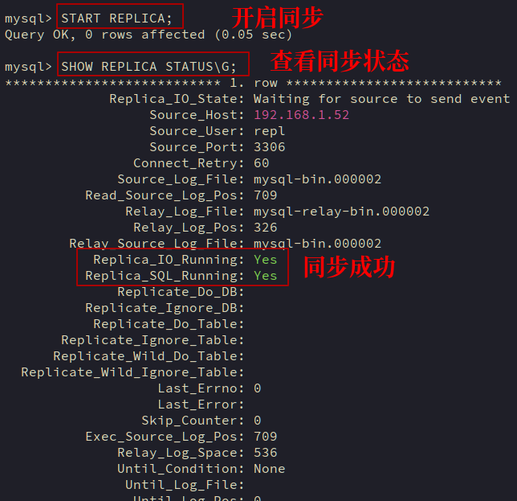

# 数据库

## 概述

### 数据库的分类

- RDBMS-关系型数据库进行存储     二维表数据 -- 二进制
- NoSQL-非关系型数据库进行存储   key-value -- 二进制
- DDBMS-分布式数据库进行存储（NewSQL）

#### 关系型数据库 RDBMS

把复杂的数据结构归结为简单的二元关系（RDBMS），即二维表格形式（二维表）；会注重数据存储的持久性，但存储效率低；

常见的关系数据库应用程序：

- MySQL 互联网公司应用最广泛
- Mariadb 企业场景应用较少（20%），主要用于教学环境较多
- Oracle 传统企业和部分国企应用较多，但也逐步被国产数据库替代
- SQLserver 适合windows server系统环境部署的数据库服务，属于微软公司发布的数据库服务
- PostgreSQL 适合于海量数据信息存储，对于金融行业数据信息分析能力将强

#### 非关系型数据库

没有具体模型的数据结构，英文简称NoSQL（Not Only SQL），意为"不仅仅是SQL"，比较注重数据读取的效率；

利用NoSQL数据库主要处理高并发应用的场景，以及海量数据存储应用的场景,注重数据存储的高效性,在某种程序会牺牲数据存储的安全性

常见的非关系型数据库应用程序:

- Redis 可以利用内存存储数据，也可以使用磁盘，数据常见展示形式是key-vaule
- Memcache 可以利用内存存储数据，也可以使用磁盘，数据常见展示形式是key-vaule
- Mongodb 面向文档数据存储的数据库
- ES 主要用于做日志数据的收集与检索(ELK ELFK)

#### 企业新型数据库

由国人研发设计出的数据库服务，可以满足很多国内高并发量网站数据存储和读取业务的需求

安全: 可以保证数据存储在磁盘中

性能: 采用分布式存储,可以提高存储和调取效率

- TiDB
- OceanBase
- PolarXDB
- RDS/TDSQL

### MySQL产品分类

- Oracle mysql产品
- Mariadb mysql产品
  5.5+版本与mysql相似,10+版本是全新版本
- Percona Percona公司出品的mysql

MySQL的版本:

- MySQL 5.6
- MySQL 5.7(应用更加广泛)
- MySQL 8.0(最新版本)

> 生产环境最好选择偶数版本,例如8.0.26


C：表示为社区版本，属于开源免费版本
E：表示为企业版本，属于开源盈利版本（企业应用）

### MySQL数据库服务的优点

- MySQL数据库服务性能卓越，服务稳定，很少出现异常宕机的情况；
- MySQL数据库服务是开放源代码且无版权制约，自主性强，且使用成本低；
- MySQL数据库服务使用历史悠久，社区及用户非常活跃，遇到问题可以获取大量帮助；
- MySQL数据库服务软件体积小，安装使用简单，并且易于维护管理，安装及维护成本低；
- MySQL数据库服务架构应用广泛，可以用于构建LAMP LNMP LNMT等流行web架构；
- MySQL数据库服务支持多种操作系统，提供多种API接口，支持多种开发语言利用驱动接口调用；

## MySQL

### 部署

这里使用centos7.9部署mysql二进制文件,首先下载MySQL的二进制文件:[下载地址](https://dev.mysql.com/downloads/mysql/)

关闭selinux安全功能

```
sudo vim /etc/selinux/config

# 把enforcing改成disabled
SELINUX=disabled

sudo reboot
```

删除自带的mariadb

```
[root@centos9 yum.repos.d]# rpm -qa | grep mariadb
mariadb-libs-5.5.68-1.el7.x86_64
[root@centos9 yum.repos.d]# yum remove -y mariadb-libs
```

下载数据库程序依赖软件

```
yum install -y libaio-devel
```

解压下载的二进制文件

```
tar -xf mysql-8.0.26-linux-glibc2.12-x86_64.tar.xz

# 移动到/usr/local/
mv mysql-8.0.26-linux-glibc2.12-x86_64 /usr/local/mysql
```

> 也可以使用ln -s mysql-8.0.26-linux-glibc2.12-x86_64 mysql在/usr/local目录下创建软连接

配置环境变量

```
vim /etc/profile

# 追加到末尾
export PATH=$PATH:/usr/local/mysql/bin

source /etc/profile
```

软件程序初始化

mysql有两个核心目录:

- 程序目录: `/usr/local/mysql`
- 数据目录: 存储数据信息

```
# 创建数据目录
mkdir /data/3306/data -p

useradd mysql -M -r -s /sbin/nologin

# 修改权限信息
chown mysql:mysql /data/3306/data -R
```

删除可能存在的`my.cnf`文件

```
rm -f /etc/my.cnf
```

数据目录初始化

对于5.7/8.0版本:

```
# --initialize后的-insecure表示不安全初始化,数据库管理用户没有密码,而可以直接登录数据库
mysqld --initialize-insecure --user=mysql --datadir=/data/3306/data --basedir=/usr/local/mysql

# 安全初始化
mysqld --initialize --user=mysql --datadir=/data/3306/data --basedir=/usr/local/mysql
```

对于5.5/5.6版本

```
/usr/local/mysql56/scripts/mysql_install_db --user=mysql --datadir=/data/3306/data --basedir=/usr/local/mysql
```

安全初始化后会提供一个有权限限制的临时密码,需要重新设置密码

```
alter user root@'localhost' identified by '123456';
```

编写配置文件

```
# 必须是/etc/my.cnf
cat > /etc/my.cnf <<eof
[mysql]
socket=/tmp/mysql.sock
[mysqld]
user=mysql
basedir=/usr/local/mysql
datadir=/data/3306/data
socket=/tmp/mysql.sock
eof
```

启动mysql的几种方式

使用脚本启动:

mysql二进制包中自带一个脚本文件`/usr/local/mysql/support-files/mysql.server`

```
# 把它复制到/etc/init.d
cp /usr/local/mysql/support-files/mysql.server /etc/init.d/mysqld

# 调用脚本
/etc/init.d/mysqld start
Starting MySQL.Logging to '/data/3306/data/master.err'.
. SUCCESS! 
```

也可以查看状态

```
[root@master support-files]# /etc/init.d/mysqld status
 SUCCESS! MySQL running (11258)
[root@master support-files]# ps -ef | grep mysql
root     11119     1  0 23:27 pts/0    00:00:00 /bin/sh /usr/local/mysql/bin/mysqld_safe --datadir=/data/3306/data --pid-file=/data/3306/data/master.pid
mysql    11258 11119  3 23:27 pts/0    00:00:00 /usr/local/mysql/bin/mysqld --basedir=/usr/local/mysql --datadir=/data/3306/data --plugin-dir=/usr/local/mysql/lib/plugin --user=mysql --log-error=master.err --pid-file=/data/3306/data/master.pid --socket=/tmp/mysql.sock
```

可以看到有两个进程,一个是管理进程(mysqld_safe),一个是工作进程(mysqld),工作进程是管理进程的子进程,与nginx不同,当kill子进程之后,主进程也会停止

使用命令启动:

- `mysqld`
  
  ```
  /usr/local/mysql/bin/mysqld --user=mysql --datadir=/data/3306/data --basedir=/usr/local/mysql --socket=/tmp/mysql.sock &
  
  # 关闭
  kill/pkill pid
  ```

- `mysqld_safe`
  
  ```
  /usr/local/mysql/bin/mysqld_safe --datadir=/data/3306/data &
  
  # 关闭,不建议可能会影响正在运行的连接
  # 禁止使用kill -9强制关闭
  kill/pkill/killall
  ```

- `systemctl`
  
  ```
  vim /usr/lib/systemd/system/mysqld.service
  [Unit]
  Description=MySQL Server
  Documentation=mysqld.service
  After=network.target
  After=syslog.target
  
  [Install]
  WantedBy=multi-user.target
  
  [Service]
  User=mysql
  Group=mysql
  ExecStart=/usr/local/mysql/bin/mysqld --defaults-file=/etc/my.cnf
  limitNOFILE=5000
  
  # 启动
  systemctl start mysqld
  
  systemctl stop mysqld
  ```

- `service`
  
  ```
  service mysqld start
  
  # 关闭,推荐做法
  service stop start
  ```

启动失败的排错:

- 确认系统环境,selinux是否关闭,端口占用情况
- 分析错误日志,`datadir/master.pid`

密码管理

mysql在验证身份时会加载授权表`musql.user`进行验证

```
# 设置密码
mysqladmin -uroot password '123456'
alter user root@'localhost' identified by '123456';

# 修改密码
alter user root@'localhost' identified by '123456';
mysql -uroot -p123456 password '123'
```

重置密码

```
# 关闭数据库服务
service mysqld stop
# 采用安全模式启动数据库
/usr/local/mysql/bin/mysqld_safe --datadir=/data/3306/data --skip-grant-tables --skip-networking &
```

此时因为没有加载mysql.user表,所以是无法进行修改密码的

```
mysql> alter user root@'localhost' identified by '123456';
ERROR 1290 (HY000): The MySQL server is running with the --skip-grant-tables option so it cannot execute this statement
```

需要先执行`flush privileges`,它既可以把内存中的授权表信息写入磁盘,也可以把磁盘中的授权表信息加载到内存中

```
flush privileges

mysql> alter user root@'localhost' identified by '123456';
```

然后重新启动数据库服务即可

```
service mysqld start
```

### 用户

#### 创建用户

```
create user 用户名@'白名单' identified by '密码信息';
```

白名单：限制哪些用户可以登录数据库服务

- 限制本地登录（只允许本地）
  用户名@'localhost'
  用户名@'127.0.0.1'

- 限制远程登录(只允许远程)
  
  ```
  用户名@'主机域信息' create user test01@'10.0.0.%' identified by '123456';
  
  # 允许10.0.0.0/24这个网段内所有主机连接
  用户名@'10.0.0.%'
  #10.%           A类网段
  #172.16.%       B类网段
  #192.168.10.%   C类网段
  
  # 允许指定主机连接
  用户名@'10.0.0.52'
  
  # 允许指定域名主机连接
  用户名@'web01'
  ```

- 允许远程和本地
  
  ```
  用户名@'%'
  ```

#### 查看用户

```
# 查看当前用户
select user();

# 查看数据库中所有可登录用户的信息
select user,host from mysql.user;

# 正在登录的用户数量
show processlist;
```

#### 删除用户

```
# 删除单个用户
drop user test02@'%';

# 删除多个用户
delete from mysql.user where user='root' or user='newuser';
```

#### 修改用户

```
# 修改用户密码
alter user test@'10.0.0.%' identified by '123';
```

当远程登录无法使用的时候,可能是加密插件的原因

*mysql -utest01 -p123 -h10.0.0.51
Warning: Using a password on the command line interface can be insecure.
ERROR 2059 (HY000): Authentication plugin 'caching_sha2_password' cannot be loaded: /usr/local/mysql/lib/plugin/caching_sha2_password.so: cannot open shared object file: No such file or directory*

这是因为客户端不支持新版本的数据库密码加密插件`caching_sha2_password`,可以更新客户端,也可以降级服务端加密密码方式为`mysql_native_password`

```
# 查看用户的加密方式
select user,host,plugin from mysql.user;
+------------------+-----------+-----------------------+
| user             | host      | plugin                |
+------------------+-----------+-----------------------+
| mysql.infoschema | localhost | caching_sha2_password |
| mysql.session    | localhost | caching_sha2_password |
| mysql.sys        | localhost | caching_sha2_password |
| root             | localhost | caching_sha2_password |

# 修改用户加密方式
alter user oldboy@'10.0.0.%' identified with mysql_native_password by '123456';
```

锁定用户:

```
# 查看是否被锁定
select user,host,account_locked from mysql.user;
+------------------+-----------+----------------+
| user             | host      | account_locked |
+------------------+-----------+----------------+
| mysql.infoschema | localhost | Y              |
| mysql.session    | localhost | Y              |
| mysql.sys        | localhost | Y              |
| root             | localhost | N              |
+------------------+-----------+----------------+
4 rows in set (0.00 sec)

# 锁定用户
alter user oldboy@'localhost' account lock;

# 解锁用户
alter user oldboy@'localhost' account unlock;
```

### 权限

#### 所有权限

使用`show privileges;`命令可以查看在数据库中可以设置什么权限

```
show privileges;

Alter                   Tables(表)                       To alter the table （修改表属性能力） 
Create                  Databases,Tables,Indexes         To create new databases and tables （创建库 创建表（创建索引））
Create user             Server Admin                     To create new users （创建用户能力）
Drop                    Databases,Tables                 To drop databases, tables, and views （删除库 删除表 删除视图）
Index                   Tables                           To create or drop indexes （创建和删除索引能力）
Show databases          Server Admin                     To see all databases with SHOW DATABASES （查看所有数据库信息能力）
Grant option            Databases,Tables,Functions,Procedures    To give to other users those privileges you possess （是否有给予权限能力）
Usage                   Server Admin                     No privileges - allow connect only  （只允许用户登录数据库权限）

Insert                  Tables                           To insert data into tables （添加表中行） Create 
Delete                  Tables                           To delete existing rows    （删除表中行） delete
Select                  Tables                           To retrieve rows from table（查看表中行） read
Update                  Tables                           To update existing rows    （修改表中行） update
```

#### 查看指定用户的权限

```
show grants for root@'localhost';
```

#### 设置权限

```
# mysql 8.0 只能对已经存在的用户设置
GRANT 权限类型 ON 权限对象 TO 用户角色;

# mysql 5.6,5.7 可以在赋权的时候创建用户
GRANT 权限类型 ON 权限对象 TO 用户角色 identified by '123456';
```

权限对象包括数据库和数据表

```
*.*        所有库的所有表
dba.*    dba库中的所有表
*.tba    可以操控所有库,但只能操作所有库中的tba
dba,tba    只能操控dba中的tba
```

#### 删除权限

```
REVOKE 权限类型 ON 权限对象 TO 用户角色; 
```

例子:

```
mysql> create user newuser@'%' identified by '123456';
Query OK, 0 rows affected (0.02 sec)

mysql> GRANT create ON newdb.name TO newuser@'%';
Query OK, 0 rows affected (0.01 sec)

mysql> show grants for newuser@'%';
+-------------------------------------------------+
| Grants for newuser@%                            |
+-------------------------------------------------+
| GRANT USAGE ON *.* TO `newuser`@`%`             |
| GRANT CREATE ON `newdb`.`name` TO `newuser`@`%` |
+-------------------------------------------------+
2 rows in set (0.00 sec)

mysql> CREATE DATABASE newdb;
Query OK, 1 row affected (0.01 sec)
```

```
mysql -unewuser -p123456

mysql> USE newdb;
Database changed

mysql> CREATE TABLE name(name VARCHAR(50) NOT NULL);
Query OK, 0 rows affected (0.05 sec)

mysql> CREATE TABLE username(name VARCHAR(50) NOT NULL);
ERROR 1142 (42000): CREATE command denied to user 'newuser'@'localhost' for table 'username'
```

```
mysql -uroot -p123456

mysql> REVOKE create ON newdb.name FROM newuser@'%';
Query OK, 0 rows affected (0.00 sec)

mysql> show grants for newuser@'%';
+-------------------------------------+
| Grants for newuser@%                |
+-------------------------------------+
| GRANT USAGE ON *.* TO `newuser`@`%` |
+-------------------------------------+
1 row in set (0.00 sec)
```

#### 特殊权限

##### ALL/ALL PRIVILEGES

授予用户 **几乎所有可用的权限**（除了 `GRANT OPTION` 本身）。常用于给管理员或开发环境中的用户快速授予所有权限。

```
GRANT ALL PRIVILEGES ON testdb.* TO 'user1'@'localhost';
```

##### GRANT OPTION

允许用户将自己拥有的权限再授予其他用户

```
GRANT ALL PRIVILEGES ON testdb.* TO 'user1'@'localhost' WITH GRANT OPTION;
```

#### 权限分配

管理员常用的权限:

- `ALL PRIVILEGES`：几乎所有数据库操作权限（创建库表、修改数据、管理账号等）。
- `SELECT, SHOW`：查询和查看权限。
- `CREATE, INSERT`：建表和添加数据。
- `UPDATE, DELETE`：修改和删除数据。
- `ALTER, DROP`：修改表结构、删除表。

普通用户:

- `SELECT`：查询数据
- `INSERT`：插入数据
- `UPDATE`：修改数据
- `DELETE`：删除数据

#### 相关表

数据库服务和权限相关的授权表:

- mysql.user:        记录全局权限设置信息
- mysql.db  ：       记录指定数据库权限信息 
- mysql.tables_priv：记录指定数据表权限信息

#### 角色

当数据库中有多个管理用户（DBA、SA、开发用户），且权限设置相对统一时，逐一给用户赋权很麻烦。MySQL 8.0 引入角色（Role）功能，可以将一组权限绑定到角色，再把角色分配给用户，方便统一管理。

```
# 创建角色
create role role_name;
create role reader, writer;

# 为角色赋予权限
grant 权限 on 数据库.* to 角色;
grant select on mydb.* to reader;
grant insert, update on mydb.* to writer;

# 创建用户并赋予角色
create user user01@'%' identified by '123';
grant reader, writer to user01@'%';
```

用户可以被授予多个角色,但不会自动启用,用户登录时默认是"没有角色"

```
# 查看当前启用的角色
mysql> SELECT CURRENT_ROLE();
+----------------+
| CURRENT_ROLE() |
+----------------+
| NONE           |
+----------------+
1 row in set (0.00 sec)

# 查看某个用户被授予了哪些角色
SHOW GRANTS FOR 'user01'@'%';
```

激活:

```
# 手动激活
SET ROLE role_name;
# 手动激活,让该用户默认启用所有已授予的角色。
set default role all to user01@'%';
# 自动激活
set global activate_all_roles_on_login=on;
```

### 服务

#### 服务连接

##### 连接方式

数据库分为服务端和客户端,实现连接的方式包括本地连接和远程连接

本地连接是基于unix套接字方式建立连接,服务端启动数据库时会根据加载的配置文件中的配置创建socket套接字文件

```
cat /etc/my.cnf 
[mysql]
socket=/tmp/mysql.sock
[mysqld]
user=mysql
basedir=/usr/local/mysql
datadir=/data/3306/data
socket=/tmp/mysql.sock
```

客户端利用socket套接字文件本地连接服务器

```
# 默认即是该地址
mysql -S /tmp/mysql.sock -uroot -p
```

远程连接基于TCP/IP协议方式建立连接

服务端创建服务端口信息

```
cat /etc/my.cnf 
[mysql]
socket=/tmp/mysql.sock
[mysqld]
user=mysql
port=3307
basedir=/usr/local/mysql
datadir=/data/3306/data
socket=/tmp/mysql.sock
```

客户端利用系统网络地址和服务端口信息建立远程连接

```
mysql -u name -p passwd -h IP -P port
```

> 默认启动的端口还包括33060,该端口可以实现mysqlx协议的通讯
> 
> 33060 mysqlx 支持mysql-shell连接服务端(批量管理数据库服务)
> 3306 mysql 支持mysql客户端,mysqldump,mysqlpump连接服务端
> 
> 可以在`/etc/my.cnf`中添加
> 
> ```
> [mysqld]
> mysqlx=0
> ```
> 
> 来关闭该端口

##### 连接方法

命令行连接

```
mysql -u name -p passwd -h IP -P port

mysql -u name -p passwd -S socket
```

图形界面

- Navicat
- SQLyog
- workbench（mysql官方出品） 
- DBeaver（可以连接多种类型数据库服务） 

代码连接

主要是以下字段

- username
- password
- ip
- 端口

##### 排错流程

1. 测试网络是否连通
   
   ```
   ping 10.0.0.51
   telnet 10.0.0.51 3306
   ```

2. 测试用户是否可以登录
   
   ```
   mysql -uroot -p -h10.0.0.51 -p3306
   ```

3. 客户端地址是否与远程用户白名单匹配
   
   ```
   select user,host from mysql.user;
   ```

4. 确认服务端用户的密码插件设置
   
   ```
   select user,account_locked from mysql.user;
   ```

#### 服务功能配置

数据库的功能可以在多个过程中开启/关闭

##### 编译安装时关闭功能

##### 修改数据库服务配置文件

加载默认配置文件

可以通过下面的命令查看配置文件加载顺序

```
mysqld --help --verbose | grep my.cnf
/etc/my.cnf /etc/mysql/my.cnf /usr/local/mysql/etc/my.cnf ~/.my.cnf
```

加载指定配置文件

可以通过启动参数`--default-file`来设置加载的配置文件

```
# 服务端配置
mysqld --defaults-file=/data/3306/my80.cnf

# 客户端配置
mysql --defaults-file=/data/3306/my80.cnf
```

编写配置文件内容

配置项的标签一般分为两部分:

- `[mysql] [mysqladmin] [mysqldump] [client]`客户端部分
- `[mysqld] [mysqld_safe]`服务端部分

客户端配置项

mysql可以使用`mysql --help`来查看


同理也可以通过`mysqladmin --help`等来查看命令的配置项,这些配置只针对不同的客户端生效

可以直接使用`[client]`标签配置全局配置项,对所有客户端生效

服务器配置项

`mysqld --help --verbose`查看具体配置项

`[server]`标签是服务端的全局配置

##### 使用进程命令

使用`mysqld &`来启动服务进程,通过`mysqld --help`查看可以设置的命令

例如`mysqld --mysqlx=0 &>/tmp/mysql.log &`

#### 服务实例创建

在一个系统环境中可以部署多套数据库的服务实例

使用单一数据库实例部署多个数据库业务有以下缺点:

- 无法保证安全性
- 大量并发访问请求发送给唯一的mysqld进程处理,负载压力大
- 不能更精确的监控业务消耗资源情况

多实例还可以使用两台服务器部署主从同步,读写分离的架构


##### 架构

服务器: db01 10.0.0.51 搭建3个数据库服务实例

mysql01  mysql-8.0.26  /data/3307/data   /data/3307/my.cnf   3307   /tmp/mysql3307.sock 
mysql02  mysql-8.0.26  /data/3308/data   /data/3308/my.cnf   3308   /tmp/mysql3308.sock
mysql03  mysql-8.0.26  /data/3309/data   /data/3309/my.cnf   3309   /tmp/mysql3309.sock

重点是:数据目录,配置文件,端口,socket文件要不同

```
# 创建文件夹
mkdir -p /data/33{07..09}/data
# 赋权
chown -R mysql:mysql /data

# 配置文件
cat > /data/3307/my.cnf <<EOF
[mysqld]
user=mysql
port=3307
mysqlx=0
basedir=/usr/local/mysql
datadir=/data/3307/data
socket=/tmp/mysql3307.sock
EOF

cat > /data/3308/my.cnf <<EOF
[mysqld]
user=mysql
port=3308
mysqlx=0
basedir=/usr/local/mysql
datadir=/data/3308/data
socket=/tmp/mysql3308.sock
EOF

cat > /data/3309/my.cnf <<EOF
[mysqld]
user=mysql
port=3309
mysqlx=0
basedir=/usr/local/mysql
datadir=/data/3309/data
socket=/tmp/mysql3309.sock
EOF

# 初始化
mysqld --initialize-insecure --user=mysql --datadir=/data/3307/data --basedir=/usr/local/mysql
mysqld --initialize-insecure --user=mysql --datadir=/data/3308/data --basedir=/usr/local/mysql
mysqld --initialize-insecure --user=mysql --datadir=/data/3309/data --basedir=/usr/local/mysql
```

运行多实例

```
# 命令启动
mysqld --defaults-file=/data/3307/my.cnf &
mysqld --defaults-file=/data/3308/my.cnf &
mysqld --defaults-file=/data/3309/my.cnf &
# service文件启动
cat >/usr/lib/systemd/system/mysqld3307.service <<EOF
[Unit]
Description=MySQL Server
Documentation=mysqld.service
After=network.target
After=syslog.target

[Install]
WantedBy=multi-user.target

[Service]
User=mysql
Group=mysql
ExecStart=/usr/local/mysql/bin/mysqld --defaults-file=/data/3307/my.cnf
limitNOFILE=5000
EOF

cat >/usr/lib/systemd/system/mysqld3308.service <<EOF
[Unit]
Description=MySQL Server
Documentation=mysqld.service
After=network.target
After=syslog.target

[Install]
WantedBy=multi-user.target

[Service]
User=mysql
Group=mysql
ExecStart=/usr/local/mysql/bin/mysqld --defaults-file=/data/3308/my.cnf
limitNOFILE=5000
EOF

cat >/usr/lib/systemd/system/mysqld3309.service <<EOF
[Unit]
Description=MySQL Server
Documentation=mysqld.service
After=network.target
After=syslog.target

[Install]
WantedBy=multi-user.target

[Service]
User=mysql
Group=mysql
ExecStart=/usr/local/mysql/bin/mysqld --defaults-file=/data/3309/my.cnf
limitNOFILE=5000
EOF
```

检查:

```
ps -ef | grep mysqld
mysql    12353     1  0 01:46 ?        00:00:59 /usr/local/mysql/bin/mysqld --defaults-file=/etc/my.cnf
mysql    12822     1  1 09:43 ?        00:00:01 /usr/local/mysql/bin/mysqld --defaults-file=/data/3307/my.cnf
mysql    12870     1  1 09:43 ?        00:00:01 /usr/local/mysql/bin/mysqld --defaults-file=/data/3308/my.cnf
mysql    12918     1  1 09:43 ?        00:00:01 /usr/local/mysql/bin/mysqld --defaults-file=/data/3309/my.cnf

netstat -tnulp | grep mysql
tcp6       0      0 :::33060                :::*                    LISTEN      12353/mysqld        
tcp6       0      0 :::3306                 :::*                    LISTEN      12353/mysqld        
tcp6       0      0 :::3307                 :::*                    LISTEN      12822/mysqld        
tcp6       0      0 :::3308                 :::*                    LISTEN      12870/mysqld        
tcp6       0      0 :::3309                 :::*                    LISTEN      12918/mysqld 


mysql -uroot -S /tmp/mysql3307.sock
mysql -uroot -S /tmp/mysql3308.sock
mysql -uroot -S /tmp/mysql3309.sock
mysql> select @@port;
+--------+
| @@port |
+--------+
|   3309 |
+--------+
1 row in set (0.00 sec)
```

#### 版本升级

- 本地升级(Inplace) 单台服务器进行程序升级,直接本地升级程序并加载数据,对业务影响较大
- 迁移升级(Mergeing) 两台服务器进行程序升级,在另一台服务器安装新版本的程序然后进行数据迁移和恢复最后测试和主从同步,对业务影响比较小

数据库升级主要涉及两方面:

- 数据库程序升级: 安装新的程序,用新的程序加载升级后的数据目录
- 数据库数据升级: 数据目录结构升级/授权表结构信息升级

##### 升级规范:

- 只支持在GA（General Availability）版本之间进行升级  
- 不支持跨版本升级,支持从数据库5.6到5.7再到8.0,但是需要先升级到最新的小版本，再进行跨版本升级
- 需要提前考虑好版本回退的方案，最好升级前做好数据备份（特别是向8.0版本升级）
- 制定的升级方案和升级步骤，需要尽可能降低数据库服务停机的时间

[数据库服务官方参考资料](https://dev.mysql.com/doc/refman/8.0/en/upgrade-paths.html)

##### 升级流程:

1. 数据备份保存(可以采用热备份和冷备份)冷备份需要停止业务后备份,热备份无序停止服务
2. 安装好最新程序(无需停止旧版本数据库服务)
3. 关闭原有程序(体现制作并显示维护页面),提前通知,说明升级信息
4. 使用安全模式启动新的数据库服务(--skip-grant-tables --skip-networking),此时要加载旧版本的数据目录(挂库)
5. 升级数据结构信息,更新授权表结构
6. 关闭安全模式,正常启动程序
7. 测试验证
8. 完成升级

##### 环境准备:

```
ll /usr/local/
-rw-r--r--  1 root root 343082156 9月   8 10:31 mysql-5.6.48-linux-glibc2.12-x86_64.tar.gz
-rw-r--r--  1 root root 660017902 9月   8 10:31 mysql-5.7.30-linux-glibc2.12-x86_64.tar.gz
-rw-r--r--  1 root root 914806904 9月   7 05:07 mysql-8.0.26-linux-glibc2.12-x86_64.tar.xz

tar zxf mysql-5.6.48-linux-glibc2.12-x86_64.tar.gz
tar zxf mysql-5.7.30-linux-glibc2.12-x86_64.tar.gz
tar xf mysql-8.0.26-linux-glibc2.12-x86_64.tar.xz

ln -s mysql-5.6.48-linux-glibc2.12-x86_64 mysql56
ln -s mysql-5.7.30-linux-glibc2.12-x86_64 mysql57

# 移动走my配置文件
mv /etc/my.cnf /tmp/

# 5.6初始化
mkdir -p /data/3356/data
chown mysql:mysql /data/3357/data
yum install -y autoconf
mysqld --initialize-insecure --user=mysql --datadir=/data/3356/data --basedir=/usr/local/mysql

# 5.7初始化
mkdir -p /data/3357/data
chown mysql:mysql /data/3357/data
/usr/local/mysql57/bin/mysqld --initialize-insecure --user=mysql --datadir=/data/3357/data  --basedir=/usr/local/mysql57
```

可以看到5.6和5.7的数据目录结构有差异:

```
[root@master local]# ll /data/3356/data/
总用量 110600
-rw-rw---- 1 mysql mysql 12582912 9月   8 11:32 ibdata1
-rw-rw---- 1 mysql mysql 50331648 9月   8 11:32 ib_logfile0
-rw-rw---- 1 mysql mysql 50331648 9月   8 11:32 ib_logfile1
drwx------ 2 mysql mysql     4096 9月   8 11:32 mysql
drwx------ 2 mysql mysql     4096 9月   8 11:32 performance_schema
drwx------ 2 mysql mysql        6 9月   8 11:32 test
[root@master local]# ll /data/3357/data/
总用量 110660
-rw-r----- 1 mysql mysql       56 9月   8 11:33 auto.cnf
-rw------- 1 mysql mysql     1672 9月   8 11:33 ca-key.pem
-rw-r--r-- 1 mysql mysql     1112 9月   8 11:33 ca.pem
-rw-r--r-- 1 mysql mysql     1112 9月   8 11:33 client-cert.pem
-rw------- 1 mysql mysql     1680 9月   8 11:33 client-key.pem
-rw-r----- 1 mysql mysql      425 9月   8 11:33 ib_buffer_pool
-rw-r----- 1 mysql mysql 12582912 9月   8 11:33 ibdata1
-rw-r----- 1 mysql mysql 50331648 9月   8 11:33 ib_logfile0
-rw-r----- 1 mysql mysql 50331648 9月   8 11:33 ib_logfile1
drwxr-x--- 2 mysql mysql     4096 9月   8 11:33 mysql
drwxr-x--- 2 mysql mysql     8192 9月   8 11:33 performance_schema
-rw------- 1 mysql mysql     1680 9月   8 11:33 private_key.pem
-rw-r--r-- 1 mysql mysql      452 9月   8 11:33 public_key.pem
-rw-r--r-- 1 mysql mysql     1112 9月   8 11:33 server-cert.pem
-rw------- 1 mysql mysql     1680 9月   8 11:33 server-key.pem
drwxr-x--- 2 mysql mysql     8192 9月   8 11:33 sys
```

编辑配置文件

```
cat > /data/3356/my.cnf <<EOF
[mysqld]
user=mysql
port=3306
basedir=/usr/local/mysql56
datadir=/data/3356/data
socket=/tmp/mysql3356.sock
EOF

cat > /data/3357/my.cnf <<EOF
[mysqld]
user=mysql
port=3306
basedir=/usr/local/mysql56
datadir=/data/3357/data
socket=/tmp/mysql3357.sock
EOF
```

编辑mysql5.6的service文件

```
cat >/usr/lib/systemd/system/mysqld3356.service <<EOF
[Unit]
Description=MySQL Server
Documentation=mysqld.service
After=network.target
After=syslog.target

[Install]
WantedBy=multi-user.target

[Service]
User=mysql
Group=mysql
ExecStart=/usr/local/mysql56/bin/mysqld --defaults-file=/data/3356/my.cnf
limitNOFILE=5000
EOF
```

准备一些数据

```
create database xiaoA;
create database xiaoB;

use xiaoA;
create table t1 (id int, name varchar(10), age int);
insert into t1 values(1, "username", 20),(2, "newuser", 19),(3, "user", 18);
```

##### 5.6->5.7

###### 进行数据备份(冷备份)

```
# 停止mysql
systemctl stop mysqld3356
# 创建备份文件夹
mkdir /backup
# 备份
cp -a /data/3356/data /backup/data_3356_bak
# 检查
ll /backup/data_3356_bak/
总用量 110604
-rw-rw---- 1 mysql mysql       56 9月   8 17:17 auto.cnf
-rw-rw---- 1 mysql mysql 12582912 9月   8 17:25 ibdata1
-rw-rw---- 1 mysql mysql 50331648 9月   8 17:25 ib_logfile0
-rw-rw---- 1 mysql mysql 50331648 9月   8 11:32 ib_logfile1
drwx------ 2 mysql mysql     4096 9月   8 11:32 mysql
drwx------ 2 mysql mysql     4096 9月   8 11:32 performance_schema
drwx------ 2 mysql mysql        6 9月   8 11:32 test
drwx------ 2 mysql mysql       48 9月   8 17:21 xiaoA
drwx------ 2 mysql mysql       20 9月   8 17:21 xiaoB
```

> 对于一个数据库实际存储在一个目录中,xiaoA目录中有以下文件:
> db.opt  t1.frm  t1.ibd
> 
> t1.ibd存储着具体的数据,t1.frm保存表的结构信息

###### 安全模式启动新版本的mysql

```
# 编辑配置文件
vim /data/3356/my.cnf

basedir=/usr/local/mysql57
datadir=/data/3356/data

# 安全模式启动
/usr/local/mysql57/bin/mysqld_safe --defaults-file=/data/3356/my.cnf --skip-grant-tables --skip-networking &

# 登录
mysql -uroot -S /tmp/mysql3356.sock
```

现在还没有升级数据信息

```
# 目录信息已经产生部分变化
ll /data/3356/data/
总用量 122944
-rw-rw---- 1 mysql mysql       56 9月   8 17:17 auto.cnf
-rw------- 1 mysql mysql     1676 9月   8 17:50 ca-key.pem
-rw-r--r-- 1 mysql mysql     1112 9月   8 17:50 ca.pem
-rw-r--r-- 1 mysql mysql     1112 9月   8 17:50 client-cert.pem
-rw------- 1 mysql mysql     1676 9月   8 17:50 client-key.pem
-rw-rw---- 1 mysql mysql 12582912 9月   8 17:50 ibdata1
-rw-r----- 1 mysql mysql 50331648 9月   8 17:50 ib_logfile0
-rw-r----- 1 mysql mysql 50331648 9月   8 17:50 ib_logfile1
-rw-r----- 1 mysql mysql 12582912 9月   8 17:50 ibtmp1
-rw-r----- 1 mysql mysql    13560 9月   8 17:50 master.err
-rw-r----- 1 mysql mysql        6 9月   8 17:50 master.pid
drwx------ 2 mysql mysql     4096 9月   8 11:32 mysql
drwx------ 2 mysql mysql     4096 9月   8 11:32 performance_schema
-rw------- 1 mysql mysql     1676 9月   8 17:50 private_key.pem
-rw-r--r-- 1 mysql mysql      452 9月   8 17:50 public_key.pem
-rw-r--r-- 1 mysql mysql     1112 9月   8 17:50 server-cert.pem
-rw------- 1 mysql mysql     1680 9月   8 17:50 server-key.pem
drwx------ 2 mysql mysql        6 9月   8 11:32 test
drwx------ 2 mysql mysql       48 9月   8 17:21 xiaoA
drwx------ 2 mysql mysql       20 9月   8 17:21 xiaoB

# 授权表结构如下
mysql> select * from mysql.user\G;

*************************** 6. row ***************************
                  Host: master
                  User: 
              Password: 
           Select_priv: N
           Insert_priv: N
           Update_priv: N
           Delete_priv: N
                       ...
         max_questions: 0
           max_updates: 0
       max_connections: 0
  max_user_connections: 0
                plugin: mysql_native_password
 authentication_string: NULL
      password_expired: N
```

###### 升级数据信息和授权表结构:

```
# 修改授权表结构
/usr/local/mysql57/bin/mysql_upgrade -S /tmp/mysql3356.sock --force

# 新的授权表结构
*************************** 8. row ***************************
                  Host: localhost
                  User: mysql.sys
           Select_priv: N
           Insert_priv: N
           Update_priv: N
           Delete_priv: N

                plugin: mysql_native_password
 authentication_string: *THISISNOTAVALIDPASSWORDTHATCANBEUSEDHERE
      password_expired: N
 password_last_changed: 2025-09-08 17:57:35
     password_lifetime: NULL
        account_locked: Y           
```

新的授权表结构才能被新的mysql程序正常加载,进而进行用户验证

###### 正常重启数据库

```
pkill mysql

# 编写新的service文件
cat >/usr/lib/systemd/system/mysqld3357.service <<EOF
[Unit]
Description=MySQL Server
Documentation=mysqld.service
After=network.target
After=syslog.target

[Install]
WantedBy=multi-user.target

[Service]
User=mysql
Group=mysql
ExecStart=/usr/local/mysql57/bin/mysqld --defaults-file=/data/3356/my.cnf
limitNOFILE=5000
EOF

systemctl daemon-reload
systemctl start mysqld3357

mysql -uroot -S /tmp/mysql3356.sock
```

###### 测试/取消维护页

##### 5.7->8.0

###### 数据备份

```
# 停止mysql
systemctl stop mysqld3357
# 创建备份文件夹
mkdir /backup
# 备份
cp -a /data/3356/data /backup/data_3357_bak
```

###### 安全模式启动新版数据库

```
vim /data/3356/my.cnf

basedir=/usr/local/mysql
datadir=/data/3356/data
socket=/tmp/mysql3356.sock

# 安全启动
/usr/local/mysql/bin/mysqld_safe --defaults-file=/data/3356/my.cnf --skip-grant-tables --skip-networking &
```

mysql8.0正常授权表结构:

```
                    Host: localhost
                    User: root
             Select_priv: Y
             Insert_priv: Y
             Update_priv: Y
             Delete_priv: Y
             Create_priv: Y

          account_locked: N
        Create_role_priv: Y
          Drop_role_priv: Y
  Password_reuse_history: NULL
     Password_reuse_time: NULL
Password_require_current: NULL
         User_attributes: NULL     
```

运行完安全启动之后会自动的升级mysql授权表

```
                    Host: localhost
                    User: root
             Select_priv: Y
             Insert_priv: Y
             Update_priv: Y
             Delete_priv: Y
             Create_priv: Y
          account_locked: N
        Create_role_priv: Y
          Drop_role_priv: Y
  Password_reuse_history: NULL
     Password_reuse_time: NULL
Password_require_current: NULL
         User_attributes: NULL
```

###### 正常重启数据库

```
cat >/usr/lib/systemd/system/mysqld80.service <<EOF
[Unit]
Description=MySQL Server
Documentation=mysqld.service
After=network.target
After=syslog.target

[Install]
WantedBy=multi-user.target

[Service]
User=mysql
Group=mysql
ExecStart=/usr/local/mysql/bin/mysqld --defaults-file=/data/3356/my.cnf
limitNOFILE=5000
EOF
```

###### 测试/取消维护页

##### 升级检测

mysql-shell的函数功能可以检测数据库程序是否可以升级到8.0版本

例如对于5.7程序是否可以升级到8.0.26

```
# 下载并解压mysql-shell 8.0.26
https://downloads.mysql.com/archives/shell/
tar xf mysql-shell-8.0.26-linux-glibc2.12-x86-64bit.tar.gz
ln -s mysql-shell-8.0.26-linux-glibc2.12-x86-64bit mysqlsh

# 添加到环境变量
export PATH=$PATH:/usr/local/mysqlsh/bin
```

检测低版本数据库程序

```
# 准备5.7环境
cat /usr/lib/systemd/system/mysqld3357.service
[Unit]
Description=MySQL Server
Documentation=mysqld.service
After=network.target
After=syslog.target

[Install]
WantedBy=multi-user.target

[Service]
User=mysql
Group=mysql
ExecStart=/usr/local/mysql57/bin/mysqld --defaults-file=/data/3357/my.cnf
LimitNOFILE = 5000

cat /data/3357/my.cnf
[mysqld]
user=mysql
port=3357
basedir=/usr/local/mysql57
datadir=/data/3357/data
socket=/tmp/mysql3357.sock

# 启动
systemctl start mysqld3357

create user root@'10.0.0.%' identified by '123456';
grant all on *.* to root@'10.0.0.%';

# 检测
# 若没有error提示，表示可以实现版本升级 5.7.30 --> 8.0.26
mysqlsh root:123456@10.0.0.51:3357 -e "util.checkForServerUpgrade()"
```

##### 失败回滚

数据库程序升级失败，如何进行程序升级回退：

###### 关闭新版数据库程序

```
systemctl stop mysqld3356
```

###### 还原备份信息

```
rm -rf /data/3356/data/*
cp -a /backup/data_3356_bak/* /data/3356/data/
```

###### 回退配置文件

```
vim /data/3356/my.cnf 
[mysqld]
user=mysql
port=3356  -- 是否有调整
basedir=/usr/local/mysql56  -- 程序信息是否是旧版本程序
datadir=/data/3356/data     -- 数据目录是否是旧版数据目录信息
socket=/tmp/mysql3356.sock

vim /usr/lib/systemd/system/mysqld3356.service
[Unit]
Description=MySQL Server
Documentation=mysqld.service
After=network.target
After=syslog.target

[Install]
WantedBy=multi-user.target

[Service]
User=mysql
Group=mysql
ExecStart=/usr/local/mysql56/bin/mysqld --defaults-file=/data/3356/my.cnf
LimitNOFILE = 5000
```

###### 重启启动旧版本数据库

```
systemctl daemon-reload
systemctl start mysqld3356

# 检查服务状态
ps -ef|grep mysql
mysql     12929      1  1 18:10 ?        00:00:00 /usr/local/mysql56/bin/mysqld --defaults-file=/data/3356/my.cnf
```

### SQL语言

#### 前置知识

##### 字符集

查看数据库服务默认字符集信息

```
mysql> show variables like '%char%';
+--------------------------+----------------------------------+
| Variable_name            | Value                            |
+--------------------------+----------------------------------+
| character_set_client     | utf8mb4                          |
| character_set_connection | utf8mb4                          |
| character_set_database   | utf8mb4                          |
| character_set_filesystem | binary                           |
| character_set_results    | utf8mb4                          |
| character_set_server     | utf8mb4                          |
| character_set_system     | utf8mb3                          |
| character_sets_dir       | /usr/local/mysql/share/charsets/ |
+--------------------------+----------------------------------+
8 rows in set (0.00 sec)
```

> utf8mb3是标准utf8,使用三字节,utf8mb4使用四字节,表示的字符更多

查看可以设置的字符集信息:

```
mysql> show charset;
+----------+---------------------------------+---------------------+--------+
| Charset  | Description                     | Default collation   | Maxlen |
+----------+---------------------------------+---------------------+--------+
| armscii8 | ARMSCII-8 Armenian              | armscii8_general_ci |      1 |
| ascii    | US ASCII                        | ascii_general_ci    |      1 |
| big5     | Big5 Traditional Chinese        | big5_chinese_ci     |      2 |
| binary   | Binary pseudo charset           | binary              |      1 |
| cp1250   | Windows Central European        | cp1250_general_ci   |      1 |
| cp1251   | Windows Cyrillic                | cp1251_general_ci   |      1 |
| cp1256   | Windows Arabic                  | cp1256_general_ci   |      1 |
| cp1257   | Windows Baltic                  | cp1257_general_ci   |      1 |
| cp850    | DOS West European               | cp850_general_ci    |      1 |
| cp852    | DOS Central European            | cp852_general_ci    |      1 |
| cp866    | DOS Russian                     | cp866_general_ci    |      1 |
| cp932    | SJIS for Windows Japanese       | cp932_japanese_ci   |      2 |
| dec8     | DEC West European               | dec8_swedish_ci     |      1 |
| eucjpms  | UJIS for Windows Japanese       | eucjpms_japanese_ci |      3 |
| euckr    | EUC-KR Korean                   | euckr_korean_ci     |      2 |
| gb18030  | China National Standard GB18030 | gb18030_chinese_ci  |      4 |
| gb2312   | GB2312 Simplified Chinese       | gb2312_chinese_ci   |      2 |
| gbk      | GBK Simplified Chinese          | gbk_chinese_ci      |      2 |
| geostd8  | GEOSTD8 Georgian                | geostd8_general_ci  |      1 |
| greek    | ISO 8859-7 Greek                | greek_general_ci    |      1 |
| hebrew   | ISO 8859-8 Hebrew               | hebrew_general_ci   |      1 |
| hp8      | HP West European                | hp8_english_ci      |      1 |
| keybcs2  | DOS Kamenicky Czech-Slovak      | keybcs2_general_ci  |      1 |
| koi8r    | KOI8-R Relcom Russian           | koi8r_general_ci    |      1 |
| koi8u    | KOI8-U Ukrainian                | koi8u_general_ci    |      1 |
| latin1   | cp1252 West European            | latin1_swedish_ci   |      1 |
| latin2   | ISO 8859-2 Central European     | latin2_general_ci   |      1 |
| latin5   | ISO 8859-9 Turkish              | latin5_turkish_ci   |      1 |
| latin7   | ISO 8859-13 Baltic              | latin7_general_ci   |      1 |
| macce    | Mac Central European            | macce_general_ci    |      1 |
| macroman | Mac West European               | macroman_general_ci |      1 |
| sjis     | Shift-JIS Japanese              | sjis_japanese_ci    |      2 |
| swe7     | 7bit Swedish                    | swe7_swedish_ci     |      1 |
| tis620   | TIS620 Thai                     | tis620_thai_ci      |      1 |
| ucs2     | UCS-2 Unicode                   | ucs2_general_ci     |      2 |
| ujis     | EUC-JP Japanese                 | ujis_japanese_ci    |      3 |
| utf16    | UTF-16 Unicode                  | utf16_general_ci    |      4 |
| utf16le  | UTF-16LE Unicode                | utf16le_general_ci  |      4 |
| utf32    | UTF-32 Unicode                  | utf32_general_ci    |      4 |
| utf8     | UTF-8 Unicode                   | utf8_general_ci     |      3 |
| utf8mb4  | UTF-8 Unicode                   | utf8mb4_0900_ai_ci  |      4 |
+----------+---------------------------------+---------------------+--------+
41 rows in set (0.01 sec)
```

设置字符集:

1. 编辑配置文件:

   ```
   vim /etc/my.cnf
   [mysql]
   default-character-set=utf8
   [mysqld]
   character-set-server=utf8
   ```

2. 创建数据库或表时设置:

   ```
   CREATE DATABASE 库名 CHARACTER SET charset_name(字符集名称);
   alter DATABASE 库名 CHARACTER SET charset_name(字符集名称);
   
   CREATE TABLE 表名 (字段01 字段01类型 字段01约束或属性信息,字段02 字段02类型 字段02约束或属性信息) CHARACTER SET charset_name(字符集名称);
   alter table 表名 CHARACTER SET charset_name(字符集名称);
   ```

如果已经已经发现表中有乱码信息，如何修复  

1. 需要备份表中数据 （逻辑备份 mysqldump） 
2. 清理表中数据信息
3. 修改数据库或数据表字符集
4. 重新导入表中数据信息 （DML insert）

##### 校对规则

设置校对规则(collation)的功能:

- 保证表中的数据查询结果(是否区分大小写)

- 保证数据在表中的排序效果

查看校对规则:

```sql
# 查看数据库的校对规则
mysql> show create database db1;
+----------+-------------------------------------------------------------------------------------------------------------------------------+
| Database | Create Database                                                                                                               |
+----------+-------------------------------------------------------------------------------------------------------------------------------+
| db1      | CREATE DATABASE `db1` /*!40100 DEFAULT CHARACTER SET utf8mb4 COLLATE utf8mb4_0900_ai_ci */ /*!80016 DEFAULT ENCRYPTION='N' */ |
+----------+-------------------------------------------------------------------------------------------------------------------------------+
1 row in set (0.00 sec)

# 查看所有校对规则
mysql> show collation;
```

设置校对规则

```sql
# 创建库时设置
CREATE DATABASE 库名 CHARACTER SET charset_name(字符集名称) COLLATE collation_name(校对规则名称);
# 修改校对规则
alter DATABASE 库名 CHARACTER SET charset_name(字符集名称) COLLATE collation_name(校对规则名称);

# 创建表设置
CREATE TABLE 表名 (字段01 字段01类型 字段01约束或属性信息,字段02 字段02类型 字段02约束或属性信息) CHARACTER SET charset_name(字符集名称) COLLATE collation_name(校对规则名称);;
# 修改表设置
alter table 表名 CHARACTER SET charset_name(字符集名称) COLLATE collation_name(校对规则名称);
```

##### 类型

根据SQL语言操作方式细化为四种类型

DDL

Data Definition Language数据定义语言

负责管理数据库的基本数据(不会修改表的内容),比如增删库,表,索引用户等

`CREATE（创建）、ALTER（修改）、DROP（删除）`等

```
mysql> ? Data Definition;
You asked for help about help category: "Data Definition"
For more information, type 'help <item>', where <item> is one of the following
topics:
   ALTER DATABASE
   ALTER EVENT
   ALTER FUNCTION
   ALTER INSTANCE
   ALTER LOGFILE GROUP
   ALTER PROCEDURE
   ALTER SCHEMA
   ALTER SERVER
   ALTER TABLE
   ALTER TABLESPACE
   ALTER VIEW
   CREATE DATABASE
   CREATE EVENT
   CREATE FUNCTION
   CREATE INDEX
   CREATE LOGFILE GROUP
   CREATE PROCEDURE
   CREATE SCHEMA
   CREATE SERVER
   CREATE SPATIAL REFERENCE SYSTEM
   CREATE TABLE
   CREATE TABLESPACE
   CREATE TRIGGER
   CREATE VIEW
   DROP DATABASE
   DROP EVENT
   DROP FUNCTION
   DROP INDEX
   DROP PROCEDURE
   DROP SCHEMA
   DROP SERVER
   DROP SPATIAL REFERENCE SYSTEM
   DROP TABLE
   DROP TABLESPACE
   DROP TRIGGER
   DROP VIEW
   FOREIGN KEY
   RENAME TABLE
   TRUNCATE TABLE
```

DCL

Data Control Language数据控制语言

主要用来定义访问权限和安全级别

`GRANT（用户授权）、REVOKE（权限回收）、COMMIT（提交）、ROLLBACK（回滚）`

```
mysql> ? Account Management;
You asked for help about help category: "Account Management"
For more information, type 'help <item>', where <item> is one of the following
topics:
   ALTER RESOURCE GROUP
   ALTER USER
   CREATE RESOURCE GROUP
   CREATE ROLE
   CREATE USER
   DROP RESOURCE GROUP
   DROP ROLE
   DROP USER
   GRANT
   RENAME USER
   REVOKE
   SET DEFAULT ROLE
   SET PASSWORD
   SET RESOURCE GROUP
   SET ROLE
```

DML

Data Manipulation Language数据操作语言

主要针对数据库表内的数据进行操作

`SELECT（查）、INSERT（增）、DELETE（删）、UPDATE（改）`

```
mysql> ? Data Manipulation
You asked for help about help category: "Data Manipulation"
For more information, type 'help <item>', where <item> is one of the following
topics:
   CALL
   DELETE
   DO
   DUAL
   HANDLER
   IMPORT TABLE
   INSERT
   INSERT DELAYED
   INSERT SELECT
   JOIN
   LOAD DATA
   LOAD XML
   PARENTHESIZED QUERY EXPRESSIONS
   REPLACE
   SELECT
   TABLE
   UNION
   UPDATE
   VALUES STATEMENT
```

DQL

DQL Data Query Language 数据查询语言

select -- 如何查看各种数据信息

##### 客户端命令

使用`show variables`命令可以查看环境变量

```
mysql> show variables like '%char%';
+--------------------------+----------------------------------+
| Variable_name            | Value                            |
+--------------------------+----------------------------------+
| character_set_client     | utf8mb4                          |
| character_set_connection | utf8mb4                          |
| character_set_database   | utf8mb4                          |
| character_set_filesystem | binary                           |
| character_set_results    | utf8mb4                          |
| character_set_server     | utf8mb4                          |
| character_set_system     | utf8mb3                          |
| character_sets_dir       | /usr/local/mysql/share/charsets/ |
+--------------------------+----------------------------------+
8 rows in set (0.00 sec)
```

在命令前加`?`可以查看帮助

```sql
# 查看create database命令的帮助
mysql> ? create database;
Name: 'CREATE DATABASE'
Description:
Syntax:
CREATE {DATABASE | SCHEMA} [IF NOT EXISTS] db_name
    [create_option] ...

create_option: [DEFAULT] {
    CHARACTER SET [=] charset_name
  | COLLATE [=] collation_name
  | ENCRYPTION [=] {'Y' | 'N'}
}

CREATE DATABASE creates a database with the given name. To use this
statement, you need the CREATE privilege for the database. CREATE
SCHEMA is a synonym for CREATE DATABASE.

URL: https://dev.mysql.com/doc/refman/8.0/en/create-database.html

```

#### 表结构

##### 创建表语法:

```
CREATE TABLE 表名 (字段01 字段01类型 字段01约束或属性信息,字段02 字段02类型 字段02约束或属性信息) CHARACTER SET charset_name(字符集名称) COLLATE collation_name(校对规则名称);;
```

##### 数据类型

整数类型:

- tinyint  1字节
- smallint  2字节
- mediumint  3字节
- int  4字节
- bigint  8字节

小数类型:

- float(m,d)  单精度浮点型 8位精度(4字节)
- double(m,d)  双精度浮点型  16位精度(8字节)

字符类型:

- char(n)  定长字符类型,最多255字符
- varchar(n)  可变字符类型,最多65535字符
- tinytext  可变字符类型,最多255字符
- text  可变字符类型,最多65535
- mediumtext 可变字符类型,最多2^24-1
- longtext  可变字符类型,最多2^32-1

时间类型:

- date 记录年月日
- time 记录时分秒
- datetime 记录年月日时分秒
- timestamp 记录时间戳

特殊类型:

- Enum 枚举类型 `create table t1 (gender enum('man','woman'));`

##### 字段约束

- primary key 主键约束,非空且唯一,一张表只能有一个主键
- foreign key 外键约束,多表管理使用
- unique key 唯一约束
- not null 非空约束

#### 查询

>  可以从[该页面](http://dev.mysql.com/doc/index-other.html)下载测试数据

##### 单表查询

基础的查询方式是:select + from + where

`````sql
mysql> select * from city where name='Kabul';
+----+-------+-------------+----------+------------+
| ID | Name  | CountryCode | District | Population |
+----+-------+-------------+----------+------------+
|  1 | Kabul | AFG         | Kabol    |    1780000 |
+----+-------+-------------+----------+------------+
`````

where的几种用法:

- 等值条件: `select * from city where name='Kabul';`

- 区间条件: `select * from city where ID<100;`

  - 常用的条件符号: `< > <= >= !=和<>`
  - 也可以用`BETWEEN AND`: `select * from city where ID BETWEEN 100 AND 150;`(左闭右闭区间)

- 在列表中:使用`IN`操作符: `select * from city where ID IN (1,3,5);`

- 模糊匹配: 使用`LIKE`操作符:  `SELECT * FROM city WHERE name LIKE 'New%';`

  - `%`匹配零个到任意个字符: `SELECT * FROM city WHERE name LIKE '%City';`
  - `_`匹配单个字符:`SELECT * FROM city WHERE name LIKE 'San _';`

- `AND`和`OR`逻辑操作符:

  - `SELECT * FROM city WHERE Population > 1000000 AND CountryCode = 'USA';`
  - `SELECT * FROM city WHERE CountryCode = 'USA' OR CountryCode = 'CHN';`
  - `AND`的优先级优先于`OR`

- `空值判断`: `IS NULL`和`IS NOT NULL`:

  - `SELECT * FROM city WHERE District IS NULL;`
  - `SELECT * FROM city WHERE District IS NOT NULL;`

- 子查询: 对于同样的"查询有超过100万人口城市的国家"的任务:

  - `IN`:

    ```sql
    SELECT Name FROM country 
    WHERE Code IN (
      SELECT CountryCode FROM city 
      WHERE Population > 5000000
    );
    ```

  - `EXISTS`:

    ```sql
    SELECT Name from country co
    WHERE EXISTS(
      SELECT 1 FROM city ci
      WHERE ci.CountryCode = co.Code
      	AND ci.Population > 5000000
    );
    ```

  - `EXISTS`对外层每一行执行一次,而`IN`先执行子查询得到结果集再进行匹配,当子结果集很大时,`EXISTS`通常性能更好

### 事务

事务是一组操作的集合,这些操作要么全部成功执行,要么全部不执行,事务的主要目的是确保数据库的完整性和一致性,特别是处理多个操作时,事务通常用于保证数据一致性场景,例如银行转账,订单处理等,每个事务都会认为自己是独占数据库的.

事务的四个特性:

- 原子性: 事务的所有操作要么全部成功,要么全部失败,即使在执行过程中发生错误,系统也会确保事务的状态不会部分完成
- 一致性: 事务执行前后,数据库的状态必须保持一致
- 隔离性: 事务的执行不应该受其他事务的影响
- 持久性,一旦事务提交,其结果是永久性的,即使系统崩溃,已提交的事务所做的更改也应该被保留

命令:

1. `BEGIN/START TRANSACTION`开启一个事务
2. `COMMIT`提交事务,持久化所有修改
3. `ROLLBACK`回滚事务,撤销所有未提交的修改

意外情况:

1. 脏读: 一个事务读取了另一个事务尚未提交的数据(数据可能会被回滚)
2. 不可重复读: 在一个事务中多次读取同一行数据时,结果可能不同
3. 幻读: 在一个事务中,多次读取同一范围的数据结果可能不同,例如读取余额大于100的账户时,其他事务插入了新的账户

事务隔离级别

事务隔离级别用于控制一个事务可以看到其他事务所做的更改的程度。不同的隔离级别提供了不同程度的并发性和一致性保证。\

- `READ UNCOMMITTED`最低的隔离级别，允许一个事务读取其他事务尚未提交的数据（即“脏读”）
- `READ COMMITTED`事务只能读取其他事务已经提交的数据。不会发生脏读,但可能发生不可重复读
- `REPEATABLE READ`默认隔离级别,同一个事务多次读取同一数据时,结果相同.但可能发生"幻读"
- `SERIALIZABLE`最高隔离级别,事务被完全隔离,好像是在串行执

隔离级别严格可以提高数据一致性,但是可能会导致下列问题:

1. 性能下降
2. 死锁(Deadlock)
3. 复杂事物管理
4. 延迟和响应时间增加

死锁是一种并发执行环境中可能发生的资源竞争问题,当两个或多个事务相互等待对方持有的资源而资源又无法释放时,就会发生死锁.

死锁发生必须同时满足的条件:

1. 互斥,资源同一时间只能被一个事务占用
2. 请求与保持,一个事务已经持有了资源但又请求其他事务持有的资源
3. 不可剥夺,资源只能主动释放,不能强制剥夺
4. 循环等待,每个事务都在等待下一个事务持有的资源

预防死锁:

- 通过资源分级与资源分配排序打破循环条件
- 打破请求与保持,要求事务在一开始请求所有需要的资源
- 允许系统强制剥夺某些资源
- 定期检查系统是否存在死锁,检测到后系统回滚其中一个事务释放其持有的资源

设立隔离级别

```
SET SESSION TRANSACTION ISOLATION LEVEL SERIALIZABLE;
```

### 锁

在MySQL中，锁（Lock）是数据库管理系统中用于控制并发访问的一种机制，用于保证数据的一致性和完整性。锁可以防止多个事务同时对同一数据进行修改，从而避免数据冲突和错误。MySQL支持多种锁机制，主要分为表锁（Table Lock）和行锁（Row Lock），具体实现取决于所使用的存储引擎。

#### 表锁与行锁

表锁是对整个表进行锁定,锁定期间其他事务无法对该表进行操作,表锁的粒度较大,锁定范围广,但开销较小,适合对表进行批量操作的场景

行锁是对表中的单行或多行数据进行锁定,锁定范围小,粒度细,适合高并发场景.可以显著提高数据库的并发性能,但实现复杂,开销较大

#### 共享锁与排它锁

共享锁: 允许事务读取被锁定的表/行,但不允许修改

排他锁: 事务独占被锁定的行,禁止其他事务读取或修改

意向锁: 意向锁用于表示事务对表中某些行的锁定意图

- 意向共享锁(IS): 表示事务意图对某些行加共享锁
- 意向排它锁(IX): 表示事务意图对某些行加排它锁

#### 乐观锁与悲观锁

乐观锁: 假设数据大多数情况下不会发生冲突,只在提交时检查是否违反了并发规则

悲观锁: 假设数据冲突比较高,因此在事务开始时就对数据加锁,直到事务完成才释放锁

#### 间隙锁和临键锁

间隙锁用于锁定索引记录之间的“间隙”，防止其他事务插入新记录。间隙锁是`InnoDB`实现**可重复读**（Repeatable Read）隔离级别的关键机制。

临键锁是行锁和间隙锁的组合，用于锁定索引记录及其前后的间隙。它用于**防止幻读**（Phantom Read），是`InnoDB`在可重复读隔离级别下的默认锁机制。

#### 锁管理

查看当前锁的信息:

```
SHOW ENGINE INNODB STATUS;
```

### 主从复制

#### 主从复制的原理

1. 主库(Master/Source)中做出数据变更(被记录为事件)
2. 事件和GTID(全局事件标识)写入到主库所在的机器中的binlog中
3. 主库通过Binlog Dump Thread进程发送binlog到从库
4. 从库通过IO进程连接主库并传输binlog事件写入到本地的relaylog(中继日志)中
5. 从库调用SQL线程尝试运行relaylog中的事件

##### Relay Log的作用:

- 临时存储从主库接收的binlog事件
- 允许SQL线程按顺序执行
- 提供故障恢复的能力

##### GTID

GTID是全局事务标识,格式为`server_uuid:transaction_id`

包括服务器唯一标识和事务序号,例如

```
08e55d12-a743-11f0-b405-080027527017:1
```

##### 复制状态

```
# 线程运行状态
Replica_IO_Running: Yes           -- IO线程正常运行
Replica_SQL_Running: Yes          -- SQL线程正常运行
# 二进制日志位置
Source_Log_File: binlog.000003           -- 当前读取的主库binlog文件
Read_Source_Log_Pos: 1024                -- 已读取到的主库binlog位置
Exec_Source_Log_Pos: 1024                -- 已执行到的主库binlog位置
# relaylog
Relay_Source_Log_File: binlog.000003     -- 当前relay log对应的主库binlog文件
# 复制信息
Seconds_Behind_Source: 0                  -- 复制延迟为0秒
# GTID复制机制
Auto_Position: 1                          -- 启用GTID自动定位
Source_UUID: 08e55d12-a743-11f0-b405-080027527017  -- 主库唯一标识
Retrieved_Gtid_Set: 08e55d12-a743-11f0-b405-080027527017:1-2  -- 已接收的GTID
Executed_Gtid_Set: 08e55d12-a743-11f0-b405-080027527017:1-2   -- 已执行的GTID
# 连接和配置信息
Source_Host: 192.168.1.53                 -- 主库地址
Source_User: repl                         -- 复制用户
Source_Port: 3306                         -- 主库端口
Connect_Retry: 60                         -- 连接重试间隔(秒)
Source_Server_Id: 2                       -- 主库server_id
Source_Info_File: mysql.slave_master_info -- 连接信息存储文件
```

#### GTID

主从复制有两种方式:`GTID`和`binlog`

- **GTID** 提供了一种全局、唯一的事务标识方法，简化了MySQL的复制和故障恢复过程。也是基于binlog实现的。
- **binlog** 是基于文件位置的方法，可能在多级或复杂的复制场景中带来更多的配置和管理复杂性。

在现代MYSQL部署中,使用GTID称为首选方法,它提供了更简单、更可靠的复制和故障恢复功能

在主节点上编辑`/etc/my.cnf`

```
# 添加主从辅助有关的配置
[mysqld]
server-id=1                       # 唯一标识主服务器
log-bin=mysql-bin                # 开启二进制日志，指定日志文件前缀
gtid_mode=ON                      # 开启GTID模式
enforce_gtid_consistency=ON       # 强制GTID一致性
log-slave-updates=1              # 记录从属服务器的更新到二进制日志
log-bin-index=mysql-bin.index    # 指定二进制日志索引文件
```

然后创建一个用于用户同步的账户,该账号需要`REPLICATION SLAVE,REPLICATION CLIENT`权限

```
CREATE USER 'repl'@'%' IDENTIFIED WITH mysql_native_password BY 'Ymyw@123';
GRANT REPLICATION SLAVE,REPLICATION CLIENT ON *.* TO 'repl'@'%';
```

用同步账户登录mysql查看binlog的文件名和Position

```
mysql> SHOW MASTER STATUS;
+------------------+----------+--------------+------------------+------------------------------------------+
| File             | Position | Binlog_Do_DB | Binlog_Ignore_DB | Executed_Gtid_Set                        |
+------------------+----------+--------------+------------------+------------------------------------------+
| mysql-bin.000002 |      709 |              |                  | 4db829b1-a740-11f0-b334-080027952038:1-2 |
+------------------+----------+--------------+------------------+------------------------------------------+
1 row in set (0.00 sec)
```

根据上面的配置在从节点上进行配置:

```
vim /etc/my.cnf
[mysqld]
# 可以排除某些库的同步
# replicate-ignore-db=xxx
server-id=2                       # 唯一标识从服务器，必须与主服务器不同
read-only=ON                    # 配置存库为只读
relay-log=mysql-relay-bin        # 指定中继日志文件的前缀
gtid_mode=ON                      # 开启GTID模式
enforce_gtid_consistency=ON       # 强制GTID一致性
log-slave-updates=1              # 记录从属服务器的更新到二进制日志（可选，如果需要在复制链中继续传递）
```

在mysql执行配置

```
CHANGE REPLICATION SOURCE TO
    SOURCE_HOST='192.168.1.52',
    SOURCE_PORT=3306,
    SOURCE_USER='repl',
    SOURCE_PASSWORD='Ymyw@123',
    SOURCE_LOG_FILE='mysql-bin.000003',
    SOURCE_LOG_POS=721;
```

启动复制并查看同步状态:

```
mysql> START REPLICA;
mysql> SHOW REPLICA STATUS\G;
```



#### Binlog

通过将主库的写操作记录到二进制日志(Binlog),从库定期从主库获取这些日志并应用到本地,从而使从库的数据和主库保持一致

默认采用异步复制方式,即从库无需持续连接主库,可以在网络可用时同步数据.从库可以复制主库的全部数据库,特定数据库或特定表,灵活性较高

首先需要确保从库服务器(Slave)可以远程访问到主库服务器(Master).

主库配置

```
sudo vim /etc/mysql/mysql.conf.d/mysqld.cnf

# id值,在主从中唯一
server-id               = 1
# 开启binlog
log_bin                 = /var/log/mysql/mysql-bin.log
```

重启后测试:

```
sudo systemctl restart mysql

# 进入mysql中查看,log_bin已开
mysql> show variables like '%log_bin%';
+---------------------------------+--------------------------------+
| Variable_name                   | Value                          |
+---------------------------------+--------------------------------+
| log_bin                         | ON                             |
| log_bin_basename                | /var/log/mysql/mysql-bin       |
| log_bin_index                   | /var/log/mysql/mysql-bin.index |
| log_bin_trust_function_creators | OFF                            |
| log_bin_use_v1_row_events       | OFF                            |
| sql_log_bin                     | ON                             |
+---------------------------------+--------------------------------+
6 rows in set (0.01 sec)

# 查看master状态,slave中需要File和Position的值
mysql> SHOW MASTER STATUS;
+------------------+----------+--------------+------------------+-------------------+
| File             | Position | Binlog_Do_DB | Binlog_Ignore_DB | Executed_Gtid_Set |
+------------------+----------+--------------+------------------+-------------------+
| mysql-bin.000104 |      157 |              |                  |                   |
+------------------+----------+--------------+------------------+-------------------+
1 row in set (0.00 sec)
```

创建一个用户用于同步

```
mysql> CREATE USER 'backup'@'%' IDENTIFIED BY '123456';
# 授予 backup 用户所有权限
GRANT ALL PRIVILEGES ON *.* TO 'backup'@'%';
```

从库配置

编辑配置文件:

```
sudo vim /etc/mysql/mysql.conf.d/mysqld.cnf

server-id               = 2

# 用于固定Master配置
master_info_repository = TABLE
relay_log_info_repository = TABLE
```

```
sudo systemctl restart mysql

mysql > CHANGE MASTER TO
MASTER_HOST='192.168.163.99',
MASTER_PORT=3306,
MASTER_USER='backup',
MASTER_PASSWORD='123456',
MASTER_LOG_FILE='mysql-bin.000104',
get_master_public_key=1,
MASTER_LOG_POS=157;     

# 检查状态:
show slave status\G
```

出现下面的内容即成功:

```
mysql> SHOW SLAVE STATUS\G
*************************** 1. row ***************************
               Slave_IO_State: Waiting for source to send event
                  Master_Host: 192.168.163.99
                  Master_User: backup
                  Master_Port: 3306
                Connect_Retry: 60
              Master_Log_File: mysql-bin.000104
          Read_Master_Log_Pos: 157
               Relay_Log_File: mysqlSlave1-relay-bin.000002
                Relay_Log_Pos: 326
        Relay_Master_Log_File: mysql-bin.000104
             Slave_IO_Running: Yes
            Slave_SQL_Running: Yes
```

#### 测试

在主库中新建数据库,表,并插入数据:

```
CREATE DATABASE test_sync;
USE test_sync;
CREATE TABLE demo (id INT);
INSERT INTO demo VALUES (1);
```

在从库中能够看到:

```
mysql> SHOW DATABASES; 
+--------------------+
| Database           |
+--------------------+
| information_schema |
| mysql              |
| performance_schema |
| sqltest            |
| sys                |
| test               |
| test_sync          |
+--------------------+
7 rows in set (0.00 sec)

mysql> SELECT * FROM test_sync.demo;
+------+
| id   |
+------+
|    1 |
+------+
1 row in set (0.00 sec)

```

#### 修改配置

可以使用`STOP REPLICA;`停止同步

如果需要修改从库配置:

```
mysql> STOP SLAVE;
mysql> RESET SLAVE;
mysql> CHANGE MASTER TO
MASTER_HOST='192.168.163.99',
MASTER_PORT=3306,
...
MASTER_LOG_FILE='mysql-bin.000104',
MASTER_LOG_POS=157;   
mysql> START SLAVE;
```

#### 排错

IP地址被封禁导致无法连接:

```
Last_IO_Error: Error connecting to source 'backup@192.168.163.99:3306'. This was attempt 266/86400, with a delay of 60 seconds between attempts. Message: Host '192.168.163.100' is blocked because of many connection errors; unblock with 'mysqladmin flush-hosts'
```

错误尝试太多,从库的IP已经被封禁了,此时可以在主库刷新列表:

```
mysql> FLUSH HOSTS;
```

然后重新尝试连接

```
# 从库
mysql> STOP SLAVE;
mysql> START SLAVE;
mysql> SHOW SLAVE STATUS\G;
```

UUID重复:

```
Last_IO_Error: Fatal error: The replica I/O thread stops because source and replica have equal MySQL server UUIDs; these UUIDs must be different for replication to work.
```

主库和从库的MYSQL实例2使用了相同的UUID,当从库是通过复制主库的数据目录创建时(例如虚拟机克隆),会出现此问题

```
# 从库查看
mysql> SHOW VARIABLES LIKE 'server_uuid';
+---------------+--------------------------------------+
| Variable_name | Value                                |
+---------------+--------------------------------------+
| server_uuid   | 995a5906-5a4a-11f0-a909-080027e43cb0 |
+---------------+--------------------------------------+
1 row in set (0.01 sec)
# 主库查看
mysql> SHOW VARIABLES LIKE 'server_uuid';
+---------------+--------------------------------------+
| Variable_name | Value                                |
+---------------+--------------------------------------+
| server_uuid   | 995a5906-5a4a-11f0-a909-080027e43cb0 |
+---------------+--------------------------------------+
1 row in set (0.01 sec)
```

```
# 首先在从库中找到配置文件
newuser@mysqlSlave1:~$ sudo find /var/lib/mysql | grep auto.cnf
/var/lib/mysql/auto.cnf

# 打开这个文件可以看到记录的是uuid
newuser@mysqlSlave1:~$ sudo cat /var/lib/mysql/auto.cnf
[auto]
server-uuid=995a5906-5a4a-11f0-a909-080027e43cb0

# 把它删掉然后重新启动mysql服务即可
sudo rm -r /var/lib/mysql/auto.cnf
sudo systemctl start mysql
```

验证插件错误:

```
mysql> SHOW SLAVE STATUS\G;
Slave_SQL_Running_State: error connecting to master 'slave@192.168.0.104:3306' - retry-time: 60 retries: 6 message:
Authentication plugin 'caching_sha2_password' reported error: 
Authentication requires secure connection.
```

在从库设置时添加参数`get_master_public_key=1`:

```
mysql> CHANGE MASTER TO
MASTER_HOST='192.168.163.99',
MASTER_PORT=3306,
...
MASTER_LOG_FILE='mysql-bin.000104',
get_master_public_key=1,
MASTER_LOG_POS=157;   
```

#### 主从切换

##### 手动切换

首先停止主库的写操作:
```
SET GLOBAL read_only = ON;
```

从库停止复制并提升为主库

```
STOP REPLICA;
RESET REPLICA ALL;
# 关闭只读
SET GLOBAL read_only = OFF;
SET GLOBAL super_read_only = OFF;
```

在主库上:

```
# 配置复制
CHANGE REPLICATION SOURCE TO
SOURCE_HOST='192.168.1.53',
SOURCE_USER='repl',
SOURCE_PASSWORD='Ymyw@123',
SOURCE_PORT=3306,
SOURCE_AUTO_POSITION=1;
# 启动复制
START REPLICA;
# 查看复制状态
SHOW REPLICA STATUS\G;
```

###### 故障修复

我在从库停止复制之后,又创建了`repl`用户,此事件被主库复制之后尝试运行失败,因为主库已经有了`repl`用户

```
mysql> SHOW REPLICA STATUS\G;
*************************** 1. row ***************************
             Replica_IO_State: Waiting for source to send event
                  Source_Host: 192.168.1.53
                  Source_User: repl
                  Source_Port: 3306
                Connect_Retry: 60
              Source_Log_File: binlog.000003
          Read_Source_Log_Pos: 1024
               Relay_Log_File: centos9-relay-bin.000003
                Relay_Log_Pos: 367
        Relay_Source_Log_File: binlog.000003
           Replica_IO_Running: Yes
          Replica_SQL_Running: No
                   Last_Errno: 1396
                   Last_Error: Coordinator stopped because there were error(s) in the worker(s). The most recent failure being: Worker 1 failed executing transaction '08e55d12-a743-11f0-b405-080027527017:1' at source log binlog.000003, end_log_pos 480. See error log and/or performance_schema.replication_applier_status_by_worker table for more details about this failure or others, if any.
```

跳过该事件即可:

```
mysql> STOP REPLICA;
Query OK, 0 rows affected (0.00 sec)

mysql> SET GTID_NEXT = '08e55d12-a743-11f0-b405-080027527017:1';
Query OK, 0 rows affected (0.00 sec)

mysql> BEGIN; COMMIT;
Query OK, 0 rows affected (0.00 sec)

Query OK, 0 rows affected (0.00 sec)

mysql> SET GTID_NEXT = 'AUTOMATIC';
Query OK, 0 rows affected (0.00 sec)

mysql> START REPLICA;
Query OK, 0 rows affected (0.04 sec)

mysql> SHOW REPLICA STATUS\G;
           Replica_IO_Running: Yes
          Replica_SQL_Running: Yes
```


