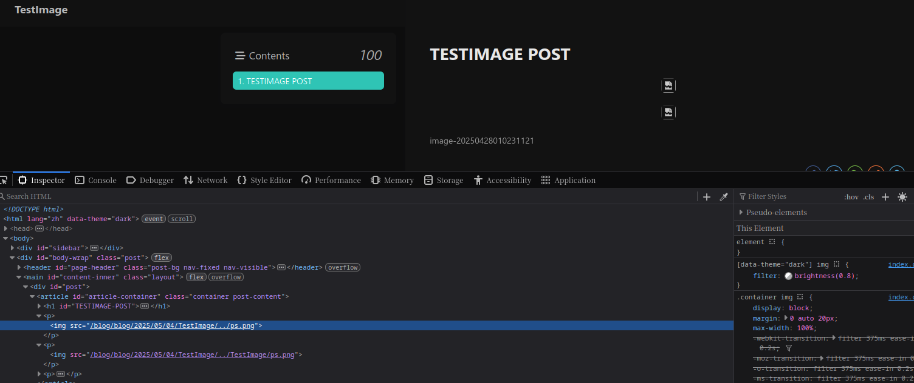
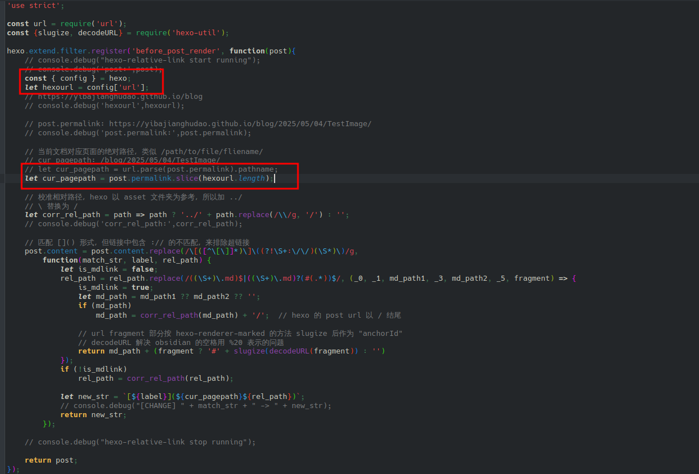
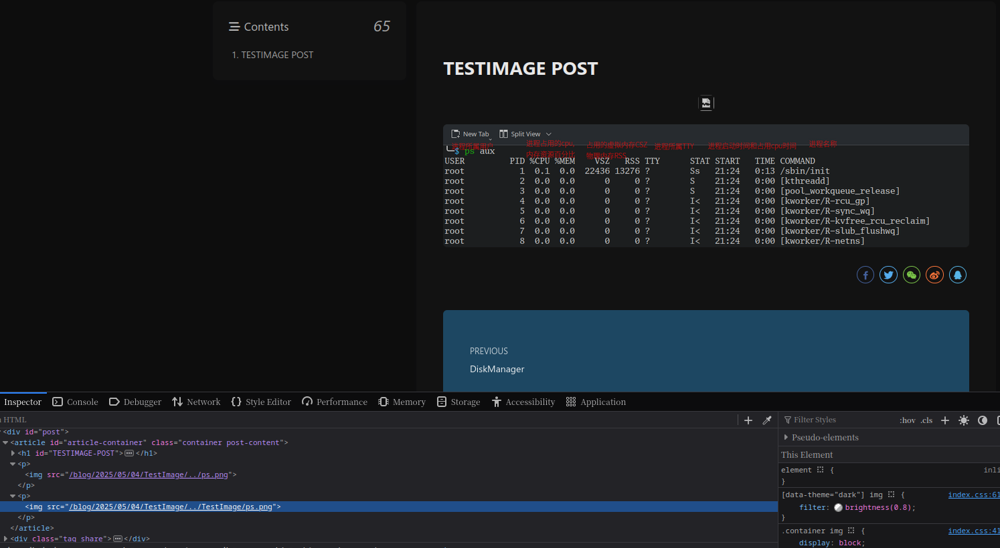
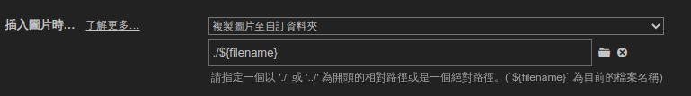

# Hexo图像路径处理问题解决

## 起因

我使用typora在本地编辑`markdown`文件,然后通过`hexo`发布.在本地编辑时,图片被保存在文章所在目录的`assets`目录,这样做在文章发布的时候,hexo框架生成的html文件会从以下路径寻找图片:

```
https://yibajianghudao.github.io/blog/./assets/ps.png
```

从这个路径是无法找到图片的.

注:根据[hexo文档](https://hexo.io/zh-cn/docs/github-pages#%E9%A1%B9%E7%9B%AE%E9%A1%B5%E9%9D%A2),我配置了`/blog`作为主目录.

## 全局资源文件夹

当然,作为一个流行的博客框架,[hexo官方文档](https://hexo.io/zh-cn/docs/asset-folders)中已经有解决的办法:

>全局资源文件夹:
>
>资源（Asset）代表 `source` 文件夹中除了文章以外的所有文件，例如图片、CSS、JS 文件等。 比方说，如果你的Hexo项目中只有少量图片，那最简单的方法就是将它们放在 `source/images` 文件夹中。 然后通过类似于 `` 的方法访问它们。

不过全局资源文件夹有很大限制,比如无法使用相同名称的图片,无法按文章分类图片等等.

## 按文章分类文件夹

按文章分类文件会在文章所在目录下新建与文章文件名相同的目录,可以通过相对目录引用目录下的资源:

需要在`_config.yml`中编辑:

```yaml
// 自动生成目录
post_asset_folder: true
// 不要将链接改为与根目录的相对地址
relative_link: false
marked:
  // 将文章根路径添加到文章内的链接之前
  prependRoot: false
  // 在post_asset_folder设置为true的情况下，在根据prependRoot的设置在所有链接开头添加文章根路径之前，先将文章内资源的路径解析为相对于资源目录的路径。
  postAsset: true
```

然后可以在文件中使用:

```yaml
TestImage.md

```

上面的代码指向的图片是`/source/_posts/TestImage/ps.png`,在网站的html中为:`src="/blog/2025/05/04/TestImage/ps.png"`

但是typora并不能读取到该图片地址,因为typora是从文件所在目录为起始目录,而hexo以文件所在目录下文件名同名目录为起始目录.

我尝试使用:

```yaml

```

这样可以让typora读取到图像,但是网站无法正常显示,并且hexo-renderer-marked没有解析该相对路径(src="/blog/TestImage/ps.png)

查看[issues](https://github.com/hexojs/hexo-renderer-marked/issues/216),发现这似乎仍是一个还未解决的问题.但在答案中已经有了一些解决方法:

1. 手动修改`hexo-render-marked`的代码:

   >i opened `node_modules -> hexo-render-marked -> lib -> render.js` and change the image part (between the *** lines):
   >
   >```
   >  // Prepend root to image path
   >  image(href, title, text) {
   >    const { hexo, options } = this;
   >    const { relative_link } = hexo.config;
   >    const { lazyload, prependRoot, postPath } = options;
   >
   >    if (!/^(#|\/\/|http(s)?:)/.test(href) && !relative_link && prependRoot) {
   >      if (!href.startsWith('/') && !href.startsWith('\\') && postPath) {
   >        const PostAsset = hexo.model('PostAsset');
   >        // findById requires forward slash
   >        // ************************************************************
   >        const pp = require('path');
   >        const ppp = pp.join(postPath, '../');
   >        // const asset = PostAsset.findById(join(postPath, href.replace(/\\/g, '/')));
   >        const asset = PostAsset.findById(join(ppp, href.replace(/\\/g, '/')));
   >        // ************************************************************
   >        // asset.path is backward slash in Windows
   >        if (asset) href = asset.path.replace(/\\/g, '/');
   >      }
   >      href = url_for.call(hexo, href);
   >    }
   >
   >    let out = `    if (text) out += ` alt="${text}"`;
   >    if (title) out += ` title="${title}"`;
   >    if (lazyload) out += ' loading="lazy"';
   >
   >    out += '>';
   >
   >    return out;
   >  }
   >}
   >```
   >
   >​      
   >
   >it works. so the following is my suggests about this product experience

2. 使用插件[hexo-relative-link](https://www.npmjs.com/package/hexo-relative-link)

3. 有一个PR,或许可以自己手动合并后编译新的hexo-renderer-marked

最终我选择了第二个方法,因为我的bolg部署在github page中,并不方便修改插件的源代码,但是我使用`hexo-relative-link`的时候遇到了一个bug:



图片路径中开头多了一个`/blog`,这是我设置的url,详见[hexo文档](https://hexo.io/zh-cn/docs/github-pages#%E9%A1%B9%E7%9B%AE%E9%A1%B5%E9%9D%A2)

一开始我尝试修复bug,然后写了下面的代码:



```javascript
// node_modules/hexo-relative-link/index.js
const { config } = hexo;
let hexourl = config['url'];
let cur_pagepath = post.permalink.slice(hexourl.length);
```

测试后发现可以正常运行:



但后来我发现只是因为我在上面的配置中按照[hexo官方文档](https://hexo.io/zh-cn/docs/asset-folders#%E4%BD%BF%E7%94%A8-Markdown-%E5%B5%8C%E5%85%A5%E5%9B%BE%E7%89%87)设置` prependRoot: true`,该设置似乎和插件冲突,设置为`false`之后这个bug就没有了.

最后配置typora默认图像保存方式:



## 参考

- [Hexo插入图片并解决图片的路径问题](https://www.hwpo.top/posts/d87f7e0c/index.html)

- [hexo-relative-link](https://www.npmjs.com/package/hexo-relative-link)
