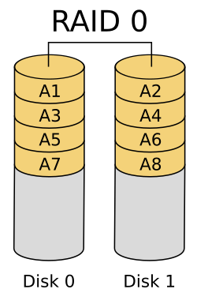
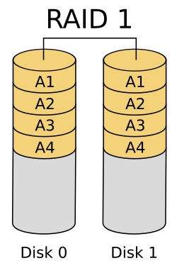

# 磁盘管理

## 硬件

### 分类

|          | 机械硬盘(HDD)    | 固态硬盘(SSD) |
| -------- | ---------------- | ------------- |
| 性价比   | 容量大价格低     | 容量小价格高  |
| 稳定     | 抗击打能力弱     | 抗击打能力高  |
| 速度     | 读写速度(IO)稍慢 | 读写速度快    |
| 数据安全 | 数据易恢复       | 数据恢复难    |
| 寿命     | 寿命长           | 1-2w次        |

### 磁盘接口

| 接口  | 说明                                                 |
| ----- | ---------------------------------------------------- |
| SATA  | 一般家用,多用于机械硬盘,也有固态硬盘,容量大,价格较低 |
| SAS   | 给企业环境使用,一般用于机械硬盘,也有固态硬盘         |
| PCI-E | 企业级使用,固态硬盘                                  |
| U.2   | 企业级固态硬盘,接口类似SATA,兼容SATA,SAS             |

### 磁盘选型

1. 一般情况,数据备份: SATA硬盘,10krpm 4tb,8tb存放备份
2. 网站服务器使用: SAS接口 15krpm 300G,600G,900G
3. 高并发网站服务器: 选择固态硬盘PCI-E,SAS,SATA

rpm(round per minute)每分钟多少转

### 磁盘结构

1. 盘片: 实际存放数据的地方(0 1二进制数据)
2. 磁头: 贴近盘片读写数据
3. 磁道: 磁盘中的圆环形区域,从0开始
4. 扇区: 磁盘上最小存储单位,默认512字节
5. 柱面: 不同盘面上相同的磁道组成的形状

### RAID

RAID(**R**edundant **A**rray of **I**ndependent **D**isks),独立硬盘冗余阵列,简称磁盘阵列,利用虚拟化存储技术把多个硬盘组合起来成为一个或多个硬盘阵列组,目的是为提升效能或资料冗余,或是两者同时提升.

RAID把多个硬盘组合成为一个逻辑硬盘,因此操作系统只会把它当作一个实体硬盘,RAID常用在服务器电脑上,并且常使用完全相同的硬盘作为组合.

服务器需要先制作完raid之后才能安装系统,部署服务.

#### 特点

根据不同的raid级别有所区别,一般无法同时满足:

1. 获取更多容量
2. 获取更高性能
3. 获取更高冗余(安全)

#### RAID级别

| Raid级别        | 最少需要硬盘数 | 安全冗余                | 可用容量               | 性能                      | 使用场景                       | 举例                          |
| --------------- | -------------- | ----------------------- | ---------------------- | ------------------------- | ------------------------------ | ----------------------------- |
| Raid0(条带串联) | 1              | 最低,一块损坏则全部损坏 | 所有硬盘容量的和       | 读写最快(n倍)             | 追求最大容量,速度,不在乎安全性 | 数据库从库,存储从库,web服务器 |
| Raid1(镜像)     | 只能有两块     | 100%                    | 两块硬盘容量之和的一半 | 读取速度正常,写入速度慢   | 只追求安全性,不追求速度        | 系统盘,监控服务器             |
| Raid5           | 3              | 最多损坏一块            | 损失一块盘             | 读取速度正常,写入性能不好 | 追求最大容量,最小预算          | 普遍数据库,存储,访问量不高    |
| Raid10          | 4              | 最多损坏一半            | 损失所有硬盘容量的一半 | 读写比较快                | 对于安全和性能都需要           | 高并发或高访问量的数据库主库  |

##### RAID0

最少需要1台磁盘才能运作.

RAID0,又称"带区卷",将多个磁盘**并联**起来成为一个大容量的磁盘,文件将会被分成不同的部分同时IO,因此速度比单个磁盘要快,但无冗余功能,没有容错能力,一个磁盘(物理)损坏,则所有数据丢失.



##### RAID1

只能2台磁盘运作.

两个磁盘相互镜像,写速度较慢(需要写在两个磁盘),在一些多线程操作系统中能有很好的读取速度(并行读取).可靠性最高,只要有一个磁盘正常即可



##### RAID5

最少需要3台磁盘才能运作.

> 奇偶校验位:
>
> 一些RAID使用奇偶校验块实现冗余。如果阵列中的一块磁盘出现故障，工作磁盘中的数据块与奇偶校验块一起来重建丢失的数据。
>
> 下面的图表每列表示一个磁盘，假设A1 = 00000111、A2 = 00000101以及A3 = 00000000。
>
> A1、A2、A3 异或(不同取0,相同取1)得到的Ap等于00000010。
>
> 如果第二个磁盘出现故障，A2将不能被访问，但是可以通过A1、A3与Ap的异或进行重建:
>
> A1 XOR A3 XOR Ap = 00000101
>
> 同理其他磁盘故障也可以通过其他两个磁盘数据与奇偶校验位重建.
>
> ```
>     冗余磁盘阵列
> A1        A2        A3        Ap
> B1        B2        Bp        B3
> c1        Cp        C2        c3
> Dp        D1        D2        D3
> ```

RAID 5使用奇偶校验位,将奇偶校验位存储在不同磁盘上,当RAID 5的一个磁盘数据发生损坏后,可以利用剩下的数据和相应的奇偶校验信息去恢复被损坏的数据.RAID 5可以理解为是RAID 0和RAID 1的折衷方案.RAID 5可以为系统提供数据安全保障,最多允许一块硬盘故障,保障程度比镜像(RAID2)低,磁盘空间利用率要比镜像高.RAID5具有和RAID0相似的读取速度,但由于多了一个奇偶校验信息,写入速度会比单独写入一块硬盘较慢(RAID5并不是像RAID0那样的并行存储).

##### RAID10

最少需要4台磁盘才能运作.

RAID10:

RAID 10是先做镜像卷RAID 1 将所有硬盘分为两组，再做RAID 0 执行条带化操作分割数据 ，视为以RAID 1作为最低组合，然后将每组RAID 1视为一个“硬盘”组合为RAID 0运作。当RAID 10有一块磁盘故障后,其余磁盘会继续运作.


##### RAID 01

RAID 01则是跟RAID 10的程序相反，是先将数据分割。再做镜像卷RAID 1 它将所有的硬盘分为两组，每组各自构成为RAID 0作为最低组合，而将两组硬盘组合为RAID 1运作。当RAID 01有一块磁盘故障后,同组RAID0磁盘会停止运作.可靠性较低.


### 性能指标

1. 吞吐量:磁盘读写速度
2. iops:(io per second)每秒可以进行的io数量,每秒可以进行读写次数
3. 延迟: 进行读写的时候操作延时
4. 故障间的平均时间(MTBF):固态硬盘基本都是百万小时

连续读写可以用`dd`命令测试

随机读写可以用`fio`命令测试,详见[阿里云文档](https://help.aliyun.com/zh/ecs/user-guide/test-the-performance-of-block-storage-devices)

## 软件

磁盘的使用分为三步:分区,创建文件系统,挂载

### 磁盘分区

磁盘分区是将一块物理硬盘划分为多个逻辑分区,目的是单独管理各个部分,允许多个文件系统位于同一个磁盘上,优点:

1. 从逻辑上隔离数据.
2. 如果一个分区出现逻辑损坏,损坏的仅仅是分区而不是整个硬盘
3. 避免过大的日志或其他文件占满导致整个计算机故障
4. 一些场景需要使用多个分区,如多重启动,swap分区

使用`lsblk`命令列出块设备信息:

```
[root@centos1 ~]# lsblk
NAME            MAJ:MIN RM  SIZE RO TYPE MOUNTPOINT
sda               8:0    0   20G  0 disk 
├─sda1            8:1    0    1G  0 part /boot
└─sda2            8:2    0   19G  0 part 
  ├─centos-root 253:0    0   17G  0 lvm  /
  └─centos-swap 253:1    0    2G  0 lvm  [SWAP]
sr0              11:0    1  4.2G  0 rom  
```

linux中一切皆文件,块设备(包括磁盘等)也是一个文件,存储在`/dev`文件夹下.

#### 创建MBR分区

可以使用`fdisk`命令列出磁盘实体使用情况或对其分区 :

```bash
$ fdisk /dev/sdb

# n new 创建分区
命令(输入 m 获取帮助)：n           
Partition type:
   p   primary (0 primary, 0 extended, 4 free)
   e   extended
Select (default p): 
Using default response p
分区号 (1-4，默认 1)：
起始 扇区 (2048-20971519，默认为 2048)：
将使用默认值 2048
Last 扇区, +扇区 or +size{K,M,G} (2048-20971519，默认为 20971519)：+200M
分区 1 已设置为 Linux 类型，大小设为 200 MiB

# p print 打印磁盘信息
命令(输入 m 获取帮助)：p

磁盘 /dev/sdb：10.7 GB, 10737418240 字节，20971520 个扇区
Units = 扇区 of 1 * 512 = 512 bytes
扇区大小(逻辑/物理)：512 字节 / 512 字节
I/O 大小(最小/最佳)：512 字节 / 512 字节
磁盘标签类型：dos
磁盘标识符：0xe0b2d785

   设备 Boot      Start         End      Blocks   Id  System
/dev/sdb1            2048      411647      204800   83  Linux

# d delete 删除分区
命令(输入 m 获取帮助)：d
分区号 (1,2，默认 2)：2
分区 2 已删除


# w write 保存并退出
命令(输入 m 获取帮助)：w
The partition table has been altered!

Calling ioctl() to re-read partition table.
正在同步磁盘。

#q quit 退出不保存
```

#### 创建GPT分区

可以使用`gdisk`命令创建GPT分区:

```bash
$ gdisk /dev/sdb
GPT fdisk (gdisk) version 0.8.10

Partition table scan:
  MBR: protective   # PMBR
  BSD: not present
  APM: not present
  GPT: present      

Found valid GPT with protective MBR; using GPT.


Command (? for help): ?
b       back up GPT data to a file
c       change a partition's name
d       delete a partition
i       show detailed information on a partition
l       list known partition types
n       add a new partition
o       create a new empty GUID partition table (GPT)
p       print the partition table
q       quit without saving changes
r       recovery and transformation options (experts only)
s       sort partitions
t       change a partition's type code
v       verify disk
w       write table to disk and exit
x       extra functionality (experts only)
?       print this menu
```

#### 查看分区表类别:

使用`parted`命令:

```bash
$ parted /dev/sdb

(parted) print
Model: VMware, VMware Virtual S (scsi)
Disk /dev/sdb: 10.7GB
Sector size (logical/physical): 512B/512B
Partition Table: msdos      # msdos指MBR
Disk Flags: 

Number  Start   End    Size   Type     File system  标志
 1      1049kB  211MB  210MB  primary
```

还可以使用`parted`命令创建分区表以及分区:

```bash
$ parted -s /dev/sdb mklabel gpt
# 分区类型:LinuxLVM,大小30G
$ parted -s /dev/sdb unit GB mkpart primary 1 30 set 1 lvm on
# 分区类型:Linux,大小10G
$ parted -s /dev/sdb unit GB mkpart primary 50 60
```

#### dd

`dd`命令用于复制文件并对原文件内容进行转换和格式化处理,dd经常用于操作一些底层问题,比如直接对物理磁盘进行操作,对磁盘操作时,最好使用块设备文件:

```bash
# 生成一个1G大小的空文件
dd if=/dev/zero of=/tmp/swapfile bs=1M count=1000
if=<文件>:(input file)输入文件,/dev/zero不断输出空
of=<文件>:输出文件
bs=<字节数>:(block size)将ibs和obs设定成指定的字节数
ibs=<字节数>:每次读取的字节数
obs=<字节数>:每次输出的字节数
# 清空磁盘的前512个字节(分区表)
dd if=/dev/zero of=/dev/sdb bs=1 count=512 
```

#### 创建交换分区

交换分区(Swap parttion),用于在内存不足时临时充当内存使用(占用磁盘空间)

1. 创建指定大小的文件(1G):

   ```bash
   dd if=/dev/zero of=/tmp/swapfile bs=1M count=1000
   ```

2. 把文件转换为swap格式:

   ```bash
   # 检查当前状态
   $ file /tmp/swapfile
       swapfile: data
   $ mkswap /tmp/swapfile
   $ file /tmp/swapfile
       swapfile: Linux/i386 swap file (new style), version 1 (4K pages), size 255999 pages, no label, UUID=f66fd29c-b03b-49db-8446-54460e66298e
   ```

3. 激活swap,把它加入linux中

   ```bash
   $ free -h
                 total        used        free      shared  buff/cache   available
   Mem:           1.9G        199M        432M        9.6M        1.3G        1.6G
   Swap:          2.0G          0B        2.0G
   
   $ chomod 600 /tmp/swapfile
   $ swapon /tmp/swapfile
   $ free -h
                 total        used        free      shared  buff/cache   available
   Mem:           1.9G        200M        432M        9.6M        1.3G        1.6G
   Swap:          3.0G          0B        3.0G
   ```

4. 配置永久挂载

### LVM

LVM的主要有点是可以简单的调整逻辑卷(对应分区)或卷组(对应磁盘)

### 格式化(创建文件系统)

创建文件系统(make filesystem)可以使用`mkfs`命令:

```
mkfs.xfs /dev/sdb1

# centos7 默认使用xfs
# centos6 使用ext4格式
```

### 挂载

linux中的设备需要挂载到已经存在的空目录才能使用(指定入口)

通过`mount`命令指定设备和入口(目录):

```
mount /dev/sdb1 /mnt/sd1/
```

实体`umount`命令卸载设备

```
umount /dev/sdb1
# 都可以
umount /mnt/sd1
```

永久挂载:

1. 编辑`/etc/rc.local`文件,写入挂载命令(`mount /dev/sdb1 /mnt/sd1/`) `/etc/rc.local`文件会在所有服务加载后执行脚本或命令
2. 编辑`/etc/fstab`文件

```
# /etc/fstab
# 设备名(/dev/ 或 uuid) # 挂载点                #文件系统类型 #挂载选项      #是否备份 # 是否检查
/dev/mapper/centos-root /                       xfs     defaults        0 0
UUID=f36f7896-d6c4-4980-b415-a7d5ee247aad /boot                   xfs     defaults        0 0
/dev/mapper/centos-swap swap                    swap    defaults        0 0
```

### 企业分区方案

| 分区  | 作用与大小                                                   | 补充                              |
| ----- | ------------------------------------------------------------ | --------------------------------- |
| /boot | 引导分区,引导系统启动与存放引导文件,存放系统内核镜像,推荐1G即可 |                                   |
| swap  | 交换分区,若内存小于8G,配置内存容量1.5倍或2倍,最大配置8G即可  | 公有云可以不配置,java建议配置一些 |
| /     | 根分区,若为服务器不重要数据,占剩余全部空间即可,不需要data 若为服务器重要数据,占40-200G安装一些软件即可 |                                   |
| /data | 数据分区,存放重要数据或配置文件等. 若服务器数据重要,占剩余空间即可,否则不需要单独分区 |                                   |

### 故障案例排查

#### 磁盘空间不足(block)

错误提示:`no space left on device`

现象:`df -h`磁盘分区使用率达到100%

模拟:

```bash
# 创建一个大文件
dd if=/dev/zero of=/var/testlog/nginx.log bs=1M count=2000 
dd: error writing ‘/var/testlog/nginx.log’: No space left on device
982+0 records in
981+0 records out
1028718592 bytes (1.0 GB) copied, 0.640031 s, 1.6 GB/s
```

解决:

```
# 查看哪个分区空间不足
df -h

Filesystem               Size  Used Avail Use% Mounted on
devtmpfs                 979M     0  979M   0% /dev
tmpfs                    991M     0  991M   0% /dev/shm
tmpfs                    991M  9.5M  981M   1% /run
tmpfs                    991M     0  991M   0% /sys/fs/cgroup
/dev/mapper/centos-root   17G  3.3G   14G  20% /
/dev/sda1               1014M  161M  854M  16% /boot
tmpfs                    199M     0  199M   0% /run/user/0
/dev/sdb1               1014M 1014M  736K 100% /var/testlog

# 排查具体文件
du -sh /var/testlog/*

982M    /var/testlog/nginx.log
```

#### 磁盘空间不足(inode)

inode的数量在磁盘格式化后是固定的,如果磁盘存储了太多小文件,导致占用inode过快,也会导致磁盘空间不足

现象:错误提示:`no space left on device`但是`df -h`的结果磁盘空间并没有满

排查:

`df -i`查看inode使用情况

模拟:

```bash
# 创建十万个文件
$ touch {1..100000}

touch: cannot touch ‘99997’: No space left on device
touch: cannot touch ‘99998’: No space left on device
touch: cannot touch ‘99999’: No space left on device
touch: cannot touch ‘100000’: No space left on device

$ df -h
Filesystem               Size  Used Avail Use% Mounted on
devtmpfs                 979M     0  979M   0% /dev
tmpfs                    991M     0  991M   0% /dev/shm
tmpfs                    991M  9.5M  981M   1% /run
tmpfs                    991M     0  991M   0% /sys/fs/cgroup
/dev/mapper/centos-root   17G  3.3G   14G  20% /
/dev/sda1               1014M  161M  854M  16% /boot
tmpfs                    199M     0  199M   0% /run/user/0
/dev/sdb1                 97M   33M   65M  34% /var/testlog

$ df -i
Filesystem               Inodes IUsed   IFree IUse% Mounted on
devtmpfs                 250481   412  250069    1% /dev
tmpfs                    253460     1  253459    1% /dev/shm
tmpfs                    253460   745  252715    1% /run
tmpfs                    253460    16  253444    1% /sys/fs/cgroup
/dev/mapper/centos-root 8910848 72377 8838471    1% /
/dev/sda1                524288   333  523955    1% /boot
tmpfs                    253460     1  253459    1% /run/user/0
/dev/sdb1                 51200 51200       0  100% /var/testlog
```

解决:找出分区中有大量小文件的目录,确认是否可以删除或处理

```bash
# find找到所有文件(-type f),传递给dirname显示其所在目录,sort排序后uniq统计次数
$ find /var/testlog/ -type f | xargs dirname | sort | uniq -c

51260 /var/testlog/log
```

#### 磁盘空间不足(未彻底删除)

文件彻底删除需要两个条件:

1. 硬连接数为0
2. 文件调用数为0(文件是否在使用中(命令,服务等))

现象:

报错`no space left on device`,`df -h`提示空间满了,但是`du -sh`显示未满

排查:

1. 使用`ls`,`find`等指令查看硬连接数是否为0
2. 使用`lsof`(list open file)命令查看进程调用数是否为0

模拟:

```bash
# /dev/sdb1共5G,挂载在/var/testlog
# 创建一个4G的大文件:
dd if=/dev/zero of=/var/testlog/nginx.log bs=1M count=4000

# tail程序后台查看它
tail -f nginx.log &

# 创建新文件,发现写入到1G就被终止了
dd if=/dev/zero of=/var/testlog/nginx.log bs=1M count=2000

dd: error writing ‘/var/testlog/nginx.log’: No space left on device
1078+0 records in
1077+0 records out
1129316352 bytes (1.1 GB) copied, 0.700917 s, 1.6 GB/s

#df -h查看发现磁盘满了
df -h
文件系统                 容量  已用  可用 已用% 挂载点
devtmpfs                 979M     0  979M    0% /dev
tmpfs                    991M     0  991M    0% /dev/shm
tmpfs                    991M  9.6M  981M    1% /run
tmpfs                    991M     0  991M    0% /sys/fs/cgroup
/dev/mapper/centos-root   17G  7.9G  9.2G   46% /
/dev/sda1               1014M  161M  854M   16% /boot
tmpfs                    199M     0  199M    0% /run/user/0
/dev/sdb1                5.0G  4.0G  1.1G   79% /var/testlog

# 但是du显示没有占用空间:
du -sh
0       .

# lsof查看被删除的文件:
lsof | grep deleted
# 命令或服务器名称  pid     用户                                      文件大小    文件inode号码   文件名
firewalld 1070         root    8u      REG              253,0       4096   16777600 /tmp/#16777600 (deleted)
gmain     1070 1317    root    8u      REG              253,0       4096   16777600 /tmp/#16777600 (deleted)
tuned     1491         root    8u      REG              253,0       4096   16777289 /tmp/#16777289 (deleted)
gmain     1491 1741    root    8u      REG              253,0       4096   16777289 /tmp/#16777289 (deleted)
tuned     1491 1742    root    8u      REG              253,0       4096   16777289 /tmp/#16777289 (deleted)
tuned     1491 1745    root    8u      REG              253,0       4096   16777289 /tmp/#16777289 (deleted)
tuned     1491 1746    root    8u      REG              253,0       4096   16777289 /tmp/#16777289 (deleted)
tail      1846         root    3r      REG               8,17 4194304000         67 /var/testlog/nginx.log (deleted)

# kill 掉程序(或重启服务)即可
kill 1846

# df -h磁盘空间空余
df -h
文件系统                 容量  已用  可用 已用% 挂载点
devtmpfs                 979M     0  979M    0% /dev
tmpfs                    991M     0  991M    0% /dev/shm
tmpfs                    991M  9.6M  981M    1% /run
tmpfs                    991M     0  991M    0% /sys/fs/cgroup
/dev/mapper/centos-root   17G  7.9G  9.2G   46% /
/dev/sda1               1014M  161M  854M   16% /boot
tmpfs                    199M     0  199M    0% /run/user/0
/dev/sdb1                5.0G   33M  5.0G    1% /var/testlog
```
