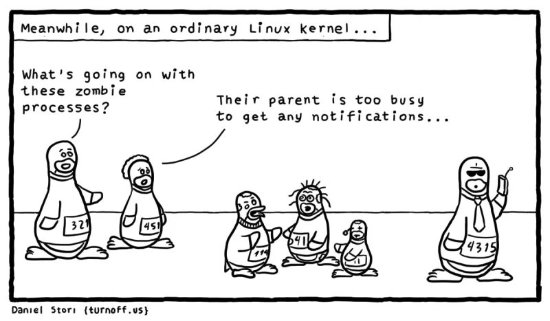
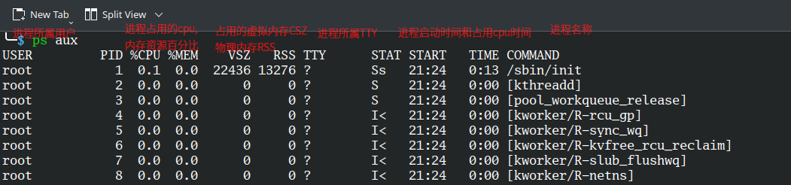
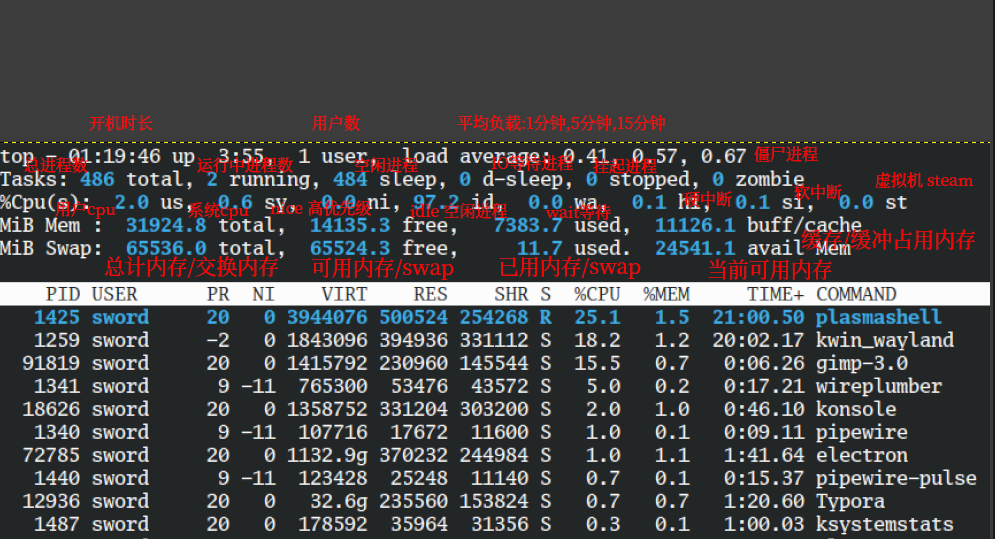
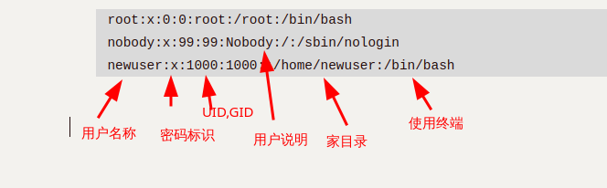

# Linux学习笔记

## 基础部分

### linux文件

文件创建时创建inode和block

#### 文件存储机制

##### inode与block结构

| 组件  | 作用                                 | 查看命令 |
| ----- | ------------------------------------ | -------- |
| inode | 存储元数据+block指针（不包含文件名） | `df -i`  |
| block | 存储文件内容（最小单位4KB）          | `df -h`  |

##### 文件访问流程

1. 通过文件名在目录block中查找inode号
2. 读取inode元数据校验权限
3. 通过block指针访问文件内容

### 特殊符号

#### 引号

| 引号     | 含义                                               |
| -------- | -------------------------------------------------- |
| 反引号   | 优先执行,先执行反引号里面的命令                    |
| 单引号   | 单引号中的内容会原封不动的输出                     |
| 双引号   | 和单引号类似,但双引号中的特殊符号会被解析          |
| 不加引号 | 和双引号类似,额外支持通配符(匹配文件) *.log{1..10} |

```
# 反引号
# 先找到sudo命令的位置,然後對該位置運行ls
ls -l `which sudo`

# 单引号
echo '`hostname` $(whoami) $UID {1..5}'
`hostname` $(whoami) $UID {1..5}

# 双引号
echo "`hostname` $(whoami) $UID {1..5}"
centos1 root 0 {1..5}

# 不加引号
echo `hostname` $(whoami) $UID {1..5}
centos1 root 0 1 2 3 4 5
```

#### 重定向

##### 文件描述符

**文件描述符（File Descriptor，简称 fd）** 是操作系统用于 **跟踪和管理打开文件或其他 I/O 资源** 的整数标识符。它是进程访问文件、管道、套接字等资源的抽象句柄。

文件描述符是一个 **非负整数**（如 `0`、`1`、`2`、`3`...）,由内核分配，进程通过它操作文件或 I/O 设备。

每个进程启动时，默认打开 3 个标准 fd：

| 文件描述符 | 名称         | 默认绑定设备  | 用途                   |
| :--------- | :----------- | :------------ | :--------------------- |
| `0`        | **标准输入** | `/dev/stdin`  | 读取输入（如键盘输入） |
| `1`        | **标准输出** | `/dev/stdout` | 输出正常结果（到终端） |
| `2`        | **标准错误** | `/dev/stderr` | 输出错误信息（到终端） |

1. **操作文件**

- 通过 `open()` 系统调用打开文件时，内核返回一个 fd：

  ```
  int fd = open("file.txt", O_RDWR);  // 返回一个整数 fd（如 3）
  ```

- 后续通过 `read(fd, ...)`、`write(fd, ...)` 等操作文件。

2. **重定向 I/O**

- 用 `>`、`>>`、`<` 等符号时，Shell 实际是修改了进程的 fd 绑定：

  ```
  command > file.txt   # 将 fd 1（标准输出）重定向到 file.txt
  command 2> error.log # 将 fd 2（标准错误）重定向到 error.log
  ```

3. **管道（Pipe）和套接字（Socket）**

- 管道（`|`）本质是连接两个进程的 fd：

  ```
  ls | grep "test"  # ls 的 fd 1 连接到 grep 的 fd 0
  ```

- 套接字通信也通过 fd 实现（如网络编程中的 `socket_fd`）。

##### 输出重定向

> 默认状态下,标准输入(stdin)输入到命令/服务/进程中,并产生标准输出(stdout,1号出口)或标准错误输出(stderr,2号出口)并显示到屏幕上,还有其他输出可能会写入到文件中,重定向就是改变命令/进程/服务默认的输出,例如将stdout和stder均重定向到文件中.

使用`1>`或`>`和`1>>`或`>>`可以重定向标准输出(stdout):

```
# 直接清空并写入
echo {1..5} 1>111.txt
# 追加
echo {1..5} 1>>111.txt
```

使用`2>`和`2>>`可以重定向标准错误输出(stderr):

```
whoami -h 2>err.txt
whoami -h 2>>err.txt
```

同时使用1和2可以将标准输出和标准错误输出一起重定向,常用于记录日志

```
# 同时重定向
echo 123 >>111.txt 2>>111.txt

# 简单写法 2>&1表示把标准错误输出写入到标准输出中,然后都追加到111.txt
echo 123 >>111.txt 2>&1

# 最简写法
echo 123 &>>111.txt
```

##### 输入重定向

使用`<`或`0<`符号进行输入重定向,常与固定命令配合:

```
# 与xargs搭配,指定读取文件内容,-n3表示把文件内容分成3组
xargs -n3 <num.txt

```

`<<`(Here Document)

用于向命令或脚本传递多行输入,将两个相同分隔符之间的内容作为输入流:

基本语法:

```bash
command << DELIMITER
	多行内容...
DELIMITER
```

DELIMITER是自定义的分隔符,需要成对出现,常用的有(EOF,END)

输入内容会从`<< DELIMITER`下一行开始,直到遇到独立的`DELIMITER`

```bash
cat > output.txt << 'END'
111
222
333
$PATH
DEND
'END'
END
```

如果第一个`DELIMITER`不带单引号,`$PATH`会被解析,如果`DELIMITER`带了单引号,仍需要遇到不带单引号的`DELIMITER`才会停止,以上命令的结果如下:

```bash
cat output.txt 
111
222
333
$PATH
DEND
'END'
```

#### |

`|` 管道符号：前1个命令输出给后面命令使用，一般過濾

### 特殊文件

#### /dev/zero

无限零字节流文件

#### /dev/null

丢弃所有写入的数据

### 重定向

linux中的输入输出重定向是很多命令的基础,输出重定向又分为标准输出重定向和标准错误重定向

> 秉承着“万物皆文件”的UNIX主旨,程序实际上从`stdin`文件(标准输入，standard input的缩写)中获取输入,并将运行结果和状态消息分别发送到了名为`stdout`(标准输出，standard output的缩写)和`stdeer`(标准错误，standard error的缩写）)的特殊文件

#### 标准输出

可以使用重定向操作符`>`将标准输出重定向到文件中

```
ls -l /usr/bin > ls-output.txt
```

`>`重定向默认会清空文件,例如

```
ls -l /bin/usr > ls-output.txt
ls: cannot access '/bin/usr': No such file or directory
```

即使收到了错误信息,依旧会清空`ls-output.txt`文件

而如果想要追加,可以使用`>>`

```
ls -l /bin/usr >> ls-output.txt
```

#### 标准错误

`>`符号不会重定向标准错误,如果要重定向标准错误到文件,可以引用**文件描述符**

程序可以在任意经过编号的文件流上生成输出结果,我们将前三个文件流称为`标准输入`,`标准输出`和`标准错误`,分别对应`0`,`1`,`2`

```
# 使用文件描述符重定向标准错误
ls -l /bin/usr 2> ls-errot.txt
```

将标准输出和标准错误重定向到同一个文件中:

对于旧版本shell,可以使用

```
ls -l /bin/usr > ls-output.txt 2>&1
```

> 重定向操作的顺序非常重要,标准错误的重定向操作必须在标准输出重定向之后执行，否则无法奏效。
>
> 在下面的例子中，标准错误被重定向到ls-output.txt：
>
> `>ls-output.txt 2>&1`
>
> 如果改变了重定向操作的顺序，标准错误会被重定向到屏幕：
> `2>&1 >ls-output.txt`

新版本的bash提供了更流畅的方法:

```
ls -l /bin/usr &> ls-output.txt
```

#### 丢弃输出结果

可以将输出重定向到名为`/dev/null`的特殊文件来丢弃输出结果:

```
# 丢弃命令的错误输出
ls -l /bin/usr 2> /dev/null
```

#### 标准输入

当仅使用`cat`命令时,程序会等待并读取键盘上的输入,并将其输出到标准输出(通常是显示器)中,直到读取到`EOF`(End Of File,可以通过按下`ctrl + D`输入)

通过重定向操作符`<`可以把标准输入从键盘改为文件

```
cat < lazy_dog.txt
The quick brown fox j umped over the lazy dog.
```

这个直接传递一个文件名给`cat`的结果是一样的

```
cat lazy_dog.txt
The quick brown fox j umped over the lazy dog.
```

### 管道

Shell的管道特性利用了命令能够从标准输入读取数据并将数据发送到标准输出的能力。通过管道操作符`|`，可以将一个命令的**标准输出**传给另一个命令的**标准输入**：

```
ls -l /usr/bin | less
```

管道往往用来执行复杂的数据操作。我们也可以把多个命令组合在一起形成管道，这种方式中用到的命令通常被称为过滤器（filter）。

#### T形管道

`tee`命令从标准输入读取内容,然后将其复制到标准输出和其他文件中.

```
ls /usr/bin | tee ls.txt | grep zip
bsdunzip
bunzip2
bzip2
bzip2recover
ebunzip
ebzip
ebzipinfo
funzip
gunzip
gzip
hunzip
hzip
```


### 命令别名

使用`alias`命令可以设置命令别名.常见用法:

```bash
# 查看所有别名
alias

# 查看ll别名对应的命令
alias ll

# 设置命令别名
alias ll=`ls -l`
```

可以在`~/.bashrc`,`/etc/profile`等设置环境变量的文件中写入alias命令来达到配置永久生效

可以使用`unalias`命令来取消别名

### 命令运行

linux如何判断上一条命令是否执行成功:

1. 使用`$?`

   ```
   ls / 
   
   # 返回0则成功执行,其他表示失败
   echo $?
   0
   ```

2. 使用`&&`和`||`

   ```
   ls -a && echo 'success' || echo 'failed'
   ```

   只有命令成功才执行&&,只有失败才执行||

### 命令信息

`which`显示命令的位置:

```
$ which sudo
/usr/bin/sudo
```

`whereis`查询命令及相关文件的位置

```
$ whereis sudo
sudo: /usr/bin/sudo /usr/lib/sudo /usr/share/man/man8/sudo.8.gz
```

## 系统管理

### 系统信息

#### 查看cpu

`lscpu`检查当前系统的cpu状态:

`````
[root@nfs nginx]#lscpu
Architecture:          x86_64
CPU op-mode(s):        32-bit, 64-bit
Byte Order:            Little Endian
CPU(s):                4
On-line CPU(s) list:   0-3
Thread(s) per core:    1
Core(s) per socket:    2
Socket(s):             2
NUMA node(s):          1
Vendor ID:             GenuineIntel
CPU family:            6
Model:                 63
Model name:            Intel(R) Xeon(R) CPU E5-2673 v3 @ 2.40GHz
Stepping:              2
CPU MHz:               2394.454
BogoMIPS:              4788.90
Hypervisor vendor:     VMware
Virtualization type:   full
L1d cache:             32K
L1i cache:             32K
L2 cache:              256K
L3 cache:              30720K
NUMA node0 CPU(s):     0-3
Flags:                 fpu vme de pse tsc msr pae mce cx8 apic sep mtrr pge mca cmov pat pse36 clflush mmx fxsr sse sse2 ss ht syscall nx pdpe1gb rdtscp lm constant_tsc arch_perfmon nopl xtopology tsc_reliable nonstop_tsc eagerfpu pni pclmulqdq ssse3 fma cx16 pcid sse4_1 sse4_2 x2apic movbe popcnt tsc_deadline_timer aes xsave avx f16c rdrand hypervisor lahf_lm abm invpcid_single ssbd ibrs ibpb stibp fsgsbase tsc_adjust bmi1 avx2 smep bmi2 invpcid xsaveopt arat md_clear spec_ctrl intel_stibp flush_l1d arch_capabilities
`````

`nproc`查看cpu核心数

#### 文件描述符

`ulimit -n`查看系统文件描述符限制

文件描述符分为**用户级**(每个用户登录后占用的文件描述符总数)和**系统级**(所有用户打开文件描述符的总和)

临时调整:

````
# 用户级
sudo ulimit -n 65535

# 系统级
sudo sysctl -w fs.file-max=65535
````

永久调整:

```
# 用户级
sudo vim /etc/security/limits.conf
* hard nofile 65535
* soft nofile 65535

# 系统级
sudo vim /etc/sysctl.conf
fs.file-max=65535
```

> 下面是摘自kernel document中关于file-max和file-nr参数的说明
>
> ```bash
> file-max & file-nr:
> 
> The kernel allocates file handles dynamically, but as yet it doesn't free them again.
> 内核可以动态的分配文件句柄，但到目前为止是不会释放它们的
> 
> The value in file-max denotes the maximum number of file handles that the Linux kernel will allocate. When you get lots of error messages about running out of file handles, you might want to increase this limit.
> file-max的值是linux内核可以分配的最大文件句柄数。如果你看到了很多关于打开文件数已经达到了最大值的错误信息，你可以试着增加该值的限制
> 
> Historically, the three values in file-nr denoted the number of allocated file handles, the number of allocated but unused file handles, and the maximum number of file handles. Linux 2.6 always reports 0 as the number of free file handles -- this is not an error, it just means that the number of allocated file handles exactly matches the number of used file handles.
> 在kernel 2.6之前的版本中，file-nr 中的值由三部分组成，分别为：1.已经分配的文件句柄数，2.已经分配单没有使用的文件句柄数，3.最大文件句柄数。但在kernel 2.6版本中第二项的值总为0，这并不是一个错误，它实际上意味着已经分配的文件句柄无一浪费的都已经被使用了
> ```

### 时间管理

#### date

date [选项]... [+格式]
常用格式如下:

- %F 完整日期格式，等价于 %Y-%m-%d
- %Y 年份
- %m 月份
- %d 日期
- %H 0-23小时
- %M 分钟
- %S 秒
- %s 自UTC 时间 1970-01-01 00:00:00 以来所经过的秒数

例如:

```
date "+%Y-%m-%d %H:%M:%S"   
2025-07-25 01:52:34
```

date -d 按照给定的描述显示时间,比如 `date -d '-1 day'`,`date -d '1 day'`.  

date -s 修改时间,比如:`date -s '20221111'`.  

#### ntpdate

ntpdate是通过网络进行时间同步的工具,例如:

```
ntpdate ntp1.aliyun.com
```

使用阿里云的时间服务器进行同步

#### timedatectl

修改時區:
`timedatectl I set-timezone Asia/Shanghai`

使用`timedatectl set-timezone Asia/Shanghai`修改时区为上海

使用`ntpdate ntp1.aliyun.com`使用阿里云的ntp服务器同步网络时间

### 网络管理

可以使用`ip address`查看当前网络配置

#### CentOS 7

通过编辑`/etc/sysconfig/network-scripts/ifcfg-eth1`和`/etc/sysconfig/network-scripts/ifcfg-eth0`来管理网络配置文件,示例如下:

```
# NAT网络的eth0网卡
TYPE=Ethernet		# 网络类型
BOOTPROTO=none		# 获取静态IP的方式
NAME=eth0			# 名称
DEVICE=eth0			# 名称
ONBOOT=yes			# 开机自启
IPADDR=10.0.0.200	# IP地址
PREFIX=24			# 子网掩码
GATEWAY=10.0.0.2    # 网关
DNS1=223.5.5.5      # DNS服务器
```

```
# 局域网的eth1网卡
TYPE=Ethernet   # 网络类型
BOOTPROTO=none  # 获取静态IP的方式
NAME=eth1       # 名称
DEVICE=eth1     # 名称
ONBOOT=yes      # 开机自启
IPADDR=172.16.1.200 # IP地址
PREFIX=24       # 子网掩码
```

然后重启网络服务即可:

```
systemctl restart network
```

#### Ubuntu 22

ubuntu22 迁移到了Netplan系统,网络配置文件位于`/etc/netplan/`,在安装ubuntu时可能会默认存在一个`50-cloud-init.yaml`,直接修改该文件配置会在重启后还原

取消此配置需要新建一个`/etc/cloud/cloud.cfg.d/99-disable-network-config.cfg`,写入`network: {config: disabled}`

然后删除`50-cloud-init.yaml`(或更换后缀名),新建一个配置文件,示例如下:

```
vim /etc/netplan/01-static-config.yaml
network:
  ethernets:
    ens33:
      dhcp4: no
      addresses:
        - 11.0.0.80/24
      routes:
        - to: default
          via: 11.0.0.1
      nameservers:
        addresses: [223.5.5.5]
  version: 2
```

然后重新生成和使用配置即可:

```
netplan generate

netplan apply
```

### 进程管理

进程是程序执行时的运行实例,它可以是前台进程(交互式进程)也可以是非交互式进程(非交互式进程),进程可以由主进程(parent process)或其它子进程创建.

在linux系统中,除了第一个PID为1的init(或system)进程外,每个进程都有一个父进程,进程也有自己的子进程.可以使用`pstree`命令查看进程树:

```bash
$ pstree
systemd─┬─NetworkManager───3*[{NetworkManager}]
        ├─bluetoothd
        ├─dbus-broker-lau───dbus-broker
        ├─mariadbd───8*[{mariadbd}]
        ├─nginx───24*[nginx]

```

#### 进程状态

linux中的进程有一个进程状态:

| STAT基本状态 | 描述                               |
| ------------ | ---------------------------------- |
| R(running)   | 运行中进程                         |
| S(sleeping)  | 可中断进程                         |
| T(terminate) | 进程被暂停(挂起)(ctrl+z)           |
| D            | 不可中断的进程(进程正在进行IO读写) |
| Z(zombie)    | 僵尸进程,异常的进程                |

| STAT状态 + 符号(附加状态) | 描述                                                         |
| ------------------------- | ------------------------------------------------------------ |
| s                         | 进程是控制进程,即父进程/主进程                               |
| <                         | 进程运行在高优先级上,S<优先级较高的进程                      |
| N                         | 进程运行在低优先级上,SN优先级较低的进程                      |
| +                         | 当前进程运行在前台,R+表示该进程在前台运行                    |
| l                         | 进程是多线程的,sl表示进程是以线程方式运行<br />使用多线程可以让服务或软件支持更改的访问 |

#### 僵尸进程

当一个进程停止时,其父进程会被告知,以便进行一些清理工作(比如释放内存空间,资源占用).然而,如果父进程没有意识到子进程的死亡(挂掉了),子进程就会进入僵尸状态．对于父进程来说，子进程仍然存在，但实际上子进程已经死亡并持续存在于系统中．



可以使用`ps aux | grep Z`找出僵尸进程的pid,然后通过`pstree -p | grep pid`查看僵尸进程的父进程,通过`kill pid`指令无法直接结束僵尸进程,需要结束僵尸进程的父进程才能结束僵尸进程.

#### 孤儿进程

孤儿进程指其父进程执行完成或被终止后仍继续运行的一类进程,孤儿进程会被系统直接接管(system进程)

#### 查看进程信息

##### ps

`ps`命令用于静态查看当前系统的进程状态,常见的命令有:
`ps -ef`以BSD格式显示所有正在运行的进程的UID,PID,PPID(父进程的id),CMD(进程名字)

`ps aux`以标准格式显示所有正在运行的进程,除了-ef的结果,还有cpu使用率,内存使用率,占用内存大小,进程状态

- -a 显示所有终端机下执行的程序
- -u 以用户为主的格式显示
- -x 显示所有程序



`ps`命令经常与其他命令配合使用,例如和`kill`命令搭配随时中断,删除不必要的程序

```bash
# 取出所有进程中内存使用率最高的前5个
ps aux | sort -rnk4 | head -5
```

##### top

`top`命令可以动态的查看系统的整体运行情况,包括进程状态(僵尸进程等)



常用快捷键:

- q 退出
- 空格 立即刷新(默认3秒刷新)
- P 按照cpu使用率排序
- M 按照内存使用率排序

进阶使用:

- 按z进入颜色模式,按x标记当前按照哪一列排序
- shift + > 向右
- shift + < 向左

`top -b`进入非交互式模式,`top -n1`表示只输入一次结果:

```bash
top -bn1 | awk 'NR=2'
```

`htop`是top的增强版,支持使用鼠标进行操作.

#### 结束进程

1. `kill`,`kill + 进程pid`结束进程
2. `pkill`,`pkill + 进程名字`模糊查找,结束进程
3. `killall`,`killall + 进程名字`精确结束进程

### 后台管理

linux运行程序分为后台和前台程序,要区分前台和后台程序,可以查看进程状态,带`+`表示前台运行的程序.

- 前台运行:需要连接后才能运行和操作,连接断开后操作会自动结束
- 后台运行:让软件进入系统的后台持续运行,一般情况下连接断开也不会影响软件的运行.

可以使用`job`命令查看

#### 后台运行的方法

1. 使用在命令后添加`&`:

   ```bash
   ╰─$ sleep 999 &     
   [1] 61448
   # 返回的是进程的pid
   
   # 可以使用jobs命令查看当前终端正在后台运行的进程:
   ╰─$ jobs
   [1]    running    sleep 999
   [2]    running    sleep 999
   [3]  - running    sleep 999
   [4]  + running    sleep 999
   
   ```

2. `nohup`命令配合`&`方法,可以保留输出到指定文件中,默认是nohup.out文件中,其他和`&`一致
   `nohup`命令可以将程序以忽略挂起信号的方式运行起来，被运行的程序的输出信息将不会显示到终端,默认追加到当前目录下的`nohup.out`文件,若不可写,则追加到`$HOME/nohup.out`文件.nohup命令本身并无后台含义，直接执行仍会占用终端，故常与`&`连用.

   ```bash
   ╰─$ nohup ping -c10 127.0.0.1 &
   [5] 62063
   nohup: ignoring input and appending output to 'nohup.out'                                                     
   ╰─$ 
   [5]  + 62063 done       nohup ping -c10 127.0.0.1
   
   ╰─$ cat nohup.out
   PING 127.0.0.1 (127.0.0.1) 56(84) bytes of data.
   64 bytes from 127.0.0.1: icmp_seq=1 ttl=64 time=0.042 ms
   64 bytes from 127.0.0.1: icmp_seq=2 ttl=64 time=0.037 ms
   64 bytes from 127.0.0.1: icmp_seq=3 ttl=64 time=0.033 ms
   64 bytes from 127.0.0.1: icmp_seq=4 ttl=64 time=0.027 ms
   64 bytes from 127.0.0.1: icmp_seq=5 ttl=64 time=0.043 ms
   64 bytes from 127.0.0.1: icmp_seq=6 ttl=64 time=0.050 ms
   64 bytes from 127.0.0.1: icmp_seq=7 ttl=64 time=0.049 ms
   64 bytes from 127.0.0.1: icmp_seq=8 ttl=64 time=0.035 ms
   64 bytes from 127.0.0.1: icmp_seq=9 ttl=64 time=0.048 ms
   64 bytes from 127.0.0.1: icmp_seq=10 ttl=64 time=0.035 ms
   
   --- 127.0.0.1 ping statistics ---
   10 packets transmitted, 10 received, 0% packet loss, time 9208ms
   rtt min/avg/max/mdev = 0.027/0.039/0.050/0.007 ms
   
   ```

3. 使用`ctrl + z`让当前运行的命令或服务进入**后台挂起**,若要进入**后台运行**,需要再运行`bg`命令,可以通过`fg`取消挂起

4. `screen`使用`nohup`+`&`命令不会停止,但不稳定,使用`screen`命令可以较为稳定的在后台运行命令.
   screen简易原理:

   > Screen is a terminal multiplexer, or more accurately a terminal-window manager.

   Screen本质上是一个终端管理器,断开了终端与当前tty的连接,终端均由screen派生且相互独立.
   常用指令:

   ```bash
   # 进入screen
   screen
   # 退出screen
   ctrl + a + d
   # 停止并退出
   ctrl + c; ctrl + d
   ```

#### 运行方法的区别

`&`方法和`ctrl + z`运行在终端中,终端关闭后(ssh断开)运行的命令也会停止

```bash
# sleep 999 &
systemd─┬─NetworkManager───3*[{NetworkManager}]
        ├─systemd─┬─(sd-pam)
        │         ├─konsole─┬─zsh───sleep
```

`nohup`运行在终端之外,终端关闭后命令能继续运行

```bash
# nohup sleep 999 &
systemd─┬─systemd─┬─konsole─┬─zsh───pstree
        │         ├─sleep
```

`screen`运行在终端之外,终端关闭后命令能继续运行

```bash
# screen
# ping bilibili.com
systemd─┬─systemd──konsole───zsh───sleep
        │         ├─screen───zsh───ping
```

### 系统负载

系统负载(load average)表示单位时间内可运行+不可中断的任务数,是用来衡量系统繁忙程度的指标

是指单位时间内,系统处于可运行状态(R,S)和不可终端状态(D)的平均进程数,也就是平均活跃进程数,可以通过`top`命令查看.

负载的数值越接近cpu核心总数,系统的负载越高,建议负载达到cpu核心总数的70%-80%时预警.

#### 负载高的排查流程

1. 通过监控软件发现系统负载高(w, lscpu查看)
2. 判断是cpu还是io导致的负载高
   - cpu高:top中的`us`(用户占用cpu)`sy`(system系统占用cpu)
   - io高:top中的wa磁盘io导致的负载高
3. 如果是cpu导致的,排查出哪个进程导致的,`ps aux`过滤出占用cpu较高的进程
   如果是io导致的,排查出哪个进程导致的,通过`iotop -o`命令排查
4. 具体分析进程问题


### 磁盘空间

#### 文件占用

```bash
$ stat test
  File: test
  Size: 0               Blocks: 0 
```

创建空文件时通常只创建一个inode,创建非空文件时,就会创建最少一个inode和一个block,磁盘的inode和block数量是在磁盘格式化的时候确定的.
一个block默认占用4k空间,如果文件数据不到4k,则占用一个block(其他文件无法使用),否则占用多个block

#### 目录占用(du)

```bash
du -sh /*
# 参数说明：
- `-s`：显示总用量（不展开子目录）
- `-h`：人性化单位显示（自动转换KB/MB/GB）
```

#### 磁盘占用(dh)

```
df -h 

Filesystem               Size  Used Avail Use% Mounted on
devtmpfs                 979M     0  979M   0% /dev
tmpfs                    991M     0  991M   0% /dev/shm
tmpfs                    991M  9.5M  981M   1% /run
tmpfs                    991M     0  991M   0% /sys/fs/cgroup
/dev/mapper/centos-root   17G  3.3G   14G  20% /
/dev/sda1               1014M  161M  854M  16% /boot
tmpfs                    199M     0  199M   0% /run/user/0
/dev/sdb1               1014M 1014M  736K 100% /var/testlog
```

### 安全管理

防火墙常用的软件是`filewall`和`iptables`

## 文件与存储

在linux上一切都是文件(everything is file),包括键盘,显示器,目录等等都是文件

linux的文件和目录名中可以有空格,但是在使用时需要用`''`包裹或者在空格前使用转义字符`\`

### 文件属性

#### 查看文件属性（ls）

```markdown
`ls -li` 输出解析：
```

total 4374484
611553	drwxr-xr-x	1		user	user		0		Apr 19 17:26		test
inode	权限		硬链数量 	所有者 所属组	文件大小	修改时间		文件名

```
权限字段详解：
- 首字符类型：`-`普通文件, `d`目录, `l`软链接, `c`字符设备, `b`块设备, `s`套接字, `p`管道
- 后续9字符：三组rwx权限（所有者|所属组|其他人）
```

#### 文件类型(file)

Linux是无扩展名系统(Extensionless System)

linux下的文件拓展名仅仅用于展示,并不用来区分文件类型,linux文件类型(`ls -l`):

1. `-`file类型,范围较广
2. `d`目录(directory)
3. `l`软连接
4. `c`字符设备char特殊文件,不断输出,吸入
5. `b`块设备block文件
6. `s`套接字socket文件
7. `p`管道文件

使用`file`命令可以显示详细类型信息

```
file [path]
```

### 文件连接

#### 软连接

软连接(symblic link)实际上是一个单独的文件,与被连接文件有不同的inode和block,只是软连接文件的block中存储着被连接文件的位置信息,删除被连接文件,软连接文件仍然存在,只是指向的是无效连接.

使用场景:管理不同版本的文件,给使用的版本文件创建软连接来确定文件名.

#### 硬连接

文件系统中的文件实际上是指向inode的链接,硬链接(hard link)只会创建另一个文件,其中包含指向同一个inode的链接.删除一个文件时,文件系统会移除一个指向底层inode的链接,只有删除指定inode的所有链接之后,才会删除inode.

使用场景:备份重要文件,防止"误删"

#### 区别


- 软连接可以跨文件系统使用,硬连接只在同一个文件系统有效.
- 如果创建连接后移动原文件,软连接会失效,硬连接依然有效
- 删除原文件,硬连接依旧有效,软连接仍然存在但指向的是无效连接

### 文件操作

#### 查看文件

如果日志文件很大的话,使用vi,vim会导致内存占用过大,可能卡死,使用cat命令显示不全

##### head/tail

head 显示前几行,tail显示后几行
tail -f 监控一个文件

##### less/more

按页查看文件内容

#### 文件编辑

###### dd

使用dd命令,写入一个200M大小的文件:

```

```

###### vim

查看行号: `:set nu` or `:set number`

批量选择: `ctrl + v`

替换: `/s/111/222/g`

#### 文件排序（sort）

```markdown
- `sort -n`: 将内容识别为数字进行排序
- `-k 2`: 指定按第二列排序（支持多列顺序排序）
- `-r`: 降序排列（从大到小）
- `-t ':'`: 设置冒号为列分隔符
```

```
$ sort -n 333.txt | uniq -c 
    5 1
    8 2
    5 3
    1 4
    1 5
    1 10
```

#### 文件去重（uniq）

```markdown
- 需先排序后使用（仅处理相邻重复行）：
sort 333.txt | uniq -c  # -c统计重复次数
```

二次排序示例：

```bash
sort 333.txt | uniq -c | sort -rnk2  # 按第二列数值降序
```

#### 监控文件

**lsof命令** 用于查看你进程打开的文件，打开文件的进程，进程打开的端口(TCP、UDP)。找回/恢复删除的文件。是十分方便的系统监视工具，因为lsof命令需要访问核心内存和各种文件，所以需要root用户执行。

例如,可以查看某个日志文件被哪个进程产生

## 正则表达式

### 通配符

- `*`匹配零个或多个任意字符

- `?`匹配单个任意字符(可使用多个?匹配任意个字符)

  ```bash
  ls
  1  22  333
  
  ls ./??
  ./22
  ```

- `{}`输出序列

  ```bash
  echo {1,2}
  1 2
  
  echo {1..10}
  1 2 3 4 5 6 7 8 9 10
  
  # 第二个..后为步进
  echo {1..10..2}
  1 3 5 7 9
  
  # ,前后为空,则表示空
  echo output.txt{,.bak}
  output.txt output.txt.bak
  
  # 可用于cp备份
  cp output.txt{,.bak}
  
  -rw-r--r--. 1 root root   29 5月  10 22:16 output.txt
  -rw-r--r--. 1 root root   29 5月  10 22:49 output.txt.bak
  ```

- `[]`方括号括起来的字符范围匹配在此范围内的任意字符,例如：`[A-Za-z]` 匹配任意的大小写字母.

- `[!]`方括号括起来的指定字符前加一个`!`表示取反.

  ```
  ls [1-3]*
  1  22  333
  
  ls [!1-2]*
  333
  ```

### 基础正则

正则表达式(regular expression,RE),一般分为基础正则(Basic RE)和拓展正则(Extended RE),以及Perl语言正则(其他)

```
# 下面测试的初始文本:
cat RE.txt 
nux for DevOps" course! In the fast-paced world of DevOps, proficiency in Linux is not just a skill but a necessity 

Whether you are new to Linux or looking to deepen your skills, this course will guide you through essential concepts, command-line operations, and system administration tasks that form the backbone of Linux in the DevOps world

You'll start with the basics, break down the command line (it's not as scary as it sounds!), and dive into the essential tools you need. Whether you're a complete beginner or just looking to level up your skills, we've got you covered

No techy language, no unnecessary fluff—just practical learning that you can apply right away. Let's make Linux your friend
```

1. `^`以...开头的行

   ```
   cat RE.txt | grep '^Y'
   You'll start with the basics, break down the command line (it's not as scary as it sounds!), and dive into the essential tools you need. Whether you're a complete beginner or just looking to level up your skills, we've got you covered
   ```

2. `$`以...结尾的行

   ```
   cat RE.txt | grep 'd$'
   Whether you are new to Linux or looking to deepen your skills, this course will guide you through essential concepts, command-line operations, and system administration tasks that form the backbone of Linux in the DevOps world
   You'll start with the basics, break down the command line (it's not as scary as it sounds!), and dive into the essential tools you need. Whether you're a complete beginner or just looking to level up your skills, we've got you covered
   Whether you are new to Linux or looking to deepen your skills, this course will guide you through essential concepts, command-line operations, and system administration tasks that form the backbone of Linux in the DevOps world
   You'll start with the basics, break down the command line (it's not as scary as it sounds!), and dive into the essential tools you need. Whether you're a complete beginner or just looking to level up your skills, we've got you covered
   ```

3. `^$`匹配空行

   ```
   cat RE.txt | grep -n '^$'
   2:
   4:
   6:
   ```

4. `.`匹配任意一个字符,不匹配空行

   ```
   cat RE.txt | grep -n 'Linu.'
   1:Wheth " course! In the fast-paced world of DevOps, proficiency in Linux is not just a skill but a necessity 
   3:Whether you are new to Linux or looking to deepen your skills, this course will guide you through essential concepts, command-line operations, and system administration tasks that form the backbone of Linux in the DevOps world
   7:No techy language, no unnecessary fluff—just practical learning that you can apply right away. Let's make Linux your friend r DevOps" course! In the fast-paced world of DevOps, proficiency in Linux is not just a skill but a necessity." course! In the fast-paced world of DevOps, proficiency in Linux is not just a skill but a necessity 
   ```

5. `\`转义字符

   ```
   cat RE.txt | grep '\.'
   You'll start with the basics, break down the command line (it's not as scary as it sounds!), and dive into the essential tools you need. Whether you're a complete beginner or just looking to level up your skills, we've got you covered
   No techy language, no unnecessary fluff—just practical learning that you can apply right away. Let's make Linux your friend r DevOps" course! In the fast-paced world of DevOps, proficiency in Linux is not just a skill but a necessity." course! In the fast-paced world of DevOps, proficiency in Linux is not just a skill but a necessity 
   ```

6. `*`前一字符出现0次或多次

   ```
   cat RE.txt | grep 'l*'
   Wheth " course! In the fast-paced world of DevOps, proficiency in Linux is not just a skill but a necessity 
   
   Whether you are new to Linux or looking to deepen your skills, this course will guide you through essential concepts, command-line operations, and system administration tasks that form the backbone of Linux in the DevOps world
   
   You'll start with the basics, break down the command line (it's not as scary as it sounds!), and dive into the essential tools you need. Whether you're a complete beginner or just looking to level up your skills, we've got you covered
   
   No techy language, no unnecessary fluff—just practical learning that you can apply right away. Let's make Linux your friend r DevOps" course! In the fast-paced world of DevOps, proficiency in Linux is not just a skill but a necessity." course! In the fast-paced world of DevOps, proficiency in Linux is not just a skill but a necessity 
   ```

7. `.*`所有

8. `[]`或者,共占一个字符

   ```
   # 匹配 will kill
   cat RE.txt | grep -o '[wk]ill'
   kill
   kill
   will
   kill
   kill
   kill
   # 匹配数字
   cat RE.txt | grep '[0-9]'
   # 匹配小写字母
   cat RE.txt | grep -o '[a-z]ill'
   kill
   kill
   will
   kill
   kill
   kill
   # 匹配大写字母
   cat RE.txt | grep -o '[A-Z]inux'
   Linux
   Linux
   Linux
   Linux
   Linux
   Linux
   # 匹配小写+大写字母
   cat RE.txt | grep -o '[a-zA-Z]'
   cat RE.txt | grep -o '[a-Z]'
   ```

9. `[^]`括号内取反

   ```
   cat RE.txt | grep -o '[^k]ill'
   will
   ```

综合案例:

匹配以m或n开头的行:`grep '^[mn]'`

匹配以!或.或空格开头的行:`grep '[!. ]$'`(中括号会自动转义)

`grep`命令`-o`参数可以显示匹配到的内容`-n`参数显示匹配到的行数`-E`能使用扩展正则表达式`-v`反转查找

### 扩展正则

1. `+`前一个字符连续出现1次或1次以上

   ```
   # 匹配多个0
   grep -E '0+' re.txt
   
   # 匹配连续数字
   grep -E '[0-9]+' re.txt
   
   # 匹配单词
   grep -E '[a-Z]+' re.txt
   ```

2. `|`或者

   ```
   grep -E 'skill|Linux' re.txtcat
   
   # 排除sshd配置文件中的注释或空行
   grep -Env '^$|^#' /etc/ssh/sshd_config 
   ```

3. `()`表示一个整体

   ```
   # 检查系统中vim,tree,lsof软件是否安装
   rpm -qa | grep -E '^(vim|tree|lsof)'
   vim-common-7.4.629-8.el7_9.x86_64
   lsof-4.87-6.el7.x86_64
   vim-minimal-7.4.629-8.el7_9.x86_64
   vim-enhanced-7.4.629-8.el7_9.x86_64
   vim-filesystem-7.4.629-8.el7_9.x86_64
   ```

4. `{}` 

   `a{n}`前一个字符连续出现n次
   `a{n,m}`前一个字符至少连续出现n次,至多连续出现m次
   `a{n}`前一个字符至少连续出现n次
   `a{,m}`前一个字符至多连续出现m次

   ```
   # 匹配身份证
   grep -E '[0-9]{17}[0-9X]$' id.txt
   
   username 123189119960131234
   two 12318911996061313X
   ```

5. `?`前一个字符出现0次或1次

   ```
   cat test.txt | grep -E 'goo?d'
   god 
   good
   ```

### Perl语言正则

| 符号 | 含义                                    |
| ---- | --------------------------------------- |
| \d   | digit 数字 [0-9]                        |
| \s   | 匹配空字符包括(空格,tab等) [\ \t\r\n\f] |
| \w   | word 数字,字母,下划线[0-9a-Z_]          |
| \D   | 排除数字 `[^0-9]`                       |
| \S   | 非空字符                                |
| \W   | 排除数字,字母和                         |

## 四剑客

四剑客用来查询,过滤或操作文件,也可与其他命令配合完成更复杂的任务

| 四剑客     | 特点                                     | 擅长                     |
| ---------- | ---------------------------------------- | ------------------------ |
| find       | 查找文件                                 | 查找文件，与其他命令配合 |
| grep/egrep | 过滤                                     | 过滤速度最快             |
| sed        | 过滤，取行，替换，删除                   | 替换，修改文件内容，取行 |
| awk        | 过滤，取行，取列，统计计算，管理，循环…… | 取列，取行，统计计算     |

### find

在指定目录中查找文件

- `-type`指定查找文件类型,`bcdpflsD`
- `-name`文件名
- `-size`根据大小查找文件,`find -size +10k`,`find -size -100M`
- `-mtime`根据修改时间查找文件,找出7天之前的文件:`find -mtime +7`
- `-maxdepth`指定find查找的最大深度,默认为全部

综合案例:
找出/etc/目录下以`.conf`结尾的大于10kb修改时间是7天之前的文件:

```bash
find /etc/ -type f -name "*.conf" -size +10k -mtime +7
```

与其他命令共用

1. 使用``包裹find命令:

   ```bash
   cp `find /etc/ -type f -size +10k -mtime +7` /tmp/
   ```

   ```bash
   tar zcf /tmp/find.tar.gz `find /root/find/ -type f -name '*.txt'`
   ```

   

2. 使用`xargs`:
   xargs可以和管道配合,将管道传递的字符串转换为命令可以识别的参数:

   ````bash
   find -name "*.cfg" | xargs cp -t /etc/
   ````

   ```bash
   # 使用-I选项可以自定义替换字符串
   echo 'find.tar.gz' | xargs -I {} tar zcf {} ./* 
   ```

   

3. 使用find的`-exec`参数:
   `-exec`表示find找出文件后要执行的命令,其中`{}`表示前面find命令找出的文件.`\;`表示命令结束,固定格式.

   ```bash
   find /etc/ -type f -name '*.txt' -exec ls -lh {} \;
   ```

### grep

`grep 'root' /etc/passwd`

- `-n`显示行号
- `-v`取反,常用于取排除项`grep -v 'root' /etc/passwd`
- `-i`过滤忽略大小写

grep命令常用在管道中:

```bash
# 过滤名字为crond的进程
ps -ef | grep 'crond'
```

### sed

`sed`是一种流编辑器，它是文本处理中非常重要的工具，能够完美的配合正则表达式使用，功能不同凡响。处理时，把**当前处理的行**存储在临时缓冲区中，称为“模式空间”（pattern space），接着用sed命令处理缓冲区中的内容，处理完成后，把缓冲区的内容送往屏幕。接着处理下一行，这样不断重复，直到文件末尾。文件内容并没有 改变，除非你使用重定向存储输出。`sed`主要用来自动编辑一个或多个文件；简化对文件的反复操作；编写转换程序等。

| 参数       | 说明                                 |
| ---------- | ------------------------------------ |
| -n         | 抑制自动输出(仅显示脚本处理后的结果) |
| -E / -r    | 使用拓展正则                         |
| -i         | 直接修改文件内容而不输出到终端       |
| -i[SUFFIX] | 如果SUFFIX提供,先进行备份            |

`sed`中的过滤需要使用两个'/'包裹起来,其中支持基础正则,使用`-E/-r`参数支持扩展正则

```bash
# 初始文档
cat test.txt 
god 
good
```

``` bash
# 增加
# a append
sed '2a good god' test.txt 
god 
good
good god

# i insert
sed '2i good god' test.txt 
god 
good god
good

# c replace
sed '2c good god' test.txt 
god 
good god

# 删除
# d delete
sed '2d' test.txt 
god 
sed -r '/^$|#/d' /etc/ssh/sshd_config

# 查看
# p print the pattern space.
sed -n '3p' /etc/passwd

# 取出文件的第2-5行
sed -n '2,5p' /etc/passwd

# 过滤/etc/passwd 中包含root的行:
sed -n '/root/p' /etc/passwd

# 过滤/etc/passwd 中以root开头的行:
sed -n '/^root/p' /etc/passwd

# 修改
# s substitute
sed 's/good/god/' test.txt
god god god
god good god good
god god god good
god
god
god
god
# 使用最后的/g选项可以替换一行中匹配到的所有文本
sed 's/good/god/g' test.txt
god god god
god god god god
god god god god
god
god
god
god
# 使用-i[SUFFIX]可以先进行备份：
sed -i.bak '3d' test.txt 
ls
test.txt  test.txt.bak
# 不指定SUFFIX则直接替换:
sed -i '3d' test.txt 
```

### awk

`awk`提供编程语言的功能来处理文本文件,是一个强大的文本分析工具.

语法形式：

```bash
awk [options] 'script' var=value file(s)
awk [options] -f scriptfile var=value file(s)
```

常用命令选项：

- `-F fs`指定输入分隔符fs，如`-F :`，默认分隔符是连续的空格或制表符
- `-v var=value`赋值一个用户定义变量，将外部变量传递给awk
- `-f scripfile`从脚本文件读取awk命令

`awk`脚本是由模式和操作组成的。

模式可以是以下任意一个：

- /正则表达式/：使用通配符的扩展集。
- 关系表达式：使用运算符进行操作，可以是字符串或数字的比较测试。
- 模式匹配表达式：用运算符`~`（匹配）和`!~`（不匹配）。
- BEGIN语句块、pattern语句块、END语句块

操作由一个或多个命令、函数、表达式组成，之间由换行符或分号隔开，并位于大括号内，主要部分是：

- 变量或数组赋值
- 输出命令
- 内置函数
- 控制流语句

`awk`脚本基本结构

```bash
awk 'BEGIN{ commands } pattern{ commands } END{ commands }' filename
```

三部分都是可选的，脚本通常由单引号括起来。

```bash
awk 'BEGIN{ i=0 } { i++ } END{ print i }' filename
```

工作原理：

1. 执行`BEGIN{ commands }`中的语句块
2. 从文件或标准输入(stdin)读取一行，然后执行`pattern{ commands }`语句块，逐行扫描文件，从第一行到最后一行，知道文件被全部读取完毕
3. 当读至输入流末尾，执行`END{ commands }`语句块

```bash
# 取行
awk 'NR==1{print {$0}' test.txt
# 默认行为就是打印
awk 'NR==1' test.txt

# 取2-5行
awk 'NR>==2 && NR<=5' test.txt

# 取包含root或nobody的行
awk '/root|nobody/' test.txt
# 取从包含root到包含nobody的行
awk '/root/, /nobody/' test.txt
```

```bash
# 取列
# $数字表示第几列，$NF表示最后一列，$(NF-1)取倒数第二列
ls -lh /etc/hosts |awk '{print $5,$(NF-1)}'

# 取出下列的IP地址
ip a s eth0 | awk 'NR==3'
    inet 10.0.0.200/24 brd 10.0.0.255 scope global noprefixroute eth0
# 连续切割
ip a s eth0 | awk 'NR==3' | awk '{print $2}' | awk -F / '{print $1}'
10.0.0.200
# 使用每个空格或/切割
ip a s eth0 | awk 'NR==3' | awk -F '[/ ]' '{print $6}'
10.0.0.200
# 使用连续空格或连续/切割
ip a s eth0 | awk 'NR==3' | awk -F '[/ ]+' '{print $3}'
10.0.0.200
# 以inet 和/24为分隔符
ip a s eth0 | awk 'NR==3' | awk -F 'inet |/24' '{print $2}'
10.0.0.200
```

```bash
# 取行和取列
ip a s eth0 | awk -F 'inet |/24' 'NR==3{print $2}'
10.0.0.200

# 取出/etc/passwd文件中第3列大于大于100的行,取出这行的第1列,第3列和最后一列
cat /etc/passwd | awk -F ':' '$3 > 100{print $1,$3,$NF}'
systemd-network 192 /sbin/nologin
polkitd 999 /sbin/nologin
abrt 173 /sbin/nologin
newuser 1000 /bin/bash
```

```bash
# 统计
awk '{i=i+1} END{print i}' /etc/passwd
26
```

### 其他

1. 可以使用`column -t`将结果按列分隔打印

2. #### wc统计文件内容,比如行数

## 用户与权限

linux是一个多用户系统,每个用户有一个标记即`UID`,`GID`.

### `UID`规律

- root:uid=0
- 普通用户:uid<1000,需要手动创建,无法对系统进行修改,只拥有当前家目录的权限
- 虚拟用户:uid>=1000,也叫做傀儡用户,用于服务,进程运行使用的用户,无法直接使用

### 用户相关文件

Linux系统创建用户相关的文件:

1. `/etc/passwd`存放用户信息
2. `/etc/shadow`存放用户密码
3. `/etc/group`用户组信息
4. `/etc/gshadow`用户组密码信息,几乎不会给用户组设置密码

/etc/passwd文件详情:

```bash
root:x:0:0:root:/root:/bin/bash
nobody:x:99:99:Nobody:/:/sbin/nologin
newuser:x:1000:1000::/home/newuser:/bin/bash
```



/etc/shadow:

用户名:用户密码:过期时间(默认不过期)

/etc/group:

```bash
root:x:0:newuser,testuser
bin:x:1:
ademon:x:2:
```

用户组名字:密码:gid:组里面额外的用户.

`/etc/skel`目录

`/etc/skel`目录下存储着新用户的家目录的模板,创建新用户时系统会复制该目录下的所有内容到新用户的家目录.

如果命令行变成了类似`-bash-4.2$`的样子,则表示用户的家目录没有或家目录下的配置文件消失(比如`~/.bashrc`,`~/.bash_profile`),可以通过复制`/etc/skel/.bash*`来解决(需要手动重新登录)

### 用户管理

#### 增加

useradd

| useradd选项 | 说明           |
| :---------- | -------------- |
| -U          | 指定用户uid    |
| -s          | 指定命令解释器 |
| -M          | 不创建家目录   |
| -g          | 指定用户组     |

#### 删除

`userdel -r`删除用户及家目录

#### 修改

`passwd --stdin`非交互式设置密码

`usermod`修改用户信息,比如用户权限

```
# 将用户添加到组,如果不加-a参数则将其组设置为该组,删除其他
usermod -aG group user
```

####　查询

`id` 查询用户的uid,gid,用户组信息,检查用户是否存在

`whoami`查询当前用户名字

`w`当前登录的用户的信息

`last`用户的登录情况

`lastlog`所有用户最近1次的登录情况

### 用户组管理

groupadd

创建用户组
`groupadd -g 1111`指定用户组gid

查询用户组的用户:

```
cat /etc/group | grep groupname
```

### 权限管理

linux主要权限是`r,w,x`:

1. `r`:read 是否可读
2. `w`:write 是否可写
3. `x`:execute 是否可执行(一般是命令,脚本)

`ls -l`指令显示的权限为9位权限,3位分为一组,每组分别表示:

1. 所有者的权限
2. 用户组的权限
3. 其他人的权限

#### 权限的计算

`r`对应4,`w`对应2,`x`对应1,`-`对应0(无权限),通过权限的数字的和可以表示一组权限,例如:

`777`表示三组权限都是`rwx`
`741`表示用户权限为`rwx`,所在组为`r--`,其他人为`--x`

#### 修改权限

##### chmod(change mode)

使用数字或字母的形式修改文件/目录的权限

```bash
chmod 777 test.txt
```

通过字母的形式:

- `a`代表所有(u,g,o)
- `u`代表用户权限组
- `g`代表用户组权限组
- `o`代表其他用户权限组

```bash
chmod a+rwx test.txt

chmod u+rwx,g+rx,o+x test.txt
```

##### chown(change owner)

修改文件所有者,用户组,该命令几乎仅root用户使用

#### 文件权限

1. `r`权限表示可以读取文件内容
2. `w`权限表示可以修改文件内容,若无`r`权限配合,则只能追加,而不能修改
3. `x`权限表示可以执行文件(命令,脚本),还需要`r`权限配合

#### 目录权限

1. `r`权限表示可以查看目录内容,需要与`x`权限配合(rx)
2. `w` 权限表示可以在目录中创建,删除,重命名文件,需要`rx`权限配合(rwx)
3. `x`权限表示可以进入目录,可以访问目录下的文件属性(rx,rwx)

| 日常操作           | 需要的权限    |
| ------------------ | ------------- |
| 查看文件内容       | 文件的r权限   |
| 编辑或修改文件内容 | 文件的rw权限  |
| 执行脚本/命令      | 文件的rx权限  |
| 查看目录内容       | 目录的rx权限  |
| 创建/删除文件      | 目录的rwx权限 |
| 重命名             | 目录的rwx权限 |

#### 特殊权限

特殊权限是代替`x`权限位,若文件无执行权限,特殊权限显示为大写(如`S`或`T`)

##### setuid(4)

setuid是对可执行的二进制程序文件进行设置,设置后命令的执行者(必须要有执行权限x)会以命令所有者的身份来执行命令,仅作用于用户权限位

添加:

```bash
chmod u+s /usr/bin/passwd
# 或:
chmod 4755 /usr/bin/passwd
```

应用:

```bash
-rwsr-xr-x. 1 root root 27856 4月   1 2020 /usr/bin/passwd
```

`/usr/bin/passswd`文件设置了setuid,使普通用户也能临时变成root来间接的修改`/etc/passwd`文件,来修改自己的密码,仅作用于用户组权限位

##### setgid(2)

setgid同样是对可执行的二进制程序文件设置,设置后命令的执行者的组身份(必须要有执行权限x)会升级成命令所有者的组身份

##### sticky BIT(1)

stickyBIT是对目录进行设置的,设置后的目录每个用户都可以在下面创建文件,但是只有文件的创建者和root可以管理自己的文件,仅作用于其他用户权限位

添加:

```bash
# 只能在o上面加
chmod o+t /tmp
```

应用:

```bash
drwxrwxrwt  17 root root  440 Apr 23 02:09 tmp
```

`tmp`文件夹中使用了`sticky BIT`权限来使所有用户都可以在此目录下创建和管理自己的文件

#### 特殊属性

使用`chattr`命令可以给文件添加一些特殊属性:

- `chattr +a test.txt`,a属性,appen,表示只能追加
- `chattr +i test.txt`,i属性 immutable,不朽的,防止误删

使用`lsattr`命令可以查看这种特殊属性

#### 切换用户

可以使用`su`命令切换用户,默认切换到root用户

例如`su - root`(等效于`su -`),`su - newuser`

> `su`和`su -`的区别:
>
> 

对于虚拟用户(无法登录),可以使用`-s`参数临时指定一个命令解释器

#### 用户提权

使用`sudo`命令可以指定其他用户运行命令

可以使用`sudo -u`临时使用指定用户操作,例如

```
# 查看www-data用户是否有权限查看SSL证书
sudo -u www-data cat /etc/nginx/ssl/nginx_cert.crt
```

#### 修改root密码

1. 重启到grub菜单,选择内核后按`e`,编辑内核配置
2. 找到`linux16`行,将`ro`修改为`rw`,并在最后一行写入`init=/bin/bash`
3. 按`ctrl+x`启动系统,进入救援模式
4. 使用编辑器编辑`/etc/passwd`文件,去掉`root`的`x`标记,重启Linux
5. 本地登录Linux设置密码

## 服务与任务

### 服务管理

**systemd**是一个linux系统基础组件的集合,提供了一个系统和服务管理器,运行为PID1并负责启动其他程序.

在历史上,systemd中的**服务(service)**被成为守护进程(daemon),它们在后台运行(即没有UI,不与终端交互),等待特定时间的发生并提供服务,例如Web服务器会等待一个请求以提供相应的页面,ssh服务器会等待登录请求.除了这种提供完整功能的,还有一些守护进程的工作是隐藏在幕后的,如负责向日志文件写入消息的`sysloc`,`metlog`,确保系统时间准确的`ntp`.

监视和控制systemd的主要命令是`systemctl`,其用途包括查看系统状态以及管理系统和服务.

#### 单元

单元(uint)通常包括但不限于:服务(service),挂载点(.mount),设备(.device)和套接字(socket).

使用`systemctl`时通常需要使用单元文件的全名,包括拓展名(比如`sshd.socket`),可以使用以下简写:

- 若无拓展名,`systemctl`会假定拓展名为`.service`.
- 挂载点会自动转换为相应的`.mount`单元,例如`/home`等价与`home.mount`.
- 与挂载点类似,设备会自动转化为相应的`.device`单元,因此`/dev/sda2`等价于`dev-sda2.device`

#### 命令

| systemctl status unit        | 检查单元状态                                           |
| ---------------------------- | ------------------------------------------------------ |
| systemctl start unit         | 启动单元                                               |
| systemctl stop unit          | 停止单元                                               |
| systemctl restart unit       | 重启单元                                               |
| systemctl reload unit        | 重新加载单元及其配置                                   |
| systemctl daemon-reload unit | 重新加载systemd配置                                    |
| systemctl enable unit        | 启用(开机自启动)单元,可以使用`--now`参数启用并立即启动 |
| systemctl disable unit       | 取消开机自启动单元                                     |
| systemctl list-units         | 单元运行情况                                           |
| systemctl list-unit-files    | 单元开机自启动情况                                     |

`systemctl`默认携带`--system`参数,以上命令默认对系统单元进行操作(需要root权限),若要对调用用户的用户单元进行操作,需要在非root身份下执行`systemctl --user`.

服务如果无法使用systemctl管理实现,可以使用`/etc/rm.local`文件(是一个符号连接,指向`/etc/rc.d/rc.local`),将服务启动命令写入到`/etc/rc.local`中即可(第一次使用需要`chmod +x /etc/rc.d/rc.local`)

### 定时任务

`cron`是一个在 Unix 及类似操作系统上执行计划任务的程序。cron 使用户能够安排工作(命令或shell脚本)在特定时间、日期或间隔定期运行，通常用于系统的自动化维护或者管理。

它的工作方式为，每分钟唤醒并检查用户是否有 crontab 清单，以及清单上是否有应该执行的计划工作。

基础系统默认使用systemd的Timers,除此之外还有一些[实现](https://wiki.gentoo.org/wiki/Cron/zh-cn)需要单独安装：

- cronie
- dcron
- fcron
- bcron
- anacron

#### 使用`cronie`

cronie软件包提供了可以用systemctl控制的服务文件,例如`crond.service`或`cronie.service`.

`/etc/crontab`系统定时任务的配置文件
`/var/spool/cron`是用户的定时任务的配置文件目录
`/var/log.cron`存放定时任务的日志

`/etc/cron.monthly/`,`/etc/cron.weekly/`,`/etc/cron.daily/`,`/etc/cron.hourly/`,分别是每月,每周,每日,每小时运行的系统定时任务,启动cron服务时会出触发所有这类任务.

> **注意：**cronie 提供了 `0anacron` 任务，每小时执行一次，它允许[延迟运行](https://wiki.archlinuxcn.org/wiki/Cron#异步任务处理)其他某些任务，比如因为未开机而延迟的任务。

`crontab`是管理定时任务的命令(注意 **crontab** 既是计划工作清单的名字，也是编辑这一清单的命令。)

| crontab    | 说明                              | 相当于                       |
| ---------- | --------------------------------- | ---------------------------- |
| crontab -e | edit,编辑当前用户的定时任务       | vi /var/spool/cron/username  |
| crontab -l | list,查看当前用户的定时任务       | cat /var/spool/cron/username |
| crontab -r | delete,删除当前用户所有的定时任务 | rm /var/spool/cron/username  |

#### 书写格式

基础格式:

```
＃分钟(0-59)　小时(0-23)　日期(1-31)　月份(1-12)　周几(0-6) 	执行的命令
	* * * * *	comand to be executed
```

例子:

```
# 每天早上8:30去学校
30 08 * * *		go to school
# 晚上12点上床睡觉
00 00 * * *		go to bed
```

| 时间部分特殊符号 | 说明         | 案例                                                         |
| ---------------- | ------------ | ------------------------------------------------------------ |
| /                | 每隔多少时间 | */2 * * * * 每两分钟<br />00 */2 * * * 每两小时              |
| -                | 表示范围     | 00 08-22 * * * 08-22点每个小时运行<br />00 08-22/3 * * * 08-22点每3小时运行 |
| ,                | 表示独立时间 | 00 08,11,14,17,20 * * *                                      |
| *                | 每,全部      | * * * * *                                                    |

书写定时任务：

- 添加注释
- 尽量使用脚本
- 脚本中的命令使用绝对路径（只能识别`/bin/`和`/usr/bin`）
- 执行的命令或脚本数据定向到空或追加到文件

#### 案例

```
# 每两分钟同步系统时间
# /vat/spool/cron/root
*/2 * * * *	ntpdate ntp1.aliyun.com >/dev/null 2>&1
```

```
# 每天定时备份/etc目录(使用脚本)
# backupetc.sh
#!/bin/bash
tar zcf /root/backup/etc-`date +%F`.tar.gz /etc/

# /var/spool/cron/root
# backup /etc/ dir ervery day
00 04 * * * bash /root/script/backupetc.sh

```

> 脚本的调试：`bash -x`来显示脚本的执行过程，由+开头的行表示脚本背后执行的过程，例如：
>
> ```
> # backupetc.sh
> #!/bin/bash
> tar zcf /root/backup/etc-`date +%F`.tar.gz /etc/
> 
> bash -x script/backupetc.sh 
> ++ date +%F_%w
> + time=2025-05-21_3
> + tar zcf /root/backup/etc-2025-05-21_3.tar.gz /etc/
> tar: 从成员名中删除开头的“/”
> ```

```
# 脚本使用变量
#!/bin/bash
time=`date +%F_%w`
tar zcf /root/backup/etc-$time.tar.gz /etc/
```

```
# 定时备份/etc/到/root/backup以主机IP地址加时间命名
# backupetc.sh
#!/bin/bash
ip=`hostname -I | awk '{print $1}'`
time=`date +%F_%w`

mkdir -p /root/backup/$ip
tar zcf /root/backup/$ip/etc-$time.tar.gz /etc/
```

#### 故障

1. 脚本的`%`需要转义
2. 脚本只能识别`/bin`和`/usr/bin`下的命令
   解决方案：
   - 使用命令的绝对路径
   - 在脚本开头添加命令所在目录到PATH中
3. 定时任务没有定向到空或追加到文件中导致终端一直打印信息
   解决方案：
   - `command &>/dev/null`
   - `command &>>/tmp/script.log`

### linux运行级别

**运行级别**（**Runlevel**）指的是类Unix操作系统下不同的运行模式。运行级别通常分为7等，分别是从0到6.在全新的Linux,`systemd`中已经使用target代替Runlevel.

| SysV Runlevel(Centos6) | Systemd Target(Centos7) | 注释                                                    |
| ---------------------- | ----------------------- | ------------------------------------------------------- |
| 0                      | poweroff.target         | 关机                                                    |
| 1                      | rescue.target           | 单用户模式(不允许非超级用户登录)                        |
| 2                      | multi-user.target       | 多用户模式,用户自定义级别                               |
| 3                      | multi-user.target       | 多用户，无图形界面。用户可以通过终端或网络登录。        |
| 4                      | multi-user.target       | 多用户模式,用户自定义级别                               |
| 5                      | graphical.target        | 多用户，图形界面。继承级别3的服务，并启动图形界面服务。 |
| 6                      | reboot.target           | 重启                                                    |

查看当前系统运行级别:

```bash
systemctl get-default
```

修改运行级别:

```bash
systemctl set-default graphical.target
```

## 日志管理

如果一个服务无法启动,可以使用下面的命令来查看日志

- `systemctl status daemon.service`
- `journalctl -u daemon.service -xe`

## 软件管理

### 软件安装

软件一般有以下四种安装方式:

1. 使用包管理器安装,例如`yum`,`apt`,`pacman`等工具.
2. 手动从文件安装软件包,例如`rpm`,`dpkg`等软件包.
3. 从源码手动编译安装

#### 软件包管理器安装

##### yum

修改yum为国内源:

```
# 备份已有yum源的配置文件
mv /etc/yum.repos.d/CentOS-Base.repo /etc/yum.repos.d/CentOS-Base.repo.backup
# 配置系统默认的源，改为阿里云的。
# 使用wget或curl 下载阿里云的yum源的配置文件到/etc/yum.repos.d/目录下
wget -O /etc/yum.repos.d/CentOS-Base.repo https://mirrors.aliyun.com/repo/Centos-repo
```

| yum命令 | 格式与说明                                                   |
| ------- | ------------------------------------------------------------ |
| 安装    | yum install -y tree<br />yum localinstall # 本地安装rpm包,同时处理yi lai |
| 查询    | yum provides<br />yum search all<br />yum repolist # 查看源列表 |
| 删除    | yum remove # 删除软件包及依赖<br />yum clean all # 清除缓存  |
| 更新    | yum update/upgrade                                           |
| 选项    | yum -y (遇到yes/no选项是选择yes)                             |

##### apt

| apt命令 | 格式与说明                                                   |
| :------ | ------------------------------------------------------------ |
| 安装    | apt install -y tree                                          |
| 查询    | apt search <关键词><br />apt show <包名> # 显示详细信息<br />apt list --installed \| grep <包名> # 检查是否安装<br />apt policy <包名> # 查看软件源优先级 |
| 删除    | apt remove <包名> # 删除软件包<br />apt purge <包名> # 完全卸载并删除配置<br />apt autoremove # 删除未使用的依赖<br />apt clean # 清理下载的包缓存<br />apt autoclean # 清理旧版本包缓存 |
| 更新    | apt update # 更新包列表 <br />apt upgrade # 升级已安装包<br />apt full-upgrade # 升级并处理依赖关系 |
| 选项    | apt -y (自动确认操作)<br />apt --allow-unauthenticated (允许未认证包) |

> apt-get和apt的区别
>
> - **`apt-get`：** 是**原始的、较低级别**的 APT 前端工具。它非常稳定、功能强大且主要用于脚本和自动化任务。它专注于核心的包管理操作（安装、卸载、更新、升级）。
> - **`apt`：** 是**较新的、用户友好**的 APT 前端工具（在 Ubuntu 16.04 和 Debian 8 中引入）。它旨在为**终端用户**提供一个更简洁、更直观的交互体验。它整合了 `apt-get`、`apt-cache` 以及其他相关工具（如 `apt-config`）中最常用的功能。
>
> - **`apt`：** 除了包含 `apt-get` 的大部分核心操作（如 `install`, `remove`, `purge`, `update`, `upgrade`, `autoremove`, `full-upgrade`）外，还**整合了 `apt-cache` 的常用搜索功能**：
>   - `apt search`： 相当于 `apt-cache search`
>   - `apt show`： 相当于 `apt-cache show`

#### 手动安装软件包

| rpm命令 | 选项                                                         |
| ------- | ------------------------------------------------------------ |
| 安装    | rpm -ivh package.rpm                                         |
| 检查    | rpm -qa(query all) package<br />rpm -ql # 查看软件包内容<br />rpm -qf 文件或命令的绝对路径 # 查看文件或命令所归属的软件包 |
| 升级    | rpm -Uvh 升级软件包                                          |
| 删除    | rpm -e package                                               |

#### 从源码编译

从源码编译通常需要几个步骤:

1. 下载源码,通常使用`git clone`直接克隆仓库
2. 安装编译需要用到的工具或依赖,通常包括`cmake`命令,GCC/make 工具链
3. 使用自动配置脚本生成构建文件`./configure`或者`cmake`
4. 使用`make`命令进行编译
5. 将编译得到的二进制文件复制到系统变量目录下,通常使用`make install`命令

## 命令

### 文件过滤

#### cat

`cat`以不分页的形式显示文件内容,默认将标准输入输出到标准输出,如果以文件名作为参数,则将文件内容输出到标准输出

```
cat filename

# 相当于
cat < filename
```

#### sort

`sort`命令把输入进行排序

```
ls /bin /usr/bin | sort | less
```

通常与`uniq`配合使用输出无重复行的结果

#### uniq

uniq命令通常与sort命令配合使用。uniq命令可以从标准输入或单个文件名参数中获取有序的数据列表（详见uniq命令的手册页），默认删除所有重复行。

```
ls /bin /usr/bin | sort | uniq | less
```

#### wc

`wc`命令用于统计文件中换行符,单词,字节的数量

```
wc ls-output.txt
7902 64566 503634 ls-output.txt
```

#### head/tail

输出文件的开头/结尾部分

```
[me@linuxbox ~]$ head -n 5 ls-output.txt
total 343496
-rwxr-xr-x 1 root root
 31316 2017-12-05 08:58 [
-rwxr-xr-x 1 root root
 8240 2017-12-09 13:39 411toppm
-rwxr-xr-x 1 root root
 111276 2017-11-26 14:27 a2p
-rwxr-xr-x 1 root root
 25368 2016-10-06 20:16 a52dec
[me@linuxbox ~]$ tail -n 5 ls-output.txt
-rwxr-xr-x 1 root root
 5234 2017-06-27 10:56 znew
-rwxr-xr-x 1 root root
 691 2015-09-10 04:21 zonetab2pot.py
-rw-r--r-- 1 root root
 930 2017-11-01 12:23 zonetab2pot.pyc
-rw-r--r-- 1 root root
 930 2017-11-01 12:23 zonetab2pot.pyo
lrwxrwxrwx 1 root root
 6 2016-01-31 05:22 zsoelim -> soel
```

通过-f选项，tail命令可以持续观察该文件，一旦添加了新行，立即就会显示在屏幕中。

#### tee

读取标准输入并将输出结果写入标准输出和文件

```
ls /usr/bin | grep zip | tee ls.txt
```

> 类似于T形管道

## 问答集锦

```
1. Linux下常用的压缩包格式有哪些
.tar.gz
.zip
2. 为什么要对文件进行打包后传输/备份，而不是直接传输/备份
打包可以保存文件的用户权限等信息,打包传输可以降低网络IO使用,打包方便进行校验
3. 打包和压缩有什么区别吗
打包是将多个文件和目录保存为单一文件
压缩是通过算法减小文件体积
4. 将/etc目录打包到/opt/etc.tgr.gz
tar -czf /opt/etc.tar.gz /etc
5. 解压/opt/etc.tgr.gz到 ~/myetc
tar -xzf /opt/etc.tar.gz -C ~/myetc/
6. 如何查看本地的全部网卡及ip
ip address
7. 什么是路由，如何查看当前机器的默认路由
路由是指网络数据包从源设备传输到目标设备的路径选择过程。
ip route show
8. 如何将命令的输出内容写入到一个文件
cat test.txt > 111.txt
9. 制作一个200行+的文本文件，并说明使用more或less命令查看此文件内容会有什么区别
seq 1 200 > demo.txt
mess到达末尾自动退出
less需要手动按q退出
10. 在vim中如何替换文件中的内容，比如将所有的aaa都替换为bbb
:%s/aaa/bbb/g
11. 在命令行中如何替换呢
sed -i 's/2/3/g' demo.txt
12. 如何对比两个文本文件的区别
diff demo.txt demo.txt.bak
vimdiff demo.txt demo.txt.bak
13. 如何在目录中查找某个文件
ls | grep test.txt
14. 除了按照名称查找文件外，还能按照什么方式查找文件
文件大小,创建时间,文件类型,权限
15. 给出按照文件大小、创建时间、文件类型查找文件的命令
find /path -size +10M
find /path -ctime +90
find /path -type f
16. ping命令是干啥的，使用的什么协议
ICMP协议,测试本机与主机间网络是否通畅
17. 常见的协议有哪些，都有什么作用
ARP,获取mac地址
DHCP,根据mac地址获取IP
TCP,UDP,传输层协议
18. 什么是前台运行，什么是后台运行
前台运行:进程占用当前终端,用户可以直接交互
后台运行:进程不占用终端,用户可以继续输入其他命令
19. 执行ping命令，之后退出终端，这个ping命令还会继续执行吗？为什么？
不会,终端退出时，会向所有关联的进程发送 SIGHUP（挂断）信号，导致进程终止
20. 执行ping命令，会产生一个进程还是线程还是什么
产生一个独立的进程,在 Linux 中，每个命令（如 ping）会由 Shell 调用 fork() 创建子进程，再通过 exec() 加载程序。
21. pid是什么？如何找到，执行的ping命令的pid
pid是进程的唯一数字标识,用于管理进程
ps aux | grep ping
```

```
1. /etc/passwd 这个文件有什么作用，记录的内容是什么
文件保存了系统中用户的基本信息,可以用来查看系统中已添加的用户
2. 如果我想获取上面文件的以:分隔的第一列内容，如何获取
cat /etc/passwd | awk -F ':' '{print $1}'
3. 如何使用AWK获取上面文件第3列内容，并进行排序
cat /etc/passwd | awk -F ':' '{print $3}' | sort -n
4. 如何查看系统版本和内核版本
cat /etc/os-release 
内核:uname -a
5. 如何更改系统源为国内源
vim /etc/apt/sources.list
6. 如何更新系统中的软件包
apt-get update
apt-get upgrade
7. 如何使用apt安装nginx
apt-get install nginx
8. Nginx默认使用的端口号是多少，安装后如何访问
80,首先systemctl start nginx启动服务,然后访问IP:80
9. apt安装的Nginx默认配置目录是什么
/etc/nginx/
10. 如何查看当前机器监听了哪些端口号
netstat -tnulp
11. 什么是回环地址，为什么要有回环地址
回环地址127.0.0.1是保留的特殊IP地址,数据包不经过网卡,直接在操作系统内部流转
12. 如何判断端口号是绑定到某个具体地址，还是所有地址
netstat -tnulp | grep '端口'
显示0.0.0.0:端口表明是所有地址
13. 如何通过终端软件将本地文件上传到Linux中，又如何下载文件到本地
使用scp命令
scp ./test.txt root@ip:/var/
scp root@ip:/var/test.txt ./
14. 如何完全复制一个目录到指定路径
cp -r
15. /opt目录有什么作用
/opt目录专门存放第三方独立软件
16. 如何使用一条命令创建多级目录
mkdir -p
17. 什么是软链接什么是硬链接，区别是什么
软连接是单独的文件,拥有不同的inode和block,block内容是指向被链接文件的位置信息
硬连接是只创建另一个文件,包含指向相同的inode的链接
18. 什么场景下使用软链接，什么场景下使用硬链接
软连接可以管理不同版本文件,激活配置文件
硬链接可以备份重要文件防止误删
19. 创建一个软链接/opt/nginx，让其链接到nginx的配置目录
ln -s /etc/nginx /opt/nginx
20. 如何判断一个文件是链接文件还是普通文件
ls -l
```

```
1. /dev/zero和/dev/null 是什么
/dev/zero是无限零字节流
/dev/null是黑洞文件,会丢弃所有写入的数据
2. 如何查看硬盘的分区，以及当前系统磁盘使用大小
df -h
3. 创建一块新硬盘，1G大小，挂载到/opt/mydir目录，并设置为开机启动挂载
fdisk /dev/sda
mkfs.ext4 /dev/sda2
mount /dev/sda2 /opt/mydir
vim /etc/fstab
/dev/sda2	/opt/mydir	ext4	defaults	0 1
4. 使用dd命令，在/opt/mydir目录中写入一个200M大小的文件
dd if=/dev/zero of=./test.txt bs=1M count=200
5. 如何查看当前系统内存使用大小
free -h
top
6. 如何查看系统负载，系统负载为10，表示什么含义，是高还是低。
uptime,top
根据cpu核心数,大于核心数*0.7则比较高
7. 系统负载与CPU使用率有什么关联
都反映了系统资源压力,系统负载表示单位时间内可运行+不可中断的任务数
8. 如何查看本机启动了哪些端口，如何使用telnet测试端口是否连通
netstat -tnulp
telnet IP port
9. 什么是域名，什么是dns，什么是hosts
域名是为了方便人类记忆的地址i,dns是将域名翻译为IP地址的协议
hosts文件是操作系统本机报错的dns对照表
10. 一个域名是如何进行解析的
首先访问浏览器的缓存,查看本机的hosts文件,检查有无域名解析信息,若没有,则向本地DNS服务商获取,DNS服务商若无信息,则其会从根域名服务器到一级域名(.com)再到二级域名服务器等等逐级查询
11. 如何设置使用的DNS地址
编辑/etc/hosts文件
12. dig与nslookup有什么区别，什么场景下使用
快速检查时使用nslookup,dig可以调试复杂的dns问题
13. 什么是三次握手和四次挥手，什么场景下使用
TCP连接时进行三次握手,断开时进行四次挥手
14. TCP与UDP有什么区别
TCP面向连接提供可靠传输,UDP提供不可靠传输
15. UDP会进行握手吗
不会
16. 什么服务默认使用UDP协议
SMTP,NFS
17. 视频通话会使用TCP还是UDP，文字消息呢？
TDP,文字使用UCP
18. 解释ps -aux所有字段的含义
-a 显示所有终端机下执行的程序
-u 以用户为主的格式显示
-x 显示所有程序
19. Linux中如何判断上一条命令是否执行成功
使用 $? 检查退出状态码
使用`&&`和`||`
ls -a && echo 'success' || echo 'failed'
20. 如何修改系统默认时区，并同步网络时间
timedatectl set-timezone 时区名称(Asia/Shanghai)
ntpdate ntp1.aliyun.com
21. 如何使用curl访问页面
curl ip
22. 如何使用curl和wget来下载文件到本地。
curl -O link
wget -O filename link
需要完成这些内容，整理相关笔记，发布到公开平台，B站、小红书或者头条朋友圈等。内容可以是文字也可以是截图，但是需要写明是 “佚名运维训练营-第X天” 的内容，将内容截图发布到这里
```


```
1. 运行ping命令会产生一个进程，运行其他服务也会产生一个进程，那么在系统看来，这些进程有什么本质区别吗
pid不同
2. 线程与进程有什么区别
进程是程序的独立执行实例,具有独立的内存空间
线程是进程的执行单元,共享进程的资源
3. 一个多进程服务结构会是，一个主进程下面多个子进程，还是多个并列进程
一个主多个子进程
4. 什么并行，什么是并发，他们的区别是什么
并行是单个cpu上运行多个程序,并发是多个cpu同时处理多个任务
5. Linux下的信号（Signal）是什么？如何发送信号给进程，给出具体命令。
信号是一种进程间通信的机制
本质上是一种异步通知机制,用于进程间通信或操作系统向进程发送事件通知
例如使用kill -<信号名或编号> <进程PID>
kill 123 给pid为123的进程发送15信号
kill -9 123 给pid为123的进程发送9,要求立即终止
6. 常用的信号有9和15，他们有什么区别。
9 SIGKILL用于立即结束程序的运行
15 SIGTREM是程序结束信号,与SIGKILL不同的是该信号可以被程序处理,通常要求程序自己正常退出
7. 如何将服务放到后台运行，比如将ping命令放到后台运行
后面跟一个&
8. 学习byobu，进行窗口上下拆分，左右拆分，并能将其切换到后台运行，唤起到前台

9. 如何设置一个脚本开机自动执行

10. 如何设置定时任务，让脚本定时执行。并解释'* * * * *'这五个星号各自的含义
使用cron,
crontab -e编辑当前用户的定时任务
* * * * *
1 分钟 2 小时 3 日期 4 月份 5 周几
11. 什么是环境变量，PATH这个环境变量的作用是什么
环境变量是操作系统存储的动态键值对,用于配置程序运行时的行为
PATH是指定可执行程序的搜索路径
12. 如何在PATH中添加内容，并使其永久生效
export PATH=$PATH:/usr/bin
写入~/.bashrc
13. crontab中的环境变量与平常的环境变量有什么不同
cron任务运行时不会加载用户shell的环境变量,PATH仅限基本路径(/usr/bin:/bin)
14. Linux系统中什么能够与硬件直接交互
linux内核,驱动程序
15. 应用程序是如何操作硬件的
应用程序调用系统调用,内核通过驱动程序将用户层请求转换为硬件指令,硬件执行
16. 什么是驱动，内核依赖驱动还是驱动依赖内核
驱动依赖内核,必须针对特定内核版本编写驱动,内核也依赖驱动,没有驱动,内核无法管理硬件
17. 不同的Linux系统， 使用的内核有什么区别，这些内核由谁进行维护
各发行版使用不同内核版本,官方内核由社区维护
18. 软件的版本号一般分为几位
2-4位
19. 将ping 127.0.0.1的制作为system服务，并设置为开机启动
vim /etc/systemd/system/ping-test.service
[Unit]
Description=Continuous Ping to Localhost

[Service]
ExecStart=/bin/ping 127.0.0.1
Restart=always

[Install]
WantedBy=multi-user.target

sudo systemctl daemon-reload
sudo systemctl enable --now ping-test
20. 如何 启动、停止、重启、设置开机启动取消开机启动system服务
systemctl start 
systemctl stop 
systemctl restart 
systemctl enable
systemctl disable
21. 如何查看system服务的日志
systemctl status service
```

8:

```
1. 什么是RAID，有几种类型，其原理是什么
RAID是磁盘阵列,常用的有0,1,5,10四种
RAID0串联所有硬盘,将多块硬盘合并为一块共同存储,速度快,容量大,但安全性低
RAID1只能由两块磁盘组成,其中一块是备份磁盘,安全性高,容量只有一块硬盘
RAID5最少由三块磁盘组成,最多允许损坏一块磁盘
RAID10最少四块磁盘,先将四块磁盘分别组成两个RAID1再进行RAID0串联
2. 什么是防火墙，Linux下有哪些防火墙
防火墙是一种网络安全系统,监控和控制网络流量,保护系统免受未经授权的访问
常见防火墙:
iptables
nftables
firewalld
UFW
3. 如何清空iptables中的所有规则
iptables -F
iptables -X
iptables -Z
4. 添加一个规则，禁止所有地址访问服务器的80端口，测试是否生效
iptables -A INPUT -p tcp --dport 80 -j DROP
5. iptables规则是按顺序全部执行还是匹配到就结束
匹配到就结束
6. 如果要拒绝所有地址访问，但是允许指定的地址访问，那么拒绝的规则应该放在第几条
最后一条
7. 如何调整iptables规则的顺序
首先保存iptables-save > rules.txt
然后编辑文件修改顺序
最后重载规则iptables-restore < rules.txt
8. 如何单独删除某条iptables规则
1. 指定规则内容iptables -D INPUT -p tcp --dport 80 -j DROP
2. 指定规则序号
	iptables -L INPUT --line-numbers
	iptables -D INPUT 2
9. 准备2台虚拟机，A和B，在A机器上生成密钥，并配置让A可以使用密钥免密登录到B机器
ssh-keygen -t rsa
ssh-copy-id username@B_IP
10. 如何从A机器上复制一个文件或目录到B机器
scp ./txt user@B_IP:/mnt/
scp -r /root user@B_IP:/mnt/
11. 如何使用sync同步A机器上的目录到B机器
rsync -avz ./ user@IP:/root/
12. 如何设置同步时，保持目录一致，比如A机器原始目录中删除了文件同时也会删除B机器同步目录中的对应文件
使用--delete参数进行无差异同步:
rsync -avz --delete /opt/backup 172.16.1.7:/opt/backup
13. 如何设置同步时，A机器原始目录中删除文件，但是B机器同步目录中会保留文件
rsync -avz ./ user@IP:/root/
14. 每隔几秒创建一个以当前时间命名的文件，比如20250623110833.txt
while true; do touch $(date +%Y%m%d%H%M%S).txt; sleep 5; done
15. 将一个目录打包，生成一个以当前时间命名的压缩包，比如将/etc目录打包为etc_20250623110833.tgz
tar -czvf etc_`date +%Y%m%d%H%M%S`.tgz /etc/
16. 如何查看进程的当前工作目录
pwdx PID
17. 如何查看某个端口被哪个进程占用
lsof -i :port
netstat -tnulp | grep :port
18. 如何查看某个文件被哪个进程占用
lsof /test.txt
19. lsof有哪些功能
列出打开的文件及相关进程
网络连接,文件目录占用,用户活动文件,进程打开的文件描述符
20. /proc目录有什么作用
虚拟文件系统,提供内核和进程的实时信息
21. apt如何卸载软件包，如何查找软件包，如何安装指定版本的软件包，如何锁定软件包版本（不会自动升级）
apt remove package
apt search package
apt install package=version
apt-mark hold package
```

10

```
通过之前的作业，你已经掌握了Linux的大部分基础。今天留的任务都是综合性的问题，需要自行思考如何解决，期间可能有之前没有讲过的命令或者方法，试着解决吧。
1. 研发人员反馈配置文件经常丢失
公司某研发人员反馈，某些配置文件经常被“莫名其妙”删掉，怀疑是其他人误操作。你作为运维，需要排查是谁删除的，并确保以后再发生也能及时追踪。
2. 某台服务器性能突然变差
某线上服务所在服务器这两天经常“卡顿”，有时网页打不开，但硬件资源并未升级。你被安排分析问题。
3. 给研发提供服务器但不能暴露所有权限
研发要登录服务器调试服务，但你又担心他们动到系统配置、误删文件或查看敏感目录。你需要在保障研发效率的同时限制权限。
4. 你刚接管一台旧服务器，什么都不知道
公司交给你一台旧机器，只知道之前跑过某些服务，要求你“搞清楚这台机器在干嘛、能不能下线”。
5. 运维服务器定期空间不足
运维服务器最近磁盘空间频繁报警，/opt 经常满，但开发说“我啥也没动”。你要排查出根因并提出解决方案。
6. 某文件被加密，怀疑中病毒
你收到告警：一台 Linux 服务器 /home 目录中多个文件被加密，文件名被改为 .locked 结尾，研发打不开文件。怀疑被入侵。
7. 被要求记录谁登录服务器做了什么
安全部门要求你记录：谁什么时候登录了服务器、做了什么操作，并保留日志30天。你要设计方案并验证。
8. 模拟企业级备份与恢复流程
某重要系统数据每天要备份，并保留7天。现在要求你搭建一套“自动备份 + 过期删除 + 可恢复验证”的机制。
9. 公司新入职员工频繁问服务器怎么登录
公司有多台服务器，新入职员工每次都来问“我要登录哪台主机，账号密码是什么？”。 安全管理员希望你建立一套规范化、自动化的主机登录体系，避免口头传密码，也方便集中管理。
10. 某用户误删系统目录，如何快速定位和修复
一位用户执行 rm -rf 时误删了系统关键目录，系统报错但未宕机。你被叫来“定位是删了哪里，是否可恢复”。
11. 主机入侵应急响应
你怀疑一台服务器被黑客入侵了，目前还没宕机，但流量异常，进程诡异。你要如何应急响应。
12. 某服务内存持续升高，如何监控预警
有个服务运行几小时后内存不断升高，有内存泄漏嫌疑。你需要设置自动化监控和告警，避免服务拖垮系统。
13. 本地开发环境需要定期重置
研发测试环境经常被“测坏”，需要每天凌晨自动回滚到干净状态（重新部署配置、服务、数据等）。
```

## 参考

https://www.coonote.com/linux-note/linux-modifying-maximum-file-descriptor.html

