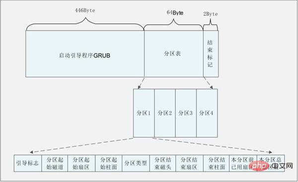
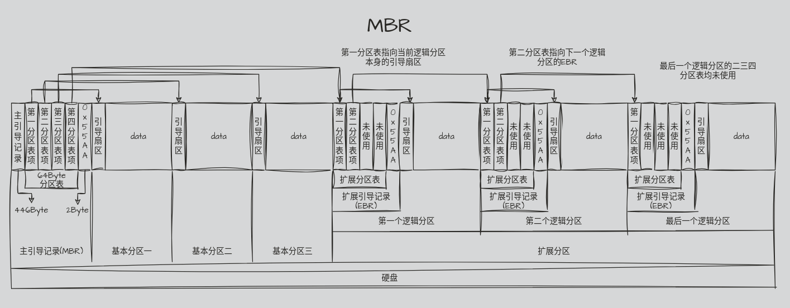
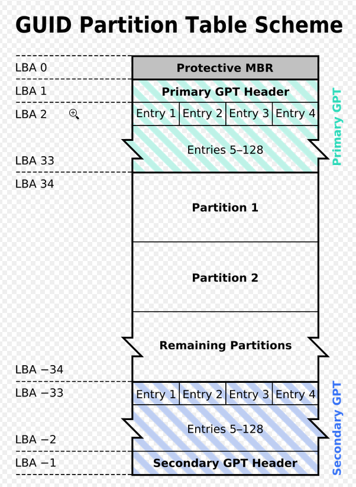

# 分区表

分区信息被存放在分区表中,目前有两种主流模式:传统的MBR(主引导记录)和新的GPT(GUID分区表)

## MBR

主引导记录(Master boot record, MBR)是**存储设备**(而不是分区)最开始的512字节(0磁道0柱面1扇区),其包含操作系统启动加载器和分区表,在BIOS系统的启动流程中扮演重要角色.

MBR的前446个字节是引导(bootstrap)代码,在BIOS系统上,它通常包含引号程序的第一阶段,随后是64个字节的4个MBR分区表,最后2个字节是结束标记55AA.

### MBR特点

MBR分区表有三种分区类型:

1. 主分区
2. 扩展分区
   1. 逻辑分区

主分区每个磁盘或RAID卷上不能超过4个,可设置为启动状态,如果分区方案需要使用多余4个的分区,就需要将至少一个分区设置为扩展分区,并在上面建立逻辑分区.

扩展分区可以被看作是容纳逻辑分区的容器,是为了解决主分区数量只能有4个的问题,扩展分区无法直接使用,需要在扩展分区下创建逻辑分区,存放数据.

> 硬盘上最多只能有1个扩展分区。如果磁盘上有 1 个扩展分区，它也被看作是 1  个主分区。因此只能另外再建立 3 个主分区（例如 3 个主分区加 1 个扩展分区）。扩展分区内所包含的逻辑分区数量没有限制。

> 扩展分区中逻辑驱动器的引导记录是链式的。每一个逻辑分区都有一个和MBR结构类似的**扩展引导记录**（EBR），其分区表的第一项指向该逻辑分区本身的引导扇区，第二项指向下一个逻辑驱动器的EBR，分区表第三、第四项没有用到,最后一个逻辑分区的二三四项均为用到

MBR只支持2tb以内的硬盘,大于2tb则只识别2tb部分.

## GPT

全局唯一标识分区表(GUID Parttion Table,GPT)是UEFI标准定义的分区规范,使用通用唯一识别码(globally unique identifier,GUID)定义分区和分区类型,实际上是为了替换MBR.

### GPT特点

#### 传统MBR(LBA0)

在GPT分区表的最开头，出于兼容性考虑仍然存储了一份传统的MBR，用来防止不支持GPT的硬盘管理工具错误识别并破坏硬盘中的数据，这个MBR也叫做保护MBR(PMBR)。

#### 分区表头(LBA1)

分区表头定义了硬盘的可用空间以及组成分区表的项的大小和数量。

#### 分区表项（LBA 2–33）

GPT分区表使用简单而直接的方式表示分区。一个分区表项的前16字节是分区类型GUID.例如EFI系统分区的GUID为:`{C12A7328-F81F-11D2-BA4B-00A0C93EC93B}`

接下来的16字节是该分区唯一的GUID（这个GUID指的是该分区本身，而之前的GUID指的是该分区的类型）。再接下来是分区起始和末尾的64位LBA编号，以及分区的名字和属性。

| 起始字节 | 长度   | 内容                                                         |
| -------- | ------ | ------------------------------------------------------------ |
| 0        | 16字节 | 分区类型GUID                                                 |
| 16       | 16字节 | 分区GUID                                                     |
| 32       | 8字节  | 起始LBA（[小端序](https://zh.wikipedia.org/wiki/小端序)）    |
| 40       | 8字节  | 末尾LBA                                                      |
| 48       | 8字节  | 属性标签（如：`60`表示“只读”）                               |
| 56       | 72字节 | 分区名（可以包括36个[UTF-16](https://zh.wikipedia.org/wiki/UTF-16)（小端序）字符） |

GPT支持大容量磁盘.

## 参考

https://zh.wikipedia.org/wiki/GUID%E7%A3%81%E7%A2%9F%E5%88%86%E5%89%B2%E8%A1%A8

https://zh.wikipedia.org/wiki/%E4%B8%BB%E5%BC%95%E5%AF%BC%E8%AE%B0%E5%BD%95

https://www.cnblogs.com/kumulinux/archive/2011/05/17/2149278.html(原文似乎已丢失)

