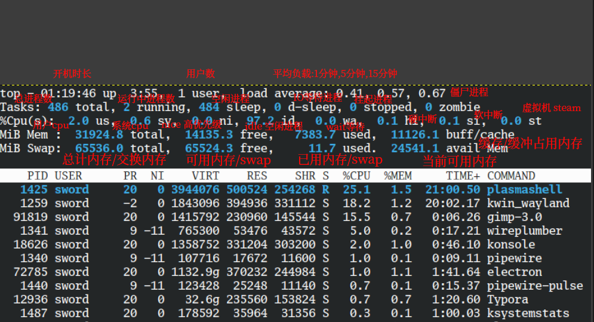
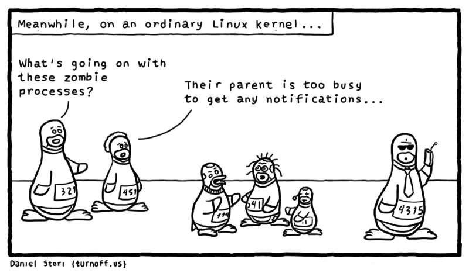

# Linux 学习笔记

## 基础知识

### 文件系统基础
#### inode 与 block 结构

linux文件中,每个文件都有一个唯一的`inode`,inode存储文件的元数据和指向`block`的指针.block中存储实际的数据内容

| 组件  | 作用                                 | 查看命令 |
| ----- | ------------------------------------ | -------- |
| inode | 存储元数据+block指针（不包含文件名） | `df -i`  |
| block | 存储文件内容（最小单位4KB）          | `df -h`  |

inode中存储的数据包含:

- 文件类型
- 权限信息
- 所有者信息(uid,gid)
- 文件大小
- 时间戳(atime,mtime,cime)
- 指向该inode的硬链接数
- 指向数据块的指针

可以使用`stat filename`来查看这些信息

#### 文件访问流程

1. 通过文件名在目录block中查找inode号
2. 读取inode元数据校验权限
3. 通过block指针访问文件内容

#### 文件标志

linux用于管理文件还有一些特殊标志,能够实现更精细化的文件控制

可以使用`lsattr`和`chattr`两个命令来列出和设置特殊属性,这些命令作用于 **ext2, ext3, ext4** 和 **xfs** 等文件系统上

常用的特殊熟悉:

- a(Append Only)-只可追加: 
  - 对于文件,内容只可追加,不能被删除,覆盖或修改
  - 对于目录,只可新增文件,不能删除或重命名文件
  - 典型用途:保护日志文件,防止日志被篡改或修改
- i(Immutable)-不可修改:
  - 对于文件,文件不能被删除,修改,重命名,也不能创建指向它的链接
  - 对于目录,不能在其中创建,删除或重命名文件
  - 用途: 保护系统二进制文件或关键配置文件
- A(Atime)-不更新访问时间
  - 系统不会更新该文件的访问时间(atime)
  - 用途: 减少磁盘IO,提升性能,适用于不需要知道最后一次访问时间的文件,例如浏览器缓存
- c(compress)-透明压缩
  - 文件在写入磁盘时会被内核自动压缩
- C(No-CoW)-禁用写时复制
  - 在不支持CoW的文件系统上禁用"写时复制"(Copy-on-Write)

查看特殊属性可以使用`lsattr`命令:

```
lsattr [选项] [文件或目录...]

# 常用选项
-a：列出目录中的所有文件，包括以 . 开头的隐藏文件。
-d：以与文件相同的方式列出目录，而不是列出其内容。
-R：递归地列出目录及其下所有内容的属性。

# 示例
# 查看当前目录下所有文件的属性
lsattr
# 查看指定文件 test.txt 的属性
lsattr test.txt
# 查看目录 /var/log 下的文件的属性
lsattr /var/log
# 查看目录 /var/log 本身的属性
lsattr -d /var/log
# 递归查看 /etc 目录下所有文件和子目录的属性
lsattr -R /etc
```

`chattr`命令可以修改文件的特殊属性

```
chattr [选项] [+/-/=属性] [文件或目录...]

+：在现有属性基础上添加一个属性。
-：在现有属性基础上移除一个属性。
=：将属性设置为 exactly 后面指定的那些属性，移除其他所有属性。

# 常用选项
-R：递归地处理目录及其下的所有内容。
-V：显示命令执行的详细信息。
```

### Shell基础

#### 特殊符号

##### 引号

| 引号     | 含义                                               |
| -------- | -------------------------------------------------- |
| 反引号   | 命令替换,先执行反引号里面的命令,更好的方法是`$()`  |
| 单引号   | 单引号中的内容会原封不动的输出                     |
| 双引号   | 和单引号类似,但双引号中的特殊符号会被解析          |
| 不加引号 | 和双引号类似,额外支持通配符(匹配文件) *.log{1..10} |

```
# 反引号
# 先找到sudo命令的位置,然後對該位置運行ls
ls -l `which sudo`

# 单引号
echo '`hostname` $(whoami) $UID {1..5}'
`hostname` $(whoami) $UID {1..5}

# 双引号
echo "`hostname` $(whoami) $UID {1..5}"
centos1 root 0 {1..5}

# 不加引号
echo `hostname` $(whoami) $UID {1..5}
centos1 root 0 1 2 3 4 5
```

##### $

`$`符号后跟不同的括号会有不同的含义:

- `$(...)`命令替换,相当于反引号
- `$((...))`算数运算,`echo $((1+1))`
- `${}`变量替换

##### ()

在shell中,单括号有不同的含义

子shell:在一个新的子进程中执行命令,执行完的环境不会影响当前shell

```
(command1; command2;)

# 把一组命令放到子shell中后台运行
(sleep 3; echo "done") &
```

命令分组:

```
(a=1; echo $a)   # 在子 Shell 中，变量只在里面有效
echo $a          # 空

{ a=1; echo $a; } # 在当前 Shell 中，变量可用
echo $a           # 1
```

数组定义:

```
arr=(a b c d)
echo ${arr[2]}   # 输出 c
```

命令替换:

跟在`$`后,相当于反引号``

```
files=$(ls)
echo $files
```

进程替换:

`<(command)`会把`command`的输出作为一个临时文件传递给另一个命令

```
# 比较两个目录的文件列表,而不先写入到文件中
diff <(ls dir1) <(ls dir2)
```

##### []

单中括号`[]`是命令`test`的别名,常用于条件判断

```
if [ "$a" -eq 3 ]; then
  echo "a 等于 3"
fi
```

双中括号`[[]]`是bash/zsh的扩展,更强大的条件判断语法,避免了`[]`的一些引号转义问题

- 支持逻辑运算符`&&`,`||`
- 支持模式匹配`[[ $a == *.sh ]]`
- 字符串不需要额外加引号就不容易报错`if [[ $a == "foo" ]]; then`

在`${}`中根据下标取数组的元素

```
arr=(a b c)
echo ${arr[1]}   # b
```

#### 重定向

##### 输出重定向

> 默认状态下,标准输入(stdin)输入到命令/服务/进程中,并产生标准输出(stdout,1号出口)或标准错误输出(stderr,2号出口)并显示到屏幕上,还有其他输出可能会写入到文件中,重定向就是改变命令/进程/服务默认的输出,例如将stdout和stder均重定向到文件中.

使用`1>`或`>`和`1>>`或`>>`可以重定向标准输出(stdout):

```
# 直接清空并写入
echo {1..5} 1>111.txt
# 追加
echo {1..5} 1>>111.txt
```

使用`2>`和`2>>`可以重定向标准错误输出(stderr):

```
whoami -h 2>err.txt
whoami -h 2>>err.txt
```

同时使用1和2可以将标准输出和标准错误输出一起重定向,常用于记录日志

```
# 同时重定向
echo 123 >>111.txt 2>>111.txt

# 简单写法 2>&1表示把标准错误输出写入到标准输出中,然后都追加到111.txt
echo 123 >>111.txt 2>&1

# 最简写法
echo 123 &>>111.txt
```

##### 输入重定向

使用`<`或`0<`符号进行输入重定向,常与固定命令配合:

```
# 与xargs搭配,指定读取文件内容,-n3表示把文件内容分成3组
xargs -n3 <num.txt

```

`<<`

用于向命令或脚本传递多行输入,将两个相同分隔符之间的内容作为输入流:

基本语法:

```bash
command << DELIMITER
	多行内容...
DELIMITER
```

DELIMITER是自定义的分隔符,需要成对出现,常用的有(EOF,END)

输入内容会从`<< DELIMITER`下一行开始,直到遇到独立的`DELIMITER`

```bash
cat > output.txt << 'END'
111
222
333
$PATH
DEND
'END'
END
```

如果第一个`DELIMITER`不带单引号,`$PATH`会被解析,如果`DELIMITER`带了单引号,仍需要遇到不带单引号的`DELIMITER`才会停止,以上命令的结果如下:

```bash
cat output.txt 
111
222
333
$PATH
DEND
'END'
```

##### 文件描述符

**文件描述符（File Descriptor，简称 fd）** 是操作系统用于 **跟踪和管理打开文件或其他 I/O 资源** 的整数标识符。它是进程访问文件、管道、套接字等资源的抽象句柄。

文件描述符是一个 **非负整数**（如 `0`、`1`、`2`、`3`...）,由内核分配，进程通过它操作文件或 I/O 设备。

每个进程启动时，默认打开 3 个标准 fd：

| 文件描述符 | 名称         | 默认绑定设备  | 用途                   |
| :--------- | :----------- | :------------ | :--------------------- |
| `0`        | **标准输入** | `/dev/stdin`  | 读取输入（如键盘输入） |
| `1`        | **标准输出** | `/dev/stdout` | 输出正常结果（到终端） |
| `2`        | **标准错误** | `/dev/stderr` | 输出错误信息（到终端） |

1. **操作文件**

- 通过 `open()` 系统调用打开文件时，内核返回一个 fd：

  ```
  int fd = open("file.txt", O_RDWR);  // 返回一个整数 fd（如 3）
  ```

- 后续通过 `read(fd, ...)`、`write(fd, ...)` 等操作文件。

2. **重定向 I/O**

- 用 `>`、`>>`、`<` 等符号时，Shell 实际是修改了进程的 fd 绑定：

  ```
  command > file.txt   # 将 fd 1（标准输出）重定向到 file.txt
  command 2> error.log # 将 fd 2（标准错误）重定向到 error.log
  ```

3. **管道（Pipe）和套接字（Socket）**

- 管道（`|`）本质是连接两个进程的 fd：

  ```
  ls | grep "test"  # ls 的 fd 1 连接到 grep 的 fd 0
  ```

- 套接字通信也通过 fd 实现（如网络编程中的 `socket_fd`）。

linux下的文件描述符对应的内容可以在`/proc`文件系统中看到:

```
# top命令
ls -l /proc/35752/fd/ 
total 0
lrwx------ 1 hparch hparch 64 Sep  2 19:00 0 -> /dev/pts/3
lrwx------ 1 hparch hparch 64 Sep  2 19:00 1 -> /dev/pts/3
l-wx------ 1 hparch hparch 64 Sep  2 19:00 2 -> /dev/null
lrwx------ 1 hparch hparch 64 Sep  2 19:00 3 -> /dev/pts/3
lr-x------ 1 hparch hparch 64 Sep  2 19:00 4 -> /proc/stat
lr-x------ 1 hparch hparch 64 Sep  2 19:00 5 -> /proc/meminfo
```

每个文件描述符表现为一个符号链接,指向实际的文件/管道/套接字

可以用`lsof -p <pid>`查看打开的文件数量

```
lsof -p 35752        
COMMAND   PID   USER  FD   TYPE DEVICE SIZE/OFF       NODE NAME
top     35752 hparch cwd    DIR   0,39     1528        257 /home/hparch
top     35752 hparch rtd    DIR   0,27      122        256 /
top     35752 hparch txt    REG   0,27   134792    1948707 /usr/bin/top
top     35752 hparch mem    REG   0,25             1948707 /usr/bin/top (path dev=0,27)
top     35752 hparch mem    REG   0,25             2282897 /usr/lib/locale/locale-archive (path dev=0,27)
top     35752 hparch mem    REG   0,25             2282190 /usr/lib/libm.so.6 (path dev=0,27)
top     35752 hparch mem    REG   0,25             2294417 /usr/lib/libsystemd.so.0.40.0 (path dev=0,27)
top     35752 hparch mem    REG   0,25             2282180 /usr/lib/libc.so.6 (path dev=0,27)
top     35752 hparch mem    REG   0,25             2282910 /usr/lib/libgcc_s.so.1 (path dev=0,27)
top     35752 hparch mem    REG   0,25             2294233 /usr/lib/libcap.so.2.76 (path dev=0,27)
top     35752 hparch mem    REG   0,25             2283006 /usr/lib/libncursesw.so.6.5 (path dev=0,27)
top     35752 hparch mem    REG   0,25             1948722 /usr/lib/libproc2.so.1.0.0 (path dev=0,27)
top     35752 hparch mem    REG   0,25             2282171 /usr/lib/ld-linux-x86-64.so.2 (path dev=0,27)
top     35752 hparch   0u   CHR  136,3      0t0          6 /dev/pts/3
top     35752 hparch   1u   CHR  136,3      0t0          6 /dev/pts/3
top     35752 hparch   2w   CHR    1,3      0t0          4 /dev/null
top     35752 hparch   3u   CHR  136,3      0t0          6 /dev/pts/3
top     35752 hparch   4r   REG   0,21        0 4026532028 /proc/stat
top     35752 hparch   5r   REG   0,21        0 4026532027 /proc/meminfo

```

使用`ulimit -n`参数可以查看当前进程的最大文件描述符限制

```java
# 单个进程最多能打开1024个文件描述符
ulimit -n 
1024
```

#### 管道

Shell的管道特性利用了命令能够从标准输入读取数据并将数据发送到标准输出的能力。通过管道操作符`|`，可以将一个命令的**标准输出**传给另一个命令的**标准输入**：

```
ls -l /usr/bin | less
```

管道往往用来执行复杂的数据操作。我们也可以把多个命令组合在一起形成管道，这种方式中用到的命令通常被称为过滤器（filter）。

T形管道:

`tee`命令从标准输入读取内容,然后将其复制到标准输出和其他文件中.

```
ls /usr/bin | tee ls.txt | grep zip
bsdunzip
bunzip2
bzip2
bzip2recover
ebunzip
ebzip
ebzipinfo
funzip
gunzip
gzip
hunzip
hzip
```

#### 命令别名

使用`alias`命令可以设置命令别名.常见用法:

```bash
# 查看所有别名
alias

# 查看ll别名对应的命令
alias ll

# 设置命令别名
alias ll=`ls -l`
```

可以在`~/.bashrc`,`/etc/profile`等设置环境变量的文件中写入alias命令来达到配置永久生效

可以使用`unalias`命令来取消别名

#### 命令执行状态 

linux判断上一条命令是否执行成功:

1. 使用`$?`

   ```
   ls / 
   
   # 返回0则成功执行,其他表示失败
   echo $?
   0
   ```

2. 使用`&&`和`||`

   ```
   ls -a && echo 'success' || echo 'failed'
   ```

   只有命令成功才执行&&,只有失败才执行||

#### 命令信息

`which`显示命令的位置:

```
$ which sudo
/usr/bin/sudo
```

`whereis`查询命令及相关文件的位置

```
$ whereis sudo
sudo: /usr/bin/sudo /usr/lib/sudo /usr/share/man/man8/sudo.8.gz
```

### 环境变量

环境变量是存储在操作系统中的动态键值对，用于影响程序运行时的行为。它们可以存储系统路径、用户设置、应用程序配置等信息。

常见查看方式：

- `echo $VARIABLE_NAME` —— 查看单个环境变量
- `printenv` 或 `env` —— 列出所有环境变量

#### 设置环境变量

临时设置（当前终端有效）：

```
export VARIABLE_NAME=value
```

永久设置：

将环境变量添加到以下文件中：

- 用户级别：
  - `~/.bashrc` —— 每次启动交互式 bash shell 加载
  - `~/.bash_profile` —— 登录时加载一次

- 系统级别：
  - `/etc/environment` —— 只支持 `KEY=VALUE` 形式，通常用于系统范围内的环境变量
  - `/etc/profile` 或 `/etc/profile.d/*.sh` —— 所有用户的登录 shell 执行


.bashrc 与 .bash_profile 的区别

| 文件            | 加载时机                       | 用途                               |
| --------------- | ------------------------------ | ---------------------------------- |
| `.bashrc`       | 每次启动新的交互式bash shell时 | 包含别名、函数和用户自定义设置     |
| `.bash_profile` | 用户登录时（仅一次）           | 设置登录时需要的环境变量和启动程序 |

> 通常GUI应用程序不会读取`.bashrc`,而是读取`.bash_profile`、`.zprofile` 或 `.xprofile`。

#### PATH与优先级

环境变量`PATH`控制命令的查找位置与顺序，系统从做到右依次搜索目录中是否存在可执行文件

#### Systemd服务

对于systemd服务，shell配置文件通常不会被读取

可以使用`systemctl show-environment`

常见的设置方式是：

- 临时设置`systemctl set-environment VAR=value`

- 持久化设置：
  ```
  # 在服务单元文件中添加
  [Service]
  Environment="VAR=value"
  EnvironmentFile=/etc/sysconf/myapp
  ```

### 目录的作用

#### /usr

##### /usr/bin与/usr/sbin

在历史上:

- `/usr/bin` (Binaries)：包含所有用户（包括普通用户和管理员）都可能用到的基本命令，例如 `ls`, `cat`, `grep` 等。这些是系统运行的非关键性工具。
- `/usr/sbin` (System Binaries)：包含通常**仅限于系统管理员（root 用户）** 使用的、用于系统管理和维护的命令，例如 `useradd`, `ip`, `ss`，以及您提到的 `nologin`。这些命令往往涉及底层的系统配置，普通用户不需要也不应该直接使用。

但如今区分`bin`和`sbin`的必要性已经大大降低,因为通常普通用户的PATH环境变量默认就包含了`/usr/sbin`和`/sbin`,很多发行版为了简化和一致性,开始将`sbin`目录中的内容合并到`bin`

在Archlinux中,它将几乎所有的可执行文件放在`/usr/bin`下,而将`/usr/sbin`作为指向`/usr/bin`的符号链接

```
ls -ld /usr/sbin
lrwxrwxrwx 1 root root 3  5月  4 03:26 /usr/sbin -> bin
```

## 用户与权限

### 用户管理
#### UID/GID 规律

- root用户:uid=0
- 虚拟用户: uid: 1-999,用于运行系统服务,进程,通常无法直接登录
- 普通用户:uid>1000,通常需要手动创建,默认只拥有自己家目录的完整权限

#### 用户,组相关文件

用户相关的文件:

1. `/etc/passwd`存放用户信息
2. `/etc/shadow`存放用户密码
3. `/etc/skel`目录,存放新用户的家目录的模板,创建新用户时系统会复制该目录下的内容到新用户的家目录

组相关的文件:

1. `/etc/group`用户组信息
2. `/etc/gshadow`用户组密码信息,几乎不会给用户组设置密码

/etc/passwd文件详情:

```bash
#用户名称:密码标识:UID:GID:[用户说明]:家目录:使用终端
root:x:0:0:root:/root:/bin/bash
nobody:x:99:99:Nobody:/:/sbin/nologin
newuser:x:1000:1000::/home/newuser:/bin/bash
```

/etc/shadow:

用户名:用户密码:过期时间(默认不过期)

/etc/group:

```bash
# 用户组名字:密码:gid:组里面额外的用户
root:x:0:newuser,testuser
bin:x:1:
ademon:x:2:
```

`/etc/skel`目录

如果命令行变成了类似`-bash-4.2$`的样子,则表示用户的家目录没有或家目录下的配置文件消失(比如`~/.bashrc`,`~/.bash_profile`),可以通过复制`/etc/skel/.bash*`来解决(需要手动重新登录)

#### 主群组和附加群组

当用户创建文件时,文件的所有组就是用户的主组,通常与用户名相同,记录在`/etc/passwd`的第四个字段,使用`usermod -g`修改用户的主组

附加组主要用于为用户分配额外的权限,例如加入`sudo`组获得管理员权限,加入`docker`组来操控docker,使用`usermod -aG`为用户添加附加组

主组和附加组是从用户的角度来看,实际上他们没有任何区别(但存在组和系统组的区别),一个组如果是一个用户的主组,那么它将不能被删除,如果它是一些用户的附加组,它可以被删除,且删除后会自动移除这些用户的该组信息

#### 用户和组管理

**useradd命令** 用于Linux中创建的新的系统用户。useradd可用来建立用户帐号。帐号建好之后，再用passwd设定帐号的密码．而可用userdel删除帐号。使用useradd指令所建立的帐号，实际上是保存在`/etc/passwd`文本文件中。

##### useradd

| useradd选项 | 说明           |
| :---------- | -------------- |
| -u          | 指定用户uid    |
| -s          | 指定命令解释器 |
| -m          | 创建家目录     |
| -M          | 不创建家目录   |
| -g          | 指定用户主组   |
| -G          | 加入附加组     |
| -r          | 创建系统用户   |

```bash
# 新建用户并加入组
useradd -g sale -G company,employees

# 新建用户设置gid
useradd newuser -u 1001
```

禁止系统用户交互式登录的标准方法是将其登录shell设置为`/usr/sbin/nologin`:

`````
# 新建一个系统用户(无需登录)
useradd -r -s /sbin/nologin mq
`````

##### userdel

用于删除给定的用户以及与用户相关的文件

```
userdel(选项)(参数)

# 选项
-f：强制删除用户，即使用户当前已登录；
-r：删除用户的同时，删除与用户相关的所有文件。

# 参数
要删除的用户名

# 示例
# 删除linuxde但是不删除其家目录及文件
userdel linuxde
# 删除linuxde和其家目录和文件
userdel -r linuxde
```

##### usermod

用于修改用户的基本信息

```
usermod(选项)(参数)

# 常用选项
-d<登入目录>：修改用户登入时的目录，只是修改/etc/passwd中用户的家目录配置信息，不会自动创建新的家目录，通常和-m一起使用；
-m<移动用户家目录>:移动用户家目录到新的位置，不能单独使用，一般与-d一起使用。
-e<有效期限>：修改帐号的有效期限；
-f<缓冲天数>：修改在密码过期后多少天即关闭该帐号；
-g<群组>：修改用户所属的主组；
-G<群组>；修改用户所属的附加群组；
-l<帐号名称>：修改用户帐号名称；
-L：锁定用户密码，使密码无效；
-s<shell>：修改用户登入后所使用的shell；
-u<uid>：修改用户ID；
-U:解除密码锁定。

# 参数
要修改信息的用户名

# 设置用户的主组
usermod -g newuser newuser

# 将用户newuser添加到用户组group
# -a参数表示附加,仅和-G参数一同使用
usermod -aG group newuser
# 将newuser的附加组设置为staff(离开其他组)
usermod -G staff newuser

# 修改newuser的名称为newuser1
usermod -l newuser1 newuser

# 锁定账号newuser
usermod -L newuser
# 解锁
usermod -U newuser

# 修改用户newuser的家目录为/home/user
usermod -md /home/user newuser
```

##### passwd

**passwd命令** 用于设置用户的认证信息，包括用户密码、密码过期时间等。只有管理者可以指定用户名称，一般用户只能变更自己的密码。

```
passwd(选项)(参数)

# 选项
-d 删除密码,只有系统管理员才能使用
-S 列出密码的相关信息,只有系统管理员才能使用
-k：设置只有在密码过期失效后，方能更新；
-l：锁住密码；
-u：解开已上锁的帐号。

# 参数
用户名: 需要设置密码的用户名(只有管理员才能提供用户名)

# 示例
# 创建新用户后为其创建密码
useradd -m -s /usr/bin/bash newuser
passwd newuser

# 普通用户修改自己的密码
passwd

# 清除用户密码
passwd -d newuser

# 查看密码状态
passwd -S newuser

# 让某个用户不能自己修改密码(锁定)
passwd -l newuser
```

##### groupadd

**groupadd命令** 用于创建一个新的工作组，新工作组的信息将被添加到系统文件(`/etc/group`,`/etc/gshadow`)中。

```
groupadd(选项)(参数)

# 选项
-g：指定新建工作组的id；
-r：创建系统工作组，系统工作组的组ID小于500；
-K：覆盖配置文件“/etc/login.defs”；
-o：允许添加组ID号不唯一的工作组。

# 参数
指定新建工作组的组名

# 示例
# 创建一个gid为501的组
groupadd -g 501 newgroup

# 添加一个系统工作组
groupadd -r systemgroup
```

##### groupdel

**groupdel命令** 用于删除指定的工作组，本命令要修改的系统文件包括`/ect/group`和`/ect/gshadow`

一个组如果是一个用户的主组,那么它将不能被删除,如果它是一些用户的附加组,它可以被删除,且删除后会自动移除这些用户的该组信息

```
groupdel(参数)

# 参数
要删除的工作组名

# 示例
groupadd damon  //创建damon工作组
groupdel damon  //删除这个工作组
```

#### 用户和组信息

##### id

打印真实以及有效的用户和所在组的信息

```
id [OPTION]... [USER]...

# 选项
-a               兼容性选项，没有实际作用。
-Z, --context    只打印进程的安全上下文。
-g, --group      只打印有效的组ID。
-G, --groups     打印全部组ID。
-u, --user       只打印有效的用户ID。
-z, --zero       使用空字符代替默认的空格来分隔条目。
# 只有在使用 -u -g -G 选项中一到多个时，以下选项可以使用：
-n, --name       打印名称而不是数字。
-r, --real       打印真实ID而不是有效ID。

# 参数
user(可选): 可以为一个或多个,默认为当前用户

# 返回值
0表示成功,非0标识失败

# 示例
id
uid=0(root) gid=0(root) groups=0(root),1(bin),2(daemon),3(sys),4(adm),6(disk),10(wheel)

# 打印有效组ID(有效组ID通常指用户主组ID)
id -g

# 打印www用户的信息
id www
```

##### w

**w命令** 用于显示已经登陆系统的用户列表，并显示用户正在执行的指令。执行这个命令可得知目前登入系统的用户有那些人，以及他们正在执行的程序。单独执行w命令会显示所有的用户，您也可指定用户名称，仅显示某位用户的相关信息。

```
w(选项)(参数)

# 选项
 -h, --no-header     不打印头信息；
 -u, --no-current    当显示当前进程和cpu时间时忽略用户名；
 -s, --short         使用短输出格式；
 -f, --from          显示用户从哪登录；
 -o, --old-style     老式输出
 -i, --ip-addr       显示IP地址而不是主机名（如果可能）

# 参数
用户: 仅显示指定用户

# 示例:
w
 20:39:37 up 136 days,  3:58,  1 user,  load average: 0.00, 0.00, 0.00
USER     TTY      FROM              login@   IDLE   JCPU   PCPU WHAT
root     pts/0    222.94.97.122    20:39    1.00s  0.00s  0.00s w
```

##### whoami

打印当前有效的用户ID对应的名称

该命令等价于`id -un`

> | 真实用户ID (Real UID)          | 启动进程的用户身份，代表“你是谁”。通常不变。                 |
> | ------------------------------ | ------------------------------------------------------------ |
> | **有效用户ID (Effective UID)** | 内核用来进行权限检查的身份，代表“进程现在有什么权力”。可以被改变。 |
>
> 通过Set-UID机制,可以让程序运行是临时获得文件所有者的权限,而不是执行者的权限,例如:
>
> 由于`/usr/bin/passwd`命令被设置了Set-UID位:
>
> ```
> ll /usr/bin/passwd  
> -rwsr-xr-x 1 root root 79K  6月 27 15:35 /usr/bin/passwd
> ```
>
> 所以当普通用户(user1)执行`passwd`命令的时候,新创建的`passwd`进程的真实用户ID仍然是`user1`,但是由于程序设置了Set-UID位,有效用户ID临时变成了文件所有者的ID,也就是`root`

##### logname

打印当前终端登录用户的名称。

注意区分 `whoami` 和 `logname` 这两个命令；比如我们以用户 `root` 打开的终端，然后切换到了用户 `user2`。此时， `whoami`返回的是当前用户 `user2`, `logname` 返回的是 `root`，大家可以自行实践验证一下。

##### last

列出目前与过去登入系统的用户相关信息,单独执行last命令，它会读取`/var/log/wtmp`的文件，并把该给文件的内容记录的登入系统的用户名单全部显示出来。

```
last(选项)(参数)

# 选项
-a：把从何处登入系统的主机名称或ip地址，显示在最后一行；
-d：将IP地址转换成主机名称；
-f <记录文件>：指定记录文件。
-n <显示列数>或-<显示列数>：设置列出名单的显示列数；
-R：不显示登入系统的主机名称或IP地址；
-x：显示系统关机，重新开机，以及执行等级的改变等信息。

# 参数
用户名: 显示用户登录列表
终端: 显示从指定终端的登录列表

# 示例
# 打印10行
last -3
root     pts/0        221.6.45.34      Tue Dec 17 09:40   still logged in
root     pts/0        221.6.45.34      Mon Dec 16 09:00 - 11:57  (02:56)
root     pts/0        222.94.97.122    Sun Dec 15 20:39 - 23:28  (02:48)
```

##### lastlog

lastlog命令用于显示系统中所有用户最近一次登录信息。

```
lastlog(选项)

# 选项
-b<天数>：显示指定天数前的登录信息；
-t<天数>：显示指定天数以来的登录信息；
-u<用户名>：显示指定用户的最近登录信息。

# 示例
lastlog
Username         Port     From             Latest
root             pts/0    221.6.45.34      Tue Dec 17 09:40:48 +0800 2013
bin                                         **Never logged in** 
daemon                                      **Never 
```


### 权限管理
#### 文件权限

文件的权限主要是`r,w,x`:

- `r`:read 是否可读

- `w`:write 是否可写

- `x`:execute 是否可执行(一般是命令,脚本)

`ls -l`指令显示的权限为9位权限,3位分为一组,每组分别表示:

- 所有者的权限

- 用户组的权限

- 其他人的权限

例如:

```
# rwx r-x r-x表示文件的所有者拥有读,写,运行的权限,文件的所有组成员拥有读和运行的权限,其他用户用于运行的权限
-rwxr-xr-x 1 user user  150  7月 28 17:28 test.sh
```

#### 目录权限

- `r` ：可**列出**目录内容,没有`x`权限无法使用（如使用 `ls` 命令）
- `w` ：可**修改**目录内容,没有`x`权限无法使用（在目录内创建、删除、重命名文件或子目录）
- `x` ：可**进入**或**访问**该目录（`cd` 进目录，或访问目录内的文件元数据）

> 如果仅有x权限,可以`cat`查看一个已知的具体路径的文件,但是无法在目录里寻找具体有什么文件

| 日常操作           | 需要的权限    |
| ------------------ | ------------- |
| 查看文件内容       | 文件的r权限   |
| 编辑或修改文件内容 | 文件的rw权限  |
| 执行脚本/命令      | 文件的rx权限  |
| 查看目录内容       | 目录的rx权限  |
| 创建/删除文件      | 目录的rwx权限 |
| 重命名             | 目录的rwx权限 |

#### 计算权限

权限 `r`,`w`,`x` 分别对应一个固定的二进制位和一个十进制值：

- `r` (读) = `100` (二进制) = **4**
- `w` (写) = `010` (二进制) = **2**
- `x` (执行) = `001` (二进制) = **1**
- `-` (无) = `000` (二进制) = **0**

**单个权限组**（如用户、组、其他人）的数字是其所有权限值的**和**。

- 例如：`rw-` = 4(r) + 2(w) + 0(x) = **6**
- 例如：`r-x` = 4(r) + 0(w) + 1(x) = **5**

**完整权限**由三个数字顺序组成：**用户 | 组 | 其他人**

- 例如：`rwxr--r--` = `7`(用户) `4`(组) `4`(其他人) = **744**
- 例如：`rwxr-x--x` = `7`(用户) `5`(组) `1`(其他人) = **751**

> 文件权限数字也可能显示为4位,例如0777,其中第一位是特殊权限的数字,当权限数字只有三位时默认其为0(无特殊权限)

#### 修改权限

##### chmod(change mode)

使用数字或字母的形式修改文件/目录的权限

```bash
chmod [OPTION]... MODE[,MODE]... FILE...

# 常用选项
-R 对目录及目录以下的文件递归执行更改权限操作
# 使用'-R'选项一定要保留当前用户的执行和读取权限，否则会报错！
--reference=RFILE：使用参考文件或参考目录RFILE的权限来设置目标文件或目录的权限。
```

其中的`mode`代表八进制数或符号组合,符号通过字母的形式:

- `u`符号代表当前用户。
- `g`符号代表组用户。
- `o`符号代表其他用户。
- `a`符号代表所有用户。
- `r`符号代表读权限以及八进制数`4`。
- `w`符号代表写权限以及八进制数`2`。
- `x`符号代表执行权限以及八进制数`1`。
- `X`符号代表如果目标文件是可执行文件或目录，可给其设置可执行权限。
- `s`符号代表设置权限suid和sgid，使用权限组合`u+s`设定文件的用户的ID位，`g+s`设置组用户ID位。
- `t`符号代表只有目录或文件的所有者才可以删除目录下的文件。
- `+`符号代表添加目标用户相应的权限。
- `-`符号代表删除目标用户相应的权限。
- `=`符号代表添加目标用户相应的权限，删除未提到的权限。

```bash
# 添加组用户的写权限。
chmod g+w ./test.log
# 删除其他用户的所有权限。
chmod o= ./test.log
# 使得所有用户都没有写权限。
chmod a-w ./test.log
# 当前用户具有所有权限，组用户有读写权限，其他用户只有读权限。
chmod u=rwx, g=rw, o=r ./test.log
# 等价的八进制数表示：
chmod 764 ./test.log
# 将目录以及目录下的文件都设置为所有用户拥有读写权限。
chmod -R a=rw ./testdir/
# 根据其他文件的权限设置文件权限。
chmod --reference=./1.log  ./test.log
```

##### chown(change owner)

**chown命令** 改变某个文件或目录的所有者和所属的组，该命令可以向某个用户授权，使该用户变成指定文件的所有者或者改变文件所属的组。用户可以是用户或者是用户D，用户组可以是组名或组id。文件名可以使由空格分开的文件列表，在文件名中可以包含通配符。

只有文件主和超级用户才可以使用该命令。

`````
chown(选项)(参数)

# 常用选项
-R或——recursive：递归处理，将指定目录下的所有文件及子目录一并处理；

# 参数
`用户:组`: 指定所有者和所属工作组,当省略`:组`时仅改变文件所有者
文件: 指定要改变文件所有者和工作组的文件列表,支持多个文件和目标(通过空格间隔),支持通配符

# 示例
# 将/usr/meng目录下的所有目录和文件的所有者和工作组都设置为liu
chown -R liu:liu /usr/meng
`````

##### umask

显示或设置创建文件的权限掩码。

`chmod`用于更改已有对象的权限，`umask`影响之后新建对象的权限。umask并不编辑一个文件,它只是临时设置一个进程级别的掩码,如果要持久化,可以将其写入到shell的启动配置文件

使用umask只需要设置不想要被设置的权限,最终的权限=默认权限-umask的值例如`022`,当默认权限为`777`时,最终的权限会变成`755`

```
umask [-p] [-S] [mode]

# 参数
mode(可选) :八进制或符号组合

# 选项
-p：当没有参数时指定该选项，执行产生的输出格式可复用为输入；
-S：以符号组合的方式输出创建文件的权限掩码，不使用该选项时以八进制数的形式输出。

# 示例

# 以八进制数的形式输出创建文件的权限掩码。
umask -p
0022
# 为组用户添加写权限。
umask g+w
# 删除其他用户的写、执行权限
umask o-wx
# 赋值全部用户所有权限，等价于umask u=rwx,g=rwx,o=rwx
umask a=rwx
# 清除其他用户的读、写、执行权限。
umask o=
```

#### 特殊权限

特殊权限用于扩展标准 `rwx` 权限，提供特定功能。它们在权限位中**替代执行位 (`x`)** 的位置显示。若文件本身**无执行 (`x`) 权限**，则特殊权限显示为**大写字母** (如 `S`, `T`)；若有执行权限，则显示为**小写字母** (如 `s`, `t`)。

| 权限名称           | 八进制码 | 作用对象           | 含义与功能                                                   | 设置方法 (符号法) | 设置方法 (数字法) | 权限位显示                                  |
| ------------------ | -------- | ------------------ | ------------------------------------------------------------ | ----------------- | ----------------- | ------------------------------------------- |
| **SUID** (Set UID) | `4`      | **二进制程序文件** | 执行者临时拥有**文件所有者**的权限，而非执行者自身的权限。   | `chmod u+s file`  | `chmod 4xxx file` | `s`位于**所有者**执行位，例如：`-rwsr-xr-x` |
| **SGID** (Set GID) | `2`      | **二进制程序文件** | 执行者临时拥有**文件所属组**的权限。                         | `chmod g+s file`  | `chmod 2xxx file` | `s`位于**所属组**执行位，例如：`-rwxr-sr-x` |
| **SGID** (Set GID) | `2`      | **目录**           | 在该目录下创建的新文件或子目录，其**所属组**将**自动继承**此目录的所属组，而不是创建者的基本组。 | `chmod g+s dir`   | `chmod 2xxx dir`  | `s`位于**所属组**执行位，例如：`drwxr-sr-x` |
| **Sticky Bit**     | `1`      | **目录**           | 目录内的文件/目录**仅允许其所有者、目录所有者或 root 用户删除或重命名**。 | `chmod o+t dir`   | `chmod 1xxx dir`  | `t`位于**其他人**执行位，例如：`drwxrwxrwt` |

SUID:

SUID是对可执行的二进制程序文件进行设置,设置后命令的执行者(必须要有执行权限x)会以命令所有者的身份来执行命令

SUID占用所有者权限位,显示为`s`

`/usr/bin/passswd`文件设置了setuid,使普通用户也能临时变成root来间接的修改`/etc/passwd`文件,来修改自己的密码,仅作用于用户组权限位

SGID:

SGID可以对可执行的二进制程序文件设置,设置后命令的执行者的组身份(必须要有执行权限x)会升级成命令所有者的组身份

也可以对目录设置,在此目录下**新创建**的文件或子目录，其**所属组将会自动继承此目录的所属组**，而不是创建者用户的默认主要组。

SGID占用所属组的权限位,显示为`s`

- `locate` 命令需要 `slocate` 组权限。为 `locate` 命令设置 SGID 后，普通用户执行它时就能临时获得 `slocate` 组的权限，从而顺利读取数据库。
- 用于协作目录。当多个用户（它们的主要组可能不同）需要在一个目录下共享文件时，SGID 能确保所有新创建的文件都属于同一个特定的组，从而方便组内成员共同管理和访问。

Sticky Bit

stickyBIT是对目录进行设置的,设置后的目录每个用户都可以在下面创建文件,目录内的文件/目录**仅允许其所有者、目录所有者或 root 用户删除或重命名**。

占用其他人权限位,显示为`t`

- 系统临时目录 `/tmp` (`drwxrwxrwt`)，所有用户都可创建文件，但只能管理自己的文件。

### 权限提升

在 Linux 中，用户权限管理是系统安全的核心。普通用户通常权限受限，而 `root` 用户拥有最高权限。在需要执行特权操作时，需进行权限提升。

#### su

使用`su`命令可以切换用户身份，语法是：`su [选项] [用户名]`

默认情况下切换到root用户，并且不会改变当前的工作目录和大部分环境变量

使用`su -`命令可以以登录的方式切换用户身份，会切换到用户的家目录并完全加载目标的shell环境（包括环境变量和shell配置文件）

> `su`命令实际上是`su -l`的缩写

#### sudo

`sudo` 是一种更精细、更安全、更可审计的权限提升方式。它允许**被授权**的普通用户以`root`或其他用户的身份执行命令，执行的时候需要输入当前用户自己的密码（也可以设置为无需输入密码）

```
sudo [选项] 命令

# 常用选项
-u 以指定用户身份执行命令
-i 模拟登录到root用户，会加载root环境（类似su -）
-s 启动一个root的shell，但环境变量保持当前用户

# 以用户www-data的身份查看你文件
sudo -u www-data cat /path/to/file
# 模拟登录到root用户
sudo -i
# 启动一个root的shell，但环境变量保持当前用户
sudo -s
```

配置文件位于`/etc/sudoers`，不要使用编辑器直接编辑，而应该使用`visudo`命令，它会进行语法检查，防止因为配置错误而无法使用sudo

常见的配置示例：

```
# 允许用户 alice 运行所有命令，无需密码
alice ALL=(ALL:ALL) NOPASSWD: ALL

# 允许用户 bob 仅能重启 apache2 服务
bob ALL=(root) /usr/sbin/systemctl restart apache2

# 允许组 wheel 的所有成员使用 sudo
%wheel ALL=(ALL:ALL) ALL
```

### root 密码修改

已知root密码的情况下，可以使用

```
# 切换到root用户
su -
# 执行passwd命令
passwd
```

如果忘记了root密码，可以通过修改GRUB引导参数，让系统直接进入root shell，此操作需要物理或虚拟控制台的访问权限

1. 重启系统，在GRUB引导菜单出现时按下`e`进入编辑模式

2. 找到以`linux`或`linux16`，`linuxefi`开头的行，将其`ro`参数（read-only）修改为`rw`（read-write）让根文件系统以可写的方式挂载，然后在行末添加`init=/bin/bash`，这会让内核不启动正常的初始化进程，而是直接启动一个bash shell

3. 按 `Ctrl + X` 或 `F10` 用修改后的参数启动系统。系统将跳过登录验证，直接进入一个 `root` 权限的 shell。

4. 此时可能需要重新挂载文件系统
   ```
   mount -o remount,rw /
   ```

5. 使用`passwd`命令为root修改密码

6. 如果SELinux已开启，需要重载标签

7. 重启系统

## 系统管理

### 系统信息
#### cpu

`lscpu`可以检查当前系统的cpu状态

`nproc`查看cpu核心数，该命令常用于`make`命令时指定线程数

```
# 使用全部核心数的线程编译
make -j $(nproc)
```

也可以检查`/proc/cpuinfo`文件

#### 内存

可以使用`free -h` 命令查看内存的使用情况

```
free -h
                总计        已用        空闲        共享   缓冲/缓存        可用
内存：          31Gi        12Gi       2.2Gi       529Mi        15Gi        18Gi
交换：          63Gi        51Mi        63Gi

```

也可以检查`/proc/meminfo`文件获取更多内存信息

交换分区是一块硬盘空间，当物理内存不足时，系统会把一部分而你内存数据暂存到磁盘的交换分区，防止进程被杀掉，交换分区的速度远慢于内存

也可以使用一个交换文件当作Swap

```
# 查看启用的交换分区
swapon --show
# 查看交换分区使用情况
free -h

# 临时关闭Swap
swapoff -a

# 临时开启
swapon /swapfile
swapon /dev/sdX

# 永久开启/关闭
vim /etc/fstab
```

```
# 创建交换文件
sudo dd if=/dev/zero of=/swapfile bs=1M count=2048   # 分配 2G 空间
sudo chmod 600 /swapfile             # 设置权限
sudo mkswap /swapfile                # 格式化为 swap
sudo swapon /swapfile                # 启用

# 创建交换分区
sudo fdisk /dev/sdX
sudo mkswap /dev/sdXn
sudo swapon /dev/sdXn
# 写入/etc/fstab
/dev/sdXn  none  swap  sw  0  0
```

#### 硬盘和分区

`lsblk`命令可以查看磁盘和分区的结构

`fdisk -l`查看磁盘分区表

`df -h`查看磁盘使用情况

`du -sh /path/*`查看目录或文件占用空间

#### 文件描述符

默认的文件描述符限制大小为`1024`，对于运行高并发的web应用或需要打开大量文件/Socket的程序的服务器，文件描述符很可能成为性能瓶颈，常见报错：`Too many open files`

文件描述符分为用户级和系统级，分别表示单个进程能打开的FD数量和整个系统同时打开的FD的总数

可以使用`ulimit -n`查看文件描述符的限制

```
# 临时修改
# 用户级
ulimit -n 65535
# 系统级
sudo sysctl -w fs.file-max=65535

# 永久修改
# 用户级
sudo vim /etc/security/limits.conf
* hard nofile 65535
* soft nofile 65535
# 系统级
sudo vim /etc/sysctl.conf
fs.file-max=65535
sysctl -p	# 从配置文件“/etc/sysctl.conf”加载内核参数设置
# systemd管理的服务还需要在unit文件或/etc/systemd/system.conf中添加：
[Service]
LimitNOFILE=65535
```

### 时间管理

#### 打印时间

使用`date`命令可以灵活的打印出时间

```
date [选项]... [+格式]

# 选项
-d, --date=STRING 解析字符串并按照指定格式输出，字符串不能是'now'。
-s, --set=STRING  根据字符串设置系统时间。

# 常用格式
%F 完整的日期，等价于%+4Y-%m-%d
%T 时间；等价于%H:%M:%S
%Y 年份
%m 月份
%d 日期
%H 0-23小时
%M 分钟
%S 秒
%s 自UTC 时间 1970-01-01 00:00:00 以来所经过的秒数


# 示例
# 格式化输出
date +"%Y-%m-%d"
# 包括时分秒
date +"%Y-%m-%d %H:%M.%S"
# 打印当前距离1970-01-01的秒数
date +"%s"
# 打印昨天的日期
date -d "1 day ago" +"%Y-%m-%d"
# 打印两秒后
date -d "2 second" +"%Y-%m-%d %H:%M:%S"
# 进行格式转换
date -d "2009-12-12" +"%Y/%m/%d %H:%M.%S"

# 时间加减操作：
date +%Y%m%d                   # 显示年月日
date -d "+1 day" +%Y%m%d       # 显示前一天的日期
date -d "-1 day" +%Y%m%d       # 显示后一天的日期
date -d "-1 month" +%Y%m%d     # 显示上一月的日期
date -d "+1 month" +%Y%m%d     # 显示下一月的日期
date -d "-1 year" +%Y%m%d      # 显示前一年的日期
date -d "+1 year" +%Y%m%d      # 显示下一年的日期
```

#### 设置时间

`date`命令的`-s`参数可以设置系统的当前时间

```
date -s                         # 设置当前时间，只有root权限才能设置，其他只能查看
date -s 20120523                # 设置成20120523，这样会把具体时间设置成00:00:00
date -s 01:01:01                # 设置具体时间，不会对日期做更改
date -s "01:01:01 2012-05-23"   # 这样可以设置全部时间
date -s "01:01:01 20120523"     # 这样可以设置全部时间
date -s "2012-05-23 01:01:01"   # 这样可以设置全部时间
date -s "20120523 01:01:01"     # 这样可以设置全部时间
```

`timedatectl`命令可以用于在 Linux 中设置或查询系统时间、日期和时区等配置。在 Linux 运维中，通常使用此命令来设置或更改当前的日期、时间和时区，或启用自动系统时钟与远程 NTP 服务器同步，以确保 Linux 系统始终保持正确的时间。

```
timedatectl [OPTIONS...] COMMAND ...

# 参数
-H --host=[USER@]HOST    在远程主机上操作
-M --machine=CONTAINER   在本地容器上操作。
-a --all				 显示所有属性，包括空属性

# 命令
status                   显示当前的时间设置。
set-time TIME            设置系统时间。
set-timezone ZONE        设置系统时区。
list-timezones           显示已知时区。
set-local-rtc BOOL       控制 RTC 是否在当地时间。（BOOL 的值可以是 1 / true 或 0 / false）
set-ntp BOOL             启用或禁用网络时间同步。（BOOL 的值可以是 1 / true 或 0 / false）
timesync-status          显示 systemd-timesyncd 的状态。
show-timesync            显示 systemd-timesyncd 的属性。

#示例
# 显示系统当前时间和日期
timedatectl status
# 显示系统所有可用时区
timedatectl list-timezones
# 设置系统时间
timedatectl set-time "2021-12-12 07:25:46"
# 启用或禁用ntp同步
timedatectl set-ntp true/false
# 查看systemd-timesyncd服务的状态
timedatectl timesync-status
```

#### 时区管理

系统时区的存放目录是`/usr/share/zoneinfo/`

当前时区的文件是`/etc/localtime`

```
# 可以使用timedatectl设置时区
timedatectl list-timezones
timedatectl set-timezone Asia/Shanghai

# 也可以直接修改/etc/localtime的软连接
ln -sf /usr/share/zoneinfo/Asia/Shanghai /etc/localtime
```

#### 硬件时钟

系统中有两个时钟：

- 系统时钟，由内核维护
- 硬件时钟，BIOS/CMOS芯片中的时钟

```
# 查看硬件时钟
hwclock -r
# 将系统时钟写入硬件时钟
hwclock -w
# 将硬件时钟同步到系统时钟
hwclock -s
```

#### 时间同步

可以使用`timedatectl`命令来管理`systemd-timesyncd`服务进行时间同步

```
timedatectl set-ntp true    # 开启 NTP 同步
timedatectl set-ntp false   # 关闭 NTP 同步
timedatectl status          # 查看时间同步状态

```

可以在 `/etc/systemd/timesyncd.conf`文件中设置NTP服务器的地址

```
[Time]
NTP=ntp.aliyun.com
FallbackNTP=ntp.ubuntu.com
```

常用的操作

```
systemctl enable systemd-timesyncd --now
systemctl restart systemd-timesyncd
# 查看详细同步信息
timedatectl show-timesync         
```

在较旧的发行版中，`ntpdate`命令也可以通过网络与远程ntp服务器进行时间同步

```
# 使用阿里云的ntp服务器同步时间
ntpdate ntp1.aliyun.com
```

#### 计算时间

一些shell有一个内置的`time`命令，可以查看运行命令花费的时间

```
# 查看执行时间
time ls / > /dev/null                
ls --group-directories-first --color=auto / > /dev/null  0.00s user 0.00s system 81% cpu 0.003 total
```

安装`time`软件包会提供一个`/usr/bin/time`的二进制程序，提供更高级的功能：

```
time [options] command [arguments...]

# 参数
-f format, --format=format 指定输出格式，可能覆盖环境变量TIME中指定的格式。 
-p, --portability 使用可移植的输出格式。 
-o file, --output=file 不将结果发送到stderr，而是覆盖指定的文件。 
-a, --append (与-o一起使用。)不覆盖而是附加。 
-v, --verbose 对程序知道的所有信息进行非常详细的输出。 
-q, --quiet 不报告异常的程序终止（当命令被信号终止时）或非零退出状态。 

# 示例
# 把ls命令的执行时间写入到文件中
/usr/bin/time -o outfile.txt ls
# 把ls命令的执行时间追加到文件中
/usr/bin/time -a -o outfile.txt ls
# 显示ls命令的详细过程
/usr/bin/time -v ls
```

也可以使用`date`命令简单的检查一组命令运行花费的时间：

```
start=$(date +%s)
nmap wangchujiang.com &> /dev/null
end=$(date +%s)
difference=$(( end - start ))
# 显示执行时间
echo $difference seconds.
```

### 后台管理

#### 创建后台进程

1. 在命令后加`&`:
   ```
   sleep 999 &     
   [1] 61448
   # 返回的是进程的pid
   ```

2. 使用`nohup`命令配合`&`方法,可以将其免受终端关闭和SSH断开的影响
   ```
   $ nohup ping -c10 127.0.0.1 &
   [5] 62063
   nohup: ignoring input and appending output to 'nohup.out'                   
   [5]  + 62063 done       nohup ping -c10 127.0.0.1
   $ cat nohup.out
   PING 127.0.0.1 (127.0.0.1) 56(84) bytes of data.
   64 bytes from 127.0.0.1: icmp_seq=1 ttl=64 time=0.042 ms
   64 bytes from 127.0.0.1: icmp_seq=2 ttl=64 time=0.037 ms
   64 bytes from 127.0.0.1: icmp_seq=3 ttl=64 time=0.033 ms
   64 bytes from 127.0.0.1: icmp_seq=4 ttl=64 time=0.027 ms
   64 bytes from 127.0.0.1: icmp_seq=5 ttl=64 time=0.043 ms
   64 bytes from 127.0.0.1: icmp_seq=6 ttl=64 time=0.050 ms
   64 bytes from 127.0.0.1: icmp_seq=7 ttl=64 time=0.049 ms
   64 bytes from 127.0.0.1: icmp_seq=8 ttl=64 time=0.035 ms
   64 bytes from 127.0.0.1: icmp_seq=9 ttl=64 time=0.048 ms
   64 bytes from 127.0.0.1: icmp_seq=10 ttl=64 time=0.035 ms
   
   --- 127.0.0.1 ping statistics ---
   10 packets transmitted, 10 received, 0% packet loss, time 9208ms
   rtt min/avg/max/mdev = 0.027/0.039/0.050/0.007 ms
   ```

3. `screen`是一种终端复用器,它可以创建一个独立的虚拟终端会话,可以在其中运行多个程序,它支持会话分离和恢复

   ```
   # 进入screen
   screen
   # 分离会话
   ctrl + a + d
   # 停止并退出
   ctrl + c; ctrl + d
   # 恢复会话
   screen -r
   ```

4. `tmux`是另一种终端复用器,同样提供在一个终端中管理多个会话的功能,它具有更现代化的特性

   ```
   # 启动tmux
   tmux
   # 创建一个新的窗口
   ctrl + b + c
   # 分离会话
   ctrl + b + d
   # 恢复会话
   tmux attach-session -t 0
   ```

#### 区别对比

`pstree`命令以树形结构显示进程的层次关系,它会显示每个进程及其子进程的关系

`&`方法和`ctrl + z`运行在终端中,终端关闭后(ssh断开)运行的命令也会停止

```bash
# sleep 999 &
pstree
systemd─┬─NetworkManager───3*[{NetworkManager}]
        ├─systemd─┬─(sd-pam)
        │         ├─konsole─┬─zsh───sleep
```

`nohup`运行在终端之外,终端关闭后命令能继续运行

```bash
# nohup sleep 999 &
systemd─┬─systemd─┬─konsole─┬─zsh───pstree
        │         ├─sleep
```

`screen`运行在终端之外,终端关闭后命令能继续运行

```bash
# screen
# ping bilibili.com
systemd─┬─systemd──konsole───zsh───sleep
        │         ├─screen───zsh───ping
```

- **`&`**: 快速将任务放入后台，但终端关闭后进程会停止。

- **`nohup`**: 适用于需要长时间运行的任务，确保终端关闭后进程继续运行。

- **`screen`**: 更强大的会话管理工具，支持后台运行，分屏和恢复功能，适合长期和复杂任务。

### 进程管理

进程是操作系统为执行程序分配的资源，它是程序在内存中的实例，负责执行程序的指令。每个进程都有一个父进程（Parent Process）和可能存在多个子进程。

在linux系统中,除了第一个PID为1的init(或system)进程外,每个进程都有一个父进程,进程也有自己的子进程.可以使用`pstree`命令查看进程树:

```
$ pstree
# []中的是内核线程
systemd─┬─NetworkManager───3*[{NetworkManager}]
        ├─bluetoothd
        ├─dbus-broker-lau───dbus-broker
        ├─mariadbd───8*[{mariadbd}]
        ├─nginx───24*[nginx]
```

#### 进程状态

linux中的进程有一个进程状态:

| **STAT基本状态**  | **描述**                                                     | **例子**                                                     |
| ----------------- | ------------------------------------------------------------ | ------------------------------------------------------------ |
| **R (running)**   | 运行中进程：进程正在CPU上运行，正在执行任务。                | `top`命令中看到CPU占用很高的进程，通常状态为`R`。例如，正在运行的Python脚本或web服务器进程。 |
| **S (sleeping)**  | 可中断进程：进程在等待某些资源或输入，如等待网络数据、文件I/O操作、或用户输入。 | 例如，一个`cat`命令正在等待从文件中读取内容，或等待用户的键盘输入。 |
| **T (terminate)** | 进程被暂停（挂起）：进程被暂停，通常是通过`ctrl+z`命令挂起它。 | 使用`ctrl+z`暂停的进程（如`sleep`命令暂停），在`top`中显示为`T`状态。 |
| **D**             | 不可中断的进程：进程正在等待I/O操作完成，如磁盘读写或网络通信等，无法被中断。 | 例如，`dd`命令正在进行磁盘数据复制，它正在等待磁盘I/O，无法被中断。 |
| **Z (zombie)**    | 僵尸进程：进程已经结束，但它的父进程还未读取其退出状态，导致它仍然存在于进程表中。 | 比如一个程序崩溃后退出，父进程没有调用`wait`来收集它的退出状态，这时它就变成了僵尸进程。 |

| **符号(附加状态)** | **描述**                                                     | **例子**                                                     |
| ------------------ | ------------------------------------------------------------ | ------------------------------------------------------------ |
| **s**              | 控制进程：该进程是进程组的控制进程或会话领导进程，通常是父进程。 | 例如，`bash`作为shell启动多个子进程，在`pstree`中，`bash`可能会显示为`(bash) s`，表示它是控制进程。 |
| **<**              | 高优先级进程：进程的优先级较高。                             | 例如，内核进程或者某些实时进程，优先级很高。`top`命令中显示为`<`，表示此进程优先级较高。 |
| **N**              | 低优先级进程：进程的优先级较低。                             | 例如，系统后台任务，`cron`或`at`等低优先级的调度进程，显示为`N`。 |
| **+**              | 前台进程：当前进程在前台运行。通常这个进程是与终端直接交互的。 | 例如，当你在终端中直接运行`vim`或`top`时，它们的状态显示为`+`。 |
| **l**              | 多线程进程：该进程是一个多线程进程。                         | 例如，`java`程序运行时通常会以多线程方式执行，显示为`l`。    |

```
# 前台进程
$ ps aux | grep firefox
user   2563  1.0  3.2  123456  7890 tty1  S+  10:23  0:05 firefox
# 控制进程
$ ps aux | grep bash
root   1001  0.0  0.1  23456  7890 pts/0  Ss  10:23  0:00 bash
# 多线程进程
$ ps aux | grep java
user   1234  1.0  2.3  456789 12345 pts/0  Sl  10:23  0:30 java
```

#### 查看进程信息

##### ps

`ps`命令用于查看当前这一瞬间系统的进程状态

```
# 以BSD格式显示所有正在运行的进程的UID,PID,PPID(父进程的ID),CMD(进程名字)
ps -ef

UID          PID    PPID  C STIME TTY          TIME CMD
root           1       0  0 02:27 ?        00:00:03 /sbin/init
root           2       0  0 02:27 ?        00:00:00 [kthreadd]
root           3       2  0 02:27 ?        00:00:00 [pool_workqueue_release]

# 以标准格式显示所有正则运行的进程,除了ef的结果,还有cpu使用率,内存使用率,占用内存大小,进程状态
ps -aux

USER         PID %CPU %MEM    VSZ   RSS TTY      STAT START   TIME COMMAND
root           1  0.0  0.0  23128  9348 ?        Ss   02:27   0:03 /sbin/init
root           2  0.0  0.0      0     0 ?        S    02:27   0:00 [kthreadd]
root           3  0.0  0.0      0     0 ?        S    02:27   0:00 [pool_workqueue_release]
root           4  0.0  0.0      0     0 ?        I<   02:27   0:00 [kworker/R-rcu_g]
root           5  0.0  0.0      0     0 ?        I<   02:27   0:00 [kworker/R-rcu_p]
```

`ps`命令经常与其他命令配合使用,例如和`kill`命令删除不必要的程序,或者与`sort`命令取出排序后的数据

```
# 取出所有进程中内存使用率最高的前5个
ps aux | sort -rnk4 | head -5
```

##### top

`top`命令可以动态的查看系统的整体运行清空,包括进程状态



top命令显示的信息有:

- 开机时长,用户数,平均负载(1分钟,5分钟,10分钟)
- 总进程数,运行中进程数,空闲进程,IO等待进程,挂起进程,僵尸进程
- 用户cpu,系统cpu,nice高优先级,idle空闲进程,wa等待,Hi硬中断,si软中断st虚拟机
- 总计内存,可用内存,已用内存,缓存/缓冲占用内存
- 交换内存,可用交换内存,已用交换内存,当前可用内存

常用的快捷键:

- q 退出
- 空格 立即刷新(默认3秒刷新)
- P 按照cpu使用率排序
- M 按照内存使用率排序

```
# -b可以进入非交互模式
# -n表示显示的结果数
top -bn1 | awk 'NR=2'

# 实时查看进程和资源占用情况
top -n 1 | head -20
```

`htop`是`top`的增强版,可以使用箭头轻松的查看进程并执行一些操作,支持鼠标操作

#### 僵尸进程与孤儿进程

僵尸进程:

当一个进程停止时,其父进程会被告知,以便进行一些清理工作(比如释放内存空间,资源占用).

然而,如果父进程没有意识到子进程的死亡(挂掉了),子进程就会进入僵尸状态．对于父进程来说，子进程仍然存在，但实际上子进程已经死亡并持续存在于系统中．



可以使用`ps aux | grep Z`找出僵尸进程的pid,然后通过`pstree -p | grep pid`查看僵尸进程的父进程,通过`kill pid`指令无法直接结束僵尸进程,需要结束僵尸进程的父进程才能结束僵尸进程.

```
# 强制杀死父进程
kill -9 <父进程PID>
```

孤儿进程:

孤儿进程指其父进程执行完成或被终止后仍继续运行的一类进程,孤儿进程会被系统直接接管(system进程)

#### 结束进程

1. `kill`,`kill + 进程pid`结束进程,`kill -9`会强制杀死进程
2. `pkill`,`pkill + 进程名字`模糊查找,结束进程
3. `killall`,`killall + 进程名字`精确结束进程

### 系统负载

系统负载（Load Average）是指系统在一段时间内，处于可运行状态（R）和不可中断状态（D）的平均进程数。它是衡量系统繁忙程度的重要指标。

**Load Average的定义**：单位时间内，系统处于可运行状态的进程数量，包括运行中的进程（`R`状态）和等待I/O操作的进程（`D`状态）。`S`（睡眠状态）虽然处于等待状态，但不占用CPU，因此不计入负载。

例如,对于一个核心数为4的系统,如果它的系统负载为8.0,表明这段时间内平均有8个活跃进程,但只有4个核心可以运行进程,其他4个进程在排队

负载值越接近CPU核心总数，系统越忙碌。如果负载值超过CPU核心数的2-3倍，说明系统可能出现瓶颈。

#### 查看负载

通过 `top` 或 `uptime` 命令可以查看当前系统的负载平均值。负载通常由三个数字组成，分别表示过去1分钟、5分钟和15分钟的平均值。

`top`是常用的工具之一,用于实时显示系统的运行状态,包括负载信息

在top命令的输出中,负载信息通常显示在最顶部:
```
top - 03:52:14 up  4:07,  1 user,  load average: 0.33, 0.37, 0.50
```

`load average: 0.33, 0.37, 0.50`分别表示过去1分钟、5分钟和15分钟的负载。

`uptime`命令可以简洁地显示系统负载

```
uptime                     
 04:05:39 up  4:20,  1 user,  load average: 0.53, 0.39, 0.40
```

`ps`命令显示了当前运行的进程状态,包括每个进程的cpu占用情况

```
# 查看系统的cpu占用
ps aux --sort=-%cpu | head -n 10
```

这将显示CPU占用前10的进程，定位哪些进程消耗了大量的CPU资源

#### 排查流程

1. 发现负载过高:

   - 使用监控工具（如 `Prometheus`、`Grafana`）或者通过 `top`、`uptime` 等命令发现系统负载异常增高。

2. 判断是CPU负载还是IO负载:

   - 使用`top`命令,查看`us`(用户空间占用的cpu)和`sy`(系统空间占用的cpu)字段,如果这两个值比较高,证明是cpu负载
   - 查看`wa`(等待IO的cpu时间),如果过高,表明负载主要来自于磁盘IO操作

3. 定位负载高的进程:

   - cpu导致的负载高:使用`ps aux`查找占用cpu较高的进程:

     ```
     ps aux --sort=-%cpu | head -n 10
     ```

   - IO导致的负载高:使用`iotop`工具排查磁盘IO的占用情况:

     ```
     # iotop 显示当前系统中的磁盘I/O情况，-o 参数将只显示当前有I/O活动的进程。通过查看 I/O 活跃的进程，可以判断哪些进程导致了高磁盘负载。
     sudo iotop -o
     ```

4. 分析具体的进程问题:

   - 尝试查看消耗资源较多的进程的日志文件或调试信息,了解为什么消耗较多的资源

#### 处理方法

1. 停止或优化高负载的进程:
   - 对于消耗大量CPU或IO资源的进程可以通过优化算法或停止不必要的人物减轻负载
2. 调整系统参数
   - 对于IO负载高的情况,可以调整磁盘缓存,文件系统的块大小等方式提高IO性能
   - 对于CPU负载高的情况,考虑调整进程的优先级,使用`nice`和`renice`等命令降低不重要进程的优先级,让出资源给关键进程
3. 增加硬件资源
   - 考虑增加服务器的cpu或内存资源,或者使用负载均衡
4. 分布式处理
   - 考虑将任务拆分到多个机器上执行,使用分布式计算或微服务的架构来分担负载

### 磁盘空间与存储
#### stat / df / du
#### inode 与 block
#### fstab / 挂载
#### （原笔记内容保留）

### 日志管理（新增）
#### journalctl
#### dmesg
#### /var/log 目录
#### logrotate

## 网络管理

### 网络配置
#### CentOS ifcfg 配置
#### Ubuntu Netplan 配置

### 网络工具
#### ip addr
#### ping, traceroute, curl
#### ss / netstat
#### tcpdump / iftop
#### dig / nslookup

## 服务与任务

### 服务管理
#### systemd 基础（unit, service, socket, mount）
#### systemctl 常用命令
#### rc.local（原笔记内容保留）【重复内容待合并】

### 定时任务
#### cron / crontab
#### systemd timer
#### anacron

---

## 6. 文件与文本处理

### 文件与目录
#### 文件类型
#### file 命令
#### 链接（软/硬链接对比）

### 文件操作
#### cat / head / tail / less / more
#### sort / uniq
#### wc
#### lsof

### 四剑客
#### find
#### grep
#### sed
#### awk

### 正则表达式
#### 基础正则
#### 扩展正则
#### Perl 风格正则

---

## 7. 安全与防护

### 防火墙
#### firewalld
#### iptables

### SELinux/AppArmor
#### 模式（Enforcing/Permissive/Disabled）
#### 常用命令

### 文件与系统安全
#### chattr +a / +i
#### SSH 配置（补充位置）

---

## 8. 包管理

### RPM 系列
#### rpm
#### yum / dnf

### Debian 系列
#### dpkg
#### apt-get / apt

### 常见操作
#### 查询、安装、卸载、更新

---

## 9. 性能与故障排查工具

### 性能监控
#### top / htop
#### vmstat
#### iostat
#### sar

### 问题诊断
#### strace
#### lsof
#### dstat

### 故障排查思路
#### CPU 占用高
#### 内存不足
#### IO 瓶颈
#### 网络瓶颈

---

## 10. 常用技巧与优化
#### bashrc / zshrc
#### 环境变量
#### alias 与函数
#### PS1 提示符
#### sysctl 参数调优

## 问答集锦

```
1. Linux下常用的压缩包格式有哪些
.tar.gz
.zip
2. 为什么要对文件进行打包后传输/备份，而不是直接传输/备份
打包可以保存文件的用户权限等信息,打包传输可以降低网络IO使用,打包方便进行校验
3. 打包和压缩有什么区别吗
打包是将多个文件和目录保存为单一文件
压缩是通过算法减小文件体积
4. 将/etc目录打包到/opt/etc.tgr.gz
tar -czf /opt/etc.tar.gz /etc
5. 解压/opt/etc.tgr.gz到 ~/myetc
tar -xzf /opt/etc.tar.gz -C ~/myetc/
6. 如何查看本地的全部网卡及ip
ip address
7. 什么是路由，如何查看当前机器的默认路由
路由是指网络数据包从源设备传输到目标设备的路径选择过程。
ip route show
8. 如何将命令的输出内容写入到一个文件
cat test.txt > 111.txt
9. 制作一个200行+的文本文件，并说明使用more或less命令查看此文件内容会有什么区别
seq 1 200 > demo.txt
mess到达末尾自动退出
less需要手动按q退出
10. 在vim中如何替换文件中的内容，比如将所有的aaa都替换为bbb
:%s/aaa/bbb/g
11. 在命令行中如何替换呢
sed -i 's/2/3/g' demo.txt
12. 如何对比两个文本文件的区别
diff demo.txt demo.txt.bak
vimdiff demo.txt demo.txt.bak
13. 如何在目录中查找某个文件
ls | grep test.txt
14. 除了按照名称查找文件外，还能按照什么方式查找文件
文件大小,创建时间,文件类型,权限
15. 给出按照文件大小、创建时间、文件类型查找文件的命令
find /path -size +10M
find /path -ctime +90
find /path -type f
16. ping命令是干啥的，使用的什么协议
ICMP协议,测试本机与主机间网络是否通畅
17. 常见的协议有哪些，都有什么作用
ARP,获取mac地址
DHCP,根据mac地址获取IP
TCP,UDP,传输层协议
18. 什么是前台运行，什么是后台运行
前台运行:进程占用当前终端,用户可以直接交互
后台运行:进程不占用终端,用户可以继续输入其他命令
19. 执行ping命令，之后退出终端，这个ping命令还会继续执行吗？为什么？
不会,终端退出时，会向所有关联的进程发送 SIGHUP（挂断）信号，导致进程终止
20. 执行ping命令，会产生一个进程还是线程还是什么
产生一个独立的进程,在 Linux 中，每个命令（如 ping）会由 Shell 调用 fork() 创建子进程，再通过 exec() 加载程序。
21. pid是什么？如何找到，执行的ping命令的pid
pid是进程的唯一数字标识,用于管理进程
ps aux | grep ping
```

```
1. /etc/passwd 这个文件有什么作用，记录的内容是什么
文件保存了系统中用户的基本信息,可以用来查看系统中已添加的用户
2. 如果我想获取上面文件的以:分隔的第一列内容，如何获取
cat /etc/passwd | awk -F ':' '{print $1}'
3. 如何使用AWK获取上面文件第3列内容，并进行排序
cat /etc/passwd | awk -F ':' '{print $3}' | sort -n
4. 如何查看系统版本和内核版本
cat /etc/os-release 
内核:uname -a
5. 如何更改系统源为国内源
vim /etc/apt/sources.list
6. 如何更新系统中的软件包
apt-get update
apt-get upgrade
7. 如何使用apt安装nginx
apt-get install nginx
8. Nginx默认使用的端口号是多少，安装后如何访问
80,首先systemctl start nginx启动服务,然后访问IP:80
9. apt安装的Nginx默认配置目录是什么
/etc/nginx/
10. 如何查看当前机器监听了哪些端口号
netstat -tnulp
11. 什么是回环地址，为什么要有回环地址
回环地址127.0.0.1是保留的特殊IP地址,数据包不经过网卡,直接在操作系统内部流转
12. 如何判断端口号是绑定到某个具体地址，还是所有地址
netstat -tnulp | grep '端口'
显示0.0.0.0:端口表明是所有地址
13. 如何通过终端软件将本地文件上传到Linux中，又如何下载文件到本地
使用scp命令
scp ./test.txt root@ip:/var/
scp root@ip:/var/test.txt ./
14. 如何完全复制一个目录到指定路径
cp -r
15. /opt目录有什么作用
/opt目录专门存放第三方独立软件
16. 如何使用一条命令创建多级目录
mkdir -p
17. 什么是软链接什么是硬链接，区别是什么
软连接是单独的文件,拥有不同的inode和block,block内容是指向被链接文件的位置信息
硬连接是只创建另一个文件,包含指向相同的inode的链接
18. 什么场景下使用软链接，什么场景下使用硬链接
软连接可以管理不同版本文件,激活配置文件
硬链接可以备份重要文件防止误删
19. 创建一个软链接/opt/nginx，让其链接到nginx的配置目录
ln -s /etc/nginx /opt/nginx
20. 如何判断一个文件是链接文件还是普通文件
ls -l
```

```
1. /dev/zero和/dev/null 是什么
/dev/zero是无限零字节流
/dev/null是黑洞文件,会丢弃所有写入的数据
2. 如何查看硬盘的分区，以及当前系统磁盘使用大小
df -h
3. 创建一块新硬盘，1G大小，挂载到/opt/mydir目录，并设置为开机启动挂载
fdisk /dev/sda
mkfs.ext4 /dev/sda2
mount /dev/sda2 /opt/mydir
vim /etc/fstab
/dev/sda2	/opt/mydir	ext4	defaults	0 1
4. 使用dd命令，在/opt/mydir目录中写入一个200M大小的文件
dd if=/dev/zero of=./test.txt bs=1M count=200
5. 如何查看当前系统内存使用大小
free -h
top
6. 如何查看系统负载，系统负载为10，表示什么含义，是高还是低。
uptime,top
根据cpu核心数,大于核心数*0.7则比较高
7. 系统负载与CPU使用率有什么关联
都反映了系统资源压力,系统负载表示单位时间内可运行+不可中断的任务数
8. 如何查看本机启动了哪些端口，如何使用telnet测试端口是否连通
netstat -tnulp
telnet IP port
9. 什么是域名，什么是dns，什么是hosts
域名是为了方便人类记忆的地址i,dns是将域名翻译为IP地址的协议
hosts文件是操作系统本机报错的dns对照表
10. 一个域名是如何进行解析的
首先访问浏览器的缓存,查看本机的hosts文件,检查有无域名解析信息,若没有,则向本地DNS服务商获取,DNS服务商若无信息,则其会从根域名服务器到一级域名(.com)再到二级域名服务器等等逐级查询
11. 如何设置使用的DNS地址
编辑/etc/hosts文件
12. dig与nslookup有什么区别，什么场景下使用
快速检查时使用nslookup,dig可以调试复杂的dns问题
13. 什么是三次握手和四次挥手，什么场景下使用
TCP连接时进行三次握手,断开时进行四次挥手
14. TCP与UDP有什么区别
TCP面向连接提供可靠传输,UDP提供不可靠传输
15. UDP会进行握手吗
不会
16. 什么服务默认使用UDP协议
SMTP,NFS
17. 视频通话会使用TCP还是UDP，文字消息呢？
TDP,文字使用UCP
18. 解释ps -aux所有字段的含义
-a 显示所有终端机下执行的程序
-u 以用户为主的格式显示
-x 显示所有程序
19. Linux中如何判断上一条命令是否执行成功
使用 $? 检查退出状态码
使用`&&`和`||`
ls -a && echo 'success' || echo 'failed'
20. 如何修改系统默认时区，并同步网络时间
timedatectl set-timezone 时区名称(Asia/Shanghai)
ntpdate ntp1.aliyun.com
21. 如何使用curl访问页面
curl ip
22. 如何使用curl和wget来下载文件到本地。
curl -O link
wget -O filename link
需要完成这些内容，整理相关笔记，发布到公开平台，B站、小红书或者头条朋友圈等。内容可以是文字也可以是截图，但是需要写明是 “佚名运维训练营-第X天” 的内容，将内容截图发布到这里
```


```
1. 运行ping命令会产生一个进程，运行其他服务也会产生一个进程，那么在系统看来，这些进程有什么本质区别吗
pid不同
2. 线程与进程有什么区别
进程是程序的独立执行实例,具有独立的内存空间
线程是进程的执行单元,共享进程的资源
3. 一个多进程服务结构会是，一个主进程下面多个子进程，还是多个并列进程
一个主多个子进程
4. 什么并行，什么是并发，他们的区别是什么
并行是单个cpu上运行多个程序,并发是多个cpu同时处理多个任务
5. Linux下的信号（Signal）是什么？如何发送信号给进程，给出具体命令。
信号是一种进程间通信的机制
本质上是一种异步通知机制,用于进程间通信或操作系统向进程发送事件通知
例如使用kill -<信号名或编号> <进程PID>
kill 123 给pid为123的进程发送15信号
kill -9 123 给pid为123的进程发送9,要求立即终止
6. 常用的信号有9和15，他们有什么区别。
9 SIGKILL用于立即结束程序的运行
15 SIGTREM是程序结束信号,与SIGKILL不同的是该信号可以被程序处理,通常要求程序自己正常退出
7. 如何将服务放到后台运行，比如将ping命令放到后台运行
后面跟一个&
8. 学习byobu，进行窗口上下拆分，左右拆分，并能将其切换到后台运行，唤起到前台

9. 如何设置一个脚本开机自动执行

10. 如何设置定时任务，让脚本定时执行。并解释'* * * * *'这五个星号各自的含义
使用cron,
crontab -e编辑当前用户的定时任务
* * * * *
1 分钟 2 小时 3 日期 4 月份 5 周几
11. 什么是环境变量，PATH这个环境变量的作用是什么
环境变量是操作系统存储的动态键值对,用于配置程序运行时的行为
PATH是指定可执行程序的搜索路径
12. 如何在PATH中添加内容，并使其永久生效
export PATH=$PATH:/usr/bin
写入~/.bashrc
13. crontab中的环境变量与平常的环境变量有什么不同
cron任务运行时不会加载用户shell的环境变量,PATH仅限基本路径(/usr/bin:/bin)
14. Linux系统中什么能够与硬件直接交互
linux内核,驱动程序
15. 应用程序是如何操作硬件的
应用程序调用系统调用,内核通过驱动程序将用户层请求转换为硬件指令,硬件执行
16. 什么是驱动，内核依赖驱动还是驱动依赖内核
驱动依赖内核,必须针对特定内核版本编写驱动,内核也依赖驱动,没有驱动,内核无法管理硬件
17. 不同的Linux系统， 使用的内核有什么区别，这些内核由谁进行维护
各发行版使用不同内核版本,官方内核由社区维护
18. 软件的版本号一般分为几位
2-4位
19. 将ping 127.0.0.1的制作为system服务，并设置为开机启动
vim /etc/systemd/system/ping-test.service
[Unit]
Description=Continuous Ping to Localhost

[Service]
ExecStart=/bin/ping 127.0.0.1
Restart=always

[Install]
WantedBy=multi-user.target

sudo systemctl daemon-reload
sudo systemctl enable --now ping-test
20. 如何 启动、停止、重启、设置开机启动取消开机启动system服务
systemctl start 
systemctl stop 
systemctl restart 
systemctl enable
systemctl disable
21. 如何查看system服务的日志
systemctl status service
```

8:

```
1. 什么是RAID，有几种类型，其原理是什么
RAID是磁盘阵列,常用的有0,1,5,10四种
RAID0串联所有硬盘,将多块硬盘合并为一块共同存储,速度快,容量大,但安全性低
RAID1只能由两块磁盘组成,其中一块是备份磁盘,安全性高,容量只有一块硬盘
RAID5最少由三块磁盘组成,最多允许损坏一块磁盘
RAID10最少四块磁盘,先将四块磁盘分别组成两个RAID1再进行RAID0串联
2. 什么是防火墙，Linux下有哪些防火墙
防火墙是一种网络安全系统,监控和控制网络流量,保护系统免受未经授权的访问
常见防火墙:
iptables
nftables
firewalld
UFW
3. 如何清空iptables中的所有规则
iptables -F
iptables -X
iptables -Z
4. 添加一个规则，禁止所有地址访问服务器的80端口，测试是否生效
iptables -A INPUT -p tcp --dport 80 -j DROP
5. iptables规则是按顺序全部执行还是匹配到就结束
匹配到就结束
6. 如果要拒绝所有地址访问，但是允许指定的地址访问，那么拒绝的规则应该放在第几条
最后一条
7. 如何调整iptables规则的顺序
首先保存iptables-save > rules.txt
然后编辑文件修改顺序
最后重载规则iptables-restore < rules.txt
8. 如何单独删除某条iptables规则
1. 指定规则内容iptables -D INPUT -p tcp --dport 80 -j DROP
2. 指定规则序号
	iptables -L INPUT --line-numbers
	iptables -D INPUT 2
9. 准备2台虚拟机，A和B，在A机器上生成密钥，并配置让A可以使用密钥免密登录到B机器
ssh-keygen -t rsa
ssh-copy-id username@B_IP
10. 如何从A机器上复制一个文件或目录到B机器
scp ./txt user@B_IP:/mnt/
scp -r /root user@B_IP:/mnt/
11. 如何使用sync同步A机器上的目录到B机器
rsync -avz ./ user@IP:/root/
12. 如何设置同步时，保持目录一致，比如A机器原始目录中删除了文件同时也会删除B机器同步目录中的对应文件
使用--delete参数进行无差异同步:
rsync -avz --delete /opt/backup 172.16.1.7:/opt/backup
13. 如何设置同步时，A机器原始目录中删除文件，但是B机器同步目录中会保留文件
rsync -avz ./ user@IP:/root/
14. 每隔几秒创建一个以当前时间命名的文件，比如20250623110833.txt
while true; do touch $(date +%Y%m%d%H%M%S).txt; sleep 5; done
15. 将一个目录打包，生成一个以当前时间命名的压缩包，比如将/etc目录打包为etc_20250623110833.tgz
tar -czvf etc_`date +%Y%m%d%H%M%S`.tgz /etc/
16. 如何查看进程的当前工作目录
pwdx PID
17. 如何查看某个端口被哪个进程占用
lsof -i :port
netstat -tnulp | grep :port
18. 如何查看某个文件被哪个进程占用
lsof /test.txt
19. lsof有哪些功能
列出打开的文件及相关进程
网络连接,文件目录占用,用户活动文件,进程打开的文件描述符
20. /proc目录有什么作用
虚拟文件系统,提供内核和进程的实时信息
21. apt如何卸载软件包，如何查找软件包，如何安装指定版本的软件包，如何锁定软件包版本（不会自动升级）
apt remove package
apt search package
apt install package=version
apt-mark hold package
```

10

```
通过之前的作业，你已经掌握了Linux的大部分基础。今天留的任务都是综合性的问题，需要自行思考如何解决，期间可能有之前没有讲过的命令或者方法，试着解决吧。
1. 研发人员反馈配置文件经常丢失
公司某研发人员反馈，某些配置文件经常被“莫名其妙”删掉，怀疑是其他人误操作。你作为运维，需要排查是谁删除的，并确保以后再发生也能及时追踪。
2. 某台服务器性能突然变差
某线上服务所在服务器这两天经常“卡顿”，有时网页打不开，但硬件资源并未升级。你被安排分析问题。
3. 给研发提供服务器但不能暴露所有权限
研发要登录服务器调试服务，但你又担心他们动到系统配置、误删文件或查看敏感目录。你需要在保障研发效率的同时限制权限。
4. 你刚接管一台旧服务器，什么都不知道
公司交给你一台旧机器，只知道之前跑过某些服务，要求你“搞清楚这台机器在干嘛、能不能下线”。
5. 运维服务器定期空间不足
运维服务器最近磁盘空间频繁报警，/opt 经常满，但开发说“我啥也没动”。你要排查出根因并提出解决方案。
6. 某文件被加密，怀疑中病毒
你收到告警：一台 Linux 服务器 /home 目录中多个文件被加密，文件名被改为 .locked 结尾，研发打不开文件。怀疑被入侵。
7. 被要求记录谁登录服务器做了什么
安全部门要求你记录：谁什么时候登录了服务器、做了什么操作，并保留日志30天。你要设计方案并验证。
8. 模拟企业级备份与恢复流程
某重要系统数据每天要备份，并保留7天。现在要求你搭建一套“自动备份 + 过期删除 + 可恢复验证”的机制。
9. 公司新入职员工频繁问服务器怎么登录
公司有多台服务器，新入职员工每次都来问“我要登录哪台主机，账号密码是什么？”。 安全管理员希望你建立一套规范化、自动化的主机登录体系，避免口头传密码，也方便集中管理。
10. 某用户误删系统目录，如何快速定位和修复
一位用户执行 rm -rf 时误删了系统关键目录，系统报错但未宕机。你被叫来“定位是删了哪里，是否可恢复”。
11. 主机入侵应急响应
你怀疑一台服务器被黑客入侵了，目前还没宕机，但流量异常，进程诡异。你要如何应急响应。
12. 某服务内存持续升高，如何监控预警
有个服务运行几小时后内存不断升高，有内存泄漏嫌疑。你需要设置自动化监控和告警，避免服务拖垮系统。
13. 本地开发环境需要定期重置
研发测试环境经常被“测坏”，需要每天凌晨自动回滚到干净状态（重新部署配置、服务、数据等）。
```

## 参考

https://www.coonote.com/linux-note/linux-modifying-maximum-file-descriptor.html

命令部分大量参考[Linux Command](https://wangchujiang.com/linux-command/)

