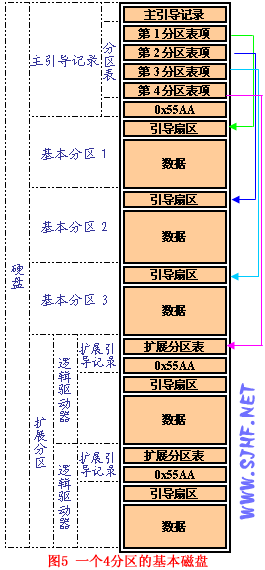

# 分区表

分区信息被存放在分区表中,目前有两种主流模式:传统的MBR(主引导记录)和新的GPT(GUID分区表)

## MBR

主引导记录(Master boot record, MBR)是存储设备(磁盘)最开始的512字节,其包含操作系统启动加载器和分区表,在BIOS系统的启动流程中扮演重要角色.

> MBR 并不位于某个分区中。其位于分区前，设备的最开始的扇区（物理偏移 0）,位于整个硬盘的0磁道0柱面1扇区

MBR的前446个字节是引导(bootstrap)代码,在BIOS系统上,它通常包含引号程序的第一阶段,随后是64个字节的4个MBR分区表,最后2个字节是结束标记55AA.

MBR分区表有三种分区类型:

1. 主分区
2. 扩展分区
   1. 逻辑分区

主分区每个磁盘或RAID卷上不能超过4个,可设置为启动状态,如果分区方案需要使用多余4个的分区,就需要将至少一个分区设置为扩展分区,并在上面建立逻辑分区.

扩展分区可以被看作是容纳逻辑分区的容器,是为了解决主分区数量只能有4个的问题,扩展分区无法直接使用,需要在扩展分区下创建逻辑分区,存放数据.

> 硬盘上最多只能有1个扩展分区。如果磁盘上有 1 个扩展分区，它也被看作是 1  个主分区。因此只能另外再建立 3 个主分区（例如 3 个主分区加 1 个扩展分区）。扩展分区内所包含的逻辑分区数量没有限制。

> 扩展分区中逻辑驱动器的引导记录是链式的。每一个逻辑分区都有一个和MBR结构类似的**扩展引导记录**（EBR），其分区表的第一项指向该逻辑分区本身的引导扇区，第二项指向下一个逻辑驱动器的EBR，分区表第三、第四项没有用到

## GPT

全局唯一标识分区表(GUID Parttion Table,GPT)是UEFI标准定义的分区规范,使用通用唯一识别码(globally unique identifier,GUID)定义分区和分区类型,实际上是为了替换MBR.

