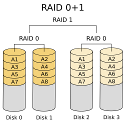

# 面试准备

## 面试题目

### 操作系统

linux使用版本和常见命令

> 常用 CentOS,Ubuntu,Rocky等主流发行版
>
> 常用的命令:
>
> - ls 列出目录内容
> - cd 切换目录
> - cp/mv/rm 复制移动删除文件
> - mkdir/touch 创建目录/文件
> - find 查找文件
> - chmod/chown 修改权限/所有者
> - cat/more/less 查看文件
> - head/tail 查看文件头/尾部
> - grep 文件搜索
> - ps 查看进程
> - top/htop 动态查看系统资源
> - kill/pkill 终止进程(pkill根据名字)
> - df/du 查看磁盘空间
> - free 查看内存使用情况
> - ping 测试网络连通性
> - ssh 远程登录
> - tar 打包压缩
> - vim /nano 文本编辑
> - | > < tee 管道和重定向

文本处理三剑客会用吗 (grep, sed, awk)

> grep 用于在文件中搜索匹配模式的行,常用`grep "pattern" file`或跟在`|`后,`-i`忽略大小写,`-v`反选,`-n`显示行号
>
> `sed`是流编辑器,常用于对文本进行编辑(替换,删除,打印),常用`sed 's/old/new/g' file`,`-i`直接修改文件
>
> `awk`用于处理结构化文本,例如列数据,支持变成,常用`awk '{print $1}'`打印第一列,`-F`指定分隔符,支持条件判断`awk '$1>10{print}'`
>
> 文本四剑客指`find`,`grep`,`sed`,`awk`

shell脚本中的sed和awk用法,awk分列用法,awk以分号间隔用法：

> sed可以用于文本编辑:
>
> - 替换: `sed '/s/pld/new/g' file`
> - 删除行: `sed '/pattern/d' file`
> - 直接修改文件 `sed -i '/s/pld/new/g' file`
>
> awk主要用于列处理
>
> - 打印列: `awk '{print $1, $3}' file`
> - 条件过滤: `awk '$2 > 100 {print $1, $2}' file`
> - awk默认使用空格/TAB分列,$1第一列,$2第二列,$0表示整行,NF表示字段数,$NF表示最后一列
> - 指定分隔符: `awk -F ";" '{print $1, $2}' file`
> - 同时使用多个分隔符: `awk -F "[:;]" '{print $1, $2}' file`

如何查看端口占用情况

> netstat查看端口占用`netstat tnulp`
>
> ss查看端口占用`ss -tnulp`
>
> `lsof -i :port`

如何查看内存使用情况

> `free -h`以人类可读的格式显示,总内存,已用内存,空闲内存,缓存/缓冲可用内存
>
> `top`动态实时查看

free命令具体的显示内容

> - **total**：总物理内存大小
> - **used**：已使用的内存（包含buffers/cache）
> - **free**：未使用的空闲内存
> - **shared**：共享内存
> - **buff/cache**：缓存和缓冲区占用
> - **available**：真正可用内存
> - 交换内存的总计,已用,空闲
>
> 重点看 **available** 列，反映系统实际可用内存,其中avaliable = total - used

top命令怎么用，哪些指标查看cpu使用情况

> top命令实时监控系统资源,查看cpu使用情况的关键指标:
>
> cpu使用率(第三行):
>
> - `us`：用户空间进程占用百分比
> - `sy`：内核空间进程占用百分比
> - `id`：空闲CPU百分比
> - `wa`：等待I/O的CPU时间百分比
>
> `load average`(第一行)：系统1分钟、5分钟、15分钟的平均负载

如何查看磁盘使用情况

> `df -h` 显示所有挂载点
>
> `df -h /home`显示home目录所在分区
>
> `du -sh /home`显示目录总大小
>
> `du -h --max-depth=1`查看当前目录下一级子目录大小

查看磁盘信息

> `fdisk -l`列出所有磁盘和分区
>
> `lsblk`树形显示磁盘分区

创建分区

> `fdisk /dev/sdb`,`n`新建,`p`主分区,`w`保存

格式化分区

> `mkfs.ext4 /dev/sdb1`格式化为ext4文件系统

挂载磁盘

> 临时挂载: `mount /dev/sdb /mnt/data`
>
> 永久挂载: 编辑`/etc/fstab`文件,例如`/dev/sdb1 /mnt/data ext4 defaults 0 0`
>
> 挂载检查: `mount`查看已挂载的文件系统,`df -h`查看磁盘空间和挂载点

raid 0, 1, 5

> raid0: 条带化,把数据拆封到多个磁盘,读写性能搞,但无冗余,一块磁盘损坏则全部数据丢失,最少2块磁盘,可用容量100%
>
> radi1: 镜像,把相同数据写入所有磁盘,数据安全,读取性能好,写入性能差,磁盘利用率低,最少两块磁盘,可用容量为50%
>
> raid5: 分布式奇偶校验,把数据条带化,校验信息分布式存储,兼顾性能与安全,允许一块磁盘损坏,写入性能受影响,最少3块磁盘,可用容量N-1
>
> raid10: 先镜像后条带,先做raid1,再做raid0,将所有硬盘分为两组,每组做RAID 1视为一个“硬盘”组合为RAID 0运作,例如4块盘=2组raid1镜像,每组镜像再做raid0条带,最少4块磁盘,每组镜像可以坏一块盘,不同组可以各坏1块,可用容量50%
>
> 
>
> raid01: 先分成两组做raid0,再做镜像卷raid1.当raid0中有一块磁盘故障,另一块磁盘也会停止工作,可靠性较低,最少四块,可用容量50%
>
> 

crontab 中 * * * * *代表什么意思

> `* * * * *` 表示五个时间字段
>
> - **第一个 ***：分钟（0-59）→ 每分钟
> - **第二个 ***：小时（0-23）→ 每小时
> - **第三个 ***：日期（1-31）→ 每天
> - **第四个 ***：月份（1-12）→ 每月
> - **第五个 ***：星期（0-7）→ 每周（0和7都代表周日）
>
> 示例:
>
> - `0 * * * *` → 每小时的0分钟执行（每小时一次）
> - `0 0 * * *` → 每天0点0分执行（每天一次）
> - `*/5 * * * *` → 每5分钟执行一次

怎么判断服务正常？

> 1. 查看端口是否被监听 `netstat -tnulp`
> 2. 检查进程状态 `ps aux | grep 服务名`,`systemctl status 服务名`,`service 服务名 status`
> 3. 测试服务连通性`telnet IP port`测试TCP连接,`curl -I http://ip:port`测试HTTP服务,`nc -zv IP 端口号`测试端口连通性
> 4. 检查服务器日志`journalctl -u 服务名`查看systemd日志,`tail -f /var/log/服务日志`查看应用日志
> 5. 通过客户端工具实际访问测试

进程、线程、协程区别

> 进程是操作系统资源分配的基本单位,内存空间独立,互相隔离,创建销毁开销大,上下文切换成本高,进程间通信复杂
>
> 线程是cpu调度的基本单位,属于同一进程,共享进程内存空间和资源,创建销毁开销小,上下文切换成本中等,同步需要线程同步机制
>
> 协程是用户空间实现,内核不可见,由程序控制切换,创建销毁开销最低,适合高并发密集IO型任务

微服务的理解？

> 微服务是将单一大型应用拆分为一组小型,独立服务的架构风格.每个服务都围绕特定的业务能力构建,可以独立开发,部署,扩展和技术选型.服务之间通过轻量级的API如(REST或RPC)进行通信.这种架构提高了系统的灵活性,可扩展性和容错能力.

### **网络**

TCP的三次握手过程

> 1. 客户端发送SYN请求,包含一个随机生成的序列号seq,并将状态由CLOSE修改为SYN-SENT
> 2. 服务端接收到SYN请求,发送一个ACK+SYN请求,包含一个新的随机生成的序列号seq和客户端序列号+1的ACK值.并将状态由LISTEN修改为SYN_RCVD
> 3. 客户端收到SYN+ACK请求后,发送一个ACK请求,包含服务端seq+1的ACK值,同时将状态修改为ESTABLISHED
> 4. 服务端收到ACK请求,也将状态修改为ESTABLISHED
>
> 
>
> 客户端的ACK请求可以携带数据

TCP为什么不能两次握手

> 主要是防止旧的重复连接初始化造成混乱
>
> 1. 假设由于网络阻塞,客户端先发送了旧SYN请求后又发送了新的SYN请求,如果服务端先收到SYN请求并发送SYN+ACK请求后就将状态修改为ESTABLISHED,导致服务端可能建立一个历史连接,造成资源浪费
> 2. 同步序列号,必须一来一回才能保证双方的序列号已被可靠同步
> 3. 避免资源浪费,如果没有三次握手,服务端无法确定客户端是否收到ACK报文,客户端未收到则会重新发送SYN报文,服务端每收到一个SYN就只能先主动建立一个连接

为什么要设置随机序列号

> 1. 防止序列号预测攻击
> 2. 解决新旧连接造成资源混乱问题

若服务端未进入listen状态，会如何处理TCP请求

> 在第一次握手中，服务端会直接发送RST报文作为强制中断连接。

四次挥手

> 1. 客户端打算关闭连接,会发送一个`FIN`报文,然后客户端进入`FIN_WAIT_1`状态
> 2. 服务端收到`FIN`报文后,发送一个`ACK`应答报文,进入`CLOSE_WAIT`状态
> 3. 客户端收到`ACK`应答报文之后进入`FIN_WAIT_2`状态
> 4. 服务端处理完数据后也向客户端发送`FIN`报文,进入`LAST_ACK`状态
> 5. 客户端接收到服务端的`FIN`报文之后,回一个`ACK`应答报文,然后进入`TIME_WAIT`状态
> 6. 服务端接收到`ACK`应答之后,进入`CLOSE`状态
> 7. 客户端经过`2MSL`之后进入`CLOSE`状态,至此客户端也完成连接的关闭
>
> 
>
> **主动关闭连接的，才有 TIME_WAIT 状态**

为什么需要四次挥手

> 服务端通常需要等待完成数据的发送和处理,所以服务端的`ACK`和`FIN`通常分开发送,在特定情况下也可以变成三次
>
> 如果服务端没有数据要发送,并且开启了**TCP延迟确认机制**(ACK会等待一定时间内的数据一起发送),那么就会把ACK和FIN请求一起发送回去

为什么等待2MSL

> MSL是报文最大生存时间,2MSL足以让两个方向上的数据包都被丢弃，使得原来连接的数据包在网络中都自然消失
>
> 1. 防止历史连接中的数据被相同的四元组连接错误接收,如果客户端不等待2MSL,进入CLOSE后又重新开启了相同四元组的连接,可能会接收到历史连接中的数据引发数据错乱
> 2. 帮助被动关闭方关闭连接,如果主动关闭连接的一方的ACK请求在网络中丢失,那么被动方会重新发送FIN请求,如果此时主动关闭方已经CLOSE,则会返回RST报文,并被解释为错误

三次握手，四次挥手都有哪些状态？

> `CLOSE`,`LISTEN`,`SYN_SENT`,`SYN_RCVD`,`ESTABLISH`
>
> `CLOSE`,`FIN_WAIT_1`,`CLOSED_WAIT`,`FIN_WAIT_2`,`LAST_ACK`,`CLOSE_WAIT`,`CLOSE`

tcp与udp的区别和使用场景

> TCP是面向连接的可靠传输协议,在数据传输之前需要简历点到点的连接,主要应用在可靠性高的传输场景,例如HTTPS,FTP
>
> UDP是无连接,不可靠的传输协议,专注于快速传输,应用在实时性要求高的场景,例如直播,视频会议

网络七层模型

> 1. 应用层,负责直接为用户提供网络服务,例如HTTP,SMTP,DNS等协议,这一层生成的单位叫Message(消息)
> 2. 表示层 负责数据的表示,编码,加密与压缩,SSL/TLS在这一层实现加密
> 3. 会话层 负责建立,管理和终止会话(Session),维护通信状态,在应用之间提供同步和会话控制,例如RPC协议,SQL Session
> 4. 传输层 提供端到端传输,实现进程之间的数据传输,数据单位是Segment(段),协议是TCP和UDP
> 5. 网络层 负责逻辑寻址和路由选择,让数据能跨网络传输,在传输层的段外加上IP头,形成Packet(包),协议IP,ICMP,ARP
> 6. 数据链路层 负责将网络层的数据包封装成帧,并通过物理地址(MAC地址)进行点对点传输,数据单位是Frame(帧),典型协议:VLAN
> 7. 物理层 吧帧转化为Bits(比特流),通过物理介质进行传输

http是哪一层的协议

> 应用层

HTTP协议头部的一些字段

> - 请求头 Request Headers
> - 响应头 Response Headers
> - 主机域名和端口 Host
> - 标识客户端工具 User-Agent
> - Cookie
> - Connection 是否保持长连接

http的请求方法（get, head之类的）

> - GET 获取资源 
> - HEAD 获取资源头部信息
> - POST 创建资源或提交数据
> - PUT 更新资源
> - PATCH 部分更新资源
> - DELETE 删除资源
> - OPTION 查询资源支持的方法

Http常见状态码以及含义

> 1. 2开头为请求成功，其中201表示请求成功并创建了资源；204表示请求成功，但无返回内容。
> 2. 3开头为请求重定向，其中301表示资源已经被永久移动到了新位置；302表示资源被临时移动到了新位置，304表示文件资源自从上次请求后就没有修改过。
> 3. 4开头为客户端错误，其中400表示请求无效，包括参数、语法等错误；401表示未认证，需要登录和验证；403表示服务器拒绝请求，可能是权限问题；404表示请求的资源不存在。
> 4. 5开头为服务端错误，其中500表示服务器内部错误；502表示网关或代理收到无效响应，可能是后端Server挂掉了；503表示服务器临时不可用，可能在维护状态；504表示请求网关或代理请求超时。

浏览器输入 URL 后发生了什么

> 1. 在浏览器输入网址后,首先经过域名解析,将域名解析为IP地址,按照下面的顺序:
>    - 浏览器缓存
>    - 操作系统缓存
>    - 路由器缓存
>    - ISP(互联网服务提供商)的DNS服务器
>    - 根服务器
> 2. DNS服务器查询到域名对应的IP地址之后返回给浏览器,浏览器向服务器发送HTTP请求
> 3. 客户端和服务器进行TCP三次握手简历连接
> 4. 客户端发送HTTP请求报文
> 5. 服务器处理请求并返回HTTP报文
> 6. 浏览器解析渲染页面
> 7. 通过四次挥手断开连接

DNS 解析的流程

> 在浏览器输入网址后,首先经过域名解析,将域名解析为IP地址,按照下面的顺序:
>
> - 浏览器缓存
> - 操作系统缓存
> - 路由器缓存
> - ISP(互联网服务提供商)的DNS服务器
> - 根服务器

tcpdump抓本地端口8080的tcp包

> tcpdump tcp port 8080

tcpdump抓210.27.48.1机器发给本地机器的tcp包

> tcpdump tcp and src host 210.27.48.1 and dst host <本机IP>

交换机和路由器的区别

> 交换机工作在第二层,根据MAC地址转发帧,不能跨网段,只能在同一VLAN内通信,转发通过MAC地址表,自动学习源MAC
>
> 路由器工作在第三层,根据IP地址转发IP数据包,可以跨网段通信,用于连接局域网和外网,转发通过路由表,通过动态路由协议(OSPF和RIP)或静态配置

OSPF与RIP的区别 (路由协议)

> RIP 是基于跳数的距离向量协议，简单但效率低、收敛慢；
> OSPF 是基于链路状态的协议，使用 SPF 算法，收敛快、可分层、适合大型网络。

Session的实现机制

> Session是服务端用来记录客户端状态的机制,解决HTTP协议无状态问题,客户端保存一个唯一标识ID,服务端根据这个ID找到存储于服务端的对应的状态数据

防火墙策略如何打开指定ip对指定服务 (iptables)

> ```
> iptables -A INPUT -p tcp -s <指定IP> --dport <端口号> -j ACCEPT
> ```

如果公司有一台没有任何服务的计算机还有一台公网的计算机，如何使用iptables命令让这台没有任何服务的计算机上网？

> 在公网上启用IP转发,使用iptables做NAT

iptables如何配置ICMP

> ```
> iptables -A INPUT -p icmp --icmp-type echo-request -j ACCEPT
> iptables -A OUTPUT -p icmp --icmp-type echo-reply -j ACCEPT
> ```

ping和traceroute用了什么协议 (ICMP)

> ping使用ICMP协议
>
> traceroute默认使用UDP高端口探测,或者使用`-I`参数使用ICMP

网络常用的调试命令

> 1. 连通性测试
>
>    - ping 查看主机是否可达,测试延迟 `ping <IP/域名>`
>
>    - traceroute 路径追踪,查看数据包经过的路由 `traceroute <IP>`
>    - telnet / nc 测试TCP端口连通性 `telnet <IP> <端口>`
>    - netstat / ss 查看端口和连接状态 `netstat -tunlp` / `ss -tunlp`
>
> 2. 解析与路由
>
>    - nslookup DNS查询 `nslookup www.example.com`
>
>    - arp 查看管理本地的ARP缓存 `arp -a`
>    - ip route 查看和配置路由表 `ip route show`
>
> 3. 抓包和服务测试
>
>    - tcpdump / wireshark 抓包分析 `tcpdump -i eth0 port 80`
>
>    - curl / wget 测试HTTP/HTTPS请求 `curl -I https://example.com`
>
> 4. 查看配置
>
>    - ifconfig / ip addr 查看和配置网卡IP地址 `ip addr show` / `ifconfig eth0`

### Shell

写一个监控nginx的脚本 (Shell/Python)

shell编程小问题

编译性语言和非编译性语言吗？可以举例子吗？

### **数据库**

MySQL主从复制原理

> 1. 主库做出数据变更(被记录为事件)
> 2. 事件和GTID(全局事件标识)写入到主库所在的机器中的binlog中
> 3. 主库通过Binlog Dump Thread进程发送binlog到从库
> 4. 从库通过IO进程连接主库并传输binlog事件写入到本地的relaylog(中继日志)中
> 5. 从库调用SQL线程尝试运行relaylog中的事件

MySQL如何配置主从复制

> - 主库：配置server-id，开启binlog，创建复制用户
> - 从库：配置server-id，设置主库信息(CHANGE REPLICATION SOURCE TO)，启动复制(START REPLICA)

mysql的高可用方法，选择主主，主从？

> 使用主从(读写分离,一写多读)加自动故障转移

Mysql高可用，是如何配置MHA的

> - 配置SSH免密登录
> - 安装MHA Manager/Node
> - 管理配置文件
> - 设置VIP漂移脚本

事务的特性,详细介绍一下ACID？

> - 原子性 全部成功或全部失败
> - 一致性 数据完整性约束
> - 隔离性 并发事务互不干扰
> - 持久性 提交后永久保存

在多个slave中选取一个升为master，是怎么做到在多个slave中选取一个slave升为主库的，用的什么方法

> - 基于复制位置
> - 数据一致性检查
> - 优先级配置
> - 延迟最小的slave有限

vip漂移怎么做的

> - 通过脚本自动绑定VIP到新主库
> - ARP协议更新网络路由

数据库高可用用到的模块是什么？

> - 复制模块
> - 监控模块
> - 故障检查模块
> - 自动切换模块

半同步复制，半同步复制好处是什么？

> 半同步复制是确保数据至少到达一个slave,平衡性能与可靠性

主从有哪两个线程（I/O和SQL）

> - IO线程: 接收主库binlog
> - SQL线程: 执行中继日志

了解数据库中索引吗？说一下优点和缺点

> 索引是帮助存储引擎快速读取数据的一种数据结构,索引是数据的目录,它可以加速查询,但占用更多空间,降低写性能

内连接与外连接区别

> - 内连接: 仅返回匹配行
> - 外连接: 返回主表所有行+匹配从表行

数据库视图和表的区别

> 表是实际存储数据的容器,而试图是一张基于查询结果的虚拟表,他本质上是一条保存下来的SQL查询语句.主要用于简化复杂查询,数据安全(隐藏敏感信息)

你们实验写的数据库是部署在什么上面的

> 数据库服务器部署在独立的虚拟机中,客户端通过网络协议连接

什么叫关系型数据库

> - 基于关系模型
> - 表格形式存储
> - 支持SQL语言

数据库三大范式

> 1. 表中的每隔字段都不可再分
> 2. 非主键字段必须完全依赖主键
> 3. 非主键字段之间不能有传递依赖

### MySQL

创建一个表,如何设置主键,外键,不为空,有哪些常见的类型

单表查询,多表查询,联合,左联合右联合

创建用户,修改密码,特殊权限有哪些?

### Nginx / Apache / LVS

nginx问了个调优

nginx怎么做的反向代理？

什么是会话保持？

Nginx的负载均衡，此时有三台服务器A,B,C，我访问了一台服务器到A，但是下一次访问的话却访问到了B服务器，那我到A服务器访问的数据就不能及时查看，应该怎么解决？（会话保持）

Nginx的负载均衡用到的算法是什么呢

nginx和apache的区别？

nginx怎么实现负载均衡的？

有哪些负载均衡算法？

Apache有几种工作模式?（prefork和worker）

这两种工作模式的区别，以及这两种工作模式各自的优缺点

知不知道mpm

varnish，squid区别

varnish怎么清除缓存

七层负载和四层负载的区别

> 四层负载工作在网络层,以IP和端口为判断依据,常见的LVS是内核态应用,性能高,但灵活性低,常用于k8s Service内部负载或Nginx集群外的LB
>
> 七层负载工作在应用层,以URL,Header,Cookie,Host,Method等为判断依据,常见的是Nginx,性能比四层较低,但灵活性高,可以做路径分发,灰度测试,常用于Web反向代理,应用层负载

### **容器技术 (Docker/K8s)**

k8s组件,详细说一下各各组件的功能？

k8s创建pod过程?

k8s组件有哪些？

常用工作负载有哪些有什么区别？

服务暴露到外网的方式有哪些？

svc使用nodeport时暴露的端口范围？

k8s的网络插件cni用过吗用过哪些？

外部pod访问超时怎么做排查？怎么抓包？

docker命令有哪些？

自定义镜像怎么做？

dockerfile怎么写？

Docker，镜像和容器的区别

如果我现在自己搭建的一个JAVA服务，我要把这个服务搞成自己的容器怎么做

Docker怎么做数据共享

如何使用docker

docker中进入后台容器命令

Kubernetes 二次开发怎么做的？

Kubernetes 一些 kubectl 命令？

k8s

### Redis

如果出现一台机器上有两个主节点和两个从节点，以及一台机器上有一个主节点和一个从节点？怎么解决？

redis三master和三slave已经有缓存数据，然后迁移到新的redis三主三从的机器上去怎么迁移？

redis调优？

redis持久化方案，优点和缺点

redis的并发竞争问题如何解决？

后端让你是否操作过redis，让你写入一些数据？

### Tomcat

tomcat调优？

### Jafja/RabbitMQ

你熟悉mq吗？已经部署了mq，然后还是出现了消息重复消费，如何解决？

### **自动化/脚本**

写过什么脚本吗？

批量部署node exporter怎么做？

Ansible，这个就简单问了问做过什么项目

可以用python写运维脚本吗？

用的主要语言？

Python多线程具体操作，和其他编程语言的区别（伪多线程什么的）

正则表达式

中间件了解过吗

前端了解多少

Spring Cloud 体系？

注册中心的实现架构？

### **Zabbix**

zabbix你的监控项？然后你去监控请问你监控什么项去判断这个应用是否健康运行呢？

zabbix部署过程

可以监控nginx的哪些参数

写一个监控nginx的脚本

zabbix要监控nginx，nginx在另外一台服务器上那zabbix是如何知道nginx的地址

zabbix服务！（监控系统）

### Prometheus

prometheuse监控k8s怎么做的？

prometheus自定义采集怎么做的？

除了k8s外prometheus还监控过什么？

prometheus除了配置文件外怎么做服务发现？

pql语句会吗？怎么使用？

要监控某个指标的速率要怎么做？

### **安全**

iptables配过吗？

ddos攻击有哪些

### CI/CD

### 运维环境与部署

对于特殊的网络环境要求，镜像服务器不能直接与互联网连接时，如何更新包?

> 在无法直连互联网的情况下，一般通过离线包传输、内网镜像仓库或者代理服务器的方式来更新包，企业环境多用内网镜像仓库。

### **算法与数据结构**

两个海量数据集求交集

斐波那契数列（不单单写函数，要能运行）

给你一个集合{0，1，2，3}，找出所有子集。

链表倒序打印

二叉树的最小深度

现场撸码：简单的冒泡排序

### **项目与经验**

你上家公司业务是做什么的？采用了什么架构，在你手中管理多少台阿里云机器？

CDN是什么？

介绍一下项目，用到了哪些技术？

介绍实习

对sre的看法

项目介绍

项目难点

介绍实习经历

实习部门、人员规模、分工、自己的职责

实习项目具体介绍，问题背景，自己负责的那一块儿

项目中遇到的问题，通过什么方式解决的？

研究生课题项目介绍；

问课题研究的具体几项内容，如何规划的；

做这个项目花了几天，通过什么途径，几个人完成的

除了简历上写的这两个项目，你还有做过什么？

### **职业与通用问题**

grafana你做过哪些面板用来监控什么？

eflk采集流程？

未来发展方向？

为什么会学习运维？通过什么途径学习？

职业规划

为什么选择运维

为什么选择游戏运维？

你怎么看现在互联网公司996？如果公司996你可以接受吗？

加班怎么看

如果你和领导发生意见不合你怎么解决

说一下你的优点和缺点

为什么想做 SRE？

对于 SRE 的理解，看过哪方面的书籍资料？谈一谈 (e.g., SRE运维解密)

你说之前关注过携程技术，谈谈你对携程 SRE 工作的认识？

对于城市的选择，为什么想来上海？

SRE 需要有一定的抗压能力，在上海生活也会有一定的压力，是否有准备？

有没有其他公司的offer？还投了哪些公司？

目前有哪些正在应聘流程中的公司岗位

学习成绩排名

你觉得学习/生活中遇到的最大的困难

你觉得学习/生活中遇到的有意思的事情

你觉得最有意思的一门课，为啥喜欢

大学里学得最好的科目是？

你认为你能胜任这个岗位的优势和不足

你对今天前两轮技术面如何评价和感受

期望薪资

期望工作地点

三方电子还是纸质

自我介绍 (高频)

反问环节 (高频) 1