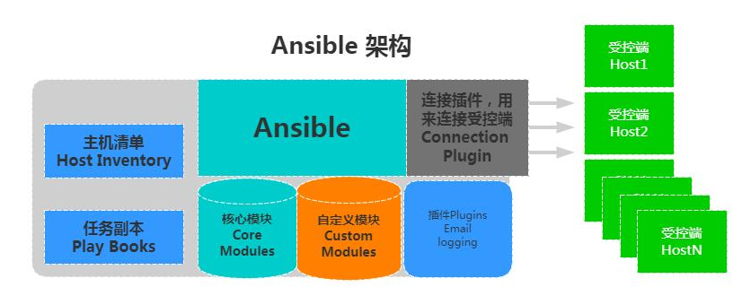

# Ansible

学习Ansible的使用,Ansible是一个管理多个主机配置的工具,使用它可以免除繁杂的重复配置过程

## 前置条件

硬件环境:

| IP             | 节点作用           |
| -------------- | ------------------ |
| 192.168.163.80 | ansible 节点       |
| 192.168.163.81 | 中间件运行节点     |
| 192.168.163.82 | 运行前后端服务节点 |
| 192.168.163.83 | 前后端项目构建节点 |

ssh密钥

ansible使用前需要确保ansible节点服务器的公共 SSH 密钥已添加到每个主机上的 `authorized_keys` 文件中

```
# 生成密钥
ssh-keygen

# 复制密钥
ssh-copy-id -i ~/.ssh/id_rsa.pub -p 22 newuser@192.168.163.81
ssh-copy-id -i ~/.ssh/id_rsa.pub -p 22 newuser@192.168.163.82
ssh-copy-id -i ~/.ssh/id_rsa.pub -p 22 newuser@192.168.163.83
```

## 安装

Ansible可以使用python的包管理器安装(例如`pip3`,`uv`)

```
# 安装pip
sudo apt-get install -y python3-pip

# 安装ansible
pip install ansible
```

## 命令

```
ansible <host-pattern> [options]
-v          #显示详细信息
-i          #主机清单文件路径，默认是在/etc/ansible/hosts
-m          #使用的模块名称，默认使用command模块
-a          #使用的模块参数，模块的具体动作
-k          #提示输入ssh密码，而不使用基于ssh的密钥认证
-C          #模拟执行测试，但不会真的执行
-T          #执行命令的超时
-f <FORKS>, --forks <FORKS>	#指定要使用的并行进程数（默认=5）
-u			#连接服务器的用户名
--become	#提升特权,默认为root
-b			#使用become(提权)运行操作
```

### 提权

使用`-become`参数提权,同时附加`--ask-become-pass`从命令行读取输入密码

```
ansible web -i inventory.yml -m file -a "dest=/home/newuser/wordpress state=absent" --become --ask-become-pass
BECOME password: 
```


## 架构


大多数Ansible环境具有三个主要组件:

- 控制节点(control node): 安装Ansible的系统,可以在控制节点上运行Ansible命令,例如`ansible`或`ansible-inventory`
- 清单(inventory): 以逻辑方式组织的受控节点列表,在控制节点上创建清单来向ansible描述主机部署
- 受控节点(managed nodes): Ansible控制的远程系统或主机



1. 连接插件`connection plugins`用于连接被控节点
2. 核心模块`core modules`连接主机实现操作， 它依赖于具体的模块来做具体的事情 
3. 自定义模块`custom modules`根据自己的需求编写具体的模块 
4. 插件`plugins`完成模块功能的补充 
5. 剧本`playbook`是ansible中的脚本,定义多个任务，由ansible自动执行 
6. 主机清单`inventory`定义被控节点的信息

> 除非使用`ansible-pull`,否则被控节点也需要安装`ansible`

## 配置文件

Ansible配置文件的读取顺序(越往上优先级越高):

- `ANSIBLE_CONFIG`（如果设置了环境变量）
- `ansible.cfg`（在当前目录中）
- `~/.ansible.cfg`（在主目录中）
- `/etc/ansible/ansible.cfg`

可以使用`ansible-config list`指令显示当前配置

## 构建清单

构建清单(build inventory)是存放受控节点的系统信息和网络位置的文件

可以使用 `INI` 文件或 `YAML` 创建清单,对于少量节点推荐使用`ini`格式,对于多节点使用`yaml`

```
# ini格式
# vim inventory.ini
[myhosts]
192.168.163.81
192.168.163.82
192.168.163.83
```

可以使用`ansible-inventory`命令验证清单

```
newuser@ubuntu:~/ansible_start$ ansible-inventory -i inventory.ini --list
{
    "_meta": {
        "hostvars": {}
    },
    "all": {
        "children": [
            "ungrouped",
            "myhosts"
        ]
    },
    "myhosts": {
        "hosts": [
            "192.168.163.81",
            "192.168.163.82",
            "192.168.163.83"
        ]
    }
}

# --list参数也可以换成--graph
newuser@ubuntu:~/ansible_start$ ansible-inventory -i inventory.ini --graph
@all:
  |--@ungrouped:
  |--@myhosts:
  |  |--192.168.163.81
  |  |--192.168.163.82
  |  |--192.168.163.83
```

```
# yaml格式
newuser@ubuntu:~/ansible_start$ cat inven.yaml
myhosts:
  hosts:
    my_host_01:
      ansible_host: 192.168.163.81
    my_host_02:
      ansible_host: 192.168.163.82
    my_host_03:
      ansible_host: 192.168.163.83
      
newuser@ubuntu:~/ansible_start$ ansible-inventory -i inven.yaml --list
{
    "_meta": {
        "hostvars": {
            "my_host_01": {
                "ansible_host": "192.168.163.81"
            },
            "my_host_02": {
                "ansible_host": "192.168.163.82"
            },
            "my_host_03": {
                "ansible_host": "192.168.163.83"
            }
        }
    },
    "all": {
        "children": [
            "ungrouped",
            "myhosts"
        ]
    },
    "myhosts": {
        "hosts": [
            "my_host_01",
            "my_host_02",
            "my_host_03"
        ]
    }
}
```

### 变量

变量设置受管节点的值，例如 IP 地址、FQDN(完全限定域名)、操作系统和 SSH 用户，因此您无需在运行 Ansible 命令时传递它们。

变量可以应用于特定主机。

```
webservers:
  hosts:
    webserver01:
      ansible_host: 192.0.2.140
      http_port: 80
    webserver02:
      ansible_host: 192.0.2.150
      http_port: 443
```

```
# 使用别名来管理客户端
[webs]
web01 ansible_ssh_host=10.0.0.7 ansible_ssh_port=22
web02 ansible_ssh_host=10.0.0.8
```

变量也可以应用于组中的所有主机。

```
webservers:
  hosts:
    webserver01:
      ansible_host: 192.0.2.140
      http_port: 80
    webserver02:
      ansible_host: 192.0.2.150
      http_port: 443
  vars:
    ansible_user: my_server_user
```

```
#方式一、主机组变量+主机+密码
[db_group]
db01 ansible_ssh_host=10.0.0.51
db02 ansible_ssh_host=10.0.0.52
[db_group:vars]
ansible_ssh_pass='1'

#方式二、主机组变量+主机+密钥
[web_group]
web01 ansible_ssh_host=10.0.0.7
web02 ansible_ssh_host=10.0.0.8
```

### 元组

还可以使用`元组`来组织清单中的多个组

```
metagroupname:
	children:
```

例如下例中的`webserver`元组

```
newuser@ubuntu:~/ansible_start$ cat inventory.yaml
db:
  hosts:
    db01:
      ansible_host: 192.168.163.81
    db02:
      ansible_host: 192.168.163.82
web:
  hosts:
    web01:
      ansible_host: 192.168.163.83
webserver:
  children:
    db:
    web:

newuser@ubuntu:~/ansible_start$ ansible-inventory -i inventory.yaml --list
{
    "_meta": {
        "hostvars": {
            "db01": {
                "ansible_host": "192.168.163.81"
            },
            "db02": {
                "ansible_host": "192.168.163.82"
            },
            "web01": {
                "ansible_host": "192.168.163.83"
            }
        }
    },
    "all": {
        "children": [
            "ungrouped",
            "webserver"
        ]
    },
    "db": {
        "hosts": [
            "db01",
            "db02"
        ]
    },
    "web": {
        "hosts": [
            "web01"
        ]
    },
    "webserver": {
        "children": [
            "db",
            "web"
        ]
    }
}
```

```
vim hosts
[db_group]
db01 ansible_ssh_host=10.0.0.51
db02 ansible_ssh_host=10.0.0.52

[web_group]
web01 ansible_ssh_host=10.0.0.7
web02 ansible_ssh_host=10.0.0.8

[lnmp:children]
db_group
web_group

# -m 指定使用的模块名称
newuser@ubuntu:~/ansible_start$ ansible lnmp -m ping -i hosts --list-hosts
  hosts (4):
    db01
    db02
    web01
    web02
```


## 剧本

剧本(playbook)是以`yaml`格式编写的自动化蓝图,ansible利用它在受控节点上执行部署和配置操作

- 剧本(playbook): 由多个"场景"(play)组成的有序列表，Ansible从上至下执行这些场景以实现整体目标。
- 场景(play): 与清单(inventory)中受管节点映射的有序任务(task)列表,定义任务执行的角色
- 任务(task): 对单个模块(module)的引用,定义ansible执行的具体操作,定义具体的任务
- 模块(module): 在受控节点上执行的代码单元(脚本或二进制文件),ansible模块以集合(collection)形式组织,每个模块拥有完全限定集合名称(FQCN)

创建一个`playbook.yaml`

```
- name: My first play
  hosts: myhosts
  tasks:
    - name: Ping my hosts
      ansible.builtin.ping:
        
    - name: Print message
      ansible.builtin.debug:
        msg: Hello World
```

运行结果如下:

```
ansible-playbook -i inventory.ini playbook.yaml

PLAY [My first play] ******************************************************************************************

TASK [Gathering Facts] ****************************************************************************************
ok: [192.168.163.83]
ok: [192.168.163.81]
ok: [192.168.163.82]

TASK [Ping my hosts] ******************************************************************************************
ok: [192.168.163.83]
ok: [192.168.163.81]
ok: [192.168.163.82]

TASK [Print message] ******************************************************************************************
ok: [192.168.163.81] => {
    "msg": "Hello World"
}
ok: [192.168.163.82] => {
    "msg": "Hello World"
}
ok: [192.168.163.83] => {
    "msg": "Hello World"
}

PLAY RECAP ****************************************************************************************************
192.168.163.81             : ok=3    changed=0    unreachable=0    failed=0    skipped=0    rescued=0    ignored=0   
192.168.163.82             : ok=3    changed=0    unreachable=0    failed=0    skipped=0    rescued=0    ignored=0   
192.168.163.83             : ok=3    changed=0    unreachable=0    failed=0    skipped=0    rescued=0    ignored=0   
```

结果中包括:

- 剧目和任务的名称
- `Gathering Facts`收集事实 任务隐式运行,用于收集清单的信息以便在剧本中使用
- 每个任务的状态(`ok`表示已成功运行)
- 剧目摘要(play recap),总结每隔主机上所有任务的运行结果,上面的例子中一共有三个任务(包括隐式的收集事实任务),`ok=3`表示所有任务都已成功运行

> 如果结果出现:
>
> 1. > WARNING: Platform linux on host 192.168.163.83 is using the discovered Python interpreter at /usr/bin/python3.10, but future installation of another Python interpreter could change the meaning of that path. 
>
>    可以在`playbook.yaml`中指定`ansible_python_interpreter`:
>
>    ```
>    - name: My first play
>      vars:
>        ansible_python_interpreter: /usr/bin/python3.10
>    ```
>
>    也可以在`inventory`中指定该环境变量,例如:
>    ```
>    newuser@ubuntu:~/ansible_start$ cat inventory.yaml
>    db:
>      hosts:
>        db01:
>          ansible_host: 192.168.163.81
>        db02:
>          ansible_host: 192.168.163.82
>    web:
>      hosts:
>        web01:
>          ansible_host: 192.168.163.83
>    webserver:
>      children:
>        db:
>        web:
>      vars:
>        ansible_python_interpreter: /usr/bin/python3.10
>    ```
>
>    
>
> 2. 如果出现输入密码的提示语显示混乱
>    可以使用`ssh-agent`管理密钥,这样就不需要手动输入密码
>
>    ```
>    eval $(ssh-agent)
>             
>    ssh-add ~/.ssh/id_rsa
>    ```

### playbook的执行流程

1. Ansible读取`playbook`剧本,基本中的`play`会记录被控主机和任务列表的映射
2. Ansible通过主机清单找到要执行的主机
3. Ansible通过连接插件连接对应的主机并推送对应的任务列表
4. 被管理的主机将Ansible主机发送过来的任务解析为本地Shell命令执行

### 示例

#### 部署LNMP+NFS+BACKUP服务集群

```
# inventory.yml
web:
  hosts:
    web01:
      ansible_host: 192.168.163.81
    web02:
      ansible_host: 192.168.163.82
db:
  hosts:
    db01:
      ansible_host: 192.168.163.83
nfs:
  hosts:
    nfs01:
      ansible_host: 192.168.163.84
backup:
  hosts:
    backup01:
      ansible_host: 192.168.163.85
webserver:
  children:
    db:
    web:
    nfs:
    backup:
  vars:
    ansible_python_interpreter: /usr/bin/python3.10

```

```
# secrets.yml 
ansible_become_pass: "123
```

```\
# lnmp.yml 
- name: web server setup Nginx
  hosts: web
  become: yes
  vars_files:
    - secrets.yml
  tasks: 
    - name: update and upgrade apt packages
      apt:
        update_cache: yes
        upgrade: dist
    - name: apt install nginx mariadb php
      apt:
        name: "{{ packages }}"
        state: latest
      vars:
        packages: 
          - nginx
          - mariadb-server
          - php-fpm
          - php-mysql
          - php-curl
          - php-gd
          - php-mbstring
          - php-xml
          - php-xmlrpc
          - php-zip
          - php-intl
          - unzip
    - name: systemctl enable --now nginx
      systemd:
        name: nginx
        state: started
        enabled: yes
    - name: systemctl enable --now mariadb
      systemd:
        name: mariadb
        state: started
        enabled: yes
    - name: copy wordpress.zip
      copy:
        src: /home/newuser/wordpress-6.8.2-zh_CN.zip
        dest: /home/newuser/wordpress.zip
    - name: unzip wordpress.zip
      shell: "cd /home/newuser/ && rm -rf wordpress  && unzip wordpress.zip"
    - name: copy wordpress to /var/www/html/
      shell: "rm -rf /var/www/html/wordpress/ && mv /home/newuser/wordpress /var/www/html/"
    - name: chown wordpress to www-data:www-data
      shell: "chown -R www-data:www-data /var/www/html/wordpress"
    - name: change /etc/nginx/sites-available/default root
      shell: "sed -i 's_/var/www/html;_/var/www/html/wordpress;_g' /etc/nginx/sites-available/default"
      shell: "sed -i 's/index.html/index.html index.php/g' /etc/nginx/sites-available/default"
    - name: restart nginx
      systemd:
        name: nginx
        state: restarted
```

运行命令:

```
ansible-playbook -i inventory.yml lnmp.yml --ask-vault-pass 
```


## 临时命令

临时命令(ad hoc)相当于单条shell命令,在一个或多个受控节点上自动化单个任务,适合不经常重复的任务,使用临时命令就不需要编写`playbook`

> 和Playbook一样，临时任务使用声明式模型，计算并执行达到指定最终状态所需的操作。它们通过在开始之前检查当前状态，并且除非当前状态与指定的最终状态不同，否则不执行任何操作，从而实现某种形式的幂等性。

语法:

```
$ ansible [pattern] -m [module] -a "[module options]"
```

`-a` 选项通过 `key=value` 语法或以 `{` 开头并以 `}` 结尾的 JSON 字符串接受选项，以用于更复杂的选项结构。

`-m`选项指定使用的模块名称,默认为`ansible.builtin.command`

```
# 查看磁盘信息
newuser@ubuntu:~/ansible_start$ ansible webserver -i inventory.yaml -m command -a 'df -h'
db02 | CHANGED | rc=0 >>
Filesystem                         Size  Used Avail Use% Mounted on
tmpfs                              197M  1.1M  196M   1% /run
/dev/mapper/ubuntu--vg-ubuntu--lv   12G  6.5G  4.2G  61% /
tmpfs                              982M     0  982M   0% /dev/shm
tmpfs                              5.0M     0  5.0M   0% /run/lock
/dev/sda2                          2.0G  131M  1.7G   8% /boot
tmpfs                              197M  4.0K  197M   1% /run/user/1000
web01 | CHANGED | rc=0 >>
Filesystem                         Size  Used Avail Use% Mounted on
tmpfs                              197M  1.1M  196M   1% /run
/dev/mapper/ubuntu--vg-ubuntu--lv   12G  6.6G  4.2G  62% /
tmpfs                              982M     0  982M   0% /dev/shm
tmpfs                              5.0M     0  5.0M   0% /run/lock
/dev/sda2                          2.0G  131M  1.7G   8% /boot
tmpfs                              197M  4.0K  197M   1% /run/user/1000
db01 | CHANGED | rc=0 >>
Filesystem                         Size  Used Avail Use% Mounted on
tmpfs                              197M  1.1M  196M   1% /run
/dev/mapper/ubuntu--vg-ubuntu--lv   12G  6.6G  4.2G  62% /
tmpfs                              982M     0  982M   0% /dev/shm
tmpfs                              5.0M     0  5.0M   0% /run/lock
/dev/sda2                          2.0G  131M  1.7G   8% /boot
tmpfs                              197M  4.0K  197M   1% /run/user/1000
# 批量查看内存信息
newuser@ubuntu:~/ansible_start$ ansible webserver -i inventory.yaml -m command -a 'free -m'
web01 | CHANGED | rc=0 >>
               total        used        free      shared  buff/cache   available
Mem:            1963         235         120           1        1608        1535
Swap:           2047           0        2047
db02 | CHANGED | rc=0 >>
               total        used        free      shared  buff/cache   available
Mem:            1963         216         117           1        1630        1554
Swap:           2047           0        2047
db01 | CHANGED | rc=0 >>
               total        used        free      shared  buff/cache   available
Mem:            1963         228          93           1        1642        1542
Swap:           2047           0        2047
```

### 返回结果颜色

绿色: 代表被管理端主机没有被修改 
黄色: 代表被管理端主机发现变更 
红色: 代表出现了故障，注意查看提示

## Vault

Ansible vault 提供了一种加密和管理敏感数据（如密码）的方法

```
# 创建一个加密的变量文件
ansible-vault create secrets.yml

# 写入sudo密码
ansible_become_pass: "123"

# 在playbook中使用
- name: web server setup Nginx
  hosts: web
  become: yes
  vars_files:
    - secrets.yml
  task:
  
# 导入之后可以直接使用文件中的变量
tasks:
  - name: Create database user
    mysql_user:
      name: "{{ db_user }}"
      password: "{{ vaulted_db_password }}"  # 加密变量
```

## 变量

ansible中定义变量的方法(优先级从大到小):

1. 在命令行定义
2. 在playbook文件中定义
3. 在inventory文件中定义

### 命令行

`ansible`的命令中使用`-e`参数设置变量

```
ansible-playbook test.yml -e "web_server=vsftpd" -e "db_server=mariadb-server"
```

### playbook

#### 直接定义

在`playbook`中指定变量,可以在每一个`play`中定义`vars`:

```
- hosts: web_group
  vars:
      - web_server: httpd
      - db_server: mariadb-server
      - php_server: php,php-mysql,php-pdo
   tasks:
  - name: Install httpd  mariadb php Server
    yum:
      name:
        - "{{ web_server }}"
        - "{{ db_server }}"
        - "{{ php_server }}"
        
# 也可以使用字典的形式:
  vars:
    web_server: httpd
    db_server: mariadb-server
    packages:
      - httpd
      - mariadb-server
      - php
      - php-mysql
      - php-pdo
```

#### vars_file

使用`vars_file`可以将变量在多个playbook中使用,也可以使用`ansible-vault`创建一个加密的`vars_file`存储敏感信息

```
[root@m01 ~]# cat vars1.yml
web_server: httpd
[root@m01 ~]# cat vars2.yml
db_server: mariadb-server

#调用阶段
- hosts: web_group
  vars_file: 
    - ./vars1.yml
    - ./vars2.yml
  - name: Install httpd  mariadb php Server
    yum:
      name:
        - "{{ web_server }}"
        - "{{ db_server }}"
```

### Inventory

Inventory中定义的变量和主机绑定

#### inventory文件定义变量

```
#定义阶段
[root@m01 ~]# vim /etc/ansible/hosts
[web_group]
web01 ansible_ssh_host=10.0.0.7
web02 ansible_ssh_host=10.0.0.8
[web_group:vars]
web_server=httpd
index_file=index.html

#调用阶段
- hosts: web_group
  tasks:
  - name: Install httpd Server
    yum:
      name: "{{ web_server }}"
  - name: Create Index File
    file:
      path: /tmp/{{ index_file }}
      state: touch 
```

还可以在Ansible项目目录下创建两个变量目录`host_vars`和`group_vars`,这是官方推荐的做法

#### 主机组定义变量

```
#定义阶段
[root@m01 ~]# mkdir group_vars

#切记定义变量的文件必须以组名为文件名
[root@m01 ~]# vim /root/group_vars/web_group
web_server: httpd

#调用阶段
- hosts: web_group
  tasks:
  - name: Install httpd Server
    yum:
      name: "{{ web_server }}"
```

#### 主机定义变量

```
#定义阶段
[root@m01 ~]# mkdir host_vars

#切记定义变量的文件必须以主机名为文件名
[root@m01 ~]# vim /root/host_vars/web01
web_server: nginx

#调用阶段
- hosts: web_group
  tasks:
  - name: Install httpd Server
    yum:
      name: "{{ web_server }}"
```

### 变量注册

变量注册可以将ansible模块运行结果存储到变量中,然后通过调用变量名获取返回值,这种将返回值写入变量的方法叫做**变量注册**

```
newuser@ansible:~/lnmp$ cat test.yml 
- hosts: web
  tasks:
    - name: ls -l
      shell: "ls -l /home/newuser/"
      # 注册变量
      register: list_dir
    - name: print result
      debug:
        msg: "{{list_dir}}"
        
newuser@ansible:~/lnmp$ ansible-playbook test.yml -i inventory.yml 

PLAY [web] *********************************************************************************************

TASK [Gathering Facts] *********************************************************************************
ok: [web02]
ok: [web01]

TASK [ls -l] *******************************************************************************************
changed: [web01]
changed: [web02]

TASK [print result] ************************************************************************************
ok: [web01] => {
    "msg": {
        "changed": true,
        "cmd": "ls -l /home/newuser/",
        "delta": "0:00:00.008557",
        "end": "2025-08-07 15:52:33.571359",
        "failed": false,
        "msg": "",
        "rc": 0,
        "start": "2025-08-07 15:52:33.562802",
        "stderr": "",
        "stderr_lines": [],
        "stdout": "total 35092\n-rw-r--r-- 1 root root 35933779 Aug  7 08:49 wordpress.zip",
        "stdout_lines": [
            "total 35092",
            "-rw-r--r-- 1 root root 35933779 Aug  7 08:49 wordpress.zip"
        ]
    }
}
ok: [web02] => {
    "msg": {
        "changed": true,
        "cmd": "ls -l /home/newuser/",
        "delta": "0:00:00.007904",
        "end": "2025-08-07 15:52:33.573846",
        "failed": false,
        "msg": "",
        "rc": 0,
        "start": "2025-08-07 15:52:33.565942",
        "stderr": "",
        "stderr_lines": [],
        "stdout": "total 35092\n-rw-r--r-- 1 root root 35933779 Aug  7 08:49 wordpress.zip",
        "stdout_lines": [
            "total 35092",
            "-rw-r--r-- 1 root root 35933779 Aug  7 08:49 wordpress.zip"
        ]
    }
}

PLAY RECAP *********************************************************************************************
web01                      : ok=3    changed=1    unreachable=0    failed=0    skipped=0    rescued=0    ignored=0   
web02                      : ok=3    changed=1    unreachable=0    failed=0    skipped=0    rescued=0    ignored=0   
```

### 层级变量文件

在`vars_file`文件中可以层级定义变量:

```
#编辑变量文件
[root@m01 ~]# vim vars_file.yml
lamp:
  framework:
    web_package: httpd
    db_package: mariadb-server
    php_package: php

lnmp:
  framework:
    web_package: nginx
    db_package: mysql
    php_package: php

lnmt:
  framework:
    web_package: nginx
    db_package: mysql
    java_package: tomcat

```

在playbook调用中,可以使用

```
name: "{{ lamp.framework.web_package }}"
```

但更推荐使用:

```
name: "{{ lamp['framework']['web_package'] }}"
```

### facts

Ansible facts是在被管理追击上通过Ansible自动采集发现的变量。`facts`包含每台特定的主机信息。比如：被控端的主机名、IP地址、系统版本、CPU数量、内存状态、磁盘状态等等。

使用facts变量可以根据主机的具体情况进行不同的配置

使用facts生成mysqld配置文件:

```
newuser@ansible:~/lnmp$ cat fact.yml
- hosts: web
  tasks:
    - name: copy mysqld conf
      # 必须使用template,template会在复制前解析文件中的 Jinja2模板语法,如{{}}
      template:
        src: ./my.cnf
        dest: /home/newuser/my.cnf
newuser@ansible:~/lnmp$ cat my.cnf 
[mysqld]
basedir=/usr
datadir=/var/lib/mysql/
socket=/var/lib/mysql/mysql.sock
log_error=/var/log/mariadb/mariadb.log
innodb_buffer_pool_size={{ ansible_memtotal_mb * 0.8 }}
```

被控主机:

```
newuser@web01:~$ cat my.cnf 
[mysqld]
basedir=/usr
datadir=/var/lib/mysql/
socket=/var/lib/mysql/mysql.sock
log_error=/var/log/mariadb/mariadb.log
innodb_buffer_pool_size=1570.4
```


## 模块

ansile使用的默认模块是[ansible.builtin.command](https://docs.ansible.org.cn/ansible/latest/collections/ansible/builtin/command_module.html#command-module)

```bash
command             # 默认模块,执行shell命令(不支持管道等特殊字符)
shell               # 执行shell命令
scripts             # 执行shell脚本
yum_repository      # 配置yum仓库
yum                 # 安装软件
copy                # 变更配置文件
file                # 建立目录或文件
service             # 启动与停止服务
mount               # 挂载设备
cron                # 定时任务
get_url             #下载软件
firewalld           #防火墙
selinux             #selinux
```

可以使用`ansible-doc`工具访问每个模块的文档,或访问[集合文档](https://docs.ansible.org.cn/ansible/latest/collections/index.html#list-of-collections)

### command

默认模块,执行shell命令,不支持管道操作

```
# 打印内存使用信息
ansible webserver -i inventory.yaml -m command -a 'free -m'

# 使用newuser连接并通过become关键字提权(使用root)执行命令
# 如果使用--ask-becom-pass或-K,则使用密码而不是密钥连接
ansible atlanta -a "/sbin/reboot" -f 10 -u username --become [--ask-become-pass]
```

### shell

执行shell命令,支持管道操作

```
ansible webserver -i inventory.yaml -m shell -a 'ps aux | grep ps'
```

### copy

```
ansible webserver -i inventory.yaml -m ansible.builtin.copy -a "src=/home/newuser/ansible_start/aaa dest=/tmp/aaa"
```

### file

[ansible.builtin.file](https://docs.ansible.org.cn/ansible/latest/collections/ansible/builtin/file_module.html#file-module) 模块允许更改文件的所有权和权限

```
ansible webserver -i inventory.yaml -m ansible.builtin.file -a "dest=/tmp/aaa mode=600"
```

还可以递归的删除目录和文件

```
ansible webserver -i inventory.yaml -m ansible.builtin.file -a "dest=/tmp/aaa state=absent"
```

### dnf/apt

使用[dnf](https://docs.ansible.org.cn/ansible/latest/collections/ansible/builtin/dnf_module.html#ansible-collections-ansible-builtin-dnf-module)管理软件包

```
# 安装
ansible all -m dnf -a "name=nginx state=present"
# 更新
ansible webservers -m dnf -a "name=* state=latest"
# 移除
ansible all -m dnf -a "name=telnet state=absent"
```

使用[apt](https://docs.ansible.org.cn/ansible/latest/collections/ansible/builtin/apt_module.html#ansible-collections-ansible-builtin-apt-module)管理软件包

```
# 安装
ansible all -m apt -a "name=nginx state=present"
# 更新
ansible ubuntu_servers -m apt -a "upgrade=dist"
# 移除
ansible all -m apt -a "name=apache2 state=absent"
```

二者在具体细节上略有不同

### user

[ansible.builtin.user](https://docs.ansible.org.cn/ansible/latest/collections/ansible/builtin/user_module.html#user-module) 模块可以管理用户和组

```
ansible all -m ansible.builtin.user -a "name=foo password=123"

ansible all -m ansible.builtin.user -a "name=foo state=absent"
```

### service

```
# 启动服务
ansible webservers -m ansible.builtin.service -a "name=httpd state=started"
# 重启服务
ansible webservers -m ansible.builtin.service -a "name=httpd state=restarted"
# 停止服务(确保已停止)
ansible webservers -m ansible.builtin.service -a "name=httpd state=stopped"
```

### cron

定时任务模块

```
# 添加定时任务
[root@m01 ~]# ansible web_group -m cron -a "minute=* hour=* day=* month=* weekday=*  job='/bin/sh /server/scripts/test.sh'"

# 设置定时任务注释信息，防止重复，name设定
[root@m01 ~]# ansible web_group -m cron -a "name='cron01' job='/bin/sh /server/scripts/test.sh'"

# 删除相应定时任务
[root@m01 ~]# ansible web_group -m cron -a "name='ansible cron02' minute=0 hour=0 job='/bin/sh /server/scripts/test.sh' state=absent"

# 注释相应定时任务，使定时任务失效
[root@m01 scripts]# ansible web_group -m cron -a "name='ansible cron01' minute=0 hour=0 job='/bin/sh /server/scripts/test.sh' disabled=no"
```

### mount

```
[root@m01 ~]# ansible web_group -m mount -a "src=172.16.1.31:/data path=/data fstype=nfs opts=defaults state=present"

[root@m01 ~]# ansible web01 -m mount -a "src=172.16.1.31:/data path=/data fstype=nfs opts=defaults state=mounted"

[root@m01 ~]# ansible web02 -m mount -a "src=172. 16.1.31:/data path=/data fstype=nfs opts=defaults state=unmounted"

[root@m01 ~]# ansible web -m mount -a "src=172.16.1.31:/data path=/data fstype=nfs opts=defaults state=absent"

present     # 开机挂载，仅将挂载配置写入/etc/fstab
mounted     # 挂载设备，并将配置写入/etc/fstab
unmounted   # 卸载设备，不会清除/etc/fstab写入的配置
absent      # 卸载设备，会清理/etc/fstab写入的配置
```

### selinux/firewalld

防火墙模块

```
# selinux
#修改配置文件关闭selinux，必须重启
[root@m01 ~]# ansible web_group -m selinux -a 'state=disabled' -i ./hosts

#临时关闭
[root@m01 ~]# ansible web_group -m shell -a 'setenforce 0' -i ./hosts
```

```
# firewalld
[root@m01 ~]# ansible web_group -m firewalld -a 'service=http permanent=yes state=enabled' -i ./hosts
[root@m01 ~]# ansible web_group -m firewalld -a "service=http immediate=yes permanent=yes state=enabled" -i ./hosts

[root@m01 ~]# ansible web_group -m firewalld -a "port=8080-8090/tcp immediate=yes permanent=yes state=enabled" -i ./hosts

service                 #指定开放或关闭的服务名称
port                    #指定开放或关闭的端口
permanent               #是否添加永久生效
state                   #开启或者关闭
    enabled
    disabled

zone                    #指定配置某个区域
rich_rule               #配置辅规则
masquerade              #开启地址伪装
immediate               #临时生效
source                  #指定来源IP
```

### setup

主机信息模块,在自动化中比较实用,例如:

- 根据主机的IP或主机名创建目录
- 根据内存的不同大小分配虚拟内存
- playbook中根据不同的内存使用情况进行判断

```
# 获取主机全部信息
ansible webserver -i inventory.yaml -m setup

# 获取IP地址
ansible webserver -i inventory.yaml -m setup -a "filter=ansible_default_ipv4"

# 获取主机名
ansible webserver -i inventory.yaml -m setup -a "filter=ansible_fqdn"

# 获取内存信息
ansible webserver -i inventory.yaml -m setup -a "filter=ansible_memory_mb"

# 获取磁盘信息
ansible webserver -i inventory.yaml -m setup -a "filter=ansible_devices"

# 其他参数
ansible_all_ipv4_addresses：仅显示ipv4的信息。
ansible_devices：仅显示磁盘设备信息。
ansible_distribution：显示是什么系统，例：centos,suse等。
ansible_distribution_major_version：显示是系统主版本。
ansible_distribution_version：仅显示系统版本。
ansible_machine：显示系统类型，例：32位，还是64位。
ansible_eth0：仅显示eth0的信息。
ansible_hostname：仅显示主机名。
ansible_kernel：仅显示内核版本。
ansible_lvm：显示lvm相关信息。
ansible_memtotal_mb：显示系统总内存。
ansible_memfree_mb：显示可用系统内存。
ansible_memory_mb：详细显示内存情况。
ansible_swaptotal_mb：显示总的swap内存。
ansible_swapfree_mb：显示swap内存的可用内存。
ansible_mounts：显示系统磁盘挂载情况。
ansible_processor：显示cpu个数(具体显示每个cpu的型号)。
ansible_processor_vcpus：显示cpu个数(只显示总的个数)。
```


## 问题

### Ansible的功能及优点

1. 远程执行,可以对多台主机批量执行远程命令
2. 可以进行自动化配置,服务的同意配置管理和启停
3. 通过ansible对服务器进行不同的事件驱动,例如:
   - 修改配置后重启
   - 只修改配置不重启
   - 修改配置文件后重新加载
   - 远程启停服务管理
4. 可以通过API接口管理公有云
5. 使用Python语言,便于二次开发
6. 通过`playbook`统一编排和管理服务,可以一条命令实现一套架构的部署
7. 跨平台,跨系统


