# Prometheus

## 概述

[Prometheus](https://github.com/prometheus) 是一个开源的系统监控和告警工具包，最初由 [SoundCloud](https://soundcloud.com) 构建。自 2012 年诞生以来，许多公司和组织都采用了 Prometheus，并且该项目拥有非常活跃的开发者和用户 [社区](https://prometheus.ac.cn/community/)。它现在是一个独立的开源项目，由任何公司独立维护。为了强调这一点并明确项目的治理结构，Prometheus 于 2016 年加入了 [云原生计算基金会](https://cncf.io/)，成为继 [Kubernetes](https://kubernetes.ac.cn/)之后第二个托管项目。

Prometheus 将其指标(metrics)作为时间序列数据收集和存储，即指标信息与记录时的时间戳以及可选的键值对（称为标签）一起存储。

### 特性

Prometheus 的主要特性包括：

- 一个多维[数据模型](https://prometheus.ac.cn/docs/concepts/data_model/)，其中时间序列数据由指标名称和键/值对标识
- PromQL，一种灵活的[查询语言](https://prometheus.ac.cn/docs/prometheus/latest/querying/basics/)，用于利用这种多维性
- 不依赖分布式存储；单个服务器节点是自主的
- 时间序列收集通过 HTTP 上的拉取模型进行
- 通过中间网关支持[推送时间序列](https://prometheus.ac.cn/docs/instrumenting/pushing/)
- 通过服务发现或静态配置发现目标
- 支持多种图形和仪表盘模式

### 组件

Prometheus 生态系统由多个组件组成，其中许多是可选的

- [Prometheus Server](https://github.com/prometheus/prometheus)， 主要用于抓取数据和存储时序数据，另外还提供查询和 Alert Rule 配置管理。

- [client libraries](https://prometheus.io/docs/instrumenting/clientlibs/)，用于检测应用程序代码的客户端库。

- [push gateway](https://github.com/prometheus/pushgateway) ，用于批量，短期的监控数据的汇总节点，主要用于业务数据汇报等。

- [exporters](https://prometheus.io/docs/instrumenting/exporters/) 收集监控样本数据，并以标准格式向 Prometheus 提供。例如：收集服务器系统数据的 node_exporter, 收集 MySQL 监控样本数据的是 MySQL exporter 等等。

- 用于告警通知管理的 [alertmanager](https://github.com/prometheus/alertmanager) 。

### 架构

Prometheus 从已埋点的作业中抓取指标，可以直接抓取，也可以通过中间推送网关抓取短生命周期作业的指标。它将所有抓取的样本存储在本地，并根据这些数据运行规则，以聚合并记录现有数据中的新时间序列或生成告警。[Grafana](https://grafana.org.cn/) 或其他 API 消费者可用于可视化收集到的数据。

此图展示了 Prometheus 及其部分生态系统组件的架构


Prometheus 的主要模块包含， Server, Exporters, Pushgateway, PromQL, Alertmanager, WebUI 等。

它大致使用逻辑是这样：

1. Prometheus server 定期从静态配置的 targets 或者服务发现的 targets 拉取数据（Targets是Prometheus采集Agent需要抓取的采集目标）
2. 当新拉取的数据大于配置内存缓存区的时候，Prometheus 会将数据持久化到磁盘（如果使用 remote storage 将持久化到云端）。
3. Prometheus 可以配置 rules，然后定时查询数据，当条件触发的时候，会将 alerts 推送到配置的 Alertmanager。
4. Alertmanager 收到警告的时候，可以根据配置（163，钉钉等），聚合，去重，降噪，最后发送警告。
5. 可以使用 API， Prometheus Console 或者 Grafana 查询和聚合数据。

### Prometheus与Zabbix的对比

| Zabbix                                                       | Prometheus                                                   |
| ------------------------------------------------------------ | ------------------------------------------------------------ |
| 后端用C开发，界面用PHP开发，定制化难度很高。                 | 后端用golang开发，前端是Grafana，JSON编辑即可解决定制化难度较低 |
| 6.0支持单个Zabbix实例监控超过10万个业务服务                  | 支持更大的集群规模，速度也更快                               |
| 更适合监控物理机环境（物理主机，交换机，网络等监控）         | 更适合云环境的监控，对OpenStack，Kubernetes有更好的集成      |
| 监控数据存储在关系型数据库内，如 MySQL，很难从现有数据中扩展维度 | 监控数据存储在基于时间序列的数据库内，便于对已有数据进行新的聚合。十万级监控数据，Prometheus数据查询速率比Zabbix更快 |
| 安装简单，zabbix-server 一个软件包中包括了所有的服务端功能   | 安装相对复杂，监控、告警和界面都分属于不同的组件             |
| 图形化界面比较成熟，界面上基本上能完成全部的配置操作         | 界面相对较弱，很多配置需要修改配置文件                       |
| 发展时间更长，对于很多监控场景，都有现成的解决方案           | 2015 年后开始快速发展，发展时间短，但现在也非常的成熟        |

## 概念

### 时间序列

Prometheus 会将所有采集到的监控样本数据以**时间序列**的方式写入 WAL，并存放在内存中以便快速查询，同时定期（默认2小时）将数据压缩为时间序列数据块并持久化到磁盘。

时间序列是按照时间戳和值的序列顺序存放的，每条时间序列通过指标名称(metrics name)和一组标签集(label)命名。

如下所示，可以将时间序列理解为一个以时间为 X 轴的数字矩阵：

```
  ^
  │   . . . . . . . . . . . . . . . . .   . .   process_open_fds
  │     . . . . . . . . . . . . . . . . . . .   node_cpu_seconds_total{cpu="cpu0",mode="system"}
  │     . . . . . . . . . .   . . . . . . . .   node_load1{}
  │     . . . . . . . . . . . . . . . .   . .
  v
    <------------------ 时间 ---------------->
```

在时间序列中的每一个点称为一个样本（sample），样本由以下三部分组成：

- 指标(metric)：指标名和描述当前样本特征的标签集合

- 时间戳(timestamp)：一个精确到毫秒的时间戳

- 样本值(value)： 一个 float64 的浮点型数据表示当前样本的值

例如对于实时数据：

`````
process_open_fds 27
`````

一组时间序列如下：

``` Plain Text
<--------------------- metric ------------------------------><-timestamp -><-value->
process_open_fds{instance="localhost:9090", job="prometheus"} @1434417560938  39
process_open_fds{instance="localhost:9090", job="prometheus"} @1434417561287  33
process_open_fds{instance="localhost:9090", job="prometheus"} @1434417560938  35
process_open_fds{instance="localhost:9090", job="prometheus"} @1434417561287  37
process_open_fds{instance="localhost:9090", job="prometheus"} @1434417560938  36
process_open_fds{instance="localhost:9090", job="prometheus"} @1434417561287  25
<--metric_name-><----------------lable---------------------->
<--metric_name-><--name--><----value---->  <name><--value--->
```

#### 指标(Metric)

指标在通俗意义上是数值测量。术语“时间序列”是指随时间记录的变化。用户希望测量的内容因应用程序而异。对于 Web 服务器，可能是请求时间；对于数据库，可能是活动连接数或活动查询数等等。

Metric的格式：

```
<metric name>{<label name>=<label value>, ...}
```

- 指标的名称(metric name)可以反映被监控样本的含义（比如，`process_open_fds` - 表示当前系统打开的文件描述符）。
  指标名称只能由ASCII字符、数字、下划线以及冒号组成并必须符合正则表达式`[a-zA-Z_:][a-zA-Z0-9_:]*`。

- 标签(label)反映了当前样本的特征维度，通过这些维度Prometheus可以对样本数据进行过滤，聚合等。
  标签的名称只能由ASCII字符、数字以及下划线组成并满足正则表达式`[a-zA-Z_][a-zA-Z0-9_]*`。

  > 其中以`__`作为前缀的标签，是系统保留的关键字，只能在系统内部使用。标签的值则可以包含任何Unicode编码的字符。在Prometheus的底层实现中指标名称实际上是以`__name__=<metric name>`的形式保存在数据库中的，因此以下两种方式均表示的同一条time-series：
  >
  > ```
  > process_open_fds{instance="localhost:9090", job="prometheus"}
  > # 等同于
  > {__name__="process_open_fds",instance="localhost:9090",job="prometheus"}
  > ```

对于一个下列配置的服务器：

```
scrape_configs:
  - job_name: "prometheus"
    static_configs:
      - targets: ["localhost:9090"]
        labels:
          app: "prometheus"
  - job_name: 'node-exporter'
    scrape_interval: 15s
    static_configs:
    - targets: ['localhost:9100']
      labels:
        instance: Prometheus服务器
```

其`process_open_fds`指标如下：

```
process_open_fds{app="prometheus", instance="localhost:9090", job="prometheus"}
process_open_fds{instance="Prometheus服务器", job="node-exporter"}
```

指标在理解应用程序为何以某种方式工作方面发挥着重要作用。假设您正在运行一个 Web  应用程序并发现它运行缓慢。要了解应用程序发生了什么，您需要一些信息。例如，当请求数量很高时，应用程序可能会变慢。如果您拥有请求计数指标，则可以确定原因并增加服务器数量以处理负载。

#### 指标类型

Prometheus 底层存储上其实并没有对指标做类型的区分，都是以时间序列的形式存储，但是为了方便用户的使用和理解不同监控指标之间的差异，Prometheus 定义了 counter（计数器） 、gauge（仪表盘） 、 histogram（直方图） 以及 summary （摘要）这四种 Metrics 类型。

指标类型可以从metrics中查看

##### 计数器(Counter)

Counter是一种累加指标,表示一个单调递增计数器,其值只能增加或在重启时重置为零,

不要使用计数器来暴露可能减少的值。例如，不要将计数器用于当前运行的进程数

如http_requests_total，node_cpu都是Counter类型的监控指标. 一般在定义Counter类型指标的名称时推荐使用_total作为后缀。

通过 Counter 指标可以统计 HTTP 请求数量，请求错误数，接口调用次数等单调递增的数据，同时可结合 `increase` 和 `rate` 等函数统计变化速率

例如，通过PromQL内置的聚合rate()函数获取HTTP请求量的评价增长率：

```
rate(prometheus_http_requests_total[5m])
```

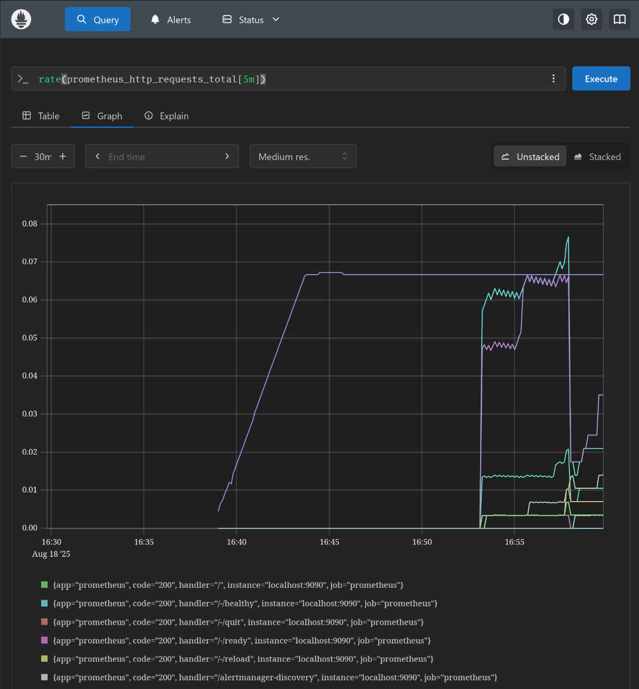

##### 仪表盘(Gauge)

Gauge表示一个可以任意增减的单一数值。仪表盘通常侧重于反应系统的当前状态，如温度或当前内存使用量，但也可以用于可以增减的“计数”，如并发请求数。

常见指标如：node_memory_MemFree_bytes（主机当前空闲的物理内存大小）、`node_memory_MemAvailable_bytes`（可用内存大小）都是Gauge类型的监控指标。

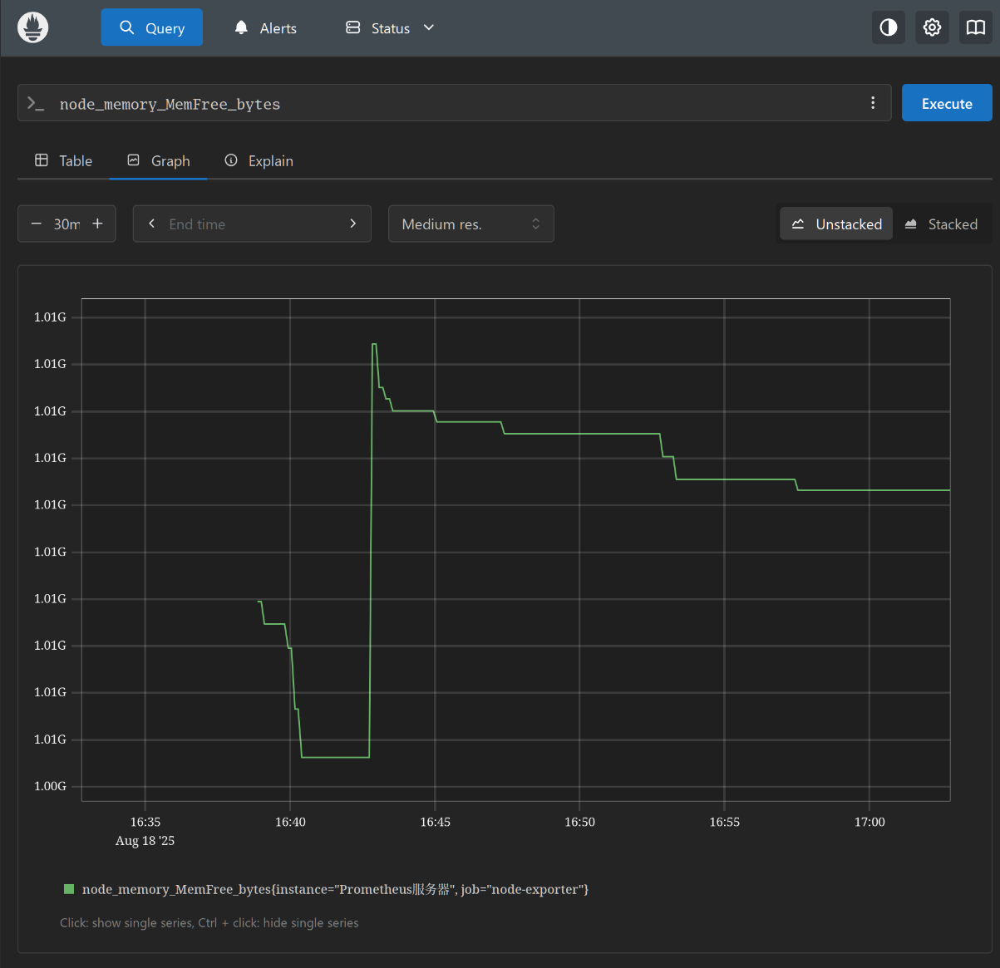

##### 直方图(Histogram)

Histogram和Summary主用用于统计和分析样本的分布情况。

Histogram 由

- `[basename]_bucket{le=“上边界”}`, 这个值为小于等于上边界的所有采样点数量
- `[basename]_sum`,所有观测值的总和
- `[basename]_coun`,所有观测值的总个数

组成,主要用于表示一段时间范围内对数据进行采样（通常是请求持续时间或响应大小），并能够对其指定区间以及总数进行统计，通常它采集的数据展示为直方图。

##### 摘要/分位图(Summar)

Summary 和 Histogram 类似，由 

- `<basename>{quantile="<φ>"}`

- `<basename>_sum`

- `<basename>_count `

组成，主要用于表示一段时间内数据采样结果（通常是请求持续时间或响应大小），它直接存储了 quantile 数据，而不是根据统计区间计算出来的

> Histogram通过histogram_quantile函数是在服务器端计算的分位数。 而Sumamry的分位数则是直接在客户端计算完成。因此对于分位数的计算而言，Summary在通过PromQL进行查询时有更好的性能表现，而Histogram则会消耗更多的资源。反之对于客户端而言Histogram消耗的资源更少。在选择这两种方式时用户应该按照自己的实际场景进行选择。
>
> 如果比较清楚要观测的指标的范围和分布情况，选择histograms。如果需要精确的分位数选择summary。

### 任务(job)和实例(instance)

在 Prometheus 中：

- **实例（Instance）**：
   任意一个被采集的目标（target），通常是一个能通过 HTTP 暴露监控指标的服务（例如 `node-exporter:9100`）。每一个实例通常对应一个 IP:Port。
- **任务（Job）**：
   一组具有相同采集目的的实例集合。例如同一组机器上的 Node Exporter，可以定义为一个 `node-exporter` 任务。

比如我们有两台机器都运行了 Node Exporter：

- `192.168.11.61:9100`
- `192.168.11.62:9100`

在 Prometheus 配置文件 `prometheus.yml` 中，可以这样写：

```
scrape_configs:
  - job_name: 'prometheus'
    static_configs:
      - targets: ['prometheus:9090']

  - job_name: 'alertmanager'
    static_configs:
      - targets: ['alertmanager:9093']

  - job_name: 'node-exporter'
    static_configs:
      - targets:
        - 192.168.11.61:9100
        - 192.168.11.62:9100

```

Prometheus 会自动为每个采集目标加上 **job** 和 **instance** 这两个标签：

```
# 可以通过内置的 up 指标（表示实例是否存活）来验证：
up{job="node-exporter"}

# 返回结果类似:
up{instance="192.168.11.61:9100", job="node-exporter"}  1
up{instance="192.168.11.62:9100", job="node-exporter"}  1
```

### Exporter

所有可以向Prometheus提供监控样本数据的程序都可以被称为一个Exporter。而Exporter的一个实例称为target，如下所示，Prometheus通过轮询的方式定期从这些target中获取样本数据:


> 注：安装好Exporter后会暴露一个`http://ip:端口/metrics`的HTTP服务，通过Prometheus添加配置`- targets: ['node_exporter:9100']`（默认会加上/metrics），Prometheus就可以采集到这个`http://ip:端口/metrics`里面所有监控样本数据

来源:

- 社区提供( https://prometheus.io/docs/instrumenting/exporters/ )
- 用户自定义,用户可以基于Prometheus提供的Client Library创建自己的Exporter程序

类型:

- 直接采集型:
  这类Exporter直接内置了相应的应用程序，用于向Prometheus直接提供Target数据支持。这样设计的好处是，可以更好地监控各自系统的内部运行状态，同时也适合更多自定义监控指标的项目实施。例如cAdvisor、Kubernetes等，它们均内置了用于向Prometheus提供监控数据的端点。
- 间接采集型:
  原始监控目标并不直接支持Prometheus，需要我们使用Prometheus提供的Client Library编写该监控目标的监控采集程序，用户可以将该程序独立运行，去获取指定的各类监控数据值。例如，由于Linux操作系统自身并不能直接支持Prometheus，用户无法从操作系统层面上直接提供对Prometheus的支持，因此单独安装Node exporter，还有数据库或网站HTTP应用类等Exporter。

规范:

所有的Exporter程序都需要按照Prometheus的规范，返回监控的样本数据。以Node Exporter为例，当访问http://192.168.11.61:9100/metrics地址时会返回以下内容：

```
# HELP go_gc_duration_seconds A summary of the wall-time pause (stop-the-world) duration in garbage collection cycles.
# TYPE go_gc_duration_seconds summary
go_gc_duration_seconds{quantile="0"} 3.0579e-05
go_gc_duration_seconds{quantile="0.25"} 5.136e-05
go_gc_duration_seconds{quantile="0.5"} 6.1579e-05

# HELP node_cpu_seconds_total Seconds the CPUs spent in each mode.
# TYPE node_cpu_seconds_total counter
node_cpu_seconds_total{cpu="0",mode="idle"} 4910.24
```

以#开始的行通常都是注释内容。这些样本数据集合说明如下：

- 以`#HELP`开始的行，表示metric的帮助与说明注释，可以包含当前监控指标名称和对应的说明信息。

- 以`#TYPE`开始的行，表示定义metric类型，可以包含当前监控指标名称和类型，类型有Counter、Gauge、Histogram、Summary和Untyped。

- 非`#`开头的行，就是监控样本数据

样本数据规范:

```
metric_name [
  "{" label_name "=" `"` label_value `"` { "," label_name "=" `"` label_value `"` } [ "," ] "}"
] value [ timestamp ]
```

其中metric_name和label_name必须遵循PromQL的格式规范要求:

- value是一个float格式的数据，timestamp的类型为int64（从1970-01-01 00:00:00以来的毫秒数），
- timestamp为可选,默认为当前时间。
- 具有相同metric_name的样本必须按照一个组的形式排列，并且每一行必须是唯一的指标名称和标签键值对组合。

## 安装

## 监控

监控流程:

- 在被监控的机器上安装XX_exporter来收集数据
- 在prometheus server上添加配置,去收集某个exporter的数据
- 添加触发器(告警规则)
- Grafana添加dashboard,图形展示数据

### 监控linux

| 主机名     | IP地址         |
| ---------- | -------------- |
| prometheus | 192.168.163.10 |
| test       | 192.168.163.11 |

test虚拟机:

安装node_exporter:

```
su -

wget https://github.com/prometheus/node_exporter/releases/download/v1.9.1/node_exporter-1.9.1.linux-amd64.tar.gz

tar xzf node_exporter-1.9.1.linux-amd64.tar.gz 

mkdir -p /opt/prometheus/node_exporter
mv node_exporter-1.9.1.linux-amd64/* /opt/prometheus/node_exporter

# 创建用户
useradd -M -s /usr/sbin/nologin prometheus

# 创建systemd服务
cat > /etc/systemd/system/node_exporter.service <<"EOF"
[Unit]
Description=node_exporter
Documentation=https://prometheus.io/
After=network.target
[Service]
User=prometheus
Group=prometheus
ExecStart=/opt/prometheus/node_exporter/node_exporter
Restart=on-failure
[Install]
WantedBy=multi-user.target
EOF

# 启动node_exporter
systemctl daemon-reload
systemctl enable --now node_exporter.service 
systemctl status node_exporter.service
```

安装`node_exporter`之后会启动一个web服务,提供一个`metrics`页面,显示监控的指标

地址:`http://192.168.163.11:9100/metrics`

prometheus服务器:

编辑`/opt/prometheus/prometheus/prometheus.yml`:

```
  # node_exporter config
  - job_name: 'node-exporter'
    scrape_interval: 15s
    static_configs:
    - targets: ['localhost:9100']
      labels:
        instance: Prometheus服务器
    # 监控linux的实例
    - targets: ['192.168.163.11:9100']
      labels:
        instance: test服务器
```

随后重启prometheus服务(二选一):

- `sudo systemctl restart prometheus.service`
- `curl -X POST http://localhost:9090/-/reload`

可以在服务器的targets中查看:

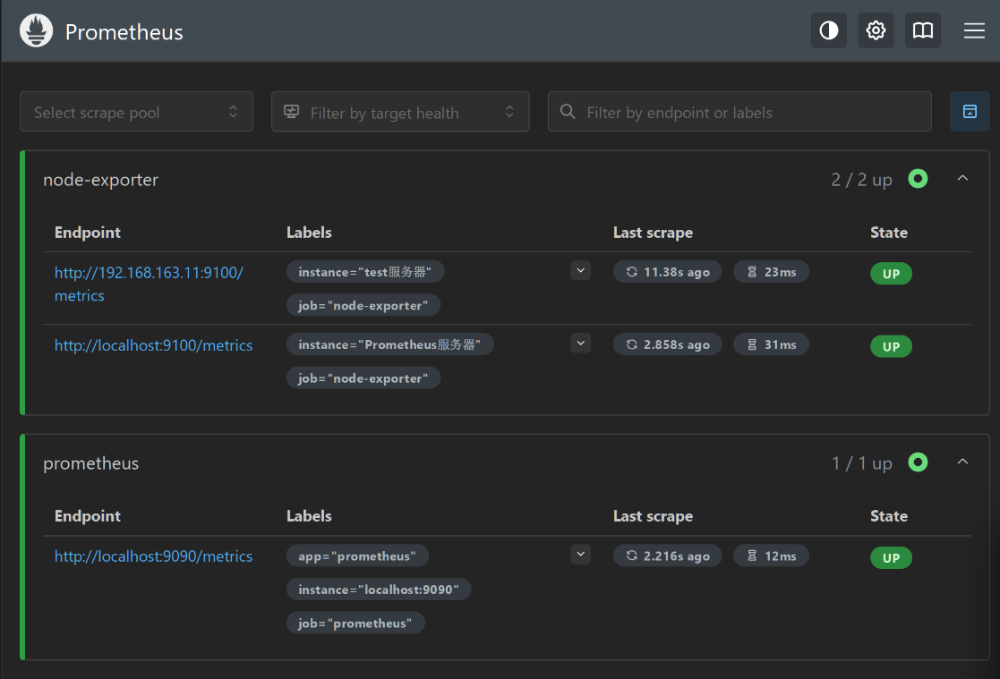

在prometheus服务器中新建几个触发器:

```
sudo vim /opt/prometheus/prometheus/alert.yml

# 追加:
- name: node-exporter
  rules:
  - alert: HostOutOfMemory
    expr: node_memory_MemAvailable_bytes / node_memory_MemTotal_bytes * 100 < 10
    for: 2m
    labels:
      severity: warning
    annotations:
      summary: "主机内存不足,实例:{{ $labels.instance }}"
      description: "内存可用率<10%，当前值：{{ $value }}"
  - alert: HostMemoryUnderMemoryPressure
    expr: rate(node_vmstat_pgmajfault[1m]) > 1000
    for: 2m
    labels:
      severity: warning
    annotations:
      summary: "内存压力不足,实例:{{ $labels.instance }}"
      description: "节点内存压力大。 重大页面错误率高，当前值为：{{ $value }}"
  - alert: HostUnusualNetworkThroughputIn
    expr: sum by (instance) (rate(node_network_receive_bytes_total[2m])) / 1024 / 1024 > 100
    for: 5m
    labels:
      severity: warning
    annotations:
      summary: "异常流入网络吞吐量,实例:{{ $labels.instance }}"
      description: "网络流入流量 > 100 MB/s，当前值：{{ $value }}"
  - alert: HostUnusualNetworkThroughputOut
    expr: sum by (instance) (rate(node_network_transmit_bytes_total[2m])) / 1024 / 1024 > 100
    for: 5m
    labels:
      severity: warning
    annotations:
      summary: "异常流出网络吞吐量，实例:{{ $labels.instance }}"
      description: "网络流出流量 > 100 MB/s，当前值为：{{ $value }}"
  - alert: HostUnusualDiskReadRate
    expr: sum by (instance) (rate(node_disk_read_bytes_total[2m])) / 1024 / 1024 > 50
    for: 5m
    labels:
      severity: warning
    annotations:
      summary: "异常磁盘读取,实例:{{ $labels.instance }}"
      description: "磁盘读取> 50 MB/s，当前值：{{ $value }}"
  - alert: HostUnusualDiskWriteRate
    expr: sum by (instance) (rate(node_disk_written_bytes_total[2m])) / 1024 / 1024 > 50
    for: 2m
    labels:
      severity: warning
    annotations:
      summary: "异常磁盘写入,实例:{{ $labels.instance }}"
      description: "磁盘写入> 50 MB/s，当前值：{{ $value }}"
  - alert: HostOutOfDiskSpace
    expr: (node_filesystem_avail_bytes * 100) / node_filesystem_size_bytes < 10 and ON (instance, device, mountpoint) node_filesystem_readonly == 0
    for: 2m
    labels:
      severity: warning
    annotations:
      summary: "磁盘空间不足告警,实例:{{ $labels.instance }}"
      description: "剩余磁盘空间< 10% ，当前值：{{ $value }}"
  - alert: HostDiskWillFillIn24Hours
    expr: (node_filesystem_avail_bytes * 100) / node_filesystem_size_bytes < 10 and ON (instance, device, mountpoint) predict_linear(node_filesystem_avail_bytes{fstype!~"tmpfs"}[1h], 24 * 3600) < 0 and ON (instance, device, mountpoint) node_filesystem_readonly == 0
    for: 2m
    labels:
      severity: warning
    annotations:
      summary: "磁盘空间将在24小时内耗尽,实例:{{ $labels.instance }}"
      description: "以当前写入速率预计磁盘空间将在 24 小时内耗尽，当前值：{{ $value }}"
  - alert: HostOutOfInodes
    expr: node_filesystem_files_free{mountpoint ="/"} / node_filesystem_files{mountpoint="/"} * 100 < 10 and ON (instance, device, mountpoint) node_filesystem_readonly{mountpoint="/"} == 0
    for: 2m
    labels:
      severity: warning
    annotations:
      summary: "磁盘Inodes不足,实例:{{ $labels.instance }}"
      description: "剩余磁盘 inodes < 10%，当前值： {{ $value }}"
  - alert: HostUnusualDiskReadLatency
    expr: rate(node_disk_read_time_seconds_total[1m]) / rate(node_disk_reads_completed_total[1m]) > 0.1 and rate(node_disk_reads_completed_total[1m]) > 0
    for: 2m
    labels:
      severity: warning
    annotations:
      summary: "异常磁盘读取延迟,实例:{{ $labels.instance }}"
      description: "磁盘读取延迟 > 100ms，当前值：{{ $value }}"
  - alert: HostUnusualDiskWriteLatency
    expr: rate(node_disk_write_time_seconds_total[1m]) / rate(node_disk_writes_completed_total[1m]) > 0.1 and rate(node_disk_writes_completed_total[1m]) > 0
    for: 2m
    labels:
      severity: warning
    annotations:
      summary: "异常磁盘写入延迟,实例:{{ $labels.instance }}"
      description: "磁盘写入延迟 > 100ms，当前值：{{ $value }}"
  - alert: high_load 
    expr: node_load1 > 4
    for: 2m
    labels:
      severity: page
    annotations:
      summary: "CPU1分钟负载过高,实例:{{ $labels.instance }}"
      description: "CPU1分钟负载>4，已经持续2分钟。当前值为：{{ $value }}"
  - alert: HostCpuIsUnderUtilized
    expr: 100 - (avg by(instance) (rate(node_cpu_seconds_total{mode="idle"}[2m])) * 100) > 80
    for: 1m
    labels:
      severity: warning
    annotations:
      summary: "cpu负载高,实例:{{ $labels.instance }}"
      description: "cpu负载> 80%，当前值：{{ $value }}"
  - alert: HostCpuStealNoisyNeighbor
    expr: avg by(instance) (rate(node_cpu_seconds_total{mode="steal"}[5m])) * 100 > 10
    for: 0m
    labels:
      severity: warning
    annotations:
      summary: "CPU窃取率异常,实例:{{ $labels.instance }}"
      description: "CPU 窃取率 > 10%。 嘈杂的邻居正在扼杀 VM 性能，或者 Spot 实例可能失去信用，当前值：{{ $value }}"
  - alert: HostSwapIsFillingUp
    expr: (1 - (node_memory_SwapFree_bytes / node_memory_SwapTotal_bytes)) * 100 > 80
    for: 2m
    labels:
      severity: warning
    annotations:
      summary: "磁盘swap空间使用率异常,实例:{{ $labels.instance }}"
      description: "磁盘swap空间使用率>80%"
  - alert: HostNetworkReceiveErrors
    expr: rate(node_network_receive_errs_total[2m]) / rate(node_network_receive_packets_total[2m]) > 0.01
    for: 2m
    labels:
      severity: warning
    annotations:
      summary: "异常网络接收错误,实例:{{ $labels.instance }}"
      description: "网卡{{ $labels.device }}在过去2分钟接收错误率大于0.01，当前值:{{ $value }}"
  - alert: HostNetworkTransmitErrors
    expr: rate(node_network_transmit_errs_total[2m]) / rate(node_network_transmit_packets_total[2m]) > 0.01
    for: 2m
    labels:
      severity: warning
    annotations:
      summary: "异常网络传输错误,实例:{{ $labels.instance }}"
      description: "网卡{{ $labels.device }}在过去2分钟传输错误率大于0.01，当前值:{{ $value }}"
  - alert: HostNetworkInterfaceSaturated
    expr: (rate(node_network_receive_bytes_total{device!~"^tap.*"}[1m]) + rate(node_network_transmit_bytes_total{device!~"^tap.*"}[1m])) / node_network_speed_bytes{device!~"^tap.*"} > 0.8 < 10000
    for: 1m
    labels:
      severity: warning
    annotations:
      summary: "异常网络接口饱和,实例:{{ $labels.instance }}"
      description: "网卡{{ $labels.device }}正在超载，当前值{{ $value }}"
  - alert: HostConntrackLimit
    expr: node_nf_conntrack_entries / node_nf_conntrack_entries_limit > 0.8
    for: 5m
    labels:
      severity: warning
    annotations:
      summary: "异常连接数,实例:{{ $labels.instance }}"
      description: "连接数过大，当前连接数：{{ $value }}"
  - alert: HostClockSkew
    expr: (node_timex_offset_seconds > 0.05 and deriv(node_timex_offset_seconds[5m]) >= 0) or (node_timex_offset_seconds < -0.05 and deriv(node_timex_offset_seconds[5m]) <= 0)
    for: 2m
    labels:
      severity: warning
    annotations:
      summary: "异常时钟偏差,实例:{{ $labels.instance }}"
      description: "检测到时钟偏差，时钟不同步。值为：{{ $value }}"
  - alert: HostClockNotSynchronising
    expr: min_over_time(node_timex_sync_status[1m]) == 0 and node_timex_maxerror_seconds >= 16
    for: 2m
    labels:
      severity: warning
    annotations:
      summary: "时钟不同步,实例:{{ $labels.instance }}"
      description: "时钟不同步"
  - alert: NodeFileDescriptorLimit
    expr: node_filefd_allocated / node_filefd_maximum * 100 > 80
    for: 1m
    labels:
      severity: warning
    annotations:
      summary: "预计内核将很快耗尽文件描述符限制"
      description: "{{ $labels.instance }}｝已分配的文件描述符数超过了限制的80%，当前值为：{{ $value }}"
```

检查配置:

```
sudo /opt/prometheus/prometheus/promtool check config /opt/prometheus/prometheus/prometheus.yml 

Checking /opt/prometheus/prometheus/prometheus.yml
  SUCCESS: 1 rule files found
 SUCCESS: /opt/prometheus/prometheus/prometheus.yml is valid prometheus config file syntax

Checking /opt/prometheus/prometheus/alert.yml
  SUCCESS: 23 rules found
```

重新加载配置后检查:

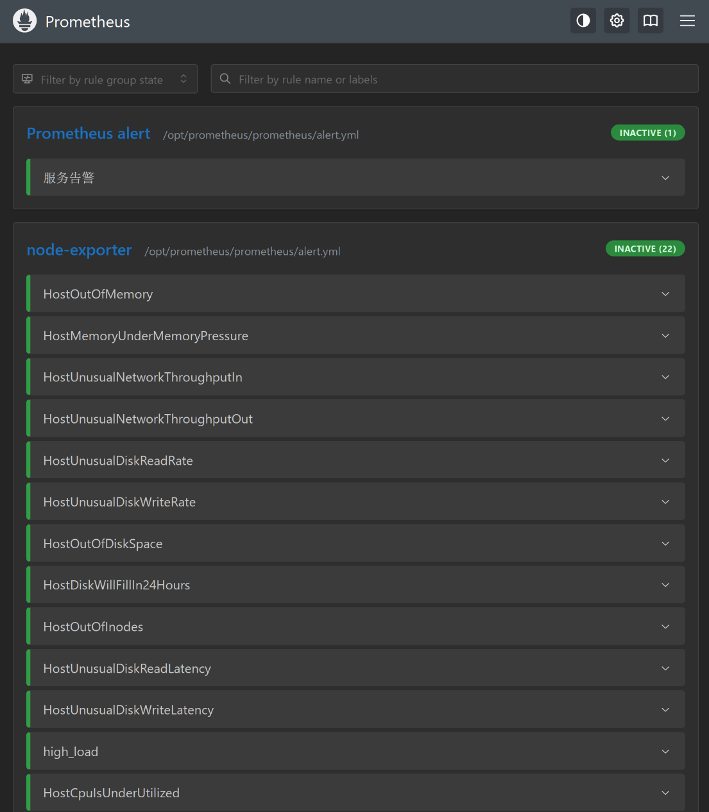

在grafana上展示数据:

由于在安装prometheus时，已经在grafana上添加prometheus的数据源，并倒入过id为`1860`的模版,此时重启grafana后切换Nodename即可:

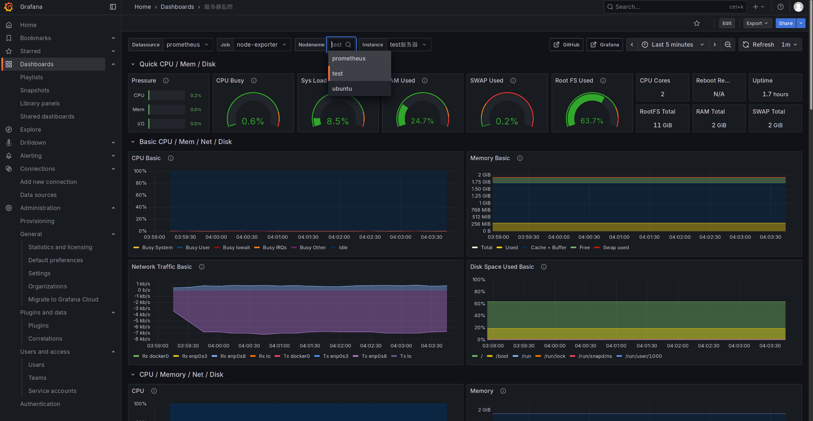

### 监控nginx

安装nginx

```
sudo apt install nginx
```

监控nginx需要`with-http_stub_status_module`,检查一下该模块是否安装:

```
newuser@test:~$ nginx -V 2>&1 | grep -o with-http_stub_status_module 
with-http_stub_status_module
```

开启stub_status:

```
location /stub_status {
        stub_status on;
        access_log off;

        #allow nginx_export's IP
        allow 0.0.0.0/0;
        deny all;
}
```

测试一下:

```
curl http://127.0.0.1/stub_status

Active connections: 1 
server accepts handled requests
 1 1 1 
Reading: 0 Writing: 1 Waiting: 0 

# 参数:
Active connections -- 活动连接数
accepts -- 接收请求数
handled -- 成功处理请求数
requests -- 总请求数
reding -- 正在进行读操作的请求数
writing -- 正在进行写操作的请求数
waiting -- 正在等待的请求数
```

下载二进制文件并放入/opt目录:

```
wget https://github.com/nginxinc/nginx-prometheus-exporter/releases/download/v0.11.0/nginx-prometheus-exporter_0.11.0_linux_amd64.tar.gz

sudo mkdir /opt/prometheus/nginx_exporter -p

ls -l /opt/prometheus/nginx_exporter
```

```
# 创建用户
useradd -M -s /usr/sbin/nologin prometheus
# 更改exporter文件夹权限
chown prometheus:prometheus -R /opt/prometheus

# 创建systemd服务
cat > /etc/systemd/system/nginx_exporter.service <<"EOF"
[Unit]
Description=nginx-prometheus-exporter
After=network.target

[Service]
Type=simple
User=prometheus
Group=prometheus
Restart=always
ExecStart=/opt/prometheus/nginx_exporter/nginx-prometheus-exporter -nginx.scrape-uri=http://localhost/stub_status

[Install]
WantedBy=multi-user.target
EOF

# 启动
sudo systemctl enable --now nginx_exporter.service 
sudo systemctl status nginx_exporter.service 
```

`-nginx.scrape-uri`参数表示nginx stub_status的地址

安装好Exporter后会暴露一个`http://ip:端口/metrics`的HTTP服务

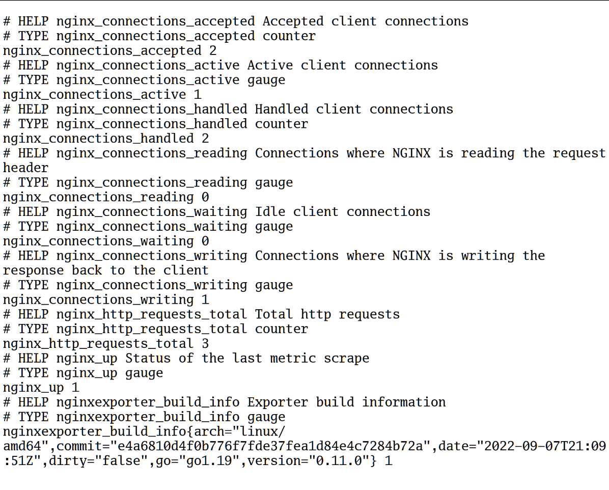

在prometheus server中修改配置文件,添加一个job:

```
sudo vim /opt/prometheus/prometheus/prometheus.yml

  # nginx_exporter config
      - job_name: 'nginx-exporter'
        scrape_interval: 15s
        static_configs:
        - targets: ['192.168.163.11:9113']
          labels:
            instance: Nginx服务器
```

常用的指标:

```
nginx_connections_accepted  接收请求数
nginx_connections_active    活动连接数
nginx_connections_handled   成功处理请求数
nginx_connections_reding    正在进行读操作的请求数
nginx_connections_waiting   正在等待的请求数
nginx_connections_writing   正在进行写操作的请求数
nginx_connections_requests  总请求数
```

添加一个触发器:

```
cat >>alert.yml <<"EOF"
- name: nginx
  rules:
  # 对任何实例超过30秒无法联系的情况发出警报
  - alert: NginxDown
    expr: nginx_up == 0
    for: 30s
    labels:
      severity: critical
    annotations:
      summary: "nginx异常,实例:{{ $labels.instance }}"
      description: "{{ $labels.job }} nginx已关闭"
EOF
```

可以使用[nginx dashboard](https://grafana.com/grafana/dashboards/12708-nginx/)通过grafana展示prometheus从nginx_exporter收集到的的数据

### 监控redis

使用[redis_exporter](https://github.com/oliver006/redis_exporter/releases)

### 监控rabbitmq

使用[rabbitmq_exporter](https://github.com/kbudde/rabbitmq_exporter/releases)

### 监控mongodb

使用[mongodb_exporter](https://github.com/percona/mongodb_exporter/releases)

### 监控docker

使用[CAdvisor](https://github.com/google/cadvisor)

CAdvisor是Google开源的一款用于展示和分析容器运行状态的可视化工具。通过在主机上运行CAdvisor用户可以轻松的获取到当前主机上容器的运行统计信息，并以图表的形式向用户展示。

docker命令安装:

```
docker run -d \
  --restart=always \
  --volume=/:/rootfs:ro \
  --volume=/var/run:/var/run:rw \
  --volume=/sys:/sys:ro \
  --volume=/var/lib/docker/:/var/lib/docker:ro \
  --publish=8080:8080 \
  --name=cadvisor \
  gcr.io/cadvisor/cadvisor:v0.47.2
```

通过访问http://localhost:8080可以查看，当前主机上容器的运行状态，访问http://localhost:8080/metrics即可获取到标准的Prometheus监控样本输出,然后配置prometheus server监控即可

### 进程监控

如果想要对主机的进程进行监控，例如chronyd，sshd等服务进程以及自定义脚本程序运行状态监控。我们使用node exporter就不能实现需求了，此时就需要使用process exporter来做进程状态的监控。

项目地址：https://github.com/ncabatoff/process-exporter

```
wget https://github.com/ncabatoff/process-exporter/releases/download/v0.7.10/process-exporter-0.7.10.linux-amd64.tar.gz

tar zxvf process-exporter-0.7.10.linux-amd64.tar.gz

mkdir /opt/prometheus -p


mv process-exporter-0.7.10.linux-amd64 /opt/prometheus/process_exporter

ls -l /opt/prometheus/process_exporter

useradd -M -s /usr/sbin/nologin prometheus

chown prometheus:prometheus -R /opt/prometheus
```

创建配置文件

```
cat >>/opt/prometheus/process_exporter/process.yml<<"EOF"
process_names:
  - name: "{{.Comm}}"  # 匹配模板
    cmdline:
    - '.+'   # 匹配名称
EOF
```

创建systemd服务

```
cat <<"EOF" >/etc/systemd/system/process_exporter.service
[Unit]
Description=process_exporter
After=network.target

[Service]
Type=simple
User=prometheus
Group=prometheus
ExecStart=/opt/prometheus/process_exporter/process-exporter -config.path=/opt/prometheus/process_exporter/process.yml
Restart=on-failure

[Install]
WantedBy=multi-user.target
EOF
```

启动

```
systemctl daemon-reload
systemctl enable --now process_exporter
systemctl status process_exporter
```

prometheus server设置

```
cat >> /opt/prometheus/prometheus/prometheus.yml <<"EOF"
  - job_name: 'process'
    scrape_interval: 30s
    scrape_timeout: 15s
    static_configs:
    - targets: ['192.168.163.11:9256']
EOF
```

指标说明:

```
namedprocess_

namedprocess_namegroup_states{state="Zombie"} 查看僵尸


# 上下文切换数量
# Counter
namedprocess_namegroup_context_switches_total


# CPU user/system 时间（秒）
# Counter
namedprocess_namegroup_cpu_seconds_total


# 主要页缺失次数
# Counter
namedprocess_namegroup_major_page_faults_total


# 次要页缺失次数
# Counter
namedprocess_namegroup_minor_page_faults_total


# 内存占用（byte）
# Gauge
namedprocess_namegroup_memory_bytes


# 同名进程数量
# Gauge
namedprocess_namegroup_num_procs

# 同名进程状态分布
# Gauge
namedprocess_namegroup_states


# 线程数量
# Gauge
namedprocess_namegroup_num_threads


# 启动时间戳
# Gauge
namedprocess_namegroup_oldest_start_time_seconds


# 打开文件描述符数量
# Gauge
namedprocess_namegroup_open_filedesc


# 打开文件数 / 允许打开文件数
# Gauge
namedprocess_namegroup_worst_fd_ratio


# 读数据量（byte）
# Counter
namedprocess_namegroup_read_bytes_total


# 写数据量（byte）
# Counter
namedprocess_namegroup_write_bytes_total


# 内核wchan等待线程数量
# Gauge
namedprocess_namegroup_threads_wchan
```

### 黑盒监控

"白盒监控"--需要把对应的Exporter程序安装到被监控的目标主机上，从而实现对主机各种资源及其状态的数据采集工作。

但是由于某些情况下操作技术或其他原因，不是所有的Exporter都能部署到被监控的主机环境中，最典型的例子是监控全国网络质量的稳定性，通常的方法是使用ping操作，对选取的节点进行ICMP测试，此时不可能在他人应用环境中部署相关的Exporter程序。针对这样的应用的场景，Prometheus社区提供了黑盒解决方案，Blackbox Exporter无须安装在被监控的目标环境中，用户只需要将其安装在与Prometheus和被监控目标互通的环境中，通过HTTP、HTTPS、DNS、TCP、ICMP等方式对网络进行探测监控，还可以探测SSL证书过期时间。

**blackbox_exporter**是Prometheus 官方提供的 exporter 之一，可以提供 http、dns、tcp、icmp 的监控数据采集

### 域名过期监控

使用[domain_exporter](https://github.com/caarlos0/domain_exporter/releases)

### 告警

```
rule_files:
  # - "first_rules.yml"
  # - "second_rules.yml"
  - "alert.yml"
  - "rules/*.yml"
```

这样配置后可以将不同的监控项目分成不同的文件

## Pushgateway

**监控**部分提到的监控方法使用的是Prometheus的**拉取(pull)模型**,Pushgateway是一个中间服务,允许监控无法被抓取的组件

Pushgateway允许将时间序列**推送**到Prometheus可以抓取的一个中间作业

Pushgateway的存在是为了允许临时和批处理作业向Prometheus暴露其指标。由于这些类型的任务可能存在的时间不够长而无法被抓取，因此他们可以将指标推送到 Pushgateway，然后 Pushgateway将这些指标暴露给Prometheus。

有一点我们需要明白的是Pushgateway不是将指标主动push给Prometheus，而是通过脚本将指标数据主动**push**给Pushgateway后，Prometheus仍然通过pull模式去抓取指标。

使用它的原因:

- Prometheus 采用 pull 模式，可能由于不在一个子网或者防火墙原因，导致 Prometheus 无法直接拉取各个 target 数据。

- 在监控业务数据的时候，需要将不同数据汇总, 由 Prometheus 统一收集。

- 当exporter不能满足需要时，也可以通过自定义（python、shell、java）监控我们想要的数据。

### 陷阱

**仅在某些有限的情况下才推荐使用 Pushgateway。** 在常规指标收集时，盲目使用 Pushgateway 而非 Prometheus 常见的拉取（pull）模型会带来几个陷阱

- 将多个节点数据汇总到 pushgateway, 如果 pushgateway 挂了，受影响比多个 target 大。
- Prometheus 通过 `up` 指标（每次抓取时生成）进行的自动实例健康监控将仅对pushgateway有效,而对每个节点失效。
- Pushgateway 会一直保留所有接收到的数据，并将它们永久暴露给 Prometheus，除非这些序列通过 Pushgateway 的 API 手动删除。

因此，当一个实例消失时，pushgateway还会保存旧的监控数据，需要手动清理陈旧的数据。

> 对于与机器相关的批处理作业（例如自动安全更新 cronjob 或配置管理客户端运行），请使用Node Exporter的 [textfile 收集器](https://github.com/prometheus/node_exporter#textfile-collector)而不是 Pushgateway 来暴露生成的指标。

### 部署

```
wget https://github.com/prometheus/pushgateway/releases/download/v1.5.1/pushgateway-1.5.1.linux-amd64.tar.gz

tar xf pushgateway-1.5.1.linux-amd64.tar.gz

mv pushgateway-1.5.1.linux-amd64 /opt/pushgateway

chown prometheus:prometheus -R /opt/pushgateway
```

创建systemd服务

```
cat >/etc/systemd/system/pushgateway.service << "EOF"

[Unit]
Description=Prometheus Push Gateway
After=network.target

[Service]
Type=simple
User=prometheus
Group=prometheus
ExecStart=/opt/pushgateway/pushgateway
[Install]
WantedBy=multi-user.target
EOF
```

```
systemctl enable --now pushgateway.service
systemctl status pushgateway.service
```

pushgateway也会提供一个web服务:`http://192.168.163.11:9091/metrics`

### 推送

#### curl

可以使用curl手动推送指标:

```
echo "some_metric 3.14" | curl --data-binary @- http://192.168.163.11:9091/metrics/job/some_job
```

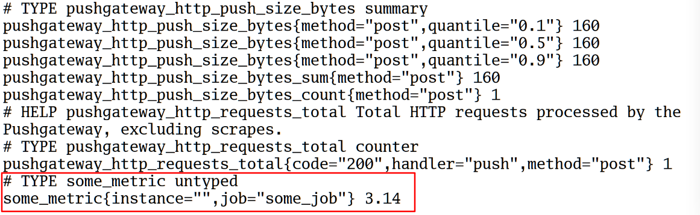

推送多条数据:

```
cat <<EOF | curl --data-binary @- http://192.168.163.11:9091/metrics/job/some_job/instance/some_instance
# TYPE second_metric counter
second_metric{label="val1"} 42
# TYPE another_metric gauge
# HELP another_metric Just an example.
another_metric 2398.283
EOF
```

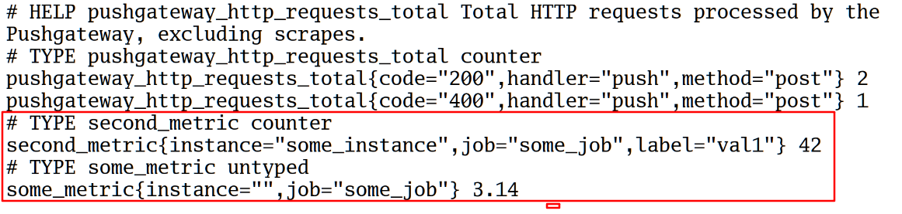

删除数据:

```
# 删除某个组下的所有数据
curl -X DELETE http://192.168.163.11:9091/metrics/job/some_job
# 删除某个组下的某实例的所有数据
 curl -X DELETE http://192.168.163.11:9091/metrics/job/some_job/instance/some_instance
```

#### python

还可以使用python的`prometheus_client`库推送:

```
from prometheus_client import CollectorRegistry, Gauge, push_to_gateway

registry = CollectorRegistry()
g = Gauge('job_last_success_unixtime', 'Last time a batch job successfully finished', registry=registry)
g.set_to_current_time()
push_to_gateway('localhost:9091', job='batchA', registry=registry)
```

### 需求

#### 监控data数据目录下的文件数量

shell:

```
cat >>/opt/file_num.sh<<"EOF"
#!/bin/sh
FILENUM=`ls -l /data |sed 1d| wc -l`
echo "data_file_num ${FILENUM}" | curl --data-binary @- http://192.168.163.11:9091/metrics/job/test_job/instance/test
EOF

# 定时任务
*/1 * * * * /bin/sh /opt/file_num.sh >/dev/null 2>&1
```

python:

```
cat >>/opt/file_num.py<<"EOF"
from prometheus_client import CollectorRegistry, Gauge, push_to_gateway
import os


path = '/data'               # 输入文件夹地址
files = os.listdir(path)   # 读入文件夹
num_png = len(files)         # 统计文件夹中的文件个数

registry = CollectorRegistry()
g = Gauge('python_data_file_num', 'data file num', ['instance'], registry=registry)
g.labels('test').set(num_png)
push_to_gateway('192.168.11.61:9091', job='test_job', registry=registry)
EOF

# 定时任务
*/1 * * * * /usr/bin/python3 /opt/file_num.py >/dev/null 2>&1
```

配置告警规则

```
cat >> /opt/prometheus/prometheus/rules/pushgateway.yml <<"EOF"
groups:
- name: pushgateway
  rules:
  - alert: DataFileNum
    expr: data_file_num > 5
    for: 0m
    labels:
      severity: warning
    annotations:
      summary: 'data数据目录文件数过多'
      description: "data数据目录文件数>5,当前数量:{{ $value }}"
EOF
```

## 服务发现

我们知道在 Prometheus 配置文件中可以通过一个 `static_configs` 来配置静态的抓取任务，但是在云环境下，特别是容器环境下，抓取目标地址是经常变动的，所以用静态的方式就不能满足这些场景了，还有特别在很多服务器需要监控时。所以我们需要监控系统能够动态感知这个变化，不可能每次变动都去手动重新配置的，为了应对复杂的动态环境，Prometheus 也提供了与基础设施中的**服务发现(service discovery)**集成的功能。

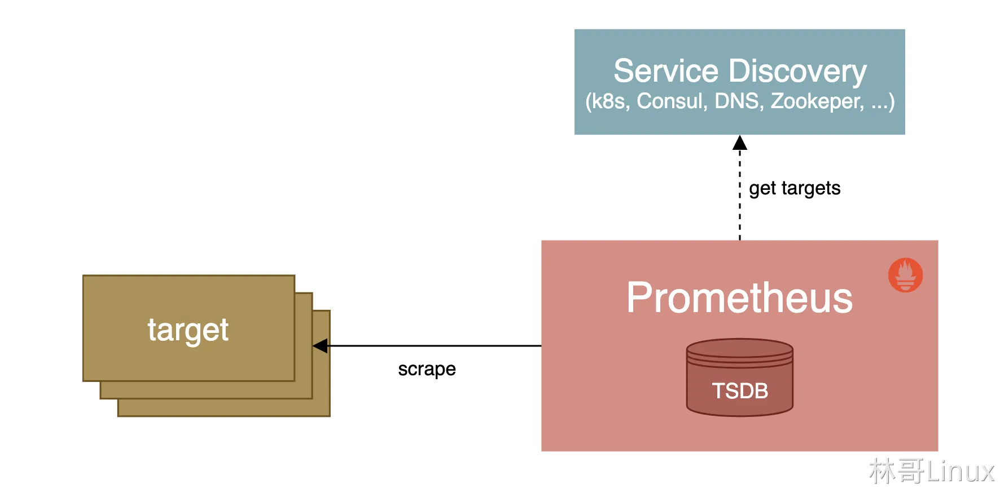

Prometheus 已经支持多种内置的服务发现机制：

- 发现云服务商的 VM 虚拟机

- Kubernetes 上的自动发现

- 通用的服务查找，例如 DNS、Consul、Zookeeper 或自定义发现机制

我们都可以通过 Prometheus 配置文件中的 `scrape_config` 部分进行配置，Prometheus 会不断更新动态的抓取目标列表，自动停止抓取旧的实例，开始抓取新的实例，Prometheus 特别适合运行于 Kubernetes 集群下面，可以自动发现监控目标。

此外大部分服务发现机制还会提供目标的一些元数据，通常都是带有 `__` 的前缀， 比如标签、注解、服务名等等，可以在 relabeling 阶段使用这些元数据来过滤修改目标，这些元信息标签在重新标记阶段后被删除。

### 基于文件的服务发现

除了基于 Consul 的服务发现之外，Prometheus 也允许我们进行自定义的发现集成，可以通过 watch 一组本地文件来获取抓取目标以及标签信息，也就是我们常说的基于文件的服务发现方式。


基于文件的服务发现允许在 JSON 文件中列出抓取目标（以及这些目标的元数据）。它读取一组包含零个或多个 `<static_config>` 列表的文件，对所有定义的文件的变更通过磁盘监视被检测到并立即应用，文件可以以 YAML 或 JSON 格式提供。文件必须包含一个静态配置的列表:

```
# JSON
[
  {
    "targets": [ "<host>", ... ],
    "labels": {
      "<labelname>": "<labelvalue>", ...
    }
  },
  ...
]

# YAML
- targets:
  [ - '<host>' ]
  labels:
    [ <labelname>: <labelvalue> ... ]
```

prometheus的配置文件如下:
```
# 搜刮配置
scrape_configs:
  - job_name: "file-sd-test"
    file_sd_configs:
    # 刷新并重新读取的时间
    - refresh_interval: 10s
      files:
      - "targets/targets.yml"
```

### 基于Consul的服务发现

[Consul](https://www.consul.io/) 是由 [HashiCorp](https://www.hashicorp.com/) 开发的一个支持多数据中心的分布式**服务发现**和**键值对存储**服务的开源软件，是一个通用的服务发现和注册中心工具，被大量应用于基于微服务的软件架构当中。

我们通过api将exporter服务注册到 Consul，然后配置 Prometheus 从 Consul 中发现实例。关于 Consul 本身的使用可以查看官方文档 https://learn.hashicorp.com/consul 了解更多。

安装consul:

```
wget https://releases.hashicorp.com/consul/1.14.5/consul_1.14.5_linux_amd64.zip

apt install unzip -y

unzip consul_1.14.5_linux_amd64.zip

mv consul /usr/local/bin

consul version
```

在dev模式下启动Consul,可以查看更多的信息:

```
# 启动命令后面使用 -client 参数指定了客户端绑定的 IP 地址，默认为 127.0.0.1
consul agent -dev -client 0.0.0.0
```

访问地址:

```
192.168.163.10:8500/ui/dc1/services
```

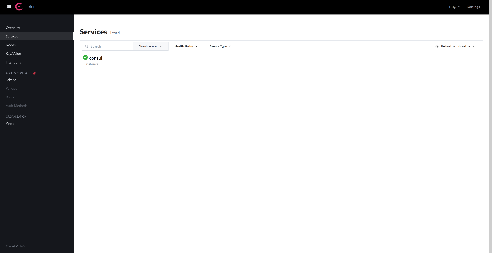

我们可以使用`curl`通过http请求注册到consul:

```
curl -X PUT -d '{"id": "node1","name": "node_exporter","address": "node_exporter","port": 9100,"tags": ["exporter"],"meta": {"job": "node_exporter","instance": "Prometheus服务器"},"checks": [{"http": "http://192.168.163.11:9100/metrics", "interval": "5s"}]}'  http://localhost:8500/v1/agent/service/register
```

也可以将信息保存到json文件中注册:

```
mkdir /data/consul

cat > /data/consul/node_exporter.json<<"EOF"
  {
    "id": "node2",
    "name": "node_exporter",
    "address": "192.168.163.11",
    "port": 9100,
    "tags": ["exporter"],
    "meta": {
      "job": "node_exporter",
      "instance": "test服务器"
    },
    "checks": [{
      "http": "http://192.168.163.11:9100/metrics",
      "interval": "10s"
    }]
  } 
EOF
```

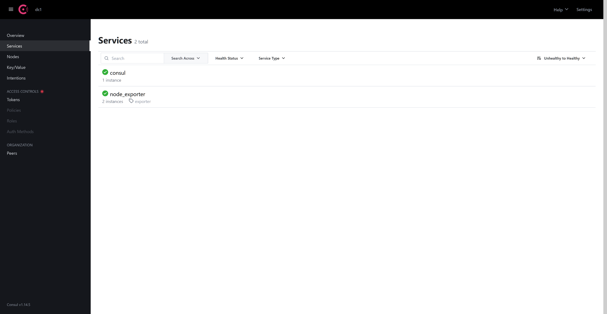

配置prometheus自动发现:

备份先前的配置文件后新建新的配置文件:

```
vim prometheus.yml   
# 全局配置
global:
  scrape_interval:     15s # 将搜刮间隔设置为每15秒一次。默认是每1分钟一次。
  evaluation_interval: 15s # 每15秒评估一次规则。默认是每1分钟一次。

# Alertmanager 配置
alerting:
  alertmanagers:
  - static_configs:
    - targets: ['alertmanager:9093']

# 报警(触发器)配置
rule_files:
  - "alert.yml"
  - "rules/*.yml"

# 搜刮配置
scrape_configs:
  - job_name: 'prometheus'
    # 覆盖全局默认值，每15秒从该作业中刮取一次目标
    scrape_interval: 15s
    static_configs:
    - targets: ['localhost:9090']
  - job_name: 'alertmanager'
    # 覆盖全局默认值，每15秒从该作业中刮取一次目标
    scrape_interval: 15s
    static_configs:
    - targets: ['localhost:9093']

  - job_name: 'consul_exporter'
    consul_sd_configs:
      - server: '192.168.163.10:8500'
        services: []
    relabel_configs:
      - source_labels: [__meta_consul_tags]
        regex: .*exporter.*
        action: keep
      - regex: __meta_consul_service_metadata_(.+)
        action: labelmap
#  Spring Boot 2.x 应用数据采集配置
  - job_name: 'consul_springboot_demo'
    metrics_path: '/actuator/prometheus'
    scrape_interval: 5s
    consul_sd_configs:
      - server: '192.168.163.10:8500'
        services: []
    relabel_configs:
      - source_labels: [__meta_consul_tags]
        regex: .*springboot.*
        action: keep
      - regex: __meta_consul_service_metadata_(.+)
        action: labelmap
```

使用shell脚本添加targer:

```
cat >/data/consul/addtarger.sh <<"EOF"
#nginx
curl -X PUT -d '{"id": "nginx1","name": "nginx_exporter","address": "192.168.163.11","port": 9113,"tag
s": ["exporter"],"meta": {"job": "nginx_exporter","instance": "test服务器","env":"test"},"checks": [{"ht
tp": "http://192.168.163.11:9113/metrics", "interval": "5s"}]}'  http://localhost:8500/v1/agent/service/
register
EOF
```

consul删除服务:

```
curl --request PUT http://127.0.0.1:8500/v1/agent/service/deregister/ID
```

示例:

```
# 查找服务的id:
curl http://127.0.0.1:8500/v1/agent/services | grep nginx

    "nginx1": {
        "ID": "nginx1",
        "Service": "nginx_exporter",
            "job": "nginx_exporter"

# 安装id删除
curl --request PUT http://127.0.0.1:8500/v1/agent/service/deregister/nginx1
```

## PromQL

PromQL (Prometheus Query Language) 是 Prometheus 自己开发的数据查询 DSL 语言，允许用户实时选择和聚合时间序列数据。

当你向 Prometheus 发送查询请求时，它可以是**瞬时查询**（在某个时间点评估），或者是**范围查询**（在起始时间和结束时间之间以等间隔的步长评估）。PromQL 在这两种情况下工作方式完全相同；范围查询就像是在不同时间戳多次运行的瞬时查询。

> 在 Prometheus 用户界面中，“Table”选项卡用于瞬时查询，“Graph”选项卡用于范围查询。
>
> 其他程序可以通过[HTTP API](https://prometheus.ac.cn/docs/prometheus/latest/querying/api/)获取 PromQL 表达式的结果。

### 数据类型

在Prometheus的表达式语言中，PromQL数据类型归类为以下四种：

- 瞬时向量（instant vector），是指同一时刻的一组时间序列，每个时间序列包含一个样本，所有样本共享相同的时间戳，即每个时序只有一个点。

- 区间向量（range vector），是指在任何一个时间范围内的一组时间序列，包含每个时间序列随时间变化的一系列数据点，这时每个时序有多个点。

- 标量（scalar），即纯量数据，一个简单的数字浮点值，只有一个数字，没有时序。

- 字符串（string），一个目前未被使用的简单字符串值。

瞬时向量(Instant vector)

在prometheus中查询`node_memory_Active_bytes`:

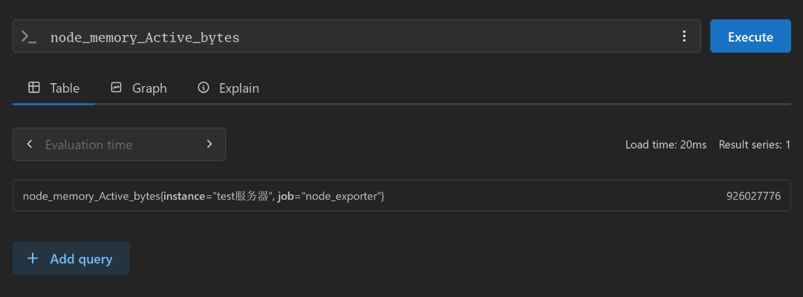

区间向量(Range vector)

查询`node_memory_Active_bytes[1m]`:

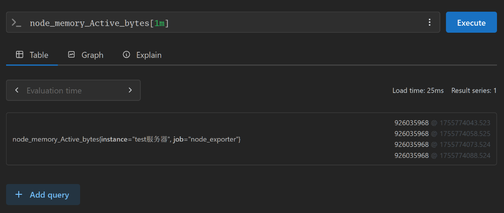

标量只有一个数字

### 时间序列过滤器

#### 瞬时向量选择器

瞬时向量选择器允许选择一组时间序列，以及在给定时间戳（时间点）下每个时间序列的单个样本值。最简单的形式是只指定一个指标名称，这将导致瞬时向量包含所有具有此指标名称的时间序列的元素。

返回的值将是查询评估时间戳（对于[瞬时查询](https://prometheus.ac.cn/docs/prometheus/latest/querying/api/#instant-queries)）或查询当前步骤（对于[范围查询](https://prometheus.ac.cn/docs/prometheus/latest/querying/api/#range-queries)）时或之前最近的样本值。[`@` 修饰符](https://prometheus.ac.cn/docs/prometheus/latest/querying/basics/#modifier)允许覆盖选择发生的时间戳。

此示例选择所有具有 `http_requests_total` 指标名称的时间序列，并返回每个序列的最新样本：

```
http_requests_total
```

可以通过在花括号（`{}`）中添加逗号分隔的标签匹配器列表来进一步过滤这些时间序列。

此示例仅选择具有 `http_requests_total` 指标名称，且 `job` 标签设置为 `prometheus` 并且 `group` 标签设置为 `canary` 的时间序列。

```
http_requests_total{job="prometheus",group="canary"}
```

也可以对标签值进行负匹配，或根据正则表达式匹配标签值。存在以下标签匹配运算符：

- `=`: 选择与提供的字符串完全相等的标签。
- `!=`: 选择与提供的字符串不相等的标签。
- `=~`: 选择与提供的字符串正则表达式匹配的标签。
- `!~`: 选择与提供的字符串正则表达式不匹配的标签。

正则表达式匹配是完全锚定的。 `env=~"foo"` 的匹配被视为 `env=~"^foo$"`。

> Prometheus 中的所有正则表达式都使用[RE2 语法](https://github.com/google/re2/wiki/Syntax)

例如，这会选择所有针对 `staging`、`testing` 和 `development` 环境以及除 `GET` 以外的 HTTP 方法的 `http_requests_total` 时间序列。

```
http_requests_total{environment=~"staging|testing|development",method!="GET"}
```

匹配空标签值的标签匹配器还会选择所有根本未设置特定标签的时间序列。

例如，给定数据集：

```
http_requests_total
http_requests_total{replica="rep-a"}
http_requests_total{replica="rep-b"}
http_requests_total{environment="development"}
```

查询 `http_requests_total{environment=""}` 将匹配并返回：

```
http_requests_total
http_requests_total{replica="rep-a"}
http_requests_total{replica="rep-b"}
```

并排除：

```
http_requests_total{environment="development"}
```

同一个标签名称可以使用多个匹配器；它们必须全部通过才能返回结果。

查询

```
http_requests_total{replica!="rep-a",replica=~"rep.*"}
```

则会匹配

```
http_requests_total{replica="rep-b"}
```

向量选择器必须指定一个名称，或者至少一个不匹配空字符串的标签匹配器。以下表达式是非法的：

```
{job=~".*"} # Bad!
```

相反，这些表达式是有效的，因为它们都有一个不匹配空标签值的选择器。

```
{job=~".+"}              # Good!
{job=~".*",method="get"} # Good!
```

标签匹配器也可以通过匹配内部的 `__name__` 标签应用于指标名称。例如，表达式 `http_requests_total` 等同于 `{__name__="http_requests_total"}`。除了 `=`（`!=`、`=~`、`!~`）之外的匹配器也可以使用。以下表达式选择所有名称以 `job:` 开头的指标：

```
{__name__=~"job:.*"}
```

指标名称不能是 `bool`、`on`、`ignoring`、`group_left` 和 `group_right` 这些关键字之一。以下表达式是非法的：

```
on{} # Bad!
```

解决此限制的方法是使用 `__name__` 标签：

```
{__name__="on"} # Good!
```

#### 范围向量选择器

范围向量字面量的工作方式与瞬时向量字面量类似，不同之处在于它们从当前瞬时时间点开始向后选择一个范围的样本。在语法上，在向量选择器末尾的方括号（`[]`）中附加一个[浮点字面量](https://prometheus.ac.cn/docs/prometheus/latest/querying/basics/#float-literals-and-time-durations)，以指定应为每个结果范围向量元素获取多少秒前的值。

通常，浮点字面量使用带有一个或多个时间单位的语法，例如 `[5m]`。该范围是一个左开右闭区间，即与范围左边界时间戳重合的样本被排除在选择之外，而与范围右边界时间戳重合的样本被包含在选择之中。

在此示例中，我们选择所有具有指标名称 `http_requests_total` 且 `job` 标签设置为 `prometheus` 的时间序列中，5 分钟前记录的所有值。

```
http_requests_total{job="prometheus"}[5m]
```

#### 偏移修饰符

`offset` 修饰符允许更改查询中单个即时向量和范围向量的时间偏移量。

例如，以下表达式返回 `http_requests_total` 相对于当前查询评估时间点，5 分钟前的值：

```
http_requests_total offset 5m
```

请注意，`offset` 修饰符必须紧跟在选择器之后，即以下写法是正确的：

```
sum(http_requests_total{method="GET"} offset 5m) // GOOD.
```

而以下写法是*不正确*的：

```
sum(http_requests_total{method="GET"}) offset 5m // INVALID.
```

同样，对于范围向量也适用。这会返回 `http_requests_total` 一周前的 5 分钟[速率](https://prometheus.ac.cn/docs/prometheus/latest/querying/functions/#rate)。

```
rate(http_requests_total[5m] offset 1w)
```

当查询过去样本时，负偏移量将启用时间上的向前比较。

```
rate(http_requests_total[5m] offset -1w)
```

请注意，这允许查询超出其评估时间向前看。

#### `@`修饰符

`@` 修饰符允许更改查询中单个即时向量和范围向量的评估时间。提供给 `@` 修饰符的时间是一个 Unix 时间戳，并用浮点字面量描述。

例如，以下表达式返回 `http_requests_total` 在 `2021-01-04T07:40:00+00:00` 的值：

```
http_requests_total @ 1609746000
```

请注意，`@` 修饰符必须紧跟在选择器之后，即以下写法是正确的：

```
sum(http_requests_total{method="GET"} @ 1609746000) // GOOD.
```

而以下写法是*不正确*的：

```
sum(http_requests_total{method="GET"}) @ 1609746000 // INVALID.
```

同样，对于范围向量也适用。这会返回 `http_requests_total` 在 `2021-01-04T07:40:00+00:00` 的 5 分钟速率。

```
rate(http_requests_total[5m] @ 1609746000)
```

`@` 修饰符支持上述所有数字字面量表示。它与 `offset` 修饰符一起使用时，偏移量是相对于 `@` 修饰符时间应用的。无论修饰符的顺序如何，结果都相同。

例如，以下两个查询将产生相同的结果：

```
# offset after @
http_requests_total @ 1609746000 offset 5m
# offset before @
http_requests_total offset 5m @ 1609746000
```

此外，`start()` 和 `end()` 也可以作为特殊值用于 `@` 修饰符。

对于范围查询，它们分别解析为范围查询的起始时间和结束时间，并且在所有步骤中保持不变。

对于即时查询，`start()` 和 `end()` 都解析为评估时间。

```
http_requests_total @ start()
rate(http_requests_total[5m] @ end())
```

请注意，`@` 修饰符允许查询超出其评估时间向前看。

#### 子查询

子查询允许你针对给定的范围和分辨率(步长)运行即时查询。子查询的结果是一个范围向量。

语法：`<instant_query> '[' <range> ':'  [<resolution>] ']' [ @ <float_literal> ] [ offset  <float_literal> ]`

- `<instant_query>`：一个返回**瞬时向量**的查询，例如 `rate(http_requests_total[5m])`。
- `<range>`：子查询回溯的时间范围，例如 `1h`。
- `<resolution>`（可选）：在子查询时间范围内执行 `<instant_query>` 的**步长**（或称为分辨率）。如果省略，默认为 Prometheus 的全局评估间隔（evaluation interval）。

例如我们想找出在**最近一小时内**，`/api/items` 路径的请求**每分钟速率**的最大值是多少:
```
max_over_time(
  rate(http_requests_total{job="web-api", path="/api/items"}[1m])[1h:1m]
)
```

计算一小时内的5分钟平均速率

```
avg_over_time( rate(http_requests_total[5m])[1h:] )
```

### 题目

#### web-api微服务集群

假设我们正在监控一个名为 `web-api` 的微服务集群。我们拥有以下时间序列数据：

1. **`http_requests_total`**: 一个计数器（Counter），记录总的 HTTP 请求数。它有以下标签：
   - `job="web-api"` (所有序列都有)
   - `instance` (实例地址，如 `10.0.0.1:8080`, `10.0.0.2:8080`)
   - `method` (HTTP 方法，如 `GET`, `POST`, `PUT`, `DELETE`)
   - `status` (HTTP 状态码，如 `200`, `404`, `500`)
   - `path` (请求路径，如 `/api/users`, `/api/items`)
   - `environment` (部署环境，如 `production`, `staging`, `development`)
   - `replica` (副本标识，如 `rep-a`, `rep-b`，有些序列可能没有此标签)
2. **`http_request_duration_seconds_sum`** 和 **`http_request_duration_seconds_count`**: 一个摘要（Summary）或直方图（Histogram）的两个部分，用于计算请求延迟。它们拥有与 `http_requests_total` 相同的标签集。
3. **`node_memory_usage_bytes`**: 一个仪表盘（Gauge），表示各实例节点的当前内存使用量（字节）。标签包括 `job`, `instance`。
4. **`up`**: 一个仪表盘（Gauge），用于指示实例健康状态（1为健康，0为不健康）。

题目:

1. **基础选择**：写出查询所有 `web-api` 任务 `http_requests_total` 指标的表达式。

   ```
   http_requests_total{job="web-api"}
   ```

2. **多标签过滤**：写出查询所有 `POST` 请求且返回状态码为 `500` 的 `http_requests_total` 的表达式。

   ```
   http_requests_total{job="web-api", method="POST", status="500"}
   ```

3. **正则匹配与负匹配**：写出查询环境为 `staging` 或 `development`，且请求方法**不是** `GET` 的 `http_requests_total`。

   ```
   http_requests_total{job="web-api", environment=~"staging|development", method!="GET"}
   ```

4. **匹配空标签**：有些 `http_requests_total` 时间序列没有 `replica` 标签。请写出一个表达式，专门匹配这些缺少 `replica` 标签的序列。

   ```
   http_requests_total{job="web-api", replica=""}
   ```

5. **`__name__` 过滤**：写出一个表达式，选择所有指标名称以 `http_` 开头的指标。

   ```
   {__name__=~"http_.*"}
   ```

6. **范围选择**：写出一个表达式，获取 `web-api` 生产环境(production)中所有实例在**最近 5 分钟**内的所有 `http_requests_total` 样本。

   ```
   http_requests_total{job="web-api", environment="production"}[5m]
   ```

7. **速率计算**：基于上一题，计算生产环境所有实例在最近 5 分钟内的总请求**速率**（每秒请求数）。

   ```
   rate(http_requests_total{job="web-api", environment="production"}[5m])
   ```

8. **错误率计算**：计算生产环境中，状态码为 `5xx` 的请求占总请求数的**比例**（最近 5 分钟）。

   ```
   # 错误请求/总请求
   sum(rate(http_requests_total{job="web-api", environment="production", status=~"5.."}[5m])) / sum(rate(http_requests_total{job="web-api", environment="production"}[5m]))
   ```

9. **与过去对比**：计算当前生产环境(production)的请求速率，并与之**前一天相同时刻**的 5 分钟速率进行对比。（提示：你需要两个速率查询，其中一个使用 `offset`）。

   ```
   # 当前速率
   sum(rate(http_requests_total{job="web-api", environment="production"}[5m]))
   # 前一天
   sum(rate(http_requests_total{job="web-api", environment="production"}[5m] offset 1d))
   ```

10. **时间旅行**：查询在**一周前的这个时刻**，`instance="10.0.0.1:8080"` 的节点内存使用量。

    ```
    node_memory_usage_bytes{job="web-api", instance="10.0.0.1:8080"} offset 1w
    ```

11. **特定时间点**：查询在 **UTC 时间 2023-10-05 12:00:00**（Unix 时间戳 `1696507200`），`/api/users` 路径的总请求数 (`http_requests_total`)。

    ```
    http_requests_total{job="web-api", path="/api/users"} @1696507200
    ```

12. **结合 offset**：查询在 UTC 时间 2023-10-05 12:00:00 的**一小时前**，`/api/users` 路径的总请求数。请用两种方式书写（`offset` 在 `@` 前和在后）。

    ```
    http_requests_total{job="web-api", path="/api/users"} @1696507200 offset 1h
    http_requests_total{job="web-api", path="/api/users"} offset 1h @1696507200
    ```

13. **最大分钟速率**：我们想找出在**最近一小时内**，`/api/items` 路径的请求**每分钟速率**的最大值是多少。（提示：你需要一个子查询，在 1 小时范围内，以 1 分钟为分辨率计算 `rate`，然后找出最大值）。

    ```
    # rate(...)[1m] 计算每分钟速率
    # [1h:] 是子查询部分
    # [1h:1m] 指定分辨率为1分钟，即每分钟计算一次速率。
    # max_over_time 找出这个范围向量中的最大值。
    max_over_time(
      rate(http_requests_total{job="web-api", path="/api/items"}[1m])[1h:1m]
    )
    ```

## 参考

https://www.bilibili.com/video/BV17v4y1H76R

https://prometheus.io/docs/introduction/overview/

https://www.cnblogs.com/skyflask/articles/16214599.html
