# Zabbix

Zabbix是一个开源的分布式监控软件

## 结构

Zabbix 由几个主要的软件组件组成:

1. Zabbix Server:  agents 向其报告可用性和完整性信息和统计信息的中心组件。server 是存储所有配置、统计和操作数据的中央存储库
2. Web界面: Zabbix 提供了基于 Web 的界面。该界面是 Zabbix server 的一部分，通常（但不一定）与 server 运行在同一台设备上
3. Proxy: `Zabbix proxy`可以代替 Zabbix server 收集性能和可用性数据。proxy 是 Zabbix 部署的可选部分；但是对于分散单个 Zabbix server 的负载非常有用
4. Agent: Zabbix agent 部署在被监控目标上，以主动监控本地资源和应用程序，并将收集到的数据报告给 Zabbix server
5. 数据存储: Zabbix收集的所有配置信息以及数据都存储在数据库中
6. 数据流: 为了创建一个收集数据的监控项，必须首先创建一个主机。另一方面 Zabbix 必须首先拥有一个监控项来创建触发器。必须有触发器才能创建动作

> 从 Zabbix 4.4 开始，有两种类型的 agent 可用：[Zabbix agent](https://www.zabbix.com/documentation/current/zh/manual/concepts/agent) （轻量级，在许多平台上支持，用 C 编写）和 [Zabbix agent 2](https://www.zabbix.com/documentation/current/zh/manual/concepts/agent2) （非常灵活，易于使用插件扩展，用 Go 编写）。

### Server

Zabbix Server是整个Zabbix软件的核心程序,它负责:

- 执行数据的主动轮询和被动获取
- 计算触发器条件
- 向用户发送通知
- 接收Agent和Proxy报告系统可行性和完整数据
- 远程检查网络服务

Zabbix Server是所有配置,统计和操作数据的中央存储,也是监控系统的告警中心,监控的系统出现任何一场,将发出通知给管理员

Zabbix Server的功能分解成三个不同的组件:

- Zabbix Server守护进程
- Web前端
- 数据库

> Zabbix 的所有配置信息都存储在  Server和Web前端进行交互的数据库中。例如，当你通过Web前端（或者API）新增一个监控项时，它会被添加到数据库的监控项表里。然后，Zabbix server 以每分钟一次的频率查询监控项表中的有效项，接着将它存储在 Zabbix server 中的缓存里。这就是为什么  Zabbix前端所做的任何更改需要花费两分钟左右才能显示在最新的数据段的原因。

Zabbix Server 以守护进程的方式运行,可以使用`systemd`来管理,也可以在二进制目录下通过`zabbix_server`手动启动

可以使用下面的命令行参数:

```
-c --config <file>              配置文件路径（默认/usr/local/etc/zabbix_server.conf）
       -R --runtime-control <option>   执行管理功能
       -h --help                       帮助
       -V --version                    显示版本号
```

### Agent

zabbix agent 部署在被监控的目标上,主动监控本地资源和应用程序,收集数据并报告给zabbix server,一旦出现异常, server会主动警告管理员

zabbix agent同样以守护进程(deamon)运行

Zabbix agent 可以运行被动检查和主动检查,执行被动还是主动检查是通过选择相应的[监控项类型](https://www.zabbix.com/documentation/5.0/zh/manual/config/items/itemtypes/zabbix_agent)来配置的。 Zabbix agent 支持“Zabbix agent”(被动)或“Zabbix agent（active）”(主动)类型的监控项。

> **被动检查**：老板（Server）打电话问你（Agent）：“报告 CPU 占用率是多少？”
>
> **主动检查**：你（Agent）定期发邮件给老板：“我这边 CPU 占用率是 xx%。”

#### 被动检查

在[被动检查](https://www.zabbix.com/documentation/5.0/zh/manual/appendix/items/activepassive#被动检查) 模式中 agent 响应数据请求。Zabbix server（或 proxy）请求数据，例如 CPU load，然后 Zabbix agent 返还结果。

1. Server 打开一个TCP连接
2. Server 发送 `<HEADER><DATALEN>agent.ping\n`
3. Agent 读取请求并响应 **`<HEADER><DATALEN>1`**
4. Server 处理数据以获取值, 例如'1'
5. TCP连接关闭

#### 主动检查

[主动检查](https://www.zabbix.com/documentation/5.0/zh/manual/appendix/items/activepassive#主动检查) 处理过程将相对复杂。Agent 必须首先从 Zabbix sever 获取监控项列表以进行独立处理，然后会定期发送采集到的新值给 Zabbix server。

1. Agent 打开一个TCP连接
2. Agent 请求检查清单
3. Server 响应为监控项列表 (item key, delay)
4. Agent 解析响应
5. TCP 关闭连接
6. Agent 开始定期收集数据

### Agent 2

Zabbix agent 2是新一代的Zabbix agent，可以替代Zabbix agent使用。

开发目标:

- 减少TCP连接数量
- 提供改进的检查并发性
- 使用插件很容易扩展。一个插件应该能够:       
  - 提供由几行简单代码组成的简单检查
  - 提供复杂的检查，包括长时间运行的脚本和独立的数据收集，并定期发回数据
- 做一个Zabbix agent 的临时替代品 (因为它支持之前的所有功能)

Agent2 在linux上没有内置守护进程支持,,以前台进程形式运行,依赖外部服务管理器(如`systemd`)实现后台执行

#### 被动检查

被动检查的工作类似于Zabbix agent。

#### 主动检查

主动检查支持**调度/灵活间隔**同时并发检查仅使用一个active server。

- 调度: 可以设置固定周期，比如“每 60 秒采集一次 CPU 使用率”。

- 灵活间隔: 可以设定多个不同的周期规则，例如：周一到周五 09:00-18:00 每 30 秒采一次,其他时间 每 5 分钟采一次

- 并发检查:

  Agent 2 通过插件化架构实现并发（如 `system` 插件处理 CPU/内存，`docker` 插件处理容器）。 

  每个插件的并发数由 `Plugins.<PluginName>.System.Capacity=N` 配置控制（例如 `Plugins.Docker.System.Capacity=10`）。

- 仅使用一个 active server:

  一个 Agent 只能配置 **一个主动模式的 Server**（active server）。

  所有主动检查的任务清单，都由这个 **唯一的 active server** 下发。

  即使 Agent 有多个插件并行工作（CPU、内存、Docker 等），它们**汇总起来都走这个 active server 连接**来上报数据。

### proxy

Zabbix proxy 是一个可以从一个或多个受监控设备采集监控数据并将信息发送到 Zabbix server 的进程，主要是代表  Zabbix server 工作。 所有收集的数据都在本地缓存，然后传输到 proxy 所属的 Zabbix server。

Zabbix server 将监控任务下放到proxy节点,proxy仅作为数据中转站,触发器的计算,告警和历史存储都在server完成,当server和proxy断开时,proxy可以缓存数据,连接恢复后再上传

部署Zabbix proxy 是可选的，但可能非常有利于分担单个 Zabbix server 的负载。 如果只有proxy 采集数据，则 Zabbix server 上会减少 CPU 和磁盘 I/O 的开销。

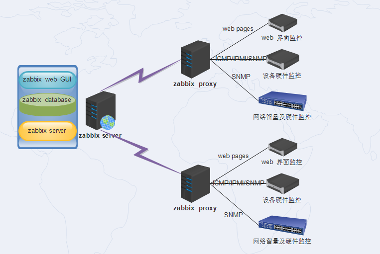

#### 内存缓存

内存缓存允许存储新的数据（监控项值，网络发现，主机自动注册）到缓存中，并上传到Zabbix server，而无需访问数据库。自Zabbix 7.0以来，proxy 已经引入内存缓存。

> 在Zabbix 7.0之前的版本中，收集的数据在上传到Zabbix server之前会先存储在数据库中。升级后，仍然保留这一默认行为。

为了优化性能，建议在proxy上配置使用内存缓存。可以通过修改 [ProxyBufferMode](https://www.zabbix.com/documentation/current/zh/manual/appendix/config/zabbix_proxy#proxybuffermode) 参数值配置，从 "disk" (默认值) to "hybrid" (推荐) 或者 "memory"。此外还需设置内存缓存大小 ([ProxyMemoryBufferSize](https://www.zabbix.com/documentation/current/zh/manual/appendix/config/zabbix_proxy#proxymemorybuffersize) 参数).

在混合模式(hybrid)下，如果 proxy 停止、缓存满或数据过旧，未发送的数据会被刷新到数据库中，从而避免数据丢失。当所有数值都刷新到数据库后，proxy 会重新使用内存缓存模式。

在内存模式(memory)下，将使用内存缓存存储数据会有数据丢失的风险。如果 proxy 停止或内存溢出，未发送的数据将会丢失。

Proxy 其他参数，如 [ProxyMemoryBufferSize](https://www.zabbix.com/documentation/current/zh/manual/appendix/config/zabbix_proxy#proxymemorybuffersize) 和 [ProxyMemoryBufferAge](https://www.zabbix.com/documentation/current/zh/manual/appendix/config/zabbix_proxy#proxymemorybufferage) 分别用于定义内存缓存的大小和缓存中数据存储的最大时长。

| **缓存模式** | **数据存储位置** | **数据丢失风险**   | **适用场景**        |
| ------------ | ---------------- | ------------------ | ------------------- |
| **disk**     | 数据库           | 低（磁盘持久化）   | 兼容旧版本（<7.0）  |
| **hybrid**   | 内存 + 数据库    | 低（故障时落盘）   | 生产环境推荐        |
| **memory**   | 内存             | 高（进程崩溃丢失） | 高性能/临时监控环境 |

### 高可用

> 通常高可用性(HA)需要在几乎不需要停机的关键基础设施中使用。为了在服务出现任何失败故障时进行故障转移，进行接管。

Zabbix高可用模式下，多台Zabbix server作为集群中的节点运行。 当集群中的一个Zabbix server 处于active 时，其他服务器处于standy，随时准备在必要时接管。

> 多台zabbix server共享同一个数据库
>
> 任意时刻**只有一个主 Server 节点**执行触发器计算、发送告警（Leader 节点），其他节点是备用（Standby）。

- **共享数据库**：所有 Server 节点共用同一数据库（如 MySQL Cluster 或 PostgreSQL HA）。  
- **主节点选举**：通过心跳机制（如 `heartbeat_frequency=10`）检测活跃节点，故障时自动切换 Leader。  
- **脑裂防护**：需配置至少 3 个节点（Quorum 机制避免双主）。

参加[zabbix server 高可用](https://www.zabbix.com/documentation/current/zh/manual/concepts/server/ha)

## 安装

安装zabbix的四种方法:

- 从 [二进制包](https://www.zabbix.com/documentation/current/zh/manual/installation/install_from_packages#从二进制包安装) 安装；
- 下载最新的[源代码包编译](https://www.zabbix.com/documentation/current/zh/manual/installation/install#从源代码安装) 安装；
- 从 [容器](https://www.zabbix.com/documentation/current/zh/manual/installation/containers) 中安装；
- 下载 [Zabbix 应用](https://www.zabbix.com/documentation/current/zh/manual/appliance)。

> zabbix appliance是以linux为基础构建的镜像,里面已经预装并配置好了 Zabbix Server、Zabbix Proxy 或 Zabbix Agent，以及相关的数据库（如 SQLite 或 MySQL）
>
> 可以直接在支持虚拟化的平台导入该镜像快速部署一个完整的zabbix监控环境

可以在[安装页面](https://www.zabbix.com/cn/download)选择所用的平台安装二进制包


## 部署

| 主机ip         | 描述          | 安装                                   |
| -------------- | ------------- | -------------------------------------- |
| 192.168.163.80 | zabbix server | server, frontend, agent2, mysql, nginx |
| 192.168.163.83 | zabbix agent  |                                        |
| 192.168.163.83 | db            | mysql-server                           |

### zabbix server

server 服务器:

```
# 安装zabbix仓库
wget https://repo.zabbix.com/zabbix/7.4/release/ubuntu/pool/main/z/zabbix-release/zabbix-release_latest_7.4+ubuntu22.04_all.deb
dpkg -i zabbix-release_latest_7.4+ubuntu22.04_all.deb
apt update 

apt install zabbix-server-mysql zabbix-frontend-php zabbix-nginx-conf zabbix-sql-scripts zabbix-agent2

apt install zabbix-agent2-plugin-mongodb zabbix-agent2-plugin-mssql zabbix-agent2-plugin-postgresql
```

db服务器

```
sudo apt install mysql-server

sudo systemctl enable --now mysql

sudo mysql

ALTER USER 'root'@'localhost' IDENTIFIED WITH mysql_native_password BY '123456';

create database zabbix character set utf8mb4 collate utf8mb4_bin;
create user 'zabbix'@'%' identified by 'zabbix123';
Query OK, 0 rows affected (0.04 sec)
grant all privileges on zabbix.* to zabbix@localhost;

# 修改mysql监听地址
sudo vim /etc/mysql/mysql.conf.d/mysqld.cnf 
[mysqld]
bind-address = 0.0.0.0

sudo systemctl restart mysqld
```

在db服务器中使用root打开权限:

```
mysql -uroot -p
# 信任所有创建函数/存储过程的用户，不强制要求 SUPER 权限
set global log_bin_trust_function_creators = 1;
```

然后在server中导入架构:

```
# 导入初始架构和数据,server.sql.gz来自zabbix-sql-scripts包
zcat /usr/share/zabbix/sql-scripts/mysql/server.sql.gz | mysql --default-character-set=utf8mb4 -uzabbix -p zabbix 
```

导入后在db服务器中关闭权限

```
# 关闭log_bin_trust_function_creators
mysql -uroot -p
set global log_bin_trust_function_creators = 0;
quit;
```

zabbix server:

```
# 配置数据库
sudo vim /etc/zabbix/zabbix_server.conf 
DBPassword=zabbix123

# 启动zabbix server和agent进程
systemctl restart zabbix-server zabbix-agent2 nginx php8.1-fpm
systemctl enable zabbix-server zabbix-agent2 nginx php8.1-fpm 
```

> `/etc/zabbix/`目录下存在`nginx.conf`配置文件,默认已经配置并复制到`/etc/nginx/conf.d/zabbix.conf`

### zabbix agent

```
sudo -s 

wget https://repo.zabbix.com/zabbix/7.4/release/ubuntu/pool/main/z/zabbix-release/zabbix-release_latest_7.4+ubuntu22.04_all.deb
dpkg -i zabbix-release_latest_7.4+ubuntu22.04_all.deb
apt update

apt install zabbix-agent2

apt install zabbix-agent2-plugin-mongodb zabbix-agent2-plugin-mssql zabbix-agent2-plugin-postgresql 
```

编辑配置文件允许server连接

```
vim /etc/zabbix/zabbix_agent2.conf
Server=127.0.0.1,192.168.163.0/24
```

### 添加用户

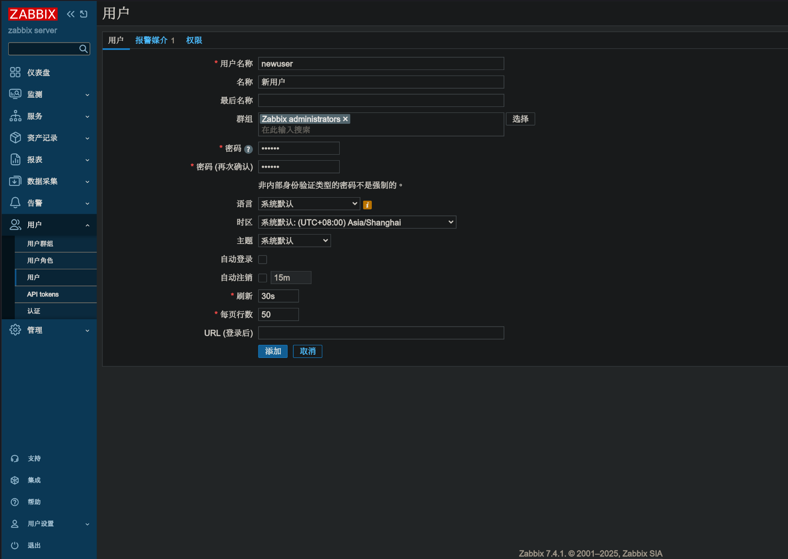

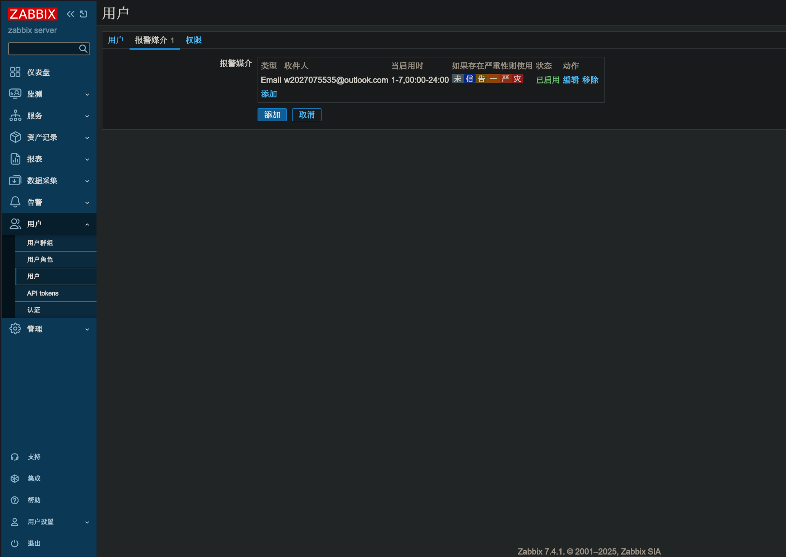

> 媒介指通知传递的方法,媒介类型需要先在告警中启用

### 配置权限

zabbix的主机权限和模板权限,只能配置给用户组

- 主机权限（Host permissions）

  - 控制某个用户组能不能**看到和访问具体的监控主机**。

  - 如果没有主机权限，即使这个用户组有模板权限，也看不到监控数据。

  - 权限级别：
    - **读写（Read-write）**：能查看监控数据、修改主机配置、手动执行操作。
      - **只读（Read）**：只能查看数据，不能改配置。
      - **无权限（Deny）**：完全不可见。

- 模板权限（Template permissions）

  - 控制用户组能不能**访问模板**。
  - 如果你要让某个用户组添加监控项，必须要有该模板的访问权限。
  - 一般来说，模板权限是用来限制“谁可以使用哪些模板去配置主机”。

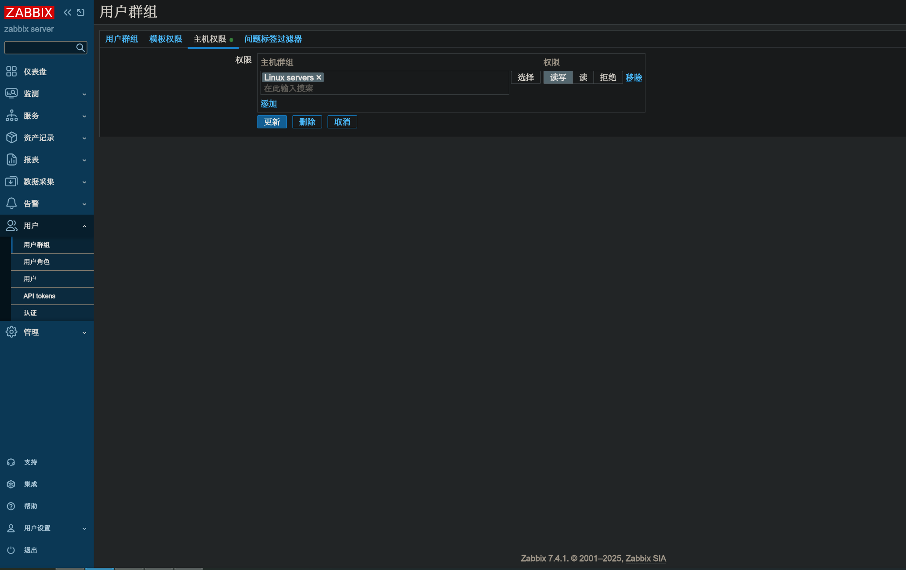

### 新建主机

zabbix主机指希望监控的网络实体(物理的或虚拟的),它可以是一台物理服务器、一台网络交换机、一台虚拟机或者某些应用程序。

Zabbix中已配置的主机的信息可以在*数据采集* → *主机*中找到

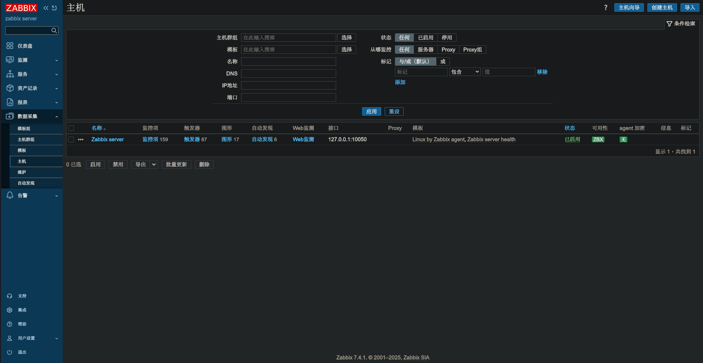

右上角点击创建主机

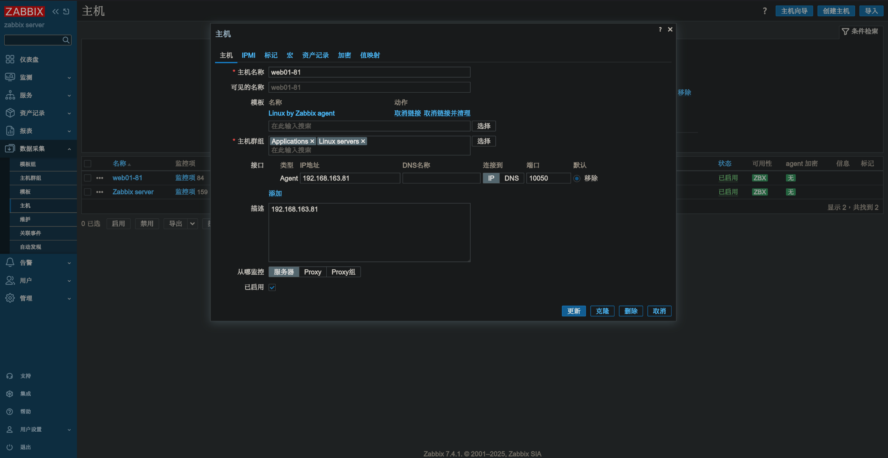

> 主机群组只能选择有权限的群组

可以通过ZBX图标的颜色判断可用性

-  - 表示主机状态尚未建立，尚未发生任何指标检查
- 表示主机可用，指标检查已成功
- 表示主机不可用，指标检查失败（将鼠标光标移动到图标上以查看错误消息)。通信可能存在一些错误，可能是由于接口凭据不正确造成的。检查Zabbix服务是否正在运行，并稍后尝试刷新页面。s

### 新增监控项

监控项是Zabbix中采集数据的基础。没有监控项，就没有数据——因为一个主机中只有监控项定义了单一的指标或者需要获得的数据。

监控项是以主机分组的,因此新建监控项需要在主机中添加

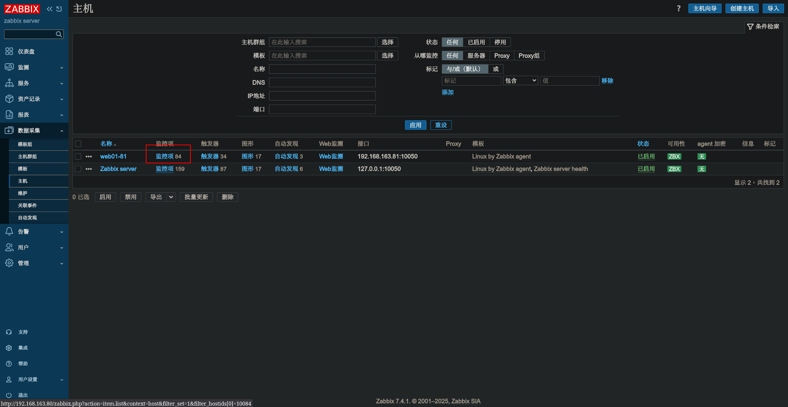

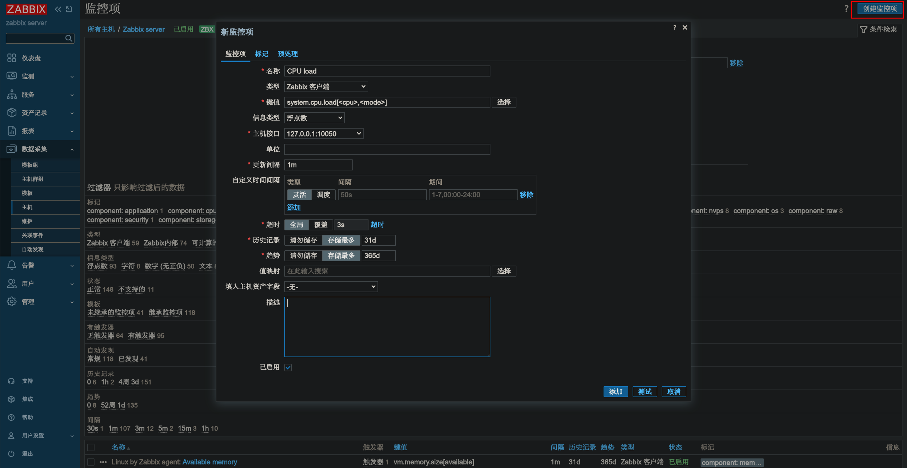

对于我们的示例，要输入的基本信息是:

- 名称: 输入CPU load 作为值。这将是列表和其它地方显示的监控项的名称。

- 键值: 手动输入system.cpu.load作为值。 这是监控项的技术名称，用于标识将要采集的信息类型。这个特定键值只是Zabbix agent附带的 预定义键值之一。

- 信息类型: 此属性定义预期数据的格式。对于键值system.cpu.load，这个字段会自动设置为浮点数。

> 你可能还希望将监控项历史数据的保留天数减少到7天或14天。这是减轻数据库保有大量历史数据的良好实践。 

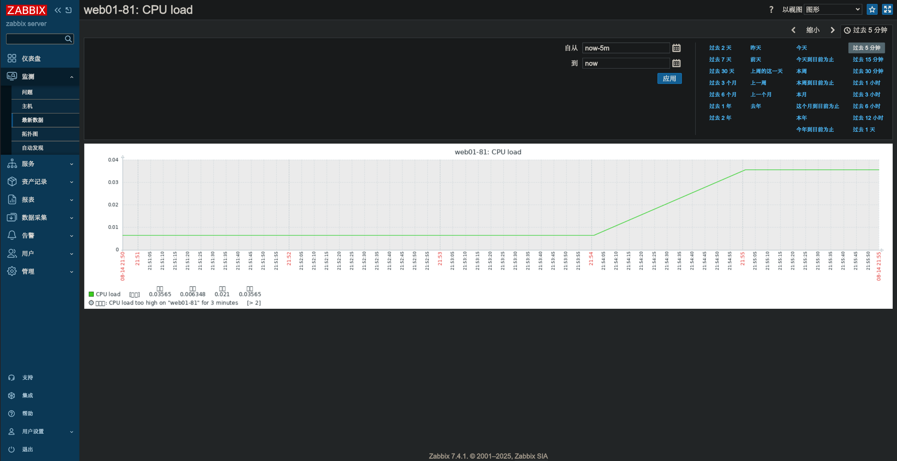

可以在监控-最新数据中查看数据,还可以绘制图表

### 新建触发器

监控项仅用于收集数据。要想自动评采集到的数据，我们需要定义触发器。触发器包含了一个表达式，这个表达式定义了数据可接受的阈值。

如果收到的数据超过了这个定义好的级别，触发器将被“触发”，或者进入“问题”状态——从而引起我们的注意，让我们知道有问题发生。如果数据再次恢复到合理的范围，触发器将返回“正常”状态。

触发器同样需要在主机中新建:

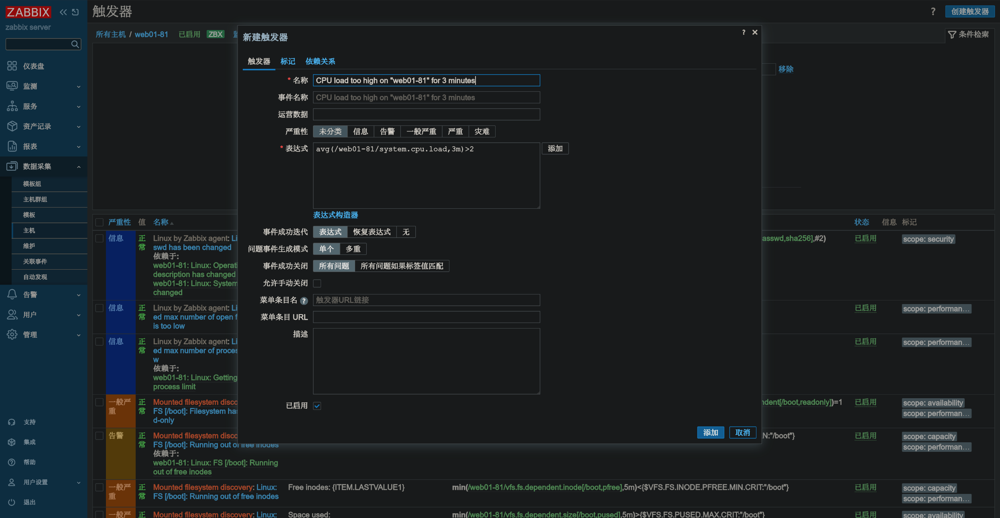

这个监控项的键值(system.cpu.load)用于指出具体的监控项。这个特定的表达式大致在说，在3分钟内，CPU负载的平均值超过2，那么就达到了问题的阈值,可以在 [触发器表达式语法](https://www.zabbix.com/documentation/current/zh/manual/config/triggers/expression)查看更多的信息。

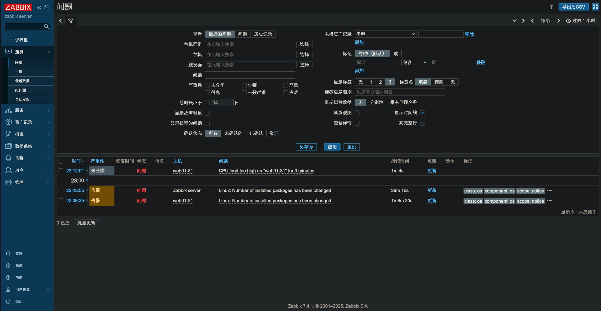

### 新建问题通知

监控项能够收集数据并且在异常状态下触发告警，这对于在系统中建立告警机制是很有用的，这将使得我们不需要盯着Zabbix前端也能及时收到一些重要的事件通知。

#### 设置电子邮件通知

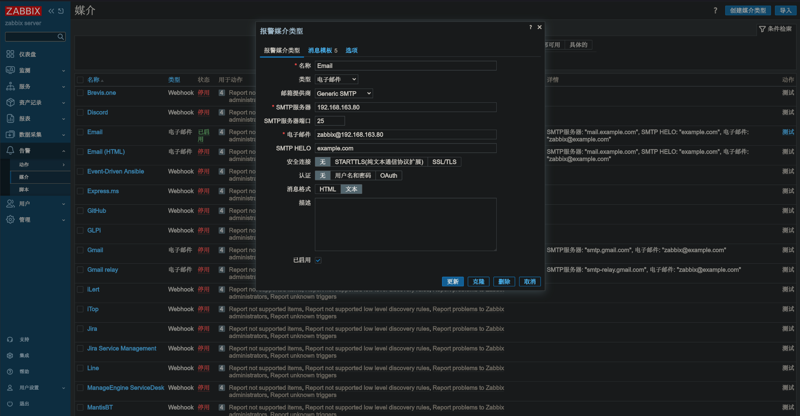

媒介类型必须通过定义特定的发送地址来关联用户（就像我们在[配置新用户](https://www.zabbix.com/documentation/current/zh/manual/quickstart/login#adding-user)时所做的那样），否则将无法生效。

### 新建动作

发送通知是Zabbix中[动作](https://www.zabbix.com/documentation/current/zh/manual/config/notifications/action)执行的操作之一。因此，要设置通知，请前往*报警 → 动作 → 触发器*并点击*创建动作*。

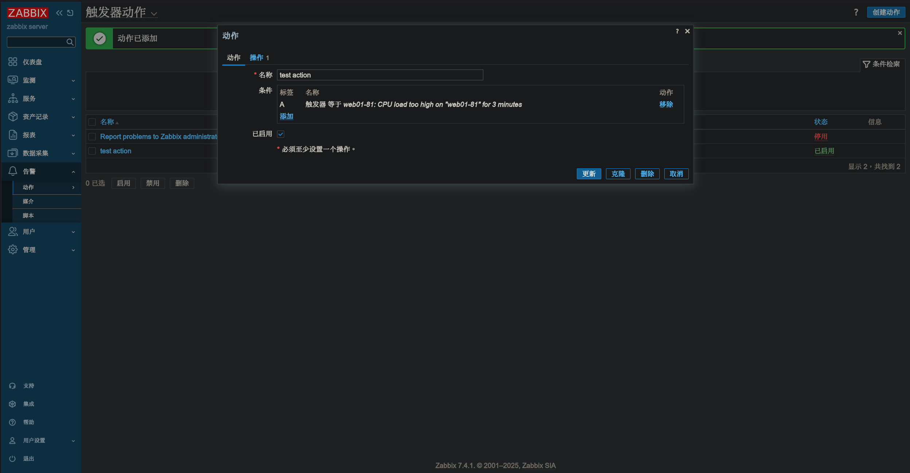

添加条件为先前的触发器后,在动作中添加一个操作:

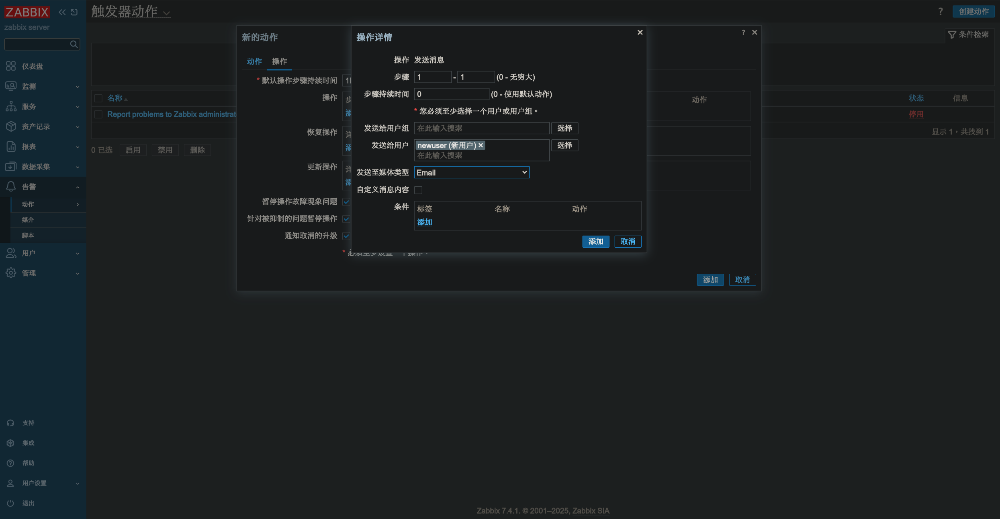

### 新建模板

在之前的章节中我们学习了如何配置监控项、触发器以及如何获取主机的问题通知。

虽然这些步骤提供了很大的灵活性，但仍然需要很多步骤才能完成。如果我们需要配置上千台主机，一些自动化的操作会带来更多的便利性。

模版功能可以实现这一点。模版允许对有用的监控项、触发器和其他对象进行分组，只需要一步就可以对监控主机应用模版，以达到重复使用的目的。

当一个模版关联到一个主机后，主机会继承这个模版中的所有对象。简而言之，一组预先定义好的检查会被快速应用到主机上。

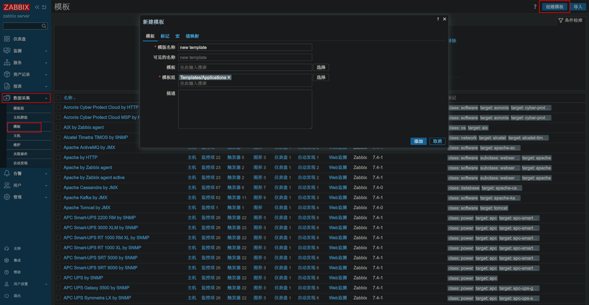

> 在 [用户组](https://www.zabbix.com/documentation/current/zh/manual/quickstart/login#adding-permissions) 配置的**模板权限**选项卡中，模板组的访问控制与主机的权限控制方式是一致的。所有的访问控制都分配给组，而不是单个模板，这就是为什么必须要把模板包含在至少一个组中。

我们可以将先前的`CPU LOAD`监控项复制到模板中

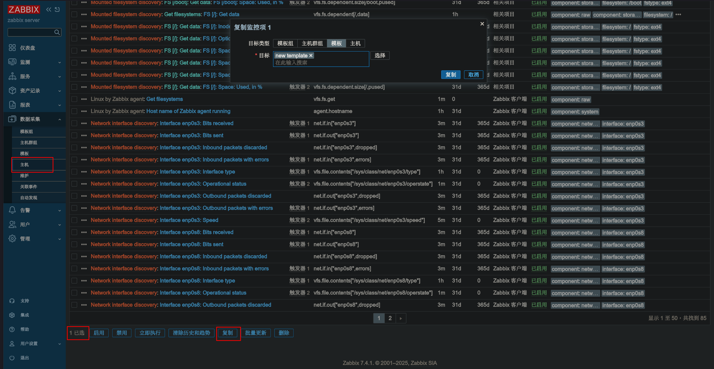

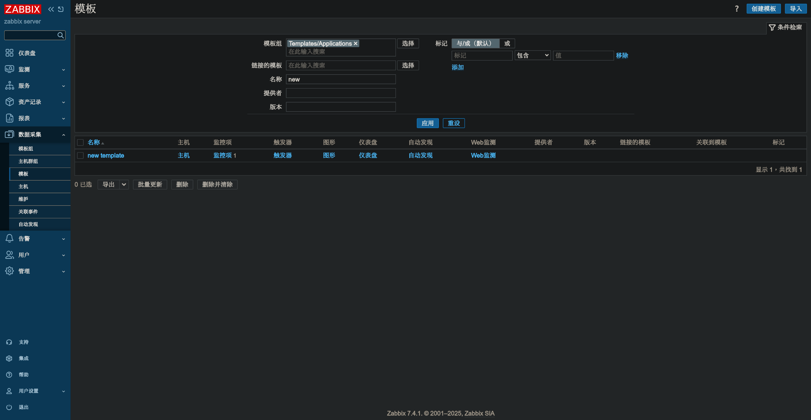

我们目前只创建了一个监控项，但你可以用同样的方法在模版中添加其他的监控项，触发器以及其他对象，直到满足特定需求（如监控操作系统，监控单个应用）的完整的对象组合。

准备好一个模版后，可以将它链接到一个主机

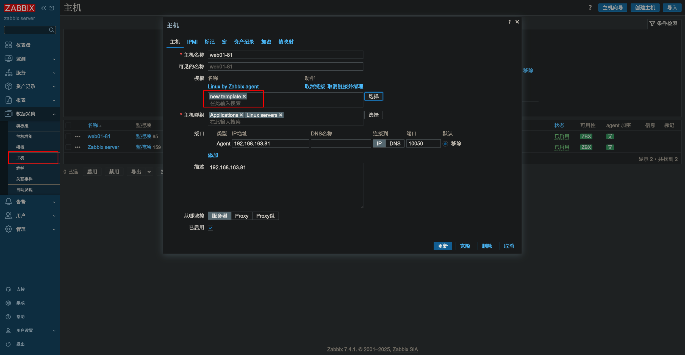

> 正如你可能已经注意到的，Zabbix为各种操作系统、设备和应用程序提供了一组预定义的模板。要快速开始监控，你可以将适当的模板关联到主机，但要注意，这些模板需要根据你的环境进行微调。比如，一些检查是不需要的，轮询间隔也可能过于频繁。

## 修复

### 切换中文

```
sudo apt install locales
sudo locale-gen zh_CN.UTF-8
sudo systemctl restart php8.1-fpm nginx
```

### 显示图像中文字体

```
sudo apt install fonts-noto-cjk

# 可以看到/usr/share/zabbix/ui/assets/fonts/graphfont.ttf指向的是一个字体文件
ll /usr/share/zabbix/ui/assets/fonts/graphfont.ttf 
lrwxrwxrwx 1 root root 38 Aug 13 16:26 /usr/share/zabbix/ui/assets/fonts/graphfont.ttf -> /etc/alternatives/zabbix-frontend-font
ll /etc/alternatives/zabbix-frontend-font 
lrwxrwxrwx 1 root root 54 Aug 14 14:57 /etc/alternatives/zabbix-frontend-font -> /usr/share/fonts/opentype/noto/NotoSansCJK-Regular.ttc

# 修改其指向的字体即可
udo ln -sf /usr/share/fonts/opentype/noto/NotoSansCJK-Regular.ttc /etc/alternatives/zabbix-frontend-font

sudo systemctl restart nginx php8.1-fpm.service
```


