# 计算机网络

## 基础知识

网络带宽的速度 1000 Mb/s=1000/8 MB/s=125 MB/s
1 Byte=8bit

### 网络设备

#### 交换机

交换机实现一个网络内多台主机之间的通讯,在数据前使用mac地址表示目标地址和源地址.

> mac地址:
>
> 每块网卡上都有的一个用于标识身份信息的物理地址
>
> mac地址全球唯一,不能进行修改,mac地址用16进制标识

- 交换机的端口上连接的所有终端设备，均在同一个网段（局域网LAN）上，称为一个广播域

  一个网段会有一个统一的网络标识，例如网段192.168.15.xxx

- 网络通信初期会利用广播方式发送数据报,在通讯过程中,数据报的发送是有去无回的,在一个交换网络中如果产生了大量广播数据包时会产生广播风暴,影响主机性能.

  可以通过将一个大的交换网络切分为几个小交换网络来解决.

- 企业级交换机会有一些基本的安全功能（例如只让某些设备有广播权限）

- 交换机一般工作在OSI模型的第二层，也叫二层交换
  也存在工作在三层的交换机,类似路由器使用

- 交换机仅负责传递帧,并不修改帧的内容

#### 路由器

路由器用于连接不同的网络，实现不同网络之间的主机通讯.可以隔离广播风暴.核心功能是路由选择和分组转发

1. 路由选择:路由器可以决定从来源到目的地所采用的路径
2. 分组转发:路由器会将资料转传到所选路径的下一个装置,重复这个过程,分组可以抵达目的地.
3. 负载均衡:路由器有时会用多个不同路径,传递相同资料的副本

WAN口是公网输入口,LAN口是局域网输出口

- 路由协议的转发
- 数据转发（维护一个路由表）
- 路由器会作为网关
- 用于连接广域网（公网）

#### 区别

1. 路由器是工作在第三层，可以识别IP，具备第三层功能(DHCP,自动分配IP)
   交换机一般工作在第二层,只能识别到mac地址.
2. 路由器可连接超过两个以上不同的网络，而交換机只能连接两个
3. 路由器接口较少,交换机接口较多

### 网络传输

#### 进行网络传输的条件:

1. 身份标识:通信设备需要唯一的网络层标识(IP地址)和数据链路层标识(MAC地址)
2. 路由可达(网络层):需要有路由器(公网范围内传输)且路由器知道如何到达目标主机
3. 传输层协议和端口号:标识数据包属于哪个应用程序进程,并提供端到端的通信服务
4. 域名解析:需要将域名转换为IP地址
5. 物理连接和接口:需要由网卡和交换机
6. 网络协议栈支持:操作系统支持完整的网络协议栈
7. 网络地址转换(NAT):将私网IP转换为公网IP

#### 网络传输流程

设备的应用程序(源IP:192.168.11.10)需要访问一个IP地址，操作系统查看路由表，路由表指明目标网络是匹配内网路由（内网）或匹配默认路由（外网）

##### 内网传输

目标IP:192.168.11.100

1. 因为目标在同一局域网，系统不需要网关，它会通过内网卡在本地网络上发送一个ARP广播请求(通过交换机对广播域所有设备进行广播)，询问目标IP对应的MAC地址。
2. 获取到目标IP的MAC地址后，操作系统将数据包(包含源IP与目标IP)封装在以太网帧中(包含源MAC和目标MAC),并将数据帧通过网线发送到连接的交换机,交换机通过目标MAC地址表将帧仅转发到连接者目标IP的那个端口.

##### 外网传输

目标IP:110.242.68.4(通过DNS请求获取到了`www.baidu.com`的IP地址)

1. 默认路由指向一个默认网关的IP地址,操作系统通过外网卡在其连接的网络上发送ARP广播,请求默认网关的MAC地址
2. 网关设备回复其MAC地址后,操作系统进行数据包的封装(源IP与目标公网IP)及帧的封装(源MAC和**默认网关**的MAC)并通过外网卡发出
3. NAT(网络地址转换)设备收到数据包后识别出源IP(192.168.11.10)是一个私有IP地址,不能在公网上路由,于是NAT设备进行SNAT(源地址转换),它将数据报的源IP从私有IP(192.168.11.10)替换为分配给外网卡的公网IP(221.218.210.53).同时它会修改源端口号,并创建一个NAT转换表项记录这个映射关系(内网IP:端口<-->公网IP:端口).
   NAT设备用自己的公网接口地址作为源重新发送修改后的数据包到互联网.
4. 公网路由:修改后的数据包(221.218.210.53->110.242.68.4)开始在互联网上被路由,最终到达百度服务器.
5. 返回后响应包通过DNAT转换为对应的私有IP(可能会还原端口号),并将目标MAC地址设置为原操作系统的外网卡的MAC地址(通过ARP或已有缓存).并最终返回到源操作系统被处理(根据端口好发送到对应的应用程序).

举例:通过路由器相连的两个网段的网络传输

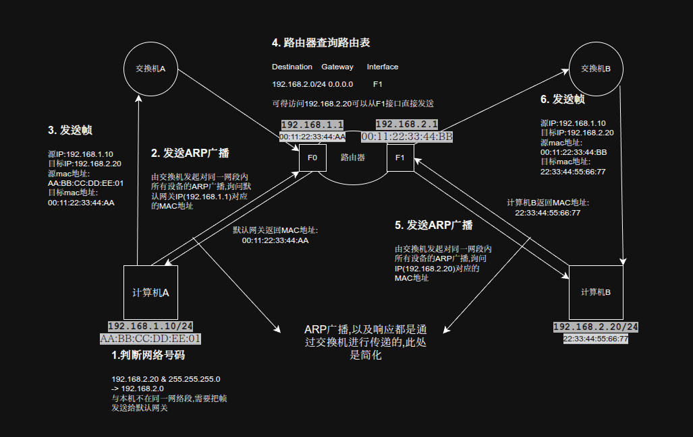

#### 网络模拟

使用**cisco packet tracer**软件模拟网络：

##### 相邻两个网段通过路由器连接

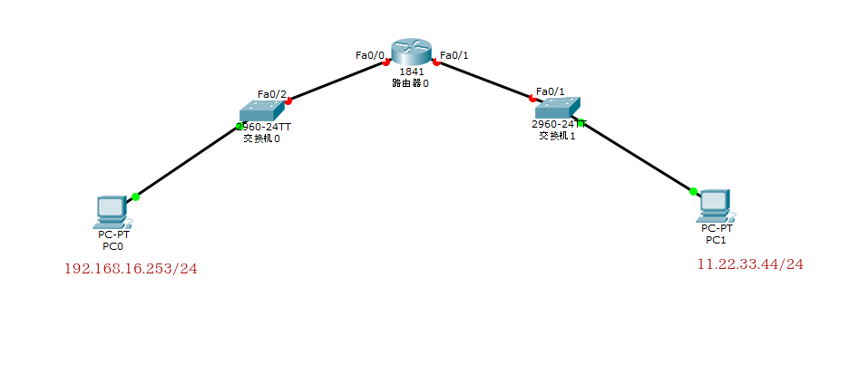

配置路由器实现两不同网段的通信(192.168.16.253-->11.22.33.44)：

```
# 首先进入用户模式：
Router>
# 输入en(enable)进入特权模式
Router> en
# 显示
Router#show ip route

# 		直连			静态			
Codes: C - connected, S - static, I - IGRP, R - RIP, M - mobile, B - BGP
       D - EIGRP, EX - EIGRP external, O - OSPF, IA - OSPF inter area
       N1 - OSPF NSSA external type 1, N2 - OSPF NSSA external type 2
       E1 - OSPF external type 1, E2 - OSPF external type 2, E - EGP
       i - IS-IS, L1 - IS-IS level-1, L2 - IS-IS level-2, ia - IS-IS inter area
       * - candidate default, U - per-user static route, o - ODR
       P - periodic downloaded static route

Gateway of last resort is not set

# 进入配置模式
Router#config t
Enter configuration commands, one per line.  End with CNTL/Z.
Router(config)#

# 进入接口模式
Router(config)#int fa0/0	#进入fa0/0接口
Router(config-if)#

# 查看帮助
Router(config-if)#?
Router(config-if)#ip ?

# 配置IP
Router(config-if)# ip address 192.168.16.1 255.255.255.0

# 启动接口
Router(config-if)# no shut

# 配置第二个接口
Router(config)#int fa0/1
Router(config-if)#ip address 11.22.33.1 255.255.255.0
Router(config-if)#no shutdown

# 退出当前模式
Router(config-if)#exit
Router(config)#exit
Router#

# 查看路由表
Router#show ip route
Codes: C - connected, S - static, I - IGRP, R - RIP, M - mobile, B - BGP
       D - EIGRP, EX - EIGRP external, O - OSPF, IA - OSPF inter area
       N1 - OSPF NSSA external type 1, N2 - OSPF NSSA external type 2
       E1 - OSPF external type 1, E2 - OSPF external type 2, E - EGP
       i - IS-IS, L1 - IS-IS level-1, L2 - IS-IS level-2, ia - IS-IS inter area
       * - candidate default, U - per-user static route, o - ODR
       P - periodic downloaded static route

Gateway of last resort is not set

     11.0.0.0/24 is subnetted, 1 subnets
C       11.22.33.0 is directly connected, FastEthernet0/1	# 两个直连网络
C    192.168.16.0/24 is directly connected, FastEthernet0/0
```

配置完路由器的IP之后仍然无法ping通,还需要配置网关.

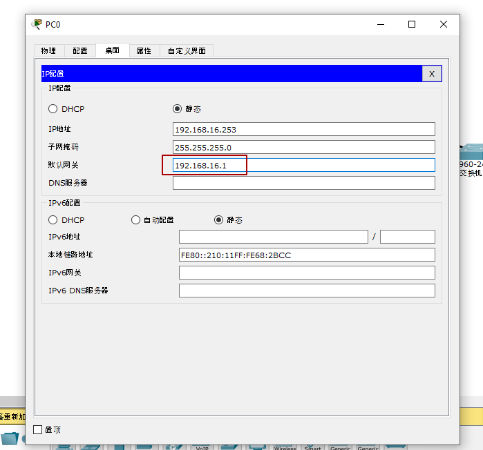

##### 通过多个路由器连接的网段

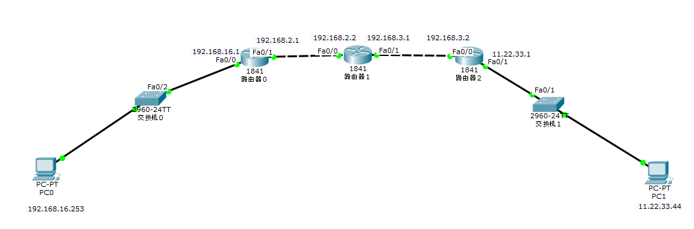

```
# 重新配置路由器1的IP
Router#config t
Enter configuration commands, one per line.  End with CNTL/Z.
Router(config)#interface fa0/1
# 清除原来配置的IP地址
Router(config-if)#no ip address
Router(config-if)#ip address 192.168.2.1 255.255.255.0
Router(config-if)#no shut
# 路由器命名为R1
Router(config-if)#exit
Router(config)#hostname R1
R1(config)#
```

以此类推,经过配置后的路由表如下:
R1:

```
C    192.168.2.0/24 is directly connected, FastEthernet0/1
C    192.168.16.0/24 is directly connected, FastEthernet0/0
```

R2:

```
C    192.168.2.0/24 is directly connected, FastEthernet0/0
C    192.168.3.0/24 is directly connected, FastEthernet0/1
```

R3:

```
C       11.22.33.0 is directly connected, FastEthernet0/1
C    192.168.3.0/24 is directly connected, FastEthernet0/0
```

此时R1能ping通R2的fa0/0接口(192.168.2.2)

```Type escape sequence to abort.
R1>ping 192.168.2.2

Type escape sequence to abort.
Sending 5, 100-byte ICMP Echos to 192.168.2.2, timeout is 2 seconds:
.!!!!	# '!'表示ping通,'.'表示不通
Success rate is 80 percent (4/5), round-trip min/avg/max = 0/0/0 ms
```

但并不能ping通R2的fa0/1接口(192.168.3.1):

```
R1>ping 192.168.3.1

Type escape sequence to abort.
Sending 5, 100-byte ICMP Echos to 192.168.3.1, timeout is 2 seconds:
.....
Success rate is 0 percent (0/5)
```

因为R1的路由表中并没有192.168.3.0网段的记录,所以需要手动指定路由

#### 路由

##### 静态路由

静态路由需要手动配置,工作量很大

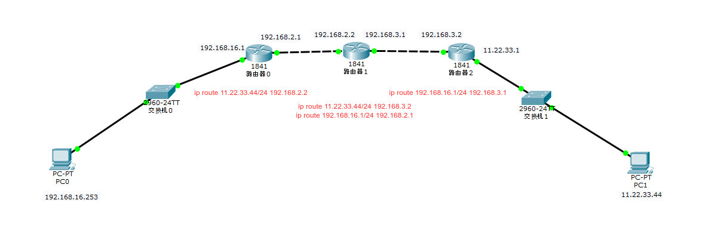

```
 # 手动添加路由
R1(config)#ip route 11.22.33.0 255.255.255.0 192.168.2.2

R1#show ip route

     11.0.0.0/24 is subnetted, 1 subnets
S(表示静态路由)       11.22.33.0 [1/0] via 192.168.2.2
C    192.168.2.0/24 is directly connected, FastEthernet0/1
C    192.168.16.0/24 is directly connected, FastEthernet0/0
```

同理可以配置R2,R3路由器:

```
 # R2
R2(config)#ip route 11.22.33.0 255.255.255.0 192.168.3.2
# 配置回址
R2(config)#ip route 192.168.16.0 255.255.255.0 192.168.2.1

R2#show ip route

     11.0.0.0/24 is subnetted, 1 subnets
S       11.22.33.0 [1/0] via 192.168.3.2
C    192.168.2.0/24 is directly connected, FastEthernet0/0
C    192.168.3.0/24 is directly connected, FastEthernet0/1
S    192.168.16.0/24 [1/0] via 192.168.2.1


#R3,只需要配置回址
R3(config)#ip route 192.168.16.0 255.255.255.0 192.168.3.1

R3#show ip route
Codes: C - connected, S - static, I - IGRP, R - RIP, M - mobile, B - BGP
       D - EIGRP, EX - EIGRP external, O - OSPF, IA - OSPF inter area
       N1 - OSPF NSSA external type 1, N2 - OSPF NSSA external type 2
       E1 - OSPF external type 1, E2 - OSPF external type 2, E - EGP
       i - IS-IS, L1 - IS-IS level-1, L2 - IS-IS level-2, ia - IS-IS inter area
       * - candidate default, U - per-user static route, o - ODR
       P - periodic downloaded static route

Gateway of last resort is not set

     11.0.0.0/24 is subnetted, 1 subnets
C       11.22.33.0 is directly connected, FastEthernet0/1
C    192.168.3.0/24 is directly connected, FastEthernet0/0
S    192.168.16.0/24 [1/0] via 192.168.3.1

```

此时通过PC0(192.168.16.253)可以ping通PC1(11.22.33.44),但是在R1上无法ping通,因为R3中没有192.168.2.0网段的路由地址,IMCP需要手动配置.

##### 动态路由

动态路由可以动态学习路由

1. 自动学习相邻路由器(直连)的路由表信息.
2. 必须遵从相同的协议如:rip ospf eigrp isis bgp

```
 # R1
R1>enable 
R1#config t
Enter configuration commands, one per line.  End with CNTL/Z.
# 查看帮助,支持的协议
R1(config)#route ?
  bgp    Border Gateway Protocol (BGP)
  eigrp  Enhanced Interior Gateway Routing Protocol (EIGRP)
  ospf   Open Shortest Path First (OSPF)
  rip    Routing Information Protocol (RIP)
# 使用rip协议
R1(config)#route rip
# 宣告自己所知道的网络
R1(config-router)#network 192.168.2.0
R1(config-router)#network 192.168.16.0

 # R2
R2(config-router)#network 192.168.2.0
R2(config-router)#network 192.168.3.0

 # R3
R3(config-router)#network 192.168.3.0
R3(config-router)#network 11.22.33.0
```

配置完之后即可ping通,包括各路由器也可以与目标主机ping通(这在静态路由中需要进行手段配置)

R1路由表:

```
Codes: C - connected, S - static, I - IGRP, R - RIP, M - mobile, B - BGP
       D - EIGRP, EX - EIGRP external, O - OSPF, IA - OSPF inter area
       N1 - OSPF NSSA external type 1, N2 - OSPF NSSA external type 2
       E1 - OSPF external type 1, E2 - OSPF external type 2, E - EGP
       i - IS-IS, L1 - IS-IS level-1, L2 - IS-IS level-2, ia - IS-IS inter area
       * - candidate default, U - per-user static route, o - ODR
       P - periodic downloaded static route

Gateway of last resort is not set

R    11.0.0.0/8 [120/2] via 192.168.2.2, 00:00:22, FastEthernet0/1
C    192.168.2.0/24 is directly connected, FastEthernet0/1
R    192.168.3.0/24 [120/1] via 192.168.2.2, 00:00:22, FastEthernet0/1
C    192.168.16.0/24 is directly connected, FastEthernet0/0
```

R2路由表:

```
R    11.0.0.0/8 [120/1] via 192.168.3.2, 00:00:12, FastEthernet0/1
C    192.168.2.0/24 is directly connected, FastEthernet0/0
C    192.168.3.0/24 is directly connected, FastEthernet0/1
R    192.168.16.0/24 [120/1] via 192.168.2.1, 00:00:20, FastEthernet0/0
```

R3路由表:

```
C       11.22.33.0 is directly connected, FastEthernet0/1
R    192.168.2.0/24 [120/1] via 192.168.3.1, 00:00:03, FastEthernet0/0
C    192.168.3.0/24 is directly connected, FastEthernet0/0
R    192.168.16.0/24 [120/2] via 192.168.3.1, 00:00:03, FastEthernet0/0
```


#### IP地址

IP地址是逻辑地址,通常以**点分十进制**格式表示,例如`192.168.11.10`,用于在网络层标识设备和跨网络路由.

IP地址由网络前缀和主机标识组成.**子网掩码**用于区分这两部分.

举例:IP`192.168.11.10\24`的IP为`192.168.11.10`,子网掩码为`255.255.255.0`,网络前缀`192.168.11`，主机标识`.10`。该网络可用主机地址范围：`192.168.11.1`-`192.168.11.254` (`.0`是网络地址,`.255`是广播地址).

##### 公有地址

通过公有地址可以直接访问因特网,全球唯一,不能重复出现.

##### 私有地址

私有地址属于非注册地址,专门为组织机构内部使用.缓解了地址枯竭2,不同局域网内是可以重复使用的.

留用的内部私有地址:

- A类:10.0.0.0--10.255.255.255
  10.0.0.1-10.0.0.254
  10.0.1.1=10.0.1.254
  10.0.2.1=10.0.2.254
  10.1.0.1=10.1.0.1=10.1.0.254
- B类:172.16.0.0--172.31.255.255
  172.16.0.1-172.16.0.254
  172.16.1.1-172.16.1.254
- C类:192.168.0.0--192.168.255.255
  192.168.0.1-192.168.0.254
  192.168.1.1-192.168.1.254
  192.168.2.1-192.168.2.254

##### IP地址常见分类

1. A类IP地址,四段号码中第一段为网络号码,剩下三段为本地计算机的号码(子网掩码为255.0.0.0),A类IP地址网络地址的最高位必须是"0"
   地址范围`1.0.0.1-127.255.255.254`(`00000001 00000000 00000000 00000001-01111111 11111111 11111111 11111110`).最后一个是广播地址
2. B类IP地址,前两段为网络号码(子网掩码255.255.0.0),网络地址最高位必须为"10"
   地址范围:`128.0.0.1-191.255.255.254`(`10000000 00000000 00000000 00000001-10111111 11111111 11111111 11111110`),最后一个是广播地址
3. C类IP地址,前三段为网络号码(子网掩码255.255.255.0),网络地址最高位必须为"110"
   地址范围:`192.0.0.1-223.255.255.254`(`11000000 00000000 00000000 00000001-11011111 11111111 11111111 11111110`),最后一个是广播地址
4. D类IP地址,又被叫做多播地址,最高位必须是"1110",范围从224.0.0.0到239.255.255.255
5. E类IP地址,最高位必须是"11110",为将来使用保留

##### 特殊IP地址

1. 每个字节都为0(0.0.0.0)表示当前主机
2. IP地址中每个字节都为1的IP地址,是当前子网的广播地址(192.168.255.255/16)
3. 127.0.0.1到127.255.255.255不能用作IP地址,用于回路测试,如127.0.0.1可以代表本机IP地址
4. 169.254.0.0-169.254.255.255开启了DHCP服务但又无法获取到DHCP的设备会随机使用这个网段的IP

#### 子网掩码

子网掩码的作用是区分IP中的网络号和主机号

子网掩码的位数就是网络号的位数

#### MAC地址

MAC地址是物理地址,固化在网卡硬件中,用于在同一物理网络内(广播域)直接标识设备.

#### 端口

端口在操作系统中扮演通信的端点,每个通信端口都会与主机的IP地址及通信协议关联.服务器和服务器之间通信是使用端口进行通信.

> 端口号有两种用途：
>
> - 标识服务器上提供特定网络服务的进程。客户机可以按照服务器IP与端口号与相应的服务器进程建立网络连接，获得相应的网络服务。例如，通常使用80端口号提供http服务，使用23端口号telnet服务。服务器的这种功能叫做listening。客户机通常使用动态指定的端口号与服务器建立连接。
> - 由本机地址、本机端口号、目标机地址、目标机端口号、通信协议组成的五元组，用于唯一确定正在使用的网络链接。因此，对于不同的协议、不同的目标机地址，本机的不同地址（如果本机使用多个网卡）等多种情形，同一个端口号可以复用。因此对于1对1通信，且本机与目标机之间只能建立一个通信连接，则不需要使用端口号。
>
> 网络防火墙或者网关还可提供端口转发（port forwarding），即NAT.

端口以16bit数字表示,范围是1-65535.

| 端口范围   | 说明                        |
| ---------- | --------------------------- |
| 0          | 保留,无法使用               |
| 1-1023     | 系统保留,只能由root用户使用 |
| 1024-4999  | 客户端程序自由分配          |
| 5000-65535 | 服务端程序自由分配          |


#### NAT

NAT(network address translation)网络地址转换

##### 静态NAT

基本网络地址转换(Basic NAT)也被称作"静态NAT",仅支持地址转换,不支持端口映射.要求每一个当前连接都对应一个公网IP地址.

Basic NAT要维护一个无端口号NAT表,结构如下:

|    内网IP     |     外网IP      |
| :-----------: | :-------------: |
| 192.168.1.55  | 219.152.168.222 |
| 192.168.1.59  | 219.152.168.223 |
| 192.168.1.155 | 219.152.168.224 |

##### 网络地址端口转换

NAPT 这种方式支持传输层协议(TCP,UDP等)的端口映射,并允许多台主机共享一个公网IP地址.

> 支持端口转换的NAT又可以分为两类：源地址转换和目的地址转换。前一种情形下发起连接的计算机的IP地址将会被重写，使得内网主机发出的数据包能够到达外网主机。后一种情况下被连接计算机的IP地址将被重写，使得外网主机发出的数据包能够到达内网主机。实际上，以上两种方式通常会一起被使用以支持双向通信。

NAPT维护一个带有IP以及端口号的NAT表，结构如下:

|      内网IP       |        外网IP        |
| :---------------: | :------------------: |
| 192.168.1.55:5566 | 219.152.168.222:9200 |
|  192.168.1.59:80  | 219.152.168.222:9201 |
| 192.168.1.59:4465 | 219.152.168.222:9202 |

一个使用NAPT的网络结构图:

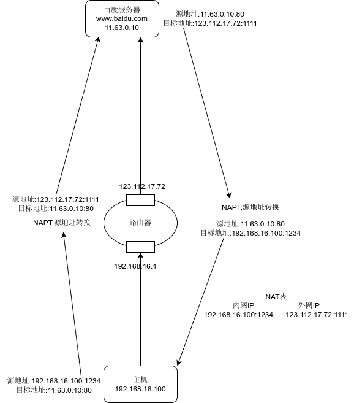

一台电脑大概需要70个随机端口,一个公网IP大概支持700-900台电脑

### OSI七层模型

**开放式系统互联模型**（英語：**O**pen **S**ystems **I**nterconnection Model，縮寫：OSI；簡稱為**OSI模型**）,该模型把通信系统中的数据流划分为七个层,从分布式应用程序数据的最高层表示到跨通信介质传输数据的物理实现,每个中间层为其上一层提供功能,其自身功能则由其下一层提供.

| OSI模型    | 概述                                         | 协议                        | 功能                                                         |
| ---------- | -------------------------------------------- | --------------------------- | ------------------------------------------------------------ |
| 应用层     | 大部分软件运行在应用层                       | http,https,SSH,FTP,smtp,dns | 为应用软件提供接口,使应用程序能够使用网络服务                |
| 表示层     | 负责数据加密,解密,压缩                       |                             | 数据的解码和编码,加密和解密,压缩和解压缩                     |
| 会话层     | 负责会话管理与维护                           |                             | 建立,维护,管理应用程序之间的会话                             |
| 运输层     | 添加传输表头,负责数据传输方式(可靠传输)      | TCP,UDP                     | 负责建立端到端的连接,保证报文在端到端之间的传输<br />服务点编址,分段与重组,连接控制,流量控制,差错控制 |
| 网络层     | 添加网络表头,负责路由与寻址                  | IP                          | 为网络设备提供逻辑地址,进行路由选择和分组转发                |
| 数据链路层 | 添加数据链表头,数据链表尾,把分组数据封装成帧 | (mac地址)                   | 在不可靠的物理链路上提供可靠的数据传输服务,把帧从一跳(结点)移动到下一跳(结点).<br />组帧,物理编址,流量控制,差错控制,接入控制 |
| 物理层     | 把数据转换为2进制,通过线缆传播               |                             | 负责把逐个的比特从一跳移动到下一跳                           |

##### OSI数据的传输过程

发送方从上倒下对数据进行打包,接收方从下到上进行解包

###### 打包

1. **传输层**将上层传输到的报文切割为适合传输的**报文段**,并加上段头,段头中包含定位到应用进程的端口号等信息形成数据段.
2. **网络层**对数据段添加分组头部形成**分组**(IP数据报),分组头部中包含寻址主机的IP地址和其他一些传输需要用到的信息
3. **数据链路层**对分组添加帧头形成**帧**,帧头中包含寻址主机所需要的物理地址(MAC地址),校验等信息
4. **物理层**将帧转换为可供传输的**比特流**

###### 解包

打包的逆过程

##### 应用层

在操作系统中实际上进行通信的是进程，进程跨越计算机网络交换**报文(message)**,进程需要通过**IP地址**加**端口号**来标识地址.

##### 运输层

运输层为主机上的进程提供逻辑通信,将应用层传输的报文转换为**报文段**

##### 网络层

网络层将报文段打包成**IP数据报**

### 网络三层模型

1. 核心层:主要部署路由器设备,用于连接外网线路,需要具备冗余能力
2. 汇聚层:主要部署三层交换设备,用于相应安全访问控制,进行链路汇聚
3. 接入层:主要部署二层交换设备,用于终端设备接入

- 一层交换机:只支持物理层协议
- 二层交换机:支持物理层和数据链路层
- 三层交换机:支持物理层,数据链路层和网络层

### TCP与UDP连接

区别:

| 传输控制协议 TCP                        | 数据报协议 UDP                        |
| --------------------------------------- | ------------------------------------- |
| 面向连接(3次握手,4次挥手)               | 无连接                                |
| 为传输层提供可靠运输                    | 不可靠运输                            |
| 流控(检查数据是否丢失,丢失可以重新发送) | 尽力传递                              |
| Web浏览器,电子邮件,文件传输程序         | 域名系统,视频流,IP语音(VoIP),游戏数据 |

#### TCP

TCP连接可以提供稳定,可靠的连接.

TCP连接通过三次握手和四次挥手进行建立连接和断开连接，过程中，客户端和服务端会有一些状态.

- CLOSED(关闭)
- ESTABLISHED(已连接)

##### 3次握手

TCP与端口建立连接时双方要经过3次握手.

假设A的seq从10000开始,B的seq从20000开始

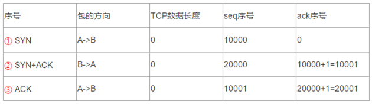

1. :one::A向B发送一个SYN包(建立连接请求),seq为初始化的随机值,这里假设为10000,此时ACK序号为0.
2. :two::B收到后会发送一个对SYN的确认包,包括ACK和一个SYN,表示对第一个包的确认,并继续握手操作.
   此时B也会以一个随机值来初始化seq,这里假设为20000.B的ACK是A的seq+1,即10000+1=10001,表明已经收到A的请求,B方的序列号由20000开始,由于A的SYN包消耗了1字节,所以B期望下一个收到的序列号从10001开始.
3. :three::A收到SYN+ACK包后回复一个确认包(ACK)通知B连接已建立.
   它的seq是上一个请求(A发出的SYN请求)的seq+1(也等于B返回的ACK),它的ACK是B的seq+1,即20000+1=20001,用于确认收到B的SYN请求(同样syn也消耗了一个字节)

##### 数据传输

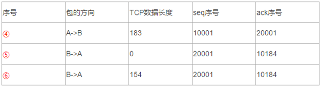

1. :four::A发起Get请求,由于:three:的len=0,且没有syn或fin标志,因此没有消耗seq的值,seq不变,依旧是10001.ACK序号确认的还是上一个收到的:two:.​​
2. :five::B对收到的:four:发出回应,告诉A已经收到.由于上个请求:two:消耗了一字节,这里seq为20001.ACK为:four:的seq+len=1001+183=10184
3. :six::B发送200ok,由于:five:长度为0没有消耗seq,这里seq仍然为20001,ACK序列号确认的还是上一个收到的:four:

##### 4次挥手

TCP断开连接时需要4次挥手


1. :seven::A发送FIN断开连接请求(此处与对:six:的确认包合并了)​​
2. :eight::确认:seven:.:seven:的长度为0,但是有FIN标志,因此ACK+1=10185
3. :nine::确认:eight:,:eight:长度为0,但是有FIN标志,消耗一字节,因此ACK+1=20156

###### 状态变化:

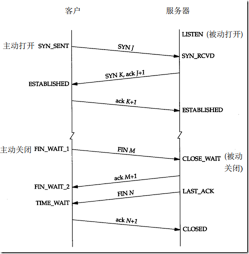

**三次握手**:

初始时客户端,服务端都处于CLOSED状态

服务端在创建socket开始监听后变为LISTEN状态

1. 客户端发送SYN请求后,状态变为SYN_SENT
2. 服务端接受请求并返回ACK,SYN请求后,服务端状态变为SYN_RECVD(received)
3. 客户端收到SYN并返回ACK请求后,客户端状态变为ESTABLISHED,服务端接收到ACK请求后,服务端状态变为ESTABLISHED.

**四次挥手**:

断开连接前,客户端与服务端均处于ESTABLISHED状态

1. 客户端向服务端发送FIN报文,请求断开连接,其状态变为FIN_WAIT1.
2. 服务端接收到FIN之后向客户端发送ACK,服务端状态变为CLOSE_WAIT
3. 客户端接收到ACK后进入FIN_WAIT2状态,此时客户端到服务端的连接已断开,如果服务端还有数据要发送给客户端,就会继续发送.
4. 服务端发送完数据后发送FIN报文,此时服务端进入LAST_ACK状态
5. 客户端接收到服务端的FIN后,发送ACK到服务端,此时客户端进入TIME_WAIT状态,再过2MSL长的时间后进入CLOSED状态.
6. 服务端收到客户端的ACK请求后进入CLOSED状态.

> CLOSING状态:
>
> 客户端发送FIN请求后,进入FIN_WAIT1状态,如果客户端没有接收到服务端的ACK请求,而是直接接收到了服务端的FIN请求(表明服务端的ACK请求丢包),客户端会进入CLOSING状态,这是一个异常状态.

###### 为什么需要四次

TCP是全双工模式,当主机1发出FIN报文段时，只是表示主机1已经没有数据要发送了，主机1告诉主机2，它的数据已经全部发送完毕了；但是，这个时候主机1还是可以接受来自主机2的数据；当主机2返回ACK报文段时，表示它已经知道主机1没有数据发送了，但是主机2还可能需要发送数据到主机1；因此主机2的ACK回复和FIN通常不能合并为一个请求.

当主机2也发送了FIN报文段时，这个时候就表示主机2也没有数据要发送了，就会告诉主机1，我也没有数据要发送了，主机1收到主机2的FIN报文段时，回复ACK，表示知道主机2也没有数据传输了，之后彼此就会愉快的中断这次TCP连接。

###### 2MSL等待状态

TIME_WAIT状态也称为2MSL等待状态,每隔具体TCP实现必须选择一个报文段最大生存时间MSL(Maximum Segment Lifetime).它是任何报文段被丢弃前在网络内的最长时间,我们知道这个时间是有限的,因为TCP报文段以IP数据报在网络内传输,而IP数据报则有限制其生存时间的TTL字段. 常见的时间是(30s,1m,2m)

我们必须假想网络是不可靠的,无法保证最后发送的ACK一定会被对方收到,对方处于LAST_ACK状态下的SOCKET可能会因为超时而重发FIN报文,所以这个TIME_WAIT状态的作用就是用来重发可能丢失的ACK报文.

#### UDP

UDP是直接连接,不提供可靠服务,尽力而为.

## 网络连接模式

在vmware的网卡配置页面可以配置网络连接模式:

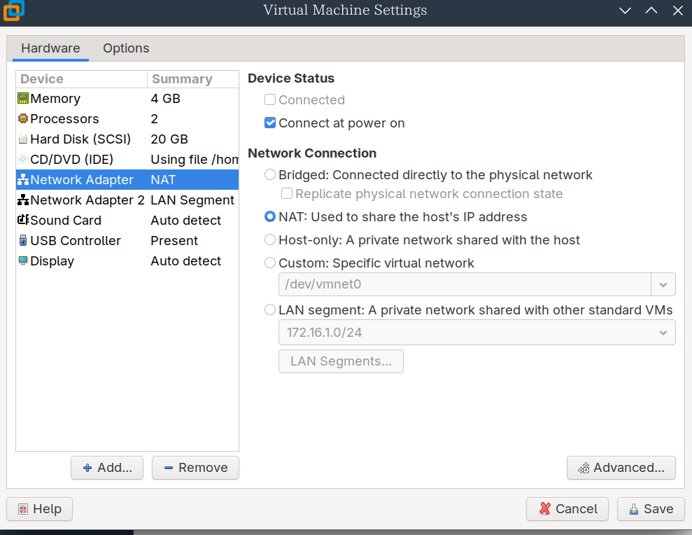

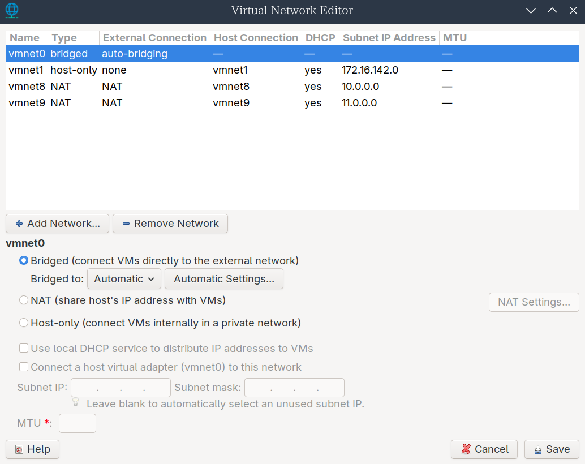

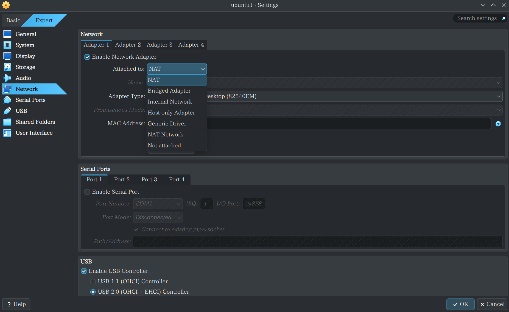

### Bridged

将虚拟机的网卡直接连接到主机物理网卡所连接的物理网络,相当于虚拟机和物理主机处于同一个物理网段.类似于给虚拟机接了一根网线查到主机所在的物理交换机或路由器上.

虚拟机会从物理网络的DHCP服务器(通常是路由器)获取IP地址,也可以手动配置一个与物理网络在同一网段的IP.

**适用场景**: 需要虚拟机像真实物理机一样完全融入你的局域网（例如运行服务器、需要被局域网内其他设备访问、需要特定网络配置的测试环境）。

VMware 默认虚拟网络:通常对应 `VMnet0` (但用户不可配置此网络)。

### NAT(网络地址转换模式)

虚拟机通过**主机操作系统**共享主机的 IP 地址访问外部网络（如互联网）。VMware 会在主机上创建一个私有的虚拟网络 (`VMnet8`) 和一个虚拟的 NAT 设备/路由器。

虚拟机可以**主动访问外部网络（互联网）**，因为主机的 NAT 服务会将虚拟机的私有地址转换为主机的公网/局域网 IP 地址.外部网络无法主动发起连接访问这台NAT模式下的虚拟机,除非在vmware nat设置中配置端口转发.

**适用场景：** 虚拟机主要需要访问互联网资源（浏览网页、下载更新），不需要被外部网络主动访问的场景（例如桌面应用、普通上网）

**VMware 默认虚拟网络：** 对应 `VMnet8`。

> NAT模式中的IP端口映射是临时的,因此虚拟机可以正常的访问公网并得到响应,但是公网无法主动连接虚拟机

### LAN Segment (局域网段) & Internal Network(内部网络)

实现虚拟机之间的高度隔离内部网络通信,创建一个仅限虚拟机参与,与宿主机和外部网络完全隔离的内网环境

### Host-Only(仅主机模式)

仅主机网络可以视为桥接网络和内部网络模式之间的混合体。与桥接网络类似，虚拟机之间以及虚拟机与主机之间可以通信，就像它们通过物理以太网交换机连接一样。与内部网络相同，无需物理网络接口存在，且由于虚拟机未连接到物理网络接口，它们无法与主机外部世界通信。

仅主机网络可以使用DHCP为虚拟机自动配置IP,允许宿主机直接访问虚拟机进行操作,例如管理数据库.

**适用场景：** 构建与外界隔离的纯虚拟网络环境（例如安全测试、网络协议实验、不需要外网的内部服务测试、搭建完全独立的开发/测试环境）。

### Custom (自定义模式)

这是一个网络类型选择器,允许为虚拟机选择连接到已经存在的特定虚拟网络(例如上图中的VMnet9)

### Generic networking(通用网络)

这些模式较少使用，共享相同的通用网络接口，允许用户选择可与Oracle VM VirtualBox一同包含或通过扩展包分发的驱动程序。

以下子模式可用：

- UDP隧道：用于在现有网络基础设施上直接、简便且透明地互连运行于不同主机上的虚拟机。
- VDE（虚拟分布式以太网） 网络：用于连接到Linux或FreeBSD主机上的虚拟分布式以太网交换机。目前此选项需要从源代码编译Oracle VM VirtualBox，因为Oracle提供的软件包中未包含此功能。


## 常见网络协议

### HTTP

http1.0表示短连接(TCP立即断开),1.1表示长连接

### DNS

DNS是域名解析服务/协议,提供将域名解析到IP的服务。

可以在网卡配置文件中配置DNS解析服务器，例如223.5.5.5

DNS是树状结构
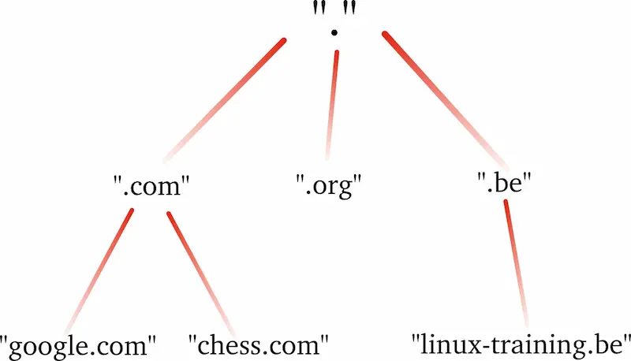

根域名是`.`

顶级域名`.com`,`.org`等

二级域名(主要购买的是二级域名)`baidu`.com,`bilibili`.com

三级域名及以上,是在二级域名上自定义的域名`www`.baidu.com 

#### DNS解析流程

浏览器输入域名`www.baidu.com`访问后进行**递归查询**:

1. 访问浏览器的缓存
2. 访问本地的HOSTS文件
3. 访问操作系统的缓存
4. 访问手动配置或自动获取的的本地DNS(LDNS Local DNS)或运营商的缓存
   例如223.5.5.5在阿里云
5. 若运营商缓存不存在该记录,则会进行**迭代查询**:
   1. LDNS前往根域名服务器查询,根域名服务器存储一级域名(.com)服务器的IP地址
   2. LDNS前往`.com`服务器查询权威域名服务器(baidu.com)的IP地址
   3. LDNS前往`baidu.com`服务器查询`www.baidu.com`的服务器IP地址.baidu.com服务器会查询自己的A记录解析并返回给LDNS(A记录:域名和IP的对应关系)
6. LDNS查询到IP后缓存然后返回给浏览器

### DHCP

动态主机设置协议(dynamic host configuration protocol),是一个用于IP网络的网络协议,位于应用层,使用UDP协议工作,主要有两个用途:

1. 用于内部网络或网络服务商自动分配IP地址给用户
2. 用于内部网络管理员对所有电脑作中央处理

### ARP

把IP地址解析成MAC地址的协议

### ICMP


### NAT  

### ssh远程连接

ssh远程连接失效的排查

1. 使用`ping`命令观察能否ping通
2. 检查防火墙,安全设备,安全规则等是否拦截
3. 使用`telnet`命令检查端口是否开放了服务

## 抓包

### wireshark

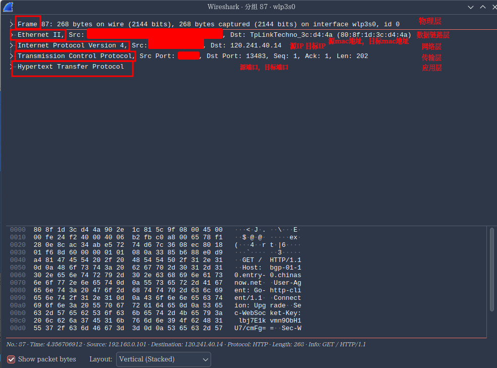


## 命令

### ping

`ping`命令使用**ICMP**协议

### telnet

`telnet`命令用于检查端口是否正在运行:

```
telnet 10.0.0.200 80

Trying 10.0.0.200...
Connected to 10.0.0.200.
Escape character is '^]'.
```

### firewall-cmd

`firewall-cmd`命令用于控制防火墙

```
 # 开放http服务
firewall-cmd --permanent --add-service=http
# 开放https服务
firewall-cmd --permanent --add-service=https
# 重载配置
firewall-cmd --reload
# 显示所有已开放的服务器
firewall-cmd --list-service
dhcpv6-client http https ssh
```

### ss

**ss命令** 用来显示处于活动状态的套接字信息。ss命令可以用来获取socket统计信息，它可以显示和netstat类似的内容。但ss的优势在于它能够显示更多更详细的有关TCP和连接状态的信息，而且比netstat更快速更高效。

```bash
ss -an | grep 10.0.0.7:80
tcp    ESTAB      0      0      10.0.0.7:80                 10.0.0.1:60996              
tcp    ESTAB      0      0      10.0.0.7:80                 10.0.0.1:60982              
```


### netstat

**netstat命令** 用来打印Linux中网络系统的状态信息,可以用来查看系统服务是否开启(显示对应的端口).

参数:

```bash
-t或--tcp：显示TCP传输协议的连线状况；
-n或--numeric：直接使用ip地址，而不通过域名服务器；
-u或--udp：显示UDP传输协议的连线状况；
-l或--listening：显示监控中的服务器的Socket；
-p或--programs：显示正在使用Socket的程序识别码和程序名称；
```

例如:

```bash
netstat -tnulp
Active Internet connections (only servers)
Proto Recv-Q Send-Q Local Address           Foreign Address         State       PID/Program name    
tcp        0      0 0.0.0.0:111             0.0.0.0:*               LISTEN      946/rpcbind         
tcp        0      0 0.0.0.0:80              0.0.0.0:*               LISTEN      1801/nginx: master  
tcp        0      0 0.0.0.0:22              0.0.0.0:*               LISTEN      1348/sshd           
tcp        0      0 127.0.0.1:25            0.0.0.0:*               LISTEN      1533/master         
tcp6       0      0 :::111                  :::*                    LISTEN      946/rpcbind         
tcp6       0      0 :::22                   :::*                    LISTEN      1348/sshd           
tcp6       0      0 ::1:25                  :::*                    LISTEN      1533/master         
udp        0      0 0.0.0.0:111             0.0.0.0:*                           946/rpcbind         
udp        0      0 0.0.0.0:692             0.0.0.0:*                           946/rpcbind         
udp6       0      0 :::111                  :::*                                946/rpcbind         
udp6       0      0 :::692                  :::*                                946/rpcbind       
```

### netcat

```
nc是netcat的简写，有着网络界的瑞士军刀美誉。因为它短小精悍、功能实用，被设计为一个简单、可靠的网络工具

#常用选项

-l #用于指定nc将处于侦听模式。
-u #指定nc使用UDP协议，默认为TCP
-v #输出交互或出错信息，新手调试时尤为有用
-w #超时秒数，后面跟数字
-z #表示zero，表示扫描时不发送任何数据
```

### traceroute

**traceroute命令**用于追踪数据包在网络上的传输时的全部路径,通过traceroute我们可以知道信息从你的计算机到互联网另一端的主机是走的什么路径.

### nmap

**nmap命令** 是一款开放源代码的网络探测和安全审核工具，它的设计目标是快速地扫描大型网络。

**使用nmap扫描www.jsdig.com的开放端口**

```shell
[root@localhost ~]# nmap www.jsdig.com

Starting Nmap 4.11 ( http://www.insecure.org/nmap/ ) at 2013-12-28 00:06 CST
Interesting ports on 100-42-212-8.static.webnx.com (100.42.212.8):
Not shown: 1678 filtered ports
PORT   STATE service
22/tcp open  ssh
80/tcp open  http

Nmap finished: 1 IP address (1 host up) scanned in 45.870 seconds
```

### iftop

`traceroute bilibili.com`

## 工具

### [Comcast](https://github.com/tylertreat/comcast)

Comcast是一款专为模拟常见网络问题（如延迟、带宽限制以及丢包/乱序/损坏数据包）而设计的工具

## 题目

### 路由器

### 为什么把两个交换机互联并不能进行网段间的通信呢?

交换机的核心功能是在同一个广播域内进行高校的帧交换.当一台设备需要与另一设备通信时,若另一设备与源设备不在同一网段中,源设备并不会使用ARP广播搜寻目标设备的MAC地址,而是通过ARP广播询问默认网关的MAC地址并将打包好的帧传输给默认网关.若没有配置默认网关,则会直接导致通信失败.

即使在某种情况下源设备知道了目标设备的IP地址并通过交换机的泛洪传递到了目标设备,通信也只是单项的.目标设备在检查到源IP后回复包时依旧会计算出目标IP不在同一网段并将其发送到默认网关中导致通信失败.

## 参考链接:

1. https://www.cnblogs.com/realjimmy/p/12930797.html


