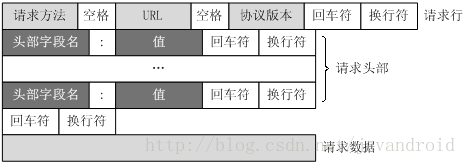
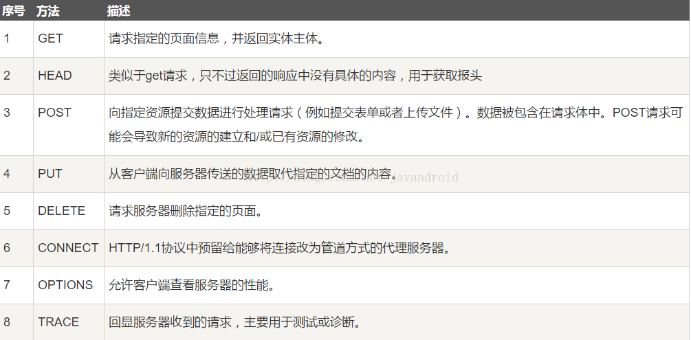
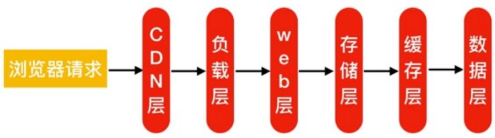

# 协议

## 应用层

### HTTP协议

Hyper Text Transfer Protocol,超文本传输协议

> 超文本(Hyper Text):
>
> 包含有超链接(Link)和各种多媒体元素标记(Markup)的文本。这些超文本文件彼此链接，形成网状(Web)，因此又被称为网页(Web Page)。这些链接使用URL表示。最常见的超文本格式是超文本标记语言HTML。

通过HTTP或者HTTPS协议请求的资源由**统一资源标识符**（Uniform Resource Identifiers，URI）来标识。

> URI由三部分组成：[统一资源名称](https://zh.wikipedia.org/wiki/统一资源名称)（URN），作为对象的逻辑名称；[统一资源属性](https://zh.wikipedia.org/w/index.php?title=统一资源属性&action=edit&redlink=1)（URC），作为对象的元数据；[统一资源定位器](https://zh.wikipedia.org/wiki/统一资源定位器)（URL），作为对象的定位和获取。

> URL俗称网页地址，简称**网址**，是[因特网](https://zh.wikipedia.org/wiki/因特网)上标准的资源的地址（Address），如同在網路上的門牌。

HTTP将从因特网获取信息的五个基本元素包括在一个简单的地址中：

1. 传送协议
2. 层级URL标记符号（为“//”，固定不变）
3. 访问资源需要的凭证信息（可省略）
4. [服务器](https://zh.wikipedia.org/wiki/服务器)（通常为[域名](https://zh.wikipedia.org/wiki/域名)，有时为[IP地址](https://zh.wikipedia.org/wiki/IP地址)）
5. 端口号（以数字方式表示，若为默认值可省略）
6. 路径（以“/”字符区别路径中的每一个目录名称）
7. 查询（GET请求的表单参数，以“?”字符为起点，每个参数以“&”隔开，再以“=”分开参数名称与资料，通常以UTF-8的URL编码，避开字符冲突的问题）
8. 片段（以“#”字符为起点）

#### HTTP工作流程

当用户点击URL为`www.bilibili.com`的链接后,浏览器执行以下动作:

1. 分析超链接中的URL
2. 浏览器向DNS请求解析`www.bilibili.com`的IP地址
3. DNS服务器将解析出的IP地址返回给浏览器
4. 浏览器与服务器建立TCP连接(80端口)
5. 浏览器发送GET请求,请求文档
6. 服务器返回index.html文档给浏览器
7. 释放TCP连接
8. 浏览器显示index.html中的内容

#### HTTP请求报文

一个HTTP请求报文由请求行,请求头,空行和请求数据四个部分组成

1. 请求行:
   请求行包括请求方法,URL,HTTP协议三个字段组成,用空格分隔

   请求方法:

2. 请求头:
   请求头有关键字/值对组成,每行一对,关键字和值之间用`:`分隔,保存客户端请求的相关信息,典型的请求头:

   1. User-Agent：产生请求的浏览器类型。
   2. Accept：客户端可识别的内容类型列表。
   3. Host：请求的主机名，允许多个域名同处一个IP地址，即虚拟主机。

3. 空行,通知服务器以下不再有请求头

4. 请求数据,请求数据不在GET等方法中使用

> 请求头:
>
> | 头(header)      | 类型 | 说明                                               |
> | --------------- | ---- | -------------------------------------------------- |
> | User- Agent     | 请求 | 关于浏览器和它平台的信息，如Mozilla5.0             |
> | Accept          | 请求 | 客户能处理的页面的类型，如text/html                |
> | Accept-Charset  | 请求 | 客户可以接受的字符集，如Unicode-1-1                |
> | Accept-Encoding | 请求 | 客户能处理的页面编码方法，如gzip                   |
> | Accept-Language | 请求 | 客户能处理的自然语言，如en(英语)，zh-cn(简体中文） |
> | Host            | 请求 | 服务器的DNS名称。从URL中提取出来，必需。           |
> | Referer         | 请求 | 用户从该URL代表的页面出发访问当前请求的页面        |
> | Cookie          | 请求 | 将以前设置的Cookie送回服务器器，可用来作为会话信息 |
> | Date            | 双向 | 消息被发送时的日期和时间                           |
>
> | 头(header)       | 类型 | 说明                                                 |
> | ---------------- | ---- | ---------------------------------------------------- |
> | Server           | 响应 | 关于服务器的信息，如Microsoft-IIS/6.0                |
> | Content-Encoding | 响应 | 内容是如何被编码的（如gzip)                          |
> | Content-Language | 响应 | 页面所使用的自然语言                                 |
> | Content-Length   | 响应 | 以字节计算的页面长度                                 |
> | Content-Type     | 响应 | 页面的MIME类型                                       |
> | Last-Modified    | 响应 | 页面最后被修改的时间和日期，在页面缓存机制中意义重大 |
> | Location         | 响应 | 指示客户将请求发送给别处，即重定向到另一个URL        |
> | Set-Cookie       | 响应 | 服务器希望客户保存一个Cookie                         |

> UA字段(User-Agent):浏览器标识(操作系统标识;加密等级标识;浏览器语言标识)
>
> SERVER字段:响应头包含处理请求的原始服务器的软件信息
>
> Preferer字段:浏览器向WEB服务器表明自己是从哪个URL获得(点击)当前请求中的URL
>
> Location字段:重定向

#### HTTP响应信息

服务器接收并解释请求消息后，用 HTTP 响应消息进行响应:

- 状态行:
  - HTTP版本
  - 状态码:三位数,表示请求的处理结果
  - 状态信息:状态码的简短描述
  - 示例:`HTTP/1.1 200 OK`
- 响应头(零个或多个标头(常规|响应|实体)字段)，后跟CRLF(回车换行符)
  - 常见的响应头包括`Content-Type`、`Content-Length`、`Server`、`Set-Cookie`等
- 空行(即CRLF前面没有任何内容的行)指示标头字段的结尾
- 可选响应体

> 状态码(Status-Code)是响应报文状态行中包含的一个3位数字，指明特定的请求是否被满足，如果没有满足，原因是什么。状态码分为以下五类：
>
> | 状态码 | 含义       | 例子                             |
> | ------ | ---------- | -------------------------------- |
> | 1xx    | 通知信息   | 100=服务器正在处理客户请求       |
> | 2xx    | 成功       | 200=请求成功(OK)                 |
> | 3xx    | 重定向     | 301=页面改变了位置               |
> | 4xx    | 客户错误   | 403=禁止的页面；404=页面未找到   |
> | 5xx    | 服务器错误 | 500=服务器内部错误；503=以后再试 |

#### HTTP访问架构流程:

1. 客户端发送HTTP请求,请求会先到达前端的防火墙
2. 防火墙识别用户身份,正常的请求通过内部交换机使用TCP连接后端的负载均衡服务并传递用户的http请求
3. 负载均衡服务收到请求,会根据请求的内容进行下发任务,通过TCP连接后端的web,转发用户的http请求
4. web接收到用户的http请求后,根据用户请求的内容进行解析:
   - 静态请求:web直接访问资源给负载均衡服务->防火墙->用户
   - 动态请求:web向后端的动态程序建立TCP连接,将用户的动态http请求传递至动态程序,由动态程序进行解析
5. 动态程序在解析的过程中,如果碰到查询数据库请求,则优先与缓存建立tcp连接,并发起数据查询操作.
6. 如果缓存没有对应的数据,动态程序再次向数据库建立tcp连接,并发起查询操作.
7. 最后数据由数据库->动态程序->缓存->web服务->负载均衡->防火墙->用户.

