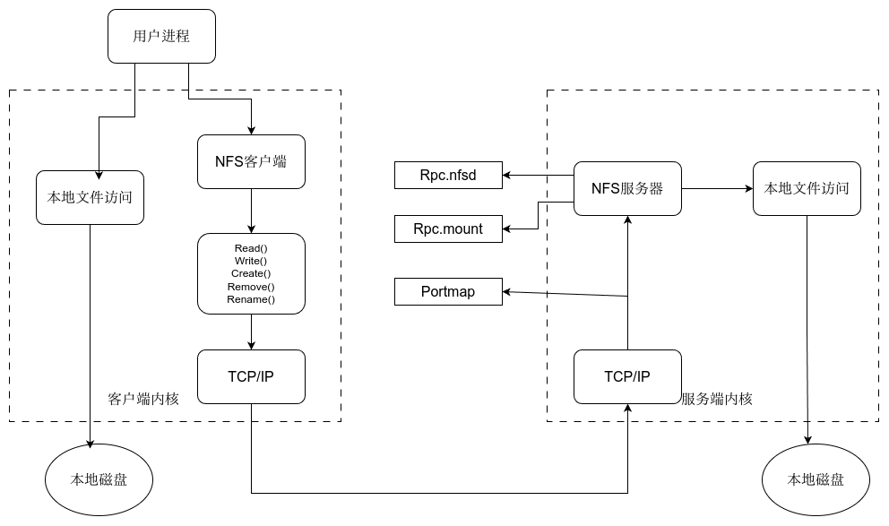

# RSYNC

`rsync`是一个远程数据同步工具,可以在本机与远程机之间进行**增量**传输

## 语法:

```bash
rsync [OPTION]... SRC DEST
rsync [OPTION]... SRC [USER@]host:DEST
rsync [OPTION]... [USER@]HOST:SRC DEST
rsync [OPTION]... [USER@]HOST::SRC DEST
rsync [OPTION]... SRC [USER@]HOST::DEST
rsync [OPTION]... rsync://[USER@]HOST[:PORT]/SRC [DEST]
```

对应于以上六种格式的语法,rsync有六种不同的工作模式:

1. 拷贝本地文件
   `rsync -a /data /backup`
2. 本地拷贝到远程(DST有:)
   `rsync -avz *.c foo:src`
3. 远程拷贝到本地(SRC有:)
   `rsync -avz foo:src/bar /data`
4. 从远程rsync服务器拷贝文件到本机(SRC有::)
   `rsync -av root@192.168.78.192::www /databack`
5. 从本地拷贝文件到rsync服务器中(DST有::)
   `rsync -av /databack root@192.168.78.192::www`
6. 列出远程机器的文件列表(命令中省略掉本机信息)
   `rsync -v rsync://192.168.78.192/www`

## 案例:

### 拷贝本地文件
`rsync [OPTION]... SRC DEST`

```bash
[root@backup ~]#rsync -avz 111.txt /opt
sending incremental file list
111.txt

sent 86 bytes  received 35 bytes  242.00 bytes/sec
total size is 0  speedup is 0.00
[root@backup ~]#ll /opt
total 0
-rw-r--r-- 1 root root 0 Jun  5 15:34 111.txt
[root@backup ~]#rsync -avz 111.txt /opt
sending incremental file list
# 此处没有显示具体文件,表明rsync是增量复制

sent 46 bytes  received 12 bytes  116.00 bytes/sec
total size is 0  speedup is 0.00
```

`-a`archive,存档,`-v`显示细节,`-z`compress,压缩

### 拷贝远程文件到本地:

```bash
rsync -avz root@10.0.0.41:/root/111.txt ./
The authenticity of host '10.0.0.41 (10.0.0.41)' can't be established.
ECDSA key fingerprint is SHA256:HJ/Kz/R2UzNBC4Sg7u06FvZd4cK83ia9wfExCxlk2kk.
ECDSA key fingerprint is MD5:3f:45:64:4c:3b:2b:31:8d:29:3b:06:89:1a:9d:ee:1d.
Are you sure you want to continue connecting (yes/no)? yes
Warning: Permanently added '10.0.0.41' (ECDSA) to the list of known hosts.
root@10.0.0.41's password: 
receiving incremental file list
111.txt

sent 43 bytes  received 99 bytes  11.36 bytes/sec
total size is 9  speedup is 0.06
```

同样也是增量备份

### 守护进程模式(rsync服务器):

使用远程访问模式时,rsync借助SSH协议同步数据,存在缺陷:

1. 当使用系统用户时不安全
2. 使用普通用户时可能会导致权限不足的问题

因此可以使用rsync的守护进程模式,它可以不使用系统用户

查看配置文件`/etc/rsyncd.conf`:

`````bash
cat /etc/rsyncd.conf 
# /etc/rsyncd: configuration file for rsync daemon mode

# See rsyncd.conf man page for more options.

# configuration example:

# uid = nobody	# 运行的用户
# gid = nobody	# 运行的用户组
# use chroot = yes	# 禁锢推送的数据至某个目录,不允许跳出
# max connections = 4	# 最大连接数
# pid file = /var/run/rsyncd.pid	
# exclude = lost+found/	
# transfer logging = yes
# timeout = 900		# 超时时间
# ignore nonreadable = yes	# 忽略错误信息
# dont compress   = *.gz *.tgz *.zip *.z *.Z *.rpm *.deb *.bz2

# [ftp]
#        path = /home/ftp
#        comment = ftp export area
`````

#### 修改配置文件:

``` bash
cat /etc/rsyncd.conf 
uid = rsync
gid = rsync
port = 873
fake super = yes
use chroot = no
max connections = 200
timeout = 600
ignore errors
read only = false
list = false
auth users = rsync_backup
secrets file = /etc/rsync.passwd
log file = /var/log/rsyncd.log

[backup]
comment = backup module
path = /backup

[test]
comment = this is a test module for auth
path = /test
auth users = rsync_test
secerts file = /etc/rsync.passwd
```

#### 创建必要的文件

##### 创建虚拟用户rsync

`````bash
useradd -M -s /sbin/nologin rsync
id rsync
uid=1000(rsync) gid=1000(rsync) groups=1000(rsync)
`````

##### 创建密码文件

````bash
cat /etc/rsync.passwd
rsync_backup:123456
rsync_test:123
````

##### 修改密码文件权限为600

大多数密码文件都是600权限

```bash
[root@backup ~]#chmod 600 /etc/rsync.passwd 
[root@backup ~]#ll /etc/rsync.passwd 
-rw------- 1 root root 35 Jun  5 16:35 /etc/rsync.passwd
```

##### 创建数据目录并修改权限

```bash
[root@backup ~]#chown rsync:rsync /backup/
[root@backup ~]#chown rsync:rsync /test/
```

##### 启动服务

```bash
[root@backup ~]#systemctl start rsyncd
```

可以看到服务的端口号为873:

```bash
[root@backup ~]#netstat -tnulp
Active Internet connections (only servers)
Proto Recv-Q Send-Q Local Address           Foreign Address         State       PID/Program name    
tcp        0      0 0.0.0.0:873             0.0.0.0:*               LISTEN      2374/rsync          
tcp        0      0 0.0.0.0:22              0.0.0.0:*               LISTEN      1335/sshd           
tcp        0      0 127.0.0.1:25            0.0.0.0:*               LISTEN      1480/master         
tcp6       0      0 :::873                  :::*                    LISTEN      2374/rsync          
```

####　推送到服务器

在客户端尝试推送:

```bash
[root@nfs ~]#rsync -avz 111.txt  rsync_backup@10.0.0.41::backup
Password: 
sending incremental file list
111.txt

sent 98 bytes  received 43 bytes  31.33 bytes/sec
total size is 5  speedup is 0.04
```

上面是推送到backup模块,也可以推送到test模块:

```bash
[root@nfs ~]#rsync -avz 111.txt  rsync_test@10.0.0.41::test
Password: 
sending incremental file list
111.txt

sent 98 bytes  received 43 bytes  56.40 bytes/sec
total size is 5  speedup is 0.04

# 使用rsync_backup用户并不能推送到test模块中:
[root@nfs ~]#rsync -avz 222.txt  rsync_backup@10.0.0.41::test
Password: 
@ERROR: auth failed on module test
rsync error: error starting client-server protocol (code 5) at main.c(1656) [sender=3.1.2]
```

## 参数

### 密码

rsync可以默认使用交互式密码,也可以通过下面两种方式:

1. 通过文件传输密码:
   ```bash
   rsync -avz /etc/hosts rsync_backup@172.16.1.41::backup --password-file=/etc/rsync.pass
   ```

2. 读取环境变量`RSYNC_PASSWORD`的值

### 无差异同步

可以使用`--delete`参数进行无差异同步,将以SRC中的数据为基础将DEST的数据完全同步,缺失的添加,多余的删除

```bash
# 以本机为准,同步172.16.1.7服务器上的数据
rsync -avz --delete /opt/backup 172.16.1.7:/opt/backup
```

### 带宽限速

`--bwlimit`参数可以限速.例如`--bwlimit 1M`

## 要求

### 客户端

编写shell脚本:``/server/scripts/test.sh`:
``` bash
# 准备存放备份的目录,以主机名称IP地址和时间命名
Date=`date +%F-%H-%M`
dir=`hostname`_`hostname -I|awk '{print $1}'`_$Date
mkdir -p /backup/$dir

# 客户端在本地打包备份存放至创建的目录中
tar zcf /backup/$dir/etc_$Date.tar.gz /etc/hosts /etc/passwd
 &>/dev/null
 
# 计算MD5值写入md5.log中
md5sum /backup/$dir/*.tar.gz > /backup/$dir/md5.log

# 客户端将备份的数据进行推送至备份服务器
export RSYNC_PASSWORD=123456
rsync -az /backup/$dir rsync_backup@172.16.1.41::backup

# 客户端本地保留最近7天的数据,避免浪费磁盘空间
find /backup/ -mtime +7|xargs rm -rf
```


### 服务端

1. 部署rsync服务,安装,配置,启动,检查

2. 校验并将结果通过邮件发送:

   1. 创建文件夹:
      ```bash
      mkdir -p /server/scripts
      cd /server/scripts
      ```

   2. 配置邮件服务:
      ```bash
      vim /etc/mail.rc
      
      set from=253097001@qq.com
      set smtp=smtps://smtp.qq.com:465
      set smtp-auth-user=253097001@qq.com
      set smtp-auth-password=#客户端授权码
      set smtp-auth=login
      set ssl-verify=ignore
      set nss-config-dir=/etc/pki/nssdb/
      ```

   3. 编写`/server/scripts/check.sh`脚本
      ```bash
      # 校验客户端推送的数据是否完整
      Date=`date +%F`
      md5sum -c /backup/*_*_*/*.log > /backup/$Date.log
      
      # 将校验后的结果发送到邮箱
      if [ `grep FAILED /backup/$Date.log|wc -l` -ge 1 ];then
      mail -s "$Date 检查结果" 2334537366@qq.com < /backup/$Date.log &>/dev/null
      fi
      
      # 删除180天前的数据
      find /backup -mtime +180|xargs rm -rf
      ```

# NFS

NFS(Network File System)网络文件系统,主要功能是通过局域网让不同主机系统之间可以共享文件或目录

如果没有共享存储,可能会出现因为负载均衡调度导致用户访问的web服务器上没有用户所需的文件.



客户端本地命令经过shell解释器翻译给内核,内核解析后驱动对应的硬件设备完成相应的操作,而使用NFS时,客户端的命令会被NFS客户端翻译为不同的函数后通过TCP/IP传输给服务器,服务器在其本地进行文件访问.
NFS局限:

1. 不能集群,存在单点故障(可以将backup服务器临时充当NFS服务器),构建高可用维护麻烦
2. NFS数据明文存储,切未对数据做任何校验
3. 客户端挂载NFS没有密码验证,安全性一般(适合内网使用)

##　服务

nfs服务端主要有三个服务:

### Rpc.nfsd

守护进程,管理客户端是否能够登录服务器

### Rpc.mount

管理NFS的文件系统.当客户端通过nfsd登录NFS服务器后,在使用NFS提供的文件前还必须通过文件使用权限的验证.通过读取NFS的配置文件`/etc/exports`来对比客户端权限

### Portmap

主要功能是进行端口映射

> 多个客户端在挂载磁盘时,并不是针对服务端的同一个端口通过TCP/IP协议传输数据,而是每个客户端对应一个单独的端口,Portmap服务即用来管理这些端口

## 部署

### 服务端

IP:10.0.0.31

1. 安装软件包:

   ```bash
   yum -y install nfs-utils
   ```

2. 配置文件

   ``` bash
   vim /etc/exports
   
   /data/nfs/ 172.16.1.0/24(rw,sync,all_squash)
   # 挂载目录 /data/nfs
   # 允许的网段
   # rw 挂载后可以读写,ro是只读
   # sync 将数据同时写入到内存和磁盘中,默认先写入到内存中,等待一段时间后写入到磁盘中
   # all_squash 将所有来源用户全部压缩为虚拟用户身份往本地磁盘中写入
   ```

3. 创建数据文件夹并修改权限

   ```bash
   [root@nfs ~]#mkdir -p /data/nfs
   [root@nfs ~]#ll /data/
   total 0
   drwxr-xr-x 2 root root 6 Jun  6 11:49 nf
   
   [root@nfs ~]#chown nfsnobody:nfsnobody /data/nfs/
   ```

4. 启动服务

   ``` bash
   systemctl enable --now nfs
   ```

5. 检查服务

   ```bash
   cat /var/lib/nfs/etab
   
   /data/nfs       172.16.1.0/24(rw,sync,wdelay,hide,nocrossmnt,secure,root_squash,all_squash,no_subtree_check,secure_locks,acl,no_pnfs,anonuid=65534,anongid=65534,sec=sys,rw,secure,root_squash,all_squash)
   ```

   可以看到使用的虚拟用户是nfsnobody:

   ```bash
   grep 65534 /etc/passwd
   nfsnobody:x:65534:65534:Anonymous NFS User:/var/lib/nfs:/sbin/nologin
   ```

### 客户端

客户端不需要启动nfs服务.

1. 安装软件包(同样是nfs-utils)
   ```bash
   yum -y install nfs-utils
   ```

2. 挂载
   ```bash
   [root@nfs mnt]#showmount -e 172.16.1.31
   Export list for 172.16.1.31:
   /data/nfs 172.16.1.0/24
   [root@nfs mnt]#mount -t nfs 172.16.1.31:/data/nfs /mnt
   [root@nfs mnt]#df -h
   Filesystem             Size  Used Avail Use% Mounted on
   devtmpfs               2.0G     0  2.0G   0% /dev
   tmpfs                  2.0G     0  2.0G   0% /dev/shm
   tmpfs                  2.0G   12M  2.0G   1% /run
   tmpfs                  2.0G     0  2.0G   0% /sys/fs/cgroup
   /dev/sda3               16G  2.3G   14G  15% /
   /dev/sda1              197M  110M   88M  56% /boot
   tmpfs                  394M     0  394M   0% /run/user/0
   172.16.1.31:/data/nfs   16G  2.3G   14G  15% /mnt
   ```

3. 写入
   ```bash
   touch a.txt
   ```

4. 检查
   ```bash
   [root@nfs nfs]#ll /data/nfs
   total 0
   -rw-r--r-- 1 nfsnobody nfsnobody 0 Jun  6 12:10 a.txt
   ```

   可以看到即使客户端的身份是root,实际写入到文件中的依旧是nfsnobody

5. 开机自动挂载
   ```bash
   vim /etc/fstab
   
   172.16.1.31:/data/nfs                    /mnt                    nfs     defaults        0 0
   ```

> 通常NFS服务器共享的只是静态资源,挂载的时候可以通过`mount -t nfs -o nosuid,noexec,nodev 172.16.1.31:/data/nfs /mnt`来禁止文件的suid,exec等权限,增加安全性.
> 例如很多木马篡改站点文件都是由上传入口上传的程序到存储目录然后执行的.

> 由于centos7.x启动时并行启动各项服务,可能会导致fstab中的网络挂载不成功(fstab服务在网络服务器启动前),可以写入/etc/rc.local文件最后运行.

## 服务端选项

| nfs共享参数     | 参数作用                                                     |
| --------------- | ------------------------------------------------------------ |
| rw              | 读写                                                         |
| ro              | 只读                                                         |
| root_squash     | 当NFS客户端以root管理员访问时，映射为NFS服务器的匿名用户(不常用) |
| no_root_squash  | 当NFS客户端以root管理员访问时，映射为NFS服务器的root管理员(不常用) |
| all_squash      | 无论NFS客户端使用什么账户访问，均映射为NFS服务器的匿名用户(常用) |
| no_all_squash   | 无论NFS客户端使用什么账户访问，都不进行压缩                  |
| sync            | 同时将数据写入到内存与硬盘中，保证不丢失数据                 |
| async           | 优先将数据保存到内存，然后再写入硬盘；这样效率更高，但可能会丢失数据 |
| anonuid/anongid | 配置all_squash使用,指定NFS的用户UID/GUID,必须存在系统        |

# Sersync

实时同步是指当一个目录发生变化时就触发一个事件将变化的目录同步到远程服务器,保证数据的连续性,减少维护成本,解决NFS单点故障等.

例如当监听到NFS服务器的/data目录发生变化时,对backup服务器进行同步:
```
rsync -avz /data  rsync_backup@10.0.0.41::backup
```

实时同步工具可以使用`inotify`,它是一个通知接口,用来监控文件系统的各种变化,如果文件存取,删除,移动.可以非常方便地实现文件异动告警,增量备份,并针对目录或文件变化及时作出响应.和rsync配合使用可以实现触发式实时同步增量备份.

[sersync](https://github.com/wsgzao/sersync)是根据`rsync+inotify-tools`开发的工具.

## 安装

下载和安装

```bash
# 必要软件包
yum install -y rsync inotify-tools

# 从仓库下载
curl -O https://github.com/wsgzao/sersync/blob/master/sersync2.5.4_64bit_binary_stable_final.tar.gz

# 解压缩
tar -zxvf sersync2.5.4_64bit_binary_stable_final.tar.gz
```

## 配置:

```xml
[root@nfs nfs]#cat /server/tools/sersync/confxml.xml 
<?xml version="1.0" encoding="ISO-8859-1"?>
<head version="2.5">
    <host hostip="localhost" port="8008"></host>
    <debug start="false"/>
    <fileSystem xfs="false"/>
    <filter start="false">
        <exclude expression="(.*)\.svn"></exclude>
        <exclude expression="(.*)\.gz"></exclude>
        <exclude expression="^info/*"></exclude>
        <exclude expression="^static/*"></exclude>
    </filter>
    <inotify>
        <delete start="true"/>
        <createFolder start="true"/>
        <createFile start="true"/>	# 允许创建文件
        <closeWrite start="true"/>
        <moveFrom start="true"/>
        <moveTo start="true"/>
        <attrib start="false"/>
        <modify start="false"/>
    </inotify>

    <sersync>
        # 配置要监听的目录
        <localpath watch="/data/nfs">
            # 远程IP与模块
            <remote ip="172.16.1.41" name="data"/>
            <!--<remote ip="192.168.8.39" name="tongbu"/>-->
            <!--<remote ip="192.168.8.40" name="tongbu"/>-->
        </localpath>
        <rsync>
            # rsync参数
            <commonParams params="-avz"/>
            <auth start="true" users="rsync_backup" passwordfile="/etc/rsync.pas"/>
            <userDefinedPort start="false" port="874"/><!-- port=874 -->
            <timeout start="false" time="100"/><!-- timeout=100 -->
            <ssh start="false"/>
        </rsync>
        <failLog path="/tmp/rsync_fail_log.sh" timeToExecute="60"/><!--default every 60mins execute once-->
        <crontab start="false" schedule="600"><!--600mins-->
            <crontabfilter start="false">
                <exclude expression="*.php"></exclude>
                <exclude expression="info/*"></exclude>
            </crontabfilter>
        </crontab>
        <plugin start="false" name="command"/>
    </sersync>

    <plugin name="command">
        <param prefix="/bin/sh" suffix="" ignoreError="true"/>  <!--prefix /opt/tongbu/mmm.sh suffix-->
        <filter start="false">
            <include expression="(.*)\.php"/>
            <include expression="(.*)\.sh"/>
        </filter>
    </plugin>

    <plugin name="socket">
        <localpath watch="/opt/tongbu">
            <deshost ip="192.168.138.20" port="8009"/>
        </localpath>
    </plugin>
    <plugin name="refreshCDN">
        <localpath watch="/data0/htdocs/cms.xoyo.com/site/">
            <cdninfo domainname="ccms.chinacache.com" port="80" username="xxxx" passwd="xxxx"/>
            <sendurl base="http://pic.xoyo.com/cms"/>
            <regexurl regex="false" match="cms.xoyo.com/site([/a-zA-Z0-9]*).xoyo.com/images"/>
        </localpath>
    </plugin>
</head>
```

## 创建密码文件及赋权

```bash
echo 123456 > /etc/rsync.pas 

# 如果不设置为600会报错:
# ERROR: password file must not be other-accessible
chmod 600 /etc/rsync.pas 
```

## 运行`sersync`:

```bash
[root@nfs nfs]#/server/tools/sersync/sersync2 -dro /server/tools/sersync/confxml.xml 

set the system param
execute：echo 50000000 > /proc/sys/fs/inotify/max_user_watches
execute：echo 327679 > /proc/sys/fs/inotify/max_queued_events
parse the command param
option: -d      run as a daemon
option: -r      rsync all the local files to the remote servers before the sersync work
option: -o      config xml name：  /server/tools/sersync/confxml.xml
daemon thread num: 10
parse xml config file
host ip : localhost     host port: 8008
will ignore the inotify createFile event 
daemon start，sersync run behind the console 
use rsync password-file :
user is rsync_backup
passwordfile is         /etc/rsync.pas
config xml parse success
please set /etc/rsyncd.conf max connections=0 Manually
sersync working thread 12  = 1(primary thread) + 1(fail retry thread) + 10(daemon sub threads) 
Max threads numbers is: 22 = 12(Thread pool nums) + 10(Sub threads)
please according your cpu ，use -n param to adjust the cpu rate
------------------------------------------
rsync the directory recursivly to the remote servers once
working please wait...
execute command: cd /data/nfs && rsync -avz -R --delete ./ rsync_backup@172.16.1.41::data --password-file=/etc/rsync.pas >/dev/null 2>&1 
run the sersync: 
watch path is: /data/nfs
```

可以看到实际运行的rsync指令是:
`rsync_backup@172.16.1.41::data --password-file=/etc/rsync.pas >/dev/null 2>&1 `
