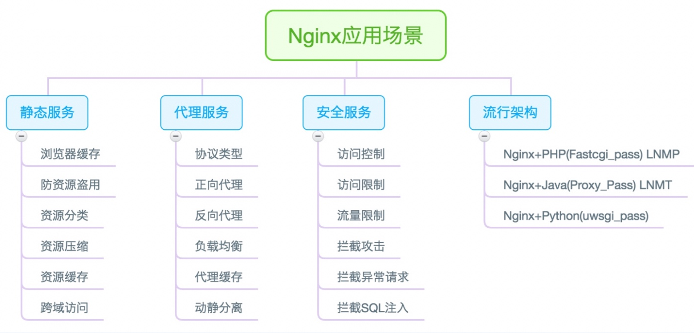

# Nginx

Nginx是一个开源,高性能,可靠的Http Web服务,代理服务.

Nginx非常轻量,功能模块少,代码模块化,静态资源处理较快



nginx 本身就是一个反向代理服务器

> 反向代理:
> **反向代理**（**Reverse proxy**）在是代理服务器的一种。服务器根据[客户端](https://zh.wikipedia.org/wiki/客户端)的请求，从其关系的一组或多组后端[服务器](https://zh.wikipedia.org/wiki/服务器)（如[Web服务器](https://zh.wikipedia.org/wiki/Web服务器)）上获取资源，然后再将这些资源返回给客户端，客户端只会得知反向代理的IP地址，而不知道在代理服务器后面的服务器集群的存在.
>
> 反向代理的主要作用为：
>
> - 对客户端隐藏服务器（集群）的IP地址
> - 负载均衡:若服务器集群中有负荷较高者，反向代理通过[URL重写](https://zh.wikipedia.org/wiki/URL重寫)，根据连线请求从负荷较低者获取与所需相同的资源或备援
> - 缓存:对于静态内容及短时间内有大量访问请求的动态内容提供[缓存服务](https://zh.wikipedia.org/wiki/Web缓存)
> - 压缩:对一些内容进行[压缩](https://zh.wikipedia.org/wiki/資料壓縮)，以节约[带宽](https://zh.wikipedia.org/wiki/頻寬)或为网络带宽不佳的网络提供服务
> - 外网发布:为在私有网络下（如[局域网](https://zh.wikipedia.org/wiki/區域網路)）的服务器集群提供[NAT穿透](https://zh.wikipedia.org/wiki/NAT穿透)及外网发布服务
> - 提供HTTP访问认证

## 安装

1. 编译并安装
2. 从epel仓库安装
3. 从nginx官方仓库安装

### 从nginx仓库安装

此时yum还没有nginx官方仓库:

```bash
ll /etc/yum.repos.d/
total 48
-rw-r--r--. 1 root root 2523 Jun  4 12:38 CentOS-Base.repo
-rw-r--r--. 1 root root 1664 Oct 23  2020 CentOS-Base.repo.backup
-rw-r--r--. 1 root root 1309 Oct 23  2020 CentOS-CR.repo
-rw-r--r--. 1 root root  649 Oct 23  2020 CentOS-Debuginfo.repo
-rw-r--r--. 1 root root  314 Oct 23  2020 CentOS-fasttrack.repo
-rw-r--r--. 1 root root  630 Oct 23  2020 CentOS-Media.repo
-rw-r--r--. 1 root root 1331 Oct 23  2020 CentOS-Sources.repo
-rw-r--r--. 1 root root 8515 Oct 23  2020 CentOS-Vault.repo
-rw-r--r--. 1 root root  616 Oct 23  2020 CentOS-x86_64-kernel.repo
-rw-r--r--. 1 root root  664 Aug  4  2022 epel.repo
```

先配置官方仓库:
```bash
# 安装yum-utils
yum install yum-utils

vim /etc/yum.repos.d/nginx.repo

[nginx-stable]
name=nginx stable repo
baseurl=http://nginx.org/packages/centos/$releasever/$basearch/
gpgcheck=1
enabled=1
gpgkey=https://nginx.org/keys/nginx_signing.key
module_hotfixes=true

[nginx-mainline]
name=nginx mainline repo
baseurl=http://nginx.org/packages/mainline/centos/$releasever/$basearch/
gpgcheck=1
enabled=0
gpgkey=https://nginx.org/keys/nginx_signing.key
module_hotfixes=true

yum -y install nginx
```

修改nginx用户:

```
[root@nfs ~]#groupadd www -g 666
[root@nfs ~]#useradd www -u 666 -g 666 -s /sbin/nologin  -M

[root@nfs ~]#vim /etc/nginx/nginx.conf 
user  www;
```

## 配置

### 配置文件

nginx的主配置文件为`/etc/nginx/nginx.conf`

```bash
# 核心区块
user  nginx;	# 启动nginx的虚拟用户
worker_processes  auto;	# 启动子进程的数量,auto以cpu的数量为主

error_log  /var/log/nginx/error.log notice;	# 错误日志
pid        /var/run/nginx.pid;	# 主进程pid存放的目录,检查此文件可以判断nginx是否已经在运行


# 事件模块
events {
    worker_connections  1024;	# 进程的最大连接数(TCP连接)
}

# http模块
http {
    include       /etc/nginx/mime.types;	# 支持的媒体类型
    default_type  application/octet-stream;	# 默认如果媒体类型不存在则自动下载该页面

    log_format  main  '$remote_addr - $remote_user [$time_local] "$request" '
                      '$status $body_bytes_sent "$http_referer" '
                      '"$http_user_agent" "$http_x_forwarded_for"';

    access_log  /var/log/nginx/access.log  main;	# nginx的访问日志(使用上面定义的格式)

    sendfile        on;		# 文件高效传参
    #tcp_nopush     on;	

	# 可以配置为0,即连接请求完后立即断开
    keepalive_timeout  65;	# 长连接的超时时间,单位s

    #gzip  on;				# 传输时是否压缩

    include /etc/nginx/conf.d/*.conf;	# 包含server的业务配置文件
}
```

可以看到配置文件中导入(include)了`include /etc/nginx/conf.d/`文件夹下的配置文件.配置文件中主要是server块的业务配置,一个简单的server配置如下:
```
server{
	listen 80;
	server_name www.test.com;
	
	location / {
		root /code/;
		index index.html;
	}
}
```

上面的文件配置了服务器名(www.test.com),如果用户访问`www.test.com/`则会匹配到该业务,同时根据请求匹配到`location /`下.
资源目录为`/code/`,例如,假如用户请求`www.test.com/image.jpg`服务器会返回`/code/image.png`(如果资源不存在则报404错误).
还设置了默认访问页面,如果用户访问`www.test.com/`,则会返回`/code/index.html`

nginx默认带有一个`default.conf`:

```bash
cat /etc/nginx/conf.d/default.conf 

server {
    listen       80;		# 监听80端口
    server_name  localhost;	# 设置域名

    #access_log  /var/log/nginx/host.access.log  main;

    location / {
        root   /usr/share/nginx/html;
        index  index.html index.htm;
    }

    #error_page  404              /404.html;

    # redirect server error pages to the static page /50x.html
    #
    error_page   500 502 503 504  /50x.html;
    location = /50x.html {
        root   /usr/share/nginx/html;
    }

    # proxy the PHP scripts to Apache listening on 127.0.0.1:80
    #
    #location ~ \.php$ {
    #    proxy_pass   http://127.0.0.1;
    #}

    # pass the PHP scripts to FastCGI server listening on 127.0.0.1:9000
    #
    #location ~ \.php$ {
    #    root           html;
    #    fastcgi_pass   127.0.0.1:9000;
    #    fastcgi_index  index.php;
    #    fastcgi_param  SCRIPT_FILENAME  /scripts$fastcgi_script_name;
    #    include        fastcgi_params;
    #}

    # deny access to .htaccess files, if Apache's document root
    # concurs with nginx's one
    #
    #location ~ /\.ht {
    #    deny  all;
    #}
}
```

#### 区块关系

```bash
核心区块
事件区块
HTTP区块
	server区块(具体业务)
		location区块(路径匹配)
    server区块
    	location区块
```


### 配置多业务

一台服务器上可能需要使用多个不同的应用程序.可以使用三种方式配置.

现在新加一个业务:

```bash
# 新建一个chess.conf文件
server{
  listen 80;
  server_name localhost;

  location / {
    root /code/chess;
    index index.html;
  }
}
# 修改原default.conf的文件名,使其不被导入
mv default.conf default.conf.bak
```

然后从互联网上下载一个静态小游戏放到/code/chess/中即可,我这里使用的是一款[象棋小游戏](https://github.com/itlwei/chess)

现在我们要同时在一台服务器上部署原来的欢迎页面和这个小游戏页面.

#### 多IP地址

首先我们先给自己的eth0网卡添加一个IP:

```bash
[root@nfs conf.d]#ip address add 10.0.0.8/24 dev eth0
[root@nfs conf.d]#ip address
1: lo: <LOOPBACK,UP,LOWER_UP> mtu 65536 qdisc noqueue state UNKNOWN group default qlen 1000
    link/loopback 00:00:00:00:00:00 brd 00:00:00:00:00:00
    inet 127.0.0.1/8 scope host lo
       valid_lft forever preferred_lft forever
    inet6 ::1/128 scope host 
       valid_lft forever preferred_lft forever
2: eth0: <BROADCAST,MULTICAST,UP,LOWER_UP> mtu 1500 qdisc pfifo_fast state UP group default qlen 1000
    link/ether 00:0c:29:55:44:83 brd ff:ff:ff:ff:ff:ff
    inet 10.0.0.7/24 brd 10.0.0.255 scope global eth0
       valid_lft forever preferred_lft forever
    inet 10.0.0.8/24 scope global secondary eth0
       valid_lft forever preferred_lft forever
    inet6 fe80::20c:29ff:fe55:4483/64 scope link 
       valid_lft forever preferred_lft forever
3: eth1: <BROADCAST,MULTICAST,UP,LOWER_UP> mtu 1500 qdisc pfifo_fast state UP group default qlen 1000
    link/ether 00:0c:29:55:44:8d brd ff:ff:ff:ff:ff:ff
    inet 172.16.1.7/24 brd 172.16.1.255 scope global eth1
       valid_lft forever preferred_lft forever
    inet6 fe80::20c:29ff:fe55:448d/64 scope link 
       valid_lft forever preferred_lft forever
```

此时由于我们的nginx配置文件(chess.conf)中配置的服务器地址是`localhost`,因此访问`10.0.0.7`,`10.0.0.8`,`172.16.1.7`三个IP都可以访问到网页.

```bash
# 0.0.0.0表示全网段
[root@nfs conf.d]#netstat -tnulp | grep nginx
tcp        0      0 0.0.0.0:80              0.0.0.0:*               LISTEN      1808/nginx: master  

[root@nfs conf.d]#curl -I 10.0.0.7
HTTP/1.1 200 OK
Server: nginx/1.26.1
Date: Wed, 11 Jun 2025 03:15:53 GMT
Content-Type: text/html
Content-Length: 2427
Last-Modified: Wed, 11 Jun 2025 02:45:40 GMT
Connection: keep-alive
ETag: "6848edd4-97b"
Accept-Ranges: bytes

[root@nfs conf.d]#curl -I 10.0.0.8
HTTP/1.1 200 OK
Server: nginx/1.26.1
Date: Wed, 11 Jun 2025 03:15:56 GMT
Content-Type: text/html
Content-Length: 2427
Last-Modified: Wed, 11 Jun 2025 02:45:40 GMT
Connection: keep-alive
ETag: "6848edd4-97b"
Accept-Ranges: bytes

[root@nfs conf.d]#curl -I 172.16.1.7
HTTP/1.1 200 OK
Server: nginx/1.26.1
Date: Wed, 11 Jun 2025 03:16:05 GMT
Content-Type: text/html
Content-Length: 2427
Last-Modified: Wed, 11 Jun 2025 02:45:40 GMT
Connection: keep-alive
ETag: "6848edd4-97b"
Accept-Ranges: bytes
```

此时我们可以修改配置文件:
```bash
vim /etc/nginx/conf.d/chess.conf
server{
  listen 10.0.0.7:80;
  server_name _;

  location / {
    root /code/chess;
    index index.html;
  }
}
```

直接监听10.0.0.7的80端口,同时服务器名称留空.

```bash
[root@nfs conf.d]#netstat -tnulp | grep nginx
tcp        0      0 10.0.0.7:80             0.0.0.0:*               LISTEN      1851/nginx: master  
```

此时只能通过10.0.0.7访问:
```bash
[root@nfs conf.d]#curl -I 10.0.0.7
HTTP/1.1 200 OK
Server: nginx/1.26.1
Date: Wed, 11 Jun 2025 03:23:22 GMT
Content-Type: text/html
Content-Length: 2427
Last-Modified: Wed, 11 Jun 2025 02:45:40 GMT
Connection: keep-alive
ETag: "6848edd4-97b"
Accept-Ranges: bytes

[root@nfs conf.d]#curl -I 10.0.0.8
curl: (7) Failed connect to 10.0.0.8:80; Connection refused
[root@nfs conf.d]#curl -I 172.16.1.7
curl: (7) Failed connect to 172.16.1.7:80; Connection refused
```

然后我们再添加一个`home.conf`并将其内容指向原`default.conf`指向的内容:

```bash
vim home.conf
server{
  listen 10.0.0.8;
  server_name _;
  location / {
    root   /usr/share/nginx/html;
    index  index.html index.htm;
    }
}
# 查看端口
[root@nfs conf.d]#netstat -tnulp | grep nginx
tcp        0      0 10.0.0.8:80             0.0.0.0:*               LISTEN      1851/nginx: master  
tcp        0      0 10.0.0.7:80             0.0.0.0:*               LISTEN      1851/nginx: master  
```

此时可以通过10.0.0.8访问nginx首页

```bash
[root@nfs conf.d]#curl 10.0.0.8
<!DOCTYPE html>
<html>
<head>
<title>Welcome to nginx!</title>
<style>
html { color-scheme: light dark; }
body { width: 35em; margin: 0 auto;
font-family: Tahoma, Verdana, Arial, sans-serif; }
</style>
</head>
<body>
<h1>Welcome to nginx!</h1>
<p>If you see this page, the nginx web server is successfully installed and
working. Further configuration is required.</p>

<p>For online documentation and support please refer to
<a href="http://nginx.org/">nginx.org</a>.<br/>
Commercial support is available at
<a href="http://nginx.com/">nginx.com</a>.</p>

<p><em>Thank you for using nginx.</em></p>
</body>
</html>
```

#### 多域名

只需要修改server_name字段即可

```bash
[root@nfs conf.d]#cat chess.conf 
server{
  listen 80;
  server_name www.chess.com;

  location / {
    root /code/chess;
    index index.html;
  }
}
[root@nfs conf.d]#cat home.conf 
server{
  listen 80;
  server_name www.nginx.com;
  location / {
    root   /usr/share/nginx/html;
    index  index.html index.htm;
    }
}
```

注意测试时需要修改本地的hosts文件,将域名映射到本机ip

```bash
[root@nfs ~]#cat /etc/hosts
127.0.0.1   localhost localhost.localdomain localhost4 localhost4.localdomain4
::1         localhost localhost.localdomain localhost6 localhost6.localdomain6
10.0.0.7    www.chess.com
10.0.0.7    www.nginx.com
[root@nfs ~]#curl www.nginx.com
<!DOCTYPE html>
<html>
<head>
<title>Welcome to nginx!</title>
<style>
html { color-scheme: light dark; }
body { width: 35em; margin: 0 auto;
font-family: Tahoma, Verdana, Arial, sans-serif; }
</style>
</head>
<body>
<h1>Welcome to nginx!</h1>
<p>If you see this page, the nginx web server is successfully installed and
working. Further configuration is required.</p>

<p>For online documentation and support please refer to
<a href="http://nginx.org/">nginx.org</a>.<br/>
Commercial support is available at
<a href="http://nginx.com/">nginx.com</a>.</p>

<p><em>Thank you for using nginx.</em></p>
</body>
</html>
[root@nfs ~]#curl -I www.chess.com
HTTP/1.1 200 OK
Server: nginx/1.26.1
Date: Wed, 11 Jun 2025 04:29:10 GMT
Content-Type: text/html
Content-Length: 2427
Last-Modified: Wed, 11 Jun 2025 02:45:40 GMT
Connection: keep-alive
ETag: "6848edd4-97b"
Accept-Ranges: bytes

```


#### 多端口

修改监听端口

```bash
[root@nfs conf.d]#cat chess.conf 
server{
  listen 80;
  server_name localhost;

  location / {
    root /code/chess;
    index index.html;
  }
}

[root@nfs conf.d]#cat home.conf 
server{
  listen 81;
  server_name localhost;
  location / {
    root   /usr/share/nginx/html;
    index  index.html index.htm;
    }
}

[root@nfs conf.d]#netstat -tnulp | grep nginx
tcp        0      0 0.0.0.0:80              0.0.0.0:*               LISTEN      1988/nginx: master  
tcp        0      0 0.0.0.0:81              0.0.0.0:*               LISTEN      1988/nginx: master  
```

此时三个域名都可以访问,只需要通过不同的端口访问

server_name也可以不设置(`_`),这样默认也是locahost.

## 运行

配置完成之后可以使用`nginx -t`测试配置文件是否语法正确:
```bash
nginx -t
nginx: the configuration file /etc/nginx/nginx.conf syntax is ok
nginx: configuration file /etc/nginx/nginx.conf test is successful
```

然后可以选择两种启动方式:

1. 使用systemd管理:
   `systemctl start/restart nginx`
2. 不使用systemd管理:
   启动:`/usr/sbin/nginx`
   停止:`/usr/sbin/nginx -s stop`
   重新读取配置:`/usr/sbin/nginx -s reload`
   重启:`/usr/sbin/nginx -s stop && /usr/sbin/nginx`

## 模块

可以使用`nginx -V`查看当前安装的模块:

```bash
[root@nfs ~]#nginx -V
nginx version: nginx/1.26.1
built by gcc 4.8.5 20150623 (Red Hat 4.8.5-44) (GCC) 
built with OpenSSL 1.0.2k-fips  26 Jan 2017
TLS SNI support enabled
configure arguments: --prefix=/etc/nginx --sbin-path=/usr/sbin/nginx --modules-path=/usr/lib64/nginx/modules --conf-path=/etc/nginx/nginx.conf --error-log-path=/var/log/nginx/error.log --http-log-path=/var/log/nginx/access.log --pid-path=/var/run/nginx.pid --lock-path=/var/run/nginx.lock --http-client-body-temp-path=/var/cache/nginx/client_temp --http-proxy-temp-path=/var/cache/nginx/proxy_temp --http-fastcgi-temp-path=/var/cache/nginx/fastcgi_temp --http-uwsgi-temp-path=/var/cache/nginx/uwsgi_temp --http-scgi-temp-path=/var/cache/nginx/scgi_temp --user=nginx --group=nginx --with-compat --with-file-aio --with-threads --with-http_addition_module --with-http_auth_request_module --with-http_dav_module --with-http_flv_module --with-http_gunzip_module --with-http_gzip_static_module --with-http_mp4_module --with-http_random_index_module --with-http_realip_module --with-http_secure_link_module --with-http_slice_module --with-http_ssl_module --with-http_stub_status_module --with-http_sub_module --with-http_v2_module --with-mail --with-mail_ssl_module --with-stream --with-stream_realip_module --with-stream_ssl_module --with-stream_ssl_preread_module --with-cc-opt='-O2 -g -pipe -Wall -Wp,-D_FORTIFY_SOURCE=2 -fexceptions -fstack-protector-strong --param=ssp-buffer-size=4 -grecord-gcc-switches -m64 -mtune=generic -fPIC' --with-ld-opt='-Wl,-z,relro -Wl,-z,now -pie'
```

如果想要使用的模块没有安装,需要重新编译安装nginx,编译时加入需要的模块.

### [autoindex](https://nginx.org/en/docs/http/ngx_http_autoindex_module.html)

ngx_http_autoindex_module模块

处理以斜杠字符（'/'）结尾的请求，并**生成目录列表**。通常，当ngx_http_index_module模块无法找到索引文件时，请求会被传递给ngx_http_autoindex_module模块。

开启目录列表输出:

```bash
# 语法
Syntax:
autoindex on | off;

Default:
autoindex off;

# 上下文,允许在http区块,server区块和location区块配置
Context:
http, server, location
```

输出文件具体大小(默认是以人类可读的大小):

```bash
Syntax:	autoindex_exact_size on | off;
Default:	
autoindex_exact_size on;
Context:	http, server, location
```

设置目录列表的格式:

```bash
Syntax:	autoindex_format html | xml | json | jsonp;
Default:	
autoindex_format html;
Context:	http, server, location
```

时间是否以本地时区(或UTC时间)显示:

```bash
Syntax:	autoindex_localtime on | off;
Default:	
autoindex_localtime off;
Context:	http, server, location
```

### [stub_status](https://nginx.org/en/docs/http/ngx_http_stub_status_module.html)

ngx_http_stub_status_module模块

提供对基本状态信息的访问.

示例:

```
location = /basic_status {
    stub_status;
}
```

访问`/basic_status`网页即可查看基本的状态数据,可能如下所示:
```
Active connections: 291
server accepts handled requests
 16630948 16630948 31070465
Reading: 6 Writing: 179 Waiting: 106
```

语法:

```
Syntax:	stub_status;
Default:	—
Context:	server, location
```

默认提供的数据:

```
以下状态信息已提供：
Active connections
当前活跃客户端连接数 包括等待中的连接。

accepts
接受的客户端连接总数。

handled
已处理的连接总数。 通常情况下，该参数值与accepts相同， 除非已达到某些资源限制 （例如worker_connections限制）。

# 一个TCP连接可以有多次请求
requests
客户端请求总数。

Reading
nginx当前正在读取请求头的连接数。

Writing
当前连接数 其中nginx正在将响应写回客户端。

Waiting
当前等待请求的空闲客户端连接数。
```

### Nginx访问限制

#### [auth_basic](https://nginx.org/en/docs/http/ngx_http_auth_basic_module.html)

ngx_http_auth_basic_module模块

允许通过使用“HTTP基本认证”协议**验证用户名和密码**来限制对资源的访问。

访问还可以通过地址、子请求结果或JWT进行限制。同时通过地址和密码限制访问的情况由[satisfy](https://nginx.org/en/docs/http/ngx_http_core_module.html#satisfy)指令控制

示例配置:

```
location / {
    auth_basic           "closed site";
    auth_basic_user_file conf/htpasswd;
}
```

启用通过“HTTP基本认证”协议对用户名和密码进行验证:

```
# 指定的参数用作认证域（realm）。 参数值可包含变量（1.3.10, 1.2.7）。 特殊值off将取消从前一配置层级继承的auth_basic指令效果。
Syntax:
auth_basic string | off;
Default:
auth_basic off;
Context:
http, server, location, limit_except
```

指定一个保存用户名和密码的文件:

```
Syntax:	auth_basic_user_file file;
Default:	—
Context:	http, server, location, limit_except
```

> 格式如下:
>
> ```
> # comment
> name1:password1
> name2:password2:comment
> name3:password3
> ```

> 部署时需要使用htpasswd生成密码:
>
> 1. 安装httpd-tools包:`yum -y install httpd-tools`
>
> 2. 生成密码文件:
>    ```bash
>    [root@nfs conf.d]#htpasswd -b -c /etc/nginx/auth_pass test test
>    Adding password for user test
>    [root@nfs conf.d]#cat /etc/nginx/auth_pass 
>    test:$apr1$bvXKUXXd$b6L/m1nzYTDK1t1yrkJHV0
>    ```
>
> 3. 配置nginx:
>    ```
>    location{
>    	auth_basic"test";
>    	auth_basic_user_file auth_pass; # 位置是相对于nginx的主配置文件
>    }
>    ```
>
>    

#### [access](https://nginx.org/en/docs/http/ngx_http_access_module.html)

ngx_http_access_module模块

允许限制**特定客户端地址**的访问

举例:

```
location / {
    deny  192.168.1.1;
    allow 192.168.1.0/24;
    allow 10.1.1.0/16;
    allow 2001:0db8::/32;
    deny  all;
}
```

该规则按顺序检查,直到找到首个匹配项.

允许特定的网络或地址访问:

```
# 如果指定特殊值unix,则允许所有UNIX-domain sockets访问
Syntax:	allow address | CIDR | unix: | all;
Default:	—
Context:	http, server, location, limit_except
```

拒绝指定网络或地址访问:

```
Syntax:	deny address | CIDR | unix: | all;
Default:	—
Context:	http, server, location, limit_except
```

#### [limit_conn](https://nginx.org/en/docs/http/ngx_http_limit_conn_module.html)

ngx_http_limit_conn_module模块

限制连接频率,限制每个定义键的连接数,特别是单一IP地址的连接数(防止攻击)

示例:

```
http {
    limit_conn_zone $binary_remote_addr zone=addr:10m;

    ...

    server {

        ...

        location /download/ {
            limit_conn addr 1;
        }
```

语法:

为共享内存区域设置参数，该区域将保存各种键的状态。 特别是，状态包括当前的连接数。键可以包含文本、变量及其组合。

```
Syntax:	limit_conn_zone key zone=name:size;
Default:	—
Context:	http
```

根据共享内存区域的名字限制最大连接数.当超过此限制时,服务器将返回错误以响应请求.

```
Syntax:	limit_conn zone number;
Default:	—
Context:	http, server, location
```

例如:

```
# http层设置,以$binary_remote_addr为key创建共享内存区域(名字为addr)
limit_conn_zone $binary_remote_addr zone=addr:10m;

server {
    location /download/ {
    	# 连接限制,限制addr区域同时仅允许1个连接
        limit_conn addr 1;
    }
```

> 此处，客户端IP地址充当键值。 注意，这里使用的是$binary_remote_addr变量， 而非$remote_addr。 
>
> $remote_addr变量的大小可能在7至15字节间变动。存储状态在32位平台上占用32或64字节内存，而在64位平台上则固定为64字节。
>
> $binary_remote_addr变量的大小对于IPv4地址始终为4字节， IPv6地址则为16字节。存储状态在32位平台上总是占用32或64字节， 64位平台上则固定为64字节。1兆字节的区域可容纳约3.2万个32字节状态，或约1.6万个64字节状态。
>
> 若区域存储耗尽，服务器将向所有后续请求返回错误。

一个配置中可能包含多条limit_conn指令。 例如，以下配置将同时限制单个客户端IP到服务器的连接数， 以及到该虚拟服务器的总连接数:

```
limit_conn_zone $binary_remote_addr zone=perip:10m;
limit_conn_zone $server_name zone=perserver:10m;

server {
    ...
    limit_conn perip 10;
    limit_conn perserver 100;
}
```

#### [limit_req](https://nginx.org/en/docs/http/ngx_http_limit_req_module.html)

ngx_http_limit_req_module模块

限制请求频率,按定义的键限制请求处理速率,特别是来自单一IP地址的请求处理速率。

示例:

```
http {
    limit_req_zone $binary_remote_addr zone=one:10m rate=1r/s;

    ...

    server {

        ...

        location /search/ {
            limit_req zone=one burst=5;
        }
```

语法:

`limit_req_zone`

为共享内存区域设置参数，该区域将保存各种键的状态。 特别是，状态包括当前过多的请求数量。键可以包含文本、变量及其组合。

`````
Syntax: limit_req_zone key zone=name:size rate=rate [sync];
Default: —
Context: http
`````

使用示例:

```
# 在此，状态被保存在一个10兆字节的区域“one”中，且该区域的平均请求处理速率不得超过每秒1次请求。
limit_req_zone $binary_remote_addr zone=one:10m rate=1r/s;
```

`limit_req`

根据共享内存区域名限制请求的最大突发大小,如果请求速率超过内存区域的配置,则会被延迟,如果延迟的请求数大于最大突发大小,其余的请求将以错误终止.

```
Syntax:	limit_req zone=name [burst=number] [nodelay | delay=number];
Default:	—
Context:	http, server, location
```

例如:

```
limit_req_zone $binary_remote_addr zone=one:10m rate=1r/s;

server {
    location /search/ {
        limit_req zone=one burst=5;
    }
```

允许平均每秒不超过1个请求,突发请求不超过5个.

可能会存在多个`limit_req`,例如:

```
# 以下配置将限制来自单个IP地址的请求处理速率， 同时也会限制虚拟服务器的请求处理速率
limit_req_zone $binary_remote_addr zone=perip:10m rate=1r/s;
limit_req_zone $server_name zone=perserver:10m rate=10r/s;

server {
    ...
    limit_req zone=perip burst=5 nodelay;
    limit_req zone=perserver burst=10;
}
```

`limit_req_status`

设置返回给被拒绝请求的状态码:

```
Syntax:	limit_req_status code;
Default:	
limit_req_status 503;
Context:	http, server, location
This directive appeared in version 1.3.15.
```

例如:

```
limit_conn_zone $binary_remote_addr zone=addr:10m;
limit_req_zone $binary_remote_addr zone=one:10m rate=1r/s;

server{
    limit_conn addr 1;
    limit_req zone=one nodelay;
    limit_req_status 478;

    error_page 478 /error.html;	# 自定义状态码返回页
	
    location / {
        root /code/chess;
        index index.html;
    }
}
```

### 配置

在chess.conf中综合以上插件:

```
limit_conn_zone $binary_remote_addr zone=addr:10m;
limit_req_zone $binary_remote_addr zone=one:10m rate=1r/s;

server{
    listen 80;
    server_name _;

    charset utf-8.gbk;

    limit_conn addr 1;		# 最大同时1个连接
    limit_req zone=one burst=3;	# 同一IP,最大1s1个请求,排队数量3个
    limit_req_status 478;	# 自定义拒绝请求的状态码

    error_page 478 /err/478.html;	# 自定义状态码返回页

    location / {
        root /code/chess;
        index index.html;
    }
    location /download {
        alias /code/chess/download;
        autoindex on;	# 打开自动生成列表
        autoindex_exact_size off;	# 关闭文件精确大小
        autoindex_format html;	# 生成html文件
        autoindex_localtime on;	# 打开本地时间显示
    }
    location /status {
        stub_status;	# 基础状态页
    }
    location /access_module {
        deny 10.0.0.31;	# 禁止10.0.0.31,从上到下匹配,需要先禁止再放行整个网段
        allow 10.0.0.0/24;	# 放行10.0.0.0/24

        auth_basic           "closed site";	# 账号密码验证
        auth_basic_user_file auth_pass;		# 密码文件,以nginx主配置文件为初始目录

        alias /code/chess;
        index index.html;
    }
    location ^~ /err/ {		# 捕获error返回页面
        alias /code/chess/err/;	# 设置error文件根目录,此处末尾必须添加"/"
    }
}
```

## 规则

### location指定位置

location指定存储位置有两个方式:`root`和`alias`

对于同样的配置:

```
location /download {
	root /package;
	autoindex on;
 }
```

1. root实际访问的路径是`/package/download`
2. alisa实际访问的路径是`package`

> 使用alisa时路径末尾必须封闭,例如`alias /code/chess/err/`,否则匹配文件时会匹配不到
>
> 而root则可以`root /code/chess`不封闭,不影响拼接路径

### location匹配规则

location后可以跟匹配符:

| 匹配符 | 匹配规则                    | 优先级 |
| ------ | --------------------------- | ------ |
| =      | 精确匹配                    | 1      |
| ^~     | 以某个字符开头              | 2      |
| ~      | 区分大小写的正则匹配        | 3      |
| ~*     | 不区分大小写的正则匹配      | 4      |
| /      | 通用匹配,任何请求都会匹配到 | 5      |

通过一个`test.conf`来测试:

```
server {
    listen 82;
    server_name _;
    default_type text/html;
    location = / {
    	# 相当于:
    	# root /code/test;
    	# index index.html;
    	# echo "configuration A" > /code/test/index.html
    	# 这样写可以快速的返回数据,需要在server区块下配置`default_type`
        return 200 "configuration A";
    }
    location / {
        return 200 "configuration B";
    }
    location /documents/ {
        return 200 "configuration C";
    }
    location ^~ /images/ {
        return 200 "configuration D";
    }
    location ~* \.(gif|jpg|jpeg)$ {
        return 200 "configuration E";
    }
}
```

测试结果:

```
[root@nfs conf.d]#curl 10.0.0.7:82
configuration A

[root@nfs conf.d]#curl 10.0.0.7:82/index.html
configuration B

[root@nfs conf.d]#curl 10.0.0.7:82/documents/1.doc
configuration C

[root@nfs conf.d]#curl 10.0.0.7:82/documents/1.jpg
configuration E

[root@nfs conf.d]#curl 10.0.0.7:82/images/111.gif
configuration D

[root@nfs conf.d]#curl 10.0.0.7:82/111.gif
configuration E
```

常用的location匹配:

```
# 通用匹配，任何请求都会匹配到
location / {
    ...
}

# 严格区分大小写，匹配以.php结尾的都走这个location    
location ~ \.php$ {
    ...
}

# 严格区分大小写，匹配以.jsp结尾的都走这个location 
location ~ \.jsp$ {
    ...
}

# 不区分大小写匹配，只要用户访问.jpg,gif,png,js,css 都走这条location
location ~* .*\.(jpg|gif|png|js|css)$ {
    ...
}

location ~* \.(jpg|gif|png|js|css)$ {
    ...
}

# 不区分大小写匹配
location ~* "\.(sql|bak|tgz|tar.gz|.git)$" {
    ...
}
```


## 错误

### error文件的定位

在我配置限制请求数量的自定义错误代码时:
```
limit_conn_zone $binary_remote_addr zone=addr:10m;
limit_req_zone $binary_remote_addr zone=one:10m rate=1r/s;

server{
    limit_conn addr 1;
    limit_req zone=one nodelay;
    limit_req_status 478;

	root /code/;
    error_page 478 /error.html;
	
    location / {
        root /code/chess;
        index index.html;
    }
}
```

我原本是设置全局根(root)为`/code/`然后在服务器的`/code/`下创建了error.html,但是发现服务器并没有把错误代码从503变为478,而是变为了404,服务器无法找到/code/error.html.

然后发现nginx发生478错误后,会重定向请求到`10.0.0.7/error.html`,被`location /`捕获,所以文件应该存储的路径是`/code/chess/error.html`

为了给error类型设置单独的根目录,可以添加一个location:
```
server{
    limit_conn addr 1;
    limit_req zone=one nodelay;
    limit_req_status 478;

	root /code/;
    error_page 478 /err/478.html;
	
    location / {
        root /code/chess;
        index index.html;
    }

    location ^~ /err/ {
        alias /code/chess/err/;
    }
}
```

## 文件上传限制

```
# 修改nginx配置
client_max_body_size 20M;
client_body_buffer_size 16k;

# 修改PHP配置:
/etc/php.ini:
post_max_size = 20M
upload_max_filesize = 20M
max_file_uploads = 20
```


