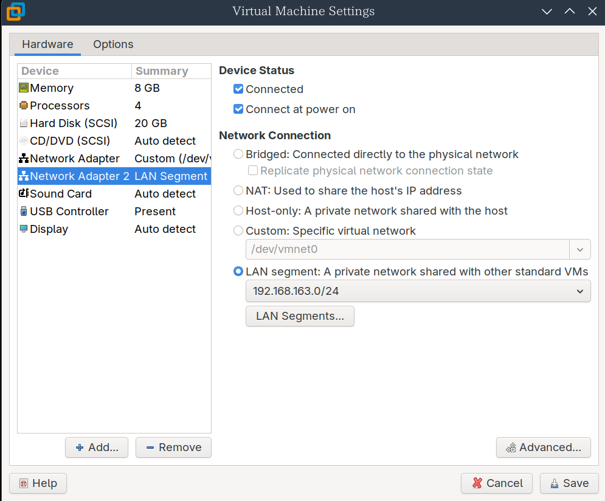

# Ubuntu

## 与CentOS中的不同

由于vmware workstation又产生了域名解析错误(博通公司对于免费产品下载总是藏着掖着),我决定切换到Virtual Box虚拟机上,之前写的一些笔记是基于CentOS7的,现在我打算直接迁移到Ubuntu22,记录一下安装过程的一些不同之处.

### nginx

我在Ubuntu使用了Nginx官方的下载源下载的Nginx,它的配置文件方式和CentOS的源有些不同.

CentOS的Nginx配置文件在`/etc/nginx/conf.d/`目录下,Nginx会读取该目录下的所有以`.conf`结尾的文件.

而在Ubuntu中不仅读取`/etc/nginx/conf.d/`目录,而更推荐的做法是将配置写到`/etc/nginx/sites-available/`目录下,并针对决定使用的配置文件使用软连接的方式连接到`/etc/nginx/sites-enabled/`目录中.

### php-fmp

要在Ubuntu中运行wordpress,只需要安装`php php-fpm php-mysqli`

php-fpm的配置文件与Centos不同,user和listen的配置位于`etc/php/8.1/fpm/pool.d/www.conf`,而CentOS位于`/etc/php-fpm.d/www.conf `

### mariadb

Ubuntu中分为两个软件包`mariadb-client`和`mariadb-server`

如果要其他主机通过网络访问该主机的数据库:

1. 创建一个允许所有网段连接的用户,例如:
   ```
   grant all on  *.* to lzy@'%' identified by '123'
   ```

2. 在配置文件中编辑允许其他网段连接:
   ```
   vim /etc/mysql/mariadb.conf.d/50-server.cnf
   
   # 默认是127.0.0.1
   bind-address            = 0.0.0.0
   ```

### NFS

CentOS中客户端和服务端都是`nfs-utils`,Ubuntu服务器为`nfs-kernel-server`,客户端为`nfs-common`

## 网络配置

在ubuntu22.04中网络配置已从传统的 `ifcfg` 文件迁移到 **Netplan** 系统,网络配置文件位于 `/etc/netplan/` 目录,默认存在一个`50-cloud-init.yaml`:

```
# This file is generated from information provided by the datasource.  Changes
# to it will not persist across an instance reboot.  To disable cloud-init's
# network configuration capabilities, write a file
# /etc/cloud/cloud.cfg.d/99-disable-network-config.cfg with the following:
# network: {config: disabled}
network:
    ethernets:
        ens33:
            addresses:
            - 10.0.0.80/24
            nameservers:
                addresses:
                - 223.5.5.5
                search: []
            routes:
            -   to: default
                via: 10.0.0.2
    version: 2
```

我们需要新建自己的配置文件:

```
vim /etc/netplan/01-static-config.yaml
network:
  ethernets:
    ens33:
      dhcp4: no
      addresses:
        - 11.0.0.80/24
      routes:
        - to: default
          via: 11.0.0.1
      nameservers:
        addresses: [223.5.5.5]
  version: 2
```

然后把`50-cloud-init.yaml`重命名为`50-cloud-init.yaml.bak`,接着新建一个`/etc/cloud/cloud.cfg.d/99-disable-network-config.cfg`

```
sudo vim /etc/cloud/cloud.cfg.d/99-disable-network-config.cfg

network: {config: disabled}
```

然后重新生成和使用配置:

```
netplan generate

netplan apply

ip address
1: lo: <LOOPBACK,UP,LOWER_UP> mtu 65536 qdisc noqueue state UNKNOWN group default qlen 1000
    link/loopback 00:00:00:00:00:00 brd 00:00:00:00:00:00
    inet 127.0.0.1/8 scope host lo
       valid_lft forever preferred_lft forever
    inet6 ::1/128 scope host 
       valid_lft forever preferred_lft forever
2: ens33: <BROADCAST,MULTICAST,UP,LOWER_UP> mtu 1500 qdisc fq_codel state UP group default qlen 1000
    link/ether 00:0c:29:ad:9c:33 brd ff:ff:ff:ff:ff:ff
    altname enp2s1
    inet 11.0.0.80/24 brd 11.0.0.255 scope global ens33
       valid_lft forever preferred_lft forever
    inet6 fe80::20c:29ff:fead:9c33/64 scope link 
       valid_lft forever preferred_lft forever
```


> 我又新加了一个网卡用于局域网:
>
> 
>
> 首先查看新的网卡名:
>
> ```
> ip address
> 1: lo: <LOOPBACK,UP,LOWER_UP> mtu 65536 qdisc noqueue state UNKNOWN group default qlen 1000
> link/loopback 00:00:00:00:00:00 brd 00:00:00:00:00:00
> inet 127.0.0.1/8 scope host lo
>  valid_lft forever preferred_lft forever
> inet6 ::1/128 scope host 
>  valid_lft forever preferred_lft forever
> 2: ens33: <BROADCAST,MULTICAST,UP,LOWER_UP> mtu 1500 qdisc fq_codel state UP group default qlen 1000
> link/ether 00:0c:29:9f:d3:7c brd ff:ff:ff:ff:ff:ff
> altname enp2s1
> inet 11.0.0.80/24 brd 11.0.0.255 scope global ens33
>  valid_lft forever preferred_lft forever
> inet6 fe80::20c:29ff:fe9f:d37c/64 scope link 
>  valid_lft forever preferred_lft forever
> 3: ens37: <BROADCAST,MULTICAST,UP,LOWER_UP> mtu 1500 qdisc fq_codel state UP group default qlen 1000
> link/ether 00:0c:29:9f:d3:86 brd ff:ff:ff:ff:ff:ff
> altname enp2s5
>  valid_lft forever preferred_lft forever
> inet6 fe80::20c:29ff:fe9f:d386/64 scope link 
>  valid_lft forever preferred_lft forever
> ```
>
> 
>
> 然后在配置文件`/etc/netplan/01-static-config.yaml`给该网卡配置IP:
>
> ```
> network:
> ethernets:
> ens33:
> dhcp4: no
> addresses:
>         - 11.0.0.80/24
>       routes:
>         - to: default
>           via: 11.0.0.1
>       nameservers:
>         addresses: [223.5.5.5]
>     # 需要使用 ip address 指令查看新建的网卡名
>     ens37:
>       dhcp4: no
>       addresses:
>         - 192.168.163.80/24
>   version: 2
> ```
>
> 接着应用即可:
>
> ```
> netplan generate
> 
> netplan apply
> ```

## apt

##### 

| apt命令 | 格式与说明                                                   |
| :------ | ------------------------------------------------------------ |
| 安装    | apt install -y tree                                          |
| 查询    | apt search <关键词><br />apt show <包名> # 显示详细信息<br />apt list --installed \| grep <包名> # 检查是否安装<br />apt policy <包名> # 查看软件源优先级 |
| 删除    | apt remove <包名> # 删除软件包<br />apt autoremove # 删除未使用的依赖<br />apt clean # 清理下载的包缓存<br />apt autoclean # 清理旧版本包缓存 |
| 更新    | apt update # 更新包列表 <br />apt upgrade # 升级已安装包<br />apt full-upgrade # 升级并处理依赖关系 |
| 选项    | apt -y (自动确认操作)<br />apt --allow-unauthenticated (允许未认证包) |

> apt-get和apt的区别
>
> - **`apt-get`：** 是**原始的、较低级别**的 APT 前端工具。它非常稳定、功能强大且主要用于脚本和自动化任务。它专注于核心的包管理操作（安装、卸载、更新、升级）。
> - **`apt`：** 是**较新的、用户友好**的 APT 前端工具（在 Ubuntu 16.04 和 Debian 8 中引入）。它旨在为**终端用户**提供一个更简洁、更直观的交互体验。它整合了 `apt-get`、`apt-cache` 以及其他相关工具（如 `apt-config`）中最常用的功能。
>
> - **`apt`：** 除了包含 `apt-get` 的大部分核心操作（如 `install`, `remove`, `purge`, `update`, `upgrade`, `autoremove`, `full-upgrade`）外，还**整合了 `apt-cache` 的常用搜索功能**：
>   - `apt search`： 相当于 `apt-cache search`
>   - `apt show`： 相当于 `apt-cache show`

