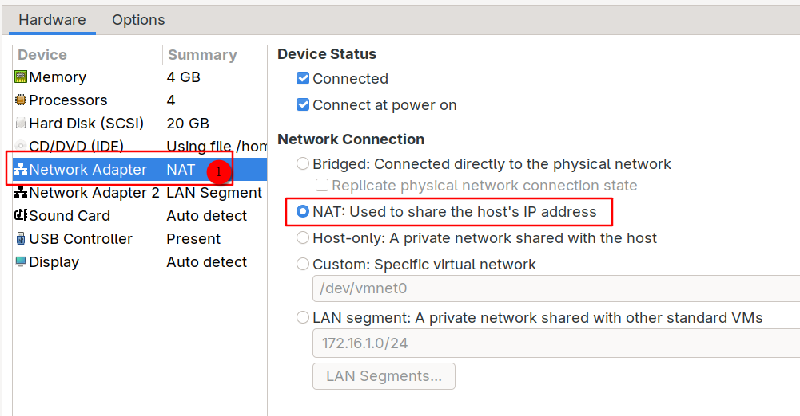
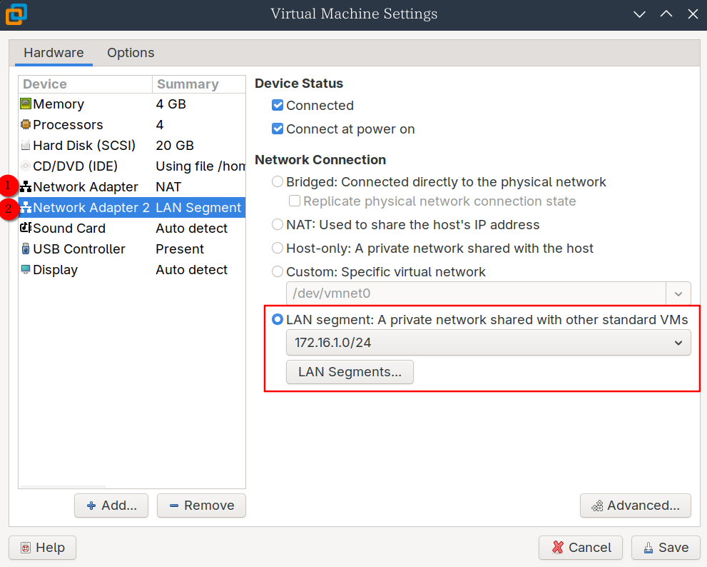
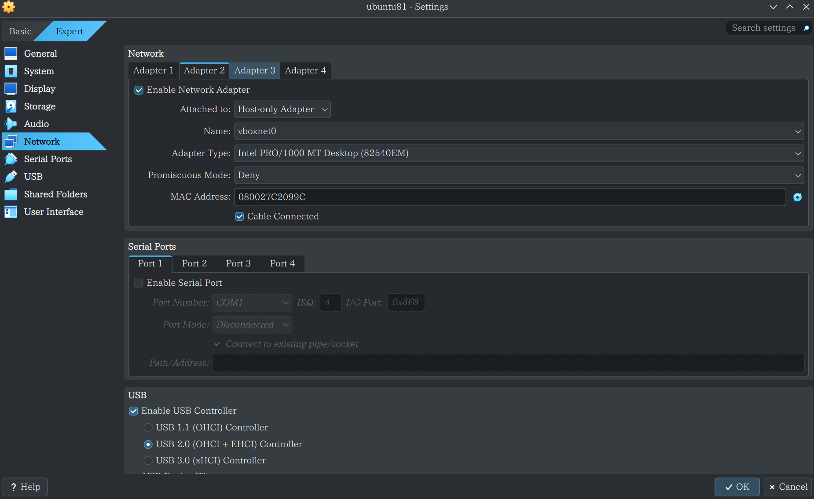
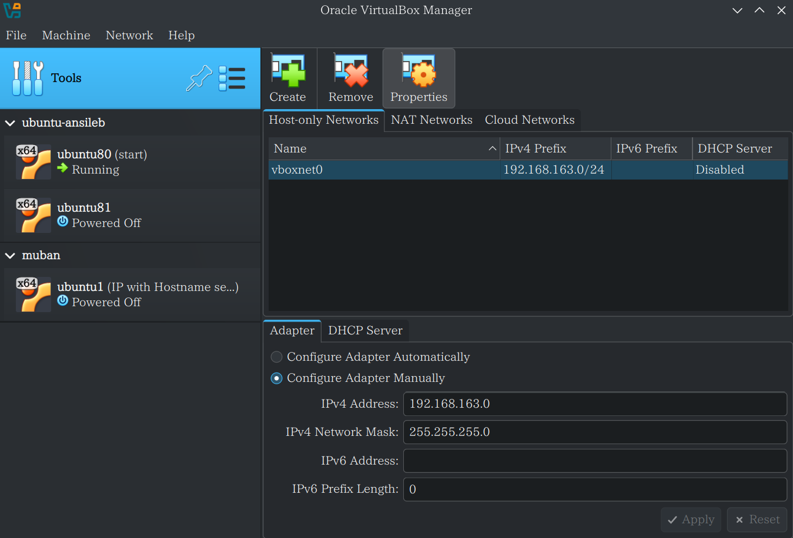
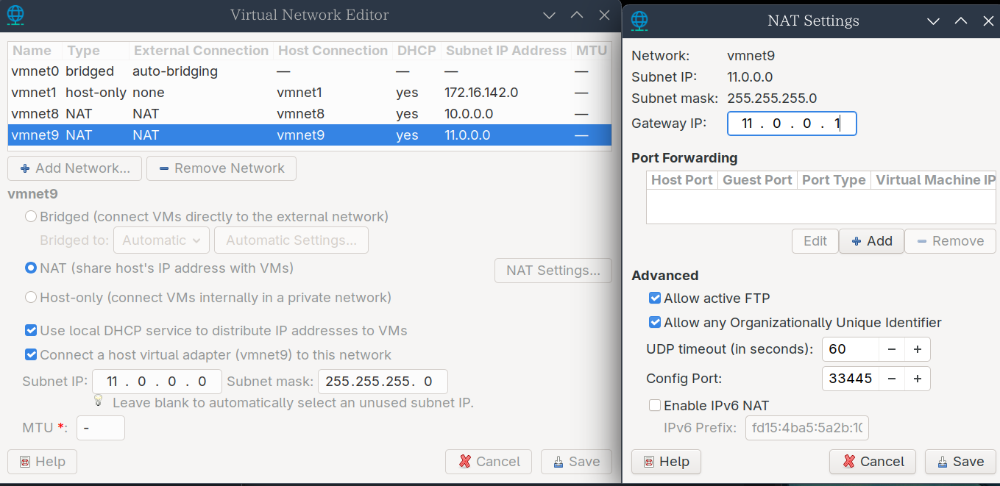
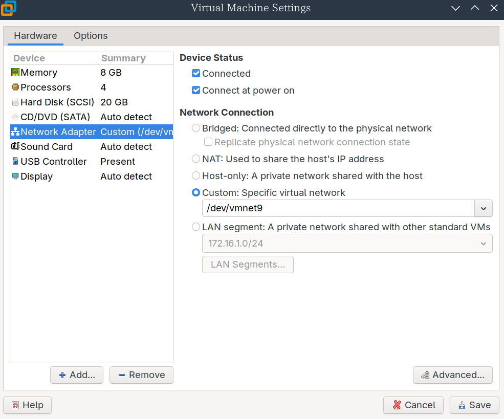
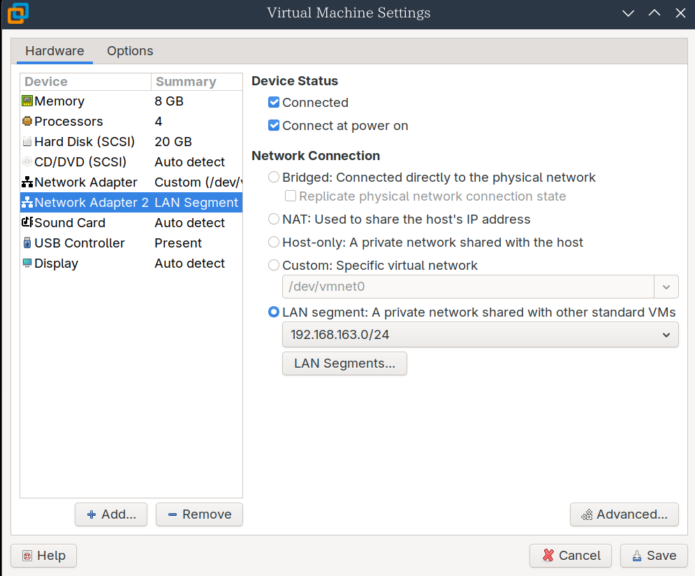

# 虚拟机

## 添加局域网络

### vmware

初始虚拟机只有一个网卡(eth0),通过NAT连接到vmnet8上,网段为`10.0.0.0` 

这里我们再添加一个网卡用于内网使用,使用LAN模式,网段为`172.16.1.0/24`



### virtualbox

virtualbox支持虚拟机拥有八张网卡,在GUI中只能配置四张.
只需要点击Adapter2然后勾选Enable Network Adapter即可



可以选择Host-only模式或Internal network模式,区别是Host-only可以与主机通信.由于virtualbox的Nat network模式下的虚拟机无法与主机通信,所以我这边第二张网卡使用Host-only模式用于与主机通信

virtualbox的Host-only模式需要在Network tools中新建网络:



默认只能建立`192.168.56.0/21`网段的主机通信,其他网段则需要编辑`/etc/vbox/networks.conf`文件,例如下面的配置文件允许使用 `192.168.163.0/24`网段:

```
* 192.168.163.0/24
```

更多详情参见[官方手册](https://www.virtualbox.org/manual/ch06.html#network_hostonly)

## vmware添加虚拟网络

在vmware的 virtual network editor中新建一个虚拟网卡:



然后把想要加入的虚拟机设置为自定义:



## 修改网络配置

### centos 7

添加一个新的网卡用于内网

创建配置文件`/etc/sysconfig/network-scripts/ifcfg-eth1`:

```
TYPE=Ethernet   # 网络类型
BOOTPROTO=none  # 获取静态IP的方式
NAME=eth1       # 名称
DEVICE=eth1     # 名称
ONBOOT=yes      # 开机自启
IPADDR=172.16.1.200 # IP地址
PREFIX=24       # 子网掩码
```

(``/etc/sysconfig/network-scripts/ifcfg-eth0`文件如下):

```
TYPE=Ethernet
BOOTPROTO=none
NAME=eth0
DEVICE=eth0
ONBOOT=yes
IPADDR=10.0.0.200
PREFIX=24
GATEWAY=10.0.0.2    # 网关
DNS1=223.5.5.5      # DNS服务器
```

配置完后需要重启网络服务:

```
systemctl restart network
```

然后就可以看到eth1的IP了:

```
ip add
1: lo: <LOOPBACK,UP,LOWER_UP> mtu 65536 qdisc noqueue state UNKNOWN group default qlen 1000
    link/loopback 00:00:00:00:00:00 brd 00:00:00:00:00:00
    inet 127.0.0.1/8 scope host lo
       valid_lft forever preferred_lft forever
    inet6 ::1/128 scope host 
       valid_lft forever preferred_lft forever
2: eth0: <BROADCAST,MULTICAST,UP,LOWER_UP> mtu 1500 qdisc pfifo_fast state UP group default qlen 1000
    link/ether 00:0c:29:4d:6a:ce brd ff:ff:ff:ff:ff:ff
    inet 10.0.0.200/24 brd 10.0.0.255 scope global noprefixroute eth0
       valid_lft forever preferred_lft forever
    inet6 fe80::20c:29ff:fe4d:6ace/64 scope link 
       valid_lft forever preferred_lft forever
3: eth1: <BROADCAST,MULTICAST,UP,LOWER_UP> mtu 1500 qdisc pfifo_fast state UP group default qlen 1000
    link/ether 00:0c:29:4d:6a:d8 brd ff:ff:ff:ff:ff:ff
    inet 172.16.1.200/24 brd 172.16.1.255 scope global noprefixroute eth1
       valid_lft forever preferred_lft forever
    inet6 fe80::20c:29ff:fe4d:6ad8/64 scope link 
       valid_lft forever preferred_lft forever
```

### ubuntu 22.04

从vmnet8迁移到vmnet9

在ubuntu22.04中网络配置已从传统的 `ifcfg` 文件迁移到 **Netplan** 系统,网络配置文件位于 `/etc/netplan/` 目录,默认存在一个`50-cloud-init.yaml`:

```
# This file is generated from information provided by the datasource.  Changes
# to it will not persist across an instance reboot.  To disable cloud-init's
# network configuration capabilities, write a file
# /etc/cloud/cloud.cfg.d/99-disable-network-config.cfg with the following:
# network: {config: disabled}
network:
    ethernets:
        ens33:
            addresses:
            - 10.0.0.80/24
            nameservers:
                addresses:
                - 223.5.5.5
                search: []
            routes:
            -   to: default
                via: 10.0.0.2
    version: 2
```

我们需要新建自己的配置文件:

```
vim /etc/netplan/01-static-config.yaml
network:
  ethernets:
    ens33:
      dhcp4: no
      addresses:
        - 11.0.0.80/24
      routes:
        - to: default
          via: 11.0.0.1
      nameservers:
        addresses: [223.5.5.5]
  version: 2
```

然后把`50-cloud-init.yaml`重命名为`50-cloud-init.yaml.bak`,接着新建一个`/etc/cloud/cloud.cfg.d/99-disable-network-config.cfg`

```
sudo vim /etc/cloud/cloud.cfg.d/99-disable-network-config.cfg

network: {config: disabled}
```

然后重新生成和使用配置:

```
netplan generate

netplan apply

ip address
1: lo: <LOOPBACK,UP,LOWER_UP> mtu 65536 qdisc noqueue state UNKNOWN group default qlen 1000
    link/loopback 00:00:00:00:00:00 brd 00:00:00:00:00:00
    inet 127.0.0.1/8 scope host lo
       valid_lft forever preferred_lft forever
    inet6 ::1/128 scope host 
       valid_lft forever preferred_lft forever
2: ens33: <BROADCAST,MULTICAST,UP,LOWER_UP> mtu 1500 qdisc fq_codel state UP group default qlen 1000
    link/ether 00:0c:29:ad:9c:33 brd ff:ff:ff:ff:ff:ff
    altname enp2s1
    inet 11.0.0.80/24 brd 11.0.0.255 scope global ens33
       valid_lft forever preferred_lft forever
    inet6 fe80::20c:29ff:fead:9c33/64 scope link 
       valid_lft forever preferred_lft forever
```


> 我又新加了一个网卡用于局域网:
>
> 
>
> 首先查看新的网卡名:
>
> ```
> ip address
> 1: lo: <LOOPBACK,UP,LOWER_UP> mtu 65536 qdisc noqueue state UNKNOWN group default qlen 1000
>  link/loopback 00:00:00:00:00:00 brd 00:00:00:00:00:00
>  inet 127.0.0.1/8 scope host lo
>     valid_lft forever preferred_lft forever
>  inet6 ::1/128 scope host 
>     valid_lft forever preferred_lft forever
> 2: ens33: <BROADCAST,MULTICAST,UP,LOWER_UP> mtu 1500 qdisc fq_codel state UP group default qlen 1000
>  link/ether 00:0c:29:9f:d3:7c brd ff:ff:ff:ff:ff:ff
>  altname enp2s1
>  inet 11.0.0.80/24 brd 11.0.0.255 scope global ens33
>     valid_lft forever preferred_lft forever
>  inet6 fe80::20c:29ff:fe9f:d37c/64 scope link 
>     valid_lft forever preferred_lft forever
> 3: ens37: <BROADCAST,MULTICAST,UP,LOWER_UP> mtu 1500 qdisc fq_codel state UP group default qlen 1000
>  link/ether 00:0c:29:9f:d3:86 brd ff:ff:ff:ff:ff:ff
>  altname enp2s5
>     valid_lft forever preferred_lft forever
>  inet6 fe80::20c:29ff:fe9f:d386/64 scope link 
>     valid_lft forever preferred_lft forever
> ```
>
> 
>
> 然后在配置文件`/etc/netplan/01-static-config.yaml`给该网卡配置IP:
>
> ```
> network:
> ethernets:
>  ens33:
>    dhcp4: no
>    addresses:
>         - 11.0.0.80/24
>       routes:
>         - to: default
>           via: 11.0.0.1
>       nameservers:
>         addresses: [223.5.5.5]
>     # 需要使用 ip address 指令查看新建的网卡名
>     ens37:
>       dhcp4: no
>       addresses:
>         - 192.168.163.80/24
>   version: 2
> ```
>
> 接着应用即可:
>
> ```
> netplan generate
> 
> netplan apply
> ```

## 克隆

1. 完全克隆(full clone)

2. 链式克隆(linked clone)

链接克隆的工作方式与快照技术类似。快照以一种节省磁盘使用的方式运作：当你创建快照并在此之后进行更改（就像你在虚拟机内的系统中操作时），VMware仅存储磁盘（扇区）中发生变化的部分。

链接的虚拟机克隆工作方式类似：如果你有一个10 GB的磁盘并创建了一个链接克隆，你不需要额外的10 GB空间——只需要少得多的空间。当你使用原始或克隆的虚拟机时，只有变化或差异会被存储。需要注意的是，克隆的虚拟机仍然依赖于原始磁盘镜像。

可以独立操作这两个虚拟机——区别仅在于内部。使用链接克隆可以节省磁盘空间——但在某些情况下性能也可能较差。

如果需要运行大量非常相似的虚拟机，使用链接克隆可能更为合理，因为这样可以节省大量磁盘空间。

如果只是克隆一个虚拟机，然后开始安装完全不同的软件或数据，复制克隆可能更为合适。

## 网络配置

阿里云dns:

```
223.5.5.5
```

ubuntu22 配置apt阿里云源

```
sudo vim /etc/apt/sources.list

deb http://mirrors.aliyun.com/ubuntu/ jammy main restricted universe multiverse
deb-src http://mirrors.aliyun.com/ubuntu/ jammy main restricted universe multiverse

deb http://mirrors.aliyun.com/ubuntu/ jammy-security main restricted universe multiverse
deb-src http://mirrors.aliyun.com/ubuntu/ jammy-security main restricted universe multiverse

deb http://mirrors.aliyun.com/ubuntu/ jammy-updates main restricted universe multiverse
deb-src http://mirrors.aliyun.com/ubuntu/ jammy-updates main restricted universe multiverse

deb http://mirrors.aliyun.com/ubuntu/ jammy-backports main restricted universe multiverse
deb-src http://mirrors.aliyun.com/ubuntu/ jammy-backports main restricted universe multiverse

```

pip ustc源

```
# 临时
pip install -i https://mirrors.ustc.edu.cn/pypi/simple package

# 默认
pip install -i https://mirrors.ustc.edu.cn/pypi/simple pip -U
pip config set global.index-url https://mirrors.ustc.edu.cn/pypi/simple

```
