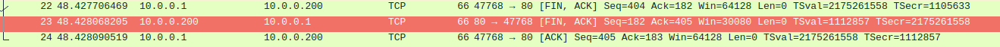
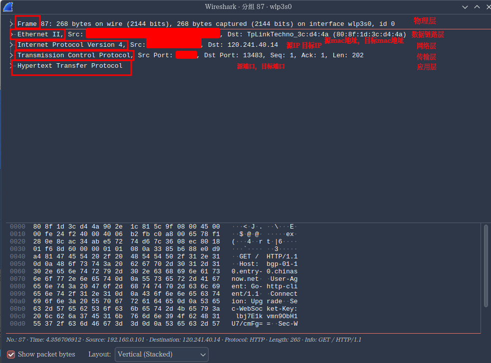

# 计算机网络

## 基础知识

网络带宽的速度 1000 Mb/s=1000/8 MB/s=125 MB/s
1 Byte=8bit

### 网络设备

#### 交换机

- 交换机的端口上连接的所有终端设备，均在同一个网段（局域网LAN）上，称为一个广播域
- 产生广播消耗设备CPU资源
- 终端用户的设备一般接入交换机连接
- 一个网段会有一个统一的网络标识，例如网段192.168.15.xxx
- 企业级交换机会有一些基本的安全功能（例如只让某些设备有广播权限）
- 交换机工作在OSI模型的第二层，也叫二层交换

#### 路由器

路由器用于连接不同的网络，核心功能是路由选择和分组转发

WAN口是公网输入口,LAN口是局域网输出口

- 路由协议的转发
- 数据转发（维护一个路由表）
- 路由器会作为网关
- 用于连接广域网（公网）

#### 区别

1. 路由器是工作在第三层，可以识别IP，具备第三层功能(DHCP,自动分配IP)
   交换机工作在第二层,只能识别到mac地址.
2. 路由器可连接超过两个以上不同的网络，而交換机只能连接两个
3. 路由器接口较少,交换机接口较多

### OSI七层模型

**开放式系统互联模型**（英語：**O**pen **S**ystems **I**nterconnection Model，縮寫：OSI；簡稱為**OSI模型**）,该模型把通信系统中的数据流划分为七个层,从分布式应用程序数据的最高层表示到跨通信介质传输数据的物理实现,每个中间层为其上一层提供功能,其自身功能则由其下一层提供.

| OSI模型    | 概述                                         | 协议                        | 功能                                                         |
| ---------- | -------------------------------------------- | --------------------------- | ------------------------------------------------------------ |
| 应用层     | 大部分软件运行在应用层                       | http,https,SSH,FTP,smtp,dns |                                                              |
| 表示层     | 负责数据加密,解密,压缩                       |                             |                                                              |
| 会话层     | 负责会话管理与维护                           |                             |                                                              |
| 运输层     | 添加传输表头,负责数据传输方式(可靠传输)      | TCP,UDP                     | 服务点编址,分段与重组,连接控制,流量控制,差错控制             |
| 网络层     | 添加网络表头,负责路由与寻址                  | IP                          | 为网络设备提供逻辑地址,进行路由选择和分组转发                |
| 数据链路层 | 添加数据链表头,数据链表尾,把分组数据封装成帧 | (mac地址)                   | 在不可靠的物理链路上提供可靠的数据传输服务,把帧从一跳(结点)移动到下一跳(结点).<br />组帧,物理编址,流量控制,差错控制,接入控制 |
| 物理层     | 把数据转换为2进制,通过线缆传播               |                             |                                                              |

##### OSI数据的传输过程

发送方从上倒下对数据进行打包,接收方从下到上进行解包
###### 打包

1. **传输层**将上层传输到的**数据流**切割为适合传输的**数据段**,并加上段头,段头中包含定位到应用进程的端口号等信息形成数据段.
2. **网络层**对数据段添加分组头部形成**分组**,分组头部中包含寻址主机的IP地址和其他一些传输需要用到的信息
3. **数据链路层**对分组添加帧头形成**帧**,帧头中包含寻址主机所需要的物理地址(MAC地址),校验等信息
4. **物理层**将帧转换为可供传输的**比特流**

###### 解包

打包的逆过程

##### 应用层

在操作系统中实际上进行通信的是进程，进程跨越计算机网络交换**报文(message)**,进程需要通过**IP地址**加**端口号**来标识地址.

##### 运输层

运输层为主机上的进程提供逻辑通信,将应用层传输的报文转换为**报文段**

##### 网络层

网络层将报文段打包成**IP数据报**

### TCP与UDP连接

区别:

| 传输控制协议 TCP                        | 数据报协议 UDP                        |
| --------------------------------------- | ------------------------------------- |
| 面向连接(3次握手,4次挥手)               | 无连接                                |
| 为传输层提供可靠运输                    | 不可靠运输                            |
| 流控(检查数据是否丢失,丢失可以重新发送) | 尽力传递                              |
| Web浏览器,电子邮件,文件传输程序         | 域名系统,视频流,IP语音(VoIP),游戏数据 |

#### TCP

TCP连接可以提供稳定,可靠的连接.

TCP连接通过三次握手和四次挥手进行建立连接和断开连接，过程中，客户端和服务端会有一些状态.

- CLOSED(关闭)
- ESTABLISHED(已连接)

##### 3次握手

TCP与端口建立连接时双方要经过3次握手.

1. 客户端发送:**SYN建立连接请求**包括一个随机数seq*111*
2. 服务端发送:**ACK(确认),SYN(与客户端建立连接)**,包括一个新的seq*333*和确认号ack(seq+1)*112*
3. 客户端发送:**ACK确认建立连接请求**包括seq(上一次请求的ack)*112*,ack(新seq+1)*334*


###### 状态变化:

初始时客户端,服务端都处于CLOSED状态

服务端在创建socket开始监听后变为LISTEN状态

1. 客户端发送SYN请求后,状态变为SYN_SENT
2. 服务端接受请求并返回ACK,SYN请求后,服务端状态变为SYN_RECVD(received)
3. 客户端收到SYN并返回ACK请求后,客户端状态变为ESTABLISHED,服务端接收到ACK请求后,服务端状态变为ESTABLISHED.

##### 4次挥手

TCP断开连接时需要4次挥手

1. 客户端发送:断开连接请求FIN,包含seq(握手时的ack)*334*,ack(握手时的seq+1)*113*
2. 服务端收到请求,发送确认请求ACK,发送seq(ack)*113*,ack(seq+1)*335*
3. 服务端发送断开连接请求FIN,包含seq*113*,ack*335*,由于都是服务端发送,均与上一请求一致.
4. 客户端发送确认请求ACK,包含seq(ack)335,ack(seq+1)114



###### 状态变化:

断开连接前,客户端与服务端均处于ESTABLISHED状态

1. 客户端向服务端发送FIN报文,请求断开连接,其状态变为FIN_WAIT1.
2. 服务端接收到FIN之后向客户端发送ACK,服务端状态变为CLOSE_WAIT
3. 客户端接收到ACK后进入FIN_WAIT2状态,此时客户端到服务端的连接已断开,如果服务端还有数据要发送给客户端,就会继续发送.
4. 服务端发送完数据后发送FIN报文,此时服务端进入LAST_ACK状态
5. 客户端接收到服务端的FIN后,发送ACK到服务端,此时客户端进入TIME_WAIT状态,再过2MSL长的时间后进入CLOSED状态.
6. 服务端收到客户端的ACK请求后进入CLOSED状态.

> CLOSING状态:
>
> 客户端发送FIN请求后,进入FIN_WAIT1状态,如果客户端没有接收到服务端的ACK请求,而是直接接收到了服务端的FIN请求(表明服务端的ACK请求丢包),客户端会进入CLOSING状态,这是一个异常状态.

###### 2MSL等待状态

TIME_WAIT状态也称为2MSL等待状态,每隔具体TCP实现必须选择一个报文段最大生存时间MSL(Maximum Segment Lifetime).它是任何报文段被丢弃前在网络内的最长时间,我们知道这个时间是有限的,因为TCP报文段以IP数据报在网络内传输,而IP数据报则有限制其生存时间的TTL字段. 常见的时间是(30s,1m,2m)

#### UDP

UDP是直接连接,不提供可靠服务,尽力而为.

### 常见网络协议

#### DNS

DNS是域名解析服务/协议,提供将域名解析到IP的服务。

可以在网卡配置文件中配置DNS解析服务器，例如223.5.5.5

根域名是`.`

顶级域名`.com`,`.org`等

二级域名(主要购买的是二级域名)`baidu`.com,`bilibili`.com

三级域名及以上,是在二级域名上自定义的域名`www`.baidu.com 

##### DNS解析流程


#### ARP

#### ICMP


### NAT  

## ssh远程连接

### ssh远程连接失效的排查

1. 使用`ping`命令观察能否ping通
2. 检查防火墙,安全设备,安全规则等是否拦截
3. 使用`telnet`命令检查端口是否开放了服务

## 抓包

### wireshark





## 命令

### ping

`ping`命令使用**ICMP**协议

### telnet

`telnet`命令用于检查端口是否正在运行:

```
telnet 10.0.0.200 80

Trying 10.0.0.200...
Connected to 10.0.0.200.
Escape character is '^]'.
```

### firewall-cmd

`firewall-cmd`命令用于控制防火墙

```
# 开放http服务
firewall-cmd --permanent --add-service=http
# 开放https服务
firewall-cmd --permanent --add-service=https
# 重载配置
firewall-cmd --reload
# 显示所有已开放的服务器
firewall-cmd --list-service
dhcpv6-client http https ssh
```

### ss

d 