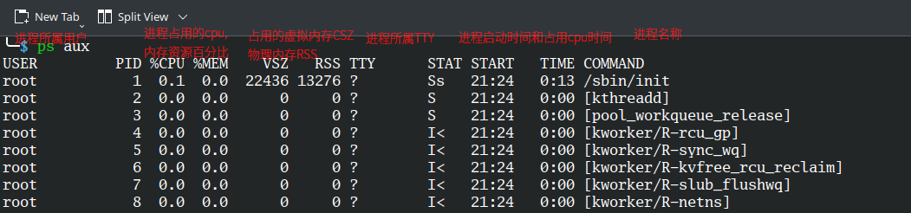
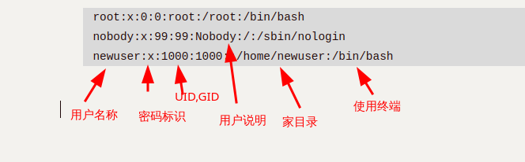

# StudyLinuxNote


## 基础

### Shell

#### ``

特殊符號``中的命令會被優先執行,比如:

```
ls -l `which sudo`
```

先找到sudo命令的位置,然後對該位置運行ls

#### |

`|` 管道符号：前1个命令输出给后面命令使用，一般過濾

### 连接

#### 软连接(symblic link)

软连接实际上是一个单独的文件,与被连接文件有不同的inode和block,只是软连接文件的block中存储着被连接文件的位置信息,删除被连接文件,软连接文件仍然存在,只是指向的是无效连接.

使用场景:管理不同版本的文件,给使用的版本文件创建软连接来确定文件名.

#### 硬连接(hard link)

文件系统中的文件实际上是指向inode的链接,硬链接只会创建另一个文件,其中包含指向同一个inode的链接.删除一个文件时,文件系统会移除一个指向底层inode的链接,只有删除指定inode的所有链接之后,才会删除inode.

使用场景:备份重要文件,防止"误删"

#### 区别


- 软连接可以跨文件系统使用,硬连接只在同一个文件系统有效.
- 如果创建连接后移动原文件,软连接会失效,硬连接依然有效
- 删除原文件,硬连接依旧有效,软连接仍然存在但指向的是无效连接

### 命令别名

使用`alias`命令可以设置命令别名.常见用法:

```bash
# 查看所有别名
alias

# 查看ll别名对应的命令
alias ll

# 设置命令别名
alias ll=`ls -l`
```

可以在`~/.bashrc`,`/etc/profile`等设置环境变量的文件中写入alias命令来达到配置永久生效

可以使用`unalias`命令来取消别名

### linux运行级别

**运行级别**（**Runlevel**）指的是类Unix操作系统下不同的运行模式。运行级别通常分为7等，分别是从0到6.在全新的Linux,`systemd`中已经使用target代替Runlevel.

| SysV Runlevel(Centos6) | Systemd Target(Centos7) | 注释                                                    |
| ---------------------- | ----------------------- | ------------------------------------------------------- |
| 0                      | poweroff.target         | 关机                                                    |
| 1                      | rescue.target           | 单用户模式(不允许非超级用户登录)                        |
| 2                      | multi-user.target       | 多用户模式,用户自定义级别                               |
| 3                      | multi-user.target       | 多用户，无图形界面。用户可以通过终端或网络登录。        |
| 4                      | multi-user.target       | 多用户模式,用户自定义级别                               |
| 5                      | graphical.target        | 多用户，图形界面。继承级别3的服务，并启动图形界面服务。 |
| 6                      | reboot.target           | 重启                                                    |

查看当前系统运行级别:

```bash
systemctl get-default
```

修改运行级别:

```bash
systemctl set-default graphical.target
```

## 系统管理

### 进程

进程是程序执行时的运行实例,它可以是前台进程(交互式进程)也可以是非交互式进程(非交互式进程),进程可以由主进程(parent process)或其它子进程创建.

在linux系统中,除了第一个PID为1的init(或system)进程外,每个进程都有一个父进程,进程也有自己的子进程.可以使用`pstree`命令查看进程树:

```bash
$ pstree
systemd─┬─NetworkManager───3*[{NetworkManager}]
        ├─bluetoothd
        ├─dbus-broker-lau───dbus-broker
        ├─mariadbd───8*[{mariadbd}]
        ├─nginx───24*[nginx]

```

#### 进程状态

linux中的进程有一个进程状态:

| STAT基本状态 | 描述                               |
| ------------ | ---------------------------------- |
| R(running)   | 运行中进程                         |
| S(sleeping)  | 可中断进程                         |
| T(terminate) | 进程被暂停(挂起)(ctrl+z)           |
| D            | 不可中断的进程(进程正在进行IO读写) |
| Z(zombie)    | 僵尸进程,异常的进程                |

| STAT状态 + 符号(附加状态) | 描述                                                         |
| ------------------------- | ------------------------------------------------------------ |
| s                         | 进程是控制进程,即父进程/主进程                               |
| <                         | 进程运行在高优先级上,S<优先级较高的进程                      |
| N                         | 进程运行在低优先级上,SN优先级较高的进程                      |
| +                         | 当前进程运行在前台,R+表示该进程在前台运行                    |
| l                         | 进程是多线程的,sl表示进程是以线程方式运行<br />使用多线程可以让服务或软件支持更改的访问 |

#### `ps`

`ps`命令用于静态查看当前系统的进程状态,常见的命令有:
`ps -ef`以BSD格式显示所有正在运行的进程的UID,PID,PPID(父进程的id),CMD(进程名字)

`ps aux`以标准格式显示所有正在运行的进程,除了-ef的结果,还有cpu使用率,内存使用率,占用内存大小,进程状态



`ps`命令经常与其他命令配合使用,例如和`kill`命令搭配随时中断,删除不必要的程序

```bash
# 取出所有进程中内存使用率最高的前5个
ps aux | sort -rnk4 | head -5
```

#### top

`top`命令可以动态的查看系统的整体运行情况,包括进程状态(僵尸进程等)


常用快捷键:

- q 退出
- 空格 立即刷新(默认3秒刷新)
- P 按照cpu使用率排序
- M 按照内存使用率排序

进阶使用:

- 按z进入颜色模式,按x标记当前按照哪一列排序
- shift + > 向右
- shift + < 向左

`top -b`进入非交互式模式,`top -n1`表示只输入一次结果:

```bash
top -bn1 | awk 'NR=2'
```


`htop`是top的增强版,支持使用鼠标进行操作.

#### 僵尸进程

当一个进程停止时,其父进程会被告知,以便进行一些清理工作(比如释放内存空间,资源占用).然而,如果父进程没有意识到子进程的死亡(挂掉了),子进程就会进入僵尸状态．对于父进程来说，子进程仍然存在，但实际上子进程已经死亡并持续存在于系统中．


可以使用`ps aux | grep Z`找出僵尸进程的pid,然后通过`pstree -p | grep pid`查看僵尸进程的父进程,通过`kill pid`指令无法直接结束僵尸进程,需要结束僵尸进程的父进程才能结束僵尸进程.

#### 孤儿进程

孤儿进程指其父进程执行完成或被终止后仍继续运行的一类进程,孤儿进程会被系统直接接管(system进程)

#### 结束进程

1. `kill`,`kill + 进程pid`结束进程
2. `pkill`,`pkill + 进程名字`模糊查找,结束进程
3. `killall`,`killall + 进程名字`精确结束进程

### 后台管理

linux运行程序分为后台和前台程序,要区分前台和后台程序,可以查看进程状态,带`+`表示前台运行的程序.

- 前台运行:需要连接后才能运行和操作,连接断开后操作会自动结束
- 后台运行:让软件进入系统的后台持续运行,一般情况下连接断开也不会影响软件的运行.

可以使用`job`命令查看

软件后台运行的方法:

1. 使用在命令后添加`&`:
   ```bash
   ╰─$ sleep 999 &     
   [1] 61448
   # 返回的是进程的pid
   
   # 可以使用jobs命令查看当前终端正在后台运行的进程:
   ╰─$ jobs
   [1]    running    sleep 999
   [2]    running    sleep 999
   [3]  - running    sleep 999
   [4]  + running    sleep 999
   
   ```

2. `nohup`命令配合`&`方法,可以保留输出到指定文件中,默认是nohup.out文件中,其他和`&`一致
   `nohup`命令可以将程序以忽略挂起信号的方式运行起来，被运行的程序的输出信息将不会显示到终端,默认追加到当前目录下的`nohup.out`文件,若不可写,则追加到`$HOME/nohup.out`文件.nohup命令本身并无后台含义，直接执行仍会占用终端，故常与`&`连用.

   ```bash
   ╰─$ nohup ping -c10 127.0.0.1 &
   [5] 62063
   nohup: ignoring input and appending output to 'nohup.out'                                                     
   ╰─$ 
   [5]  + 62063 done       nohup ping -c10 127.0.0.1
   
   ╰─$ cat nohup.out
   PING 127.0.0.1 (127.0.0.1) 56(84) bytes of data.
   64 bytes from 127.0.0.1: icmp_seq=1 ttl=64 time=0.042 ms
   64 bytes from 127.0.0.1: icmp_seq=2 ttl=64 time=0.037 ms
   64 bytes from 127.0.0.1: icmp_seq=3 ttl=64 time=0.033 ms
   64 bytes from 127.0.0.1: icmp_seq=4 ttl=64 time=0.027 ms
   64 bytes from 127.0.0.1: icmp_seq=5 ttl=64 time=0.043 ms
   64 bytes from 127.0.0.1: icmp_seq=6 ttl=64 time=0.050 ms
   64 bytes from 127.0.0.1: icmp_seq=7 ttl=64 time=0.049 ms
   64 bytes from 127.0.0.1: icmp_seq=8 ttl=64 time=0.035 ms
   64 bytes from 127.0.0.1: icmp_seq=9 ttl=64 time=0.048 ms
   64 bytes from 127.0.0.1: icmp_seq=10 ttl=64 time=0.035 ms
   
   --- 127.0.0.1 ping statistics ---
   10 packets transmitted, 10 received, 0% packet loss, time 9208ms
   rtt min/avg/max/mdev = 0.027/0.039/0.050/0.007 ms
   
   ```

3. 使用`ctrl + z`让当前运行的命令或服务进入**后台挂起**,若要进入**后台运行**,需要再运行`bg`命令,可以通过`fg`取消挂起

4. `screen`使用`nohup`+`&`命令不会停止,但不稳定,使用`screen`命令可以较为稳定的在后台运行命令.
   screen简易原理:

   > Screen is a terminal multiplexer, or more accurately a terminal-window manager.

   Screen本质上是一个终端管理器,断开了终端与当前tty的连接,终端均由screen派生且相互独立.
   常用指令:

   ```bash
   # 进入screen
   screen
   # 退出screen
   ctrl + a + d
   # 停止并退出
   ctrl + c; ctrl + d
   ```

不同运行方法的对比:

`&`方法和`ctrl + z`运行在终端中,终端关闭后(ssh断开)运行的命令也会停止

```bash
# sleep 999 &
systemd─┬─NetworkManager───3*[{NetworkManager}]
        ├─systemd─┬─(sd-pam)
        │         ├─konsole─┬─zsh───sleep
```

`nohup`运行在终端之外,终端关闭后命令能继续运行

```bash
# nohup sleep 999 &
systemd─┬─systemd─┬─konsole─┬─zsh───pstree
        │         ├─sleep
```

`screen`运行在终端之外,终端关闭后命令能继续运行

```bash
# screen
# ping bilibili.com
systemd─┬─systemd──konsole───zsh───sleep
        │         ├─screen───zsh───ping
```

### 负载

负载(load average)是用来衡量系统繁忙程度的指标.是指单位时间内,系统处于可运行状态(R,S)和不可终端状态(D)的平均进程数,也就是平均活跃进程数,可以通过`top`命令查看.

负载的数值越接近cpu核心总数,系统的负载越高,建议负载达到cpu总数的70%-80%时预警.


#### 负载高的排查流程

1. 通过监控软件发现系统负载高(w, lscpu查看)
2. 判断是cpu还是io导致的负载高
   - cpu高:top中的`us`(用户占用cpu)`sy`(system系统占用cpu)
   - io高:top中的wa磁盘io导致的负载高
3. 如果是cpu导致的,排查出哪个进程导致的,`ps aux`过滤出占用cpu较高的进程
   如果是io导致的,排查出哪个进程导致的,通过`iotop -o`命令排查
4. 具体分析进程问题


### 服务管理

**systemd**是一个linux系统基础组件的集合,提供了一个系统和服务管理器,运行为PID1并负责启动其他程序.

在历史上,systemd中的**服务(service)**被成为守护进程(daemon),它们在后台运行(即没有UI,不与终端交互),等待特定时间的发生并提供服务,例如Web服务器会等待一个请求以提供相应的页面,ssh服务器会等待登录请求.除了这种提供完整功能的,还有一些守护进程的工作是隐藏在幕后的,如负责向日志文件写入消息的`sysloc`,`metlog`,确保系统时间准确的`ntp`.

监视和控制systemd的主要命令是`systemctl`,其用途包括查看系统状态以及管理系统和服务.

#### 单元

单元(uint)通常包括但不限于:服务(service),挂载点(.mount),设备(.device)和套接字(socket).

使用`systemctl`时通常需要使用单元文件的全名,包括拓展名(比如`sshd.socket`),可以使用以下简写:

- 若无拓展名,`systemctl`会假定拓展名为`.service`.
- 挂载点会自动转换为相应的`.mount`单元,例如`/home`等价与`home.mount`.
- 与挂载点类似,设备会自动转化为相应的`.device`单元,因此`/dev/sda2`等价于`dev-sda2.device`

#### 命令

| systemctl status unit        | 检查单元状态                                           |
| ---------------------------- | ------------------------------------------------------ |
| systemctl start unit         | 启动单元                                               |
| systemctl stop unit          | 停止单元                                               |
| systemctl restart unit       | 重启单元                                               |
| systemctl reload unit        | 重新加载单元及其配置                                   |
| systemctl daemon-reload unit | 重新加载systemd配置                                    |
| systemctl enable unit        | 启用(开机自启动)单元,可以使用`--now`参数启用并立即启动 |
| systemctl disable unit       | 取消开机自启动单元                                     |
| systemctl list-units         | 单元运行情况                                           |
| systemctl list-unit-files    | 单元开机自启动情况                                     |

`systemctl`默认携带`--system`参数,以上命令默认对系统单元进行操作(需要root权限),若要对调用用户的用户单元进行操作,需要在非root身份下执行`systemctl --user`.

服务如果无法使用systemctl管理实现,可以使用`/etc/rm.local`文件(是一个符号连接,指向`/etc/rc.d/rc.local`),将服务启动命令写入到`/etc/rc.local`中即可(第一次使用需要`chmod +x /etc/rc.d/rc.local`)

## Command

### vim
查看行号: `:set nu` or `:set number`
批量选择: `ctrl + v`

### 查看日志
如果日志文件很大的话,使用vi,vim会导致内存占用过大,可能卡死,使用cat命令显示不全
#### head/tail
head 显示前几行,tail显示后几行
tail -f 监控一个文件
#### less/more
按页查看文件内容
#### wc
统计文件内容,比如行数

### 查询命令位置
#### which/whereis
which显示命令的位置:
```
$ which sudo
/usr/bin/sudo
```
whereis查询命令及相关文件的位置
```
$ whereis sudo
sudo: /usr/bin/sudo /usr/lib/sudo /usr/share/man/man8/sudo.8.gz
```
### 文件命令

#### 文件操作命令

##### 文件排序（sort）
```markdown
- `sort -n`: 将内容识别为数字进行排序
- `-k 2`: 指定按第二列排序（支持多列顺序排序）
- `-r`: 降序排列（从大到小）
- `-t ':'`: 设置冒号为列分隔符
```

```
$ sort -n 333.txt | uniq -c 
    5 1
    8 2
    5 3
    1 4
    1 5
    1 10
```

##### 文件去重（uniq）

```markdown
- 需先排序后使用（仅处理相邻重复行）：
sort 333.txt | uniq -c  # -c统计重复次数
```
二次排序示例：

```bash
sort 333.txt | uniq -c | sort -rnk2  # 按第二列数值降序
```

#### 文件属性

##### 查看文件属性（ls）

```markdown
`ls -li` 输出解析：
```
total 4374484
611553	drwxr-xr-x	1		user	user		0		Apr 19 17:26		test
inode	权限		硬链数量 	所有者 所属组	文件大小	修改时间		文件名

```

权限字段详解：
- 首字符类型：`-`普通文件, `d`目录, `l`软链接, `c`字符设备, `b`块设备, `s`套接字, `p`管道
- 后续9字符：三组rwx权限（所有者|所属组|其他人）
```

##### 文件类型(file)

linux下的文件拓展名仅仅用于展示,并不用来区分文件类型,linux文件类型(`ls -l`):

1. `-`file类型,范围较广
2. `d`目录(directory)
3. `l`软连接
4. `c`字符设备char特殊文件,不断输出,吸入
5. `b`块设备block文件
6. `s`套接字socket文件
7. `p`管道文件

使用`file`命令可以显示详细类型信息

#### 文件存储机制

##### inode与block结构
| 组件  | 作用                                 | 查看命令 |
| ----- | ------------------------------------ | -------- |
| inode | 存储元数据+block指针（不包含文件名） | `df -i`  |
| block | 存储文件内容（最小单位4KB）          | `df -h`  |

##### 文件访问流程
1. 通过文件名在目录block中查找inode号
2. 读取inode元数据校验权限
3. 通过block指针访问文件内容

#### 空间占用分析

##### 查看文件空间占用(stat)

```bash
$ stat test
  File: test
  Size: 0               Blocks: 0 
```

创建空文件时通常只创建一个inode,创建非空文件时,就会创建最少一个inode和一个block,磁盘的inode和block数量是在磁盘格式化的时候确定的.
一个block默认占用4k空间,如果文件数据不到4k,则占用一个block(其他文件无法使用),否则占用多个block

##### 查看目录空间占用(du)

```markdown
`du -sh /*` 参数说明：
- `-s`：显示总用量（不展开子目录）
- `-h`：人性化单位显示（自动转换KB/MB/GB）
```

### 日期与时间

#### date
date [选项]... [+格式]
常用格式如下:

- %F 完整日期格式，等价于 %Y-%m-%d
- %Y 年份
- %m 月份
- %d 日期
- %H 0-23小时
- %M 分钟
- %S 秒
- %s 自UTC 时间 1970-01-01 00:00:00 以来所经过的秒数
date -d 按照给定的描述显示时间,比如 `date -d '-1 day'`,`date -d '1 day'`.  
date -s 修改时间,比如:`date -s '20221111'`.  
#### ntpdate
ntpdate是通过网络进行时间同步的工具,例如:
```
ntpdate ntp1.aliyun.com
```
使用阿里云的时间服务器进行同步
#### timedatectl
修改時區:
`timedatectl I set-timezone Asia/Shanghai`

### 查询与过滤

#### find

在指定目录中查找文件

- `-type`指定查找文件类型,`bcdpflsD`
- `-name`文件名
- `-size`根据大小查找文件,`find -size +10k`,`find -size -100M`
- `-mtime`根据修改时间查找文件,找出7天之前的文件:`find -mtime +7`
- `-maxdepth`指定find查找的最大深度,默认为全部

综合案例:
找出/etc/目录下以`.conf`结尾的大于10kb修改时间是7天之前的文件:

```bash
find /etc/ -type f -name "*.conf" -size +10k -mtime +7
```

##### 与其他命令共用

1. 使用``包裹find命令:
   ```bash
   cp `find /etc/ -type f -size +10k -mtime +7` /tmp/
   ```

   ```bash
   tar zcf /tmp/find.tar.gz `find /root/find/ -type f -name '*.txt'`
   ```

   

2. 使用`xargs`:
   xargs可以和管道配合,将管道传递的字符串转换为命令可以识别的参数:

   ````bash
   find -name "*.cfg" | xargs cp -t /etc/
   ````

   ```bash
   # 使用-I选项可以自定义替换字符串
   echo 'find.tar.gz' | xargs -I {} tar zcf {} ./* 
   ```

   

3. 使用find的`-exec`参数:
   `-exec`表示find找出文件后要执行的命令,其中`{}`表示前面find命令找出的文件.`\;`表示命令结束,固定格式.

   ```bash
   find /etc/ -type f -name '*.txt' -exec ls -lh {} \;
   ```


#### grep

`grep 'root' /etc/passwd`

- `-n`显示行号
- `-v`取反,常用于取排除项`grep -v 'root' /etc/passwd`
- `-i`过滤忽略大小写

grep命令常用在管道中:

```bash
# 过滤名字为crond的进程
ps -ef | grep 'crond'
```

#### sed

`sed`命令使用脚本来处理文本文件或输出:

在文件第4行添加行:`sed -e 4a\newLine testfile`

将文件的内容列出并列印行号,同时删除2-5行:`nl testfile | sed '2,5d'`

#### awk

awk`提供编程语言的功能来处理文本文件,是一个强大的文本分析工具.

```bash
# 只显示第一列进程信息
ps aux | awk '{print $1}'
USER
root
root
root
root
root
root
root
root
root
```

## 用户/用户组管理

linux是一个多用户系统,每个用户有一个标记即`UID`,`GID`.

### `UID`规律

- root:uid=0
- 普通用户:uid>=1000,需要手动创建,无法对系统进行修改,只拥有当前家目录的权限
- 虚拟用户:uid<1000,也叫做傀儡用户,用于服务,进程运行使用的用户,无法直接使用

### 用户相关文件

Linux系统创建用户相关的文件:

1. `/etc/passwd`存放用户信息
2. `/etc/shadow`存放用户密码
3. `/etc/group`用户组信息
4. `/etc/gshadow`用户组密码信息,几乎不会给用户组设置密码

/etc/passwd文件详情:

```bash
root:x:0:0:root:/root:/bin/bash
nobody:x:99:99:Nobody:/:/sbin/nologin
newuser:x:1000:1000::/home/newuser:/bin/bash
```



/etc/shadow:

用户名:用户密码:过期时间(默认不过期)

/etc/group:

```bash
root:x:0:newuser,testuser
bin:x:1:
ademon:x:2:
```

用户组名字:密码:gid:组里面额外的用户.

#### `/etc/skel`目录

`/etc/skel`目录下存储着新用户的家目录的模板,创建新用户时系统会复制该目录下的所有内容到新用户的家目录.

如果命令行变成了类似`-bash-4.2$`的样子,则表示用户的家目录没有或家目录下的配置文件消失(比如`~/.bashrc`,`~/.bash_profile`),可以通过复制`/etc/skel/.bash*`来解决(需要手动重新登录)

### 用户管理

#### useradd

| useradd选项 | 说明           |
| :---------- | -------------- |
| -U          | 指定用户uid    |
| -s          | 指定命令解释器 |
| -M          | 不创建家目录   |
| -g          | 指定用户组     |

#### passwd

`passwd --stdin`非交互式设置密码

#### userdel

`userdel -r`删除用户及家目录

#### usermod

修改用户信息,比如用户权限

#### 查看用户信息

1. `id` 查询用户的uid,gid,用户组信息,检查用户是否存在
2. `whoami`查询当前用户名字
3. `w`当前登录的用户的信息
4. `last`用户的登录情况
5. `lastlog`所有用户最近1次的登录情况

#### groupadd

创建用户组
`groupadd -g 1111`指定用户组gid

### 权限管理

linux主要权限是`r,w,x`:

1. `r`:read 是否可读
2. `w`:write 是否可写
3. `x`:execute 是否可执行(一般是命令,脚本)

`ls -l`指令显示的权限为9位权限,3位分为一组,每组分别表示:

1. 所有者的权限
2. 用户组的权限
3. 其他人的权限

#### 权限的计算

`r`对应4,`w`对应2,`x`对应1,`-`对应0(无权限),通过权限的数字的和可以表示一组权限,例如:

`777`表示三组权限都是`rwx`
`741`表示用户权限为`rwx`,所在组为`r--`,其他人为`--x`

#### 修改权限

##### chmod(change mode)

使用数字或字母的形式修改文件/目录的权限

```bash
chmod 777 test.txt
```

通过字母的形式:

- `a`代表所有(u,g,o)
- `u`代表用户权限组
- `g`代表用户组权限组
- `o`代表其他用户权限组

```bash
chmod a+rwx test.txt

chmod u+rwx,g+rx,o+x test.txt
```

##### chown(change owner)

修改文件所有者,用户组,该命令几乎仅root用户使用

#### 文件权限详情

1. `r`权限表示可以读取文件内容
2. `w`权限表示可以修改文件内容,若无`r`权限配合,则只能追加,而不能修改
3. `x`权限表示可以执行文件(命令,脚本),还需要`r`权限配合


#### 目录文件详情

1. `r`权限表示可以查看目录内容,需要与`x`权限配合(rx)
2. `w` 权限表示可以在目录中创建,删除,重命名文件,需要`rx`权限配合(rwx)
3. `x`权限表示可以进入目录,可以访问目录下的文件属性(rx,rwx)

| 日常操作           | 需要的权限    |
| ------------------ | ------------- |
| 查看文件内容       | 文件的r权限   |
| 编辑或修改文件内容 | 文件的rw权限  |
| 执行脚本/命令      | 文件的rx权限  |
| 查看目录内容       | 目录的rx权限  |
| 创建/删除文件      | 目录的rwx权限 |
| 重命名             | 目录的rwx权限 |

#### 特殊权限

特殊权限是代替`x`权限位,若文件无执行权限,特殊权限显示为大写(如`S`或`T`)

##### setuid(4)

setuid是对可执行的二进制程序文件进行设置,设置后命令的执行者(必须要有执行权限x)会以命令所有者的身份来执行命令,仅作用于用户权限位

添加:

```bash
chmod u+s /usr/bin/passwd
# 或:
chmod 4755 /usr/bin/passwd
```

应用:
```bash
-rwsr-xr-x. 1 root root 27856 4月   1 2020 /usr/bin/passwd
```

`/usr/bin/passswd`文件设置了setuid,使普通用户也能临时变成root来间接的修改`/etc/passwd`文件,来修改自己的密码,仅作用于用户组权限位

##### setgid(2)

setgid同样是对可执行的二进制程序文件设置,设置后命令的执行者的组身份(必须要有执行权限x)会升级成命令所有者的组身份

##### sticky BIT(1)

stickyBIT是对目录进行设置的,设置后的目录每个用户都可以在下面创建文件,但是只有文件的创建者和root可以管理自己的文件,仅作用于其他用户权限位

添加:

```bash
# 只能在o上面加
chmod o+t /tmp
```

应用:

```bash
drwxrwxrwt  17 root root  440 Apr 23 02:09 tmp
```

`tmp`文件夹中使用了`sticky BIT`权限来使所有用户都可以在此目录下创建和管理自己的文件

#### 特殊属性

使用`chattr`命令可以给文件添加一些特殊属性:

- `chattr +a test.txt`,a属性,appen,表示只能追加
- `chattr +i test.txt`,i属性 immutable,不朽的,防止误删

使用`lsattr`命令可以查看这种特殊属性

## 发行版

### 软件包管理

软件包一般有以下四种安装方式:

1. 使用包管理器安装,例如`yum`,`apt`,`pacman`等工具.
2. 手动从文件安装软件包,例如`rpm`,`dpkg`等软件包.
3. 安装别人编译好的二进制文件.
4. 从yuan dai ma手动编译安装

#### 软件包安装方式

##### yum

修改yum为国内源:

```
# 备份已有yum源的配置文件
mv /etc/yum.repos.d/CentOS-Base.repo /etc/yum.repos.d/CentOS-Base.repo.backup
# 配置系统默认的源，改为阿里云的。
# 使用wget或curl 下载阿里云的yum源的配置文件到/etc/yum.repos.d/目录下
wget -O /etc/yum.repos.d/CentOS-Base.repo https://mirrors.aliyun.com/repo/Centos-repo
```

| yum命令 | 格式与说明                                                   |
| ------- | ------------------------------------------------------------ |
| 安装    | yum install -y tree<br />yum localinstall # 本地安装rpm包,同时处理yi lai |
| 查询    | yum provides<br />yum search all<br />yum repolist # 查看源列表 |
| 删除    | yum remove # 删除软件包及依赖<br />yum clean all # 清除缓存  |
| 更新    | yum update/upgrade                                           |
| 选项    | yum -y (遇到yes/no选项是选择yes)                             |

##### apt

| apt命令 | 格式与说明                                                   |
| :------ | ------------------------------------------------------------ |
| 安装    | apt install -y tree                                          |
| 查询    | apt search <关键词><br />apt show <包名> # 显示详细信息<br />apt list --installed \| grep <包名> # 检查是否安装<br />apt policy <包名> # 查看软件源优先级 |
| 删除    | apt remove <包名> # 删除软件包<br />apt autoremove # 删除未使用的依赖<br />apt clean # 清理下载的包缓存<br />apt autoclean # 清理旧版本包缓存 |
| 更新    | apt update # 更新包列表 <br />apt upgrade # 升级已安装包<br />apt full-upgrade # 升级并处理依赖关系 |
| 选项    | apt -y (自动确认操作)<br />apt --allow-unauthenticated (允许未认证包) |

#### rpm安装方式

| rpm命令 | 选项                                                         |
| ------- | ------------------------------------------------------------ |
| 安装    | rpm -ivh package.rpm                                         |
| 检查    | rpm -qa(query all) package<br />rpm -ql # 查看软件包内容<br />rpm -qf 文件或命令的绝对路径 # 查看文件或命令所归属的软件包 |
| 升级    | rpm -Uvh 升级软件包                                          |
| 删除    | rpm -e package                                               |


