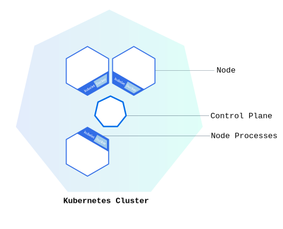

# Kubernetes

Kubernetes可编排在计算机集群内和跨计算机集群的应用容器的部署(调度)和执行,以更高效的方式跨集群自动分布和调度应用容器。

**Kubernetes 协调一个高可用计算机集群，每个计算机互相连接之后作为同一个工作单元运行。** Kubernetes 中的抽象允许你将容器化的应用部署到集群，而无需将它们绑定到某个特定的独立计算机。

为了使用这种新的部署模型，需要以将应用与单个主机解耦的方式打包：它们需要被容器化。 与过去的那种应用直接以包的方式深度与主机集成的部署模型相比，容器化应用更灵活、更可用。

## 概念

一个 Kubernetes 集群包含两种类型的资源：

- **控制面（Control Plane）** 调度整个集群
- **节点（Nodes）** 负责运行应用



### 控制平面(Control Plane)

**控制平面负责管理整个集群。** 控制面协调集群中的所有活动，例如调度应用、维护应用的期望状态、对应用扩容以及将新的更新上线等等。

控制面管理集群，节点用于托管运行中的应用

### 节点(Node)

节点是一个虚拟机或物理机,它在Kubernetes集群中充当工作机器的角色.

每个节点都有**Kubelet**组件,它管理节点而且是节点与控制面通信的代理.节点还应该具有处理容器操作的工具,例如 [containerd](https://containerd.io/docs/) 或 [CRI-O](https://cri-o.io/#what-is-cri-o).

> 生产级流量的Kubernetes集群至少应具有三个节点,因为如果只有一个节点，出现故障时其对应的 [etcd](https://kubernetes.io/zh-cn/docs/concepts/architecture/#etcd) 成员和控制面实例都会丢失， 并且冗余会受到影响。你可以通过添加更多控制面节点来降低这种风险。

### 对象

#### Pod

[Pod](https://kubernetes.io/zh-cn/docs/concepts/workloads/pods/)是可以在 Kubernetes 中创建和管理的、最小的可部署的计算单元。

**Pod**是一组（一个或多个）共享存储、网络、容器规约的[容器](https://kubernetes.io/zh-cn/docs/concepts/containers/)；Pod 所建模的是特定于应用的“逻辑主机”，其中包含一个或多个应用容器， 这些容器相对紧密地耦合在一起。 在同一逻辑主机上运行的云应用类似于在非云环境中相同的物理机或虚拟机上运行的应用。

#### Deployment

Kubernetes [**Deployment**](https://kubernetes.io/zh-cn/docs/concepts/workloads/controllers/deployment/) 检查 Pod 的健康状况，管理 Pod 的生米周期.

#### Service

Service 是将一组 Pod 的网络应用程序作为统一服务暴露的方法，使客户端能够稳定访问应用，无需关心后端 Pod 的变化。

> **为什么需要 Service？**
>
> - Pod 是临时的：Deployment 会动态创建/销毁 Pod
> - Pod IP 会变化：每次重建 Pod 都会获得新 IP
> - 前端无法追踪：当后端 Pod 组（如图片处理服务）发生变化时，前端难以发现可用实例

**Service 的核心价值**：

1. **解耦**：为动态 Pod 集合提供稳定访问端点
2. **抽象**：客户端只需访问 Service，无需感知后端 Pod 变化
3. **负载均衡**：自动将流量分发到健康 Pod

## 架构

Kubernetes集群由一个控制平面(Control Plane)和工作节点组成,每个集群至少需要一个工作节点来运行Pod

下面部分概述了构建一个完整且可运行的Kubernetes集群所需的各种组件.


### 组件


Kubernetes集群由一个控制平面(Control plane)和多个节点(Node)组成

#### 控制平面组件

控制平面组件会为集群做出全局决策，比如资源的调度。 以及检测和响应集群事件，例如当不满足 Deployment 的 `replicas` 字段时，要启动新的 [Pod](https://kubernetes.io/zh-cn/docs/concepts/workloads/pods/)）。

控制平面组件可以在集群中的任何节点上运行。 然而，为了简单起见，安装脚本通常会在同一个计算机上启动所有控制平面组件， 并且不会在此计算机上运行用户容器。 

##### kube-apiserver

API 服务器是集群的API网关，所有内部/外部请求的统一入口,API 服务器是 Kubernetes 控制平面的前端,支持水平扩展.

> Kubernetes API 服务器的主要实现是 [kube-apiserver](https://kubernetes.io/zh-cn/docs/reference/command-line-tools-reference/kube-apiserver/)。 `kube-apiserver` 设计上考虑了水平扩缩，也就是说，它可通过部署多个实例来进行扩缩。 你可以运行 `kube-apiserver` 的多个实例，并在这些实例之间平衡流量。

##### etcd

一致且高可用的键值存储，用作 存储Kubernetes 集群所有状态数据。

> 注意,生产环境需要单独备份

##### kube-scheduler

`kube-scheduler` 是控制平面的组件， 负责监视新创建的、未指定运行node的Pods,并选择节点来让 Pod 在上面运行。

主要功能是为新创建的Pod选择合适的工作节点,调度依据有资源需求,节点负载,亲和策略等

##### kube-controller-manager

kube-controller-manager负责运行[控制器](https://kubernetes.io/zh-cn/docs/concepts/architecture/controller/)进程,确保集群状态符合预期

从逻辑上讲， 每个[控制器](https://kubernetes.io/zh-cn/docs/concepts/architecture/controller/)都是一个单独的进程， 但是为了降低复杂性，它们都被编译到同一个可执行文件，并在同一个进程中运行。

控制器有许多不同类型。以下是一些例子：

- Node 控制器：负责节点状态监控
- Job 控制器：管理一次性任务的 Job 对象，然后创建 Pod 来运行这些任务直至完成
- EndpointSlice 控制器：填充 EndpointSlice 对象（以提供 Service 和 Pod 之间的链接）。
- ServiceAccount 控制器：为新的命名空间创建默认的 ServiceAccount。

##### cloud-controller-manager (可选)

对接云平台API,实现云原生集成

下面的控制器都包含对云平台驱动的依赖：

- Node 控制器：云节点生命周期管理
- Route 控制器：云路由表管理
- Service 控制器：云负载均衡器配置

#### 节点组件

节点组件会在每个节点上运行，负责维护运行的 Pod 并提供 Kubernetes 运行时环境。

##### kubelet

`kubelet` 会在集群中每个[节点（node）](https://kubernetes.io/zh-cn/docs/concepts/architecture/nodes/)上运行。 它接收Pod配置并保证[容器（containers）](https://kubernetes.io/zh-cn/docs/concepts/containers/)都运行在 [Pod](https://kubernetes.io/zh-cn/docs/concepts/workloads/pods/) 中。

[kubelet](https://kubernetes.io/zh-cn/docs/reference/command-line-tools-reference/kubelet/) 接收一组通过各类机制提供给它的 PodSpec(Pod规约)，确保这些 PodSpec 中描述的容器处于运行状态且健康。 kubelet 不会管理不是由 Kubernetes 创建的容器。

##### kube-proxy(可选)

[kube-proxy](https://kubernetes.io/zh-cn/docs/reference/command-line-tools-reference/kube-proxy/) 是集群中每个[节点（node）](https://kubernetes.io/zh-cn/docs/concepts/architecture/nodes/)上所运行的网络代理， 实现 Kubernetes [服务（Service）](https://kubernetes.io/zh-cn/docs/concepts/services-networking/service/) 的网络代理,维护Pod网络规则,提供负载均衡能力。

如果你使用[网络插件](https://kubernetes.io/zh-cn/docs/concepts/architecture/#network-plugins)为 Service 实现本身的数据包转发， 并提供与 kube-proxy 等效的行为，那么你不需要在集群中的节点上运行 kube-proxy。

##### 容器运行时（Container runtime）

这个基础组件是 Kubernetes 实际运行容器的底层引擎。 它负责管理 Kubernetes 环境中容器的执行和生命周期。

> Kubernetes 支持许多容器运行环境，例如 [containerd](https://containerd.io/docs/)、 [CRI-O](https://cri-o.io/#what-is-cri-o) 以及 [Kubernetes CRI (容器运行环境接口)](https://github.com/kubernetes/community/blob/master/contributors/devel/sig-node/container-runtime-interface.md) 的其他任何实现。
>
> 集群可能需要每个节点上运行额外的软件,例如可能还需要linux节点上运行systemd来监督本地组件

### 插件

插件使用 Kubernetes 资源（[DaemonSet](https://kubernetes.io/zh-cn/docs/concepts/workloads/controllers/daemonset/)、 [Deployment](https://kubernetes.io/zh-cn/docs/concepts/workloads/controllers/deployment/) 等）实现集群功能。 因为这些插件提供集群级别的功能，插件中命名空间域的资源属于 `kube-system` 命名空间。

下面描述众多插件中的几种。有关可用插件的完整列表， 请参见[插件（Addons）](https://kubernetes.io/zh-cn/docs/concepts/cluster-administration/addons/)。

#### DNS

集群范围内的DNS解析

尽管其他插件都并非严格意义上的必需组件，但几乎所有 Kubernetes 集群都应该有[集群 DNS](https://kubernetes.io/zh-cn/docs/concepts/services-networking/dns-pod-service/)， 因为很多示例都需要 DNS 服务。

集群 DNS 是一个 DNS 服务器，和环境中的其他 DNS 服务器一起工作，它为 Kubernetes 服务提供 DNS 记录。

Kubernetes 启动的容器自动将此 DNS 服务器包含在其 DNS 搜索列表中。

#### Web界面(Dashboard)

通过web界面进行集群管理

[Dashboard](https://kubernetes.io/zh-cn/docs/tasks/access-application-cluster/web-ui-dashboard/) 是 Kubernetes 集群的通用的、基于 Web 的用户界面。 它使用户可以管理集群中运行的应用程序以及集群本身，并进行故障排除。

#### 容器资源监控

容器资源监控(Container Resource Monitoring)用于收集和存储容器指标,将关于容器的一些常见的时序度量值保存到一个集中的数据库中，并提供浏览这些数据的界面。

#### 集群层面日志

集群层面日志(Cluster-level Logging)用于将容器日志保存到中央日志存储

机制负责将容器的日志数据保存到一个集中的日志存储中， 这种集中日志存储提供搜索和浏览接口。

#### 网络插件

[网络插件](https://kubernetes.io/zh-cn/docs/concepts/extend-kubernetes/compute-storage-net/network-plugins) 是实现容器网络接口（CNI）规范的软件组件。它们负责为 Pod 分配 IP 地址，并使这些 Pod 能在集群内部相互通信。

### 架构变种

虽然 Kubernetes 的核心组件保持一致，但它们的部署和管理方式可能有所不同。 

#### 控制平面部署选项

控制平面组件可以通过以下几种方式部署:

1. 传统部署:控制平面组件直接在专有机器或虚拟机上运行,通常作为systemd服务进行管理
2. 静态Pod:控制平面组件作为静态Pod部署,由特定节点的kubelet管理.这是想kubeadm这样的工具常用的方法
3. 自托管:控制平面在Kubernetes集群本身内部作为Pod运行,由Deployments、StatefulSets 或其他 Kubernetes 原语管理。
4. 托管Kubernetes服务:云平台通常将控制平面抽象出来,将其组件作为其服务的一部分进行管理

#### 工作负载调度说明

含控制平面组件在内的工作负载的调度可能因集群大小、性能要求和操作策略而有所不同：

- 在较小或开发集群中，控制平面组件和用户工作负载可能在同一节点上运行。
- 较大的生产集群通常将特定节点专用于控制平面组件，将其与用户工作负载隔离。
- 一些组织在控制平面节点上运行关键组件或监控工具。

#### 集群管理工具

像 kubeadm、kops 和 Kubespray 这样的工具提供了不同的集群部署和管理方法， 每种方法都有自己的组件布局和管理方式。

Kubernetes 架构的灵活性使各组织能够根据特定需求调整其集群，平衡操作复杂性、性能和管理开销等因素。

#### 定制和可扩展性

Kubernetes 架构允许大幅度的定制：

- 你可以部署自定义的调度器与默认的 Kubernetes 调度器协同工作，也可以完全替换掉默认的调度器。
- API 服务器可以通过 CustomResourceDefinition 和 API 聚合进行扩展。
- 云平台可以使用 cloud-controller-manager 与 Kubernetes 深度集成。

Kubernetes 架构的灵活性使各组织能够根据特定需求调整其集群，平衡操作复杂性、性能和管理开销等因素。

## 创建集群(minikube)

minikube能够快速搭建本地 Kubernetes 集群

### 安装

```
curl -LO https://github.com/kubernetes/minikube/releases/latest/download/minikube-linux-amd64
sudo install minikube-linux-amd64 /usr/local/bin/minikube && rm minikube-linux-amd64
```

安装之前还需安装容器或虚拟机管理器,如Docker、QEMU、Hyperkit、Hyper-V、KVM、Parallels、Podman、VirtualBox或VMware Fusion/Workstation

安装docker:

```
# 配置docker源
vim /etc/apt/sources.list.d/docker.list

deb [arch=amd64 signed-by=/etc/apt/keyrings/docker.asc] https://download.docker.com/linux/ubuntu   jammy stable

apt-get install docker-ce docker-ce-cli containerd.io docker-buildx-plugin docker-compose-plugin
```

安装完minikube还需要安装`kubectl`

```
sudo apt-get update
# apt-transport-https 可以是一个虚拟包；如果是这样，你可以跳过这个包
sudo apt-get install -y apt-transport-https ca-certificates curl gnupg

# 如果 `/etc/apt/keyrings` 目录不存在，则应在 curl 命令之前创建它，请阅读下面的注释。
# sudo mkdir -p -m 755 /etc/apt/keyrings
curl -fsSL https://pkgs.k8s.io/core:/stable:/v1.33/deb/Release.key | sudo gpg --dearmor -o /etc/apt/keyrings/kubernetes-apt-keyring.gpg
sudo chmod 644 /etc/apt/keyrings/kubernetes-apt-keyring.gpg # allow unprivileged APT programs to read this keyring   

# 这会覆盖 /etc/apt/sources.list.d/kubernetes.list 中的所有现存配置
echo 'deb [signed-by=/etc/apt/keyrings/kubernetes-apt-keyring.gpg] https://pkgs.k8s.io/core:/stable:/v1.33/deb/ /' | sudo tee /etc/apt/sources.list.d/kubernetes.list
sudo chmod 644 /etc/apt/sources.list.d/kubernetes.list   # 有助于让诸如 command-not-found 等工具正常工作

# 安装kubectl
sudo apt-get update
sudo apt-get install -y kubectl
```

### 运行

使用`minikube start`来创建Minikube集群

打开kubernetes仪表板(web服务)可以可视化创建kubernetes资源,例如Deployment和Service.

```
# 启动一个新的终端，并保持此命令运行。
minikube dashboard
```

可以使用`--url`参数来返回url而不是打开浏览器.

> 在虚拟机使用中发现使用主机的浏览器无法访问返回的url,使用netsatat发现其监听的是127.0.0.1,可以通过kubectl配置使用0.0.0.0,也可以在主机运行`ssh -L 40715:127.0.0.1:40715 newuser@192.168.163.79`映射端口临时使用,在本地访问``127.0.0.1:port`

### 创建对象

#### Deployment

Kubernetes [**Deployment**](https://kubernetes.io/zh-cn/docs/concepts/workloads/controllers/deployment/) 检查 Pod 的健康状况，并在 Pod 中的容器终止的情况下重新启动新的容器。 Deployment 是管理 Pod 创建和扩展的推荐方法。

```
# 使用 kubectl create 命令创建管理 Pod 的 Deployment。该 Pod 根据提供的 Docker 镜像运行容器。
# 此镜像为一个包含 Web 服务器的测试容器镜像
kubectl create deployment hello-node --image=registry.k8s.io/e2e-test-images/agnhost:2.39 -- /agnhost netexec --http-port=8080

# 查看Deployment
kubectl get deployments

# 查看Pod
kubectl get pods

# 查看集群事件
kubectl get events

# 查看kubectl配置
kubectl config view

# 查看pod中容器的应用程序的日志
# 首先获得pod容器名
kubectl get pods
NAME                         READY   STATUS    RESTARTS   AGE
hello-node-c74958b5d-n2wqp   1/1     Running   0          22m
# 应用程序的日志
kubetctl logs hello-node-c74958b5d-n2wqp
```

#### Service

默认情况下,Pod只能通过Kubernetes集群中的内部IP地址访问.要使得hello-node容器可以从Kubernetes虚拟网络的外部访问,必须将Pod通过Kubernetes Service公开出来.

1. 使用kubectl expose将Pod暴露给公网:
   ```
   kubectl expose deployment hello-node --type=LoadBalancer --port=8080
   ```

   这里的`--type=LoadBalancer`参数表明希望将Service暴露到集群外部,由于测试镜像中的应用程序代码仅监听TCP 8080端口,所以即使使用`kubectl expose`暴露其他端口也无法访问

2. 查看创建的Service:
   ```
   kubectl get services
   ```

   对于支持负载均衡器的云服务平台而言，平台将提供一个外部 IP 来访问该服务。 在 Minikube 上，`LoadBalancer` 使得服务可以通过命令 `minikube service` 访问。

3. 打开浏览器窗口:
   ```
   minikube service hello-node
   ```

   这将打开一个浏览器窗口，为应用程序提供服务并显示应用的响应。

### 启用插件

Minikube有一组内置的插件,可以在本地Kubernetes环境中启用,禁用和打开

1. 列出当前支持的插件:
   ```
   minikube addons list
   ```

2. 启用插件`metrics-server`
   ```
   minikube addons enable metrics-server
   ```

3. 查看通过安装插件所创建的Pod和Service
   ```
   kubectl get pod,svc -n kube-system
   NAME                                   READY   STATUS              RESTARTS      AGE
   pod/coredns-674b8bbfcf-4wt6s           1/1     Running             2 (30m ago)   19h
   pod/etcd-minikube                      1/1     Running             2 (30m ago)   19h
   pod/kube-apiserver-minikube            1/1     Running             2 (30m ago)   19h
   pod/kube-controller-manager-minikube   1/1     Running             2 (30m ago)   19h
   pod/kube-proxy-24zmz                   1/1     Running             2 (30m ago)   19h
   pod/kube-scheduler-minikube            1/1     Running             2 (30m ago)   19h
   pod/metrics-server-7fbb699795-w9fh8    0/1     ContainerCreating   0             84s
   pod/storage-provisioner                1/1     Running             5 (30m ago)   19h
   
   NAME                     TYPE        CLUSTER-IP      EXTERNAL-IP   PORT(S)                  AGE
   service/kube-dns         ClusterIP   10.96.0.10      <none>        53/UDP,53/TCP,9153/TCP   19h
   service/metrics-server   ClusterIP   10.110.62.216   <none>        443/TCP                  84s
   ```

4. 检查`metrics-server`的输出
   ```
   kubectl top pods
   NAME                         CPU(cores)   MEMORY(bytes)   
   hello-node-c74958b5d-n2wqp   1m           25Mi 
   ```

5. 禁用`metrics-server`
   ```
   minikube addons disable metrics-server
   🌑  "The 'metrics-server' addon is disabled
   ```

### 清理

清理在集群中创建的资源:

```
kubectl delete service hello-node
kubectl delete deployment hello-node
```

停止Minikube集群:

```
minikube stop
```

也可以删除Minikube虚拟机(VM)

```
minikube delete
```

## 创建集群(Kubeadm)

与Minikube不同,kubeadm 通过执行必要的操作来启动和运行最小可用集群。按照设计，它只关注启动引导，而非配置机器。它提供了 `kubeadm init` 和 `kubeadm join` 的工具， 作为创建 Kubernetes 集群的 “快捷途径” 的最佳实践。

### 安装

kubeadm要求:

1. 2GB内存,2核心CPU
2. 集群中的网络彼此相互连接
3. 节点中不能有重复的主机名,MAC地址或product_uuid
4. 配置交换分区或禁止交换分区

#### 禁止交换分区:

```
# 临时禁止
swapoff -a

# 禁止开机自动挂载交换分区
vim /etc/fstab
#/swap.img       none    swap    sw      0       0
```

#### 确保节点唯一性

```
# 获取网络接口的MAC地址
ip link

# 对product_uuid进行校验
sudo cat /sys/class/dmi/id/product_uuid
```

#### 检查必要的端口开放

控制面板:

| 协议 | 方向 | 端口范围  | 目的                    | 使用者               |
| ---- | ---- | --------- | ----------------------- | -------------------- |
| TCP  | 入站 | 6443      | Kubernetes API 服务器   | 所有                 |
| TCP  | 入站 | 2379-2380 | etcd 服务器客户端 API   | kube-apiserver、etcd |
| TCP  | 入站 | 10250     | kubelet API             | 自身、控制面         |
| TCP  | 入站 | 10259     | kube-scheduler          | 自身                 |
| TCP  | 入站 | 10257     | kube-controller-manager | 自身                 |

工作节点:

| 协议 | 方向 | 端口范围    | 目的               | 使用者           |
| ---- | ---- | ----------- | ------------------ | ---------------- |
| TCP  | 入站 | 10250       | kubelet API        | 自身、控制面     |
| TCP  | 入站 | 10256       | kube-proxy         | 自身、负载均衡器 |
| TCP  | 入站 | 30000-32767 | NodePort Services† | 所有             |
| UDP  | 入站 | 30000-32767 | NodePort Services† | 所有             |

#### 安装容器运行时

为了在 Pod 中运行容器，Kubernetes 使用容器运行时（Container Runtime）。

默认情况下，Kubernetes 使用[容器运行时接口（Container Runtime Interface，CRI）](https://kubernetes.io/zh-cn/docs/concepts/architecture/cri) 来与你所选择的容器运行时交互。

如果你不指定运行时，kubeadm 会自动尝试通过扫描已知的端点列表来检测已安装的容器运行时。

如果检测到有多个或者没有容器运行时，kubeadm 将抛出一个错误并要求你指定一个想要使用的运行时。

> Docker Engine 没有实现 [CRI](https://kubernetes.io/zh-cn/docs/concepts/architecture/cri/)， 而这是容器运行时在 Kubernetes 中工作所需要的。 为此，必须安装一个额外的服务 [cri-dockerd](https://github.com/Mirantis/cri-dockerd)。 cri-dockerd 是一个基于传统的内置 Docker 引擎支持的项目， 它在 1.24 版本从 kubelet 中[移除](https://kubernetes.io/zh-cn/dockershim)。

安装[docker-ce](https://docs.docker.com/engine/install/ubuntu/#install-using-the-repository)(comminity edition,官方社区版)

```
# Add Docker's official GPG key:
sudo apt-get update
sudo apt-get install ca-certificates curl
sudo install -m 0755 -d /etc/apt/keyrings
sudo curl -fsSL https://download.docker.com/linux/ubuntu/gpg -o /etc/apt/keyrings/docker.asc
sudo chmod a+r /etc/apt/keyrings/docker.asc

# Add the repository to Apt sources:
echo \
  "deb [arch=$(dpkg --print-architecture) signed-by=/etc/apt/keyrings/docker.asc] https://download.docker.com/linux/ubuntu \
  $(. /etc/os-release && echo "${UBUNTU_CODENAME:-$VERSION_CODENAME}") stable" | \
  sudo tee /etc/apt/sources.list.d/docker.list > /dev/null
sudo apt-get update
sudo apt-get install docker-ce
```

安装[cri-dockerd](https://github.com/Mirantis/cri-dockerd/releases)

```
curl -O  https://github.com/Mirantis/cri-dockerd/releases/download/v0.3.17/cri-dockerd-0.3.17.amd64.tgz
tar -xvf cri-dockerd-0.3.17.amd64.tgz 
sudo install -o root -g root -m 0755 ./cri-dockerd/cri-dockerd /usr/bin/cri-dockerd
```

还需要[配置文件](https://github.com/Mirantis/cri-dockerd/tree/master/packaging/systemd)

```
# cri-docker.service

[Unit]
Description=CRI Interface for Docker Application Container Engine
Documentation=https://docs.mirantis.com
After=network-online.target firewalld.service docker.service
Wants=network-online.target
Requires=cri-docker.socket

[Service]
Type=notify
# 此处添加了阿里云源的参数
ExecStart=/usr/bin/cri-dockerd --container-runtime-endpoint fd:// --pod-infra-container-image=registry.aliyuncs.com/google_containers/pause:3.10
ExecReload=/bin/kill -s HUP $MAINPID
TimeoutSec=0
RestartSec=2
Restart=always

# Note that StartLimit* options were moved from "Service" to "Unit" in systemd 229.
# Both the old, and new location are accepted by systemd 229 and up, so using the old location
# to make them work for either version of systemd.
StartLimitBurst=3

# Note that StartLimitInterval was renamed to StartLimitIntervalSec in systemd 230.
# Both the old, and new name are accepted by systemd 230 and up, so using the old name to make
# this option work for either version of systemd.
StartLimitInterval=60s

# Having non-zero Limit*s causes performance problems due to accounting overhead
# in the kernel. We recommend using cgroups to do container-local accounting.
LimitNOFILE=infinity
LimitNPROC=infinity
LimitCORE=infinity

# Comment TasksMax if your systemd version does not support it.
# Only systemd 226 and above support this option.
TasksMax=infinity
Delegate=yes
KillMode=process

[Install]
WantedBy=multi-user.target
```

```
# cri-docker.socket
[Unit]
Description=CRI Docker Socket for the API
PartOf=cri-docker.service

[Socket]
ListenStream=%t/cri-dockerd.sock
SocketMode=0660
SocketUser=root
SocketGroup=docker

[Install]
WantedBy=sockets.target
```

把它们分别放在`/etc/systemd/system/cri-docker.service`和`/etc/systemd/system/cri-docker.socket`

启动cri-docker守护进程:

```
sudo systemctl daemon-reload
sudo systemctl enable --now cri-docker.socket
```

[安装kubeadm](https://kubernetes.io/zh-cn/docs/setup/production-environment/tools/kubeadm/install-kubeadm/#installing-kubeadm-kubelet-and-kubectl)

```
sudo apt-get update && sudo apt-get install -y apt-transport-https
# 下载用于 Kubernetes 软件包仓库的公共签名密钥
curl -fsSL https://mirrors.aliyun.com/kubernetes-new/core/stable/v1.33/deb/Release.key | sudo gpg --dearmor -o /etc/apt/keyrings/kubernetes-apt-keyring.gpg
# 添加 Kubernetes apt 仓库,安装其他版本需要更改url
echo "deb [signed-by=/etc/apt/keyrings/kubernetes-apt-keyring.gpg] https://mirrors.aliyun.com/kubernetes-new/core/stable/v1.33/deb/ /" | sudo tee /etc/apt/sources.list.d/kubernetes.list

sudo apt-get update
sudo apt-get install -y kubelet kubeadm kubectl
# 锁定其版本
sudo apt-mark hold kubelet kubeadm kubectl
```

> kubeadm和kubelet需要在控制面板和mode节点中安装,kubectl一般只需要在控制面板中安装

### 启动集群

使用`kubeadm init`命令可以初始化一个控制平面节点,它可以使用命令行参数或使用配置文件,这里我们使用配置文件配置:

#### 配置

使用`kubeadm config print init-defaults`[打印用于 'kubeadm init' 的默认 init 配置](https://kubernetes.io/zh-cn/docs/reference/setup-tools/kubeadm/kubeadm-config/#cmd-config-print-init-defaults)

```
sudo kubeadm config print init-defaults > kubeadm_init.yaml
```

这里我们把它保存为配置文件,运行时再次读取即可

```
# 默认的配置文件内容
apiVersion: kubeadm.k8s.io/v1beta4
bootstrapTokens:
- groups:
  - system:bootstrappers:kubeadm:default-node-token
  token: abcdef.0123456789abcdef
  ttl: 24h0m0s
  usages:
  - signing
  - authentication
kind: InitConfiguration
localAPIEndpoint:
  advertiseAddress: 1.2.3.4
  bindPort: 6443
nodeRegistration:
  criSocket: unix:///var/run/containerd/containerd.sock
  imagePullPolicy: IfNotPresent
  imagePullSerial: true
  name: node
  taints: null
timeouts:
  controlPlaneComponentHealthCheck: 4m0s
  discovery: 5m0s
  etcdAPICall: 2m0s
  kubeletHealthCheck: 4m0s
  kubernetesAPICall: 1m0s
  tlsBootstrap: 5m0s
  upgradeManifests: 5m0s
---
apiServer: {}
apiVersion: kubeadm.k8s.io/v1beta4
caCertificateValidityPeriod: 87600h0m0s
certificateValidityPeriod: 8760h0m0s
certificatesDir: /etc/kubernetes/pki
clusterName: kubernetes
controllerManager: {}
dns: {}
encryptionAlgorithm: RSA-2048
etcd:
  local:
    dataDir: /var/lib/etcd
imageRepository: registry.k8s.io
kind: ClusterConfiguration
kubernetesVersion: 1.33.0
networking:
  dnsDomain: cluster.local
  serviceSubnet: 10.96.0.0/12
proxy: {}
scheduler: {}
```

需要修改一些内容:

- localAPIEndpoint-advertiseAddress,API 服务器所公布的其正在监听的 IP 地址。如果未设置，则使用默认网络接口。配置为主机的IP地址即可
- nodeRegistration-criSocket,要连接的 CRI 套接字的路径。如果为空，则 kubeadm 将尝试自动检测此值； 仅当安装了多个 CRI 或具有非标准 CRI 套接字时，才使用此选项。这里配置为`unix:///var/run/cri-dockerd.sock`
- networking-podSubnet,配置网络插件(flannel)的地址
- imageRepository,镜像仓库,这里配置为` registry.aliyuncs.com/google_containers `使用阿里云的镜像源
- 添加KubeProxyConfiguration,指定模式为ipvs

修改后的配置文件:

```
apiVersion: kubeadm.k8s.io/v1beta4
bootstrapTokens:
- groups:
  - system:bootstrappers:kubeadm:default-node-token
  token: abcdef.0123456789abcdef
  ttl: 24h0m0s
  usages:
  - signing
  - authentication
kind: InitConfiguration
localAPIEndpoint:
  advertiseAddress: 192.168.163.79
  bindPort: 6443
nodeRegistration:
  criSocket: unix:///var/run/cri-dockerd.sock
  imagePullPolicy: IfNotPresent
  imagePullSerial: true
  name: node
  taints: null
timeouts:
  controlPlaneComponentHealthCheck: 4m0s
  discovery: 5m0s
  etcdAPICall: 2m0s
  kubeletHealthCheck: 4m0s
  kubernetesAPICall: 1m0s
  tlsBootstrap: 5m0s
  upgradeManifests: 5m0s
---
apiServer: {}
apiVersion: kubeadm.k8s.io/v1beta4
caCertificateValidityPeriod: 87600h0m0s
certificateValidityPeriod: 8760h0m0s
certificatesDir: /etc/kubernetes/pki
clusterName: kubernetes
controllerManager: {}
dns: {}
encryptionAlgorithm: RSA-2048
etcd:
  local:
    dataDir: /var/lib/etcd
imageRepository: registry.aliyuncs.com/google_containers
kind: ClusterConfiguration
kubernetesVersion: 1.33.0
networking:
  dnsDomain: cluster.local
  serviceSubnet: 10.96.0.0/12
  podSubnet: 10.244.0.0/16
proxy: {}
scheduler: {}
---
apiVersion: kubeproxy.config.k8s.io/v1alpha1 
kind: KubeProxyConfiguration
mode: ipvs
ipvs:
  strictARP: true
  scheduler: rr
```

#### 拉取镜像

查看镜像列表

```
kubeadm config images list --config ./kubeadm_init.yaml

registry.aliyuncs.com/google_containers/kube-apiserver:v1.33.0
registry.aliyuncs.com/google_containers/kube-controller-manager:v1.33.0
registry.aliyuncs.com/google_containers/kube-scheduler:v1.33.0
registry.aliyuncs.com/google_containers/kube-proxy:v1.33.0
registry.aliyuncs.com/google_containers/coredns:v1.12.0
registry.aliyuncs.com/google_containers/pause:3.10
registry.aliyuncs.com/google_containers/etcd:3.5.21-0
```

拉取镜像

```
sudo kubeadm config images pull --config ./kubeadm_init.yaml
```

#### 初始化控制平面

```
sudo kubeadm init --config ./kubeadm_init.yaml

Your Kubernetes control-plane has initialized successfully!

To start using your cluster, you need to run the following as a regular user:```

  mkdir -p $HOME/.kube
  sudo cp -i /etc/kubernetes/admin.conf $HOME/.kube/config
  sudo chown $(id -u):$(id -g) $HOME/.kube/config

Alternatively, if you are the root user, you can run:

  export KUBECONFIG=/etc/kubernetes/admin.conf

You should now deploy a pod network to the cluster.
Run "kubectl apply -f [podnetwork].yaml" with one of the options listed at:
  https://kubernetes.io/docs/concepts/cluster-administration/addons/

Then you can join any number of worker nodes by running the following on each as root:

kubeadm join 192.168.163.70:6443 --token abcdef.0123456789abcdef \
        --discovery-token-ca-cert-hash sha256:f5ed311139d09e8bb79d729701c70ea1deea5514e45d779801c33dfc0657ad8e 
```

> 如果需要修改集群配置,可以使用
> ```
> # 存在多个容器进行时时必须指定
> sudo kubeadm reset --cri-socket unix:///var/run/cri-dockerd.sock -f
> 
> #　清理残留文件
> sudo rm -rf /etc/kubernetes/ /var/lib/etcd /etc/cni/net.d ~/.kube
> sudo iptables -F && sudo iptables -t nat -F
> 
> # 重新初始化
> sudo kubeadm init --config ./kubeadm_init.yaml
> ```
>

复制配置文件

```
mkdir -p $HOME/.kube
sudo cp -i /etc/kubernetes/admin.conf $HOME/.kube/config
sudo chown $(id -u):$(id -g) $HOME/.kube/confi
```

#### 验证IPVS模式生效

首先查看所有pod获得 kube-proxy Pod的名字

```
kubectl get pods -A
NAMESPACE     NAME                           READY   STATUS    RESTARTS        AGE
kube-system   coredns-757cc6c8f8-hdb72       0/1     Pending   0               3h53m
kube-system   coredns-757cc6c8f8-z257k       0/1     Pending   0               3h53m
kube-system   etcd-node                      1/1     Running   2 (3m25s ago)   3h53m
kube-system   kube-apiserver-node            1/1     Running   2 (3m25s ago)   3h53m
kube-system   kube-controller-manager-node   1/1     Running   2 (3m25s ago)   3h53m
kube-system   kube-proxy-qljrq               1/1     Running   2 (3m25s ago)   3h53m
kube-system   kube-scheduler-node            1/1     Running   2 (3m25s ago)   3h53m
```

> 此时coredns没有工作是因为还没有安装网络插件

```
# 查看kube-proxy日志
kubectl logs -n kube-system kube-proxy-qljrq | grep "Using ipvs Proxier"
I0703 11:39:56.403007       1 server_linux.go:202] "Using ipvs Proxier"
```

#### 使用网络插件

根据上面的提示在[插件页面](https://kubernetes.io/zh-cn/docs/concepts/cluster-administration/addons/)安装[Flannel](https://github.com/flannel-io/flannel#deploying-flannel-manually)插件

```
curl -O https://github.com/flannel-io/flannel/releases/latest/download/kube-flannel.yml

# 检查kubeadm_init.yaml中networking-podSubnet的地址与kube-flannel.yml是否相同
kubectl apply -f kube-flannel.yml
```

查看节点状态

```
kubectl get pods -A
```

> 发现启动失败了.觉得可能是镜像下载的问题,更换镜像地址之后依旧无法启动,查看报错信息:
>
> ```
> kubectl logs -n kube-flannel kube-flannel-ds-4pzsd
> Defaulted container "kube-flannel" out of: kube-flannel, install-cni-plugin (init), install-cni (init)
> I0703 12:44:59.935850       1 main.go:211] CLI flags config: {etcdEndpoints:http://127.0.0.1:4001,http://127.0.0.1:2379 etcdPrefix:/coreos.com/network etcdKeyfile: etcdCertfile: etcdCAFile: etcdUsername: etcdPassword: version:false kubeSubnetMgr:true kubeApiUrl: kubeAnnotationPrefix:flannel.alpha.coreos.com kubeConfigFile: iface:[] ifaceRegex:[] ipMasq:true ifaceCanReach: subnetFile:/run/flannel/subnet.env publicIP: publicIPv6: subnetLeaseRenewMargin:60 healthzIP:0.0.0.0 healthzPort:0 iptablesResyncSeconds:5 iptablesForwardRules:true netConfPath:/etc/kube-flannel/net-conf.json setNodeNetworkUnavailable:true}
> W0703 12:44:59.935980       1 client_config.go:659] Neither --kubeconfig nor --master was specified.  Using the inClusterConfig.  This might not work.
> I0703 12:44:59.968091       1 kube.go:139] Waiting 10m0s for node controller to sync
> I0703 12:44:59.968143       1 kube.go:469] Starting kube subnet manager
> I0703 12:45:00.968686       1 kube.go:146] Node controller sync successful
> I0703 12:45:00.968715       1 main.go:231] Created subnet manager: Kubernetes Subnet Manager - node
> I0703 12:45:00.968722       1 main.go:234] Installing signal handlers
> I0703 12:45:00.969055       1 main.go:479] Found network config - Backend type: vxlan
> E0703 12:45:00.969209       1 main.go:268] Failed to check br_netfilter: stat /proc/sys/net/bridge/bridge-nf-call-iptables: no such file or directory
> ```
>
> 发现需要配置内核参数:
>
> ```
> sudo vim /etc/modules-load.d/br_netfilter.conf
> br_netfilter
> 
> sudo systemctl restart systemd-modules-load.service
> ```
>

```
# 成功部署后的节点状态
NAMESPACE      NAME                           READY   STATUS    RESTARTS      AGE
kube-flannel   kube-flannel-ds-9qx7k          1/1     Running   1 (15m ago)   24m
kube-system    coredns-757cc6c8f8-hdb72       1/1     Running   1 (15m ago)   5h31m
kube-system    coredns-757cc6c8f8-z257k       1/1     Running   1 (15m ago)   5h31m
kube-system    etcd-node                      1/1     Running   3 (15m ago)   5h31m
kube-system    kube-apiserver-node            1/1     Running   3 (15m ago)   5h31m
kube-system    kube-controller-manager-node   1/1     Running   3 (15m ago)   5h31m
kube-system    kube-proxy-qljrq               1/1     Running   3 (15m ago)   5h31m
kube-system    kube-scheduler-node            1/1     Running   3 (15m ago)   5h31m
```

### 加入集群

#### 生成Token

```
kubeadm token create --print-join-command

kubeadm join 192.168.163.70:6443 --token 2re7wk.0u07fjm8x72s8z66 --discovery-token-ca-cert-hash sha256:00d8c4b12c3aea2c36076dba5b11232db8c218498a425b874d870270a74fb91d 
```

加入的时候需要额外指定一下`--cri-socket /var/run/cri-dockerd.sock`

```
# 在Node节点上运行
sudo kubeadm join 192.168.163.70:6443 --cri-socket /var/run/cri-dockerd.sock --token 2re7wk.0u07fjm8x72s8z66 --discovery-token-ca-cert-hash sha256:00d8c4b12c3aea2c36076dba5b11232db8c218498a425b874d870270a74fb91d 
```

> 在节点上也可以使用`sudo kubeadm reset -f --cri-socket unix:///var/run/cri-dockerd.sock`重置kubeadm状态

## 使用

### Deployment

Deployment用于管理运行一个应用负载的一组Pod,通常适用于无状态的负载,一个 Deployment 为 Pod 和 ReplicaSet 提供声明式的更新能力。

用户只需要负责描述 Deployment 中的目标状态，而 Deployment 控制器（Controller） 以受控速率更改实际状态， 使其变为期望状态。用户可以定义 Deployment 以创建新的 ReplicaSet，或删除现有 Deployment， 并通过新的 Deployment 收养其资源。

创建Deployment可以使用YAML文件或`kubectl`简单部署,这里使用YAML文件创建一个Nginx Pod

首先获取NginxPod的模板:

```
kubectl create deploy my-app --image=nginx:latest --replicas=3 --dry-run=client -o yaml > deployment.yaml
```

初始的模板如下:

```
apiVersion: apps/v1
kind: Deployment
metadata:
  creationTimestamp: null
  labels:
    app: my-app
  name: my-app
spec:
  # Pod副本数量
  replicas: 3
  selector:
    matchLabels:
      app: my-app
  strategy: {}
  template:
    metadata:
      creationTimestamp: null
      labels:
        app: my-app
    spec:
      containers:
      - image: nginx:latest
        name: nginx
        resources: {}
status: {}
```

启动Deployment:

```
kubectl apply -f deployment.yaml 
```

### Service


创建一个该Deployment的Service:

```
kubectl create service clusterip my-service --tcp=80:8080 --dry-run=client -o yaml > service.yaml
```

默认配置如下:
```
apiVersion: v1
kind: Service
metadata:
  creationTimestamp: null
  labels:
    app: my-service
  name: my-service
spec:
  ports:
  - name: 80-8080
    port: 80
    protocol: TCP
    targetPort: 8080
  selector:
    app: my-service
  type: ClusterIP
status:
  loadBalancer: {}
```

我们需要做一些修改:

```
apiVersion: v1
kind: Service
metadata:
  creationTimestamp: null
  labels:
    app: my-app-service	# 修改名称
  name: my-app-service
spec:
  ports:
  - name: http	# 修改名称标识,多端口时需要唯一
    port: 80	# service暴露的端口
    protocol: TCP
    targetPort: 80	# 容器实际端口
  - name: https	# 添加一个端口映射
    protocol: TCP
    port: 443
    targetPort: 8443
  selector:
    app: my-app	# 必须与Pod标签匹配
  type: ClusterIP
status:
  loadBalancer: {}
```

测试:

```
kubectl apply --dry-run=server -f service.yaml
```

运行:

```
kubectl apply -f service.yaml
```

在busybox中测试:

```
# 运行pod并等待(循环)
kubectl run test --image=busybox:1.36 --restart=Never -- /bin/sh -c "while true; do sleep 3600; done"
# 进入pod容器
kubectl exec -it test -- /bin/sh
# 测试域名解析
nslookup my-app-service
Server:         10.96.0.10
Address:        10.96.0.10:53
# 这些是自动补全机制尝试的多个可能的后缀
** server can't find my-app-service.cluster.local: NXDOMAIN

** server can't find my-app-service.svc.cluster.local: NXDOMAIN

** server can't find my-app-service.svc.cluster.local: NXDOMAIN

** server can't find my-app-service.cluster.local: NXDOMAIN

Name:   my-app-service.default.svc.cluster.local
Address: 10.96.249.48
# 测试Nginx
wget -q -O - http://my-app-service
<!DOCTYPE html>
<html>
<head>
<title>Welcome to nginx!</title>

# 删除busybox
kubectl delete pod test
```


## 问答题

### 第一天

```
1. K8s 是为了解决什么问题出现的和 Docker 有什么关系
k8s是为了解决容器编排与管理问题,最常使用的容器是Docker(也可以是虚拟机等容器)
2. K8s中有哪些核心组件，它们分别负责什么
kube-apiserver,是k8s集群的api门户
kube-scheduler,负责为新创建的Pod选择合适的工作节点
kube-controller-manager,负责运行控制器进程,使集群状态符合预期
cloud-controller-manager,负责对接云节点API
kubelet,在每个Node节点运行,确保Pod都运行在节点中
kube-proxy,Node节点的网络代理是service服务实现的一部分
容器运行时,k8s底层驱动容器
3. K8s中的最小单元是什么
Pod
4. 什么是容器运行时，有哪些常用的
容器运行时是k8s底层驱动容器,常用的有contianerd,CRI-O,Docker Engine(cri-dockerd)
5. 什么是CNI，有哪些常用的
容器网络接口
6. Pod与容器有什么区别
pod是逻辑主机,可以有一个或多个容器
7. 使用kubeadm安装一个Kubernetes集群
kubeadm init --config kubeadm_init.yaml
8. 使用Nginx镜像运行一个pod
kubectl run nginx-pod --image=nginx:latest --port=80
9. 如何查看此pod的事件
kubectl describe pod nginx-pod
10. 如何查看pod的日志
kubectl logs nginx-pod
11. 如何查看Pod启动在在哪个机器上
kubectl describe pod nginx-pod
12. 如何进入Pod中的容器
kubectl exec -it nginx-pod -- /bin/bash
13. K8s中什么是抽象资源，什么是实例资源
抽象资源是一类资源的模板,实例资源是根据抽象资源创建出来的具体对象
14. Pod是抽象对象还是实例
Pod本身是抽象资源,创建的Pod对象(如nginx-pod)是实例资源
15. 有哪些方法可以访问到上面部署的Nginx
1. 临时端口转发:kubectl port-forward pod/nginx-pod 8080:80
2. 集群内部访问:kubectl expose pod nginx-pod --name=nginx-svc --port=80 --target-port=80
3. 创建Ingress资源将外部流量路由到nginx-svc这个service
16. Pod如何重启
裸pod:
kubectl get pod nginx-pod -o yaml > pod-backup.yaml
kubectl delete pod nginx-pod
kubectl apply -f pod-backup.yaml
由控制器管理的pod(如Deployment)
kubectl rollout restart deployment/deploment_name
或
kubectl delete pod pod-name
17. 如何删除上面创建的Pod
kubectl delete pod nginx-pod
18. 这样单独创建Pod有什么缺点
pod应该是动态管理的,手动创建pod繁琐且不方便自动化管理
```

### 第二天

1. 什么是有状态服务和无状态服务
   ```
   无状态(stateless)意味着在创建新容器时，不会存储任何过去的数据或状态，也不需要持久化,例如Nginx
   有状态(stateful)应用程序通常涉及一些数据库,并处理对它的读取和写入,例如MySQL
   ```
2. 什么是冗余
   ```
   冗余是指在系统中额外部署超出最低需求的备用资源,提高可用性,增强容错能力
   ```
3. 在k8s中无状态服务的冗余如何实现
   ```
   1. 在Deployment控制器中通过replicas字段设置需要额外运行的副本数量
   2. Service作为负载均衡器,将请求自动分发到所有健康的Pod副本
   ```
4. kubectl create 中的--dry-run=client有什么作用,用于什么场景
   ```
   kubectl create 基于文件或标准输入创建一个资源
   --dry-run=client参数在不实际执行操作的情况下模拟操作结果，类似于 "试运行"
   可以用于生成资源配置模板,安全测试等
   # 生成 Deployment 的 YAML 模板（不实际部署）
   kubectl create deployment my-app --image=nginx:alpine --replicas=3 --dry-run=client -o yaml > deployment.yaml
   ```
5. Deployment的主要作用是什么,解决了什么问题
   ```
   Deployment用于管理运行一个应用负载的一组Pod,通常适用于无状态的负载
   一个 Deployment 为 Pod 和 ReplicaSet 提供声明式的更新能力。
   用户只需要负责描述 Deployment 中的目标状态，而 Deployment 控制器（Controller） 以受控速率更改实际状态， 使其变为期望状态。用户可以定义 Deployment 以创建新的 ReplicaSet，或删除现有 Deployment， 并通过新的 Deployment 收养其资源。
   ```
6. Deployment其后端调用的哪个服务
   ```
   ReplicaSet
   ```
7. 什么是滚动更新,默认值是多少,如何设置
   ```
   滚动更新是通过逐步缩减旧的 ReplicaSet，并扩容新的 ReplicaSet的方式更新Pod
   可以通过.maxUnavailable和.maxSurge分别控制最大不可用(更新过程中pod不可用的上限,默认25%)和最大峰值(可以创建的超出期望pod数量的个数,默认25%),可以是绝对数,也可以是百分比
   ```
8. 如果使用Deployment启动了多个Pod,那么其他服务是否需要挨个访问其ip或域名?有什么更好的方法

   ```
   不需要,使用deployment启动pod时,pod重启或重建后IP会改变,应该为deployment创建匹配的Service
   ```
9. 什么是Service,其主要功能是什么
   Kubernetes 中 Service 是 将运行在一个或一组 [Pod](https://kubernetes.io/zh-cn/docs/concepts/workloads/pods/) 上的网络应用程序公开为网络服务的方法。
10. Service的底层使用的什么服务
    ```
    iptables/ipvs
    ```
11. Service有几种网络类型,区别是什么
    ```
    4种
    1. ClusterIP(默认值),集群内部自动分配虚拟IP,适用于微服务间通信
    2. NodePort,通过每个节点上自动分配的IP和静态端口（NodePort）公开 Service。适合开发测试或临时访问
    3. LoadBalancer,使用云平台的负载均衡器向外部公开 Service。
    4. ExternalName,集群内部,不分配IP,仅具有DNS别名,将服务名解析为外部域名
    ```
12. endpoint是什么,和Service有什么关系
    ```
    enpoint是动态更新的IP列表,记录实际提供服务的Pod的真实IP和端口
    Service提供稳定的访问入口,将流量转发到Endpoint中的Pod
    ```
13. BusyBox在k8s中有什么作用
    ```
    BusyBox是一个轻量级的镜像,集成了300多个常用linux命令,在容器化环境中主要用于故障排查和系统维护
    ```
14. 创建一个Deployment,启动多副本Nginx并为其设置ClusterIP类型的Service,使用busybox访问此Service验证是否能够访问到所有Nginx副本
    ```
    kubectl apply -f deployment.yaml 
    kubectl apply -f service.yaml
    kubectl run test --image=busybox:1.36 --restart=Never -- /bin/sh -c "while true; do sleep 3600; done"
    kubectl exec -it test -- /bin/sh
    nslookup my-app-service
    wget -q -O - http://my-app-service
    ```
15. 设置kubectl别名为k,并配置命令自动补全
    ```
    vim /etc/profile.d/k8s.sh
    alias k=kubectl
    source /etc/profile.d/k8s.sh 
    
    # 配置 kubectl 补全
    kubectl completion bash | sudo tee /etc/bash_completion.d/kubectl > /dev/null
    
    # 配置别名 k 的补全
    echo 'complete -o default -F __start_kubectl k' | sudo tee -a /etc/bash_completion.d/kubectl > /dev/null
    ```

    


